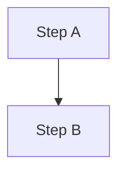

# hipBLASLt Code-Trace Report Writing

<!-- BEGIN CODEX RUNTIME MAPPINGS -->
## Codex runtime mappings

- Treat the applicable root or nested `AGENTS.md` as the authoritative source when the
  workflow refers to the official agent guide.
- Treat Cursor Markdown preview, navigation, and editor behavior as the equivalent preview,
  navigation, and behavior in the current Codex client.
<!-- END CODEX RUNTIME MAPPINGS -->

Use this skill when the task is to produce or revise a report whose goal is to help a
reader **quickly understand part of this repository** by reading prose next to the code.
Typical reports: a runtime call-flow trace, a subsystem overview, the TensileLite kernel
pipeline, GEMM optimization entry points, or a profiling workflow.

This skill defines *how to write the report*, not the content of any one report. Do not
hardcode "read file X then Y"; instead follow the conventions below for whatever flow the
report covers.

## Core principle

A code-trace report must explain not only **what** the code does, but **how the pieces
connect**. A reader with general GPU / C++ background but **no prior context** (no access
to earlier chats, PRs, or unstated assumptions) should be able to follow one chosen flow
end to end by reading the report alongside the linked code.

The report should make clear:

- What the reader will understand after reading it (the one flow or subsystem in scope).
- The plain-language mental model before any code.
- Each step of the flow, in order, with a link to the exact code.
- What the key data structures are and what role each plays.
- How to build / run something that exercises the flow, when applicable.

## Self-contained rule

The report must be understandable from the report alone.

- Do not rely on the reader having seen prior reports unless you cite and briefly summarize them.
- Do not reference "the function we discussed" or any conversation-only context.
- If background from another report is needed, link it and summarize the dependency in one or two lines.

## Audience and language

- Target reader: a new engineer / intern with limited repo context.
- Write narrative in **Traditional Chinese**; keep technical terms, function names, file
  names, and tool names in **English**. Do not force awkward Chinese translations.
- Tone: explain like onboarding a teammate, not like API reference docs.

## Plain-language rule

- **Scope.** This clarity contract is not limited to onboarding documents. Apply it to
  general chat Q&A, reports, guides, reviews, plans, code traces, and experiment
  explanations whenever this skill is active.
- **Overview first.** Open with a plain-language summary or analogy ("像餐廳收單 ->
  派工 -> 出菜") before any code reference.
- **First-use definition.** Before later reasoning depends on a central nontrivial term,
  explain what object it denotes, its role/purpose, its inputs and outputs or contents,
  where it appears in the current flow, why the reader should care, and one concrete
  example. Add a non-example or common confusion when useful. A 3-6 word gloss, acronym
  expansion alone, or replacement with other jargon is not a definition. Split the
  explanation into nearby bullets or a short terminology section when one sentence would
  be overloaded. Simple, familiar terms may stay concise. Terms that usually need a full
  definition include `GEMM`, `tile`, `MFMA`, `kernel`, `solution`, `heuristic`,
  `code object (.co)`, `epilogue`, `lazy load`, `contraction`, `workgroup`, and
  `occupancy`.
- **Acronyms and IDs.** Expand acronyms on first use and explain status IDs or named
  states in words; identifiers such as `R2`, `PASS`, or `W7` do not explain themselves.
- **Counts and formulas.** Before writing compact notation such as
  `10 configs × 3 sizes = 30 rows`, define `config`, `size`, and `row`, show one
  config-size pairing, and distinguish independent units from repeated measurements.
  Keep repetition count separate. For a central formula, define every symbol and unit,
  state whether higher or lower is better, identify the source of constants, and give
  one worked numerical example.
- **Sets and classifications.** For `mandatory atom`, `fresh witness`,
  `conditional target`, `valid support`, or any other set/classification, state the
  membership rule, who creates/selects members and when, which later actor consumes the
  classification and exactly how, and what membership does not prove.
- **Dataflow.** Explain each important handoff as
  **actor -> action -> input -> output -> next consumer**. Name the producer and the
  exact lookup, decision, validation, or transformation performed by the next stage.
  Never stop at "used downstream."
- **Evidence state.** Distinguish planned behavior, live observation, and committed
  result. Distinguish technical `PASS` from a positive, negative, or inconclusive
  scientific outcome.
- **Repair understanding, not wording.** If the user says they do not understand,
  restart from a simpler mental model or analogy and rebuild step by step. Do not merely
  paraphrase the same terms.
- **Plain language, then term.** Every sentence should be understandable on first read;
  introduce the precise term after the plain wording, not before.

## Readability / formatting rule (important)

Readers bounce off walls of text. Optimise every section for scannability.

- **一個 bullet 一個重點 (one idea per line).** Do not chain multiple facts with 頓號/
  分號 into one run-on bullet. If a bullet carries more than ~two facts, split into
  **nested sub-bullets**, one fact each.
- **清單優先於長句 (list over long sentence).** When you are enumerating parallel things
  (steps, params, products, tools), use a bullet / nested-bullet list or a table — never
  pack them into a single sentence.
- **長 paragraph 要斷點分段.** Reserve full paragraphs for genuinely connected narrative.
  Even then, break at a semantic boundary once a paragraph runs past ~3 lines, or convert
  it to a lead sentence + bullet list.
- **`>` callouts stay short.** A `>` blockquote holds **one** short idea. Anything longer
  becomes a lead line + bullets, not a multi-fact blockquote.

## Code reference rule (important)

This replaces the messy habit of pasting absolute paths into prose.

- Cite every concrete code location as a **markdown link** whose text is the symbol or
  function name and whose URL is a **path relative to the report file** plus a line anchor.
- **Do NOT wrap the link text in backticks** — `` [`name`](url) `` renders as raw text (no
  clickable link) in many Markdown previews. Write `[name](url)`. Backticks are only for
  standalone inline code that is **not** a link.
  Reports live inside the repo at `study_docs/hipblaslt/`, so the path climbs out of
  `study_docs/` back to the repo root and into `projects/`; recompute the `../` depth from
  the actual report location:

```md
[runContractionProblem](../../projects/hipblaslt/library/src/amd_detail/rocblaslt/src/tensile_host.cpp#L3235-L3463)
```

- Do **not** paste bare absolute paths inline; they make the document hard to read.
- **Verify line numbers** against the current code before citing - search by symbol name,
  because line numbers drift across commits. If you cannot confirm the range, link the
  file without a line anchor rather than guess.
- Link the **definition site** of a function or struct, not an arbitrary call site, unless
  the call site is the point being made.
- Present a flow's links **in execution order** so the reader can step through them.
- For a list of structures, prefer a table: name | plain-language role | link.
- **Link every reference to a real file or directory** that exists in the repo, so the
  reader can click straight to it. **Link only files that exist** — verify before linking;
  do not create dead links to not-yet-written files.
- **Do NOT link** (keep as plain `inline code`): a bare extension used as a noun
  (「載入 `.co`」), a C++ type (`const void*`), an env var (`HIPBLASLT_TENSILE_LIBPATH`),
  a CLI flag (`--print_kernel_info`), a command fragment, or a runtime-generated output dir
  (`out/`, `3_LibraryLogic/`). These are not navigable source files.

## Diagram rule

- Use a **mermaid** `flowchart` for any multi-step flow or architecture; a picture of the
  pipeline saves paragraphs of prose.
- Keep node labels short; use `subgraph` to separate phases (e.g. build-time vs runtime).
- Follow mermaid constraints: no spaces in node IDs, quote labels with special characters,
  no custom colors/styling, no `click` events.

## One-topic-per-report scope

- One report covers **one coherent flow or subsystem**. Do not mix unrelated flows.
- If a related flow matters, link to its (separate) report and summarize the connection in
  one line, instead of expanding the current report.

## Required content

A complete code-trace report should contain, in roughly this order:

1. **Plain-language overview** - analogy + a 30-second summary of the flow in scope.
2. **Architecture / flow diagram** - a mermaid flowchart of the steps.
3. **Step-by-step trace** - each step: plain explanation, then linked code reference(s),
   then any key data structures touched.
4. **Key data structures** - a table of the structs/classes the reader keeps seeing.
5. **How to build / run / observe** - the command that exercises this flow, when relevant.
6. **Terminology and dataflow** - complete first-use definitions, expanded counts/formulas,
   and explicit producer-to-consumer handoffs; use a short section if many terms recur.
7. **Cross-links** - related reports, and the official `AGENTS.md` for build / PR rules
   (do not duplicate that content here).
8. **One-line takeaway** + a pointer to the logical next report.

## Recommended structure template

Use this skeleton for a new report (section guidance is in Chinese; fill with real content):

````md
# <主題：這份報告帶讀者理解哪一條流程 / 子系統>

> 路徑基準：所有 code 連結為相對於本檔的相對路徑；行號可能隨 commit 漂移，對不上時以符號名稱為準。

## 白話總覽
- 用比喻 + 30 秒摘要說明這條流程在做什麼、為什麼存在。

## 架構 / 流程圖


## 逐步 trace
1. **<步驟名>** - 白話說明這一步在做什麼。
   - 程式碼：[symbolName](<relative/path>#L起-L迄)
2. ...

## 關鍵資料結構
| 結構 | 角色（白話） | 位置 |
|------|--------------|------|
| `Foo` | 一句話說明 | [Foo](<relative/path>#L..-L..) |

## 如何建置 / 執行以觀察此流程
- 指令與預期輸出（若適用）。

## 名詞與資料流
- `term`：它是哪個物件、用途、輸入/輸出或內容、位於流程哪裡、為何重要、具體例子，
  以及必要時的非例子。
- 資料流：誰產生什麼輸出、下一個 actor 如何用它做哪個判斷或轉換。

## 交叉連結
- 相關報告：[other-report](<relative/path>)
- build / PR 規範見官方 [AGENTS.md](<relative/path/AGENTS.md>)（本報告不重複）。

## 一句話總結
> ... 下一篇看 [next-report](<relative/path>)。
````

## Anti-patterns

- Pasting bare absolute paths into prose instead of relative markdown links.
- A wall of jargon with no plain-language overview or complete first-use definitions.
- Mixing several unrelated flows into one report.
- Guessing line numbers without verifying them against the current code.
- Re-explaining build / PR rules already covered by the official `AGENTS.md`.
- Run-on bullets that pack many facts into one line.
- Multi-fact `>` blockquotes; reserve `>` for one short callout idea and split anything longer into a lead line + bullets.

**Bad:**

```text
10 configs × 3 sizes = 30 rows. A fresh witness covers the mandatory atom and is used downstream.
```

The counted objects, repetition boundary, classification rules, actors, exact use, and
unsupported conclusions are all hidden.

**Good count explanation:**

```text
A config is one complete choice of settings being compared; for example, C03
processes a 128-by-128 output block with 256 GPU threads. A size is one input
shape; for example, S02 multiplies a 1024-by-512 matrix by a 512-by-1024 matrix.
A row records one C03-S02 pairing. Thus 10 configs × 3 distinct sizes creates
30 independently specified pairings, not 30 repetitions of one condition;
timing repetitions inside each pairing are counted separately.
```

**Good classification and dataflow explanation:**

```text
Toy protocol example (not a default project definition): the design author places
mandatory atom A in the frozen required set before results are visible. The runner
then produces observation W7. W7 is a fresh witness for A only if it was not used to
choose A and it satisfies A's declared evidence rule. After the run, the verifier
classifies W7 as valid support only when that rule passes; the claim evaluator then
counts A as having qualifying evidence. This supports A only; it does not prove the
overall hypothesis. The design author also predeclares conditional target T. The
scheduler consumes A's verdict and activates T only after A passes; activation does
not mean T has passed.
```

## Self-audit before delivery

Before finalizing a report, confirm:

- [ ] Opens with a plain-language overview or analogy.
- [ ] Has a mermaid flow / architecture diagram for any multi-step flow.
- [ ] Every code reference is a relative-path markdown link, and the line ranges were verified.
- [ ] For every central term, a first-time reader can answer: what is it, why does it
      exist, how does it act or move, what is one example, who consumes it next and
      exactly how, and what conclusion is not implied.
- [ ] No first-use definition is only a 3-6 word gloss, acronym expansion, or different jargon.
- [ ] Acronyms, status IDs, set membership, and compact count notation are explained;
      any central formula defines symbols, units, direction, constant sources, and a
      worked example.
- [ ] Dataflow names actor, action, input, output, and next consumer; no handoff stops at
      "used downstream."
- [ ] Planned behavior, live observation, committed result, technical `PASS`, and
      scientific outcome are not conflated.
- [ ] A reader with no prior context can follow the flow from the report alone.
- [ ] The report stays within one topic; related flows are linked, not merged.
- [ ] Ends with a one-line takeaway and a pointer to the next report.
- [ ] No run-on bullets / over-long paragraphs: multi-fact bullets are split into nested
      sub-bullets, long paragraphs are broken at a semantic boundary or turned into lists.
- [ ] Every reference to an existing repo file/directory is a clickable relative-path link;
      extensions/types/env vars/flags/output dirs are left as plain inline code, not linked.
