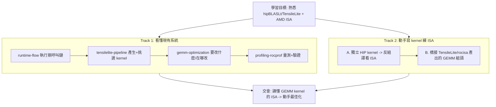
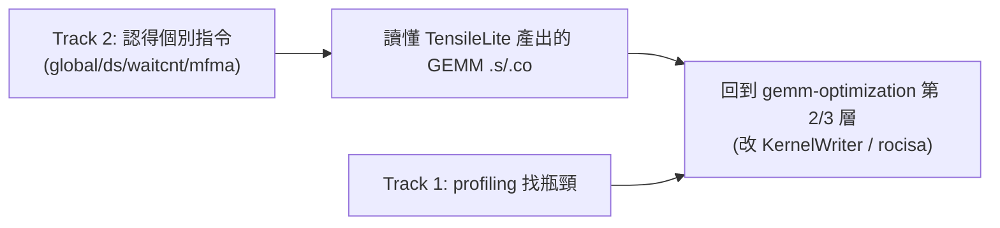

# study_docs 總綱：hipBLASLt / TensileLite 與 AMD ISA 學習地圖

這是整個學習旅程的「地圖」。目標有兩個，互相搭配：

1. **看懂現有系統** — hipBLASLt（AMD GPU 的 GEMM library）與它內建的 kernel 產生器 TensileLite，
   從一次 GEMM 呼叫一路走到最佳化與 profiling。
2. **動手練功** — 自己寫 GPU kernel、反組譯看組合語言，熟悉 AMD ISA（gfx942 / MI300、CDNA3），
   最後接回 TensileLite 看 production GEMM kernel 的組語。

> 路徑說明：本檔在 repo 內的 `study_docs/`（最上層）。連到子主題文件用相對路徑（如 `hipblaslt/runtime-flow.md`）；
> 連到原始碼用 `../projects/...`（往上一層回到 repo root 再進 `projects/`）。行號可能隨 commit 漂移，對不上時以符號名稱為準。

## 30 秒總覽

hipBLASLt 算的是一條 GEMM 公式：`D = Activation(alpha * op(A) * op(B) + beta * op(C) + bias)`。
它本身**不手寫**每種 GPU kernel，而是用 TensileLite 在**建置時**自動產生大量候選 kernel、benchmark 後挑最佳解，
包成查表用的 library；**執行時**再依當下矩陣大小查表選 kernel 並載入執行。

可以把它想成餐廳：

- **TensileLite（建置時）**= 後廚試做大量菜色、評分，寫成「哪種訂單配哪道菜」的食譜。
- **hipBLASLt runtime（執行時）**= 前台收單、查食譜選菜、叫對應師傅（kernel）出菜。
- **AMD ISA 練功軌**= 自己進廚房學基本刀工（指令），看懂師傅實際怎麼切（GEMM kernel 的組語）。

> 名詞：**GEMM** = 一般化矩陣乘法。**kernel** = GPU 上實際執行的運算程式。**ISA** = 指令集架構，
> 這裡指 AMDGPU（gfx942）的組合語言指令。

## 學習旅程圖

## 先備：整個 repo 架構地圖

不確定各資料夾是什麼、想先有全貌，先看 [architecture/README.md](architecture/README.md)：它說明這個 ROCm superbuild 的頂層布局、本機 sparse checkout 的實況（只有 hipBLASLt 完整），並逐一解說各 folder/subfolder 的角色。

## Track 1：看懂 hipBLASLt + TensileLite

完整內容在 [hipblaslt/](hipblaslt/) 子資料夾，以 [hipblaslt/README.md](hipblaslt/README.md) 為該主題入口。建議閱讀順序：

1. [hipblaslt/runtime-flow.md](hipblaslt/runtime-flow.md) — 一次 `hipblasLtMatmul` 呼叫到 kernel 跑起來，發生什麼事（最容易有成就感）。
2. [hipblaslt/tensilelite-pipeline.md](hipblaslt/tensilelite-pipeline.md) — 那些 kernel 與選擇邏輯是怎麼產生與挑選的（三階段）。
3. [hipblaslt/gemm-optimization.md](hipblaslt/gemm-optimization.md) — 想動手最佳化時，參數與 codegen 在哪裡改。
4. [hipblaslt/profiling-rocprof.md](hipblaslt/profiling-rocprof.md) — 改完怎麼用 rocprof + benchmark 證明真的變快。

## Track 2：寫 GPU kernel 熟悉 AMD ISA

細節在 [amd-isa-kernel.md](amd-isa-kernel.md)，採**分階段**（先打底再橋接）：

- **階段 A（先打底）** — 自己寫最小 HIP kernel（vector add → tiled matmul → MFMA intrinsic），
  用 `hipcc --save-temps` 或 `llvm-objdump -d` 反組譯，對照 source 與 gfx942 組語。迴圈最短、相依最少，
  是從零熟悉指令最有效率的方式。
- **階段 B（再橋接）** — TensileLite **不走 hipcc 編 C++**，而是由 `KernelWriter.py` 透過 `rocisa`
  **程式化產生組合語言**。把階段 A 學到的指令知識（`global_load`、`ds_read`、`s_waitcnt`、`v_mfma_*`）
  對應回 TensileLite 產出的 GEMM kernel 組語，理解 prefetch / double buffer / MFMA 排程。

> 為什麼先 A 後 B：你的核心目標是「熟悉 AMD ISA」，A 的 source↔ISA 對應最直接；而 `rocisa` 本質就是
> 「用程式寫組語」，A 學到的指令能直接遷移到讀 TensileLite 的輸出，自然接回 Track 1 的最佳化。

## 兩軌如何交會

熟悉 ISA 後，最佳化就不再是黑箱：你能讀懂 [hipblaslt/gemm-optimization.md](hipblaslt/gemm-optimization.md)
提到的第 2 層（改 `kernelBody()` codegen）與第 3 層（改 rocisa 指令），並用
[hipblaslt/profiling-rocprof.md](hipblaslt/profiling-rocprof.md) 的指標驗證。

## 全域 Terminology

- **GEMM** - 一般化矩陣乘法。
- **kernel** - GPU 上實際執行的運算程式。
- **solution** - 一個具體 kernel 的設定組合（含 tile 大小等參數）。
- **TensileLite** - hipBLASLt 內建、建置時產生並挑選 kernel 的框架。
- **rocisa** - 組裝 AMDGPU 指令的 C++ 工具庫；`KernelWriter.py` 像在用它寫組合語言。
- **ISA** - 指令集架構；本 repo 目標為 AMDGPU gfx942（MI300 / CDNA3）。
- **MFMA** - AMD 矩陣乘加指令（`v_mfma_*`），GEMM 在 CDNA GPU 上的核心算力來源。
- **code object (.co)** - 編譯好的 GPU 機器碼檔。

## 交叉連結

- 整個 repo 架構地圖：[architecture/README.md](architecture/README.md)
- Track 1 主題入口：[hipblaslt/README.md](hipblaslt/README.md)
- Track 2 動手細節：[amd-isa-kernel.md](amd-isa-kernel.md)
- build / PR 規範以官方文件為準：[hipblaslt/AGENTS.md](../projects/hipblaslt/AGENTS.md)、[tensilelite/AGENTS.md](../projects/hipblaslt/tensilelite/AGENTS.md)（本文件組不重複）。

## 一句話總結

> 兩條軌：Track 1 看懂「建置時做食譜 + 執行時查食譜出菜」；Track 2 自己練刀工（ISA），最後讀懂師傅怎麼切。
> 不知從哪開始就先看 [hipblaslt/runtime-flow.md](hipblaslt/runtime-flow.md)，想動手練 ISA 就看 [amd-isa-kernel.md](amd-isa-kernel.md)。
