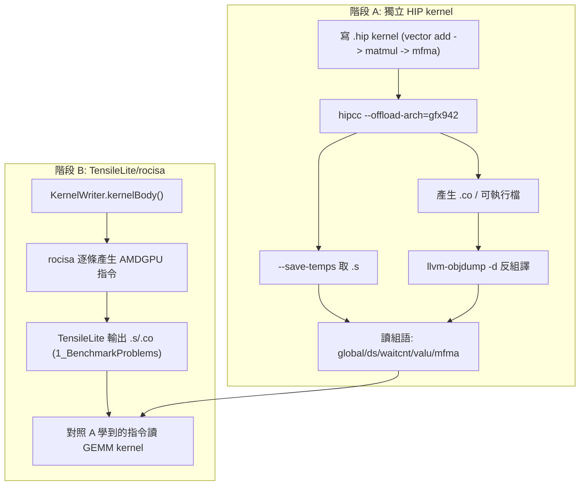

# 寫 GPU kernel 熟悉 AMD ISA（gfx942 / MI300）

> 路徑說明：本檔在 repo 內的 `study_docs/`（最上層）。連到原始碼用 `../projects/...`（往上一層回到 repo root 再進 `projects/`）。
> 行號可能隨 commit 漂移，對不上時以符號名稱為準。建議先讀總綱 [README.md](README.md)。

## 白話總覽

熟悉 AMD ISA 就像學語言：**先學單字（個別指令），再讀整篇文章（一支完整 GEMM kernel 的組語）**。所以分兩階段：

- **階段 A（先學單字）** — 自己寫最小的 HIP kernel，編譯後**反組譯**看它變成哪些 gfx942 指令。
  迴圈短、相依少、source 與組語一一對應，最適合從零認得指令。
- **階段 B（再讀文章）** — TensileLite **不走 hipcc 編 C++**，而是用 `KernelWriter.py` 透過 `rocisa`
  **程式化產生組合語言**。把階段 A 認得的指令對應回 TensileLite 產出的 GEMM kernel 組語，理解
  prefetch、double buffer、MFMA 排程等真實手法。

> 名詞：**ISA** = 指令集架構（這裡是 AMDGPU gfx942 的組語）。**反組譯（disassemble）** = 把編譯好的機器碼還原成可讀的組語。

## 架構 / 流程圖



## 前置：定位工具（重要）

本機 `hipcc` / `llvm-objdump` / `rocprof` **不一定在預設 PATH**，先找出 ROCm 安裝路徑再用：

```bash
# 1. 找 ROCm（常見在 /opt/rocm 或 /opt/rocm-*）
ls -d /opt/rocm* 2>/dev/null
# 2. 確認工具位置與版本
which hipcc || ls /opt/rocm*/bin/hipcc
/opt/rocm*/bin/hipconfig --full        # 印出 HIP/ROCm 設定與路徑
/opt/rocm*/llvm/bin/llvm-objdump --version
# 3. 確認本機 GPU 架構（應為 gfx942）
/opt/rocm*/bin/rocminfo | grep -i gfx
```

> 後續指令以 `hipcc` / `llvm-objdump` 表示，實際請換成上面找到的完整路徑。目標架構統一用 `--offload-arch=gfx942`。

## 階段 A：寫獨立 HIP kernel → 反組譯看 ISA

> **對應可跑範例**：主管整理的 [`asm/`](../../asm)（在 repo 外的同層 `/data1/perlee/asm`，容器內 `/src/asm`）
> 已有四個完整可編譯、重注解的 gfx942 範例，是本階段最好的對照教材：
> [example01_reduce_sum](../../asm/example01_reduce_sum)（手寫 AMDGCN baseline）、
> [example02_reduce_sum](../../asm/example02_reduce_sum)（rocprof-compute 找瓶頸 → `dwordx4` 向量化，1.9×；
> **優化/profiling 概念最佳單篇教材**）、
> [example03_mfma](../../asm/example03_mfma)（MFMA GEMM + LDS tiling，最接近最終工作）、
> [example04_global_mem_oob](../../asm/example04_global_mem_oob)（buffer descriptor / 邊界檢查）。
> 各範例容器內 `cmake -S . -B build && cmake --build build` 即可跑。整體時程見 [learning-roadmap.md](learning-roadmap.md)。

### A-1：最小 kernel（vector add），先看基本指令

寫一支最小 kernel（例如 `vadd.hip`）：

```cpp
#include <hip/hip_runtime.h>

__global__ void vadd(const float* a, const float* b, float* c, int n) {
    int i = blockIdx.x * blockDim.x + threadIdx.x;
    if (i < n) c[i] = a[i] + b[i];
}
```

編譯並取得組語（兩種方式擇一）：

```bash
# 方式 1：--save-temps 直接吐中間檔（含 .s 組語）
hipcc --offload-arch=gfx942 --save-temps -c vadd.hip -o vadd.o
#   產生的 *-gfx942.s 就是裝置端組語

# 方式 2：對編好的 code object 反組譯
hipcc --offload-arch=gfx942 -c vadd.hip -o vadd.o
llvm-objdump -d --mcpu=gfx942 vadd.o      # 或對最終 .co / 可執行檔反組譯
```

對照重點指令（看到就認得在做什麼）：

| 指令家族 | 白話 | 對應 source |
|----------|------|-------------|
| `s_load_*` | 從常數/kernarg 載入純量（指標、n） | 讀函式參數 |
| `v_*`（`v_add_u32` 等）| 算每個 thread 的索引 | `blockIdx*blockDim+threadIdx` |
| `global_load_*` / `global_store_*` | 從/往 global memory 讀寫 | 讀 `a[i]`、`b[i]`、寫 `c[i]` |
| `v_add_f32` | 浮點加 | `a[i] + b[i]` |
| `s_waitcnt` | 等記憶體/向量指令完成（計數器） | 編譯器插入的同步 |
| `s_endpgm` | kernel 結束 | 函式返回 |

> 名詞：**VGPR**（vector reg，每 thread 各一份）/ **SGPR**（scalar reg，整個 wavefront 共用）。
> `s_waitcnt` 的 `vmcnt/lgkmcnt` 計數器是讀懂記憶體延遲與同步的關鍵。

### A-2：tiled matmul，認識 LDS（shared memory）

把 vector add 換成用 shared memory 做 tile 的小 matmul（`__shared__` 陣列）。重點是觀察 LDS 指令：

| 指令 | 白話 |
|------|------|
| `ds_write_b32/b64/b128` | 寫入 LDS（把 global 載入的 tile 放進 shared） |
| `ds_read_b32/b64/b128` | 從 LDS 讀回暫存器 |
| `s_barrier` | workgroup 內同步（等大家都寫完 LDS 再讀） |

這對應 GEMM 的核心手法：先把 A/B 的小塊搬進 LDS 重用，減少 global memory 流量。

> 名詞：**LDS** = Local Data Share，workgroup 共用的高速 shared memory。
> 對照範例：[example03_mfma](../../asm/example03_mfma) 用 LDS staging 一個 `32×32` 的 GEMM tile，
> 是 `ds_read`/`ds_write`/`s_barrier` 與 reuse 手法的完整實例。

### A-3：召喚 MFMA 指令

GEMM 算力來自 MFMA（矩陣乘加）。可用 compiler builtin 直接產生：

```cpp
// 範例：以 builtin 召喚一個 MFMA（型別/形狀依需求選對應 builtin）
// using float4 = __attribute__((ext_vector_type(4))) float;
// acc = __builtin_amdgcn_mfma_f32_16x16x16f16(a_frag, b_frag, acc, 0, 0, 0);
```

編譯後在組語裡找 `v_mfma_*`（如 `v_mfma_f32_16x16x16_f16`）。認得它，就能在階段 B 讀懂 GEMM kernel 的主迴圈在做什麼。

> 名詞：**MFMA** = Matrix Fused Multiply-Add，AMD CDNA 的矩陣乘加指令，是 GEMM 的核心算力來源。
> 對照範例：[example03_mfma](../../asm/example03_mfma) 直接用 `v_mfma_f32_16x16x4_f32` 手寫 GEMM，
> README 詳列 MFMA register layout（哪個 lane 持有哪個 A/B/C 元素），是讀懂主迴圈的關鍵。

## 階段 B：橋接 TensileLite / rocisa 產出的 GEMM 組語

### B-1：TensileLite 怎麼產生組語（不是 hipcc）

TensileLite 的 GEMM kernel **不是 HIP C++ 編出來的**，而是由 `KernelWriter.py` **直接組裝組合語言**，
再交給 `rocisa`（C++ / Nanobind）逐條吐出 AMDGPU 指令。也就是說，你在階段 A 反組譯看到的指令，
TensileLite 是**用程式一條一條寫出來的**。

- kernel 主體建構：[kernelBody()](../projects/hipblaslt/tensilelite/Tensile/KernelWriter.py#L5279)
- 產生 source 的入口：[_getKernelSource()](../projects/hipblaslt/tensilelite/Tensile/KernelWriter.py#L10602)
- rocisa 的 MFMA 指令定義（看「指令如何被程式建構」）：
  - [mfma.cpp](../projects/hipblaslt/tensilelite/rocisa/rocisa/src/instruction/mfma.cpp)
  - [mfma.hpp](../projects/hipblaslt/tensilelite/rocisa/rocisa/include/instruction/mfma.hpp)

> 名詞：**rocisa** = 專門「組裝 AMDGPU 指令」的 C++ 工具庫；`KernelWriter.py` 像在用它寫組合語言。

### B-2：拿到一支真實 GEMM kernel 的組語來讀

跑一次 TensileLite tuning，產出的候選 kernel 原始碼（含 `.s` 組語）與 `.co` 會落在 `1_BenchmarkProblems/`
（三階段與輸出目錄見 [hipblaslt/tensilelite-pipeline.md](hipblaslt/tensilelite-pipeline.md)）：

```bash
cd /data1/perlee/rocm-libraries/projects/hipblaslt/tensilelite
invoke rocisa && invoke build-client        # 一次性準備
Tensile/bin/Tensile <config.yaml> out/
#   out/1_BenchmarkProblems/.../*.s   <- 產生的組語（直接可讀）
#   對 .co 也可用 llvm-objdump -d --mcpu=gfx942 反組譯
```

### B-3：把階段 A 的指令對應回 GEMM kernel

讀 GEMM kernel 組語時，用階段 A 認得的指令家族當索引，辨認出這些經典手法：

| 在組語裡看到 | 對應的 GEMM 手法 |
|--------------|------------------|
| 一批 `global_load_*` 後接 `ds_write_*` | 把 A/B tile 從 global 搬進 LDS |
| 成對交錯的 `ds_read_*` 與 `v_mfma_*` | 從 LDS 餵資料給 MFMA 做主乘法 |
| 主迴圈前先做一輪 load（領先一個迭代） | **prefetch**：先載下一塊以掩蓋延遲 |
| 兩組 LDS buffer 輪流讀寫 | **double buffer**：算這塊同時搬下一塊 |
| 密集的 `s_waitcnt vmcnt/lgkmcnt` | 指令排程：精準控制何時等記憶體 |

接著就能回到 [hipblaslt/gemm-optimization.md](hipblaslt/gemm-optimization.md) 的第 2 層（改 `kernelBody()` codegen）
與第 3 層（改 rocisa 指令），並用 [hipblaslt/profiling-rocprof.md](hipblaslt/profiling-rocprof.md) 驗證改動。

## 關鍵檔案 / 結構

| 檔案 | 角色（白話） | 位置 |
|------|--------------|------|
| `KernelWriter.kernelBody()` | 組裝 GEMM kernel 主體（程式化寫組語） | [定義](../projects/hipblaslt/tensilelite/Tensile/KernelWriter.py#L5279) |
| `_getKernelSource()` | 產生 kernel source 的入口 | [定義](../projects/hipblaslt/tensilelite/Tensile/KernelWriter.py#L10602) |
| rocisa MFMA 指令 | `v_mfma_*` 等指令如何被程式建構 | [mfma.cpp](../projects/hipblaslt/tensilelite/rocisa/rocisa/src/instruction/mfma.cpp) |
| `1_BenchmarkProblems/` | TensileLite 產出的候選 kernel `.s` / `.co` | 見 [tensilelite-pipeline.md](hipblaslt/tensilelite-pipeline.md) |

## Terminology

- `VGPR` / `SGPR` - 向量暫存器（每 thread）/ 純量暫存器（每 wavefront 共用）。
- `LDS` - workgroup 共用的高速 shared memory（`ds_read`/`ds_write` 存取）。
- `s_waitcnt` - 等記憶體/向量指令完成的計數器同步指令（`vmcnt`/`lgkmcnt`）。
- `MFMA` / `v_mfma_*` - AMD 矩陣乘加指令，GEMM 算力來源。
- `code object (.co)` - 編譯好的 GPU 機器碼檔，可用 `llvm-objdump -d` 反組譯。
- `prefetch` / `double buffer` - 領先載入 / 雙緩衝，用來掩蓋記憶體延遲的經典手法。

## 交叉連結

- 上一層總綱：[README.md](README.md)
- GEMM kernel 怎麼產生與挑選：[hipblaslt/tensilelite-pipeline.md](hipblaslt/tensilelite-pipeline.md)
- 要改哪一層 codegen / 參數：[hipblaslt/gemm-optimization.md](hipblaslt/gemm-optimization.md)
- 改完怎麼量測驗證：[hipblaslt/profiling-rocprof.md](hipblaslt/profiling-rocprof.md)
- build / PR 規範見官方 [tensilelite/AGENTS.md](../projects/hipblaslt/tensilelite/AGENTS.md)（本文件不重複）。

## 一句話總結

> 先用獨立 HIP kernel 反組譯認得單字（`global`/`ds`/`s_waitcnt`/`v_mfma`），
> 再把這些單字對應回 TensileLite/rocisa 產出的 GEMM 組語，就能讀懂並動手最佳化真實 kernel。
