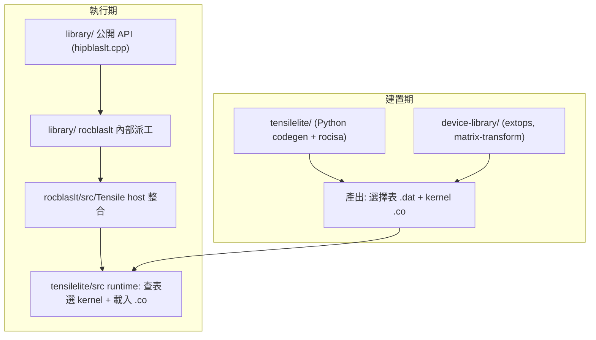

# hipBLASLt 資料夾結構解說（哪個 folder 是做什麼的）

路徑說明：本檔在 `study_docs/architecture/`。連到原始碼用 `../../projects/...`。

本篇只講「**資料夾是什麼、放什麼**」；**執行期 / 產生 kernel 的行為**請看 [../hipblaslt/](../hipblaslt/) 的四篇導讀，不在此重述。

## 白話總覽

`projects/hipblaslt` 是本機唯一完整的庫。它有三個最重要的部分：

1. **`library/`** — hipBLASLt 本體：公開 API ＋ 內部 GEMM 派工層（執行期跑的就是這）。
2. **`tensilelite/`** — 內建的 kernel 產生器（建置期產生並挑選 GPU kernel）。
3. **`device-library/`** — 額外的裝置端 kernel（如 ext op、矩陣轉換）。

其餘資料夾多為建置、測試、文件、工具。

## 頂層資料夾

| 資料夾 | 是什麼 |
|--------|--------|
| [library/](../../projects/hipblaslt/library) | hipBLASLt 函式庫本體（公開 API + 內部 `rocblaslt` 派工層）。 |
| [tensilelite/](../../projects/hipblaslt/tensilelite) | kernel 產生器（Python codegen + C++ runtime + rocisa），建置期用。 |
| [device-library/](../../projects/hipblaslt/device-library) | 裝置端 kernel：`extops/`、`matrix-transform/`。 |
| [clients/](../../projects/hipblaslt/clients) | 可執行用戶端：benchmark、測試、範例。 |
| [deps/](../../projects/hipblaslt/deps) | 第三方相依的取得設定（gtest、lapack 等）。 |
| [docs/](../../projects/hipblaslt/docs) | 官方文件來源（doxygen、how-to、conceptual 等）。 |
| [scripts/](../../projects/hipblaslt/scripts) | 輔助腳本（如 Tensile logic 檢查）。 |
| [tools/](../../projects/hipblaslt/tools) | 雜項工具腳本。 |
| [utilities/](../../projects/hipblaslt/utilities) | tuning 輔助（`QuickTune`、YAML 修正工具等）。 |
| [cmake/](../../projects/hipblaslt/cmake) | 本庫專屬 CMake 設定（找 BLIS、python、支援架構等）。 |
| [docker/](../../projects/hipblaslt/docker) | 建置/開發用 Dockerfile。 |
| `build/` | 建置輸出目錄（產生物，非原始碼）。 |

> 建置指令與規範以官方 [AGENTS.md](../../projects/hipblaslt/AGENTS.md) 為準，本文件不重複。

## `library/`：函式庫本體

```
library/
├── include/hipblaslt/        # 公開 C/C++ API header（對外）
└── src/amd_detail/
    ├── hipblaslt.cpp         # 公開 API 薄層：轉型別後轉呼叫內部 rocblaslt
    ├── include/
    └── rocblaslt/            # 內部 GEMM 派工層（真正幹活的地方）
        ├── include/
        └── src/
            ├── Tensile/      # Tensile host 整合（載入 library、選 solution、launch）
            └── rocroller/    # legacy rocRoller 自訂 kernel（gated）
```

- [include/hipblaslt/](../../projects/hipblaslt/library/include/hipblaslt) — 使用者 include 的公開 header（`hipblaslt.h`、`hipblaslt-ext.hpp` 等）。
- [src/amd_detail/hipblaslt.cpp](../../projects/hipblaslt/library/src/amd_detail/hipblaslt.cpp) — 公開 API 入口，把 opaque handle 轉成內部型別後轉呼叫 `rocblaslt`。
- [src/amd_detail/rocblaslt/](../../projects/hipblaslt/library/src/amd_detail/rocblaslt) — 內部層：參數驗證、組「訂單」、Tensile host 整合（`src/Tensile/`）、以及一組 legacy rocRoller kernel（`src/rocroller/`）。

> 對應行為：這條呼叫鏈（API → rocblaslt → tensile_host → 選 kernel → launch）詳見 [../hipblaslt/runtime-flow.md](../hipblaslt/runtime-flow.md)。

## `tensilelite/`：kernel 產生器（in-repo fork）

```
tensilelite/
├── Tensile/        # Python：kernel codegen 與 tuning 驅動
│   ├── Common/         # 全域參數、架構表、常數
│   ├── Components/     # 模組化 kernel 元件（MAC、read/write、排程）
│   ├── SolutionStructs/# Solution / Problem 資料結構
│   ├── Source/         # source-kernel 模板與輔助
│   ├── CustomKernels/  # 手寫自訂 kernel
│   ├── KernelWriter*.py# 產生 GPU 組語的核心（呼叫 rocisa）
│   ├── BenchmarkProblems.py / LibraryLogic.py / ClientWriter.py  # 三階段
│   └── ...
├── rocisa/         # C++ (Nanobind)：逐條產生 AMDGPU 指令
├── client/         # TensileLite 自己的 benchmark client（含 rocprofiler 整合）
├── src/ include/   # C++ runtime library（執行期選 kernel/dispatch）
└── tests/          # 測試
```

- [Tensile/](../../projects/hipblaslt/tensilelite/Tensile) — Python 端：把 YAML 設定 fork 成候選 kernel、產生組語、跑 benchmark、挑最佳解、打包 library（三階段 `BenchmarkProblems → LibraryLogic → ClientWriter`）。
- [rocisa/](../../projects/hipblaslt/tensilelite/rocisa) — C++ 指令產生庫；[KernelWriter.py](../../projects/hipblaslt/tensilelite/Tensile/KernelWriter.py) 透過它逐條吐出 `v_mfma_*` 等 AMDGPU 指令。
- [src/](../../projects/hipblaslt/tensilelite/src)、[include/](../../projects/hipblaslt/tensilelite/include) — 執行期 C++ runtime（`ContractionSolution`、`MasterSolutionLibrary`、`HipSolutionAdapter` 等）。

對應行為：

- 三階段與輸出目錄詳見 [../hipblaslt/tensilelite-pipeline.md](../hipblaslt/tensilelite-pipeline.md)。
- 想動手改 codegen / 練 ISA 見 [../amd-isa-kernel.md](../amd-isa-kernel.md)。

## `device-library/` 與 `clients/`

- [device-library/](../../projects/hipblaslt/device-library)
  - [extops/](../../projects/hipblaslt/device-library/extops) — 額外運算 kernel（如 AMax、LayerNorm、Softmax 類 ext op）。
  - [matrix-transform/](../../projects/hipblaslt/device-library/matrix-transform) — 矩陣轉換 kernel。
- [clients/](../../projects/hipblaslt/clients)
  - [bench/](../../projects/hipblaslt/clients/bench) — `hipblaslt-bench`（量測 GEMM、印出選到的 solution）。
  - [tests/](../../projects/hipblaslt/clients/tests) — gtest（由 `data/` 的 YAML 驅動）。
  - [samples/](../../projects/hipblaslt/clients/samples) — 獨立使用範例。
  - [common/](../../projects/hipblaslt/clients/common)、[scripts/](../../projects/hipblaslt/clients/scripts) — 用戶端共用程式與腳本。

## 三大部分如何串起來



一句話：`tensilelite/` 與 `device-library/` 在**建置期**做出 `.co` 與選擇表；`library/` 在**執行期**查表並載入它們。

這條 build→runtime 交接的細節見 [../hipblaslt/README.md](../hipblaslt/README.md)。

## 交叉連結

- 全 repo 架構地圖：[README.md](README.md)
- 共用依賴與建置骨架：[shared-and-build.md](shared-and-build.md)
- hipBLASLt 行為導讀：[../hipblaslt/README.md](../hipblaslt/README.md)

## 一句話總結

**[library/](../../projects/hipblaslt/library) = 本體（執行期）、[tensilelite/](../../projects/hipblaslt/tensilelite) = kernel 產生器（建置期）、[device-library/](../../projects/hipblaslt/device-library) = 額外裝置 kernel；其餘是建置 / 測試 / 文件 / 工具。**
