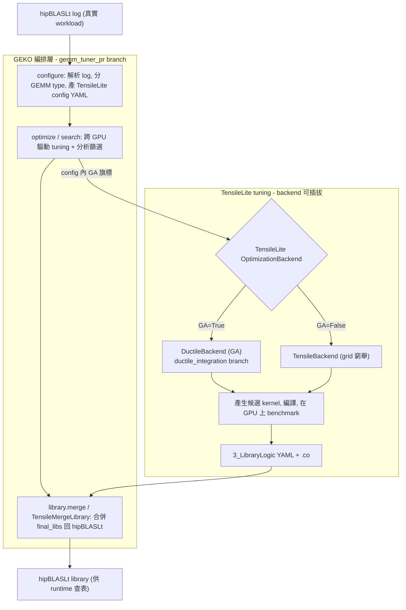
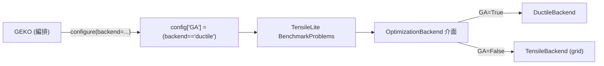

# GEKO 與 Ductile 深入導讀：GEMM tuning 的「編排層」與「GA 搜尋引擎」

路徑說明：本檔在 `study_docs/geko-ductile/`。連 study_docs 其他文件用相對路徑（如 `../hipblaslt/component-interactions/README.md`）；連原始碼往上兩層回 repo root：`../../projects/...`。行號會隨 commit 漂移，以符號名稱為準。

> 這一組文件是**寫給想弄懂 GEMM tuning 自動化流程的讀者**。GEKO 與 Ductile 常被混為一談，其實是**上下層**兩個東西。本檔先建立全景與界線，細節分兩篇：
>
> - [geko-deep-dive.md](geko-deep-dive.md) — GEKO 編排框架（讀 log → 產 config → 驅動 tuning → merge 回 hipBLASLt）。
> - [ductile-deep-dive.md](ductile-deep-dive.md) — Ductile 基因演算法搜尋引擎（TensileLite 的一個 tuning backend）。
>
> **來源提醒**：GEKO 與 Ductile 的原始碼目前都**不在 develop / working tree**，各自在一條尚未 merge 的 PR branch：GEKO 在 `origin/gemm_tuner_pr`（`projects/hipblaslt/utilities/geko/`），Ductile 在 `origin/ductile_integration`（`tensilelite/Tensile/ductile/` 等）。本組文件引用的真實檔案可用 `git show origin/<branch>:<path>` 讀取。

## 一句話總結（先看這句）

> **Ductile 是「用基因演算法取代 grid 窮舉來搜 kernel 參數」的 TensileLite tuning 引擎；GEKO 是「讀真實 workload、自動產生設定、跨 GPU 驅動 tuning、再把結果合併回 hipBLASLt」的最外層編排框架。GEKO 底下可以選 Ductile（GA）或 tensile（grid）當搜尋引擎。**

## 30 秒直覺：tuning 層 vs selection 層

先把 GEMM 生態切成兩層，避免把 Ductile/GEKO 跟 origami/Formocast 搞混：

- **tuning 層（決定「有哪些 kernel、每個 shape 最佳參數」）**：離線把 kernel 產生+調校出來。成員：TensileLite 的 **grid 窮舉**、**Ductile（GA）**、**GEKO（編排）**。
- **selection 層（執行時「從既有 solution 挑一個」）**：runtime 預測選 kernel。成員：equality/grid-based 查表、**origami**、**Formocast**。

本組文件只講 **tuning 層** 的 GEKO 與 Ductile。selection 層與整體交互見 [../hipblaslt/component-interactions/README.md](../hipblaslt/component-interactions/README.md)。

> 為什麼要分清楚？因為實務上很多「hipBLASLt 效能不好」其實是 **selection 層**選錯 kernel，而不是 tuning 層缺 kernel。動用 GEKO/Ductile 重 tune 之前，通常該先確認 selection 有沒有把既有 library 用好（見 [../internal_docs/ductile-tensilelite-tuning.md](../internal_docs/ductile-tensilelite-tuning.md) 的分層策略）。

## 全景關係圖

**兩句話讀懂：**

1. **GEKO 在最外層編排**：把「讀 log → 產 config → 跑 tuning → 合併回 hipBLASLt」串成自動化流程，自己不搜參數。
2. **Ductile 在 TensileLite 內部當搜尋引擎**：它是 TensileLite `OptimizationBackend` 介面的 GA 實作，與 `TensileBackend`（grid 窮舉）並列；GEKO 只是透過 config 的 `GA` 旗標決定用哪一個。

## GEKO ≠ Ductile：關鍵是「可插拔 backend」這個接點

最容易誤會的地方：以為 GEKO 就是 Ductile。實際上 TensileLite 有一個**可插拔的最佳化 backend 介面**，Ductile 只是其中一種實作：

- 介面：[backends/base.py](../../projects/hipblaslt/tensilelite/Tensile/backends/base.py) 的 `OptimizationBackend`（抽象類別，定義 `run(...)`）。
- 實作一：[backends/tensile_backend.py](../../projects/hipblaslt/tensilelite/Tensile/backends/tensile_backend.py) 的 `TensileBackend` — **exhaustive fork parameter enumeration**（grid 窮舉）。
- 實作二：[backends/ductile_backend.py](../../projects/hipblaslt/tensilelite/Tensile/backends/ductile_backend.py) 的 `DuctileBackend` — **genetic algorithm**（GA）。

所以三者關係是：

- **沒有 GEKO，Ductile 仍可用**：直接跑 TensileLite tuning、選 Ductile backend 即可（甚至獨立 `Ductile --convert-config`）。
- **沒有 Ductile，GEKO 仍可用**：GEKO `--backend tensile` 就退回 grid 窮舉。
- **兩者常一起用**：GEKO `--tune` 預設 `--backend ductile`，因為 GA 對大空間/hot shape 更有效率。

## 三個名詞的一句話定位 + codebase 來源

| 名詞 | 屬哪層 | 一句話 | codebase 來源 |
| --- | --- | --- | --- |
| **GEKO** | tuning 編排 | 讀 log → configure → optimize/search → merge 回 hipBLASLt 的 Python 框架 | `origin/gemm_tuner_pr`：`projects/hipblaslt/utilities/geko/` |
| **Ductile** | tuning 搜尋引擎 | TensileLite `OptimizationBackend` 的 GA 實作，取代 grid 窮舉 | `origin/ductile_integration`：`tensilelite/Tensile/ductile/` + `backends/ductile_backend.py` |
| **TensileBackend (grid)** | tuning 搜尋引擎 | 對 `ForkParameters` 做笛卡兒積窮舉的 baseline backend | `origin/ductile_integration`：`tensilelite/Tensile/backends/tensile_backend.py` |

## 名詞小抄（GA / tuning 用語 → 白話）

| 名詞 | 白話解釋 |
| --- | --- |
| **tuning** | 試很多種 kernel 參數、比較效能、挑最快的過程。 |
| **grid search（窮舉）** | 把 `ForkParameters` 所有組合都試一遍（笛卡兒積）；決定性但成本指數爆炸。 |
| **genetic algorithm（GA，基因演算法）** | 把每組參數當「染色體」，用選擇/交配/突變演化，少量評估就逼近好解。 |
| **染色體 / gene** | 一組 kernel 參數（每個參數是一個 gene，如 `DepthU`、`GlobalReadVectorWidthA`）。 |
| **fitness（適應度）** | 一個候選 kernel 的好壞分數；Ductile 用「實測 GFLOPS」當 fitness。 |
| **population（族群）** | 一批候選 kernel（`pop_size` 個）。 |
| **generation（世代）** | GA 演化的一輪；跑 `n_gen` 世代。 |
| **ForkParameters** | TensileLite YAML 裡「要試哪些 kernel 參數」的清單。 |
| **library logic** | 「哪種 size 配哪個 solution」的選擇邏輯 YAML（`3_LibraryLogic/`）。 |
| **`OptimizationBackend`** | TensileLite 抽出的「搜參數策略」介面，grid 與 GA 都是它的實作。 |
| **`--convert-config`** | Ductile 把原 config 的 gene 值域擴張成更大離散集合，讓 GA 探 grid 外的解。 |

## 導讀順序

1. **本檔（README）** — 建立全景、分清 GEKO/Ductile 上下層、認識可插拔 backend。
2. [geko-deep-dive.md](geko-deep-dive.md) — GEKO 的四個 workflow、package 架構、config 產生、library 合併、輸出結構。
3. [ductile-deep-dive.md](ductile-deep-dive.md) — Ductile 的 GA 引擎、SearchSpace、operators、如何插進 TensileLite、`--convert-config`。

## 交叉連結

- 五組件整體交互（含 selection 層 origami/Formocast）：[../hipblaslt/component-interactions/README.md](../hipblaslt/component-interactions/README.md)
- 建置/調校軸細節：[../hipblaslt/component-interactions/build-and-tuning.md](../hipblaslt/component-interactions/build-and-tuning.md)
- TensileLite 三階段 pipeline：[../hipblaslt/tensilelite-pipeline.md](../hipblaslt/tensilelite-pipeline.md)
- Ductile vs grid 深入比較（內部權威）：[../internal_docs/ductile-tensilelite-tuning.md](../internal_docs/ductile-tensilelite-tuning.md)
- GEKO 官方使用文件（內部權威）：[../internal_docs/gemm-kernel-optimization-geko.md](../internal_docs/gemm-kernel-optimization-geko.md)
- 研究線生態定位筆記：[../research/ductile-geko-notes.md](../research/ductile-geko-notes.md)
- 另一個組語最佳化器 StinkyTofu（同為「仿 compiler」風格的專題）：[../stinkytofu/README.md](../stinkytofu/README.md)

## 一句話總結（收尾）

> **GEKO 是自動化 tuning 的「總指揮」，Ductile 是它可調用的「GA 搜尋引擎」（相對於 grid 窮舉）。兩者透過 TensileLite 的 `OptimizationBackend` 可插拔介面串起來，最終產物（`.co` + library logic）由 `TensileMergeLibrary` 回寫 hipBLASLt。**
