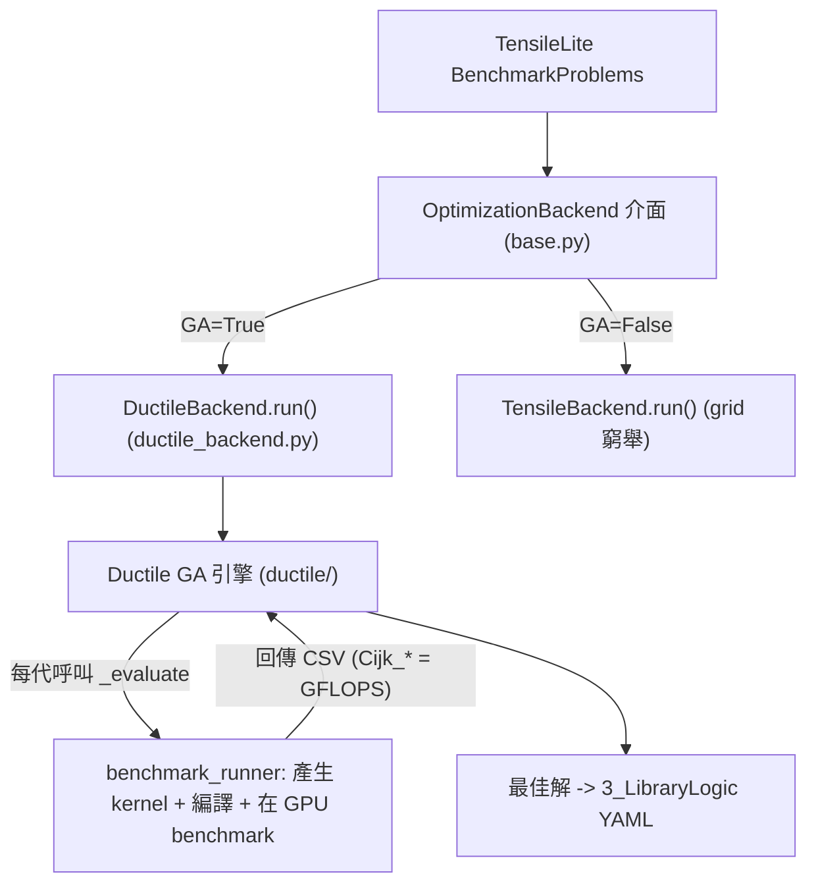

# Ductile 深入導讀：TensileLite 的基因演算法 tuning 引擎

路徑說明：本檔在 `study_docs/geko-ductile/`。連原始碼往上兩層：`../../projects/...`。Ductile 原始碼在 **`origin/ductile_integration`** branch 的 `projects/hipblaslt/tensilelite/Tensile/ductile/` 與 `Tensile/backends/`（未進 develop / working tree，可用 `git show origin/ductile_integration:<path>` 讀）。行號會漂移，以符號名稱為準。先讀 [README.md](README.md) 建立全景。

> Ductile 是 TensileLite 的一個 **tuning backend**：用**基因演算法（GA）**在 kernel 參數空間裡搜尋高效解，取代傳統的 **grid 笛卡兒積窮舉**。它與 grid backend 並列，都是 TensileLite `OptimizationBackend` 介面的實作；GEKO `--backend ductile` 會選它，也可獨立使用。

## 白話總覽：為什麼需要 GA？

TensileLite 原本的搜尋是 **grid 窮舉**：把 YAML `ForkParameters` 列出的所有參數組合（笛卡兒積）全部試一遍。問題是——**組合數隨參數維度指數爆炸**。當你想同時調很多維度（`DepthU`、`GlobalReadVectorWidth`、`NonTemporal`、`StaggerU`、`WorkGroupMapping`…），grid 幾乎跑不完。

Ductile 換個思路，借用**基因演算法**：

- 把「一組完整的 kernel 參數」當成一條**染色體**（chromosome）。
- 維持一批候選（**族群 population**），每個候選實際編譯+benchmark，用 **GFLOPS 當適應度（fitness）**。
- 一代一代**選擇（selection）優者當父母 → 交配（crossover）混合 → 突變（mutation）微調**，族群逐漸往高效區收斂。
- 只要少量評估（相對窮舉）就能逼近、甚至超越 grid 的最佳點，還能探到 grid 沒列出的組合。

一句類比：**grid 是把畫好格子的棋盤一格一格踩；GA 是先定義棋盤的座標範圍與刻度，讓演算法在空間裡「飛」，靠實測判斷哪裡是高地。**

## Ductile 在 TensileLite 的位置：可插拔 backend

Ductile 不是獨立於 TensileLite 的另一套工具，而是插進 TensileLite 的 benchmark 流程：



- 介面：[backends/base.py](../../projects/hipblaslt/tensilelite/Tensile/backends/base.py) 的 `OptimizationBackend`（抽象 `run(...)`）。
- Ductile 實作：[backends/ductile_backend.py](../../projects/hipblaslt/tensilelite/Tensile/backends/ductile_backend.py) 的 `DuctileBackend`。
- GA 核心：[ductile/](../../projects/hipblaslt/tensilelite/Tensile/ductile) 底下的 `algorithm/`、`core/`、`config/`。

> 重點：**GA 演算法本身在 `ductile/`，如何跟 TensileLite 的「產生 kernel + benchmark」對接則在 `ductile_backend.py`。** 下面分兩部分講。

## 一、GA 引擎（`ductile/` 核心）

### 1.1 SearchSpace：把參數空間變成「整數座標」

[ductile/core/space.py](../../projects/hipblaslt/tensilelite/Tensile/ductile/core/space.py) 的 `SearchSpace` 是 GA 的舞台。它做兩件事：

1. **編碼**：把每個參數的候選值清單，轉成 `0..n-1` 的整數索引。例如 `DepthU: [16,32,64]` → gene 值就是 `0/1/2`。GA 只在整數空間上操作，`transform()` 再把整數映回真實參數值。
2. **合法性採樣**：`sample(size, ...)` 平行（joblib 多進程）隨機抽 individual，並用 `valid` 回呼過濾掉「產不出合法 kernel」的組合（例如超過 VGPR/LDS 限制）。抽不夠會丟 `MaxIterationsReached`。

```python
# space.py（節錄）
self.sizes = {k: len(v) for k, v in space.items()}     # 每個 gene 有幾個候選
self.map   = {k: v for k, v in space.items()}          # index -> 真實值
self.space = {k: list(range(len(v))) for k, v in space.items()}  # gene 用整數表示
self.n_perms = math.prod(v for v in self.sizes.values())  # 總組合數（= grid 會窮舉的量）
```

> 白話：`n_perms` 就是「grid 要窮舉的總數」。GA 的價值在於**不用真的踩完這 `n_perms` 個點**，只評估其中一小部分就找到好解。

### 1.2 GeneticAlgorithm：演化主迴圈

[ductile/algorithm/ga.py](../../projects/hipblaslt/tensilelite/Tensile/ductile/algorithm/ga.py) 的 `GeneticAlgorithm` 是主引擎。核心 `optimize()` 迴圈（白話）：

```text
1. sample 初始 population（pop_size 個合法 individual）
2. for gen in 1..n_gen:
     scores = evaluate(transform(pop))     # 實際 benchmark，得 GFLOPS
     best, f_max = update(best, pop, ...)   # 更新歷代最佳
     termination(f_avg, f_max, diversity)   # 收斂就提前停
     old_pop = survival(old_pop, pop)       # 保留優者
     pop = mating(old_pop)                  # 選擇+交配+突變 產生下一代
     save(checkpoint)                       # 存檔可續跑
3. 回傳 best 的參數 X 與 fitness F
```

幾個實作上的重點（都在 `ga.py`）：

| 機制 | 說明 |
| --- | --- |
| **多目標（跨多個 shape）** | `evaluate` 回傳 `scores[n_sizes, n_individuals]`——同一批 kernel 在**多個 problem size** 上的分數。`soo=False`（預設）時用 `np.max`/相對 best 做多目標聚合，讓解對多個 shape 都不差。 |
| **提前終止** | `termination()` 用最近 `period`（預設 5）代 `f_avg`/`f_max` 的移動平均判斷是否停滯，停滯就 `StopIteration`。 |
| **族群大小自適應** | 若某參數的候選數 > `pop_size` 會先放大族群探索；`diversity` 太低（< `div_thr`）會啟動 `decay` 縮小族群加速收斂。 |
| **checkpoint 續跑** | `save()`/`load()` 用 pickle 存 gen、population、RNG 狀態；`DuctileBackend` 偵測到 checkpoint 會自動 resume。 |
| **可重現性** | `seed` 同時設 `random`/`numpy`/`SearchSpace`；但因 benchmark 噪音，完全 bit-identical 仍需固定硬體與環境。 |

### 1.3 GA operators：selection / crossover / mutation / survival

一代到下一代的「選擇+交配+突變」由 [ductile/core/mating.py](../../projects/hipblaslt/tensilelite/Tensile/ductile/core/mating.py) 的 `Mating` 統籌，各步驟是可註冊、可替換的 operator（`__registry__` + `get(name)`）：

| operator | 檔案 | 預設（[config/defaults.yaml](../../projects/hipblaslt/tensilelite/Tensile/ductile/config/defaults.yaml)） | 白話 |
| --- | --- | --- | --- |
| **selection** | `core/selection.py` | `tournament`（k=2） | 選誰當父母；先保留一小撮 elite（`elitism`），其餘用錦標賽等策略挑。也有 `beta`、`ranked_round_robin`（可按 `MatrixInstruction` 分組保多樣性）。 |
| **crossover** | `core/crossover.py` | `ux`（uniform，`prob=0.9`） | 兩父代逐 gene 隨機互換組出子代；`pairing` 可依 random/fitness/rank/diverse 決定配對機率。 |
| **mutation** | `core/mutation.py` | `prob=1/n_params` | 以小機率把某些 gene 換成該參數的其他候選值，避免過早收斂；可用 `weights` 對特定參數（如 `MatrixInstruction` group）調高突變率。 |
| **survival** | `core/survival.py` | `fitness` | 決定哪些個體活到下一代：`fitness` 把新舊族群合併後依 fitness 取前 `size` 個（精英保留）。 |

`Mating.__call__` 的流程：`selection(pop)` 選父母 → 反覆 `crossover` 產子代、對每個子代 `mutation`、用 `space.valid` 過濾非法解，直到湊滿 `n_offsprings`。

族群與個體的資料結構在 [ductile/core/population.py](../../projects/hipblaslt/tensilelite/Tensile/ductile/core/population.py)：`Individual`（一條染色體，`X`=參數 dict、`F`=fitness、`G`=各 size 分數）、`Population`（一批 individual，支援 `diversity()`、`argsort()` 等）。

> 更深入的實作細節（`optimize()` 迴圈逐步拆解、`update` 的多 shape 聚合、selection/crossover/mutation/survival 的逐函式邏輯、`_evaluate` 如何 benchmark、checkpoint/resume）見 [ga-algorithm-implementation.md](ga-algorithm-implementation.md)。

## 二、與 TensileLite 串接（`ductile_backend.py`）

GA 引擎不知道什麼是 GEMM kernel——它只認得「整數染色體」與「fitness 分數」。把兩個世界接起來的是 [backends/ductile_backend.py](../../projects/hipblaslt/tensilelite/Tensile/backends/ductile_backend.py) 的 `DuctileBackend.run()`。

### 2.1 建 SearchSpace：從 ForkParameters 來

```python
# ductile_backend.py（節錄）
fork_params = benchmark_config["forkParams"].copy()
param_groups = benchmark_config.get("paramGroups", [])
# 把「必須一起變動的參數」打包成複合 gene group_i
for i, group in enumerate(param_groups):
    if len(group) == 1:
        constant_params.update(group[0])   # 單一選項 -> 當常數
    else:
        fork_params[f"group_{i}"] = group   # 多選項 -> 複合 gene

space = SearchSpace(fork_params, valid=validate_fn, max_iters=merged_config["max_iters"])
```

- **gene 來源**：TensileLite 原本 grid 要窮舉的 `forkParams`，在這裡變成 GA 的 gene 定義。
- **複合 gene（`group_i`）**：像 `MatrixInstruction` + `WorkGroup` 這種必須成套的參數，打包成一個 gene，避免拆開後組出非法搭配。
- **`valid` 回呼**：`_validate_solution(...)` 會真的建一個 solution 物件並跑 `KernelWriterAssembly._initKernel/_getKernelSource`，產不出來就判非法——確保 GA 只在「能編譯的 kernel」空間裡搜。

### 2.2 fitness＝真實 benchmark（`_evaluate` 回呼）

GA 的 `evaluate` 就是 `DuctileBackend` 傳進去的 `_evaluate`（benchmark-driven）：

```python
# ductile_backend.py，_evaluate（節錄）
converted = _generate_ga_solutions(problem_type, constant_params, individuals, ...)  # 染色體 -> solution，去重
solutions = [s for s in converted if s is not None]
results_filename, returncode = benchmark_runner(solutions, useCache=False, buildOnly=False)  # 編譯 + 在 GPU benchmark
df = pd.read_csv(results_filename)
cols = [c for c in df.columns if c.lstrip().startswith("Cijk_")]  # 每個 solution 一欄 GFLOPS
scores = df[cols].values.astype(np.float32)
# nGFlops[i, j] = solution j 在 problem size i 的效能
nGFlops = np.zeros((n_sizes, len(individuals)), dtype=np.float32)
nGFlops[:, idxs] = scores
return nGFlops
```

白話：**每一代，GA 把整批候選染色體交給 TensileLite 真的編譯、在 GPU 上 benchmark，讀回 CSV 裡 `Cijk_*` 欄的 GFLOPS 當 fitness。** 因為回傳的是 `[n_sizes, n_individuals]` 二維陣列，GA 自然支援「一次 tune 多個 shape」的多目標最佳化。重複或非法的染色體會插 `None` 佔位，保持 GA 的 index 對齊。

### 2.3 收尾：post-optimization verification

GA 跑完 `ga.optimize()` 得到 `best` 後，`DuctileBackend` 會把驗證等級 `NumElementsToValidate` 暫時調成設定值，對 best 重新 `evaluate` 一次，**過濾掉數值驗證失敗（`-1`）的解**，確保挑出的 kernel 不只快、還算得對。

## 三、`--convert-config`：把 grid 的窄空間撐大

Ductile 的威力來自「在比 grid 大得多的空間搜尋」。`--convert-config` 會先把原 config 的 gene 值域擴張，例如（見 [../internal_docs/ductile-tensilelite-tuning.md](../internal_docs/ductile-tensilelite-tuning.md) §3.2）：

- `GlobalReadVectorWidthA/B`：`[2,8]` → `[-1,-2,2,3,4,6,8]`（加入自動決策與更多候選）。
- `NumElementsPerBatchStore`、`NonTemporalA/B/C/D`、`StaggerU`、`WorkGroupMapping/XCC`：改成更廣的離散集合。

這讓 GA 能組出原 `ForkParameters` 沒明列的參數排列——相當於在「連續化」的配置空間裡內插/外插，而不侷限於粗粒度 grid points。

## 四、grid vs Ductile：什麼時候用哪個

摘要（完整比較與分層策略見 [../internal_docs/ductile-tensilelite-tuning.md](../internal_docs/ductile-tensilelite-tuning.md)，此處不重抄）：

| 面向 | TensileBackend（grid） | DuctileBackend（GA） |
| --- | --- | --- |
| 搜尋方式 | 笛卡兒積窮舉，決定性 | 演化式啟發搜尋，有隨機性 |
| 適用 | 新架構 bring-up、baseline library、broad coverage | hot shape 極致優化、超大/未知空間 |
| 空間 | 受 YAML 明列組合限制 | `--convert-config` 可大幅擴張 gene 值域 |
| 可重現性 | 完全決定性 | 需固定 seed + 環境，且仍受 benchmark 噪音影響 |
| 多 shape 混 tune | 各自窮舉 | 傾向收斂到「對多數 shape 都不差」的折衷解（差異大時建議每 shape 獨立 config） |

> 實務建議（分層）：先 **Dense Search**（GEKO `--search`）確認 selection 有沒有用好既有 library → 需要新 kernel 才上 **grid** 擴 pool → 只對少數 hot shape 上 **Ductile GA** 榨最後幾 %。多數「效能不好」其實是 selection 問題而非缺 kernel。

## 一句話總結

> **Ductile 用基因演算法在「能編譯的 kernel 參數空間」裡演化搜尋，以實測 GFLOPS 當適應度，少量評估就逼近/超越 grid 窮舉的最佳解。** GA 引擎在 `ductile/`，與 TensileLite「產生 kernel + benchmark」的對接在 `ductile_backend.py`；它是 `OptimizationBackend` 的一種實作，由 GEKO 的 `GA` 旗標或直接跑 TensileLite 選用。編排它的上層見 [geko-deep-dive.md](geko-deep-dive.md)。
