# Ductile 基因演算法（GA）實作細節：逐行讀懂演化主迴圈

路徑說明：本檔在 `study_docs/geko-ductile/`。連原始碼往上兩層回 repo root：`../../projects/...`。Ductile 原始碼**不在 develop / working tree**，而在 `origin/ductile_integration` branch 的 `projects/hipblaslt/tensilelite/Tensile/ductile/`（GA 引擎）與 `Tensile/backends/`（與 TensileLite 串接）。要讀真實檔案請用 `git show origin/ductile_integration:<path>`。行號會隨 commit 漂移，本檔一律以**符號名稱（class / function 名稱）**為準。

> 這是 [ductile-deep-dive.md](ductile-deep-dive.md) 的**實作深潛版**。ductile-deep-dive 講「Ductile 是什麼、在 TensileLite 的哪個位置」；本檔則**逐檔、逐函式**把 GA 一代到下一代到底做了什麼講清楚——資料怎麼表示、什麼時候 crossover、什麼時候 mutation、fitness 怎麼算、什麼時候停。建議先讀 ductile-deep-dive 建立全景，再讀本檔補實作。
>
> 觀念性、定位性的常見疑問（例如「GA 算不算貪心」「mutation 保證跳出 local minimum 嗎」「`seed` 是不是初始解」「GA 和訓練預測模型差在哪」「為什麼 GA 比 grid 好」等），另見補充 Q&A：[ga-faq-clarifications.md](ga-faq-clarifications.md)。


## 0. 先給一張全局地圖：程式碼分工

Ductile 的 GA 拆成「**引擎**」與「**串接**」兩塊：


| 角色               | 檔案（相對 `.../tensilelite/Tensile/`）                     | 關鍵符號                                                      | 一句話                                                 |
| ---------------- | ----------------------------------------------------- | --------------------------------------------------------- | --------------------------------------------------- |
| 演化主迴圈            | `ductile/algorithm/ga.py`                             | `GeneticAlgorithm.optimize`                               | 一代一代跑 evaluate → update → survival → mating         |
| 參數空間             | `ductile/core/space.py`                               | `SearchSpace`                                             | 把參數編碼成整數 gene、採樣合法初始族群、`transform` 映回真實值            |
| 資料結構             | `ductile/core/population.py`                          | `Individual` / `Population`                               | 一條染色體 / 一批染色體（`np.ndarray` 子類）                      |
| 交配統籌             | `ductile/core/mating.py`                              | `Mating.__call__`                                         | 把 selection + crossover + mutation + 合法過濾串起來產下一代    |
| 選擇               | `ductile/core/selection.py`                           | `Tournament`、`Beta`、`RankedRoundRobin`…                   | 選誰當父母                                               |
| 雜交               | `ductile/core/crossover.py`                           | `Uniform`（`ux`）、`pairing`                                 | 兩父代混出子代                                             |
| 突變               | `ductile/core/mutation.py`                            | `Mutation.__call__`                                       | 小機率把某些 gene 換成別的值                                   |
| 存活               | `ductile/core/survival.py`                            | `Fitness`                                                 | 新舊族群合併後留下優者                                         |
| 預設參數             | `ductile/config/defaults.yaml` + `config/__init__.py` | `DEFAULTS`、`update`、`populate`                            | 所有預設值與合併邏輯                                          |
| 與 TensileLite 串接 | `backends/ductile_backend.py`                         | `DuctileBackend.run`、`_evaluate`、`_generate_ga_solutions` | 把「染色體」變成「真的能 benchmark 的 kernel」，把 GFLOPS 當 fitness |


一句話：`ductile/` **只懂「整數染色體」與「fitness 分數」；把它接到真實 GEMM kernel 的是** `ductile_backend.py`**。**

## 1. 白話直覺：GA 一代到底在幹嘛？

先用一個生活化的比喻把整個流程串一次，之後每一節再深入。

想像你要在一個巨大的參數空間裡找「最快的 kernel 設定」，但每試一組都要真的編譯 + 上 GPU 跑（很貴）。GA 的策略是「養一群候選，讓好的多生、壞的淘汰」：

1. **先隨機生一群候選**（初始 population，預設 512 個）。
2. **每一代**：把這群候選**真的拿去 benchmark** 得到 GFLOPS（這就是 fitness／適應度）。
3. **記住歷代最好的**（best）。
4. **看看是否已經卡住不再進步**（termination，卡住就提前停）。
5. **淘汰**：新舊候選合併，只留下 fitness 高的一批（survival）。
6. **繁殖下一代**：從存活者裡**選**父母（selection）→ 兩兩**雜交**混基因（crossover）→ 對子代做小幅**突變**（mutation）→ 丟掉產不出合法 kernel 的（valid 過濾）。
7. 回到第 2 步，直到跑完 `n_gen` 代或提前終止。

> 關鍵心智模型：**crossover 是「組合已知好基因」（exploitation，利用），mutation 是「跳去試沒試過的值」（exploration，探索）。** selection 決定「誰有資格當父母」，survival 決定「誰能活著進下一代」。這四件事一起決定族群往哪收斂。

下面這張圖是**一代（one generation）的完整資料流**，也是本檔的主幹；後面各節就是逐一放大這張圖的每個方框。

```mermaid
flowchart TD
    subgraph gen["一個世代 gen (ga.py 的 optimize for-loop)"]
        A["pop：這一代族群<br/>(整數染色體, 形狀 [pop_size, n_params])"]
        A --> T["space.transform(pop)<br/>整數 gene → 真實參數 dict"]
        T --> E["evaluate(...) = _evaluate<br/>編譯 + 在 GPU benchmark<br/>回傳 scores [n_sizes, n_individuals] (GFLOPS)"]
        E --> U["update(best, pop, old_pop, scores)<br/>更新歷代最佳 best、算 pop.F/old_pop.F"]
        U --> S["print_stats + termination(f_avg, f_max, diversity)<br/>停滯就 raise StopIteration"]
        S --> SV["survival(old_pop, pop, pop_size)<br/>新舊合併→排序→取前 pop_size = 存活池 old_pop"]
        SV --> M["mating(old_pop, pop_size)"]
        subgraph mate["Mating.__call__"]
            M --> SEL["selection(存活池) → parents<br/>(elitism 保留 + tournament 挑)"]
            SEL --> CX["crossover：pairing 配對 → 逐 gene 互換 → offspring"]
            CX --> MUT["mutation：對每個 offspring 小機率換 gene"]
            MUT --> V{"space.valid?<br/>(能編譯成 kernel?)"}
            V -->|"是"| ADD["加入 offsprings（去重, 滿 pop_size 就停）"]
            V -->|"否"| DROP["丟棄，繼續補"]
        end
        ADD --> NP["下一代 pop"]
        NP -.-> CK["save checkpoint（可續跑）"]
    end
    CK -.->|"下一個 gen"| A
```




## 2. 染色體怎麼表示：`Individual` 與 `Population`

要看懂後面所有 operator，得先知道「一條染色體」在程式裡長什麼樣。定義在 `ductile/core/population.py`。

### 2.1 `Individual`：一條染色體 = 一組 kernel 參數

```python
# population.py（節錄）
class Individual:
    def __init__(self, X: dict, F: float = 0.0, G: Sequence = [0]):
        ...
        if not all(isinstance(v, Number) for v in X.values()):
            raise ValueError("X must be a dictionary of basic types.")
        self.X = dict(sorted(X.items()))   # 參數 dict（gene 名 -> 整數 index）
        self.F = float(F)                  # fitness（純量）
        self.G = G                         # 各 problem size 的分數（向量）
```

三個欄位是理解全域的鑰匙：

- `X`**（基因型）**：一個 dict，`{gene名: 整數index}`。**注意 value 必須是數字（**`Number`**）**——GA 全程只在「整數座標」上操作，`X` 存的是**索引**（例如 `DepthU` 的第 2 個候選就是 `2`），不是真實值 `64`。真實值要靠 `SearchSpace.transform` 才映得出來（見 §3）。`X` 會 `sorted`，確保 gene 順序固定（crossover/mutation 逐 gene 對齊時很重要）。
- `F`**（適應度）**：一個純量分數，越大越好。初始 `0.0`，evaluate 後才被填。
- `G`**（各 size 分數）**：一個向量，長度 = problem size 數。因為 Ductile 可**一次 tune 多個 shape**，同一條染色體在每個 shape 上各有一個 GFLOPS，`G` 就是這排分數；`F` 是把 `G` 聚合成的單一總分（§5）。

其他值得注意的實作：

- `Individual` 用 `@functools.total_ordering` + `__lt__`（比 `F`）讓它**可直接排序**（`pop.sort()` 就是照 `F`）。
- `__eq__` 比的是 `X`（基因型相同就算同一個），`__hash__` 用 `values`——這讓「用 `set` 去重複染色體」成立（§7 的 `IndividualSet`）。
- `update(X)` / `__setitem__` 改了基因就把 `F` 歸零（因為舊分數失效了）。
- `diff(other)` 回傳「兩條染色體不同的 gene 名」，`hux` crossover 會用到。


### 2.2 `Population`：一批染色體，且是 `np.ndarray` 子類

```python
# population.py（節錄）
class Population(np.ndarray, Sequence):
    @property
    def shape(self):
        return self.size, len(self.names)   # (幾個 individual, 幾個 gene)
    @property
    def F(self):
        return np.array([ind.F for ind in self])   # 取出全體 fitness 向量
    @F.setter
    def F(self, scores):
        for ind, score in zip(self, scores):
            ind.F = score
```

重點：

- `Population` **直接繼承** `np.ndarray`，所以可以 `pop[mask]`、`pop[indices]`、切片，元素是 `Individual`。
- `pop.names`（gene 名清單）**不是** `Population` 上的 `@property`——那個 property 只定義在 `Individual`（`tuple(self.X.keys())`）。`Population` 的 `names` 是在 numpy 的 hook `__array_finalize__`（每次新建/view/切片/merge 都會被呼叫）裡設成實例屬性：`self.names = obj[0].names`，也就是**從族群裡第一個 `Individual` 複製**過來。而 `Population.__new__` / `merge` 會強制**全族群 names 必須一致**（否則 `raise ValueError`），所以「抄第一個」就代表整個族群。這也是 §2.3 `diversity()` 裡 `self.names` 的來源。
- `pop.F` 是一個 property：**讀**會把每個 individual 的 `F` 收集成向量；**寫**（`pop.F = 向量`）會把分數逐一塞回去。`pop.G` 同理，但 setter 是 `ind.G = scores[:, i]`（把 scores 的**第 i 欄**給第 i 個 individual，見 §5 為何是欄）。
- `pop.ary`：把整批染色體攤成一個 `[n_ind, n_params]` 的整數矩陣，給 diversity / crossover 用。
- `pop.argsort()` 回傳**由大到小**（`np.argsort(self)[::-1]`）的 index；`pop.sort()` 就是 fitness 高的排前面。
- `pop.diversity()`：用 `scipy` 的 `pdist` 算**兩兩染色體的 hamming 距離平均**——白話就是「這群候選彼此有多不一樣」。全都長一樣 → 0（快收斂/早熟），差異大 → 接近 1。這個值是 termination 與族群自適應的重要訊號（§6）。**逐行拆解、逐 gene 模式（`reduce=False`）與數字例子見 §2.3。**
- `pop.unique()`：用 pandas `drop_duplicates` 去掉重複染色體。

> 一句話：
>
> - `Individual` **是一條整數編碼的染色體（帶** `F` **總分與** `G` **各 size 分數）**
> - `Population` **是一疊** `Individual`**，但同時是 numpy 陣列，所以能用向量化操作快速排序、遮罩、算多樣性。**


### 2.3 深入 `diversity()`：族群多樣性到底怎麼算

§2.2 只用一句話帶過 `diversity()`。這裡把它逐行拆開，因為它是 termination 與族群自適應（§6）背後那個「族群收斂了沒」的訊號來源，值得看懂。完整原始碼（`ductile/core/population.py`）：

```python
# population.py，Population.diversity
def diversity(self, reduce=True, metric="hamming"):
    if self.size == 0:
        return 0
    X = self.ary
    if reduce:
        return pdist(X, metric=metric).mean()
    div = [pdist(x[:, None], metric=metric).mean() for x in X.T]
    return dict(zip(self.names, div))
```

#### 先解釋三個名詞

- `pdist`**（scipy 的 pairwise distance）**：一句話＝「給我一個 `[m, n]` 矩陣（`m` 列、每列是一個 `n` 維向量），我幫你算出**所有兩兩配對**的距離」。它回傳的**不是** `m×m` 方陣，而是一條長度 `C(m,2) = m*(m-1)/2` 的**壓縮一維陣列**（只存上三角、不含對角線與重複配對）。例：`m=3` → 回傳 3 個配對距離，對應 `(0,1)、(0,2)、(1,2)`。後面的 `.mean()` 就是把這些配對距離平均成一個數。
- `hamming`**（漢明距離）**：兩條**等長**向量「**有幾成的位置不一樣**」——注意是**比例（0~1）**，不是「差幾個」的絕對數。例：`[0,1,2]` vs `[0,9,2]`，3 個位置只有中間那格不同 → `1/3 ≈ 0.333`。它**只在乎「相不相等」**，不在乎差多少（`1` vs `9` 和 `1` vs `2` 都只算「不一樣」，各記 1）。為什麼多樣性偏偏用 hamming 而不用歐氏距離，見 [ga-faq-clarifications.md](ga-faq-clarifications.md) Q14。
- `reduce`**這個詞**：＝「**歸約 / 把一堆值收斂成更少（通常一個）值**」，就是 functional programming 的 reduce / fold（也跟 §5 `update` 的 `reduce_fn` 是同一個字）。這裡：`reduce=True`＝把整個族群壓成**一個**總多樣性分數；`reduce=False`＝不壓，保留「**每個 gene 各自一個**多樣性」的明細。

#### 逐行拆解

- `if self.size == 0: return 0`：**空族群保護**。沒有任何個體時多樣性定義為 0，避免 `pdist` 對空矩陣報錯。
- `X = self.ary`：把整批染色體攤成 `[n_ind, n_params]` 的**整數矩陣**（一列＝一條染色體、一欄＝一個 gene 的 index），見 §2.2。
- `reduce=True`**（預設）→** `pdist(X, metric).mean()`：算「**所有兩兩染色體**」的 hamming 距離再平均，得到**一個純量**。白話：「整個族群的染色體，彼此平均有幾成的 gene 不一樣」。全都一樣 → 0（早熟/快收斂），差異大 → 接近 1。
- `reduce=False`**→ 逐 gene 算**：
  - `X.T` 把矩陣**轉置**成 `[n_params, n_ind]`，於是「一列＝某個 gene 在所有個體上的值」。`for x in X.T` 每次拿到的 `x` 就是某個 gene 的 `n_ind` 個 index（**一維**，形狀 `(n_ind,)`）。
  - `x[:, None]` 把這條一維向量 reshape 成 `[n_ind, 1]`（見下方「`x[:, None]` 到底做什麼」）。
  - `pdist(...).mean()` 對這一欄算兩兩距離平均。因為每個「向量」只有 1 維，hamming 只會是 0（兩個 index 相等）或 1（不等），所以這個平均＝「**這個 gene 在族群裡，有幾成的配對彼此不同**」。
  - `dict(zip(self.names, div))`：把每個 gene 名對應到它自己的多樣性，回傳 `{gene名: 多樣性}` 的 dict。

#### `x[:, None]` 不是「壓成一維」，而是「把一維補成二維」

這是很容易看反的一點。逐 gene 模式裡，`x` **本來就是一維** `(n_ind,)`（某個 gene 在所有個體上的值）。`pdist` 規定輸入必須是二維 `[m, n]`，所以 `x[:, None]` 只是**加一個長度 1 的欄軸**，把 `(n_ind,)` 變成 `(n_ind, 1)`——**內容一個都沒少，只是換個形狀來滿足 `pdist` 的介面**。而且逐 gene 模式**一次只餵一個 gene** 進去，各欄各算各的，不會有「不同 gene 混在一起比」的問題。

#### 一個具體數字例子

假設族群有 3 條染色體、2 個 gene（`g0`、`g1`），`X = [[0,1], [0,2], [1,1]]`。

**`reduce=True`（整體）**——`pdist(X, "hamming").mean()`：

| 配對 | 逐位置比對 | hamming（比例） |
| --- | --- | --- |
| 染0 `[0,1]` vs 染1 `[0,2]` | 位0同(0=0)、位1異(1≠2) | 1/2 = 0.5 |
| 染0 `[0,1]` vs 染2 `[1,1]` | 位0異(0≠1)、位1同(1=1) | 1/2 = 0.5 |
| 染1 `[0,2]` vs 染2 `[1,1]` | 位0異、位1異 | 2/2 = 1.0 |

平均 = `(0.5 + 0.5 + 1.0) / 3 ≈ 0.667` → **整體多樣性 ≈ 0.667**。

**`reduce=False`（逐 gene）**——對 `X.T` 每一欄各算一次：

| gene | 該 gene 在 3 個個體的值 | 配對距離 | 平均 |
| --- | --- | --- | --- |
| `g0` | `[0, 0, 1]` | (0,0)=0、(0,1)=1、(0,1)=1 | 2/3 ≈ 0.667 |
| `g1` | `[1, 2, 1]` | (1,2)=1、(1,1)=0、(2,1)=1 | 2/3 ≈ 0.667 |

回傳 `{"g0": 0.667, "g1": 0.667}`。（此例兩個 gene 剛好都 0.667 只是巧合；一般各 gene 會不同。）

#### `reduce=True` vs `reduce=False`：兩種模式各在幹嘛用

- **`reduce=True`（整體純量）＝回答「整個族群收斂了沒」的單一訊號。** 這是主迴圈實際用的——每代呼叫 `pop.diversity()` 走的就是這條（§4 步驟 ③、log 的 `diversity` 欄），餵進 `termination()` 判早熟、並在 `diversity < div_thr` 時觸發 `low_diversity` decay 加速收斂（§6.1、§6.2）。
- **`reduce=False`（逐 gene 明細）＝回答「是哪些 gene 已經收斂、哪些還在探索」。** 可拿來**診斷「某個關鍵維度（例如 `MatrixInstruction`）是不是過早塌縮成單一值」**——若某 gene 的多樣性早早掉到 0，代表族群在那個維度已經不再探索。這正呼應 §10 `ranked_round_robin` 想「刻意維持 MI 多樣性、避免整族群塌縮到單一 MI」的動機。

> 延伸的觀念澄清（屬於「為什麼能這樣算」而非「怎麼算」）另見 [ga-faq-clarifications.md](ga-faq-clarifications.md)：**為什麼所有染色體能逐位置比對、gene 數會不會不同**（Q13）、**為什麼用 hamming 而非歐氏距離**（Q14）、**演化改的是 gene 還是 gene 的值**（Q15）。


## 3. `SearchSpace`：把參數空間變成「整數座標」

定義在 `ductile/core/space.py`。它是 GA 的舞台，做三件事：**編碼、採樣、還原**。

### 3.1 編碼：真實值 → 整數 index

```python
# space.py，SearchSpace.__init__（節錄）
self.sizes  = {k: len(v) for k, v in space.items()}   # 每個 gene 有幾個候選
self.map    = {k: v for k, v in space.items()}        # index -> 真實值（還原用）
self.space  = {k: list(range(len(v))) for k, v in space.items()}  # gene 用整數表示
self.n_perms = math.prod(v for v in self.sizes.values())  # 總組合數（= grid 會窮舉的量）
```

白話：你給它 `{"DepthU": [16, 32, 64], ...}`，它把每個參數的候選清單編號成 `0..n-1`。之後 GA 只玩整數 `0/1/2`，完全不用管真實值是什麼。`n_perms` 是所有 gene 候選數的乘積——**就是 grid 窮舉要踩完的總點數**；GA 的價值在於只評估其中一小撮就找到好解。

### 3.2 還原：`transform` 把整數映回真實參數

```python
# space.py（節錄）
def transform(self, X):
    if isinstance(X, Individual):
        return {k: self.map[k][i] for k, i in X.items}
    return [{k: self.map[k][i] for k, i in x.items} for x in X]
```

`transform` 是 GA 世界與真實世界的橋：把 `Individual`（整數）翻成 `{gene名: 真實值}` 的 dict；傳一個 `Population` 進去就回傳一 list 的 dict。`optimize()` 每代都先 `self.space.transform(pop)` 再交給 `evaluate`（§4）。

### 3.3 合法性採樣：`sample` 生出「能編譯」的初始族群

初始族群不能亂生——很多整數組合會產出**編不出來的 kernel**（超過 VGPR/LDS 限制之類）。`sample` 用平行採樣 + `valid` 過濾解決：

```python
# space.py，SearchSpace.sample（節錄）
def sample(self, size, p=None, iter_mul=1, reuse=False):
    ...
    while it < max_iters:
        total_to_generate = max((size - len(pop)) * 25, n_jobs * 4)
        chunk_size = total_to_generate // n_jobs
        seeds = self.seed_seq.spawn(n_jobs)
        res = joblib.Parallel(n_jobs=n_jobs, backend=JOBLIB_BACKEND)(
            joblib.delayed(sample_chunk)(self.valid, p, self.sizes, chunk_size, seed)
            for seed in seeds)
        ...  # 把合法的加進 IndividualSet（自動去重、滿了就停）
    if len(pop) < size:
        raise MaxIterationsReached(...)
```

- 每個 gene 用 `rng.choice(s, p=p.get(k))` 隨機抽一個 index，`p` 可對某些 gene 指定**非均勻抽樣機率**（來自 `weights`，見 §6.4）。
- `sample_chunk` 對每個候選呼叫 `valid_fn`（就是 backend 的 `_validate_solution`，真的去建 solution 並試著 `_initKernel`），**產不出合法 kernel 的直接丟掉**。
- 用 `joblib` 多進程平行加速（在 pytest-xdist worker 內則退回單執行緒 threading，避免巢狀平行）。
- 抽到的合法個體放進 `IndividualSet`（一個帶容量上限、會自動去重的 `set`）；湊滿 `size` 就停。
- 若試了 `max_iters * size` 次還湊不滿，丟 `MaxIterationsReached`。`optimize()` 會接住它，改用**一半族群**再試一次（`iter_mul=4, reuse=True`，沿用已抽到的 cache）。

> 白話：`sample` **= 一直亂骰整數組合、把「能編譯的」留下來，直到湊滿一整批合法初始族群。** 這保證 GA 從第一代起就只在「可行 kernel」的空間裡搜。


### 3.4 複合 gene（group）：必須成套的參數打包成一個 gene

有些參數必須「成套出現」才合法（例如 `MatrixInstruction` 搭配對應的 `WorkGroup`），拆開亂配就非法。做法是把**整組合法組合**當成單一 gene 的候選清單：`map["group_0"] = [ {組合A}, {組合B}, ... ]`，gene 的整數 index 就選第幾套。`Individual.X["group_0"]` 存的仍是整數（合法，因為是 `Number`）；`transform` 後才變成一個 dict，再由 backend 展開（§8.1）。這樣 crossover/mutation 只會整套整套換，不會拆散成非法搭配。

### 3.5 gene 名從哪來？怎麼決定「誰」當 gene

§3.1 把傳入 `SearchSpace` 的 `space` dict（`{"DepthU": [16,32,64], ...}`）當成既有的輸入，但沒講這份 dict 是誰、依什麼規則產生的。這裡補齊——**這也直接回答「**`X` **的 gene 名有哪些、怎麼挑出來」。**

第一個關鍵觀念：**gene 名不是 Ductile 寫死的固定清單，而是每次 tuning 時從輸入 YAML 的** `forkParams` **動態長出來的。** 也就是說，`X` 裡有哪些 gene，完全取決於你這次餵的 tuning config——`ductile/` 本身不認得任何具體參數名，它只看「傳進來的 `space` dict 有哪些 key」。真正把 `forkParams` 轉成 `SearchSpace` 的是 `DuctileBackend.run`（詳見 §8.1，此處不重抄程式碼）。

決定「誰當 gene」的三條規則（實作見 §8.1 第 418–423 行）：

1. `forkParams` **裡的每個參數 → 一個獨立 gene。** 凡是 TensileLite 原本 grid 要窮舉的參數，直接變成 GA 的一個 gene，gene 名就是參數名（例如 `"DepthU"`）。
2. `paramGroups` **裡「多選項」的群組 → 一個複合 gene** `group_i`**。** 必須成套的參數（§3.4）打包成 `group_0`、`group_1`… 這種 gene 名，index 選「第幾套組合」。
3. **只有「一種選擇」的群組 → 併進** `constantParams`**（固定值），不是 gene、不會出現在** `X` **裡。**

所以 `X` 的 gene 名 = 「`forkParams` 的 key」+「多選項 `paramGroups` 產生的 `group_i`」。下表整理**典型會出現的 gene 及其意義與可能影響**（實際清單依你的 config 而定；參數作用的完整敘述見 [../hipblaslt/tuning-config-reference.md](../hipblaslt/tuning-config-reference.md)、[../hipblaslt/macrotile-tuning.md](../hipblaslt/macrotile-tuning.md) 與 [../internal_docs/ductile-tensilelite-tuning.md](../internal_docs/ductile-tensilelite-tuning.md) 2.2 / 3.2 節，合法值最終以 `ValidParameters.py` 為準）：


| gene                             | 意義（控制什麼）                                                                                                                | 可能影響（調它會牽動什麼）                                                                                                                                  |
| -------------------------------- | ----------------------------------------------------------------------------------------------------------------------- | ---------------------------------------------------------------------------------------------------------------------------------------------- |
| `MatrixInstruction`              | 9 元素 `[M,N,K,B,MIBlockM,WaveTileM,WaveTileN,WaveM,WaveN]`，選底層 MFMA/WMMA 指令與整個 tile 幾何（**最關鍵**，常與 `WorkGroup` 綁成複合 gene） | 決定 macro tile 形狀與 K-unroll → 連動 register / LDS 用量 / occupancy，幾乎左右整體效能上限                                                                       |
| `DepthU`                         | K 方向一次 unroll 的深度                                                                                                       | 與 MacroTile 一起決定 LDS 用量（`LDS≈DepthU×MacroTile×bpe`）；加大提升 compute/memory 比但增 VGPR 壓力。大 K/compute-bound 用大值（128,160）、小 K/memory-bound 用小值（32,64） |
| `WorkGroup`                      | 一個 workgroup 的 wave/thread 佈局                                                                                           | 影響 occupancy 與 CU granularity；總 thread 數 = `WaveM×WaveN×WavefrontSize`                                                                         |
| `WorkGroupMapping`（WGM）          | tile → CU 的排序方式                                                                                                         | 影響 L2/L1 cache 局部性與 reuse；設 `0` 可交給 runtime/Origami auto 選                                                                                     |
| `WorkGroupMappingXCC`            | 跨 XCD/XCC（chiplet）的 workgroup 排布                                                                                        | 影響跨晶粒的 L2/MALL cache 局部性；進階，常搭 `ClusterDim`                                                                                                    |
| `GlobalReadVectorWidthA/B`（GRVW） | global→register 的向量化載入寬度                                                                                                | 影響 memory coalescing 與對齊；需能整除 `MacroTile×DepthU/NumThreads`，否則載入不整齊或被 reject                                                                   |
| `VectorWidthA/B`                 | register/store 端的向量寬度                                                                                                   | 影響 VGPR packing 與寫回的向量化程度                                                                                                                      |
| `PrefetchGlobalRead`（PGR）        | 提前載入下一輪 global 資料                                                                                                       | 掩蓋 global memory 延遲；階數越高越能 overlap 但吃更多 register。0/1/2 都值得試                                                                                    |
| `PrefetchLocalRead`（PLR）         | 提前把 LDS 資料載入 VGPR                                                                                                       | 掩蓋 LDS 讀延遲；`2` 在某些組合會產出錯誤 kernel（實務多用 0/1）                                                                                                     |
| `GlobalSplitU`（GSU）              | 沿 K 切給多個 workgroup 各算部分和                                                                                                | K 很大時提升 CU 利用率，但輸出端需 reduction/atomic 合併的 overhead。`1`=不切、`2/4/8`=切幾段、`-1`=runtime 自動                                                          |
| `GlobalSplitUAlgorithm`          | GSU 部分和的合併方式                                                                                                            | `SingleBuffer`（atomic 累加）/ `MultipleBuffer`（各寫 buffer 再另一 kernel 加總）/ `MultipleBufferSingleKernel`；影響 reduction 成本與數值行為                        |
| `StreamK`                        | 把 K 維切開讓所有 CU 吃滿的排程法                                                                                                    | 改善負載平衡（尤其非整除的 grid），但需額外 reduction 收尾                                                                                                          |
| `NonTemporalA/B/C/D`             | 各 operand 的 non-temporal 記憶體存取 hint                                                                                     | 控制資料要不要長駐 cache；對「只讀一次」的資料標 non-temporal 可減少 cache 污染                                                                                          |
| `StaggerU`                       | 讓不同 workgroup 從 K 的不同位置起跑                                                                                               | 錯開對同一塊資料/記憶體 channel 的爭用，減少 L2/memory 衝突                                                                                                       |
| `NumElementsPerBatchStore`       | epilogue 寫回時每批 store 的元素數                                                                                               | 影響寫回的向量化程度與 register 使用                                                                                                                        |
| `LdsPadA/B`                      | LDS 佈局的 padding                                                                                                         | 避免 LDS bank conflict，**對效能影響大**，務必掃                                                                                                            |
| `TransposeLDS`                   | 是否在 LDS 轉置佈局                                                                                                            | 影響 local read pattern 與 LDS bank conflict                                                                                                      |
| `1LDSBuffer`                     | 單 / 雙 LDS buffer                                                                                                        | 雙 buffer 可讓 load 與 compute overlap（pipeline），但吃兩倍 LDS 用量                                                                                       |


（用 `--convert-config` 時這些 gene 的**值域會被撐大**，例如 `GlobalReadVectorWidthA/B` 從 `[2,8]` → `[-1,-2,2,3,4,6,8]`，但 gene 名不變。）

補一個常被忽略的細節：就算某參數進了 `X`，若它的**候選數** `< 2`（只有一個值可選），mutation 會把它的突變機率設成 0（§11.2，`self.space.size(k) < 2` 的 gene weight 設 0），所以它實質上固定不動。真正「會演化」的 gene 是候選數 ≥ 2 的那些。

> 一句話：**gene 名 = 你這次 tuning YAML 的** `forkParams` **key（多選項** `paramGroups` **會多出** `group_i` **複合 gene）；規則是「在** `forkParams` **裡、且有 >1 候選值的參數才是 gene，只有單一選擇的會降級成** `constantParams` **常數」。文件裡的** `DepthU`**、**`GlobalReadVectorWidthA/B` **只是常見範例，不是固定清單。**


### 3.6 `forkParams` vs `paramGroups`：兩種不同的輸入結構（常見誤會澄清）

§3.4、§3.5、§8.1 已分別講了「複合 gene 怎麼展開」「gene 名怎麼長出來」「程式碼怎麼跑」。這裡補一個最容易搞混、卻沒被正面講清楚的問題：

> **常見誤會：`paramGroups` 是不是「`forkParams` 的組合／排列」？**
> **不是。** 它們是**兩種不同的輸入結構**，處理方式也不同。`paramGroups` 不是「GA 去組合 `forkParams`」，而是**「使用者事先把必須成套的參數綁成好幾套合法組合，GA 只負責挑第幾套」**。

#### `forkParams`＝各參數各掃各的，GA 自由排列組合

它是一個 **dict**，每個參數配一串候選值：

```yaml
forkParams:
  DepthU: [16, 32, 64]
  PrefetchGlobalRead: [0, 1, 2]
```

這裡 `DepthU` 和 `PGR` **彼此獨立**，GA 可以任意搭（DepthU=32 配 PGR=1、DepthU=64 配 PGR=0…），也就是傳統 grid 會做的**笛卡兒積（cross product）**。每個參數 → 一個**獨立 gene**（gene 名就是參數名）。

#### `paramGroups`＝一堆「必須綁在一起」的套餐，GA 只能整套選

它是一個 **list**，list 裡每個元素（一個 `group`）**本身又是一個 list**，裡面裝的是**多套「完整的參數組合」（套餐）**：

```yaml
paramGroups:
  - # 這是 group_0：MatrixInstruction 與 WorkGroup 必須成套，拆開亂配就非法
    - {MatrixInstruction: [16,16,16,1, ...], WorkGroup: [16,16,1]}   # 套餐 A
    - {MatrixInstruction: [32,32,8,1,  ...], WorkGroup: [16,8,1]}    # 套餐 B
    - {MatrixInstruction: [16,16,4,1,  ...], WorkGroup: [8,8,1]}     # 套餐 C
```

因為 `MatrixInstruction`（tile 幾何）和 `WorkGroup`（thread 佈局）要互相對得上、拆開多半編不出合法 kernel（見 §3.4），所以**不讓 GA 自由搭**，而是事先把「合法的整套組合」列成 A/B/C。整個 group → **一個複合 gene** `group_0`，它的整數 index（0/1/2）就代表選 A/B/C。這也是為什麼 crossover/mutation **只會整套整套換、永遠不會把一套拆散**。

對照 §8.1 的展開邏輯就能確認結構：`for group in param_groups` 逐個群組拿出來，`if len(group) == 1`（只有一套、沒得選）→ 併進 `constantParams` 當常數、不進 GA；`else`（多套）→ `fork_params["group_i"] = group` 變成複合 gene。

#### 一張表看懂差別

| | `forkParams` | `paramGroups` |
| --- | --- | --- |
| 資料結構 | dict：`{參數: [候選值...]}` | list：`[ [套餐A, 套餐B...], ... ]` |
| 參數關係 | 彼此獨立，GA 自由笛卡兒積 | 一套內的參數必須綁在一起 |
| 變成什麼 gene | 每個參數各一個獨立 gene | 每個「多選項」群組一個複合 gene `group_i` |
| gene 的 index 意義 | 選這個參數的第幾個候選值 | 選這個群組的第幾套組合 |
| 只有一種選擇時 | —（本來就至少列一個值） | 降級成 `constantParams` 常數，不進 GA（`X` 裡不會有） |

> 一句話：**`paramGroups` 跟「組合」有關沒錯，但不是「GA 去組合 `forkParams`」，而是「使用者事先把必須成套的參數綁成好幾套合法組合（套餐），GA 只挑第幾套」。`forkParams` 才是「各參數各掃各的、GA 自由排列組合」。** 兩者最後都變成 `X` 裡的 gene，但一個是「單參數 gene」、一個是「整套組合的複合 gene `group_i`」。

## 4. `optimize()`：演化主迴圈逐步拆解

這是整個 GA 的心臟，在 `ductile/algorithm/ga.py` 的 `GeneticAlgorithm.optimize`。先看主迴圈本體：

```python
# ga.py，optimize（節錄，省略 resume 分支）
self.logger.info("Sampling initial population...")
try:
    pop = self.space.sample(self.pop_size, p=self.probs)
except MaxIterationsReached as e:
    pop = self.space.sample(self.pop_size // 2, p=..., iter_mul=4, reuse=True)

for gen in range(gen_start, self.n_gen + 1):
    scores = self.evaluate(self.space.transform(pop))   # ① 真實 benchmark
    if scores.ndim == 1:
        scores = scores[None, ...]                       #   單 size 也補成 2D

    best, f_max = self.update(best, pop, old_pop, scores)  # ② 更新歷代最佳

    n_valid = (scores > 0).max(0).sum()                  # ③ 統計
    n_evals += n_valid
    f_avg = scores[scores > 0].mean() if n_valid else -1
    diversity = pop.diversity()

    self.logger.print_stats(n_gen=gen, n_evals=n_evals, diversity=diversity, f_avg=f_avg, f_max=f_max)
    self.termination(f_avg=f_avg, f_max=f_max, diversity=diversity)  # ④ 收斂就 StopIteration

    old_pop = self.survival(old_pop, pop, self.pop_size)  # ⑤ 存活
    pop = self.mating(old_pop, self.pop_size)             # ⑥ 產下一代

    if self.checkpoint_path:
        self.save(self.checkpoint_path, gen=gen, best=best, ...)  # ⑦ 存檔
```

逐步白話（含每步資料形狀）：

**初始化**：`space.sample(pop_size)` 生出 `pop`（一個 `Population`，`shape = [pop_size, n_params]`，每格是整數 gene）。若太難採樣（`MaxIterationsReached`）就退而求其次用半數族群、加大採樣預算、沿用 cache。

**① evaluate（真實 benchmark）**：`self.space.transform(pop)` 把整批染色體翻成 `[dict, dict, ...]`（真實參數），交給 `evaluate`。`evaluate` 就是 backend 傳進來的 `_evaluate`（§8.2），回傳 `scores`，形狀 `[n_sizes, n_individuals]`——**列是 problem size、欄是候選**。若只有一個 size 回傳一維，補成二維。

**② update（更新最佳 + 算 fitness）**：見 §5，這步同時決定 `best`（歷代最佳，MOO 時是「每個 size 各一個冠軍」）並把 `pop.F`、`old_pop.F` 算成可比較的相對分數。回傳的 `f_max` = 各 size 冠軍 GFLOPS 的平均。

**③ 統計**：

- `n_valid = (scores > 0).max(0).sum()`：對每個候選，看它「在任一 size 上有效」就算 1，加總 = 這代有幾個有效候選。累加進 `n_evals`（總評估數）。
- `f_avg`：所有**有效**分數（`>0`）的平均 GFLOPS（忽略非法/失敗的 `-1`）。
- `diversity`：族群多樣性（§2.2）。

**④ termination**：把 `f_avg / f_max / diversity` 餵進 `termination()`，若最近幾代都沒進步就 `raise StopIteration`（§6）。這步也順便做**族群大小自適應**（調 `self.pop_size`）。

**⑤ survival**：`old_pop = survival(old_pop, pop, pop_size)`——把「上一輪存活池 `old_pop`」與「這代 `pop`」合併，取 fitness 前 `pop_size` 個當**新存活池**（§7）。這是精英得以跨代存活的機制。

**⑥ mating**：`pop = mating(old_pop, pop_size)`——**從存活池**選父母、雜交、突變、過濾，產出**下一代** `pop`（§9）。注意下一代 `pop` 全是新子代；存活的優者是透過 `old_pop` 在下一輪 survival 再被合併回來。

**⑦ checkpoint**：把 gen、族群、RNG 狀態 pickle 存檔（§10）。

跑完（或提前停）後收尾：

```python
# ga.py，optimize 收尾
if self.soo and len(best) > 1:
    best = best[(best.G / best.F).mean(1).argmax()]
    best.F = best.G.mean()
    best = Population([best])
X = self.space.transform(best)
return X, best.F
```

- 若 `soo=True`（單目標）且 `best` 有多個，收斂成**單一**冠軍。
- 若 `soo=False`（多目標，預設），`best` 保留成**每個 size 各一個冠軍**的族群，全部回傳。
- 最後 `transform(best)` 把冠軍們翻回真實參數 dict，連同 `best.F` 回傳給 backend。


## 5. `update`：最佳追蹤與多目標（多 shape）聚合

這是最容易看錯、也最能體現「Ductile 支援一次 tune 多個 shape」的一段。全文在 `ga.py` 的 `GeneticAlgorithm.update`：

```python
# ga.py，update
def update(self, best, pop, old_pop, scores):
    scores[scores < 0] = -1.0        # 非法/失敗一律壓成 -1
    pop.G = scores                   # 把每個候選在各 size 的分數存回 ind.G

    if best is None:
        best = pop[scores.argmax(1)].copy()   # 每個 size 選當代最佳候選
        best.F = scores.max(1)                # best.F = 各 size 的最高 GFLOPS
    elif (scores.max(1) > best).any():
        mask = scores.max(1) > best
        best[mask] = pop[scores.argmax(1)][mask].copy()
        best[mask].F = scores.max(1)[mask]

    pop.F = self.reduce_fn(scores / best.F[..., None], axis=0)
    if old_pop.size:
        old_pop.F = self.reduce_fn(old_pop.G / best.F, axis=1)
    return best, best.F.mean()
```

一步一步拆（假設 `scores` 形狀 `[n_sizes, n_ind]`）：

1. `scores[scores < 0] = -1.0`：benchmark 失敗或非法解一律標成 `-1`，後面統計與過濾靠這個負號辨識。
2. `pop.G = scores`：透過 `Population.G` 的 setter，把 `scores` 的**第 i 欄**（該候選在所有 size 的分數）存進第 i 個 individual 的 `ind.G`。所以每個 individual 都記得自己「在每個 shape 上跑多快」。
3. **維護** `best`**（歷代最佳）**：`scores.argmax(1)` 是**沿候選軸取最大**（axis=1）——對**每一個 size**挑出當代最強候選。所以 `best` 是一個**長度 = n_sizes 的** `Population`：第 i 個元素 = 「第 i 個 problem size 目前的冠軍 kernel」。`best.F = scores.max(1)` = 各 size 的最高 GFLOPS（原始值）。之後每代若某個 size 出現更強的候選（`scores.max(1) > best`），就用 `mask` 只更新那些 size 的冠軍。
  > 白話：**Ductile 不是只維護「一個全域最佳」，而是「每個 shape 各維護一個冠軍」。** 這正是多目標最佳化的精神——不同 shape 的最佳 kernel 可能不同。
4. **算** `pop.F`**（可比較的相對適應度）**：`scores / best.F[..., None]` 把每個候選在每個 size 的分數**除以該 size 的冠軍分數**，得到 `[0,1]`（偶爾 >1 代表刷新冠軍）的**相對表現比**。再用 `reduce_fn` 沿 size 軸（axis=0）聚合成每個候選的單一 `F`：
  - `self.reduce_fn = np.mean if self.soo else np.max`。
  - `soo=False`**（多目標，預設）→** `np.max`：候選的 `F` = 它在「表現最好的那個 size」上相對冠軍的比值。→ 傾向保留「至少專精某個 shape」的候選，維持族群對各 shape 的覆蓋。
  - `soo=True`**（單目標）→** `np.mean`：候選的 `F` = 它在各 size 相對比值的平均。→ 偏好「對所有 shape 平均都不錯」的通才。
5. `old_pop.F` **同樣重算**：存活池也用同一組 `best.F` 正規化（`old_pop.G / best.F`，沿 size 軸 axis=1 聚合），確保新舊個體的 `F` **可直接比較**（survival 才公平）。
6. 回傳 `best` 與 `f_max = best.F.mean()`（各 size 冠軍原始 GFLOPS 的平均，給 log 與 termination 用）。

> 為什麼要「除以冠軍再聚合」而不是直接比原始 GFLOPS？因為不同 shape 的 GFLOPS 量級差很多（大矩陣天生跑得快）。直接比會被大 shape 主宰。**先各自對「該 shape 的冠軍」正規化成比值，再聚合，才公平。** 這就是 GA 能一次照顧多個 shape 的關鍵。


## 6. termination 與族群大小自適應

`termination()` 同時做兩件事：**判斷是否提前停**，以及**動態調整族群大小**。

### 6.1 提前終止：移動平均判停滯

```python
# ga.py，termination（節錄）
if self.period and len(self.stats.get("f_avg", [])) > self.period:
    w = slice(-self.period - 1, -1)
    tol = self.stats["f_max"][-1] * self.tol
    ma_fa = np.mean(self.stats["f_avg"][w]) + tol
    ma_fm = np.mean(self.stats["f_max"][w]) + tol
    if ma_fa >= self.stats["f_avg"][-1] and ma_fm >= self.stats["f_max"][-1]:
        raise StopIteration(f"f_avg and f_max did not increase for the last {self.period} generations.")
```

白話：每代把 `f_avg`、`f_max`、`diversity` 累積進 `self.stats`。當累積代數超過 `period`（預設 5）時，比較「最近 `period` 代的移動平均（再加一點容忍 `tol`）」與「這一代的值」。**如果連平均值加容忍都追不上、也就是這代並沒有比前幾代平均更好 → 判定停滯，**`raise StopIteration`（被 `optimize` 的 try 接住，正常結束）。

- `period`（預設 5）：看最近幾代。設 `0` 可停用提前終止。
- `tol`（預設 `0.0008`）：相對容忍度，避免因微小噪音就誤判「還在進步」。`tol` 乘上 `f_max` 換算成絕對量級。
- 必須 `f_avg` **與** `f_max` **同時**都沒進步才停——只要還有一項在漲就繼續。


### 6.2 族群大小自適應：`decay` 與三種模式

`GeneticAlgorithm.__init__` 會依搜尋空間大小預先決定要不要放大族群：

```python
# ga.py，__init__（節錄）
max_sp_sz = max(sz for sz in self.space.sizes.values())
if max_sp_sz > pop_size:                      # 有 gene 候選數比族群還多
    self.decay = lambda sz: int(self._pop_size + (sz - self._pop_size) / 2)
    self._decay_type = "large_space"
    self.pop_size = int(max_sp_sz * 1.15)     # 先放大族群探索
elif max_sp_sz < self.pop_size / 5:           # 空間相對很小
    self.pop_size //= 2                        # 縮小族群省評估
    ...
```

- `large_space`：若某個參數的候選數比 `pop_size` 還多，代表光是一個維度就塞不進族群，於是**前幾代先把族群放大到** `max_sp_sz * 1.15` 充分探索，之後每代用 `decay` 逐步收回接近原 `pop_size`。
- **小空間**：若最大 gene 候選數 `< pop_size/5`，直接把 `pop_size` 砍半（甚至再砍半並加倍採樣預算），省得浪費評估。

跑迴圈時 `termination` 尾端會套用 decay，並在多樣性過低時切換模式：

```python
# ga.py，termination（尾端）
if kwargs.get('diversity', 1.0) < self.div_thr:
    self.decay = lambda sz: int(self._pop_size / 2 + (sz - self._pop_size / 2) / 1.25)
    self._decay_type = "low_diversity"
self.pop_size = self.decay(self.pop_size) if hasattr(self, "decay") else self.pop_size
```

- `low_diversity`：當 `diversity < div_thr`（預設 `0.5`），代表族群開始「長得都一樣」（早熟），此時切換到另一條 decay 曲線**加速把族群縮小、收斂**（既然大家都差不多，就別再養一大群浪費 benchmark）。
- 三種 `_decay_type`（`none` / `large_space` / `low_diversity`）也會被存進 checkpoint，resume 時照樣還原對應的 decay 函式（§10）。

> 一句話：**族群大小不是固定的——空間大就先放大探索、空間小就縮小省成本、多樣性掉了就加速收斂。**


### 6.3 `soo` 旗標到底影響什麼？

`soo`（single-objective optimization，單目標）預設 `False`（即**多目標**）。它影響兩處：

- `update` 的聚合函式：`False → np.max`（保專精者）、`True → np.mean`（保通才）。
- 收尾：`True` 會把 `best` 收斂成單一冠軍；`False` 保留每個 size 各一冠軍全部回傳。


### 6.4 `weights`：對特定參數群偏重探索

`weights` 是「對某些 gene 提高關注度」的機制，出現在兩個地方：

1. **初始採樣的抽樣機率**（`ga.py __init__` 把 `weights` 轉成 `self.probs`）：
  ```python
   # ga.py，__init__（節錄）
   w = np.array(w, dtype=np.float32)
   w = np.exp(-weight_beta * (w - w.min()))   # softmax 風格轉換
   self.probs[k] = w / w.sum()
  ```
   讓某個 gene 的各候選在初始 `sample` 時有非均勻機率（`weight_beta` 預設 `0.25`）。
2. **突變率加權**（見 §11.2 的 `Mutation.weights`）：對重要參數（例如 `MatrixInstruction` group）調高突變機率，讓 GA 更積極探索那些維度。


## 7. `survival`：新舊族群怎麼合併、誰能活下來

定義在 `ductile/core/survival.py`。預設策略是 `Fitness`：

```python
# survival.py，Fitness
class Fitness(Survival):
    name = "fitness"
    def __call__(self, old_pop, pop, size, *args, **kwargs):
        if old_pop.size == 0:
            return pop
        pop = old_pop.merge(pop).sort()   # 新舊合併 → 依 F 由大到小排序
        return pop[:size]                  # 取前 size 個
```

白話：把「上一輪存活池 `old_pop`」和「這代剛評估完的 `pop`」**疊在一起**，依 fitness 由高到低排序，**取前** `size`**（=** `pop_size`**）個**當新存活池。

- 這就是**精英保留（elitism）的一部分**：歷代表現好的個體只要沒被更好的擠掉，就能一直活下去。
- 第一代 `old_pop` 是空的，直接回傳 `pop`。
- 因為 §5 已把 `old_pop.F` 與 `pop.F` 用同一組 `best.F` 正規化過，兩邊的 `F` 可直接比較，排序才公平。

另外還有兩個註冊在案的策略（非預設）：

- `current`：完全不保留舊族群，直接用當代 `pop`（純世代式）。
- `test`：用 `ranked_round_robin`（按 `MatrixInstruction` 分組）做存活，藉此在存活階段維持 MI 多樣性（原始碼標為 TODO/實驗性）。

> 注意流程順序（§4 的 ⑤⑥）：`survival` 先產出**存活池**，`mating` 再**從存活池**繁殖下一代。所以「存活」與「當父母」是兩個階段：能活下來的（survival）不一定都被選去交配（selection 會再篩一次）。


## 8. 與 TensileLite 串接：`DuctileBackend`

GA 引擎只認得整數與分數，真正把它接到 GEMM kernel 的是 `backends/ductile_backend.py` 的 `DuctileBackend.run`。

### 8.1 從 `forkParams` 建 `SearchSpace`（含 group 展開）

```python
# ductile_backend.py，run（節錄）
fork_params = benchmark_config["forkParams"].copy()
param_groups = benchmark_config.get("paramGroups", [])
constant_params = benchmark_config["constantParams"]
...
validate_fn = functools.partial(_validate_solution, problem_type, constant_params,
                                assembler, debug_config, isa_info_map)
merged_config = ductile_config.update(backend_config)   # defaults.yaml + 覆寫

for i, group in enumerate(param_groups):
    if len(group) == 1:
        for p in group:
            constant_params.update(p)            # 只有一種選擇 → 當常數，不進 GA
    else:
        fork_params[f"group_{i}"] = group        # 多種選擇 → 複合 gene group_i

space = SearchSpace(fork_params, valid=validate_fn, max_iters=merged_config["max_iters"])
```

- **gene 來源**：TensileLite 原本 grid 要窮舉的 `forkParams`，在這裡直接變成 GA 的 gene 定義。
- **複合 gene（**`group_i`**）**：必須成套的參數（見 §3.4），只有一種組合就降級成常數 `constant_params`，多種才當一個複合 gene。
- `valid` **回呼 =** `_validate_solution`：

```python
# ductile_backend.py，_validate_solution（節錄）
solution_object = _generate_single_solution_with_groups(perm, problemType, constantParams, ...)
if solution_object is None:
    return False
kernelWriterAssembly = KernelWriterAssembly(assembler, debugConfig)
try:
    kernelWriterAssembly._initKernel(solution_object, {}, {})
    if get_kernel_src:
        kernelWriterAssembly._getKernelSource(solution_object)
except RuntimeError:
    return False
return True
```

  白話：它**真的建一個 solution 物件、真的跑** `KernelWriterAssembly._initKernel`（甚至可選擇跑到 `_getKernelSource` 產組語）。產不出來就回 `False` → GA 判這條染色體非法。這確保 GA 全程只在「能編譯的 kernel」空間裡搜。

- **operator 組裝**：`ductile_config.populate(merged_config, "selection")` 依 `name` 挑出對應 operator 的參數並合併 `common` 段（見 §12），交給 `Selection.get(...)`；crossover、survival 同理；`Mutation(space, **merged_config["mutation"])` 建突變。全部塞進 `Mating`。


### 8.2 fitness = 真實 benchmark：`_evaluate`

GA 建構子收到的 `evaluate` 就是這個 closure：

```python
# ductile_backend.py，_evaluate（節錄）
def _evaluate(individuals):
    converted = _generate_ga_solutions(problem_type, constant_params, individuals,
                                        assembler, debug_config, isa_info_map)
    solutions = []
    for idx, solution in enumerate(converted):
        if solution is not None:
            solution.solIdx = idx           # 記住它對應第幾個 individual
            solutions.append(solution)

    if source_path and os.path.isdir(source_path):
        shutil.rmtree(source_path)          # 每代先清掉上次 build 產物

    results_filename, returncode = benchmark_runner(solutions, useCache=False, buildOnly=False)
    df = pd.read_csv(results_filename)
    cols = [c for c in df.columns.tolist() if c.lstrip().startswith("Cijk_")]  # 每個 solution 一欄
    ...
    n_sizes = df.shape[0]
    scores = df[cols].values.astype(np.float32)     # [n_sizes, n_valid_solutions]
    if n_sizes == 1:
        scores = scores[None, ...]

    nGFlops = np.zeros((n_sizes, len(individuals)), dtype=np.float32)  # 對齊到完整族群
    idxs = [si.solIdx for si in solutions]
    nGFlops[:, idxs] = scores
    return nGFlops
```

白話流程：

1. **染色體 → 真正的 solution**：`_generate_ga_solutions` 把每條染色體轉成 TensileLite solution 物件（下段詳述），**回傳一個與** `individuals` **等長的 list，重複/非法的位置插** `None`。
2. **記錄對齊索引**：對非 `None` 的解設 `solution.solIdx = idx`（它原本是族群裡第幾個），這樣 benchmark 完能把分數塞回正確的欄位。
3. **清理 + benchmark**：刪掉上次 build 產物，呼叫 `benchmark_runner`（TensileLite 真的編譯 + 上 GPU 跑），強制不快取、不 build-only。
4. **讀 CSV 當 fitness**：結果 CSV 每個 solution 一欄 `Cijk_`*（= GFLOPS），每列一個 problem size。取出成 `scores`，形狀 `[n_sizes, n_valid_solutions]`。
5. **對齊回完整族群**：建一個全零的 `nGFlops`，形狀 `[n_sizes, len(individuals)]`，把有效解的分數塞回它們原本的欄（`nGFlops[:, idxs] = scores`）。**重複/非法的染色體因此分數保持 0**（在 `update` 裡 `<0` 才壓成 -1；0 代表未實測/被去重，之後統計 `>0` 時自然被排除）。

> 這就是「fitness = 實測 GFLOPS」與「一次 tune 多 shape」的來源：回傳的 `[n_sizes, n_individuals]` 二維陣列，正好對上 §5 `update` 期待的形狀，每列一個 shape、每欄一個候選。


### 8.3 `_generate_ga_solutions`：去重與 None 佔位

```python
# ductile_backend.py，_generate_ga_solutions（節錄）
solutions, solutionSet, baseSet = [], set(), set()
for perm in individuals:
    solutionObject = _generate_single_solution_with_groups(perm, problemType, constantParams, ...)
    if solutionObject is not None:
        base = getKernelFileBase(debugConfig.splitGSU, solutionObject)
        if solutionObject not in solutionSet and base not in baseSet:
            solutionSet.add(solutionObject); baseSet.add(base)
            solutions.append(solutionObject)
        else:
            solutions.append(None)   # 重複 → 佔位
    else:
        solutions.append(None)       # 非法 → 佔位
return solutions
```

重點：

- `_generate_single_solution_with_groups` 會把 `group_*` 的 gene **展開**回真實參數（`solution.update(perm[p]); del solution[p]`），再併上 `constant_params`、`ProblemType`、`ISA`，最後 `_build_and_validate_solution`。
- **去重兩層**：同一個 solution 物件、或同一個 kernel 檔名 base（`getKernelFileBase`）出現過，就插 `None`——避免同一代重複編譯/benchmark 相同 kernel。
- **關鍵設計：回傳 list 與** `individuals` **等長、非法/重複插** `None`。這樣 §8.2 才能用 `solIdx` 把分數對回正確的族群位置，GA 的 index 對齊不會跑掉。


### 8.4 收尾：post-optimization verification

```python
# ductile_backend.py，run（收尾節錄）
best, _ = ga.optimize()
netv_original = globalParameters.get("NumElementsToValidate", 128)
try:
    globalParameters["NumElementsToValidate"] = merged_config.get("n_elements_to_validate", 0)
    res = ga.evaluate(best)
    if (res == -1).any():
        if res.ndim == 1: res = res[None, ...]
        keep = (res > 0).all(axis=0)      # 在所有 size 都通過驗證
        if keep.sum() == 0:
            printExit("No solutions passed the verification stage")
        elif keep.sum() < len(best):
            best = [best[i] for i in np.where(keep)[0]]
            res = ga.evaluate(best)
finally:
    globalParameters["NumElementsToValidate"] = netv_original
```

白話：GA 追速度時可能把數值驗證放寬（跑更快）。跑完後 backend 把 `NumElementsToValidate` 暫時設成設定值（`n_elements_to_validate`，預設 0），對 `best` **再 evaluate 一次做數值驗證**，`-1` 代表驗證失敗。只保留「在所有 size 都通過（`>0`）」的解；全滅就報錯，部分通過就過濾後重評。確保挑出的 kernel **不只快、還算得對**。用 `finally` 保證還原原本的驗證設定。

## 9. `Mating`：一代到下一代的統籌

`ductile/core/mating.py` 的 `Mating.__call__` 把 selection → crossover → mutation → 合法過濾串成一條龍：

```python
# mating.py，Mating.__call__
def __call__(self, pop, n_offsprings=None):
    n_offsprings = n_offsprings if n_offsprings else pop.size
    parents = self.selection(pop)                       # ① 選父母

    offsprings, it = IndividualSet(capacity=n_offsprings), 0
    while it < self.max_iters:
        it += 1
        try:
            for inda, indb in self.crossover(parents, n_offsprings):  # ② 雜交（一次產一對）
                inda = self.mutation(inda)                            # ③ 突變子代 a
                if self.space.valid(inda):                            # ④ 合法才收
                    offsprings.add(inda)
                indb = self.mutation(indb)                            # ③ 突變子代 b
                if self.space.valid(indb):
                    offsprings.add(indb)
        except ExceedsCapacity:
            break                                        # 湊滿 n_offsprings 就停
    if it == self.max_iters:
        raise ValueError("max iters reached while generating offsprings")
    return Population(offsprings)
```

流程與時序（**這回答了「什麼時候 crossover、什麼時候 mutation」**）：

1. `selection(pop)` **先選出父母池** `parents`（一次，見 §10）。
2. **進入補子代迴圈**：`crossover(parents, n_offsprings)` 是一個 generator，每次 `yield` 一對子代 `(inda, indb)`。
3. **crossover 之後、立刻對「每一個子代」做** `mutation`——所以突變一定發生在雜交後、且逐個子代獨立進行。
4. **突變後用** `space.valid` **過濾**：只有能編譯成 kernel 的子代才 `offsprings.add`；非法的直接丟。
5. `offsprings` 是 `IndividualSet`（帶容量 = `n_offsprings`，且會**自動去重**）。塞滿就丟 `ExceedsCapacity` 跳出迴圈。
6. 若一代 crossover 產出的合法子代不夠（被 valid 過濾掉太多），外層 `while` 會**再跑一輪 crossover** 繼續補，直到湊滿或達 `max_iters`（達上限報錯）。

> 白話時序總結：**先 selection 一次選好父母 → 反覆「雜交產一對 → 各自突變 → 合法就收」直到湊滿下一代。** crossover 是「組合父母基因」，緊接著的 mutation 是「對子代微調」，valid 是「守門員」只放行能編譯的。


## 10. `selection`：選誰當父母

`ductile/core/selection.py`。所有策略共用 `Selection.__call__` 的**「先保 elite、其餘用策略挑」**骨架：

```python
# selection.py，Selection.__call__
def __call__(self, pop, *args, **kwargs):
    n_parents = math.ceil(pop.size * self.ratio)     # 要選幾個父母（ratio 預設 0.5）
    n_elites = round(n_parents * self.elitism)        # 其中幾個直接保留最強（elitism）
    sorted_indices = pop.argsort()                    # 依 F 由大到小
    elites = pop[sorted_indices[:n_elites]]           # 頂尖直接進父母池
    remaining = pop[sorted_indices[n_elites:]]        # 其餘交給策略挑
    return elites.merge(self.op(remaining, n_parents - n_elites))
```

- `ratio`（預設 `0.5`）：從族群選一半當父母。
- `elitism`（**預設** `0.05`，來自 `defaults.yaml` 的 `selection.common`；注意 `Selection.__init__` 的 code 預設是 `1/7`，但被 yaml 覆寫）：父母池裡有 5% 直接保留最強者，其餘用 `op()` 策略挑。
- `replacement`（預設 `True`）：策略挑選時可重複選同一個。

各策略（`op()`）邏輯與差異：


| 策略 (`name`)          | 預設?      | 邏輯                                                                                           | 白話 / 特性                                             |
| -------------------- | -------- | -------------------------------------------------------------------------------------------- | --------------------------------------------------- |
| `tournament`         | ✅（`k=2`） | 隨機抽 `k` 個，取其中最好的（sort 後取 min index）。重複 `n_parents` 次。                                        | **錦標賽**：每次抓 k 個 PK 選最強。`k` 越大選擇壓力越大。簡單、穩健，故為預設。     |
| `beta`               |          | 用 Beta(a=1, b=2.5) 分布抽 rank 位置。                                                              | 偏好排名靠前者，但仍給後段機會；`b>a` 使分布偏向高 fitness。               |
| `rank`               |          | 依「線性排名機率」`p_r = 2(n-r+1)/(n(n+1))` 抽。                                                        | 只看**名次**不看分數大小，避免超級個體壟斷（fitness 差距懸殊時比 roulette 穩）。 |
| `ranked_round_robin` |          | 依某變數（預設 `MatrixInstruction`）或 fitness KDE 分群，輪流從各群取。`mode=elite` 每輪取各群最佳；`mode=rank` 按排名機率抽。 | **輪詢各群**：刻意維持某個關鍵參數（如 MI）的多樣性，避免整族群塌縮到單一 MI。        |
| `random`             |          | 純隨機抽。                                                                                        | 無選擇壓力（對照/測試用）。                                      |
| `roulette_wheel`     |          | 依 fitness 佔比抽（賭盤）。                                                                           | 分數越高被選機率越高；易被超級個體主宰。                                |
| `truncation`         |          | 只從前 `elite_ratio` 比例裡隨機抽。                                                                    | 硬性截斷，只讓頂尖當父母。                                       |


> 白話：**預設** `tournament(k=2)`——每次隨機抓 2 個比一比、選贏家當父母，外加 5% elitism 直接保送最強者。想維持特定參數多樣性時可換 `ranked_round_robin`。


## 11. `crossover`（雜交）與 `mutation`（突變）


### 11.1 crossover：什麼時候發生、怎麼配對、怎麼換

`ductile/core/crossover.py`。基底 `Crossover.__call__` 負責**配對 + 決定要不要真的雜交**：

```python
# crossover.py，Crossover.__call__
def __call__(self, parents, n_off):
    n_matings = math.ceil(n_off / 2)                 # 要幾對（每對產 2 子代）
    for pa, pb in self.pairing(parents, n_matings):
        yield self.op(pa, pb) if random.random() < self.prob and pa != pb else (pa, pb)
```

- **一對產兩個子代**，所以要 `ceil(n_off/2)` 對。
- **crossover 機率** `prob`**（預設** `0.9`**）**：擲骰 `< prob` 且兩父代不同才真的雜交（`op`）；否則直接把父母原封不動當子代 yield（子代之後仍會經歷 mutation）。文件註明 `prob` 通常落在 `(0.8, 1.0)`。
- **配對策略** `pairing(mode=...)`**（預設** `random`**）**：先列出所有父母兩兩組合 `combinations`，再依 mode 給每個組合一個被選機率：
  - `random`：機率 `None`（均勻隨機挑對）。
  - `diverse`：依配對兩者的 hamming 距離加權（偏好基因差異大的父母配對，促進探索）。
  - `fitness`：依兩者 fitness 和加權（偏好強強聯手）。
  - `rank`：依配對的 fitness 排名做線性排名機率。
  - 依機率抽 `n_matings` 對（對數不足時允許重複）。

預設 operator 是 `Uniform`**（**`ux`**，均勻雜交）**：

```python
# crossover.py，Uniform.op
def op(self, pa, pb):
    mask = np.random.random(pa.size) > 0.5           # 每個 gene 各擲一次硬幣
    a = Individual({k: pb[k] if m else pa[k] for m, k in zip(mask, pa.names)})
    b = Individual({k: pa[k] if m else pb[k] for m, k in zip(mask, pa.names)})
    return a, b
```

白話：**逐 gene 擲硬幣**，決定該基因由哪個父母提供；子代 a 與子代 b 互補（a 拿 pa 的那格，b 就拿 pb 的，反之亦然）。這比「單點/雙點切」混合得更均勻。其他可選：`hux`（half-uniform，只在兩父代**不同的 gene** 上換一半）、`spx`（單點）、`tpx`（雙點）。

### 11.2 mutation：什麼時候發生、機率多少、怎麼換

`ductile/core/mutation.py`。**mutation 發生在 crossover 之後**（§9），對每個子代獨立進行：

```python
# mutation.py，Mutation
def __init__(self, space, prob=None, weights=None):
    ...
    prob = 1 / len(self.space) if prob is None else prob       # 預設 1/n_params
    self.weights = weights if weights else {}
    self.weights.update({k: 0 for k in self.space if self.space.size(k) < 2})  # 只有一個候選的 gene 不突變
    self.probs = {k: np.clip(prob * self.weights.get(k, 1.0), 0, 1) for k in self.space}

def __call__(self, ind):
    ind = ind.copy()
    mask = [k for p, k in zip(np.random.random(ind.size), ind.names) if p < self.probs[k]]
    ind.update({k: np.random.choice([v for v in self.space[k] if v != ind[k]]) for k in mask})
    return ind
```

- **預設突變機率 =** `1 / n_params`（`prob=None` 時）：平均每條子代大約突變一個 gene。文件建議若手動設，取小值如 `0.02~0.06`。
- `weights`**（每參數加權）**：某 gene 的實際突變機率 = `prob * weight`（clip 到 `[0,1]`）。想讓 GA 更積極探索某個關鍵維度（例如 `MatrixInstruction` 的 `group_0`），就把它的 weight 調 `>1`（`defaults.yaml` 註解舉例 `2.1`）。
- **只有一個候選的 gene 不突變**：`size < 2` 的 gene weight 設 0（沒有別的值可換）。
- **突變怎麼選新值**：對被選中的 gene，`np.random.choice([v for v in space[k] if v != ind[k]])`——從**排除當前值**的其他候選 index 裡隨機挑一個，保證真的「變了」。
- **仍保持合法**：mutation 只改整數 index，不保證組合合法；合法性由 §9 `Mating` 迴圈裡緊接著的 `space.valid` 過濾把關（非法子代直接丟棄重補）。

> 白話：**crossover 負責「重組已知好基因」（利用），mutation 負責「小機率跳去試沒試過的值」（探索），valid 當守門員只放行能編譯的子代。** 三者合力避免 GA 過早收斂到局部最佳。


## 12. `defaults.yaml`：關鍵預設值一覽

`ductile/config/defaults.yaml` 是所有預設的單一真相來源；`config/__init__.py` 的 `update(cfg)` 用 `deep_update(DEFAULTS, cfg)` 把使用者覆寫疊上去，`populate(conf, name)` 則依 operator 的 `name` 把「該 operator 專屬參數 + `common` 段」合併成建構參數。


| 分類        | 參數                        | 預設值                    | 意義                                                                                |
| --------- | ------------------------- | ---------------------- | --------------------------------------------------------------------------------- |
| 主迴圈       | `pop_size`                | `512`                  | 族群大小（可被自適應調整，§6.2）。                                                               |
| 主迴圈       | `n_gen`                   | `30`                   | 最多演化幾代（注意 `GeneticAlgorithm.__init__` 內建預設是 20，但 backend 用 `defaults.yaml` 的 30）。 |
| 主迴圈       | `soo`                     | `False`                | 多目標（`False`）/ 單目標（`True`），影響聚合與收尾（§5、§6.3）。                                       |
| 終止        | `period`                  | `5`                    | 看最近幾代移動平均判停滯；`0` 停用。                                                              |
| 終止        | `tol`                     | `0.0008`               | 進步容忍度（相對）。                                                                        |
| 自適應       | `div_thr`                 | `0.5`                  | 多樣性低於此值切 `low_diversity` decay。                                                   |
| 採樣        | `max_iters`               | `250`                  | `SearchSpace.sample` / `Mating` 的最大嘗試倍率。                                          |
| 可重現       | `seed`                    | `0`                    | 同時設 `random` / `numpy` / `SearchSpace`。                                           |
| 驗證        | `n_elements_to_validate`  | `0`                    | 收尾 verification 的數值驗證元素數（§8.4）。                                                   |
| survival  | `survival.name`           | `fitness`              | 新舊合併取前 `size`（§7）。                                                                |
| selection | `selection.name`          | `tournament`           | 錦標賽選擇。                                                                            |
| selection | `tournament.k`            | `2`                    | 每場錦標賽抓幾個 PK。                                                                      |
| selection | `common.ratio`            | `0.5`                  | 選族群一半當父母。                                                                         |
| selection | `common.elitism`          | `0.05`                 | 父母池裡 5% 直接保留最強。                                                                   |
| selection | `common.replacement`      | `true`                 | 允許重複選。                                                                            |
| crossover | `crossover.name`          | `ux`                   | 均勻雜交。                                                                             |
| crossover | `common.mode`             | `random`               | 配對策略。                                                                             |
| crossover | `common.prob`             | `0.9`                  | 雜交機率。                                                                             |
| mutation  | `mutation.prob`           | `null`（→ `1/n_params`） | 突變機率。                                                                             |
| weights   | `weights` / `weight_beta` | `null` / `0.25`        | 參數加權（採樣 + 突變），§6.4 / §11.2。                                                       |


## 13. checkpoint、可重現性與 resume


### 13.1 seed 怎麼設

`GeneticAlgorithm.__init__` 末尾：

```python
# ga.py，__init__（節錄）
random.seed(seed)
np.random.seed(seed)
self.space.seed(seed)     # SearchSpace 用獨立的 np.random.SeedSequence
self.seed = seed
```

同時固定 Python `random`、全域 `numpy`、以及 `SearchSpace` 內部的 `SeedSequence`（採樣平行 worker 的種子由它 `spawn`）。**但注意**：即使固定 seed，因為 fitness 來自**真實 GPU benchmark 有噪音**，完全 bit-identical 的結果仍需固定硬體與環境。

### 13.2 checkpoint 存了什麼

`save()` 用 pickle 存下一個 dict，足以**完整重建演化狀態**：

```python
# ga.py，save（state 內容）
state = {
    "gen": gen, "soo": self.soo, "space_map": self.space.map, "stats": self.stats,
    "best": best.tolist(), "n_evals": n_evals,
    "old_pop": old_pop.tolist(), "pop": pop.tolist(),
    "pop_size": self.pop_size, "_pop_size": self._pop_size, "decay_type": self._decay_type,
    "random_state": random.getstate(), "np_random_state": np.random.get_state(),
}
```

包含：目前代數、`soo` 旗標、空間映射、統計歷史、歷代最佳 `best`、存活池 `old_pop`、當前 `pop`、族群大小與 decay 模式，以及**兩個 RNG 的完整狀態**（`random` 與 `numpy`）。

### 13.3 resume 怎麼運作

`load()` 會嚴格檢查 checkpoint：

- 缺欄位 → 報錯；
- `soo` 或 `space_map` 與當前設定不符 → 報錯（避免用不相容的空間續跑）；
- 依 `decay_type` 還原對應的 `decay` lambda；
- `random.setstate` / `np.random.set_state` 還原 RNG，並把整個 state 存進 `self._resume_state`。

`optimize()` 開頭若偵測到 `_resume_state`，就從 `gen+1` 代接續，重建 `best / old_pop / pop`。`DuctileBackend.run` 會在啟動時檢查 checkpoint 檔是否存在，存在就自動 `ga.load(ckpt_path)`（失敗則印警告、從頭跑）。

> 白話：**checkpoint 把「跑到第幾代、族群長怎樣、亂數骰到哪」全存下來，所以中斷後能從斷點無縫接續，而不是從頭重跑（省下大量 GPU benchmark 時間）。**


## 14. 從頭到尾走一遍（把所有拼圖組起來）

用一個具體想像收束全文（假設 tune 3 個 shape、`pop_size=512`）：

1. `DuctileBackend.run` 從 `forkParams` 建 `SearchSpace`，把必須成套的參數打包成 `group_i` 複合 gene，`valid=_validate_solution`（§8.1）。
2. 建 `Mating`（tournament 選擇 + ux 雜交 + 1/n_params 突變）、`Fitness` survival，塞進 `GeneticAlgorithm`，`evaluate=_evaluate`（§8）。
3. `optimize()`：`space.sample(512)` 平行採樣 512 條**能編譯**的染色體（§3.3）。
4. 每代：
  - `transform(pop)` → 512 個真實參數 dict → `_evaluate` 編譯 + 在 3 個 shape 上 benchmark → `scores` 形狀 `[3, 512]`（§8.2）。
  - `update`：對每個 shape 各記一個冠軍（`best` 長度 3），把 `pop.F` 算成「相對各 shape 冠軍的比值再取 max」（§5）。
  - 統計 `f_avg / f_max / diversity`，`termination` 判停滯 + 調族群大小（§6）。
  - `survival`：`old_pop ∪ pop` 取前 512 當存活池（§7）。
  - `mating`：從存活池 tournament 選父母 → ux 雜交 → 突變 → `valid` 過濾 → 湊滿 512 個新子代（§9~§11）。
  - `save` checkpoint（§13）。
5. 收尾：多目標下 `best` 是 3 個冠軍（每 shape 一個），`DuctileBackend` 對它們做數值驗證、過濾算錯的，輸出通過的解（§8.4）。


## 一句話總結

> **Ductile GA 把「一組 kernel 參數」編碼成整數染色體，用真實 GPU benchmark 的 GFLOPS 當 fitness；每一代** `evaluate → update（每個 shape 各記冠軍並正規化聚合）→ termination → survival（新舊合併取優）→ mating（tournament 選父母 → uniform 雜交 → 1/n_params 突變 → valid 只放行能編譯的子代）`**，並自適應調整族群大小、可 checkpoint 續跑——用遠少於 grid 窮舉的評估次數，在「能編譯的 kernel 空間」裡演化逼近最佳解。** 全景與定位見 [ductile-deep-dive.md](ductile-deep-dive.md) 與 [README.md](README.md)。

