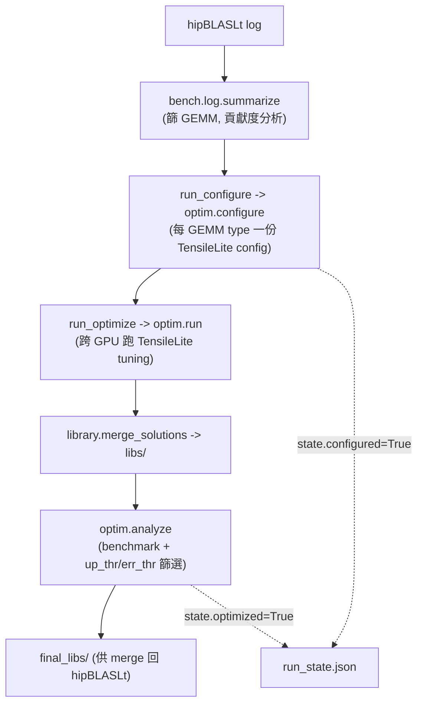
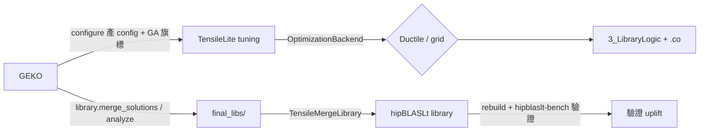

# GEKO 深入導讀：GEMM Kernel Optimization 編排框架

路徑說明：本檔在 `study_docs/geko-ductile/`。連原始碼往上兩層：`../../projects/...`。GEKO 原始碼在 **`origin/gemm_tuner_pr`** branch 的 `projects/hipblaslt/utilities/geko/`（未進 develop / working tree，可用 `git show origin/gemm_tuner_pr:<path>` 讀）。行號會漂移，以符號名稱為準。先讀 [README.md](README.md) 建立全景。

> GEKO（GEMM Kernel Optimization）是一套 Python 框架，把「從真實 workload 到 optimized library」整條自動化。它自己**不搜參數**（那是 Ductile / grid 的事），而是負責**編排**：解析 log、產生 TensileLite 設定、跨 GPU 驅動 tuning、分析篩選、合併回 hipBLASLt。

## 白話總覽：一位自動化研發主廚

把 GEKO 想成餐廳的「自動化研發主廚」：

1. **讀點單紀錄**（hipBLASLt log）：看客人實際點了哪些 GEMM（M/N/K、datatype、轉置）。
2. **開研發單**（configure）：把相似的 GEMM 分組，為每組寫一張「要試哪些 kernel 參數」的 TensileLite 設定。
3. **指揮後廚試菜**（optimize / search）：把研發單發到多張 GPU 上跑 tuning，收集效能。
4. **驗收挑菜**（analyze / filter）：benchmark 比較，挑出真的更快的 kernel。
5. **併進正式菜單**（merge）：用 `TensileMergeLibrary` 把新贏家合併回 hipBLASLt library，重建。

它不決定「怎麼試菜」——那是搜尋引擎（Ductile GA 或 grid）的事。GEKO 決定的是「試哪些、在哪試、怎麼收尾」。

## 三種模式（恰選一）

GEKO 對外是單一進入點 `./bin/geko`，三種模式（完整 CLI 見 [../internal_docs/gemm-kernel-optimization-geko.md](../internal_docs/gemm-kernel-optimization-geko.md)）：

| 模式 | CLI | 做什麼 | 底層搜尋引擎 | 速度 |
| --- | --- | --- | --- | --- |
| `--tune` | GA / grid tuning | configure → optimize：產新 kernel 參數 | Ductile（預設）或 tensile grid | 慢（小時級） |
| `--search` | dense benchmark | 對**既有** solutions 窮舉 benchmark、挑 winner，不產新 kernel | hipblaslt-bench + 既有 library | 較快（分鐘級） |
| `--bench` | 純量測 | 只在 workload 上跑 hipblaslt-bench，不 tuning | 無 | 快 |

> 白話：`--tune` 是「研發新菜」，`--search` 是「從現有菜色裡幫每個訂單挑最好的一道」，`--bench` 是「純試吃量時間」。多數效能問題其實 `--search` 就能解決（selection 沒用好既有 library），不需要動 `--tune`。

## 四個 workflow entry（pipeline.py）

程式上，這些模式對應到 [geko/pipeline.py](../../projects/hipblaslt/utilities/geko/geko/pipeline.py)（`gemm_tuner_pr` branch）的四個 public 函式，全部由 CLI / scripts 呼叫：

| 函式 | 對應模式 | 主要步驟 |
| --- | --- | --- |
| `run_bench` | `--bench` | 解析 log → 產 bench YAML → `bench.standard_benchmark` |
| `run_configure` | `--tune` 步驟 1 | `bench.log.summarize` 篩 GEMM → `gemm_configs_from_gemm_dataframe` → `optim.configure(backend=...)` 產 config |
| `run_optimize` | `--tune` 步驟 2 | `optim.run` 跨 GPU tuning → `library.merge_solutions` → `optim.analyze` 篩選 → 產 `final_libs/` |
| `run_search` | `--search` | `summarize` → `search.configure/run` dense benchmark → `library.operations.extract_solutions` winner → `analyze` → `final_libs/` |

### 可續跑：RunState（run_state.json）

每個 workflow 開頭都會呼叫 `_prepare_workflow_context(...)`，它會在 workdir 建/讀一份 `run_state.json`（[geko/schemas.py](../../projects/hipblaslt/utilities/geko/geko/schemas.py) 的 `RunState`）。它記錄 `configured` / `optimized` 等旗標與 log 檔的 sha256，讓流程**可中斷後續跑、可稽核**（例如 `run_optimize` 會先檢查 `state.configured` 為真才繼續）。



## GEKO 怎麼選 backend：一個旗標

GEKO 與 Ductile/grid 的接點非常單純，就在 [geko/optim/optim.py](../../projects/hipblaslt/utilities/geko/geko/optim/optim.py) 的 `configure()`：

```python
config = {
    "ARCH": arch,
    "GA": backend.lower() == "ductile",   # 關鍵：GA=True 就用 Ductile，False 就用 grid
}
config["GemmProblems"] = gcs
apply_input_config_defaults(config)
cg.run(config, hipblaslt_path, output_dir, write_shell_scripts=False)
```

白話：GEKO 把 `--backend` 轉成 TensileLite config 裡的一個 `GA` 布林旗標寫進 YAML；之後 TensileLite 讀到這個 config，就在它的 `OptimizationBackend` 介面選 `DuctileBackend`（GA）或 `TensileBackend`（grid）。**GEKO 本身完全不碰 GA 演算法**——那都在 Ductile 裡（見 [ductile-deep-dive.md](ductile-deep-dive.md)）。

`optim.run(...)` 則負責「跨 GPU 執行」：先 `build_tensilelite_client` 編一次 client，再用 `concurrency.runner` 的 `Runner`/`Worker` 把每份 config 當一個 job 分派到多張卡（workload-based 排程），並在 `build_*/` 下追蹤進度（`.running` marker、`*-tensilelite.log`）。

## package 架構地圖

GEKO 依流程階段拆模組（在 `origin/gemm_tuner_pr` 的 `projects/hipblaslt/utilities/geko/geko/`）：

| 模組 | 角色 |
| --- | --- |
| `pipeline.py` | 四個 workflow entry（configure/optimize/search/bench），維護 `run_state.json`。 |
| `cli.py` | `./bin/geko` 的參數解析與模式分派。 |
| `config_generator/` | log/list/inline → TensileLite tuning YAML；`fork_params/hw_profiles/gfx942`、`gfx950` 放各架構的 fork 參數 profile 與後處理；`mi_designer.py`、`sizes.py`、`cluster_sizes.py` 決定 MatrixInstruction 與 size 分群。 |
| `optim/optim.py` | `configure`（產 config，設 `GA` 旗標）、`run`（跨 GPU tuning）、`analyze`（benchmark + 篩選 optimized kernels）。 |
| `search.py` | dense search（offline tuning）：對既有 solutions 窮舉 benchmark、挑 winner。 |
| `library/operations.py` | library 載入 / `merge_solutions` / `extract_solutions` / `from_dataframe` / `create`（呼叫 `TensileCreateLibrary`）/ `prune_library`。 |
| `bench/` | `bench.py`（跑 hipblaslt-bench）、`log.py`（解析 / summarize hipBLASLt log）、`utils.py`。 |
| `concurrency/` | 多 GPU job 併發（`runner.py` 的 `Runner`/`Worker`、負載平衡）。 |
| `schemas.py` | 型別化資料結構：`GemmType`（GEMM 規格）、`GemmConfig`（type + sizes）、`RunState`（workflow 狀態）。 |
| `gemm_metrics.py` / `constants.py` / `utils.py` | 效能指標、datatype 對應、共用工具（device 管理、client 快取）。 |

### 一個易混點：GemmType 的兩套 dtype 視角

`schemas.py` 的 `GemmType`（frozen dataclass）同時持有 **hipBLASLt 視角**（`a_type`/`b_type`/`c_type`/`compute_type`，如 `f16_r`）與 **Tensile 視角**（`data_type`/`dest_data_type`/`compute_data_type`，如 `H`/`H`/`S`）。它提供 `from_hipblaslt(...)` 與 `from_tensile(...)` 兩個 factory，會自動把另一套補齊，確保「log 解析出來的 dtype」與「寫進 TensileLite config 的 dtype」一致。這是 GEKO 橋接 hipBLASLt log 與 TensileLite config 的關鍵資料結構。

## 輸出目錄結構（--tune）

```text
workdir/
├── run_state.json                 # workflow 狀態（可續跑）
├── hipblaslt-log-mask64.yaml/.out # baseline benchmark
├── summary.csv / gemms.csv        # GEMM 貢獻度分析 / unique GEMMs
├── optimizations/                 # configure 產出
│   ├── BBS_TN_0.yaml              # 每 GEMM type 一份 TensileLite config
│   └── build_*/3_LibraryLogic/*.yaml   # optimize 產出的 per-GEMM logic
├── libs/                          # merge_solutions 後的中間 library
├── results/                       # analyze 的 raw/final 效能 CSV
└── final_libs/                    # 篩選後 optimized libraries（供整合）
```

`--search` 佈局類似，但多一個 `winners.csv`（每個 GEMM 的最佳既有 kernel）與 `search/` 目錄，且 `final_libs/` 是「重映射既有 solution」而非新 tune 的 kernel。

## GEKO 與其他組件的交互（本文件重點）



- **對 TensileLite**：GEKO 產 config、用 `optim.run` 驅動 tuning；「怎麼搜參數」交給 backend（Ductile / grid）。
- **對 Ductile**：只透過 config 的 `GA` 旗標間接選用；GEKO 不含任何 GA 程式碼。
- **對 hipBLASLt**：`--search` 用 hipblaslt-bench 量既有 library；tuning 完用 `TensileMergeLibrary` 把 `final_libs/` 合併回 hipBLASLt 的 Logic 目錄再 rebuild。

## 一句話總結

> **GEKO 是 tuning 的「總指揮」：讀真實 workload、分組產 config、跨 GPU 驅動 TensileLite tuning、分析篩選、合併回 hipBLASLt——但「怎麼搜參數」是透過一個 `GA` 旗標交給 Ductile（GA）或 grid backend。** 搜尋引擎本身見 [ductile-deep-dive.md](ductile-deep-dive.md)。
