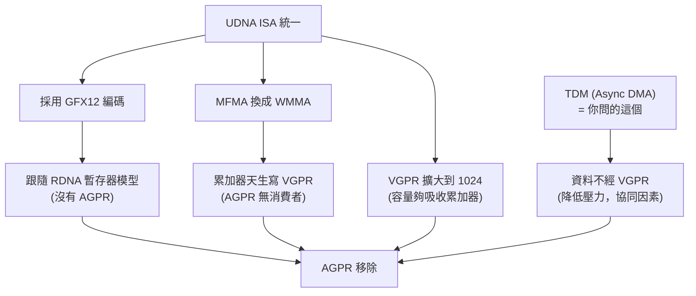
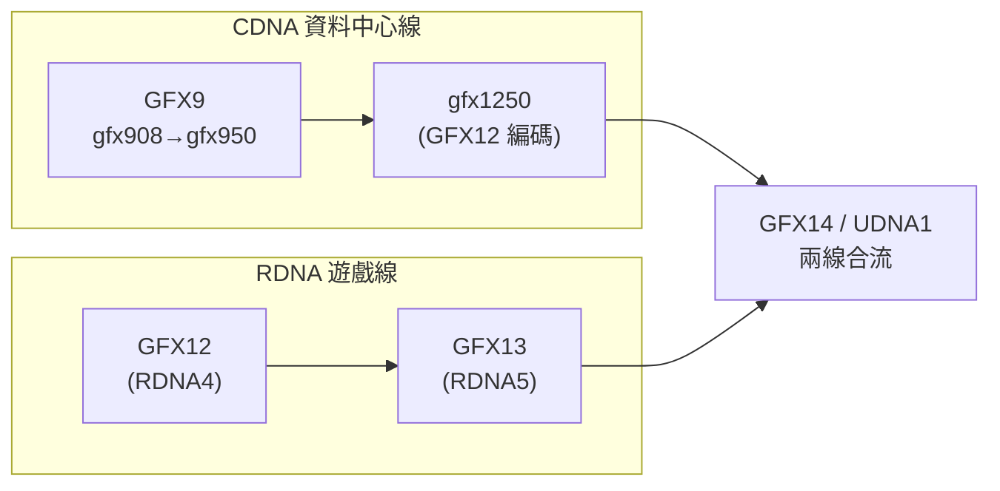

# CDNA5 / gfx1250（MI450）深入：從 gfx942/gfx950 過來要重學什麼

路徑說明：本檔在 `study_docs/gpu_knowledge/`。連回頂層用 `../`（如 `../amd-isa-kernel.md`）。

> **平台定位（先讀）：** 本 repo 的**實驗 / 研究平台是 MI300（gfx942 / CDNA3）**，本檔（CDNA5 / gfx1250）
> 與 CDNA4 都是**未來 migration 的參考**，不是目前實驗用的架構。**近期 migration 目標是 MI350
> （gfx950 / CDNA4）**，其官方規格見 [../isa/spec-sources.md](../isa/spec-sources.md)
> （含 [CDNA4 白皮書](../../../amd-cdna-4-architecture-whitepaper.pdf) 與
> [CDNA4 ISA](../../../amd-instinct-cdna4-instruction-set-architecture.pdf)）；CDNA5 / gfx1250 則是更遠期的斷裂式改動。

## 白話總覽

[execution-model.md](execution-model.md) 的〈[CDNA5（gfx1250）的架構斷裂](execution-model.md#cdna5gfx1250的架構斷裂為何不是漸進式更新)〉
只給了「有哪些東西變了」的鳥瞰。這一份是**深入層**，把六個最容易卡住的點逐一講清楚：
AGPR 是什麼、WGP 跟 CU 差在哪、MFMA 為何整個換成 WMMA、dual-issue 有什麼好處、
wait counter 與 barrier 為何要拆開、以及「零二進位相容」跟 AMD 的 UDNA 統一戰略是什麼關係。

一句話抓住：

> **gfx1250 不是把 gfx950 調快一點，而是換了一套 ISA（GFX9 → GFX12）。**
> 執行模型、矩陣指令、暫存器、同步原語幾乎全部重寫，所以舊 kernel 不能只改個 target 就跑。

## 為何重要

本 repo 的 ISA 實作層目標仍是 **gfx942（CDNA3，wave64、MFMA、AGPR）**，見
[../amd-isa-kernel.md](../amd-isa-kernel.md)。但 AMD 的下一代資料中心 GPU（MI450 / gfx1250）
已經走到 **CDNA5 / GFX12**。如果之後要把 hipBLASLt / Tensile 的 kernel 遷過去，這六點就是
「心智模型必須先更新」的地方——否則會用 gfx942 的直覺去讀 gfx1250 的程式而處處誤解。

> 註：本檔數字整理自 AMD 內部文件（Confluence，連結見文末）。標「內部文件實測/宣稱」的
> 效能數字是 AMD 內部量測，非本 repo 實測，僅供理解相對量級。

---


## 1. AGPR 是什麼？（以及為何 gfx1250 把它拿掉）


### 先搞懂 miSIMD / shSIMD / XDL（AGPR 的由來）

要懂 AGPR，得先知道 CDNA 的 CU 裡其實有**兩種 SIMD**（不是只有一種）：


| 名稱         | 全稱                      | 做什麼                                       | 配的暫存器檔                 |
| ---------- | ----------------------- | ----------------------------------------- | ---------------------- |
| **shSIMD** | Shader SIMD             | 跑一般 VALU 指令（`v_add`、`v_fma`、`v_cmp`…）     | **ArchVGPR = 一般 VGPR** |
| **miSIMD** | Matrix-Instruction SIMD | 跑 MFMA（矩陣乘加）；對外商業名叫 **XDL / Matrix Core** | **AccVGPR = AGPR**     |


**XDL** 就是 miSIMD 的對外名稱（AMD 對外講「Matrix Core」）。它內部由大量 **DOT 單元**
（例如 gfx908 有 32 個 `DOT4_F32_F16` 單元）組成，專門做矩陣乘加。

重點在於：**miSIMD 這條矩陣運算路徑，配的是一個獨立的暫存器檔 AccVGPR——這個 AccVGPR 就是 AGPR。**

 所以 AGPR 不是憑空 多出來的，它是「矩陣單元專用的那組暫存器」。

> 在 gfx1250 上 XDL 仍然存在（文件標為 "XDL, enhanced"），但改用 WMMA 指令驅動，並新增
> **Core MACC / Side MACC（CMACC/SMACC）** 兩條 VALU 通道支援 dual-issue（見 §4）。


### AGPR 定義

**AGPR = Accumulator General Purpose Register（累加器通用暫存器）**，是 CDNA 架構
（gfx908–gfx950）中**獨立於 VGPR 之外的一組額外向量暫存器**（也就是上面說的 AccVGPR），
專門拿來放 MFMA（矩陣乘加）指令的累加結果。

### 為什麼要多一組暫存器？

先講直覺：矩陣乘加會產生**大量**的中間累加結果（C 矩陣），如果這些全塞進一般的 VGPR，
會把 VGPR 用光，導致一個 SIMD 能同時掛的 wave 變少（occupancy 掉），算力反而發揮不出來。
AMD 的解法是額外開一組專用暫存器：


| 問題                                  | AGPR 的解法                                |
| ----------------------------------- | --------------------------------------- |
| MFMA 輸出大量累加結果，塞 VGPR 會擠壓 occupancy  | AGPR 提供**額外 ~256 個暫存器/wave**，不佔 VGPR 預算 |
| 矩陣單元（XDL / Matrix Core）需要獨立讀寫通道維持吞吐 | AGPR 有專屬讀寫 port，不跟一般 VALU 搶             |


### MFMA 指令怎麼用 AGPR

```asm
v_mfma_f32_16x16x16_f16  a[0:3], v[A], v[B], a[0:3]
;                        ^^^^^^ 累加器輸出(AGPR)          ^^^^^^ 累加器輸入(AGPR)
;                                 v[A]/v[B] = A/B 矩陣，從 VGPR 讀
```

- **A / B 矩陣**：從 VGPR 讀，送進矩陣單元運算。
- **C 矩陣（累加器）**：從 AGPR 讀、結果也寫回 AGPR。
- 算完要把結果搬回一般 VGPR（例如要寫回 global memory 前），得用 `v_accvgpr_read_b32`——**每搬一個就是一次額外開銷**。這個「AGPR↔VGPR 搬運」正是 CDNA舊世代 GEMM kernel 的一個固定成本。

### gfx1250 的變化：AGPR 直接消失


| 世代                 | VGPR / wave | AGPR    | 矩陣指令                 |
| ------------------ | ----------- | ------- | -------------------- |
| gfx942（MI300）      | 256         | 256     | MFMA（累加寫 AGPR）       |
| gfx950（MI350）      | 256         | 256     | MFMA（累加寫 AGPR）       |
| **gfx1250（MI450）** | **最多 1024** | **不存在** | **WMMA（累加直接寫 VGPR）** |


gfx1250 把 AGPR 和 VGPR **合併成單一的大 VGPR 檔案**（每 wave 最多 1024 個，超過 256 用
`s_set_vgpr_msb` 做高位索引）。好處是：WMMA 的累加器直接放在 VGPR，**徹底省掉**
`v_accvgpr_read/write` **的搬運開銷**，也不用再為「VGPR 和 AGPR 各要留多少」傷腦筋。

### 為什麼「一定」要把結果搬回 VGPR？AGPR 不能直接用嗎

會有「AGPR 已經存了結果，幹嘛還搬回 VGPR」的疑問，是很自然的。答案是 **AGPR 的連接性
（能被誰讀寫）極度受限**——它幾乎只跟矩陣單元通電：


| AGPR **能**做                        | AGPR **不能**做（後果）                                           |
| ---------------------------------- | ---------------------------------------------------------- |
| 被 MFMA 讀寫（`a[0:3]` 當累加器）           | 不能被 global / `buffer_store` 讀 → 要寫回 global 必須先搬到 VGPR      |
| 被 `v_accvgpr_read/write` 與 VGPR 互搬 | 不能被 `ds_write` 讀 → 要寫進 LDS 必須先搬到 VGPR                      |
| 用 inline constant 初始化（如清零）         | 不能做 VALU 運算 → 要做 activation / scale / normalize 必須先搬到 VGPR |
|                                    | 不能被 VMEM load / `ds_read` 寫入 → 從記憶體載入只能進 VGPR              |


內部文件明確寫：AGPR *"accessed by only MFMA and VGPR copy instruction. Can't copy global,
LDS to AccVGPR."* 所以在典型 GEMM 的 **epilogue**（把累加結果寫回 global，或先做 activation）
之前，你被迫把整批累加器逐個搬回 VGPR：

```asm
;; gfx942：128 個 AGPR 累加器，要寫回 global 前得全部搬回 VGPR
v_accvgpr_read_b32  v0,  a0     ; 1 cycle × 128 次 ≈ 128 cycle 固定開銷
...
v_accvgpr_read_b32  v127, a127
buffer_store_dword  v0, ...     ; 這時才能 store

;; gfx1250：累加器本來就在 VGPR，直接 store
buffer_store_b128   v[0:3], ... ; 零搬運開銷
```

這也是為什麼舊世代一堆 Jira / 編譯器提案都在抱怨 AGPR：`v_accvgpr_read/write` 太多、
AGPR affinity 分配常常分錯、spill/reload 排程有缺陷。**統一成一個大 VGPR 檔案後，這整類
問題直接消失。**

### 統一 AGPR 是因為引入了 Async DMA（TDM）嗎？

**不是主因，但 TDM 是協同因素。** 這是個好直覺，可惜因果反了——AGPR 會消失是「ISA 統一 +
WMMA 設計」的必然結果，TDM 只是讓這個決定的代價更低。把五個因素依權重排開：


| 因素                 | 角色                                                               | 權重    |
| ------------------ | ---------------------------------------------------------------- | ----- |
| **UDNA ISA 統一**    | 根本因：RDNA（GFX10/11/12）本來就**沒有 AGPR**，gfx1250 用 GFX12 編碼就得跟隨       | ★★★★★ |
| **MFMA → WMMA**    | 直接因：WMMA 是 RDNA 系指令，**天生把累加器寫進 VGPR**，AGPR 沒有消費者了                | ★★★★★ |
| **AGPR 工程痛點**      | 推動因：消除 `v_accvgpr` 搬運、affinity 分錯、spill 缺陷                       | ★★★   |
| **VGPR 擴到 1024**   | 使能因：容量夠大，累加器也放得下                                                 | ★★★   |
| **TDM（Async DMA）** | 協同因：global→LDS 由 DMA 直送、**不再經過 VGPR**，VGPR 壓力大降，即使累加器也放 VGPR 也夠用 | ★★    |


用資料路徑對比最清楚（★★ 那條 TDM 的作用）：

```
舊（gfx942，無 TDM、有 AGPR）：
  Global --buffer_load--> VGPR --ds_write--> LDS --ds_read--> VGPR --MFMA--> AGPR
          （每一步都佔 VGPR，所以才需要 AGPR 幫累加器分流）

新（gfx1250，有 TDM、無 AGPR）：
  Global --TDM(DMA)--> LDS --ds_read--> VGPR --WMMA--> VGPR
          （global→LDS 完全不經 VGPR，VGPR 壓力大降）
```




> 一句話：**AGPR 移除是 UDNA 統一與 WMMA 設計的必然；TDM 讓這個決定「代價更低」（資料搬運
> 不再佔 VGPR），但 TDM 不是原因。**

---


## 2. WGP vs CU：到底差在哪


### 本質區別（一句話）

- **CU（Compute Unit）**：GCN / CDNA 舊世代的基本運算單元，內含 4× SIMD16 + 自己的 LDS。
- **WGP（WorkGroup Processor）**：RDNA / GFX10+ 引入的單元，**概念上把兩個 CU 融合**，
共享一塊更大的 LDS 與 cache。gfx1250 的資源／排程單位就是 WGP。


### 核心對比


| 面向            | gfx942 CU          | gfx1250 WGP                  |
| ------------- | ------------------ | ---------------------------- |
| 組成            | 4× SIMD16          | 4× SIMD32（約等於 2 個 CU 融合）     |
| wave 大小       | Wave64（4 cycle 發完） | **Wave32（1 cycle 發完）**       |
| LDS           | 64 KB（每 CU 獨立）     | **最多 320 KB（WGP 統一、可配置）**    |
| L0 cache      | 32 KB（獨立 SRAM）     | **與 LDS 合併成 384 KB 統一 WGP$** |
| VGPR / wave   | 256 + 256 AGPR     | **最多 1024（統一，無 AGPR）**       |
| 矩陣指令          | MFMA（阻塞 VALU）      | **WMMA（可與 VALU 並行）**         |
| Named barrier | 無（只有 `s_barrier`）  | **每 workgroup 16 個**         |
| Tensor DMA    | 無                  | **TDM（async global↔LDS）**    |


> 簡單說：**WGP ≈ 更大的 CU**——把兩個 CU 的 LDS 與 cache 統一，讓同一個 workgroup 內的
> wave 有更大的共享空間與更細粒度的同步能力。回到 [execution-model.md](execution-model.md)
> 的三軸：CDNA5 的「工廠」（維度 C）要看 WGP，一排寬度（維度 A）從 64 變 32。


### WGP 內部結構與 workgroup 怎麼被分配進來

精確的內部結構（跨多份內部文件交叉驗證後）是 **1 WGP = 2 CU = 4 個 SIMD32**：

```
WGP（WorkGroup Processor）
├── CU 0
│   ├── SIMD32 #0 ── SQ #0 (wave scheduler) ── 16 wave slot
│   └── SIMD32 #1 ── SQ #1 ────────────────── 16 wave slot
├── CU 1
│   ├── SIMD32 #2 ── SQ #2 ────────────────── 16 wave slot
│   └── SIMD32 #3 ── SQ #3 ────────────────── 16 wave slot
├── Scalar Unit（4 個 SIMD 共用）
├── XDL / Matrix Unit（共用）
├── TDM #0（SIMD-pair 0：SIMD #0+#1）、TDM #1（SIMD-pair 1：SIMD #2+#3）
└── WGP$ 384 KB（統一 = LDS + L0 cache，最多 320 KB 作 LDS）
```

**workgroup 怎麼上場**（dispatch 流程）：

1. **SPI（Shader Processor Input）** 收到 workgroup dispatch 請求。
2. SPI 依資源（wave slot / VGPR / LDS）挑一個 WGP。
3. 這個 workgroup 的**所有 wave 會分散到該 WGP 的 4 個 SIMD32**——**不是綁在單一 SIMD 上**。
4. 每個 SIMD32 有自己的 **SQ（Sequencer / wave scheduler）** 排自己的 wave。
5. WGP 內 4 個 SIMD32 **共用同一塊 LDS**。

**幾個常見誤解修正**（含我之前回答講錯的地方）：


| 常見誤解                     | 正確                                             |
| ------------------------ | ---------------------------------------------- |
| 一個 WGP 有 8 個 SIMD        | **4 個 SIMD32**（= 2 CU × 2）                     |
| 一個 SIMD 最多 8 個 wave      | gfx942 是 8；**gfx1250 SIMD32 是 16 個 wave slot** |
| workgroup 被塞進「其中一個 SIMD」 | workgroup 的 wave **分散在 WGP 的全部 4 個 SIMD32**    |


**全晶片規模**：gfx1250 每 XCD 有 16 WGP（= 32 CU），8 個 XCD 合計 **128 WGP / 256 CU**；
對比 gfx942 的 304 CU。CU 數量看似變少，但靠 §4 的多重 dual-issue 把每個單元的利用率拉高，
整體吞吐仍大幅提升。

> caveat：有些內部文件寫「1 WGP = 1 CU」，那是指 **gfx1250 移除了 CU-mode、WGP 成為唯一的
> 排程/分配單位**（不能再獨立操作半個 WGP），**不是**說物理上一個 WGP 只有一個 CU。物理上
> 仍是 **1 WGP = 2 CU = 4 SIMD32**。

---


## 3. MFMA → WMMA：為什麼換、差在哪、MFMA 被淘汰了嗎


### 為什麼要換？

核心原因是 **ISA 統一（UDNA）**。gfx1250 雖然是資料中心等級的 GPU，卻採用 **GFX12 指令編碼**
（這個編碼家族歷史上屬於 RDNA 那條線）。要把 CDNA 與 RDNA 統一到同一套 ISA，就得把 CDNA
獨有的 `V_MFMA_*` 換成 GFX12 體系的 `V_WMMA_*`（**W**ave **M**atrix **M**ultiply **A**ccumulate）。

### 指令級差異


| 面向        | MFMA（gfx942）       | WMMA（gfx1250）                                   |
| --------- | ------------------ | ----------------------------------------------- |
| 前綴        | `V_MFMA_*`         | `V_WMMA_*`（稀疏用 `V_SWMMAC_*`）                    |
| wave 大小   | Wave64             | Wave32                                          |
| 累加器       | AGPR（獨立檔案，需搬運）     | **VGPR（統一，零搬運）**                                |
| 與 VALU 並行 | 阻塞 VALU            | **可 co-execution**                              |
| K 維度深度    | 4 / 8 / 16 / 32    | **32 / 64 / 128**（每條算更深）                        |
| 低精度       | FP16 / BF16 / INT8 | **再加 FP8 / BF8 / FP6 / FP4 + 微縮放**              |
| 矩陣重用      | 無                  | `matrix_a_reuse` **/** `matrix_b_reuse` **修飾符** |
| 指令編碼      | VOP3P（64-bit）      | **VOP3PX2（128-bit，可融合 LD_SCALE + WMMA）**        |


### MFMA 是被 deprecate 還是被移除？

**在 gfx1250 上是「直接移除」，不是「標記淘汰」**：MFMA 的 opcode 在 GFX12 編碼裡根本不存在，
所有矩陣 GEMM 都必須改用 WMMA。但這只發生在新 ISA 家族；**MFMA 在舊平台（gfx908–gfx950）
仍然完整支援**。所以正確理解是：**這是一次「跨 ISA 家族的替換」，不是同一家族內的漸進淘汰。**

> 對本 repo 的意義：現在的算力來源 `v_mfma_*`（見 [../amd-isa-kernel.md](../amd-isa-kernel.md)）
> 遷到 gfx1250 需整段改寫成 `v_wmma_*`，且 operand layout、累加器位置都不同，不是換名字而已。

---


## 4. Dual-Issue（雙發射）帶來的好處

gfx1250 有**三層互相獨立的並行執行機制**，目標都是「不要讓昂貴的矩陣單元或 VALU 閒著」。

### 為什麼 MFMA 擋 VALU、WMMA 卻能並行？（issue-port 之差）

關鍵不在矩陣單元本身，而在 **SQ（Sequencer）有幾個指令發射端口（issue port）**。

- **gfx942**：VALU 與 MFMA **共用同一個 VALU issue port**。MFMA 佔住這個 issue 視窗時，
VALU 就發不出去（被擋）。不過 VMEM load / LDS / SALU 走的是**別的 pipe**，在 MFMA 執行
期間**仍可**發射——這正是 CK 的 `sched_group_barrier` 能在 MFMA 之間塞 DS/VMEM、卻**塞不了
VALU** 的原因。
  ```
  gfx942 SQ：只有 1 個 VALU issue port
      shSIMD(VALU) ── 共用 ── miSIMD(MFMA)   ← MFMA 佔用時 VALU 被擋
  ```
- **gfx1250**：VALU / SALU / VMEM / LDS / XDL(WMMA) **各有獨立 issue port**。WMMA 執行中的
某些 cycle 標為 `[I]`（co-execution window），SQ 可在那些 cycle **同時發一條 VALU**——
於是「XDL 算矩陣」與「VALU 做位址計算 / 資料轉換」真正重疊。
  ```
  gfx1250 SQ：多個獨立 issue port
      VALU │ SALU │ VMEM │ LDS │ XDL(WMMA)   ← 各自獨立，可同 cycle 並行
  ```

**gfx942 真的有這個痛點嗎？有，而且很嚴重**：MFMA 擋 VALU 使 XDL 利用率只有約 62%，GEMM 的
位址計算/scale 只能硬排在 MFMA 之間形成 pipeline bubble；CK 團隊被迫用複雜的 **ping-pong
scheduling**（兩個 wave 交替，一個 load、一個 MFMA）來遮掩，複雜且編譯器容易排錯。gfx1250 的
co-execution 直接把 XDL 利用率拉到約 92%，且不需要 ping-pong。

### 三種 dual-issue 分別是「誰」在並行


### (1) WMMA + VALU Co-execution（最關鍵）

**誰**：**同一個 wave** 的 WMMA 指令與 VALU 指令。


| gfx942                  | gfx1250                                |
| ----------------------- | -------------------------------------- |
| MFMA 執行時 VALU **完全被卡住** | WMMA 在矩陣單元上跑時，VALU **可在同一 cycle 並行發射** |


WMMA 一條指令要跑多個 cycle，其中部分 cycle 標記為 `[I]` 可 issue slot，允許同時塞 VALU 指令
（例如位址計算、LDS load）進去。這樣「算矩陣」和「準備下一塊資料」就能重疊。

> 內部文件實測/宣稱：HGEMM 128×64 的矩陣單元利用率（loop steady state）從 **62% → 92%**。


### (2) Dual VALU Issue

**誰**：**同一個 SIMD32 上的兩個不同 wave**。

它們可在同一 cycle 各發射 1 條 VALU——一條走 **Core MACC（CMACC）**、一條走 **Side MACC
（SMACC）**（SIMD32 的兩條 ALU 通道），等於 VALU 吞吐翻倍的機會。

### (3) VOPD（Packed Dual-Issue）

**誰**：**同一個 wave 的 2 條 32-bit VALU 操作**，打包進一條 VOPD 指令。

```asm
v_dual_mov_b32 v0, v1  ::  v_dual_mov_b32 v2, v3   ; 1 cycle 做 2 個 mov
```

硬體把打包的兩個操作分別送到 Core MACC 與 Side MACC，同一 cycle 各執行一個。

### 好處總結


| 收益                               | 量級（內部文件宣稱）                |
| -------------------------------- | ------------------------- |
| 消除「MFMA 阻塞 VALU」的死時間             | VALU 利用率大幅提升              |
| 矩陣單元利用率                          | 約 +30%（loop steady state） |
| `matrix_a_reuse` 減少 A 矩陣的 LDS 讀取 | 約 −75%                    |
| 消除 AGPR↔VGPR 搬運                  | 趨近零開銷                     |


---


## 5. Wait Counter + Named Barrier：原本為何綁在一起、拆開後好在哪


### 原本的設計（GFX9 / CDNA）：粗粒度

**Wait counter 是「三個大鍋燉」**——把很多不同的記憶體操作混在同一個計數器裡：


| Counter   | 混了什麼                                                |
| --------- | --------------------------------------------------- |
| `vmcnt`   | **所有** VMEM 的 load + store 混在一起                     |
| `lgkmcnt` | **所有** LDS 操作 + scalar memory + wave 間 message 混在一起 |
| `expcnt`  | export / GDS 完成計數                                   |


問題在於**無法精準等待**：你只想等 load 完成，但 `vmcnt` 裡還混著 store；你只想等 LDS，
但 `lgkmcnt` 裡還混著 scalar load。於是常見寫法變成 `s_waitcnt vmcnt(0) lgkmcnt(0)`——
**過度同步**，把整條記憶體 pipeline 排空，白白浪費記憶體並行度。

**Barrier 也只有一種**：`s_barrier` 把「通知 + 等待」綁成一個動作，wave 一碰到就 stall；
一個 workgroup 只有這一個 barrier。結果是 **「barrier bubble」**：跑得快的 wave 只能呆等最慢的。

### 分離後的設計（GFX12 / gfx1250）：細粒度

**Wait counter 拆成多個專用計數器：**


| GFX9      | GFX12 拆成                                                  |
| --------- | --------------------------------------------------------- |
| `vmcnt`   | `s_wait_loadcnt`（只等 load）＋ `s_wait_storecnt`（只等 store）    |
| `lgkmcnt` | `s_wait_dscnt`（只等 LDS）＋ `s_wait_kmcnt`（只等 scalar/message） |
| （無）       | `s_wait_tensorcnt`（TDM）、`s_wait_asynccnt`（async copy）     |


**Barrier 拆成 signal / wait 兩半，並新增多種類型：**


| GFX9                        | GFX12                                         |
| --------------------------- | --------------------------------------------- |
| `s_barrier`（signal+wait 合一） | `s_barrier_signal` ＋ `s_barrier_wait`（可分開）    |
| 只有 1 個 barrier              | **16 個 named barrier / workgroup**            |
| 無跨 workgroup                | **4 個 cluster barrier**（跨 WGP）                |
| 無 election                  | `s_barrier_signal_isfirst`（選舉原語，選出第一個到的 wave） |


### 拆開後的好處


| 面向                   | 效果                                                  |
| -------------------- | --------------------------------------------------- |
| 精準同步                 | 只等你真正需要的那類操作，不拖累其他 pipeline                         |
| 消除 barrier bubble    | 先 signal，之後還能做別的事，最後才 wait                          |
| Producer-Consumer 模式 | named barrier 讓「載入 wave」與「運算 wave」各自同步，做軟體 pipeline |
| 更高記憶體並行度             | 不再因為 `vmcnt(0)` 把整條 VMEM pipeline 排空                |


> 直覺類比：舊設計像「一個總開關，要嘛全等、要嘛不等」；新設計像「每種資源各有一個獨立
> 計時器與門鈴」，可以精準地只等該等的東西。

---


## 6. 「零二進位相容」與 UDNA 的關係


### 什麼是「零二進位相容」？

意思是：**gfx942（GFX9 編碼）和 gfx1250（GFX12 編碼）之間沒有任何二進位相容性。**
每條指令的 opcode 編號、位元欄位佈局都不同——GFX9 的機器碼丟給 GFX12 解碼器就是一堆亂碼，
反之亦然。具體差異包括：

- 指令 opcode 全部重新編號。
- 新增 GFX9 沒有的編碼格式（VOP3PX2、VOPD）。
- 移除舊格式（VINTRP、EXP、MTBUF、GDS）。
- 語意改變（cache 控制從 `glc/slc/dlc` bits 改成 SCOPE + temporal hints）。
- 命名慣例改變（如 `buffer_load_dwordx3` → `buffer_load_b96`）。


### 為什麼這樣配合 UDNA？

**UDNA（Unified DNA）** 是 AMD 的長期戰略：**把 RDNA（遊戲 GPU）與 CDNA（資料中心 GPU）
統一成同一套 ISA。** gfx1250 是關鍵交叉點——它是**第一顆採用 GFX12 編碼的 CDNA 級 GPU**，
從這一代起，兩條產品線站在同一個 ISA 編碼基礎上。




### 為什麼「打破相容」反而有利？

短期陣痛、長期受益：


| 理由         | 說明                                              |
| ---------- | ----------------------------------------------- |
| ISA 無法漸進統一 | GFX9 與 GFX12 編碼空間完全不同，不可能一點一點相容過去               |
| 統一編譯器      | LLVM AMDGPU backend 只需維護一條 GFX12+ 編碼路徑          |
| 統一驅動 / 函式庫 | 底層軟體不必再維護 GFX9 與 GFX12 兩套分支                     |
| 硬體特性共享     | split barrier、VOPD、scope cache、TDM 等同時服務遊戲與資料中心 |
| 跨代向前相容     | 未來 UDNA 世代軟體可直接跑在後續硬體上（統一編碼才做得到）                |
| 降低開發成本     | 不用養兩套 ISA 的驗證、編譯器、kernel library                |


> 類比：**就像從 x86-32 跳到 x86-64——短期完全不相容，但長期讓所有軟體站在同一平台。**
> gfx1250 的「零二進位相容」就是 AMD 為了 UDNA 統一付的一次性代價。

---


## 交叉連結

- 上一層（overview）：[execution-model.md 的 CDNA5 架構斷裂節](execution-model.md#cdna5gfx1250的架構斷裂為何不是漸進式更新)
- 本 repo 的 gfx942 ISA 實作（MFMA / VGPR / AGPR / exec mask）：[../amd-isa-kernel.md](../amd-isa-kernel.md)
- 本資料夾入口：[README.md](README.md)
- 跨文件名詞彙總：[../glossary.md](../glossary.md)
- AMD 內部技術文件（Confluence）：
[gfx1250 to gfx942: Architecture Differences & More](https://amd.atlassian.net/wiki/spaces/MLSE/pages/1633927296)、
[GFX1250 — Comprehensive Technical Reference](https://amd.atlassian.net/wiki/spaces/MLSE/pages/1762232146)、
[GFX1250/MI450 related information](https://amd.atlassian.net/wiki/spaces/SHARK/pages/1126711694)


## 一句話總結

gfx1250（CDNA5）把 AGPR 併進 VGPR、CU 升級成 WGP、MFMA 換成能與 VALU 並行的 WMMA、
同步原語從粗粒度拆成細粒度、並用 GFX12 編碼打破二進位相容——這一切都是為了讓 CDNA 與 RDNA
在 UDNA 底下合流。從 gfx942 過來，這六點就是「必須先重學」的心智模型。