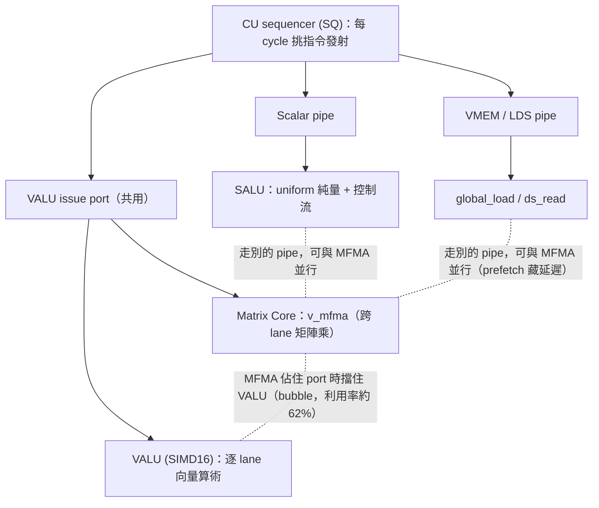
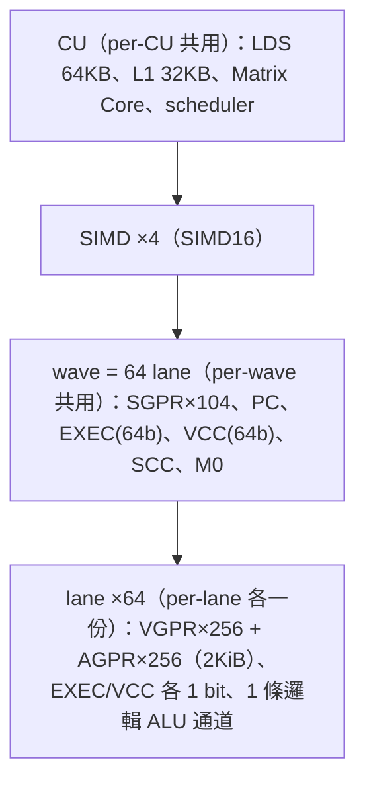
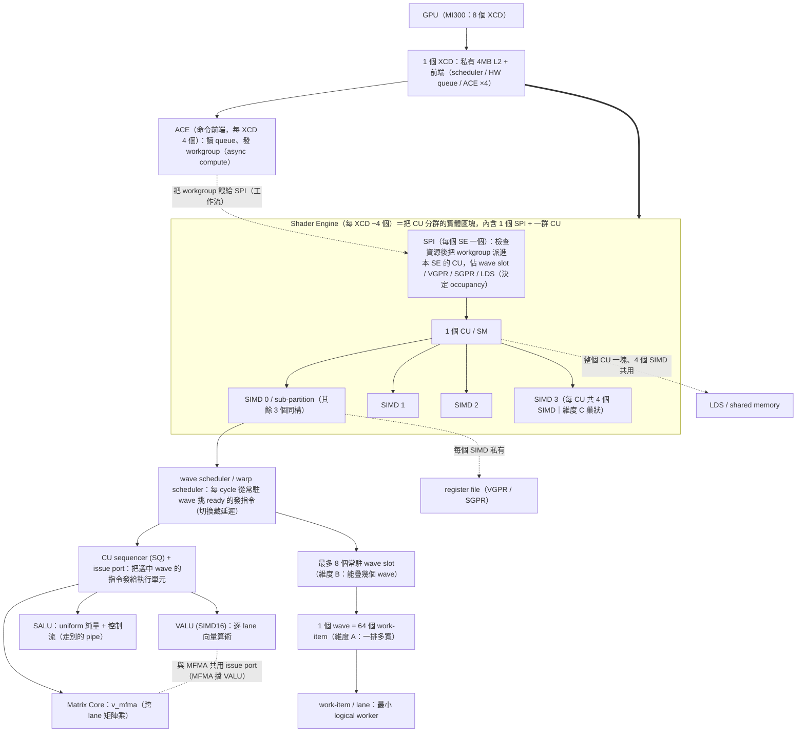
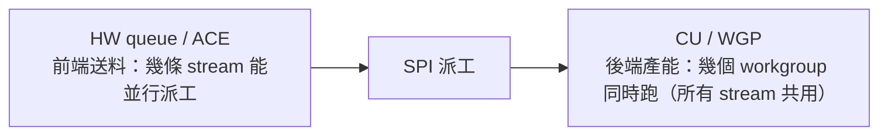

# GPU 執行模型：grid / block / warp / thread / SM / CU

路徑說明：本檔在 `study_docs/gpu_knowledge/`。連回頂層用 `../`（如 `../amd-isa-kernel.md`）。

- 建議先讀本資料夾入口 [README.md](README.md)。

## 白話總覽

寫程式時你看到的是 **grid → block → thread**；GPU 真正執行時會把 block 放到 **SM/CU**
上，再把 block 裡的 threads 切成 **warp/wavefront** 來發射指令。一句話抓住：

> Grid 是整份工作，block 是合作小隊，thread 是小隊成員
>
> SM/CU 是工廠，warp/wavefront 是工廠一次發令的一排工人。

最常見的混淆是把「軟體抽象」和「硬體實體」混為一談。本文先給總圖，再逐一拆解。

## 為何重要

讀懂任何 GPU kernel、做任何效能優化（occupancy、coalescing、divergence）之前，都得先有
這套心智模型。

本檔是 [amd-isa-kernel.md](../amd-isa-kernel.md)（gfx942 ISA 實作層，講 wave /
SGPR / VGPR / exec mask）的前置概念層；那邊的 `wave = 64 lane` 就是這裡的 wavefront。

## 總圖：軟體抽象 vs 硬體實體

軟體 / 程式視角（你寫 kernel 時看到的）：

```
kernel launch
└── grid                         ← 一次 kernel 的全部工作
    ├── block / thread block      ← 可合作的一群 threads
    │   ├── thread                ← 你寫的「每個元素做什麼」
    │   └── ...
    └── block ...
```

硬體 / 執行視角（GPU 實際怎麼跑）：

```
GPU device
└── XCD ×8                         ← AMD chiplet（MI300）；NVIDIA / 單體 GPU 無此層，可略
    └── Shader Engine ×~4          ← 把 CU 分群；每個 SE 一個 SPI 派工器（見下方階層圖）
        └── SM (NVIDIA) / CU (AMD) ← 真正執行 block 的「工廠」
            ├── resident block(s)
            │   ├── warp / wavefront   ← 一次發令的一排 lanes
            │   └── ...
            ├── registers (VGPR/SGPR)
            ├── shared memory / LDS
            ├── warp/wavefront scheduler
            └── ALUs / SIMD lanes / matrix cores ...
```

> 上圖的 **XCD / Shader Engine 是 AMD CDNA（MI300）的中間階層**；初學可先把焦點放在
> 「block → SM/CU → warp」。XCD → SE → CU 的完整說明與 SE 的設計目的見
> [硬體實體階層補充](#硬體實體階層補充xcd--shader-engine--cuse-是什麼和-ace-差在哪)。

對照關鍵：**一個 block 會被完整放到一個 SM/CU 上執行**（所以 block 內 threads 能共享 shared memory/LDS、能 barrier 同步），不可以將一個 block 跨 SM/CU，因為 **block 內 threads 需要合作，而合作用的硬體資源綁在單一 SM/CU 上**；硬體再把 block 內 threads 切成固定大小的 warp/wavefront。

## Kernel：一次丟給 GPU 的函式

你用 `__global__` 標記、由 host 端 launch 的 GPU function 就是 kernel。

```cpp
__global__ void add(float* A, float* B, float* C, int N) {
    int i = blockIdx.x * blockDim.x + threadIdx.x;
    if (i < N) C[i] = A[i] + B[i];
}

add<<<numBlocks, threadsPerBlock>>>(A, B, C, N);  // 一次 launch = 一個 grid
```

每個 thread 都跑同一段 kernel code，但因 `threadIdx`、`blockIdx` 不同而處理不同資料。
launch 的完整步驟見 [kernel-launch.md](kernel-launch.md)。

## Grid：一次 launch 的全部 blocks

Grid 是這次 kernel launch 的所有 blocks——它是「工作清單」，不是硬體、也不等於整張 GPU。

```cpp
int threadsPerBlock = 256;
int numBlocks = (N + threadsPerBlock - 1) / threadsPerBlock;
add<<<numBlocks, threadsPerBlock>>>(A, B, C, N);
```

- 全域 thread 編號公式（CUDA/HIP 通用、極核心）：`blockIdx.x * blockDim.x + threadIdx.x`。
- 資料量不是 block size 整數倍時，多出的 thread 用 `if (i < N)` 擋掉。
- 1D/2D/3D 皆可：1D 配 array、2D 配 image/matrix、3D 配 volume。

**設計用途**：把大問題拆成很多 block，讓同一份 kernel 在小 GPU（少 SM）與大 GPU（多 SM）
都能跑——scheduler 自動把 block 分派到可用 SM/CU。因此：

- block 之間沒有執行順序保證，**不能假設 block 0 比 block 1 早完成**。
- 不同 block 之間不能用 `__syncthreads()` 同步；要溝通得透過 global memory / atomics / 第二個 kernel。


## Thread Block / Work-group：一群可合作的 threads

Block（HIP/OpenCL 常稱 work-group）是一群可以合作的 threads。`blockDim.x = 256` 表示每個
block 有 256 threads。

**設計用途**——讓這群 threads 能：

- 放在同一個 SM/CU 上；
- 共用 shared memory / LDS（block scope 的 on-chip 快速記憶體）；
- 用 `__syncthreads()`（HIP 同名 / AMD ISA 的 `s_barrier`）做 block 內 barrier 同步；
- 合作完成一小塊工作，例如 matmul 的一個 tile、reduction、stencil。

```cpp
__shared__ float tile[256];
tile[threadIdx.x] = some_value;
__syncthreads();          // 全 block 寫完才繼續，之後可安全互讀
```

> ⚠️ **常見誤解補充：block 的 shared memory 是「所有 wave 共用一塊」，不是「每個 wave 平分」。** 你在 launch 時指定的 shared memory（`<<<blocks, threads, sharedMemBytes>>>` 第三個參數）或 kernel 裡的 `__shared__`，本質就是**一整塊給整個 block 共用的 on-chip 記憶體**：block 內所有 wave 看到**同一塊、同一個位址空間**。這正是它存在的意義——若被 wave 平分成各自獨立的小塊，wave A 就讀不到 wave B 寫的值，上面 `__syncthreads()` 後互相讀資料（reduction、matmul tile、stencil）就全做不到了。
>
> 那「每個 wave 各自一份」的是什麼？是**暫存器（VGPR per-lane、SGPR per-wave）**——但它也不是從「block 的記憶體預算」平分出來的，而是從**每個 SIMD 私有的 register file 按 wave 撥**給每個常駐 wave（見 [§wave 切換為何零成本](#wave-切換為何零成本狀態常駐不做存還原vs-cpu-context-switch)）。所以是**兩池不同歸屬**的資源：**shared memory 按 workgroup 算、register 按 wave 算**（對應 [Occupancy 清單](#occupancy-限制清單實際能跑幾個-wave-取最小值) 的 ③ vs ①②）。LDS 作為「每個 CU 一塊、block 內共用」的資源細節見 [memory-hierarchy-and-chiplet.md](memory-hierarchy-and-chiplet.md)。

**Block 不是 SM/CU**（最常見誤解）：

- block 是軟體工作單位，SM/CU 是硬體。
- 一個 SM/CU 可同時 resident 多個 block（取決於 register、shared memory/LDS、warp slot 上限）。
- 一個 block 通常**不跨** SM/CU（否則無法共享 shared memory/LDS）。

**Block size 取捨**：太小則 scheduler overhead 相對高、難發揮 shared memory 合作；太大則每個
block 吃太多 register / shared memory，使 SM/CU 能同時 resident 的 block 變少、occupancy 下降。
常見起點 128 / 256 / 512（多為 warp/wavefront size 的倍數），最佳值需用 profiler 決定。

**一個 workgroup 最多幾個 wave？** 上限是 **16 個 wave**：因為最大 workgroup size = **1024 work-item**（HIP/CUDA 的 `maxThreadsPerBlock`），而一個 wave 是 64 個 work-item（gfx942 wave64），所以 **1024 ÷ 64 = 16**。要注意這 16 是「單一 workgroup」的上限，別和「一個 CU 最多常駐 32 個 wave」（那是整個 CU 的容量、可由多個 workgroup 共住）搞混——兩者的差異見 [§數量關係表](#數量關係表把三軸的數字串起來以-cdna3--cdna4-為例)。（世代差異：CDNA5 / gfx1250 改成 wave32，這個換算的數字會變。）

## Thread / Work-item：最小的 logical worker

Thread（AMD 低階文件稱 work-item）是程式模型裡最小的邏輯工作者，有自己的 index、register
state、program counter。注意它是**邏輯單位，不是一顆硬體 core**——你可能 launch 上百萬個
thread，但 GPU 不會有上百萬個 core，而是分批排到 SM/CU 執行。

GPU thread 與 CPU thread 也不同：

- CPU thread 重、數量少、追求單一 latency
- GPU thread 輕、 數量極多、靠大量並行 + warp 排程來掩蓋 latency、追求 throughput。


## Warp / Wavefront：硬體實際發射指令的一排 lanes

Warp（NVIDIA）/ Wavefront（AMD ISA 術語；HIP 也常用 warp）是 GPU 實際發射指令時的一組
threads，以 SIMT / lockstep 方式執行同一條指令、各自處理不同資料。


| 平台                                   | 名詞        | 常見大小                      |
| ------------------------------------ | --------- | ------------------------- |
| NVIDIA CUDA                          | warp      | 32 threads                |
| AMD CDNA3 / CDNA4（如 gfx942 / gfx950） | wavefront | 64 threads                |
| AMD CDNA5（gfx1250 / MI450）           | wavefront | **32 threads**（改朝 Wave32） |
| AMD RDNA（消費級 Radeon）                 | wavefront | 32 或 64                   |


**跨平台原則**：不要硬寫「warp = 32」，也不要反過來硬寫「AMD 一定是 64」。在 CUDA 上 32
合理，但 HIP / AMD 上應查 `warpSize` 或 device 屬性。本 repo 的 ISA 實作層目標是 gfx942
（CDNA3，wave = 64，見 [amd-isa-kernel.md](../amd-isa-kernel.md)）；而 AMD 最新的 gfx1250
（CDNA5）已改為 **Wave32**——同一家 AMD 跨世代 wave 大小就變了，正好說明為什麼一定要查
`warpSize` 而非寫死。

**Warp 與 block 的關係**：硬體把 block 切成 warp/wavefront，兩者是**包含**關係、不是平行關係——**workgroup（= CUDA 的 block）是你在程式裡指定的一團 thread，屬於軟體邏輯單位；wave（= wavefront，NVIDIA 叫 warp）是硬體把這團 thread 每 64 個切一組、一次一起發指令的執行單位。**

- 一個 workgroup 由 `ceil(blockDim / wave_size)` 個 wave 組成（gfx942：`wave_size = 64`）。例：`blockDim.x = 256` → 256 / 64 = **4 個 wave**（NVIDIA warp32 則是 256 / 32 = **8 warps**）；100-thread block → 2 個 wave，第 2 個只有 36 lane 有效。
- block size 不是 warp size 倍數時（如 100 threads），最後一個 warp 會有未使用 lanes，浪費算力——所以 block size 最好取 warp/wavefront size 的倍數。
- **workgroup 這層的意義**：整團放進同一個 CU，才能共用 LDS、用 `__syncthreads()` 互相同步。
- **wave 這層的意義**：硬體一次發令的單位（同一 wave 的 64 lane 走同一指令 → divergence 才會慢）；register 也是按 wave 分配（VGPR per-lane、SGPR per-wave）。
- **資源歸屬不同**：**shared memory / LDS 按 workgroup 算、register 按 wave 算**（見 [數量關係表](#數量關係表把三軸的數字串起來以-cdna3--cdna4-為例) 與 [Occupancy 清單](#occupancy-限制清單實際能跑幾個-wave-取最小值)）。

「誰切、何時切」的細節就是下面這段 ⬇️。

> ⚠️ **常見誤解補充：wave 是「硬體 dispatch 時切」的，不是 compiler 切的。** 兩個常被混在一起的問題要分開答：
>
> - **切幾個 wave？照 workgroup size 算**：`wave 數 = ceil(blockDim / wave_size)`（gfx942 `wave_size = 64`），而且是**連續線性**切——先把多維 threadIdx 攤平成一維 `tid = x + y·Dx + z·Dx·Dy`，再每 64 個一組（work-item 0–63 → wave 0、64–127 → wave 1…）。`blockDim = 100` → `ceil(100/64) = 2` 個 wave，第 2 個只有 36 lane 有效、其餘 28 條被 EXEC mask 關掉（就是上面說的浪費）。
> - **誰切？硬體，不是 compiler**：把 workgroup 切成 wave、分配 wave slot / VGPR / SGPR、攤到 4 個 SIMD 上，是 **SPI / workgroup dispatcher 在 runtime dispatch 時**做的。compiler **不決定、也無法決定**這次 launch 切幾個 wave——因為 `blockDim` 是 launch 時 `<<<...>>>` 才給的參數（可以是變數），編譯時根本不一定知道。
>
> compiler 的角色是**另一層**：它針對 target 的 wave 大小（gfx942 = 64）產生對應機器碼（64-bit EXEC mask、divergence 處理、MFMA 的 lane layout），並決定**每個 wave** 用幾個 VGPR/SGPR（間接影響 occupancy）。它面對的是「一個 wave 的行為」，不是「這次有幾個 wave」。這也是 [§Warp / Wavefront](#warp--wavefront硬體實際發射指令的一排-lanes) 一直強調「不要寫死 warp=32、要查 `warpSize`」的原因——換 target（gfx1250 是 wave32）compiler 產生的碼就完全不同。
>
>
> | 事情                                                  | 誰做                       | 何時                   |
> | --------------------------------------------------- | ------------------------ | -------------------- |
> | wave 的**大小**（gfx942 = 64）                           | 硬體架構定死                   | 晶片設計時                |
> | 產生「假設 wave = 64」的機器碼、每 wave 暫存器用量                   | **compiler**             | 編譯時（target = gfx942） |
> | 把 workgroup **切成幾個 wave、哪些 tid 進哪個 wave、派上哪個 SIMD** | **硬體（SPI / dispatcher）** | runtime dispatch 時   |
>


### Warp divergence（為何 branch 影響效能）

同一個 warp 內 threads 走不同 branch 時，硬體會分別執行兩條路、對不參與的 lane 做 mask——
等於兩條路都跑一遍，效能下降。優化原則：**盡量讓同一 warp/wavefront 內的 threads 走同一條
branch**。（exec mask 的 ISA 細節見 [amd-isa-kernel.md](../amd-isa-kernel.md)。）

### Memory coalescing（為何 index 排列重要）

最佳情況：相鄰 thread 讀相鄰記憶體（thread 0 讀 `a[0]`、thread 1 讀 `a[1]`…），硬體可把多個
request 合併成少量 transaction。糟糕情況：相鄰 thread 讀相距很遠的位址，造成大量分散
transaction、浪費頻寬。這也是 `blockIdx.x * blockDim.x + threadIdx.x` 這種 indexing 的另一個
用意——讓相鄰 thread 通常碰相鄰資料。

## SM / CU / WGP：真正執行 block 的硬體工廠

- **NVIDIA**：SM（Streaming Multiprocessor）。
- **AMD**：CU（Compute Unit）；RDNA 還有 WGP（Work Group Processor，含兩個 CU）。

SM/CU 不是「一顆 core」，而是內含 warp/wavefront scheduler、register file、shared memory/LDS、
多條 ALU/SIMD lane、matrix core 等的執行單元。kernel 能否跑滿，常取決於每個 block 用掉多少
register / shared memory，進而決定每個 SM/CU 能同時 resident 幾個 block / 幾個 warp——這就是
**occupancy**。

## CU 內的執行單元：VALU / SALU / Matrix Core（別以為「只有 matrix core」）

上面說「CU 內含多條 ALU / matrix core」，這節把 CU 裡**幾種不同的執行單元**攤開——因為初學最常誤會兩件事：
「以為 AI 只用 matrix core」、「以為 SALU 也有 lane」。先給一張對照表：


| 執行單元                        | 做什麼                                                     | 是「逐 lane」嗎         | 用哪種暫存器                 |
| --------------------------- | ------------------------------------------------------- | ------------------ | ---------------------- |
| **VALU（Vector ALU / SIMD）** | 一般向量浮點/整數（`v_add`、`v_fma`、**位址計算**、A/B 載入…）             | **是**，64 lane 各算各的 | Arch VGPR（每 lane 各一份）  |
| **Matrix Core**             | 矩陣乘加（`v_mfma_`*）                                        | 是（**跨 lane 協作**）   | 讀 A/B 用 VGPR、累加器放 AGPR |
| **SALU（Scalar ALU）**        | uniform 純量運算、迴圈、位址基底、分支條件（`s_add`、`s_cmp`、`s_cbranch`…） | **不是！沒有 lane**     | SGPR（整個 wave 共用一份）     |
| **VMEM / LDS 單元**           | `global_load/store`、`ds_read/write`                     | 逐 lane 產生位址        | VGPR + 記憶體             |


大部分「非矩陣」的工作（算位址、跑迴圈、控制流）其實是 **VALU + SALU** 在做，matrix core 只在真正算矩陣那幾條指令上場。

### VALU vs Matrix Core：操作 lane 的方式不同（各做各的 vs 跨 lane 協作）

> ❓ **你問過（2026-07）**：VALU 和 MFMA 各持有自己的 reg，為什麼還有 dependency？—— 因為 A/B/C/D **全住在同一份 VGPR/AGPR 檔**，dependency 是「後面指令要讀前面還沒寫完的**同一個暫存器**」的 **RAW hazard**，跟「lane 歸屬」無關（lane 是邏輯單位，見下面〈lane 是「邏輯單位」…〉）。

先破除一個常見誤解：**在 ISA「語法」層面，MFMA 和 VALU 看起來一樣**——每個 lane 都只提供自己的暫存器，MFMA 也沒有一個「讀 lane X」的欄位；而且執行後兩者都是「每 lane 各留自己的一塊 reg 值」。所以差別**不在語法、也不在儲存方式**，而在**「這些 per-lane 暫存器的值，最後是怎麼被組合的」——也就是資料相依（information flow）**：


| 面向                | VALU                                         | Matrix Core                           |
| ----------------- | -------------------------------------------- | ------------------------------------- |
| 每 lane 各留自己的 reg  | 是                                            | **是**（這點兩者相同）                         |
| 語法上有「讀別的 lane」欄位嗎 | 沒有                                           | **也沒有**（跨 lane 是指令內建語意）               |
| **輸出依賴誰的輸入**      | **只自己這條 lane**：`output[i]=f(input[i])`       | **多條 lane**：`output[i]` 依賴很多 lane 的輸入 |
| 能否讀別條 lane 的 VGPR | **不能**（要靠 `ds_permute`/`v_permlane`/LDS 另外搬） | **能**（硬體內建，包在 MFMA 語意裡）               |
| 實體單元              | SIMD16 × 4 cycle                             | 4×1×4 外積陣列（§7）                        |


**用 example03 的** `16x16x4` **layout 實際證明「跨 lane」**（layout 見 `asm/example03_mfma/mfma_gemm_f32_gfx942.s` L37-40：`A operand: lane l 持有 A[l%16][l/16]`、`D: vgpr d 持有 D[(l/16)*4+d][l%16]`）：

算 `D[0][0] = Σ_{k=0..3} A[0][k]·B[k][0]`，需要 A 第 0 列的 4 個值 `A[0][0..3]`，依 `A[l%16][l/16]` 它們分別在 **lane 0 / 16 / 32 / 48**；而結果 `D[0][0]` 落在 **lane 0 的 v4**。→ **lane 0 的輸出用到了 lane 16/32/48 暫存器裡的值**，這就是「跨 lane 協作」。它不是你寫得出來的動作，而是 `v_mfma` **固定內建**的執行語意（硬體執行時自動跨 lane 抓資料），所以你在組語看不到「讀 lane 16」。

**對照 VALU 的用法**：VALU 一條指令永遠**只能組合自己 lane 內**的暫存器：

```asm
v_add_f32  v3, v1, v2           ; lane i 的 v3 = lane i 的 v1 + v2，碰不到別條 lane
v_fma_f32  v_c, v_a, v_b, v_c   ; 純量式乘加，a/b 必須「已經在自己這條 lane」
```

要跨 lane 就得**多發指令搬資料**：`ds_permute` / `ds_bpermute` / `v_permlane`* / `ds_swizzle`（lane 間搬 VGPR），或走 LDS（跨 lane 共享透過記憶體，不是暫存器）。**MFMA 則把「跨 lane 抓取 + 相乘 + 加總」全塞進一條指令、由 matrix core 硬體直接讀跨 lane 的 VGPR 完成。**

> 一句話：MFMA 和 VALU 在「每 lane 各留自己的 reg」與「語法上沒有讀別條 lane」這兩點**相同**；差別是**資料相依**——**VALU 的輸出只依賴自己這條 lane（且物理上讀不到別條 lane 的 VGPR，要跨 lane 得靠** `ds_permute`**/LDS 另外搬）；MFMA 的輸出依賴多條 lane，這個跨 lane 抓取加總是硬體內建在** `v_mfma` **語意裡、組語看不到的固定行為**。矩陣元素怎麼攤在 lane×VGPR 見 [../isa/mfma-deep-dive.md §4](../isa/mfma-deep-dive.md#4-register-layout64-個-lane-怎麼持有-abd)。


### issue port：共用「發射閘門」≠ 共用「運算電路」

一個常見誤解是「VALU 和 Matrix Core 共用硬體」。**它們是不同的執行單元（不同運算電路）**，共用的只是：
① **VGPR 暫存器檔**（都從這讀 A/B）、② **issue port**（CU sequencer 每 cycle 把指令送去執行的閘門）。
在 **gfx942（CDNA3）**，VALU 與 MFMA **走同一個 issue port**：

- MFMA 佔住這個發射視窗時，一般 `v_add` / `v_fma` **發不出去（被擋）** → GEMM 的位址計算是 VALU，被擋著就形成
pipeline bubble（內部文件宣稱矩陣單元利用率因此只有約 **62%**）。
- 但 **SALU、VMEM load、LDS** `ds_read` **走別的 pipe**，MFMA 執行期間**仍可發射** → 這就是 prefetch 能塞進 MFMA
空檔藏延遲的原因。issue port 的 ISA 細節見 [../isa/mfma-deep-dive.md §7.3](../isa/mfma-deep-dive.md#73-issue-port為什麼-mfma-擋-valu卻不擋-ldsvmem)。




> 廚房比喻：issue port 是「傳菜窗口」，VALU 和 Matrix Core 是**兩個不同的廚師**——遞大菜單（MFMA）時普通菜單（VALU）
> 遞不進去（共用窗口），但食材庫（VGPR）兩人共用；另一個窗口（SALU / VMEM / LDS）可同時遞單。


### VALU vs SALU：判準是「值在 64 個 lane 之間一不一樣」

- **值 64 lane 都一樣（uniform）→ SALU**：便宜（一次算一個共用值）、省 VGPR、走獨立 pipe。SALU **不只做控制流**，
也做所有 uniform 的算術（共用位址基底、stride、迴圈計數、kernel 參數）。
- **值每 lane 不同 → 只能 VALU**：per-thread 位址、`tid` 推出的 index、逐元素資料——這些 SALU 物理上做不到
（它只能產生「一個給整 wave 的值」）。

對照 `asm/example03_mfma`：`s_lshl_b32 s14, s3, 5`（tile 基底來自 workgroup id，整 wave 一樣 → SALU）vs
`v_lshrrev_b32 v1, 4, v0`（`v0` 是 tid，每 lane 不同 → VALU）。所以位址通常「共用基底用 SALU 算、再用 VALU 加上
per-lane 的 tid 部分」。

### VALU 在實務上都在做什麼

> ❓ **你問過（2026-07）**：Matrix Core 是不是只做矩陣 MAC，epilogue / 其他非矩陣運算都是 VALU/SALU？—— 對。**Matrix Core 只做** `D=C+A×B`；epilogue（alpha/beta、bias、activation、型別轉換）與所有非矩陣 operator 都是 **VALU / SALU / VMEM**。**唯一例外**是 **MXFP 的 per-block scale 被融進** `V_MFMA_SCALE_`***、由 Matrix Core 順手乘進去**（見 [../isa/mfma-deep-dive.md §3.2](../isa/mfma-deep-dive.md#32-mxfp-的硬體入口-v_mfma_scale_)）。

即使在 matmul kernel 裡，matrix core 只佔那幾條 `v_mfma`，其餘幾乎全是 VALU：

1. **GEMM 內的膠水**：位址計算、index、型別轉換、prefetch offset（`example03` 滿螢幕的 `v_`* 都是這類）。
2. **非矩陣的 operator**：activation（ReLU/GELU）、bias/residual add、LayerNorm/RMSNorm、softmax、alpha/beta 縮放、
  quantization scale、reduction——這些多為逐元素、memory-bound，是 transformer 裡「不是 matmul」的那一大半。


## 一個 lane 裡有什麼：per-lane vs per-wave vs per-CU（釐清 lane ≠ register）

最容易混的一點：**lane（work-item）和 register（VGPR/SGPR）是兩個不同的軸**。lane 是「64 個平行工人」，register 是
「儲存欄位」；而**同一個 register 名在每個 lane 各有一份**——`v4` 是「64 個 lane 各自的 v4」，`s4` 則是「整個 wave
64 lane 共用同一份」。下表按「歸屬範圍」把 CU 內的狀態分清（gfx942 / CDNA3，數字出處
[../internal_docs/cdna3-mi300-architecture-and-isa.md §3.2](../internal_docs/cdna3-mi300-architecture-and-isa.md)）：


| 範圍                       | 有哪些 / 數量                                                                                  | 說明                                     |
| ------------------------ | ----------------------------------------------------------------------------------------- | -------------------------------------- |
| **per-lane（每 lane 各一份）** | **Arch VGPR 256 個 + AGPR 256 個**（各 32-bit，合計 2 KiB）、EXEC 的 1 bit、VCC 的 1 bit、一條（邏輯）ALU 通道 | 真正屬於單一 work-item 的                     |
| **per-wave（64 lane 共用）** | **SGPR 104 個**（S0–S103）、PC、EXEC(64-bit)、VCC(64-bit)、SCC(1-bit)、M0(32-bit)                 | 純量與控制狀態，64 lane 看到同一份；**不是每 lane 各一份** |
| **per-CU（整個 CU 共用）**     | LDS 64 KB、L1 32 KB、Matrix Core、scheduler                                                  | 更外層的共用資源                               |





> 這也解釋了為何 `s_*`（SALU、操作 SGPR）沒有 lane：SGPR 本來就是 wave 共用的；「64 lane × 各自 VGPR」那套只屬於
> 向量世界（VALU / Matrix Core / VMEM）。MFMA 把矩陣攤在「lane × VGPR」二維座標上的細節見
> [../isa/mfma-deep-dive.md §4](../isa/mfma-deep-dive.md#4-register-layout64-個-lane-怎麼持有-abd)。


### lane 是「邏輯單位」，不是一顆運算單元（VALU / Matrix Core 的 datapath 各自獨立）

> ❓ **你問過（2026-07）**：lane 是硬體單元還是軟體單元？VALU 和 Matrix Core 共不共用 lane？—— 見本節（lane 是邏輯單位；兩者共用 register file + lane 索引 + issue port，但運算電路各自獨立）。

承上——`lane` 是**邏輯（架構）單位：一個 work-item 的槽位／索引**（本頁把它定義為「最小 logical worker」），
**不是某一顆運算電路**。這點釐清了一個很常見的糾結：「VALU 和 Matrix Core 到底共不共用 lane？」

**這個問法本身是分類錯誤**——lane 不是可以被「共用或不共用」的硬體，它是大家共同**指涉**的那組 work-item 槽位。
正確的拆法是把「資料住哪」「怎麼被發射」「運算電路」三件事分開：


| 東西                               | 是什麼                | VALU 與 Matrix Core 的關係                                                                                                  |
| -------------------------------- | ------------------ | ----------------------------------------------------------------------------------------------------------------------- |
| **lane（work-item 槽位）**           | 邏輯索引：第幾個 work-item | **共同指涉**（都以 lane 為單位處理資料，不是「共用一顆硬體」）                                                                                    |
| **register file（VGPR/AGPR）**     | 實體儲存，按 lane 切分     | **共用**（兩者讀寫同一份 per-lane 暫存器）                                                                                            |
| **VALU 運算電路（SIMD16 ALU）**        | 逐 lane 純量算術        | **VALU 自己的 datapath**                                                                                                   |
| **Matrix Core 運算電路（4×1×4 外積陣列）** | 矩陣乘加               | **MC 自己的 datapath**（結構和 ALU 完全不同，見 [../isa/mfma-deep-dive.md §7](../isa/mfma-deep-dive.md#7-matrix-core-微架構與-dataflow)） |
| **issue port**                   | 發射閘門               | gfx942 **共用**（MFMA 擋 VALU，見上面〈issue port〉小節）                                                                            |


> ⚠️ 常見誤解要**反過來記**：不是「運算單元共用、datapath 不同」，而是
> **「運算電路（datapath）各自獨立，但 register file + lane 索引 + issue port 共用」**。
> VALU 的 ALU 陣列和 Matrix Core 的外積陣列是**兩套不同的實體電路**；它們共用的是「資料住哪（暫存器，按 lane 切分）」
> 與「怎麼被發射（issue port）」。

連「實體寬度」都不同，更說明 lane 只是邏輯概念：**VALU 邏輯 64 lane、實體只有 SIMD16（跑 4 拍算完一個 wave）**；
**Matrix Core 不是「64 條 ALU lane」，而是 4×1×4 外積陣列**那種完全不同的結構。同一組 lane 的資料，餵給不同單元時
對應到的實體電路根本不一樣——所以 lane 是「work-item 的邏輯身分」，各單元「用什麼 datapath 消化這些 lane」才是各自的設計。

### lane / CU / XCD 數量換算（MI300X / MI350）

「一個 CU 有幾條 lane」有兩種算法，別混：


| 算法                                                       | 每 CU | 全 GPU                                                    |
| -------------------------------------------------------- | ---- | -------------------------------------------------------- |
| **實體向量 ALU lane**（一 cycle 能算幾條；= 4 SIMD × 16）            | 64   | MI300X：304 × 64 = **19,456**；MI350：256 × 64 = **16,384** |
| **最多常駐 work-item**（能同時掛幾個，= 32 wave × 64；維度 B occupancy） | 2048 | MI300X：304 × 2048 ≈ **62 萬**；MI350：256 × 2048 ≈ **52 萬** |


- CU 數：**MI300X = 8 XCD × 38 活躍 CU = 304 CU**；**MI350 系列 = 8 × 32 = 256 CU**（實體更多，關掉部分做良率）。
- ⚠️ repo 未逐字給「每 CU 幾個 Matrix Core / SALU」；依「每 SIMD 一份」的結構推得約各 4 個/CU。確定的是 4 SIMD/CU、
VALU 為 SIMD16。矩陣**吞吐**（非單元數）見 [../internal_docs/cdna3-mi300-architecture-and-isa.md §2.2](../internal_docs/cdna3-mi300-architecture-and-isa.md) Table 1。


## 硬體限制規範速查（CDNA4 / CDNA5 / NVIDIA 對照）


### 為何你會覺得數字很亂：先分清「三個獨立的軸」

很多人（包括讀完前面章節的你）會把一堆數字攪在一起——例如「一個 SIMD 最多 8 個 wave」和「一個 wavefront 有 64 個 work-item」，這兩個 **8 和 64 根本不是同一種東西**。
會亂，是因為把**三個彼此獨立的維度**混為一談。先把這三軸記住，下面每個數字都能歸位：

- **維度 A｜寬度（一排幾個 lane）**：一個 wavefront / warp 一次發令橫向有幾條 lane。
AMD CDNA = **64**、NVIDIA = **32**。這是「橫向多寬」。
- **維度 B｜常駐深度（能疊幾個 wave）**：一個 SIMD / 子分割能同時「掛住」幾個 wave，
讓 scheduler 在某個 wave 卡住時切換去跑別的來藏延遲。CDNA = 每 SIMD **8 個**。
這是「縱向能疊多少」，跟寬度完全無關。
- **維度 C｜巢狀數量（誰包含幾個誰）**：GPU 內有很多 CU/SM，一個 CU/SM 內切成
幾個 SIMD/子分割。CDNA = 一個 CU 含 **4 個 SIMD**。這是「階層包含關係」。

> 一句話抓住：**64 是「一排多寬」（A），8 是「能疊幾層」（B），4 是「一個 CU 切幾份」（C）。**
> 三個問題、三個答案，不要混在一起。


### 硬體階層與排程單位圖（含維度 A / B / C + 派工/發令單位）

除了「誰包含誰」（維度 C），這張圖也把兩類排程/派工單位放進來：**ACE**（命令前端，讀 queue 發 workgroup）、
**SPI**（每個 SE 一個、把 workgroup 派進 CU 的派工層）和 **wave / warp scheduler**（在 SIMD 內每 cycle
挑 wave 發指令的執行層）。三者分屬不同階層，別搞混。圖上也補了 CDNA 的 **XCD → Shader Engine** 兩層
（NVIDIA / 單體 GPU 無此中間層，可把 XCD/SE 略過、直接看 CU 以下）。圖裡 SIMD 底下也標了**執行單元**
（VALU / Matrix Core / SALU）——它們是「SIMD 內真正做運算」的一層，和 wave scheduler（發令）、register file（儲存）
並列；wave scheduler 挑到 ready wave 後，由 **CU sequencer（SQ）經 issue port** 把指令發給執行單元，其中 VALU
與 Matrix Core 共用同一個 issue port（MFMA 會擋 VALU），細節見上面〈[CU 內的執行單元](#cu-內的執行單元valu--salu--matrix-core別以為只有-matrix-core)〉。




> **怎麼讀這張圖（SPI 到底「聽誰的」）**：圖上有兩種關係，別混：
>
> - **SPI 被畫在 SE 框「裡面」＝結構從屬**：SPI 是 SE 的一個零件，住在 SE 內。SE 本身不是會下指令的
> 主動單元，只是「把 1 個 SPI + 一群 CU 包在一起」的實體區塊。所以這是「SPI 屬於誰」，不是「SE 命令 SPI」。
> - **ACE 的虛線指進 SPI ＝工作流**：ACE（前端）讀 queue、發 workgroup，工作經分配落到某個 SE 的 SPI，
> SPI 再把 wavefront 派進**本 SE 的 CU**。這才是「誰餵工作給 SPI」。
>
> 一句話：**SE 是 SPI 的「家」（它住哪），ACE 是 SPI 的「工作來源」（它做什麼）**——兩件不衝突的事，
> SPI 沒有兩個老闆。前面的粗箭頭 `XCD ==> SE` 也是「XCD 內含這個 SE」的從屬關係。

重點標注：

- **維度 C（巢狀）**：GPU → XCD → SE → CU → 4 個 SIMD → wave slot → wave → work-item（XCD/SE 為 CDNA 中間層）。
- **維度 B（深度）**：一個 SIMD 最多 8 個常駐 wave slot。
- **維度 A（寬度）**：一個 wave = 64 個 work-item（lane）。
- **三個派工/發令單位分層**：
  - **ACE**（Asynchronous Compute Engine，命令前端，CDNA 每 XCD 4 個）：讀 compute queue、發 workgroup，讓多條 stream 能並行派工。
  - **SPI**（≈ NVIDIA GigaThread Engine / Global Work Distributor，**每個 SE 一個**）在「上場階段」把 block 派進 CU 並佔資源，**決定** occupancy。
  - **wave scheduler**（≈ NVIDIA warp scheduler）在 SIMD 內「逐 cycle 階段」挑 ready 的 wave 發指令，**利用**這些常駐 wave 藏延遲。
  - ACE（前端派工）與 SE（後端 CU 分群）是兩條並存的軸、都源自 GCN，別混——差別見 [硬體實體階層補充](#硬體實體階層補充xcd--shader-engine--cuse-是什麼和-ace-差在哪)。
- **兩池不同記憶體**：
  - **LDS 是「每個 CU 一塊、4 個 SIMD 共用」**——一個 block 拿到的 shared memory 是**該 block 內所有 wave 共用一塊**（不是每個 wave 平分，見 [§Thread Block 的常見誤解補充](#thread-block--work-group一群可合作的-threads)）。
  - **register file 則是「每個 SIMD 私有」**——按 wave 撥給每個常駐 wave 各自一份。
  - 這也是為什麼 register 和 LDS 是兩池完全不同的資源（**LDS 按 workgroup 算、register 按 wave 算**，見下方 occupancy 清單 ③ vs ①②）。


### 數量關係表（把三軸的數字串起來，以 CDNA3 / CDNA4 為例）

> 以下數字是 **CDNA3 / CDNA4（wave64 世代）** 的事實。CDNA5（gfx1250）因為改成
> Wave32 / SIMD32 / WGP，這些數字會不一樣，見下面〈[CDNA5（gfx1250）的架構斷裂](#cdna5gfx1250的架構斷裂為何不是漸進式更新)〉。


| 關係                     | 數字                    | 屬於哪個軸     |
| ---------------------- | --------------------- | --------- |
| 1 個 CU 含幾個 SIMD        | 4 個 SIMD              | C 巢狀      |
| 1 個 SIMD 最多常駐幾個 wave   | 8 個 wave              | B 深度      |
| 1 個 CU 最多幾個 wave       | 4 × 8 = **32 個 wave** | B（由 C 推得） |
| 1 個 wave 有幾個 work-item | 64 個 work-item        | A 寬度      |
| 1 個 CU 最多幾個 work-item  | 32 × 64 = **2048 個**  | A × B     |


> 注意最後一列：2048 是「寬度 64」乘上「深度 32」得來的，剛好示範了 A 和 B 是相乘、
> 而不是同一個數字——這正是最容易搞混的地方。

**別把「一個 CU 最多 32 個 wave」誤讀成「一個 workgroup 最多 32 個 wave」。** 上表的 **32 是「一個 CU 能容納的 wave 總數」**（4 SIMD × 8 slot），是**整個 CU**的容量、可由**多個 workgroup 共住**；它**不是**單一 workgroup 的上限。**一個 workgroup 的上限是 16 個 wave**，因為卡在更早的一道限制：**最大 workgroup size = 1024 work-item**（HIP/CUDA 的 `maxThreadsPerBlock`），1024 ÷ 64 = 16 wave（此上限的由來見 [§Thread Block](#thread-block--work-group一群可合作的-threads)）。兩個數字分屬不同層級，別混：

| 數字          | 是什麼                        | 誰的上限                  | 由何決定                        |
| ----------- | -------------------------- | --------------------- | --------------------------- |
| **16 wave** | 一個 **workgroup** 最多幾個 wave | 單一 workgroup          | 最大 workgroup size 1024 ÷ 64 |
| **32 wave** | 一個 **CU** 最多常駐幾個 wave      | 整個 CU（可含多個 workgroup） | 4 SIMD × 8 slot             |

所以那 32 個 slot 是留給**多個 workgroup 共住**的：例如 2 個滿載的 1024-thread workgroup（各 16 wave）剛好住滿 32；或更多個小 workgroup。也正因為 **16 < 32**，**「wave slot 數量」這一項永遠不會讓「單一 workgroup 塞不下一個 CU」**（延伸見下方〈當一個 CU/SIMD 裝不下一個 workgroup 的所有 wave〉一節）。

世代差異：CDNA5（gfx1250）改成 Wave32、每 SIMD 16 slot，數字會變，但「workgroup 上限 < CU 容量」這個關係不變。


### wave 切換為何「零成本」：狀態常駐、不做存/還原（vs CPU context switch）

維度 B 說「一個 SIMD 最多常駐 8 個 wave」，很多人接著會問兩個問題：**這 8 個 wave 沒被發指令時，狀態存在哪？切換要不要開銷？** 這裡一次講清楚，並破除一個 CPU 帶來的直覺誤解。

先給結論：**GPU 的 wave 切換是「零成本」的——8 個 wave 的狀態從頭到尾一直放在晶片上，切換時根本不用存、也不用還原。**

**狀態放哪（分兩塊，都在晶片上）**：對照 [§一個 lane 裡有什麼](#一個-lane-裡有什麼per-lane-vs-per-wave-vs-per-cu釐清-lane--register) 的歸屬表——

- **向量狀態（per-lane）**：VGPR / AGPR，住在**每個 SIMD 私有的 register file**（見 [硬體階層圖](#硬體階層與排程單位圖含維度-a--b--c--派工發令單位) 標注的「register file 每個 SIMD 私有」）。這是體積最大的一塊。
- **純量 + 控制狀態（per-wave）**：SGPR、PC（program counter）、EXEC、VCC、SCC、M0。wave scheduler 真正掌握的是「輪替所需的少量資訊」——每個 wave 的 PC 走到哪、現在 ready 還是卡住（scoreboard）——它靠這些每 cycle 挑一個 ready wave 發指令，**不搬**那一大坨 VGPR。

> ⚠️ **常見誤解補充：別用 CPU 的 context switch 想像 GPU 的 wave 切換。**
>
> - **CPU context switch**：只有一套 register，換 thread 時要把舊 thread 的 register **存到記憶體**、再把新 thread 的 **載回來** → 有明顯開銷。
> - **GPU wave 切換**：register file 在 wave 上場（dispatch）那一刻就**預先切成 8 份、每個 wave 各佔一塊**；常駐期間各自的 VGPR/SGPR **原封不動地一直佔著**。切換只是 scheduler 把「發指令的對象」從 wave A 換成 wave B，兩邊 register 都還在原地，**沒有任何存/還原動作** → 可做到 cycle 級即時切換。
>
> 比喻：CPU 像一張桌子輪流給人用（換人要收走再擺上）；GPU 像**一次給 8 個人各一張自己的桌子**，要誰工作就喊誰，桌上東西誰都不用動。
>
> **代價 → 直接連到 occupancy**：因為 8 個 wave 的 register 必須**同時**塞進同一個 register file，所以「每個 wave 用越少 VGPR/SGPR → 能同時常駐越多 wave」。這正是下面 [Occupancy 限制清單](#occupancy-限制清單實際能跑幾個-wave-取最小值) 裡 ①VGPR / ②SGPR 兩項的由來。（wave 的邏輯寬度 64 vs SIMD 實體寬度 16 是另一回事，見下一小節。）

> ⚠️ **常見誤解補充：常駐的 8 個 wave 通常來自「同一個 kernel」，不是「不同程式」。** 疊 wave 的目的是**藏延遲**（某個 wave 卡在等記憶體時，切去跑同 kernel 的另一個 wave），不是像 CPU 那樣讓不同程式分時共享。所以同一個 SIMD 上的 8 個 wave，正常情況是：
>
> - **同一個 workgroup 的多個 wave**：一個 block 被完整放進一個 CU（見 [§Thread Block](#thread-block--work-group一群可合作的-threads)），切成的 wave 分散到 4 個 SIMD——例如 1024-thread block = 16 wave，每個 SIMD 就有 4 個來自同一 workgroup 的 wave。
> - **同一個 kernel、不同 workgroup 的 wave**：一個 CU 可同時常駐多個 block（只要資源夠），它們可能屬不同 workgroup 但**同一個 kernel**。
>
> 不同 kernel / 程式的 wave 併存，只在 **concurrent kernel execution**（多 stream、且單一 kernel 填不滿 CU）時才發生，屬例外——細節見 [§併發與派工](#併發與派工hw-queueacevs-cuwgp)。大 GEMM 這種一份 kernel 就吃滿所有 CU 的工作，根本輪不到別的 kernel 進來共處。


### 補充：邏輯寬度 64 vs 實體 SIMD16 × 4 cycle（為什麼你會查到「SIMD16」）

前面維度 A 說「一個 wavefront = 64 lane」，但你查 AMD 內部/微架構文件時，可能會看到
**「SIMD16*4」**，覺得「寬度怎麼只有 16？」。這裡的 **16 和 64 是兩種不同的「寬度」，
兩個都對、不衝突**：

- **64｜邏輯（架構）寬度**：一個 wavefront 有幾個 work-item。這是你**寫 kernel、看 ISA、
查** `warpSize`**、算 occupancy** 時面對的數字（維度 A）。
- **16｜實體（datapath）寬度**：一個 SIMD 單元**一個 cycle 實際能同時算幾條 lane**。這是
硬體微架構的數字，程式看不到。

兩者的關係是**時間換空間**：硬體不做 64 條實體電路（太貴），而是做 16 條、跑 4 拍，`64 個 work-item ÷ 16 條實體 lane = 4 個 cycle`  才把一整個 wave 發完。

```
一個 wavefront = 64 work-item   （邏輯，程式看到的一條 vector 指令）
        │  發射到一個實體 SIMD16
        ▼
┌─────────────────────────────────────────┐
│ SIMD16 只有 16 條實體 ALU lane           │
│  cycle 0：算 work-item  0–15            │
│  cycle 1：算 work-item 16–31            │
│  cycle 2：算 work-item 32–47            │
│  cycle 3：算 work-item 48–63            │
└─────────────────────────────────────────┘
        4 個 cycle 才把一整個 wave 跑完
```

所以查到的 **「SIMD16*4」= 每個 CU 有 4 個 SIMD、每個 SIMD 實體 16 lane 寬**；`*4` 就是
前面維度 C 的「一個 CU 切 4 份」。


| 名稱                | 數字  | 是什麼                       | 誰面對它                 |
| ----------------- | --- | ------------------------- | -------------------- |
| wavefront 寬度（A）   | 64  | 邏輯：一個 wave 幾個 work-item   | 程式設計師、ISA、`warpSize` |
| SIMD 實體寬度         | 16  | 實體：向量 ALU 一 cycle 幾條 lane | 硬體/微架構分析             |
| 每 wave 幾 cycle 發完 | 4   | = 64 / 16                 | 微架構/效能細節             |
| 每 CU 幾個 SIMD（C）   | 4   | 巢狀包含關係                    | occupancy 分析         |


> ⚠️ 別再搞混：「SIMD16 的 4」（一個 wave **在時間上**分 4 拍發完）和「SIMD16x**4** 的 4」 （一個 CU **在空間上**有 4 個 SIMD 單元）**剛好都是 4，但意義完全不同**。

**旁註（RDNA 不一樣）**：CDNA3 / CDNA4（含 gfx942 / gfx950）維持 GCN 傳統的
**SIMD16、wave64、4 cycle**；而 RDNA（消費級 Radeon）把實體加寬到 **SIMD32**，所以 Wave32
一個 cycle 就發完、Wave64 兩個 cycle 發完——這也是為什麼前面表格說 RDNA 的 wavefront 是
「32 或 64」。

**旁註（CDNA5 也放棄了 SIMD16×4）**：到了 gfx1250（CDNA5），連 Instinct 這條線也跟進
RDNA 的做法——改成 **SIMD32 + Wave32 + 1-cycle issue**，一個 cycle 就把一整個 wave 發完，
不再是「16 寬跑 4 拍」。所以本小節的「64 = 16 × 4 cycle」是 **CDNA3/CDNA4（wave64 世代）
的事實**，到 CDNA5 就換了一套（詳見下面〈[CDNA5（gfx1250）的架構斷裂](#cdna5gfx1250的架構斷裂為何不是漸進式更新)〉）。

一句話收尾：**在 CDNA3/4 上，對程式而言寬度永遠是 64（**`warpSize == 64`**）；16 只是硬體「一拍算多少」
的實作細節，用** `64 = 16 × 4 cycle` **串起來，不是「wave 只有 16 寬」。**

### 三方硬體規格對照表（CDNA4 / CDNA5 / NVIDIA Hopper）

本 repo 的 ISA 實作層目標是 gfx942（**CDNA3 / MI300**，wave64，見 [amd-isa-kernel.md](../amd-isa-kernel.md)）；
下表則對照 AMD 最新的兩代——你問過的 MI350 屬 **CDNA4（gfx950）**、以及最新的
**CDNA5（gfx1250/ MI450）**；NVIDIA 欄以 **Hopper（H100，compute capability 9.0）** 為代表。
CDNA5 是一次「ISA 斷裂」（Wave64→Wave32、CU→WGP、MFMA→WMMA），所以整欄和左邊兩代
差很多，細節見下面〈[CDNA5（gfx1250）的架構斷裂](#cdna5gfx1250的架構斷裂為何不是漸進式更新)〉。標「待查」者為尚未取得的官方數字。


| 項目                               | CDNA4（MI350·MI355X / gfx950） | CDNA5（MI450 / gfx1250）                              | NVIDIA Hopper（H100 SM）        |
| -------------------------------- | ---------------------------- | --------------------------------------------------- | ----------------------------- |
| ISA 編碼家族                         | GFX9                         | **GFX12**（與左不相容）                                    | —                             |
| 硬體工廠名                            | CU                           | **WGP**（WorkGroup Processor）                        | SM                            |
| 內部切分（維度 C）                       | 4 個 SIMD16                   | **4 個 SIMD32 / WGP（= 2 CU）**                        | 4 個 sub-partition（SMSP）       |
| 發令單位寬度（維度 A）                     | wavefront = 64               | **wavefront = 32**                                  | warp = 32                     |
| 發令節奏                             | 4-cycle issue（wave64）        | **1-cycle issue（wave32）**                           | —                             |
| 每 SIMD·SMSP 最多常駐 wave·warp（維度 B） | 8                            | **16**                                              | 16                            |
| 每 CU·SM·WGP 最多 wave·warp         | 32                           | **64（4 × 16，推得）**                                   | 64                            |
| 每 CU·SM·WGP 最多 work-item·thread  | 2048                         | **2048（64 × 32，推得）**                                | 2048                          |
| 暫存器檔（每 CU·SM·WGP）                | 512 KiB VGPR                 | 待查                                                  | 256 KB（65536 × 32-bit）        |
| 暫存器檔（每 SIMD·SMSP）                | 128 KiB                      | 待查                                                  | 64 KB（16384 顆）                |
| 每 thread 最多向量暫存器                 | 256 VGPR（+256 Acc，共用 512 預算） | **最多 1024 VGPR，無 AGPR**（>256 用 `s_set_vgpr_msb` 索引） | 255                           |
| SGPR（純量暫存器）                      | 約 800/SIMD、≤102/wave         | **106 usable / 128 physical**                       | 無獨立 scalar reg 概念             |
| 矩陣單元                             | Matrix Core / `v_mfma_*`     | **WMMA /** `v_wmma_`*（累加器用 VGPR、可與 VALU 共執行）        | Tensor Core                   |
| LDS / shared memory              | **160 KB / CU**              | **統一 384 KB WGP$**（最多 320 KB 作 LDS）                 | 最多 228 KB（可配置，與 L1 共用 256 KB） |
| 專屬 async DMA 引擎                  | 無（軟體迴圈模擬）                    | **TDM（Tensor Data Mover）**                          | TMA                           |
| VGPR 配置粒度                        | 8 顆                          | 待查                                                  | -                             |


幾個對照重點：

- **CDNA4 → CDNA5 不是漸進式升級，而是 ISA 斷裂**：GFX9→GFX12 編碼、零二進位相容、
Wave64→Wave32、排程單元 CU→WGP、MFMA→WMMA，還新增 TDM 硬體 DMA 引擎。
- **wave 寬度（維度 A）跨世代改了**：CDNA4 = 64、CDNA5 = 32、NVIDIA = 32——別把「AMD 一定 64」
硬套到 gfx1250。
- **暫存器檔統一**：CDNA5 取消 AGPR、單一 VGPR 檔最多可達 1024，WMMA 累加器直接放 VGPR，
省掉 CDNA 舊世代 MFMA 在 VGPR↔AGPR 之間搬運的開銷。
- **LDS 與 cache 合併**：CDNA5 把 LDS 和 L0 併成單一 384 KB 的 WGP$（最多 320 KB 當 LDS），
對比 CDNA4 的 160 KB LDS + 獨立 cache。
- **常駐深度（維度 B）加倍**：CDNA5 每個 SIMD32 是 **16 個 wave slot**（gfx942/gfx950 是 8）；
一個 WGP = 2 CU = 4 SIMD32，所以每 WGP 最多 4 × 16 = 64 wave、64 × 32 = 2048 work-item。
內部結構與 workgroup 分配細節見 [cdna5-gfx1250.md](cdna5-gfx1250.md) 的 WGP 小節。
- AMD 有 **VGPR + SGPR 兩種**暫存器；NVIDIA 沒有等價的獨立 scalar 暫存器檔。


### CDNA5（`gfx1250`）的架構斷裂：為何不是漸進式更新

前面三軸與對照表都以 CDNA3/CDNA4（wave64 世代）為主。到了 **gfx1250（CDNA5 / MI450）**，
AMD 做的**不是**把數字調大的漸進式升級，而是一次幾乎「重寫」：ISA 從 **GFX9 家族跳到
GFX12 家族**、二進位零相容（gfx942/gfx950 的機器碼在 gfx1250 上完全不能跑），也反映 AMD
往 **UDNA（把 CDNA 資料中心線與 RDNA 消費線統一）** 的方向走。

以下是對本文心智模型影響最大的幾點，先抓大方向，再看細節。

- **Wave64 → Wave32（執行模型的根本改變）**：一個 wavefront 從 64 個 work-item 變成 32 個，
搭配 **SIMD16→SIMD32 + 1-cycle issue**——即一個 cycle 就把整個 wave 發完，不再是舊世代
「SIMD16 跑 4 拍」。所以維度 A（寬度）在 CDNA5 是 **32**，前面「64 = 16 × 4」那套只適用 CDNA3/4。
- **CU → WGP（排程單元換人）**：基本的資源/排程單位從 CU 變成 **WGP（WorkGroup Processor）**，
每個 WGP 內含 4 個 SIMD32。維度 C 的「工廠」在 CDNA5 要看 WGP。
- **MFMA → WMMA（矩陣指令家族替換，最大變革）**：算力指令從 `v_mfma_`* 換成 `v_wmma_`*
（稀疏從 `v_smfma_*` 換成 `v_swmmac_*`）。三個關鍵改善：
  1. **累加器直接用 VGPR**（取消獨立 AGPR，省掉 VGPR↔AGPR 搬運）
  2. **WMMA 可與 VALU 平行執行**（舊 MFMA 會卡住 VALU）
  3. 新增 `matrix_a_reuse / matrix_b_reuse` 與更多矩陣形狀。
  - 本 repo 目前算力來源仍是 gfx942 的 `v_mfma_*`，遷到 gfx1250 需改寫為 `v_wmma_*`（編碼與 operand layout 全不同）。
- **新增 TDM（Tensor Data Mover）硬體 DMA 引擎**：專屬的非同步 tile 搬移單元（概念類似 NVIDIA
的 TMA），提供 `async_load / async_store / async_gather / async_scatter / prefetch` 等，直接在
global ↔ LDS 之間非同步搬 tile。gfx950 沒有這個硬體，只能用軟體迴圈模擬。
- **暫存器檔統一、VGPR 上限暴增**：取消 AGPR，單一 VGPR 檔**每 wave 最多可達 1024 個**
（超過 256 用 `s_set_vgpr_msb` 做高位索引）；SGPR 為 106 usable / 128 physical。
- **統一 384 KB WGP$（LDS 與 cache 合併）**：舊世代 LDS 與 L0 cache 是分開的兩塊，CDNA5
合成單一 384 KB 的 WGP$（最多 320 KB 可配置為 LDS），LDS 頻寬約加倍、對齊需求放寬到只需 DWORD。
- **同步模型更細緻**：舊的單一 `s_waitcnt vmcnt/lgkmcnt` 被拆成**分離計數器**
（`s_wait_loadcnt / storecnt / kmcnt / dscnt / tensorcnt`）；barrier 從單一 `s_barrier` 擴充為
**每 workgroup 16 個 named barrier**，並新增跨 WGP 的 cluster barrier。

> 一句話：**gfx1250 對本文三軸的衝擊是「A 寬度 64→32、C 工廠 CU→WGP、算力 MFMA→WMMA」，
> 再加上 TDM、統一 WGP$、1024 VGPR 與分離 wait counter。** 想把本 repo 的 gfx942 kernel
> 遷到 gfx1250，等於要重新理解執行模型，不能只改 target 字串。

**深入**：以上六個變化（AGPR 移除、WGP vs CU、MFMA→WMMA、dual-issue、wait counter /
barrier 分離、零二進位相容與 UDNA）的逐點細講，見 [cdna5-gfx1250.md](cdna5-gfx1250.md)。

更多技術細節（AMD 內部 Confluence）：

- [gfx1250 to gfx942: Architecture Differences & More](https://amd.atlassian.net/wiki/spaces/MLSE/pages/1633927296)
- [GFX1250 — Comprehensive Technical Reference](https://amd.atlassian.net/wiki/spaces/MLSE/pages/1762232146)
- [GFX1250/MI450 related information](https://amd.atlassian.net/wiki/spaces/SHARK/pages/1126711694)


### Occupancy 限制清單：實際能跑幾個 wave 取「最小值」

occupancy 不是由單一因素決定，而是下列所有限制**同時作用、取最嚴格的那個**：

```
一個 CU/SM 實際能同時跑的 wave/warp 數 = min(
    ① VGPR 夠分幾個 wave,
    ② SGPR 夠分幾個 wave,
    ③ LDS / shared memory 夠分幾個 workgroup,
    ④ workgroup / block size 換算的 wave 數,
    ⑤ wave slot 硬上限（CDNA：32/CU；Hopper：64/SM）,
    ⑥ 每個 CU/SM 的 workgroup / block 數上限（Hopper：32/SM）,
    ⑦ barrier 等同步資源
)
```

- ①②③④ 由你的 kernel 用量決定（寫得越省，能塞越多）。
- ⑤⑥⑦ 是**寫死的硬體天花板**：就算資源用超少，也不可能超過 ⑤ 的 wave 上限。
- ⑦ 的確切 barrier 數量 AMD 官方未明列；正常大小 block（如 256 threads）幾乎不會踩到，
只有「大量迷你 block」才會耗盡 ⑥⑦。
- 實務上用 profiler（`rocprof-compute`）看到底卡在哪一項。


### 一個 CU/SIMD 裝不下一個 workgroup 的所有 wave 怎麼辦？

先講一個和 CPU 很不一樣的前提，再分兩種情況——結論完全不同。

**前提：workgroup 是「全有或全無」，而且不能搬家。** 兩條鐵律：

1. 一個 workgroup 必須整個放進**同一個 CU**（見 [總圖對照關鍵](#總圖軟體抽象-vs-硬體實體)），因為 LDS 共享、`s_barrier` 同步用的硬體資源綁在單一 CU。
2. 一個 workgroup 的**所有 wave 必須「同時」常駐**，一旦上場就原地佔資源直到整個 workgroup 跑完——GPU **沒有** CPU 那種把 wave 狀態存到記憶體、之後再還原的 context switch（見 [§wave 切換為何零成本](#wave-切換為何零成本狀態常駐不做存還原vs-cpu-context-switch)）。所以採 **gang scheduling（整團一起上，或整團都不上）**；否則 `__syncthreads()` 會死鎖——barrier 要等所有 wave 到齊，但有些 wave 根本還沒被 launch。

因此「裝不下」**不能靠分時輪流**解決，只有下面兩條路：

**情況 A：連「一份」都塞不進一個 CU → kernel 根本不啟動（launch 失敗）。**

- wave slot 幾乎不會是元兇：單一 workgroup 上限 16 wave < CU 的 32 slot（見上面 [§數量關係表](#數量關係表把三軸的數字串起來以-cdna3--cdna4-為例) 下方「16 vs 32」的釐清）。
- 真正的元兇是 **VGPR/SGPR 或 LDS**：每個 wave 要的 register 太多，多到「連這一個 workgroup 的所有 wave 都塞不進 register file」；或要求的 shared memory 超過一個 CU 的 LDS 容量（gfx942 = 64KB）→ runtime 直接回報 `too many resources requested for launch`。這是**硬錯誤**，解法是改小 blockDim / 減每 thread 的 register / 減 LDS 用量。

**情況 B：一份塞得下，只是塞不下「多份」同時跑 → 正常運作，只是 occupancy 下降。**

- SPI（派工器）上場前先檢查資源：這個 CU 現在剩的 wave slot / VGPR / SGPR / LDS 夠不夠再接一個 workgroup？夠就派進去併存；不夠就**排隊等**某個 CU 上的 workgroup 跑完、釋放資源，再上場。
- 結果不是報錯，而是同時併存的 wave 變少 → 藏延遲的本錢變少（某 wave 卡在等記憶體時沒有足夠別的 wave 可切）→ 變慢但結果正確。這正是上面 [Occupancy 限制清單](#occupancy-限制清單實際能跑幾個-wave-取最小值) 的 `min()` 裡某一項（①②③⑤）先見底。


|       | 情況 A：一份都塞不下                            | 情況 B：塞得下一份、塞不下多份          |
| ----- | -------------------------------------- | ------------------------- |
| 原因    | 單一 workgroup 的 VGPR/LDS 超過一個 CU 物理容量   | 資源被現有 workgroup 佔用，新的排隊   |
| 硬體反應  | **launch 失敗**（`too many resources...`） | 正常，少併存幾個                  |
| 對你的影響 | kernel 跑不起來                            | occupancy 下降 → 變慢，但結果正確   |
| 誰擋下的  | runtime / compiler（launch 時）           | SPI 派工器（排隊調度）             |
| 解法    | 改小 blockDim / 減 register / 減 LDS       | 調 tuning 換 occupancy（或接受） |


> 補一個常見混淆：「一個 SIMD 最多 8 個 wave」講的是**併存深度**（維度 B），不是「一個 workgroup 一定佔滿 8 個」。1024-thread workgroup（16 wave）會被**攤到 4 個 SIMD**、每個 SIMD 放 4 個（見 [§wave 切換為何零成本](#wave-切換為何零成本狀態常駐不做存還原vs-cpu-context-switch) 的常駐來源說明），每個 SIMD 還剩 4 個 slot 可給同 kernel 的其他 workgroup。所以 wave 是「分散到 4 個 SIMD」，不是「擠在一個 SIMD」。


### 一句話總結（本節）

看到 GPU 硬體數字時，先問它屬於哪一軸：**「一排多寬」（A，wave=64 / warp=32）、
「能疊幾層」（B，每 SIMD 8 wave）、還是「一個 CU 切幾份」（C，4 SIMD）**——三軸分清，
再對照上表查 CDNA4 / CDNA5 / NVIDIA 的實際上限，就不會再把 8 和 64 攪在一起了。

## 併發與派工：HW queue（ACE）vs CU/WGP

延續上面的 `Command Processor / ACE → SPI → CU` 派工圖：很多人會同時聽到「HW queue 限制能同時
跑幾個工作」和「CU/WGP 也限制能同時跑幾個工作」，然後困惑它們到底誰限制誰。關鍵是——**它們限制
的是不同層級的東西，一個在前端送料、一個在後端產能。**

### 兩軸獨立

- **HW queue（硬體佇列）在前端**：由 **command processor / ACE（Asynchronous Compute Engines）**
的設計決定有幾條。它是「接收工作、往下派工」的入口。
- **CU / WGP 在後端**：真正執行 workgroup 的運算陣列，數量由晶片規模決定（如 gfx1250 的 128 WGP / 256 CU）。

這兩個數字在晶片設計時**分開決定**、不成比例：CU 很多不代表佇列多，佇列多也不代表 CU 多。

> **補充：HQD（Hardware Queue Descriptor）＝ HW queue 在晶片上的實體插槽。** 軟體可以開很多條 queue，
> 但硬體上每個 **ACE** 只有固定數量的 **HQD** 卡槽（CDNA 常見每個 ACE 8 個，即架構圖上的 `HQD0-7`）能「掛住」
> 一條 queue——被載入到 HQD 時，該 queue 的 read/write pointer、優先權、位址等狀態就寫進這組暫存器。一條軟體
> queue 要被執行，得先由 **HWS（Hardware Scheduler）** map 到某個 ACE 的某個 HQD，ACE 才從那裡讀封包、發
> workgroup。所以「幾條 stream 能並行派工」的硬上限約等於 `ACE 數 × 每 ACE 的 HQD 數`（例如 CDNA4 XCD 圖上
> 4 ACE × 8 HQD = 32 個 queue 插槽）；當軟體 queue 數 > HQD 數時，HWS 負責動態 map/unmap。這也是為什麼架構
> 圖的 `Global Resources` 那塊會同時畫 HWS 與 ACE×N（每個 ACE 下掛 HQD0-7）。


### 誰限制什麼（困惑的根源：「工作」大小不同）


|           | HW queue（前端）                  | CU / WGP（後端）                     |
| --------- | ----------------------------- | -------------------------------- |
| 限制的單位     | 同時有幾條 **stream（獨立時間線）** 能並行派工 | 同時有幾個 **workgroup / wave** 在實際執行 |
| 是不是總算力天花板 | 否                             | **是**（真正的吞吐上限）                   |
| 何時成為瓶頸    | 只有在「單一 kernel 填不滿 CU」時        | 幾乎所有大工作（一個 kernel 就吃滿）           |


注意兩個常見誤解（詳見 [kernel-launch.md 的 Stream 深入節](kernel-launch.md#stream-深入kernelstreamdefault-stream-的特殊性能開幾條)）：

- **kernel ≠ stream**：stream 是一條 FIFO 佇列，裡面可排很多 kernel；**同一條 stream 內是序列、不重疊**，
並行發生在**不同 stream 之間**。所以佇列限制的是「幾條 stream 能並行」，不是「每個 kernel 各佔一條」。


### 關鍵：一份 kernel 就能塞滿全部 CU/WGP

最重要的一句話：**一份 kernel 通常就有上萬個 workgroup，足以把全部 CU/WGP 填滿。** 所以佇列與 CU
不是並排的兩個限制器，而是**上游送料 vs 下游產能**：

```
HW queue（ACE，前端）──▶ 一份 kernel（上萬 workgroup）──▶ SPI 派工 ──▶ CU/WGP（後端，所有 stream 共用）
```




### 何時哪邊是瓶頸（廚房類比）

- **queue = 訂單傳送帶**（能同時收幾張獨立訂單）、**CU/WGP = 廚師**（真正做菜、所有訂單共用）。
- **大 kernel（吃滿 CU）**：一張訂單就要 10000 個漢堡，所有廚師 100% 忙——再多開傳送帶也沒用，
瓶頸在 **CU/WGP**。大 GEMM 幾乎都是這種。
- **小 kernel（填不滿 CU）**：一張訂單只用幾個廚師，其他廚師閒著——這時多一條傳送帶送第二張訂單，
才能用到閒置廚師，**queue 才成為讓 overlap 生效的關鍵**。

> 一句話：**CU/WGP 是「真正能同時做多少活」的總天花板；HW queue 只是「能同時有幾條獨立生產線把活
> 送進來」。** 因為一份 kernel 就能塞滿 CU，多數大工作的真正瓶頸是 CU/WGP，queue 只在「工作太小、
> 填不滿 CU」時才成為額外限制。stream 的軟體語意（default stream、能開幾條）見
> [kernel-launch.md](kernel-launch.md#stream-深入kernelstreamdefault-stream-的特殊性能開幾條)。


## 硬體實體階層補充：XCD → Shader Engine → CU（SE 是什麼、和 ACE 差在哪）

前面的派工圖從 `Command Processor / ACE → SPI → CU → SIMD` 講起，為了聚焦刻意略過了兩個中間層：
**XCD** 和 **Shader Engine（SE）**。這節把完整實體階層補上，並釐清三個最常被混淆的問題：SE 是什麼、
SE 為何要存在、SE 和 ACE 差在哪。

### 完整實體階層（以 MI300 / CDNA3 為例）

```
一顆 GPU
└── XCD ×8                        ← chiplet：負責算的小晶粒（+ 私有 4MB L2）
    ├── 共享前端：scheduler、HW queue、ACE ×4   ← 命令前端（收單、派 workgroup）
    └── Shader Engine（SE）／CU 組 ×~4          ← 執行後端：把 CU 分群
        └── CU ×~9~10             ← 真正執行 block 的工廠
            └── SIMD ×4           ← 每 CU 4 個 SIMD（維度 C）
                └── wave slot → wave（64 lane）→ work-item
```

- 大小關係：**GPU > XCD > SE > CU > SIMD**。前面派工圖的「GPU → CU → SIMD」是簡化，這裡把 XCD、SE 補回去。
- CDNA4 白皮書寫「每個 XCD 的 CU 排成 **4 組 × 9 CU**」，那個「組」就是 SE / shader array 這一層。
- ⚠️ 這是硬體細節、隨世代變（CDNA3 每 XCD 38 活躍 CU、CDNA4 32 活躍）；repo 對 CDNA3 逐字的 SE 數
並無記載（需查白皮書），本節 SE 數以 CDNA4 的「4 組」為依據。XCD / chiplet 的完整說明見
[memory-hierarchy-and-chiplet.md](memory-hierarchy-and-chiplet.md#part-cxcd-與晶粒chiplet組織)。


### SE 是什麼、為什麼要把 CU 再分成幾組？

**SE（Shader Engine）＝把一大堆 CU 切成好管理的小群的積木。** 一個 XCD 幾十顆 CU 不會平鋪掛在單一
派工器下，而是分成幾個 SE。四個動機：

1. **分派頻寬（主因）**：每個 SE 有自己的 wavefront 分派器（GCN/RDNA 稱 **SPI**）。若整個 XCD 只有一個分派器餵 38 顆 CU，fan-out 太大會塞車；切成 ~4 組、各餵 ~9 顆，**分派得以平行化**。這也解釋了為何前面派工圖裡的「SPI」**不是全 GPU 一個，而是每個 SE 一個**。
2. **佈線局部性**：控制訊號 / 仲裁 / 局部快取的線越短越好（影響時脈、功耗）；分小群、共用近距離資源。
3. **共用固定功能**：同組 CU 共用某些資源（如 CDNA3「相鄰兩 CU 共用 64KB 指令 cache」；繪圖 GPU 上 SE 還各帶 rasterizer）。
4. **模組化 / 良率**：設計一個 SE 積木再複製，壞的關掉做良率備援。

> 為什麼常是「4 個」：這是工程權衡（非白皮書明述）——太少則每個分派器餵太多 CU 又塞車，太多則每組
> 太小、控制邏輯 overhead 佔比高。~~9~~10 顆 CU 配一個分派器是取的平衡點，不是硬性規律。


### SE vs ACE：兩條不同的軸（最容易混淆）

重點：**SE 和 ACE 不是同一種東西，也不是「RDNA 叫 SE、CDNA 叫 ACE」。** 它們是兩條軸，且**都源自 GCN、在 CDNA / RDNA 並存**：


|          | **ACE**（Asynchronous Compute Engine）                   | **SE**（Shader Engine / CU 組）          |
| -------- | ------------------------------------------------------ | ------------------------------------- |
| 屬於哪條軸    | **命令前端**（把工作餵進來、發出去）                                   | **執行後端**（執行單元怎麼實體分群）                  |
| 職責       | 讀 compute queue 的 packet、發 kernel dispatch / workgroup | 把一群 CU 組起來，內含 wavefront 分派器（SPI）與共用資源 |
| 解決的問題    | 多條 queue / stream 能並行派工（async compute）                 | 分派頻寬 + 佈線局部性 + 模組化                    |
| 類比       | 餐廳的「點餐窗口」（同時收多張訂單）                                     | 廚房分成「幾個工作區」（每區一批廚師）                   |
| MI300 數量 | 每 XCD **4 個 ACE**（repo 有據）                             | 每 XCD **~4 組 CU**（CDNA4：4 組 × 9 CU）   |


- **CDNA 也有 SE**：SE 是 GCN 遺產，CDNA 繼承了這層（即上面的「CU 組」）。只是 AMD 的 CDNA 白皮書偏用 XCD / CU / ACE 的字、較少把「Shader Engine」拿出來講，所以你在 CDNA 文件裡少看到這個詞——但結構在。
- **ACE 不是 CDNA 版的 SE**：兩者是並存的兩個角色（前端窗口 vs 後端工作區）。數字都是 4 只是接近，不代表同一個東西。

> **順帶別混：Shader Engine ≠ Shader Core。** CDNA3 CU 白皮書圖裡的「**Shader Core**」指的是**一顆 CU 內部**
> 跑一般向量運算的 **ALU / SIMD lanes**（就是本文「類 CUDA core」那條，和旁邊的 Matrix Core 並排）；而
> **Shader Engine 是 CU 外面把幾顆 CU 分群的那一層**。大小關係：`SE > CU > { Shader Core, Matrix Core, LDS, L1 }`。
> 名字都有 "Shader" 只是 GCN 遺留的字根，一個是最底層算術 lane、一個是 CU 上面的分群層，別當成同一個。
> 這個「Shader Core（向量 ALU）」在 CDNA4 幾乎原樣保留（SIMD16/wave64），CDNA5 改成 SIMD32/wave32 且單位換成
> WGP，但那塊一般算力核心本身沒消失。


### 順帶釐清：誰在管 LDS？（三個角色別混）

延續「SPI（派工）vs wave scheduler（發令）」的分層，補上與 LDS 有關的三個角色——**wave scheduler 並不「管理」LDS**：


| 事情                           | 誰負責                                  | 什麼時候                                                                          |
| ---------------------------- | ------------------------------------ | ----------------------------------------------------------------------------- |
| 決定每個 block 拿多少 LDS、能不能進 CU   | SPI / workgroup dispatcher（＋CU 資源管理） | dispatch（block 進 CU）時，是 occupancy 的一部分                                        |
| LDS 實際定址、bank conflict 仲裁    | CU 內的 LDS 硬體單元                       | 執行 `ds_*` 指令時（見 [../isa/lds-bank-conflicts.md](../isa/lds-bank-conflicts.md)） |
| 每 cycle 挑 ready wave 發指令、藏延遲 | wave / wavefront scheduler           | 每個 cycle                                                                      |


wave scheduler 只「感知」到 LDS 存取會讓某個 wave 暫時 not-ready（於是先發別的 wave 藏延遲），
但**它不分配也不定址 LDS**——分配在 dispatch 時、定址與 bank conflict 在 LDS 單元。

### 一句話總結（本節）

實體階層是 **GPU > XCD > SE > CU > SIMD**；**SE（Shader Engine）是「把幾十顆 CU 切成 ~4 組小積木」的
執行後端分群**，為的是分派頻寬、佈線局部性與模組化，每個 SE 自帶一個 SPI 分派器（所以 SPI 不是全
GPU 一個）；**ACE 則是命令前端的派工引擎（MI300 每 XCD 4 個）**，和 SE 是兩條並存的軸、都源自 GCN，
ACE 不是 CDNA 版的 SE。

## AMD 有沒有 tensor core / cuda core？

「CUDA Core」「Tensor Core」基本上是 **NVIDIA 的名詞**；AMD 有功能相近的單元，但叫法與架構
不同，**不能一比一對應、也不能只比數量**。


| NVIDIA                   | AMD 大致對應                                  | 用途                          |
| ------------------------ | ----------------------------------------- | --------------------------- |
| CUDA Core（FP32/INT lane） | Stream Processor / SIMD lane（CU 內的向量 ALU） | 一般 shader、浮點/整數、平行運算        |
| Tensor Core              | Matrix Core / MFMA（AI Accelerator）        | 矩陣乘加、FP16/BF16/FP8/INT8 等加速 |
| CUDA（平台 + 程式模型）          | ROCm / HIP / OpenCL                       | GPU 運算開發                    |


重點：

- AMD **沒有** 「CUDA Core」，因為 CUDA 是 NVIDIA 的平台；AMD 對應的軟體堆疊是 ROCm（支援 HIP、OpenCL、OpenMP）。
- AMD 消費級 Radeon（RDNA）以 Compute Units、Stream Processors、Ray Accelerators、AI Accelerators 描述。
- AMD Instinct / CDNA（如 MI300、gfx942）用 **Matrix Core Technology** 加速矩陣/AI/HPC，角色近似 Tensor Core；
- 本 repo 的算力來源 `v_mfma_` 指令就屬此類，見 [amd-isa-kernel.md](../amd-isa-kernel.md)。到了 CDNA5（gfx1250）這類指令改為 `v_wmma_`（累加器改放 VGPR、可與 VALU 共執行），見〈[CDNA5（gfx1250）的架構斷裂](#cdna5gfx1250的架構斷裂為何不是漸進式更新)〉。


## 互相 refer 濃縮表


| 名詞                 | 它是什麼                 | 和誰有關                                                               |
| ------------------ | -------------------- | ------------------------------------------------------------------ |
| Kernel             | 你 launch 的 GPU 函式    | 產生一個 grid；launch 過程見 [kernel-launch.md](kernel-launch.md)          |
| Grid               | 一次 launch 的全部 blocks | scheduler 把 blocks 分派到 SM/CU                                       |
| Block / Work-group | 一組可合作 threads        | 放到單一 SM/CU；內部切成 warp/wavefront；用 shared memory/LDS + barrier 合作    |
| Thread / Work-item | 最小 logical worker    | 成為 warp/wavefront 裡的一個 lane                                        |
| Warp / Wavefront   | 硬體發令的一排 lanes        | NV 32 / CDNA 64 / RDNA 32or64；divergence、coalescing 都跟它相關          |
| SM / CU / WGP      | 硬體執行工廠               | 容納 block、保存 warp 狀態、含 register / shared memory / ALU / matrix core |


## 交叉連結

- 本頁硬體上限速查（CDNA4 / CDNA5 / NVIDIA 對照、三軸分類、occupancy 清單）：[硬體限制規範速查](#硬體限制規範速查cdna4--cdna5--nvidia-對照)
- 本頁併發與派工（HW queue vs CU/WGP）：[併發與派工](#併發與派工hw-queueacevs-cuwgp)
- 本頁 XCD → SE → CU 實體階層、SE 目的、SE vs ACE、誰管 LDS：[硬體實體階層補充](#硬體實體階層補充xcd--shader-engine--cuse-是什麼和-ace-差在哪)
- 本頁 CU 內執行單元（VALU/SALU/Matrix Core + issue port）與 lane 資源歸屬（per-lane / per-wave / per-CU、數量換算）：[CU 內的執行單元](#cu-內的執行單元valu--salu--matrix-core別以為只有-matrix-core)
- MFMA 如何把矩陣攤在 lane×VGPR、issue port 細節：[../isa/mfma-deep-dive.md](../isa/mfma-deep-dive.md#4-register-layout64-個-lane-怎麼持有-abd)
- 本資料夾入口：[README.md](README.md)
- 記憶體階層與晶粒組織（register / LDS / L1 / L2 / MALL / HBM、cache vs scratchpad、XCD / chiplet，本檔刻意略過的那塊）：[memory-hierarchy-and-chiplet.md](memory-hierarchy-and-chiplet.md)
- launch 的詳細步驟與 stream 軟體語意（default stream、kernel≠stream、能開幾條）：[kernel-launch.md](kernel-launch.md#stream-深入kernelstreamdefault-stream-的特殊性能開幾條)
- CUDA↔HIP 名詞完整對照：[cuda-hip-terminology.md](cuda-hip-terminology.md)
- gfx942 ISA 實作（wave / SGPR / VGPR / exec mask / MFMA）：[../amd-isa-kernel.md](../amd-isa-kernel.md)
- 跨文件名詞彙總：[../glossary.md](../glossary.md)

