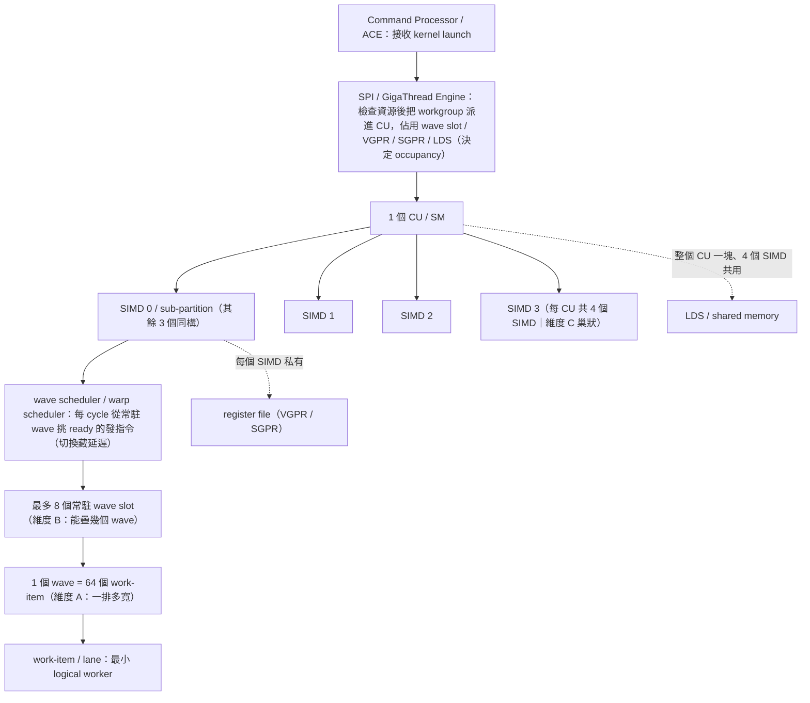

# GPU 執行模型：grid / block / warp / thread / SM / CU

路徑說明：本檔在 `study_docs/gpu_knowledge/`。連回頂層用 `../`（如 `../amd-isa-kernel.md`）。

- 建議先讀本資料夾入口 [README.md](README.md)。

## 白話總覽

寫程式時你看到的是 **grid → block → thread**；GPU 真正執行時會把 block 放到 **SM/CU**
上，再把 block 裡的 threads 切成 **warp/wavefront** 來發射指令。一句話抓住：

> Grid 是整份工作，block 是合作小隊，thread 是小隊成員
>
> SM/CU 是工廠，warp/wavefront 是工廠一次發令的一排工人。

最常見的混淆是把「軟體抽象」和「硬體實體」混為一談。本文先給總圖，再逐一拆解。

## 為何重要

讀懂任何 GPU kernel、做任何效能優化（occupancy、coalescing、divergence）之前，都得先有
這套心智模型。

本檔是 [amd-isa-kernel.md](../amd-isa-kernel.md)（gfx942 ISA 實作層，講 wave /
SGPR / VGPR / exec mask）的前置概念層；那邊的 `wave = 64 lane` 就是這裡的 wavefront。

## 總圖：軟體抽象 vs 硬體實體

軟體 / 程式視角（你寫 kernel 時看到的）：

```
kernel launch
└── grid                         ← 一次 kernel 的全部工作
    ├── block / thread block      ← 可合作的一群 threads
    │   ├── thread                ← 你寫的「每個元素做什麼」
    │   └── ...
    └── block ...
```

硬體 / 執行視角（GPU 實際怎麼跑）：

```
GPU device
├── SM (NVIDIA) / CU (AMD)        ← 真正執行 block 的「工廠」
│   ├── resident block(s)
│   │   ├── warp / wavefront       ← 一次發令的一排 lanes
│   │   └── ...
│   ├── registers (VGPR/SGPR)
│   ├── shared memory / LDS
│   ├── warp/wavefront scheduler
│   └── ALUs / SIMD lanes / matrix cores ...
└── SM/CU ...
```

對照關鍵：**一個 block 會被完整放到一個 SM/CU 上執行**（所以 block 內 threads 能共享 shared memory/LDS、能 barrier 同步），不可以將一個 block 跨 SM/CU，因為 **block 內 threads 需要合作，而合作用的硬體資源綁在單一 SM/CU 上**；硬體再把 block 內 threads 切成固定大小的 warp/wavefront。

## Kernel：一次丟給 GPU 的函式

你用 `__global__` 標記、由 host 端 launch 的 GPU function 就是 kernel。

```cpp
__global__ void add(float* A, float* B, float* C, int N) {
    int i = blockIdx.x * blockDim.x + threadIdx.x;
    if (i < N) C[i] = A[i] + B[i];
}

add<<<numBlocks, threadsPerBlock>>>(A, B, C, N);  // 一次 launch = 一個 grid
```

每個 thread 都跑同一段 kernel code，但因 `threadIdx`、`blockIdx` 不同而處理不同資料。
launch 的完整步驟見 [kernel-launch.md](kernel-launch.md)。

## Grid：一次 launch 的全部 blocks

Grid 是這次 kernel launch 的所有 blocks——它是「工作清單」，不是硬體、也不等於整張 GPU。

```cpp
int threadsPerBlock = 256;
int numBlocks = (N + threadsPerBlock - 1) / threadsPerBlock;
add<<<numBlocks, threadsPerBlock>>>(A, B, C, N);
```

- 全域 thread 編號公式（CUDA/HIP 通用、極核心）：`blockIdx.x * blockDim.x + threadIdx.x`。
- 資料量不是 block size 整數倍時，多出的 thread 用 `if (i < N)` 擋掉。
- 1D/2D/3D 皆可：1D 配 array、2D 配 image/matrix、3D 配 volume。

**設計用途**：把大問題拆成很多 block，讓同一份 kernel 在小 GPU（少 SM）與大 GPU（多 SM）
都能跑——scheduler 自動把 block 分派到可用 SM/CU。因此：

- block 之間沒有執行順序保證，**不能假設 block 0 比 block 1 早完成**。
- 不同 block 之間不能用 `__syncthreads()` 同步；要溝通得透過 global memory / atomics / 第二個 kernel。


## Thread Block / Work-group：一群可合作的 threads

Block（HIP/OpenCL 常稱 work-group）是一群可以合作的 threads。`blockDim.x = 256` 表示每個
block 有 256 threads。

**設計用途**——讓這群 threads 能：

- 放在同一個 SM/CU 上；
- 共用 shared memory / LDS（block scope 的 on-chip 快速記憶體）；
- 用 `__syncthreads()`（HIP 同名 / AMD ISA 的 `s_barrier`）做 block 內 barrier 同步；
- 合作完成一小塊工作，例如 matmul 的一個 tile、reduction、stencil。

```cpp
__shared__ float tile[256];
tile[threadIdx.x] = some_value;
__syncthreads();          // 全 block 寫完才繼續，之後可安全互讀
```

**Block 不是 SM/CU**（最常見誤解）：

- block 是軟體工作單位，SM/CU 是硬體。
- 一個 SM/CU 可同時 resident 多個 block（取決於 register、shared memory/LDS、warp slot 上限）。
- 一個 block 通常**不跨** SM/CU（否則無法共享 shared memory/LDS）。

**Block size 取捨**：太小則 scheduler overhead 相對高、難發揮 shared memory 合作；太大則每個
block 吃太多 register / shared memory，使 SM/CU 能同時 resident 的 block 變少、occupancy 下降。
常見起點 128 / 256 / 512（多為 warp/wavefront size 的倍數），最佳值需用 profiler 決定。

## Thread / Work-item：最小的 logical worker

Thread（AMD 低階文件稱 work-item）是程式模型裡最小的邏輯工作者，有自己的 index、register
state、program counter。注意它是**邏輯單位，不是一顆硬體 core**——你可能 launch 上百萬個
thread，但 GPU 不會有上百萬個 core，而是分批排到 SM/CU 執行。

GPU thread 與 CPU thread 也不同：

- CPU thread 重、數量少、追求單一 latency
- GPU thread 輕、 數量極多、靠大量並行 + warp 排程來掩蓋 latency、追求 throughput。


## Warp / Wavefront：硬體實際發射指令的一排 lanes

Warp（NVIDIA）/ Wavefront（AMD ISA 術語；HIP 也常用 warp）是 GPU 實際發射指令時的一組
threads，以 SIMT / lockstep 方式執行同一條指令、各自處理不同資料。


| 平台                                   | 名詞        | 常見大小                      |
| ------------------------------------ | --------- | ------------------------- |
| NVIDIA CUDA                          | warp      | 32 threads                |
| AMD CDNA3 / CDNA4（如 gfx942 / gfx950） | wavefront | 64 threads                |
| AMD CDNA5（gfx1250 / MI450）           | wavefront | **32 threads**（改朝 Wave32） |
| AMD RDNA（消費級 Radeon）                 | wavefront | 32 或 64                   |


**跨平台原則**：不要硬寫「warp = 32」，也不要反過來硬寫「AMD 一定是 64」。在 CUDA 上 32
合理，但 HIP / AMD 上應查 `warpSize` 或 device 屬性。本 repo 的 ISA 實作層目標是 gfx942
（CDNA3，wave = 64，見 [amd-isa-kernel.md](../amd-isa-kernel.md)）；而 AMD 最新的 gfx1250
（CDNA5）已改為 **Wave32**——同一家 AMD 跨世代 wave 大小就變了，正好說明為什麼一定要查
`warpSize` 而非寫死。

**Warp 與 block 的關係**：硬體把 block 切成 warp/wavefront。

- `blockDim.x = 256` 在 NVIDIA → 256 / 32 = **8 warps**；在 CDNA wave64 → 256 / 64 = **4 wavefronts**。
- block size 不是 warp size 倍數時（如 100 threads），最後一個 warp 會有未使用 lanes，浪費算力——
所以 block size 最好取 warp/wavefront size 的倍數。


### Warp divergence（為何 branch 影響效能）

同一個 warp 內 threads 走不同 branch 時，硬體會分別執行兩條路、對不參與的 lane 做 mask——
等於兩條路都跑一遍，效能下降。優化原則：**盡量讓同一 warp/wavefront 內的 threads 走同一條
branch**。（exec mask 的 ISA 細節見 [amd-isa-kernel.md](../amd-isa-kernel.md)。）

### Memory coalescing（為何 index 排列重要）

最佳情況：相鄰 thread 讀相鄰記憶體（thread 0 讀 `a[0]`、thread 1 讀 `a[1]`…），硬體可把多個
request 合併成少量 transaction。糟糕情況：相鄰 thread 讀相距很遠的位址，造成大量分散
transaction、浪費頻寬。這也是 `blockIdx.x * blockDim.x + threadIdx.x` 這種 indexing 的另一個
用意——讓相鄰 thread 通常碰相鄰資料。

## SM / CU / WGP：真正執行 block 的硬體工廠

- **NVIDIA**：SM（Streaming Multiprocessor）。
- **AMD**：CU（Compute Unit）；RDNA 還有 WGP（Work Group Processor，含兩個 CU）。

SM/CU 不是「一顆 core」，而是內含 warp/wavefront scheduler、register file、shared memory/LDS、
多條 ALU/SIMD lane、matrix core 等的執行單元。kernel 能否跑滿，常取決於每個 block 用掉多少
register / shared memory，進而決定每個 SM/CU 能同時 resident 幾個 block / 幾個 warp——這就是
**occupancy**。

## 硬體限制規範速查（CDNA4 / CDNA5 / NVIDIA 對照）


### 為何你會覺得數字很亂：先分清「三個獨立的軸」

很多人（包括讀完前面章節的你）會把一堆數字攪在一起——例如「一個 SIMD 最多 8 個 wave」和「一個 wavefront 有 64 個 work-item」，這兩個 **8 和 64 根本不是同一種東西**。
會亂，是因為把**三個彼此獨立的維度**混為一談。先把這三軸記住，下面每個數字都能歸位：

- **維度 A｜寬度（一排幾個 lane）**：一個 wavefront / warp 一次發令橫向有幾條 lane。
AMD CDNA = **64**、NVIDIA = **32**。這是「橫向多寬」。
- **維度 B｜常駐深度（能疊幾個 wave）**：一個 SIMD / 子分割能同時「掛住」幾個 wave，
讓 scheduler 在某個 wave 卡住時切換去跑別的來藏延遲。CDNA = 每 SIMD **8 個**。
這是「縱向能疊多少」，跟寬度完全無關。
- **維度 C｜巢狀數量（誰包含幾個誰）**：GPU 內有很多 CU/SM，一個 CU/SM 內切成
幾個 SIMD/子分割。CDNA = 一個 CU 含 **4 個 SIMD**。這是「階層包含關係」。

> 一句話抓住：**64 是「一排多寬」（A），8 是「能疊幾層」（B），4 是「一個 CU 切幾份」（C）。**
> 三個問題、三個答案，不要混在一起。


### 硬體階層與排程單位圖（含維度 A / B / C + 派工/發令單位）

除了「誰包含誰」（維度 C），這張圖也把兩個排程單位放進來：**SPI**（把 block 派進 CU 的派工層）
和 **wave / warp scheduler**（在 SIMD 內每 cycle 挑 wave 發指令的執行層）。兩者分屬不同階層，別搞混。




重點標注：

- **維度 C（巢狀）**：GPU → CU → 4 個 SIMD → wave slot → wave → work-item。
- **維度 B（深度）**：一個 SIMD 最多 8 個常駐 wave slot。
- **維度 A（寬度）**：一個 wave = 64 個 work-item（lane）。
- **兩個排程單位分層**：
  - **SPI**（≈ NVIDIA GigaThread Engine / Global Work Distributor）在「上場階段」把 block 派進 CU 並佔資源，**決定** occupancy
  - **wave scheduler**（≈ NVIDIA warp scheduler）在 SIMD 內「逐 cycle 階段」挑 ready 的 wave 發指令，**利用**這些常駐 wave 藏延遲。
- **兩池不同記憶體**：
  - **LDS 是「每個 CU 一塊、4 個 SIMD 共用」**
  - **register file 則是「每個 SIMD 私有」**
  - 這也是為什麼 register 和 LDS 是兩池完全不同的資源（見下方 occupancy 清單）。


### 數量關係表（把三軸的數字串起來，以 CDNA3 / CDNA4 為例）

> 以下數字是 **CDNA3 / CDNA4（wave64 世代）** 的事實。CDNA5（gfx1250）因為改成
> Wave32 / SIMD32 / WGP，這些數字會不一樣，見下面〈[CDNA5（gfx1250）的架構斷裂](#cdna5gfx1250的架構斷裂為何不是漸進式更新)〉。


| 關係                     | 數字                    | 屬於哪個軸     |
| ---------------------- | --------------------- | --------- |
| 1 個 CU 含幾個 SIMD        | 4 個 SIMD              | C 巢狀      |
| 1 個 SIMD 最多常駐幾個 wave   | 8 個 wave              | B 深度      |
| 1 個 CU 最多幾個 wave       | 4 × 8 = **32 個 wave** | B（由 C 推得） |
| 1 個 wave 有幾個 work-item | 64 個 work-item        | A 寬度      |
| 1 個 CU 最多幾個 work-item  | 32 × 64 = **2048 個**  | A × B     |


> 注意最後一列：2048 是「寬度 64」乘上「深度 32」得來的，剛好示範了 A 和 B 是相乘、
> 而不是同一個數字——這正是最容易搞混的地方。


### 補充：邏輯寬度 64 vs 實體 SIMD16 × 4 cycle（為什麼你會查到「SIMD16」）

前面維度 A 說「一個 wavefront = 64 lane」，但你查 AMD 內部/微架構文件時，可能會看到
**「SIMD16*4」**，覺得「寬度怎麼只有 16？」。這裡的 **16 和 64 是兩種不同的「寬度」，
兩個都對、不衝突**：

- **64｜邏輯（架構）寬度**：一個 wavefront 有幾個 work-item。這是你**寫 kernel、看 ISA、
查** `warpSize`**、算 occupancy** 時面對的數字（維度 A）。
- **16｜實體（datapath）寬度**：一個 SIMD 單元**一個 cycle 實際能同時算幾條 lane**。這是
硬體微架構的數字，程式看不到。

兩者的關係是**時間換空間**：硬體不做 64 條實體電路（太貴），而是做 16 條、跑 4 拍，`64 個 work-item ÷ 16 條實體 lane = 4 個 cycle`  才把一整個 wave 發完。

```
一個 wavefront = 64 work-item   （邏輯，程式看到的一條 vector 指令）
        │  發射到一個實體 SIMD16
        ▼
┌─────────────────────────────────────────┐
│ SIMD16 只有 16 條實體 ALU lane           │
│  cycle 0：算 work-item  0–15            │
│  cycle 1：算 work-item 16–31            │
│  cycle 2：算 work-item 32–47            │
│  cycle 3：算 work-item 48–63            │
└─────────────────────────────────────────┘
        4 個 cycle 才把一整個 wave 跑完
```

所以查到的 **「SIMD16*4」= 每個 CU 有 4 個 SIMD、每個 SIMD 實體 16 lane 寬**；`*4` 就是
前面維度 C 的「一個 CU 切 4 份」。


| 名稱                | 數字  | 是什麼                       | 誰面對它                 |
| ----------------- | --- | ------------------------- | -------------------- |
| wavefront 寬度（A）   | 64  | 邏輯：一個 wave 幾個 work-item   | 程式設計師、ISA、`warpSize` |
| SIMD 實體寬度         | 16  | 實體：向量 ALU 一 cycle 幾條 lane | 硬體/微架構分析             |
| 每 wave 幾 cycle 發完 | 4   | = 64 / 16                 | 微架構/效能細節             |
| 每 CU 幾個 SIMD（C）   | 4   | 巢狀包含關係                    | occupancy 分析         |


> ⚠️ 別再搞混：「SIMD16 的 4」（一個 wave **在時間上**分 4 拍發完）和「SIMD16x**4** 的 4」 （一個 CU **在空間上**有 4 個 SIMD 單元）**剛好都是 4，但意義完全不同**。

**旁註（RDNA 不一樣）**：CDNA3 / CDNA4（含 gfx942 / gfx950）維持 GCN 傳統的
**SIMD16、wave64、4 cycle**；而 RDNA（消費級 Radeon）把實體加寬到 **SIMD32**，所以 Wave32
一個 cycle 就發完、Wave64 兩個 cycle 發完——這也是為什麼前面表格說 RDNA 的 wavefront 是
「32 或 64」。

**旁註（CDNA5 也放棄了 SIMD16×4）**：到了 gfx1250（CDNA5），連 Instinct 這條線也跟進
RDNA 的做法——改成 **SIMD32 + Wave32 + 1-cycle issue**，一個 cycle 就把一整個 wave 發完，
不再是「16 寬跑 4 拍」。所以本小節的「64 = 16 × 4 cycle」是 **CDNA3/CDNA4（wave64 世代）
的事實**，到 CDNA5 就換了一套（詳見下面〈[CDNA5（gfx1250）的架構斷裂](#cdna5gfx1250的架構斷裂為何不是漸進式更新)〉）。

一句話收尾：**在 CDNA3/4 上，對程式而言寬度永遠是 64（**`warpSize == 64`**）；16 只是硬體「一拍算多少」
的實作細節，用** `64 = 16 × 4 cycle` **串起來，不是「wave 只有 16 寬」。**

### 三方硬體規格對照表（CDNA4 / CDNA5 / NVIDIA Hopper）

本 repo 的 ISA 實作層目標是 gfx942（**CDNA3 / MI300**，wave64，見 [amd-isa-kernel.md](../amd-isa-kernel.md)）；
下表則對照 AMD 最新的兩代——你問過的 MI350 屬 **CDNA4（gfx950）**、以及最新的
**CDNA5（gfx1250/ MI450）**；NVIDIA 欄以 **Hopper（H100，compute capability 9.0）** 為代表。
CDNA5 是一次「ISA 斷裂」（Wave64→Wave32、CU→WGP、MFMA→WMMA），所以整欄和左邊兩代
差很多，細節見下面〈[CDNA5（gfx1250）的架構斷裂](#cdna5gfx1250的架構斷裂為何不是漸進式更新)〉。標「待查」者為尚未取得的官方數字。


| 項目                               | CDNA4（MI350·MI355X / gfx950） | CDNA5（MI450 / gfx1250）                              | NVIDIA Hopper（H100 SM）        |
| -------------------------------- | ---------------------------- | --------------------------------------------------- | ----------------------------- |
| ISA 編碼家族                         | GFX9                         | **GFX12**（與左不相容）                                    | —                             |
| 硬體工廠名                            | CU                           | **WGP**（WorkGroup Processor）                        | SM                            |
| 內部切分（維度 C）                       | 4 個 SIMD16                   | **4 個 SIMD32 / WGP（= 2 CU）**                        | 4 個 sub-partition（SMSP）       |
| 發令單位寬度（維度 A）                     | wavefront = 64               | **wavefront = 32**                                  | warp = 32                     |
| 發令節奏                             | 4-cycle issue（wave64）        | **1-cycle issue（wave32）**                           | —                             |
| 每 SIMD·SMSP 最多常駐 wave·warp（維度 B） | 8                            | **16**                                              | 16                            |
| 每 CU·SM·WGP 最多 wave·warp         | 32                           | **64（4 × 16，推得）**                                  | 64                            |
| 每 CU·SM·WGP 最多 work-item·thread  | 2048                         | **2048（64 × 32，推得）**                               | 2048                          |
| 暫存器檔（每 CU·SM·WGP）                | 512 KiB VGPR                 | 待查                                                  | 256 KB（65536 × 32-bit）        |
| 暫存器檔（每 SIMD·SMSP）                | 128 KiB                      | 待查                                                  | 64 KB（16384 顆）                |
| 每 thread 最多向量暫存器                 | 256 VGPR（+256 Acc，共用 512 預算） | **最多 1024 VGPR，無 AGPR**（>256 用 `s_set_vgpr_msb` 索引） | 255                           |
| SGPR（純量暫存器）                      | 約 800/SIMD、≤102/wave         | **106 usable / 128 physical**                       | 無獨立 scalar reg 概念             |
| 矩陣單元                             | Matrix Core / `v_mfma_*`     | **WMMA /** `v_wmma_`*（累加器用 VGPR、可與 VALU 共執行）        | Tensor Core                   |
| LDS / shared memory              | **160 KB / CU**              | **統一 384 KB WGP$**（最多 320 KB 作 LDS）                 | 最多 228 KB（可配置，與 L1 共用 256 KB） |
| 專屬 async DMA 引擎                  | 無（軟體迴圈模擬）                    | **TDM（Tensor Data Mover）**                          | TMA                           |
| VGPR 配置粒度                        | 8 顆                          | 待查                                                  | -                             |


幾個對照重點：

- **CDNA4 → CDNA5 不是漸進式升級，而是 ISA 斷裂**：GFX9→GFX12 編碼、零二進位相容、
Wave64→Wave32、排程單元 CU→WGP、MFMA→WMMA，還新增 TDM 硬體 DMA 引擎。
- **wave 寬度（維度 A）跨世代改了**：CDNA4 = 64、CDNA5 = 32、NVIDIA = 32——別把「AMD 一定 64」
硬套到 gfx1250。
- **暫存器檔統一**：CDNA5 取消 AGPR、單一 VGPR 檔最多可達 1024，WMMA 累加器直接放 VGPR，
省掉 CDNA 舊世代 MFMA 在 VGPR↔AGPR 之間搬運的開銷。
- **LDS 與 cache 合併**：CDNA5 把 LDS 和 L0 併成單一 384 KB 的 WGP$（最多 320 KB 當 LDS），
對比 CDNA4 的 160 KB LDS + 獨立 cache。
- **常駐深度（維度 B）加倍**：CDNA5 每個 SIMD32 是 **16 個 wave slot**（gfx942/gfx950 是 8）；
一個 WGP = 2 CU = 4 SIMD32，所以每 WGP 最多 4 × 16 = 64 wave、64 × 32 = 2048 work-item。
內部結構與 workgroup 分配細節見 [cdna5-gfx1250.md](cdna5-gfx1250.md) 的 WGP 小節。
- AMD 有 **VGPR + SGPR 兩種**暫存器；NVIDIA 沒有等價的獨立 scalar 暫存器檔。


### CDNA5（`gfx1250`）的架構斷裂：為何不是漸進式更新

前面三軸與對照表都以 CDNA3/CDNA4（wave64 世代）為主。到了 **gfx1250（CDNA5 / MI450）**，
AMD 做的**不是**把數字調大的漸進式升級，而是一次幾乎「重寫」：ISA 從 **GFX9 家族跳到
GFX12 家族**、二進位零相容（gfx942/gfx950 的機器碼在 gfx1250 上完全不能跑），也反映 AMD
往 **UDNA（把 CDNA 資料中心線與 RDNA 消費線統一）** 的方向走。

以下是對本文心智模型影響最大的幾點，先抓大方向，再看細節。

- **Wave64 → Wave32（執行模型的根本改變）**：一個 wavefront 從 64 個 work-item 變成 32 個，
搭配 **SIMD16→SIMD32 + 1-cycle issue**——即一個 cycle 就把整個 wave 發完，不再是舊世代
「SIMD16 跑 4 拍」。所以維度 A（寬度）在 CDNA5 是 **32**，前面「64 = 16 × 4」那套只適用 CDNA3/4。
- **CU → WGP（排程單元換人）**：基本的資源/排程單位從 CU 變成 **WGP（WorkGroup Processor）**，
每個 WGP 內含 4 個 SIMD32。維度 C 的「工廠」在 CDNA5 要看 WGP。
- **MFMA → WMMA（矩陣指令家族替換，最大變革）**：算力指令從 `v_mfma_`* 換成 `v_wmma_`*
（稀疏從 `v_smfma_*` 換成 `v_swmmac_*`）。三個關鍵改善：
  1. **累加器直接用 VGPR**（取消獨立 AGPR，省掉 VGPR↔AGPR 搬運）
  2. **WMMA 可與 VALU 平行執行**（舊 MFMA 會卡住 VALU）
  3. 新增 `matrix_a_reuse / matrix_b_reuse` 與更多矩陣形狀。
  - 本 repo 目前算力來源仍是 gfx942 的 `v_mfma_*`，遷到 gfx1250 需改寫為 `v_wmma_*`（編碼與 operand layout 全不同）。
- **新增 TDM（Tensor Data Mover）硬體 DMA 引擎**：專屬的非同步 tile 搬移單元（概念類似 NVIDIA
的 TMA），提供 `async_load / async_store / async_gather / async_scatter / prefetch` 等，直接在
global ↔ LDS 之間非同步搬 tile。gfx950 沒有這個硬體，只能用軟體迴圈模擬。
- **暫存器檔統一、VGPR 上限暴增**：取消 AGPR，單一 VGPR 檔**每 wave 最多可達 1024 個**
（超過 256 用 `s_set_vgpr_msb` 做高位索引）；SGPR 為 106 usable / 128 physical。
- **統一 384 KB WGP$（LDS 與 cache 合併）**：舊世代 LDS 與 L0 cache 是分開的兩塊，CDNA5
合成單一 384 KB 的 WGP$（最多 320 KB 可配置為 LDS），LDS 頻寬約加倍、對齊需求放寬到只需 DWORD。
- **同步模型更細緻**：舊的單一 `s_waitcnt vmcnt/lgkmcnt` 被拆成**分離計數器**
（`s_wait_loadcnt / storecnt / kmcnt / dscnt / tensorcnt`）；barrier 從單一 `s_barrier` 擴充為
**每 workgroup 16 個 named barrier**，並新增跨 WGP 的 cluster barrier。

> 一句話：**gfx1250 對本文三軸的衝擊是「A 寬度 64→32、C 工廠 CU→WGP、算力 MFMA→WMMA」，
> 再加上 TDM、統一 WGP$、1024 VGPR 與分離 wait counter。** 想把本 repo 的 gfx942 kernel
> 遷到 gfx1250，等於要重新理解執行模型，不能只改 target 字串。

**深入**：以上六個變化（AGPR 移除、WGP vs CU、MFMA→WMMA、dual-issue、wait counter /
barrier 分離、零二進位相容與 UDNA）的逐點細講，見 [cdna5-gfx1250.md](cdna5-gfx1250.md)。

更多技術細節（AMD 內部 Confluence）：
- [gfx1250 to gfx942: Architecture Differences & More](https://amd.atlassian.net/wiki/spaces/MLSE/pages/1633927296)
- [GFX1250 — Comprehensive Technical Reference](https://amd.atlassian.net/wiki/spaces/MLSE/pages/1762232146)
- [GFX1250/MI450 related information](https://amd.atlassian.net/wiki/spaces/SHARK/pages/1126711694)

### Occupancy 限制清單：實際能跑幾個 wave 取「最小值」

occupancy 不是由單一因素決定，而是下列所有限制**同時作用、取最嚴格的那個**：

```
一個 CU/SM 實際能同時跑的 wave/warp 數 = min(
    ① VGPR 夠分幾個 wave,
    ② SGPR 夠分幾個 wave,
    ③ LDS / shared memory 夠分幾個 workgroup,
    ④ workgroup / block size 換算的 wave 數,
    ⑤ wave slot 硬上限（CDNA：32/CU；Hopper：64/SM）,
    ⑥ 每個 CU/SM 的 workgroup / block 數上限（Hopper：32/SM）,
    ⑦ barrier 等同步資源
)
```

- ①②③④ 由你的 kernel 用量決定（寫得越省，能塞越多）。
- ⑤⑥⑦ 是**寫死的硬體天花板**：就算資源用超少，也不可能超過 ⑤ 的 wave 上限。
- ⑦ 的確切 barrier 數量 AMD 官方未明列；正常大小 block（如 256 threads）幾乎不會踩到，
只有「大量迷你 block」才會耗盡 ⑥⑦。實務上用 profiler（`rocprof-compute`）看到底卡在哪一項。


### 一句話總結（本節）

看到 GPU 硬體數字時，先問它屬於哪一軸：**「一排多寬」（A，wave=64 / warp=32）、
「能疊幾層」（B，每 SIMD 8 wave）、還是「一個 CU 切幾份」（C，4 SIMD）**——三軸分清，
再對照上表查 CDNA4 / CDNA5 / NVIDIA 的實際上限，就不會再把 8 和 64 攪在一起了。

## 併發與派工：HW queue（ACE）vs CU/WGP

延續上面的 `Command Processor / ACE → SPI → CU` 派工圖：很多人會同時聽到「HW queue 限制能同時
跑幾個工作」和「CU/WGP 也限制能同時跑幾個工作」，然後困惑它們到底誰限制誰。關鍵是——**它們限制
的是不同層級的東西，一個在前端送料、一個在後端產能。**

### 兩軸獨立

- **HW queue（硬體佇列）在前端**：由 **command processor / ACE（Asynchronous Compute Engines）**
  的設計決定有幾條。它是「接收工作、往下派工」的入口。
- **CU / WGP 在後端**：真正執行 workgroup 的運算陣列，數量由晶片規模決定（如 gfx1250 的 128 WGP / 256 CU）。

這兩個數字在晶片設計時**分開決定**、不成比例：CU 很多不代表佇列多，佇列多也不代表 CU 多。

### 誰限制什麼（困惑的根源：「工作」大小不同）

| | HW queue（前端） | CU / WGP（後端） |
| --- | --- | --- |
| 限制的單位 | 同時有幾條 **stream（獨立時間線）** 能並行派工 | 同時有幾個 **workgroup / wave** 在實際執行 |
| 是不是總算力天花板 | 否 | **是**（真正的吞吐上限） |
| 何時成為瓶頸 | 只有在「單一 kernel 填不滿 CU」時 | 幾乎所有大工作（一個 kernel 就吃滿） |

注意兩個常見誤解（詳見 [kernel-launch.md 的 Stream 深入節](kernel-launch.md#stream-深入kernelstreamdefault-stream-的特殊性能開幾條)）：

- **kernel ≠ stream**：stream 是一條 FIFO 佇列，裡面可排很多 kernel；**同一條 stream 內是序列、不重疊**，
  並行發生在**不同 stream 之間**。所以佇列限制的是「幾條 stream 能並行」，不是「每個 kernel 各佔一條」。

### 關鍵：一份 kernel 就能塞滿全部 CU/WGP

最重要的一句話：**一份 kernel 通常就有上萬個 workgroup，足以把全部 CU/WGP 填滿。** 所以佇列與 CU
不是並排的兩個限制器，而是**上游送料 vs 下游產能**：

```
HW queue（ACE，前端）──▶ 一份 kernel（上萬 workgroup）──▶ SPI 派工 ──▶ CU/WGP（後端，所有 stream 共用）
```


### 何時哪邊是瓶頸（廚房類比）

- **queue = 訂單傳送帶**（能同時收幾張獨立訂單）、**CU/WGP = 廚師**（真正做菜、所有訂單共用）。
- **大 kernel（吃滿 CU）**：一張訂單就要 10000 個漢堡，所有廚師 100% 忙——再多開傳送帶也沒用，
  瓶頸在 **CU/WGP**。大 GEMM 幾乎都是這種。
- **小 kernel（填不滿 CU）**：一張訂單只用幾個廚師，其他廚師閒著——這時多一條傳送帶送第二張訂單，
  才能用到閒置廚師，**queue 才成為讓 overlap 生效的關鍵**。

> 一句話：**CU/WGP 是「真正能同時做多少活」的總天花板；HW queue 只是「能同時有幾條獨立生產線把活
> 送進來」。** 因為一份 kernel 就能塞滿 CU，多數大工作的真正瓶頸是 CU/WGP，queue 只在「工作太小、
> 填不滿 CU」時才成為額外限制。stream 的軟體語意（default stream、能開幾條）見
> [kernel-launch.md](kernel-launch.md#stream-深入kernelstreamdefault-stream-的特殊性能開幾條)。

## AMD 有沒有 tensor core / cuda core？

「CUDA Core」「Tensor Core」基本上是 **NVIDIA 的名詞**；AMD 有功能相近的單元，但叫法與架構
不同，**不能一比一對應、也不能只比數量**。


| NVIDIA                   | AMD 大致對應                                  | 用途                          |
| ------------------------ | ----------------------------------------- | --------------------------- |
| CUDA Core（FP32/INT lane） | Stream Processor / SIMD lane（CU 內的向量 ALU） | 一般 shader、浮點/整數、平行運算        |
| Tensor Core              | Matrix Core / MFMA（AI Accelerator）        | 矩陣乘加、FP16/BF16/FP8/INT8 等加速 |
| CUDA（平台 + 程式模型）          | ROCm / HIP / OpenCL                       | GPU 運算開發                    |


重點：

- AMD **沒有** 「CUDA Core」，因為 CUDA 是 NVIDIA 的平台；AMD 對應的軟體堆疊是 ROCm（支援 HIP、OpenCL、OpenMP）。
- AMD 消費級 Radeon（RDNA）以 Compute Units、Stream Processors、Ray Accelerators、AI Accelerators 描述。
- AMD Instinct / CDNA（如 MI300、gfx942）用 **Matrix Core Technology** 加速矩陣/AI/HPC，角色近似 Tensor Core；
- 本 repo 的算力來源 `v_mfma_` 指令就屬此類，見 [amd-isa-kernel.md](../amd-isa-kernel.md)。到了 CDNA5（gfx1250）這類指令改為 `v_wmma_`（累加器改放 VGPR、可與 VALU 共執行），見〈[CDNA5（gfx1250）的架構斷裂](#cdna5gfx1250的架構斷裂為何不是漸進式更新)〉。


## 互相 refer 濃縮表


| 名詞                 | 它是什麼                 | 和誰有關                                                               |
| ------------------ | -------------------- | ------------------------------------------------------------------ |
| Kernel             | 你 launch 的 GPU 函式    | 產生一個 grid；launch 過程見 [kernel-launch.md](kernel-launch.md)          |
| Grid               | 一次 launch 的全部 blocks | scheduler 把 blocks 分派到 SM/CU                                       |
| Block / Work-group | 一組可合作 threads        | 放到單一 SM/CU；內部切成 warp/wavefront；用 shared memory/LDS + barrier 合作    |
| Thread / Work-item | 最小 logical worker    | 成為 warp/wavefront 裡的一個 lane                                        |
| Warp / Wavefront   | 硬體發令的一排 lanes        | NV 32 / CDNA 64 / RDNA 32or64；divergence、coalescing 都跟它相關          |
| SM / CU / WGP      | 硬體執行工廠               | 容納 block、保存 warp 狀態、含 register / shared memory / ALU / matrix core |


## 交叉連結

- 本頁硬體上限速查（CDNA4 / CDNA5 / NVIDIA 對照、三軸分類、occupancy 清單）：[硬體限制規範速查](#硬體限制規範速查cdna4--cdna5--nvidia-對照)
- 本頁併發與派工（HW queue vs CU/WGP）：[併發與派工](#併發與派工hw-queueacevs-cuwgp)
- 本資料夾入口：[README.md](README.md)
- launch 的詳細步驟與 stream 軟體語意（default stream、kernel≠stream、能開幾條）：[kernel-launch.md](kernel-launch.md#stream-深入kernelstreamdefault-stream-的特殊性能開幾條)
- CUDA↔HIP 名詞完整對照：[cuda-hip-terminology.md](cuda-hip-terminology.md)
- gfx942 ISA 實作（wave / SGPR / VGPR / exec mask / MFMA）：[../amd-isa-kernel.md](../amd-isa-kernel.md)
- 跨文件名詞彙總：[../glossary.md](../glossary.md)


## 一句話總結

Grid 是整份工作，block 是放到單一 SM/CU 的合作小隊，thread 是小隊成員、實際成為
warp/wavefront 裡的一個 lane；AMD 的「類 CUDA core」是 SIMD lane、「類 Tensor core」是
Matrix Core，但都不叫那個名字、也不能一比一比較。