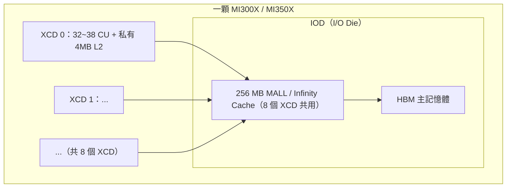

# 記憶體階層與晶粒組織：register / LDS / L1 / L2 / MALL / HBM 與 XCD

路徑說明：本檔在 `study_docs/gpu_knowledge/`。連回頂層用 `../`（如 `../amd-isa-kernel.md`）；連到 origami 文件用 `../origami/...`。

- 建議先讀本資料夾入口 [README.md](README.md) 與 [execution-model.md](execution-model.md)。

## 白話總覽

[execution-model.md](execution-model.md) 把「GPU 怎麼**執行**工作」（grid / block / warp / CU / SIMD / occupancy）講清楚了，但刻意略過兩塊同樣重要的背景：

1. **GPU 的記憶體像什麼？** 資料放在哪、哪層快哪層慢、哪些是「硬體幫你自動快取」、哪些是「你自己手動管理」。
2. **一顆 GPU 是不是一整塊晶片？** MI300 / MI350 其實是**好幾塊小晶粒（XCD）拼起來**的，這件事直接影響 cache 怎麼共享。

一句話抓住這兩件事：

> - **記憶體階層＝「越靠近運算單元越快越小，越往外越大越慢」的一疊倉庫；**
> - **XCD＝把一顆大 GPU 切成好幾塊小晶粒來做，每塊自帶運算單元與一份私有的 L2。**

這份文件是讀 [../origami/latency-model.md](../origami/latency-model.md) 的「階層記憶體模型」（Origami 怎麼估 L2 / MALL 命中率）與 occupancy / WGM 之前，該先有的心智模型。

## 為何重要

- **看懂 Origami 怎麼估延遲**：Origami 估「搬資料要多久」時，就是靠「這次要碰的資料塞不塞得進 L2 / MALL」來推命中率（見 [../origami/latency-model.md](../origami/latency-model.md) 第四層）。不先懂記憶體階層，那段會看不懂。
- **看懂 occupancy 為何卡住**：register 與 LDS 是「每個 CU 有限的資源」，一支 kernel 用太多就塞不下幾個 wave（見 [execution-model.md](execution-model.md) 的 occupancy 清單）。
- **看懂 WGM / staggerU 在解什麼問題**：因為 MI300 的 L2 是「每個 XCD 私有、不跨 XCD 共享」，才需要把會用到同一塊資料的 workgroup 盡量排到同一個 XCD——這正是 WGM 的動機。

---


# Part A：記憶體階層（memory hierarchy）


## 三層倉庫的直覺

GPU 讀資料是一層一層往外找，越外層越大、越慢：

```
運算單元 (CU 內的 ALU / Matrix Core)
   │  最快、最貼身
   ├── register（VGPR / SGPR）        ← 每個 wave 私有，單 cycle 存取
   ├── LDS / shared memory            ← 每個 CU 一塊，block 內共用（scratchpad）
   │
   ├── L1 / vector cache              ← 每個 CU
   ├── L2 cache                       ← 每個 XCD 私有（MI300 是分割的！）
   ├── MALL / Infinity Cache          ← 整顆 GPU 共用的末級快取
   └── HBM / DRAM                     ← 主記憶體，最大最慢
        越往下：容量越大、延遲越高、頻寬相對越低
```

以 **MI300X（gfx942 / CDNA3）** 為例，各層大致長這樣：


| 層級                        | 容量（量級）              | 範圍（誰共用）       | 誰管理      | 角色                |
| ------------------------- | ------------------- | ------------- | -------- | ----------------- |
| **register（VGPR/SGPR）**   | 每 SIMD 128 KiB VGPR | 每個 wave 私有    | 編譯器分配    | 運算的運算元            |
| **LDS / shared memory**   | 64 KB / CU          | 一個 block 內共用  | **程式手動** | tile 暫存、block 內合作 |
| **L1 / vector cache**     | 幾十 KB / CU          | 單一 CU         | 硬體自動     | 貼身快取              |
| **L2 cache**              | 4 MB / XCD          | **單一 XCD 私有** | 硬體自動     | XCD 級快取           |
| **MALL / Infinity Cache** | **256 MB**          | 8 個 XCD 共用    | 硬體自動     | 末級快取（LLC）         |
| **HBM / DRAM**            | 192 GB HBM3         | 全 GPU         | —        | 主記憶體              |


> - register / LDS 是「每個 CU 內、容量很小、跟 occupancy 直接相關」的資源
> - L2 / MALL / HBM 則是「一層層往外、影響搬資料延遲」的 cache/記憶體
>
> 前者決定「能同時跑幾個 wave」，後者決定「搬資料多痛」。


## 關鍵區別：cache vs scratchpad（最容易混的一點）

同樣是「片上的快記憶體」，**cache 和 scratchpad 是兩種本質不同的東西**——這也是 Origami 對它們用不同方式建模的原因。


|          | **Cache（快取）**                    | **Scratchpad（暫存記憶體）**        |
| -------- | -------------------------------- | ---------------------------- |
| 誰決定放什麼   | **硬體自動**（依存取模式 + 替換策略如 LRU）      | **程式 / 編譯器手動**搬進搬出           |
| 有沒有獨立位址  | **沒有**，是 DRAM 的鏡像，程式仍用 DRAM 位址存取 | **有**，是獨立位址空間，要明確 load/store |
| 對程式透明嗎   | 透明（你不用管它存在）                      | 不透明（你必須寫 code 管理）            |
| GPU 上的例子 | **L1 / L2 / MALL**               | **LDS / shared memory**      |


一句話抓重點：**cache 是「硬體幫你偷偷快取，你不用管」；scratchpad 是「一塊你自己掌控、要手動搬東西進去的快記憶體」。**

### 為什麼這個區別對 Origami 很重要

因為兩者「用量能不能算準」不同：

- **scratchpad（LDS）是手動管理 → 用量算得準**。一支 kernel 的 tile 要用多少 LDS，是**設計時就固定**的。所以 Origami 用 `lds_capacity` 做**容量淘汰**：塞不下這個 config 就直接淘汰（確定性判斷）。
- **cache（L2 / MALL）是硬體自動管理 → 命中率只能估**。資料會不會被 cache 接住，取決於執行時的存取模式，沒辦法算死。所以 Origami 用 `estimate_l2_hit` / `estimate_mall_hit` **估命中率**（機率模型）。

> 一句話：**scratchpad「算得準」（容量淘汰），cache「只能估」（命中率模型）**——這正是 [../origami/latency-model.md](../origami/latency-model.md) 裡 LDS 走容量、L2/MALL 走命中率的根本原因。

---


# Part B：MALL / Infinity Cache


## 它是什麼？三個名字同一塊東西


| 名稱                  | 出處    | 意義                                                         |
| ------------------- | ----- | ---------------------------------------------------------- |
| **MALL**            | 技術文件  | **M**emory **A**ttached **L**ast-**L**evel cache，記憶體端的末級快取 |
| **LLC**             | 官方規格表 | Last Level Cache，快取階層的最後一層                                 |
| **Infinity Cache™** | 行銷品牌  | AMD 的商標名稱                                                  |


三者講的是**同一塊**夾在 L2 與 HBM 之間的大型快取。

## 為什麼叫「Infinity Cache」？

**這是 AMD 的架構品牌命名，不是說它真的無限大。**

- AMD 有一整套用 **「Infinity」** 當前綴的自家互連 / 架構品牌，最有名的是 **Infinity Fabric**（把晶粒 chiplet 之間、多顆 GPU 之間串起來的高速互連）。「Infinity Cache」就掛在這套品牌下。
- 它最早出現在 2020 年的 **RDNA2 遊戲顯卡**（如 RX 6900 XT）。當時要解決「顯存頻寬跟不上算力」的痛點：加一塊夠大的片上快取，把很多本來要去打 DRAM 的存取**接住在晶片內**，等效放大了記憶體頻寬。
- 命名精神就是「大到讓你感覺頻寬像用不完」，配合 Infinity Fabric 品牌，叫它 Infinity Cache。純粹是**行銷命名**，跟數學上的無限無關。


## 它多大？

在資料中心 GPU 上是 **256 MB**（官方規格表列在 LLC 欄位）：


| GPU                        | Infinity Cache（MALL / LLC） | 對照：L2        | DRAM         |
| -------------------------- | -------------------------- | ------------ | ------------ |
| **MI300X**（gfx942 / CDNA3） | **256 MB**                 | 4 MB × 8 XCD | 192 GB HBM3  |
| **MI350X**（gfx950 / CDNA4） | **256 MB**                 | 4 MB × 8 XCD | 288 GB HBM3E |


- 這 256 MB 是**整顆 GPU 上 8 個 XCD 共用**的，位置在 I/O die（IOD）上。
- 作為對照，消費級 RDNA2 的 RX 6800 / 6900 XT 是 **128 MB**——所以容量隨產品線 / 世代變，不是固定值。


## 它的角色：L2 的 victim cache

MALL 夾在「各 XCD 私有的 L2」和「HBM」之間，扮演 **victim cache**（承接被逐出的資料）：

```
CU → L1 → 該 XCD 的 4 MB L2 → 256 MB MALL（8 XCD 共用）→ HBM
```

L2 裝不下被逐出（evict）的資料會掉到 MALL；MALL 再裝不下才真的去打最慢的 HBM。所以 **MALL 命中率越高，越少資料要跑去 HBM，延遲越低**——這正是 Origami memory-bound 延遲估算的核心。

> 提醒：MALL 的**大小**（256 MB，容量）和 Origami 硬體常數裡的 `mem2_perf_ratio`（**頻寬**，MI300X 約 6 TB/s）是兩回事——一個是「能裝多少」，一個是「搬多快」。


## 不是每張卡都有 MALL

MALL 是特定架構才有的。有些卡（如 Strix Point iGPU，gfx1150）沒有 MALL；Origami 用哨兵值 `NO_MALL_AVAILABLE` 讓模型算記憶體階層時**直接跳過 MALL 那層**，只算 L2 與 DRAM（見 [../origami/debugging-and-calibration.md](../origami/debugging-and-calibration.md) 的 `NO_MALL_AVAILABLE` 小節）。

---


# Part C：XCD 與晶粒（chiplet）組織


## 一句話總結

> **XCD（Accelerated Compute Die，加速運算晶粒）＝AMD 把一顆 GPU「切成好幾塊小晶粒」後，每一塊裝著運算單元（CU + 私有 L2）的那種晶粒。** 它是 CDNA 3（MI300）引入的招牌設計。


## 為什麼要有 XCD？（chiplet 的動機）

以前的 GPU 是**一整塊大晶片（monolithic，單體）**：所有運算單元做在同一片矽上。但晶片越大，**良率越差、成本越高**（一片大晶圓只要一個瑕疵，整顆大晶片就報廢）。

AMD 的解法叫 **chiplet（小晶粒）設計**：做**好幾顆小晶片，用高速互連（Infinity Fabric）拼起來**，讓它們對外表現得像一顆 GPU。在這套設計裡：

- **XCD**＝裝「運算單元」的小晶粒。一顆 XCD 上有一堆 CU + 一塊私有的 L2。
- **IOD（I/O Die）**＝裝「記憶體控制器、Infinity Cache（MALL）、對外互連」的晶粒。

所以一顆 MI300 GPU ≈ **多個 XCD（負責算）＋ IOD（負責記憶體與互連）** 用先進封裝堆疊在一起。

## chiplet、die、XCD：三個詞到底什麼關係

這三個詞很容易混在一起，先用一句話分清楚：

> **chiplet 基本上就是一顆 die；「chiplet」只是多帶了一層「它是被高速互連拼起來、對外裝成一顆晶片」的設計含義。** 在 MI300 裡，一個 XCD ＝一顆 die ＝一個 chiplet，三個講的是同一塊矽。

各詞的側重點不同：


| 詞                  | 視角      | 意思                                                     |
| ------------------ | ------- | ------------------------------------------------------ |
| **die（晶粒）**        | 製造 / 物理 | 從矽晶圓（wafer）切下來的一塊獨立矽晶片，強調「這是一塊實體、獨立製造出來的矽」             |
| **chiplet（小晶粒）**   | 設計 / 角色 | 「故意不做一整塊大晶片，而是做好幾塊小 die 再用 Infinity Fabric 拼起來」的那種 die |
| **monolithic（單體）** | 反義詞     | 整顆晶片就是一塊大 die，不切開（如 CDNA1 的 MI100）                     |


所以：**chiplet 幾乎總是一顆 die；但一顆 die 不一定叫 chiplet**（monolithic 的大 die 就不是 chiplet，因為它沒有「被拼起來」的意思）。

### XCD 和 IOD 是「各自獨立的 die」，不是合起來算一顆

這是最容易誤會的一點：

- **XCD 是一顆 die，IOD 也是一顆 die，它們是分開製造的不同 die**，再用先進封裝拼／疊在一起。**不是「XCD + IOD 合起來才算一顆 die」**。
- 名字本身就透露了：**XCD**（Accelerated Compute **D**ie）、**IOD**（I/O **D**ie），字尾的 D 都是 Die。
- 如果 XCD 和 IOD 做在同一塊矽上，那就變回「單體大晶片（monolithic）」，chiplet 的良率／成本好處就沒了——那正是 AMD 想避免的。


### MI300X 的實際 die 數與堆疊方式

下一節的示意圖為了簡化，把「8 個 XCD 都接到一塊 IOD」畫成單一方塊，容易讓人以為 IOD 只有一顆。實際上 MI300X 是：

- **8 顆 XCD**（負責算）
- **4 顆 IOD**（負責記憶體與互連，**不是 1 顆**）

也就是說一顆 MI300X 是 **8 + 4 = 12 顆運算相關的 die**（再加上底下的 HBM 堆疊 die，總數更多），用 **3D 堆疊**組起來：**XCD 疊在 IOD 上面**，IOD 在下層當底座，把上面的 XCD、旁邊的 HBM 與對外互連都串起來。

> 一句話：**「多顆獨立 die 拼疊成一顆 GPU」是 chiplet 的核心；MI300X ＝ 8 顆 XCD ＋ 4 顆 IOD ＋ HBM 堆疊，XCD 與 IOD 各自是獨立的 die。**


## 具體長什麼樣（MI300 / MI350）




- **8 個 XCD**，每個 XCD 有 32~38 個 CU（MI350X 是 32 CU/XCD，共 256 CU；MI300X 是 38 CU/XCD）。
- **每個 XCD 有自己私有的 4 MB L2**（關鍵，見下）。
- 8 個 XCD **共用**位於 IOD 上的 **256 MB MALL** 與 HBM。

> XCD **內部**的執行單元階層（XCD → Shader Engine → CU → SIMD）、SE 的設計目的、SE 與 ACE 的差別、 以及派工／發令／LDS 各單元怎麼分工，屬於「執行模型」主題，整理在 [execution-model.md 的「硬體實體階層補充」](execution-model.md#硬體實體階層補充xcd--shader-engine--cuse-是什麼和-ace-差在哪)。本檔專注在記憶體階層（L2 per-XCD 分割）那一面。

> 圖的簡化提醒：上圖把 IOD 畫成單一方塊，是「把 IOD 這一層當一個整體」的邏輯簡化；實體上 MI300X 是 **4 顆 IOD** 拼成那層底座（詳見上一節「MI300X 的實際 die 數與堆疊方式」）。


## CDNA 各世代有沒有 XCD？

**有，而且是 CDNA 的核心特徵——但要分世代看：**


| 架構         | 代表產品                | 晶粒組織                                                                   |
| ---------- | ------------------- | ---------------------------------------------------------------------- |
| **CDNA 1** | MI100               | 單體大晶片，**沒有** XCD                                                       |
| **CDNA 2** | MI200 / MI250X      | 有 chiplet，但叫 **GCD（Graphics Compute Die）**，一卡兩 GCD，較像「兩顆 GPU 黏一起」      |
| **CDNA 3** | **MI300X / MI300A** | **正式引入 XCD**（8 個）＋ IOD ＋ Infinity Cache                                |
| **CDNA 4** | **MI350X / MI355X** | 延續 XCD 設計（8 個 XCD）                                                     |
| **CDNA 5** | **MI450（gfx1250）**  | **延續 XCD chiplet（仍 8 個 XCD）**，但 XCD 內部大改：CU→WGP、AGPR 併入 VGPR、MFMA→WMMA |


補充：**XCD 是 CDNA（資料中心）的用語**。消費級 **RDNA** 顯卡雖也用 chiplet（RDNA3 有 GCD + MCD），但那是另一套命名，不叫 XCD。

### CDNA5 之後：chiplet 封裝哲學沒變，變的是 XCD 內部

延續上表，CDNA5（gfx1250 / MI450）在「怎麼拼 die」這件事上**沒有推翻 CDNA3/4**：

- **封裝方向不變**：仍是「多顆 XCD ＋ IOD 用先進封裝拼起來」，MI450 仍由 **8 個 XCD** 組成（見 [cdna5-gfx1250.md](cdna5-gfx1250.md) 第 §2 節「全晶片規模」：每 XCD 16 WGP＝32 CU，8 XCD 合計 128 WGP / 256 CU）。
- **真正的斷裂在 XCD 內部**：最小排程/資源單位從 **CU 換成 WGP**（1 WGP = 2 CU = 4 SIMD32、統一 LDS/cache）、**AGPR 併入單一大 VGPR**、**MFMA 換成能與 VALU 並行的 WMMA**、同步原語從粗粒度拆成細粒度、並用 **GFX12 編碼打破二進位相容**。這一切是為了讓 CDNA 與 RDNA 在 **UDNA** 統一 ISA 下合流。
- **caveat**：MI450 的**實體封裝細節**（IOD 顆數、HBM 怎麼疊）本 repo 文件並未記載，需另查 AMD 官方 CDNA5 資料。詳細的 ISA 斷裂點見 [cdna5-gfx1250.md](cdna5-gfx1250.md)。


## 為什麼 XCD 對 Origami 重要：L2 是「分割的」

XCD 不只是硬體八卦，它直接影響 Origami 怎麼估 cache 命中率，關鍵就在「**每個 XCD 有自己私有的 L2**」：

1. **L2 是分割的（partitioned），不是統一的**。一般單體 GPU 所有 CU 共用一塊大 L2；但 MI300 是「8 塊各自獨立的 4 MB L2」。跑在不同 XCD 上的 workgroup **沒辦法共用彼此的 L2**——同一份資料可能在 8 塊 L2 裡各存一份。Origami 估 L2 命中率時必須把「跨 XCD 不共享」算進去。
2. `num_xcds` **是 Origami 的硬體常數之一**：MI300X 的 `num_xcds = 8`；沒有多晶粒的 iGPU（gfx1150）是 `num_xcds = 1`。這會影響 grid 分配與 WGM 排布。
3. **WGM / staggerU 的根源就是 XCD**：因為 L2 按 XCD 分割，把「會用到同一塊資料的 workgroup 盡量排到同一個 XCD」才能提高 L2 命中率——這正是 WGM（workgroup mapping）在解決的問題。

---


## 對 Origami 的影響（總結連結）


| 這份講的概念                 | 對應 Origami 的哪裡                                                                                        |
| ---------------------- | ----------------------------------------------------------------------------------------------------- |
| 記憶體階層 L2 → MALL → DRAM | `compute_memory_latency` 逐層算延遲、取最慢當瓶頸（[latency-model.md](../origami/latency-model.md)）                |
| cache vs scratchpad    | L2/MALL 走**命中率估算**、LDS 走**容量淘汰**                                                                      |
| MALL 大小 / 頻寬           | `mem2_perf_ratio`（頻寬）＋ 命中率模型（容量）（[api-and-usage.md](../origami/api-and-usage.md)）                     |
| XCD 數 / L2 分割          | `num_xcds` 硬體常數、WGM 跨 XCD 局部性最佳化                                                                      |
| 沒有 MALL 的架構            | `NO_MALL_AVAILABLE` sentinel（[debugging-and-calibration.md](../origami/debugging-and-calibration.md)） |


## 交叉連結

- 本資料夾入口：[README.md](README.md)
- GPU 執行模型（CU / SIMD / wave / occupancy）：[execution-model.md](execution-model.md)
- Origami 的階層記憶體模型（L2/MALL 命中率如何估）：[../origami/latency-model.md](../origami/latency-model.md)
- Origami 硬體常數欄位（`mem1/2/3_perf_ratio`、`num_xcds`）：[../origami/api-and-usage.md](../origami/api-and-usage.md)、[../origami/debugging-and-calibration.md](../origami/debugging-and-calibration.md)
- CDNA5（gfx1250）的 LDS / cache 合併（WGP$）與 CU→WGP：[cdna5-gfx1250.md](cdna5-gfx1250.md)
- 跨文件名詞彙總：[../glossary.md](../glossary.md)


## 一句話總結

> **GPU 記憶體是一疊「越外越大越慢」的倉庫：register / LDS（scratchpad，手動管理、算得準）→ L1 / L2 / MALL（cache，硬體自動、只能估）→ HBM；MI300/MI350 由 8 個 XCD（各含 CU + 私有 4MB L2）＋ IOD（含 256 MB Infinity Cache）拼成，XCD 是 CDNA3 引入的 chiplet 設計，而「L2 按 XCD 私有分割」正是 Origami 要估 L2 命中率、以及需要 WGM 做跨 XCD 局部性最佳化的根本原因。**

