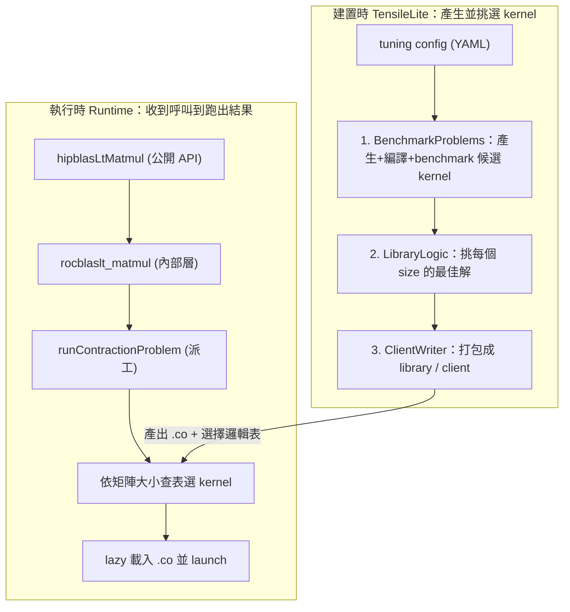
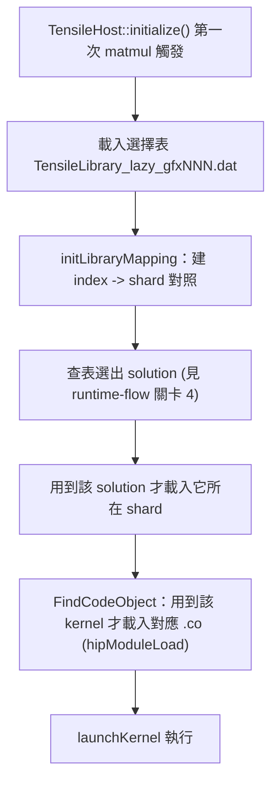
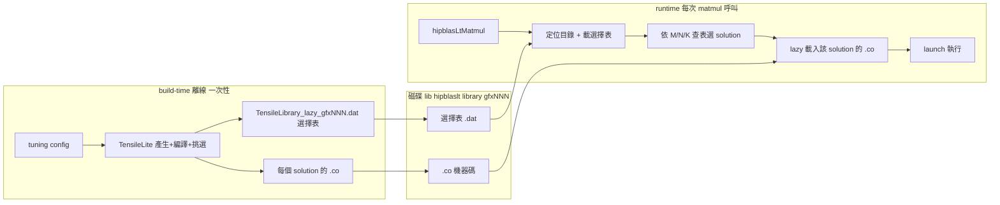

# hipBLASLt 程式碼導讀（從這裡開始）

這份文件組幫你快速看懂 hipBLASLt（AMD GPU 的 GEMM library）與它內建的 kernel 產生器
TensileLite，並一路走到「最佳化 GEMM kernel → 用 profiling 驗證」。

路徑說明：本文件在 repo 內的 `study_docs/hipblaslt/`，所有 code 連結是相對於本檔的相對路徑（`../../` 回到 repo root，再進入 `projects/`）。行號可能隨 commit 漂移，對不上時以符號名稱為準。

## 30 秒看懂這個 repo

hipBLASLt 算的是一條 GEMM 公式：

```
D = Activation(alpha * op(A) * op(B) + beta * op(C) + bias)
```

它本身**不手寫**每一種 GPU kernel，而是用 TensileLite 在**建置時**自動產生大量候選 kernel，
benchmark 後挑出每種矩陣大小的最佳解，包成一個查表用的 library；**執行時**再依當下的矩陣大小
查表選出最適合的 kernel 並載入執行。

可以把它想成餐廳：

- **TensileLite（建置時）**= 後廚試做大量菜色、試吃評分，寫成一本「哪種訂單配哪道菜」的食譜。
- **hipBLASLt runtime（執行時）**= 前台收到訂單，查食譜選菜，叫對應的師傅（kernel）出菜。

**先回答常見疑問**：是的，就是分兩個時間點。兩階段唯一的接點，就是磁碟上那批檔：**kernel 機器碼** `.co` **＋ 一張「哪種大小配哪個 solution」的選擇表**。

- **build-time（離線）**：可能在你的機器上幾小時前就跑完，由 TensileLite 預先產生並挑好 kernel，**寫成磁碟上的檔案**。
- **runtime（你呼叫 API 的當下）**：完全不再產生或編譯 kernel，只是去**讀那批檔**、查表選一個、載入執行。

下面〈建置產出什麼〉與〈runtime 怎麼用〉兩節把這個接點講具體。

名詞：

- **GEMM** = 一般化矩陣乘法（General Matrix Multiply）。
- **kernel** = 在 GPU 上實際執行的運算程式。


## 全局架構




重點：**建置時這條線產出的東西（kernel 的** `.co` **檔 + 選擇邏輯表），就是執行時那條線拿來查表用的。**

## 建置產出什麼、放哪裡（磁碟上的接點）

build 完成後，TensileLite 的產物會安裝到 **per-arch 子目錄**：`<安裝前綴>/lib/hipblaslt/library/<gfx942>/`
（`<gfx942>` 是你的 GPU 架構名）。裡面的檔分兩類：**一張選擇表** ＋ **一堆 kernel 機器碼**。


| 檔案（實際名稱）                                 | 白話角色                                                   | 格式                      |
| ---------------------------------------- | ------------------------------------------------------ | ----------------------- |
| `TensileLibrary_lazy_<arch>.dat`         | **選擇表本體**（使用者口中的 "table"）：哪種 problem 配哪個 solution 的條件樹 | **MessagePack 二進位**（預設） |
| `TensileLibrary_lazy_<arch>_Mapping.dat` | solution index → 它在哪個 shard（子表）裡                       | MessagePack             |
| shard library（多個子表）                      | 被切開的選擇表，**用到才載**，縮短啟動                                  | MessagePack             |
| `*.co`                                   | 各 solution 的 **GPU 機器碼**（一個 solution 對一個 `.co`）        | AMDGPU code object      |


**破除一個常見誤解**：這張「選擇表」在 runtime **不是人類可讀的 YAML，而是 MessagePack 二進位** `.dat`。

- build 時可選 `--library-format=yaml` 改輸出 YAML，但**預設與出貨都是** `.dat`。
- 你在 `3_LibraryLogic/` 看到的 YAML 是「中間/可讀版」，真正被 runtime 載入的是 `.dat`。
- 檔名範式見 [tensile_host.cpp](../../projects/hipblaslt/library/src/amd_detail/rocblaslt/src/tensile_host.cpp#L2811)（`TensileLibrary_lazy_<arch>.dat`）；這些檔怎麼被產生，見 [tensilelite-pipeline.md](tensilelite-pipeline.md)。


## runtime 怎麼找到並載入這批檔

runtime **完全不產生 kernel**，它只做三件事：找到目錄 → 載入選擇表 → 用到的 kernel 才載 `.co`。

### 1. 怎麼找到 library 目錄

- 先看環境變數 `HIPBLASLT_TENSILE_LIBPATH`：有設就直接用。
[tensile_host.cpp](../../projects/hipblaslt/library/src/amd_detail/rocblaslt/src/tensile_host.cpp#L2782) `getenv`
- 沒設就**相對於載入的** `librocblaslt.so` **去探測**，順序為
`{lib}/hipblaslt/library` → `{lib}/../Tensile/library` → `{lib}/library`：
[rocblaslt_find_library_relative_path](../../projects/hipblaslt/library/src/amd_detail/rocblaslt/src/rocblaslt_auxiliary.cpp#L2607)
- 找到後再依 GPU 架構選 `<arch>/` 子目錄（看該目錄下有沒有 `TensileLibrary_lazy_<arch>.dat`）。

> 實務上：跑出問題（找不到 kernel / 載不到 library）時，第一步就是確認 `HIPBLASLT_TENSILE_LIBPATH`
> 指到含 `<arch>/TensileLibrary_lazy_<arch>.dat` 的目錄。


### 2. 怎麼載入（lazy load）

第一次呼叫 matmul 時觸發初始化，依序：




- 初始化與載選擇表：[initialize()](../../projects/hipblaslt/library/src/amd_detail/rocblaslt/src/tensile_host.cpp#L2765)、
[LoadLibraryFilePreload](../../projects/hipblaslt/library/src/amd_detail/rocblaslt/src/tensile_host.cpp#L2915)
- index→shard 對照：[initLibraryMapping](../../projects/hipblaslt/library/src/amd_detail/rocblaslt/src/tensile_host.cpp#L2936)
- 按需載 `.co`：[FindCodeObject](../../projects/hipblaslt/tensilelite/src/hip/HipSolutionAdapter.cpp#L279)、
[loadCodeObjectFile](../../projects/hipblaslt/tensilelite/src/hip/HipSolutionAdapter.cpp#L100)（內部 `hipModuleLoad`）

這兩段補充細節：

- 「查表選 solution」與「launch」這兩段的完整呼叫鏈，不在此重述，見 [runtime-flow.md](runtime-flow.md) 關卡 4、5。
- **lazy load** ＝選擇表的 shard 與 kernel 的 `.co` 都是「第一次用到才從磁碟載入」，避免啟動時把整批 kernel 全載進來。


## 一張圖看懂離線 vs 執行時的交接




> 看圖記重點：**跨越磁碟邊界的只有兩樣東西 — 選擇表** `.dat` **與** `.co`。離線那條線負責「寫」，執行時那條線負責「讀」。


## 建議閱讀順序

1. [runtime-flow.md](runtime-flow.md) — 一次 `hipblasLtMatmul` 呼叫到底發生什麼事（最容易有成就感）；想看「查表選 solution → launch」的**完整呼叫鏈**就讀這篇。
2. [tensilelite-pipeline.md](tensilelite-pipeline.md) — 上面那批 `.co` 與選擇表是**怎麼被產生**的（三階段、輸出目錄 `1_`~ `4_`）。
3. [gemm-optimization.md](gemm-optimization.md) — 想動手最佳化時，參數與 codegen 在哪裡改。
4. [profiling-rocprof.md](profiling-rocprof.md) — 改完怎麼用 rocprof + TensileLite benchmark 證明變快。

延伸：runtime 查表選 kernel 的「條件樹 / 尺寸比對層 / 最近鄰 / build-time 決策樹」關係易混淆，統一整理在 [solution-selection.md](solution-selection.md)。

延伸：想深入「一個 workgroup 該算多大的輸出塊」這個最關鍵的 tuning 旋鈕——MacroTile 是什麼、怎麼由 `ThreadTile`/`WorkGroup`/`MatrixInstruction` 推導、為什麼調它會牽動 register/LDS/occupancy，以及怎麼 tune——見 [macrotile-tuning.md](macrotile-tuning.md)（搭配 [gemm-optimization.md](gemm-optimization.md) 與 [tuning-config-reference.md](tuning-config-reference.md) 一起讀）。

想深入 codegen 最內層（kernel 組語**怎麼一條一條被寫出來**）：先看 [kernelwriter-implementation.md](kernelwriter-implementation.md)（導演/執筆者分工），再看 [rocisa.md](rocisa.md)（rocisa 積木庫本身：指令物件、`Module` 樹、Nanobind 綁定、怎麼新增一條指令、與 StinkyTofu 的橋接）。想專門搞懂「**底層怎麼排 ISA 指令、怎麼決定用哪些指令、藏 latency 的 strategy**」（含 `ScheduleIterAlg` 0/1/2/3 語意、`s_waitcnt` 算法、與 tuning 旋鈕的因果鏈），見 [instruction-scheduling-and-latency.md](instruction-scheduling-and-latency.md)。

想拉高一層看 **hipBLASLt / TensileLite / StinkyTofu / origami / GEKO（含 Ductile）彼此如何交互**（誰在建置時、誰在執行時、誰呼叫誰），見 [component-interactions/README.md](component-interactions/README.md)。

本頁負責「build→runtime 的交接（產物、放哪、怎麼被載入）」這層；**實際載入的逐行呼叫鏈在 [runtime-flow.md](runtime-flow.md)，產物如何生成在 [tensilelite-pipeline.md**](tensilelite-pipeline.md)，兩者不在本頁重述。

## Terminology（全域共用名詞）

- **GEMM** - 一般化矩陣乘法。
- **kernel** - GPU 上實際執行的運算程式。
- **solution** - 一個具體 kernel 的設定組合（含 tile 大小等參數）。
- **TensileLite** - hipBLASLt 內建、建置時產生並挑選 kernel 的框架。
- **code object (.co)** - 編譯好的 GPU 機器碼檔（一個 solution 對應一個 `.co`，runtime 用 `hipModuleLoad` 載入）。
- **選擇表 / library logic** - 「哪種 problem 配哪個 solution」的條件樹；runtime 載入的實體是 MessagePack 的 `TensileLibrary_lazy_<arch>.dat`（**不是 YAML**）。條件樹的分層、尺寸比對層與最近鄰的關係見 [solution-selection.md](solution-selection.md)。
- **lazy load** - 選擇表的 shard 與 kernel 的 `.co` 都「第一次用到才從磁碟載入」，縮短啟動時間。
- `HIPBLASLT_TENSILE_LIBPATH` - 指定 runtime 去哪找 library 目錄的環境變數；未設時改相對 `librocblaslt.so` 探測。
- `<arch>` **/ gfx942** - GPU 架構名（本環境為 MI300 / CDNA3），library 依架構分子目錄存放。


## 交叉連結

- 上一層學習地圖（兩軌總綱）：[../README.md](../README.md)
- 想動手寫 kernel 練 AMD ISA：[../amd-isa-kernel.md](../amd-isa-kernel.md)
- 建置指令、CMake、PR 規範等以官方文件為準：[hipblaslt/AGENTS.md](../../projects/hipblaslt/AGENTS.md)、[tensilelite/AGENTS.md](../../projects/hipblaslt/tensilelite/AGENTS.md)（本文件組不重複這些內容）。


## 一句話總結

這個 repo = 「建置時做食譜（TensileLite）＋ 執行時查食譜出菜（hipBLASLt runtime）」。先看 [runtime-flow.md](runtime-flow.md)。