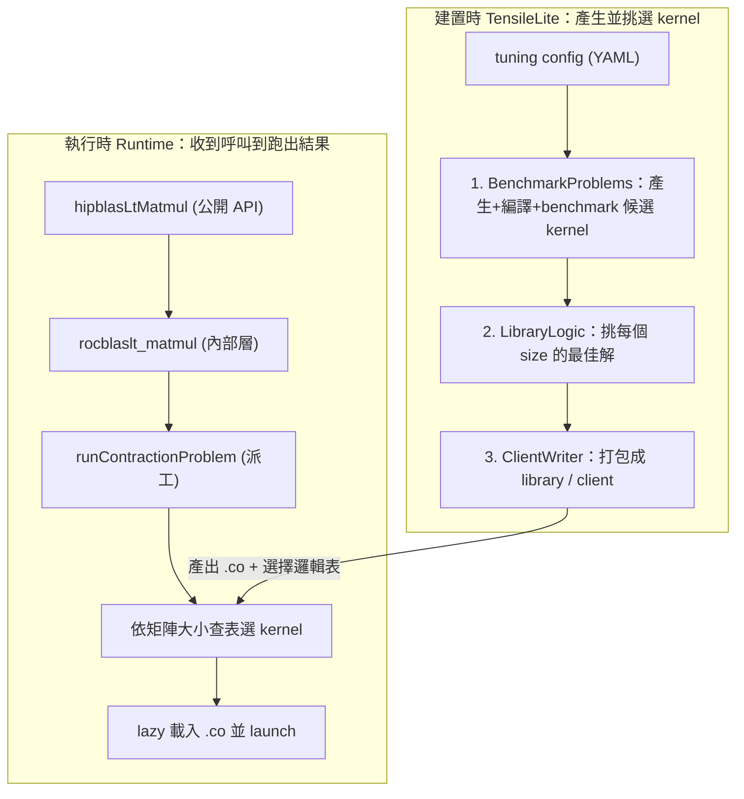

# hipBLASLt 程式碼導讀（從這裡開始）

這份文件組幫你快速看懂 hipBLASLt（AMD GPU 的 GEMM library）與它內建的 kernel 產生器
TensileLite，並一路走到「最佳化 GEMM kernel → 用 profiling 驗證」。

> 路徑說明：本文件在 repo 內的 `study_docs/hipblaslt/`，所有 code 連結是相對於本檔的相對路徑
> （`../../` 回到 repo root，再進入 `projects/`）。行號可能隨 commit 漂移，對不上時以符號名稱為準。

## 30 秒看懂這個 repo

hipBLASLt 算的是一條 GEMM 公式：

```
D = Activation(alpha * op(A) * op(B) + beta * op(C) + bias)
```

它本身**不手寫**每一種 GPU kernel，而是用 TensileLite 在**建置時**自動產生大量候選 kernel，
benchmark 後挑出每種矩陣大小的最佳解，包成一個查表用的 library；**執行時**再依當下的矩陣大小
查表選出最適合的 kernel 並載入執行。

可以把它想成餐廳：

- **TensileLite（建置時）**= 後廚試做大量菜色、試吃評分，寫成一本「哪種訂單配哪道菜」的食譜。
- **hipBLASLt runtime（執行時）**= 前台收到訂單，查食譜選菜，叫對應的師傅（kernel）出菜。

> 名詞：**GEMM** = 一般化矩陣乘法（General Matrix Multiply）。**kernel** = 在 GPU 上實際執行的運算程式。

## 全局架構



重點：**建置時這條線產出的東西（kernel 的 `.co` 檔 + 選擇邏輯表），就是執行時那條線拿來查表用的。**

## 建議閱讀順序

1. [runtime-flow.md](runtime-flow.md) — 一次 `hipblasLtMatmul` 呼叫到底發生什麼事（最容易有成就感）。
2. [tensilelite-pipeline.md](tensilelite-pipeline.md) — 那些 kernel 與選擇邏輯是怎麼產生的。
3. [gemm-optimization.md](gemm-optimization.md) — 想動手最佳化時，參數與 codegen 在哪裡改。
4. [profiling-rocprof.md](profiling-rocprof.md) — 改完怎麼用 rocprof + TensileLite benchmark 證明變快。

## Terminology（全域共用名詞）

- **GEMM** - 一般化矩陣乘法。
- **kernel** - GPU 上實際執行的運算程式。
- **solution** - 一個具體 kernel 的設定組合（含 tile 大小等參數）。
- **TensileLite** - hipBLASLt 內建、建置時產生並挑選 kernel 的框架。
- **code object (.co)** - 編譯好的 GPU 機器碼檔。

## 交叉連結

- 建置指令、CMake、PR 規範等以官方文件為準：[hipblaslt/AGENTS.md](../../projects/hipblaslt/AGENTS.md)、[tensilelite/AGENTS.md](../../projects/hipblaslt/tensilelite/AGENTS.md)（本文件組不重複這些內容）。

## 一句話總結

> 這個 repo = 「建置時做食譜（TensileLite）＋ 執行時查食譜出菜（hipBLASLt runtime）」。
> 先看 [runtime-flow.md](runtime-flow.md)。
