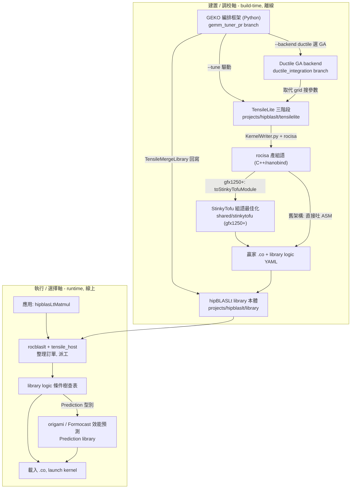
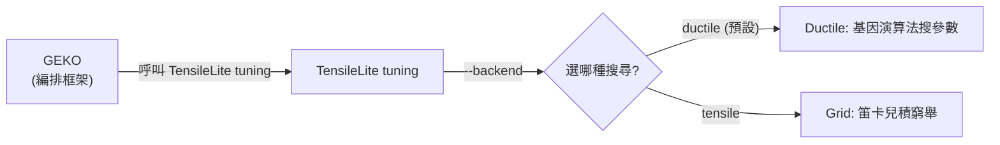

# 組件交互關係總覽：hipBLASLt / TensileLite / StinkyTofu / origami / GEKO

路徑說明：本檔在 `study_docs/hipblaslt/component-interactions/`（比其他 hipBLASLt 主題文件深一層）。連到 study_docs 其他文件：同資料夾用 `xxx.md`、上一層 hipBLASLt 主題用 `../xxx.md`、其他主題用 `../../<topic>/xxx.md`。連到原始碼往上三層回 repo root：`../../../projects/...`、`../../../shared/...`。行號會隨 commit 漂移，對不上時以符號名稱為準。

> 這份文件回答一個問題：**hipBLASLt 底下的 hipBLASLt、TensileLite、StinkyTofu、origami、GEKO（以及 GEKO 底下的 Ductile）彼此之間到底怎麼交互？** 先看本檔建立全景，再依需要讀 [build-and-tuning.md](build-and-tuning.md)（建置/調校軸）與 [runtime-and-selection.md](runtime-and-selection.md)（執行/選擇軸）。

## 一句話總結（先看這句）

> **hipBLASLt 是對外的 GEMM 函式庫；它不手寫 kernel，而是靠 TensileLite 在建置時產生 kernel（新架構再交給 StinkyTofu 做組語最佳化），靠 origami/Formocast 在選 kernel 時預測效能，靠 GEKO（底下用 Ductile GA 或 grid）自動化「產生+調校+回寫」的整個 tuning 流程。**

## 30 秒直覺：一家餐廳的分工

把 hipBLASLt 想成一家餐廳：

- **hipBLASLt**＝這家餐廳本身。客人（PyTorch、你的程式）點一道 GEMM，它負責把菜端出來。
- **TensileLite**＝後廚的「食譜研發 + 試做」團隊。**建置時**依設定（YAML）試做大量 kernel、量速度、寫成「哪種訂單配哪道菜」的食譜（library logic）。
- **StinkyTofu**＝新廚房（gfx1250+）專屬的「出菜總管」。TensileLite 把菜（組語）先做出來後，交給它重新排上菜順序、補上「等這步好了再上下一步」的提示，讓同一道菜更快上桌。
- **origami / Formocast**＝點餐時的「智慧推薦系統」。面對一個沒完全試過的訂單，用效能模型**預測**哪道菜最快，而不是每道都真的試做一次。
- **GEKO**＝一位「自動化研發主廚」。他讀店裡的實際點單紀錄（hipBLASLt log），自動決定要研發哪些新菜、指揮後廚（TensileLite）試做、挑出真的更好吃的、再把新食譜合併回餐廳。
- **Ductile**＝GEKO 手上那套「聰明的試菜策略」（基因演算法）。不像 grid 那樣把每種組合都試一遍，而是用演化的方式少試幾次就逼近最好解。

> 名詞：**GEMM**＝一般化矩陣乘法（`D = Activation(alpha·op(A)·op(B) + beta·op(C) + bias)`）；**kernel**＝GPU 上實際執行的運算程式；**solution**＝一個具體 kernel 的參數組合；**library logic**＝「哪種矩陣大小配哪個 solution」的選擇邏輯（YAML）。

## 全景關係圖

整個生態可以拆成**兩條軸**，交會在 hipBLASLt 這個函式庫本體：

**兩句話讀懂這張圖：**

1. **建置軸（上半）**：GEKO 編排 → TensileLite 三階段產生+調校 kernel（backend 用 Ductile GA 或 grid）→ KernelWriter/rocisa 吐組語 → 新架構再過 StinkyTofu → 得到「贏家 .co + library logic」→ merge 回 hipBLASLt。這一切都在**離線建置時**發生。
2. **執行軸（下半）**：應用呼叫 `hipblasLtMatmul` → hipBLASLt 整理訂單、查 library logic 條件樹 → 遇到 `Prediction` 型別就用 origami/Formocast 預測選 solution → 載入對應 `.co` 執行。這一切都在**線上執行時**發生，且**不會**再碰到 TensileLite/StinkyTofu/GEKO。

## 五個（+1）組件的一句話定位與 codebase 來源

| 組件              | 屬哪條軸         | 一句話定位                                                                         | codebase 來源（截至目前 checkout）                                                                                         |
| --------------- | ------------ | ----------------------------------------------------------------------------- | ------------------------------------------------------------------------------------------------------------------ |
| **hipBLASLt**   | 兩軸交會         | 對外 GEMM 函式庫；build-time 收下 kernel/logic，runtime 查表選 kernel 並執行                 | working tree：`projects/hipblaslt`                                                                                  |
| **TensileLite** | 建置軸          | hipBLASLt 內建的 kernel 產生器 + tuning 框架（三階段），用 `KernelWriter.py`+`rocisa` 程式化吐組語 | working tree：`projects/hipblaslt/tensilelite`（含 `rocisa`）                                                          |
| **StinkyTofu**  | 建置軸          | LLVM 風格的組語後端最佳化器；接在 rocisa 之後，只服務 gfx1250+ 的 GEMM/Attention kernel            | working tree：`shared/stinkytofu`                                                                                   |
| **origami**     | 執行軸          | solution selection 的效能預測模型（結構化 heuristic）；runtime 端由 hipBLASLt 呼叫             | working tree：`shared/origami`                                                                                      |
| **Formocast**   | 執行軸          | 更細的模擬式效能預測（L1/L2/L3 cache 模型）；**內嵌在 origami 內**，非獨立組件                         | working tree：`shared/origami/src/simulator/tensilelite/formocast`*                                                 |
| **GEKO**        | 建置軸（編排）      | 自動化 tuning 編排框架：讀 log → configure → optimize/search → merge 回 hipBLASLt       | `origin/gemm_tuner_pr` **branch**：`projects/hipblaslt/utilities/geko`（未進 develop）                                  |
| **Ductile**     | 建置軸（GEKO 之下） | GEKO `--tune` 可選的 GA 搜尋 backend，取代 grid 笛卡兒積窮舉                                | `origin/ductile_integration` **branch**：`tensilelite/Tensile/ductile/` + `backends/ductile_backend.py`（未進 develop） |

> **來源標注很重要**：`GEKO` 與 `Ductile` 的原始碼**目前不在 working tree / develop**，各自在一條尚未 merge 的 PR branch 上。本文件仍會引用它們的真實檔案路徑（可用 `git show origin/<branch>:<path>` 讀取），但請注意在目前 checkout 直接 `ls` 是看不到的。

## 放進整個 ROCm 堆疊看（延伸脈絡）

上面的兩軸只畫了這五者「彼此之間」的關係。若拉遠到整個 ROCm 堆疊，這五者其實都集中在 **「算子庫以下、編譯器以上」的中階層**，由上而下大致是：

- **框架 / 應用**：PyTorch、vLLM、TensorFlow、ONNX Runtime 等。
- **數學庫層（對外 API）**：hipBLASLt（本組主角）、rocBLAS。
- **選型 / 建模層**：origami / Formocast。
- **kernel codegen / tuning 層**：TensileLite、Ductile、GEKO（外加 rocRoller、CK、Triton）。
- **IR / Asm 最佳化層**：StinkyTofu、rocisa（其上還有 LLVM AMDGPU backend）。
- **runtime / driver**：HIP Runtime → ROCr → KFD → GPU。

一句話收束：**所有 runtime 的 GEMM 呼叫都必經 hipBLASLt 這個入口**，TensileLite / StinkyTofu / origami / GEKO 都躲在它後面，上層框架只要認得一個 API 就能享受後端演進。完整堆疊分層見內部研究報告 [ROCm hipBLASLt/TensileLite/StinkyTofu/origami/GEKO 互動關係研究報告](https://amd.atlassian.net/wiki/spaces/~7120204c779face96d403c9783064701435635/pages/1784579989/ROCm+hipBLASLt+TensileLite+StinkyTofu+origami+GEKO) §2.1–§2.2。

## 邊界：其他 GEMM backend 與框架入口

本組文件把 TensileLite 當成 hipBLASLt 的 kernel 來源來講，但實務生態還有幾條邊界值得先知道，避免把問題歸錯層：

- **rocBLAS**：新架構（gfx942/950/1250+）上，rocBLAS 的 GEMM 也逐步改走 `hipBLASLt → TensileLite`，形成統一的 GEMM backend；AI datatype 與 complex GEMM 尤其如此。
- **CK / rocRoller / TritonBLAS**：這些是**平行/補充的 kernel 來源**（各走自己的 codegen），提供某些特殊 kernel family（MX datatype、FlashAttention、MoE 等）。關鍵一句：**origami 是「跨 backend」的選型模型，不只排 TensileLite 的 solution**——理論上可對這些來源的候選 kernel 一起排序（本組 runtime 文件的情境仍聚焦 TensileLite solution）。
- **AITER**：在 vLLM / SGLang / TransformerEngine 等框架下，AITER 是「路由層」，在 hipBLASLt、CK、Triton、手寫 HIP kernel 之間做 backend 選擇；它對 hipBLASLt 的使用多發生在 GEMM-heavy 子圖。

細節與對照表見研究報告 [同上連結](https://amd.atlassian.net/wiki/spaces/~7120204c779face96d403c9783064701435635/pages/1784579989/ROCm+hipBLASLt+TensileLite+StinkyTofu+origami+GEKO) §2.3、§3.1.3。

## GEKO 與 Ductile 不是同一個東西（上下層關係）

這是最容易混淆的一點，先講清楚：

- **GEKO** 是**最外層的自動化流程**：它決定「要 tune 哪些 GEMM、產什麼 config、跑完怎麼合併回去」。
- **Ductile** 是 GEKO 底下**其中一種「怎麼搜參數」的引擎**——`ductile_backend.py` 的 docstring 明講「Genetic algorithm-based parameter search strategy... searches the fork parameter space」。GEKO `--tune` 的 `--backend {ductile,tensile}` 就是在這兩種引擎間切換，預設 `ductile`。

換句話說：**沒有 GEKO，Ductile 仍可當 TensileLite 的一個 tuning backend；而 GEKO 就算不用 Ductile，也能改用 tensile grid**。兩者高度相關但職責不同，本組文件一律分開講。細節見 [build-and-tuning.md](build-and-tuning.md)。

## 三個最常被問的交互點（本組文件的核心）

| 交互點                                              | 誰呼叫誰                                                                                                           | 發生時機   | 在哪份文件細講                                                       |
| ------------------------------------------------ | -------------------------------------------------------------------------------------------------------------- | ------ | ------------------------------------------------------------- |
| TensileLite → rocisa → StinkyTofu                | `KernelWriter.py` 產組語後，gfx1250+ 呼叫 `rocisa.toStinkyTofuModule()` 交給 StinkyTofu                                 | 建置時    | [build-and-tuning.md](build-and-tuning.md) §StinkyTofu        |
| GEKO → TensileLite（Ductile / grid）→ 回寫 hipBLASLt | GEKO 產 config、驅動 TensileLite tuning、用 `TensileMergeLibrary` merge 回 hipBLASLt library                          | 建置/調校時 | [build-and-tuning.md](build-and-tuning.md) §GEKO              |
| hipBLASLt → origami/Formocast                    | runtime 查 library logic 走到 `Prediction` 型別時，`ProblemPredictionLibrary` 呼叫 `origami::rank_configs()` 選 solution | 執行時    | [runtime-and-selection.md](runtime-and-selection.md) §origami |

## 導讀順序

1. **本檔（README）** — 建立全景、分清各組件與 GEKO/Ductile 上下層。
2. [build-and-tuning.md](build-and-tuning.md) — 建置/調校軸：GEKO → TensileLite（Ductile/grid）→ KernelWriter+rocisa → StinkyTofu → library logic → merge 回寫，逐段引用真實程式碼。
3. [runtime-and-selection.md](runtime-and-selection.md) — 執行/選擇軸：`hipblasLtMatmul` → 查表 → origami/Formocast 預測 → 載入執行。

## 交叉連結（延伸閱讀既有教材）

- 執行期呼叫鏈（五關卡）：[../runtime-flow.md](../runtime-flow.md)
- TensileLite 三階段 pipeline：[../tensilelite-pipeline.md](../tensilelite-pipeline.md)
- solution selection 條件樹細節：[../solution-selection.md](../solution-selection.md)
- KernelWriter / rocisa 三層分工：[../kernelwriter-implementation.md](../kernelwriter-implementation.md)
- StinkyTofu 專題（是什麼 / pass / 整合 / 生態）：[../../stinkytofu/README.md](../../stinkytofu/README.md)
- GEKO / Ductile deep dive（基於 codebase 的專題）：[../../geko-ductile/README.md](../../geko-ductile/README.md)
- GEKO 官方使用文件（內部）：[../../internal_docs/gemm-kernel-optimization-geko.md](../../internal_docs/gemm-kernel-optimization-geko.md)
- Ductile vs grid 深入比較（內部）：[../../internal_docs/ductile-tensilelite-tuning.md](../../internal_docs/ductile-tensilelite-tuning.md)
- Origami vs Formocast 對照（內部）：[../../internal_docs/origami-vs-formocast.md](../../internal_docs/origami-vs-formocast.md)
- 研究線生態定位筆記：[../../research/ductile-geko-notes.md](../../research/ductile-geko-notes.md)

