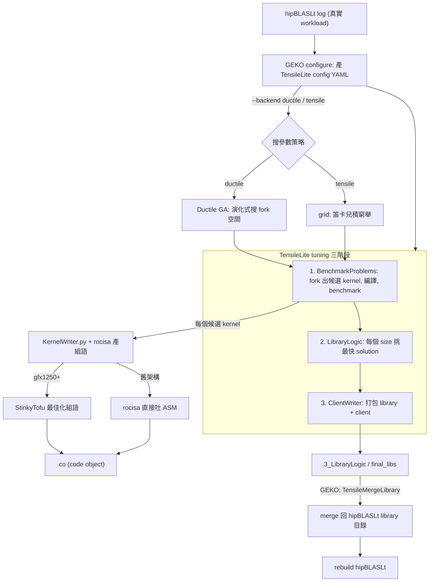
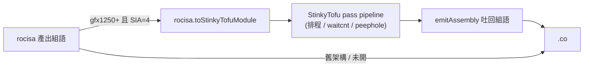
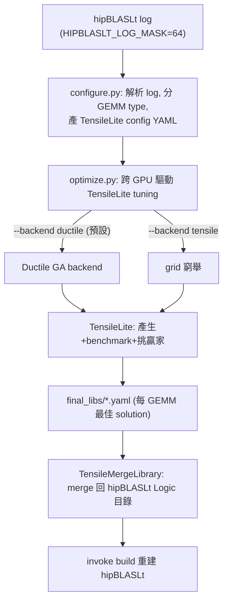

# 建置 / 調校軸：GEKO → TensileLite（Ductile / grid）→ rocisa → StinkyTofu → 回寫 hipBLASLt

路徑說明：本檔在 `study_docs/hipblaslt/component-interactions/`。連原始碼往上三層：`../../../projects/...`、`../../../shared/...`。GEKO / Ductile 的原始碼在尚未 merge 的 branch，路徑後會標注 branch。行號會漂移，以符號名稱為準。先讀 [README.md](README.md) 建立全景。

> 這一軸全部發生在**離線建置時**。目標：把「要有哪些 kernel、每個矩陣大小配哪個 kernel」這件事做出來，最後產出 hipBLASLt runtime 要查的 `.co` 與 library logic。執行時的查表選 kernel 是另一軸，見 [runtime-and-selection.md](runtime-and-selection.md)。

## 白話總覽：這一軸在做一本「食譜」

hipBLASLt 不手寫 kernel。要讓它有 kernel 可用，得先「試做很多菜、挑好吃的、寫成食譜」。這條生產線由內到外有三個層次：

1. **最內層 — rocisa / StinkyTofu**：實際把一支 kernel 的組合語言「拼」出來（rocisa），新架構再「排得更快」（StinkyTofu）。
2. **中間層 — TensileLite**：決定「要試哪些 kernel、拿哪些矩陣大小去 benchmark、挑誰當贏家」，並呼叫最內層產生每支 kernel。
3. **最外層 — GEKO**：把「讀真實 workload → 產生 TensileLite 設定 → 驅動 tuning → 合併回 hipBLASLt」整串自動化；其中「怎麼搜參數」可選 Ductile（GA）或 grid。

> **邊界**：TensileLite 是 hipBLASLt 的**主要但非唯一** kernel 來源；`CK` / `rocRoller` / `TritonBLAS` 是走各自 codegen 的**平行來源**，不在本軸內，但它們產出的 kernel 最終都可被同一套 origami 選型（見 [runtime-and-selection.md](runtime-and-selection.md)）。其他 backend 的定位見研究報告 [ROCm hipBLASLt/TensileLite/StinkyTofu/origami/GEKO 互動關係研究報告](https://amd.atlassian.net/wiki/spaces/~7120204c779face96d403c9783064701435635/pages/1784579989/ROCm+hipBLASLt+TensileLite+StinkyTofu+origami+GEKO) §2.3。

由外而內驅動、由內而外交付，如下圖：

下面由內而外，一層層講清楚交互點。

## 一、最內層：TensileLite → rocisa → StinkyTofu（一支 kernel 的組語怎麼產生）

### 1.1 KernelWriter + rocisa：把 solution 參數變成組語

TensileLite tuning 的階段 1（BenchmarkProblems）在編譯每個候選 kernel 前，會先產生它的組合語言。入口是 `KernelWriter.py`，它透過 C++ 模組 `rocisa`（Nanobind 綁定）逐條產生 AMDGPU 指令。

- kernel 主體建構：[kernelBody()](../../../projects/hipblaslt/tensilelite/Tensile/KernelWriter.py)（`KernelWriter.py`）
- 產生 source 入口：`_getKernelSource()`（同檔）
- rocisa 模組：[rocisa](../../../projects/hipblaslt/tensilelite/rocisa)

白話：`KernelWriter.py` 像「導演/排程」，`KernelWriterAssembly.py` 像「執筆者/逐條發指令」，`rocisa` 則是「組裝 AMDGPU 指令的 C++ 工具庫」。三層分工細節見 [../kernelwriter-implementation.md](../kernelwriter-implementation.md)，pipeline 脈絡見 [../tensilelite-pipeline.md](../tensilelite-pipeline.md) 的〈KernelWriter + rocisa〉小節。

> 關鍵事實：**這條路完全不經過 Clang / LLVM**。組語是用 Python + rocisa「直接拼」出來的，所以享受不到 LLVM 後端成熟的排程與自動插等待指令——這正是下一步 StinkyTofu 存在的理由。

### 1.2 交給 StinkyTofu：只在 gfx1250+ 發生

rocisa 產出「能跑」的組語後，較新架構（gfx1250 及之後）會再把組語交給 **StinkyTofu**（LLVM 風格、以 pass 為基礎的組語最佳化器）重排指令、補上正確的等待指令。這是 TensileLite 與 StinkyTofu 的**唯一交互點**。

觸發機制（白話三步，完整見 [../../stinkytofu/tensilelite-integration.md](../../stinkytofu/tensilelite-integration.md)）：

1. **開關**：tuning YAML 裡把 `ScheduleIterAlg=4`（SIA=4）＝「這支 kernel 用 StinkyTofu、全開最佳化」。
2. **前提檢查**：在 [Solution.py](../../../projects/hipblaslt/tensilelite/Tensile/SolutionStructs/Solution.py) 檢查 `rocisa.hasStinkyTofuBackend()` 與 `rocisa.isSupportedByStinkyTofu(ISA)`；不支援就 `reject` 這個 solution。通過後把旗標 remap 成 `_ScheduleIterAlg=0`、`_StinkyTofuOptLevel=3`。
3. **轉換與最佳化**：在 [KernelWriter.py](../../../projects/hipblaslt/tensilelite/Tensile/KernelWriter.py) 呼叫 `rocisa.toStinkyTofuModule(...)` 把 rocisa 組語轉成 StinkyTofu IR → 跑 pass pipeline → `emitAssembly()` 吐回最佳化後的組語字串，當成這支 kernel 的最終組語。

補充：LDS 相依不透過真暫存器流動，所以 [KernelWriterAssembly.py](../../../projects/hipblaslt/tensilelite/Tensile/KernelWriterAssembly.py) 在產生 local write 時會 `setMemToken(...)` 掛上「記憶體代幣」，讓下游 StinkyTofu 的 waitcnt pass 追得到相依。

> 一句話：**StinkyTofu 是「rocisa 之後、`.co` 之前」的一層專門後端最佳化，只服務 gfx1250+ 的 TensileLite kernel**；舊架構直接用 rocisa 的輸出。生態定位與「為何不全走 LLVM」見 [../../stinkytofu/ecosystem-and-impact.md](../../stinkytofu/ecosystem-and-impact.md)。

## 二、中間層：TensileLite 三階段（決定有哪些 kernel、誰是贏家）

TensileLite 是 hipBLASLt 內建、**建置時**產生並挑選 kernel 的框架。三階段（完整見 [../tensilelite-pipeline.md](../tensilelite-pipeline.md)）：

| 階段 | 入口 | 做什麼 | 輸出目錄 |
| --- | --- | --- | --- |
| 1. BenchmarkProblems | [BenchmarkProblems.main()](../../../projects/hipblaslt/tensilelite/Tensile/BenchmarkProblems.py) | 依 YAML 把參數 fork 成很多候選 kernel（呼叫 §一 的 KernelWriter+rocisa 產組語）→ 編成 `.co` → 在真 GPU 上 benchmark | `1_BenchmarkProblems/`、`2_BenchmarkData/` |
| 2. LibraryLogic | [LibraryLogic.main()](../../../projects/hipblaslt/tensilelite/Tensile/LibraryLogic.py) | 讀 benchmark 數據，對每個矩陣大小挑最快 solution，寫成選擇邏輯樹 | `3_LibraryLogic/` |
| 3. ClientWriter | [ClientWriter.main()](../../../projects/hipblaslt/tensilelite/Tensile/ClientWriter.py) | 重建被選中的 solution、編出最終 library `.co` + 索引，並產 benchmark client | `4_LibraryClient/` |

這裡有兩件事要對接上下層：

- **對接最內層**：階段 1 的 build 小步 `writeBenchmarkFiles(...)` 內部會對每個 solution 呼叫 KernelWriter（§一），這就是 kernel 組語的產生點。
- **對接 hipBLASLt runtime**：階段 2 產出的 `3_LibraryLogic/` YAML，正是 runtime 要查的表（見 [runtime-and-selection.md](runtime-and-selection.md)）；階段 3 的 `.co` 就是 runtime lazy load 的機器碼檔。

### 「怎麼搜參數」：grid vs Ductile（GA）

階段 1 要 fork 出哪些候選 kernel，有兩種策略：

- **Grid（TensileLite 原生）**：對 YAML `ForkParameters` 做**笛卡兒積窮舉**，每個組合一個候選。決定性、可重現、覆蓋完整，但空間隨維度指數爆炸。這是預設也是 baseline 作法。
- **Ductile（GA backend）**：把每組參數當「染色體」，用 selection/crossover/mutation 演化，少量評估就逼近甚至超越 grid 最佳點，還能探出 grid 外的組合。這是 §三 GEKO `--backend ductile` 時插進來取代窮舉的引擎。

兩者差異、染色體設計、`--convert-config` 擴張值域等，見 [../../internal_docs/ductile-tensilelite-tuning.md](../../internal_docs/ductile-tensilelite-tuning.md)。

## 三、最外層：GEKO 編排（把整串自動化 + 回寫 hipBLASLt）

> **來源提醒**：GEKO 原始碼在 **`origin/gemm_tuner_pr`** branch 的 `projects/hipblaslt/utilities/geko/`，尚未 merge 進 develop；目前 checkout 直接 `ls` 看不到，可用 `git show origin/gemm_tuner_pr:projects/hipblaslt/utilities/geko/...` 讀取。以下路徑均指該 branch。

GEKO（GEMM Kernel Optimization）是一套 Python framework，把「從真實 workload 到 optimized library」整條自動化。三種模式（基於 codebase 的完整 deep dive 見 [../../geko-ductile/geko-deep-dive.md](../../geko-ductile/geko-deep-dive.md)；官方使用文件見 [../../internal_docs/gemm-kernel-optimization-geko.md](../../internal_docs/gemm-kernel-optimization-geko.md)）：

| 模式 | CLI | 做什麼 | 底層用到誰 |
| --- | --- | --- | --- |
| `--tune` | GA / grid tuning | configure 產 config → optimize 跑 tuning → merge | **TensileLite tuning**（backend＝Ductile 或 grid） |
| `--search` | dense benchmark | 對既有 solutions 窮舉 benchmark、挑 winner | hipblaslt-bench + TensileLite library |
| `--bench` | 純量測 | 只跑 hipblaslt-bench，不 tuning | hipblaslt-bench |

GEKO 與其他組件的交互點（`--tune` 為例）：

GEKO 檔案地圖（在 `origin/gemm_tuner_pr` 的 `projects/hipblaslt/utilities/geko/`）：

| 位置 | 角色 |
| --- | --- |
| `geko/config_generator/` | 讀 log / list / inline → 產 TensileLite config（含各架構 `hw_profiles/gfx942`、`gfx950` 的 fork 參數 profile） |
| `geko/optim/optim.py` | 編排多 GPU 優化：configure → run → analyze（benchmark 並篩選 optimized kernels） |
| `geko/search.py` | dense search（offline tuning）：對既有 solutions 窮舉 benchmark |
| `geko/library/operations.py` | library 載入、merge、建立（呼叫 `TensileCreateLibrary`） |
| `geko/bench/` | hipblaslt-bench 執行、log 解析 |
| `geko/pipeline.py` / `geko/cli.py` | workflow 編排 pipeline 與 CLI 進入點 |

### GEKO 與 Ductile 的關係（再次強調：上下層，不是同一個）

- Ductile 原始碼在 **另一條** branch `origin/ductile_integration` 的 `tensilelite/Tensile/ductile/`（核心 GA：`core/crossover.py`、`mating.py`、`mutation.py`、`population.py`、`selection.py`、`survival.py`、`algorithm/ga.py`）與 [ductile_backend.py](../../../projects/hipblaslt/tensilelite/Tensile/backends/ductile_backend.py)（`ductile_integration` branch）。
- Ductile 是**插進 TensileLite tuning** 的一個 backend；GEKO 只是在 `--tune` 時透過 `--backend ductile` 選用它。兩者可獨立存在。
- GA 引擎、SearchSpace、operators 與 `ductile_backend.py` 串接的 deep dive：[../../geko-ductile/ductile-deep-dive.md](../../geko-ductile/ductile-deep-dive.md)。

### 回寫 hipBLASLt：TensileMergeLibrary

GEKO tuning/search 完得到 `final_libs/`，用 `TensileMergeLibrary` 把新贏家 merge 進 hipBLASLt 的 Logic 目錄（例如 `library/src/amd_detail/rocblaslt/src/Tensile/Logic/asm_full/gfx950/Equality/`），再 `invoke build` 重建。這一步就是 GEKO 與 **hipBLASLt library 本體**的交互點——新 tune 出來的 kernel 從此進入 runtime 的查表範圍。

## 這一軸與執行軸的交接

建置軸的最終交付物有兩樣，直接餵給執行軸：

- **`.co`（code object）**：runtime lazy load 的 GPU 機器碼。
- **library logic YAML**：runtime 查表選 solution 的依據；其中若含 `Prediction` 型別的節點，就會在執行時觸發 origami/Formocast 預測（見 [runtime-and-selection.md](runtime-and-selection.md)）。

## 一句話總結

> **由外而內驅動：GEKO 讀 log 產 config → 驅動 TensileLite tuning（backend 選 Ductile GA 或 grid）→ TensileLite 用 KernelWriter+rocisa 產每支 kernel 的組語 → gfx1250+ 再過 StinkyTofu 最佳化 → 產出贏家 `.co` 與 library logic → GEKO 用 TensileMergeLibrary 回寫 hipBLASLt。** 執行時怎麼用這些產物，見 [runtime-and-selection.md](runtime-and-selection.md)。
