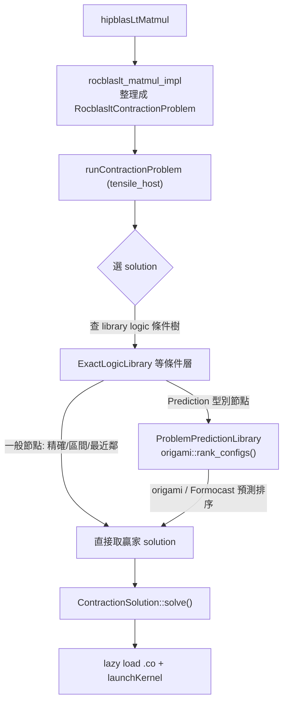

# 執行 / 選擇軸：hipBLASLt → 查表 → origami / Formocast 預測 → 載入執行

路徑說明：本檔在 `study_docs/hipblaslt/component-interactions/`。連原始碼往上三層：`../../../projects/...`、`../../../shared/...`。行號會漂移，以符號名稱為準。先讀 [README.md](README.md) 建立全景；本檔是建置軸 [build-and-tuning.md](build-and-tuning.md) 的下游。

> 這一軸全部發生在**線上執行時**。目標：應用呼叫一次 GEMM，hipBLASLt 要「選對 kernel 並跑起來」。這裡**不會**再碰到 TensileLite / StinkyTofu / GEKO——它們的產物（`.co` + library logic）在建置軸就備好了。唯一會在執行時被呼叫的「外部組件」是 **origami / Formocast**（效能預測選 solution）。

## 白話總覽：點餐到出菜

> **上游：框架怎麼進來**——本檔從 `hipblasLtMatmul` 這關才起算，但實務上這一步之前還有一段：`PyTorch / vLLM 的 matmul → ROCm backend →（直接或經 AITER 路由）→ hipblasLtMatmul`。也就是說框架不直接碰 TensileLite/origami，一律經 hipBLASLt 這個入口。框架層路徑見研究報告 [ROCm hipBLASLt/TensileLite/StinkyTofu/origami/GEKO 互動關係研究報告](https://amd.atlassian.net/wiki/spaces/~7120204c779face96d403c9783064701435635/pages/1784579989/ROCm+hipBLASLt+TensileLite+StinkyTofu+origami+GEKO) §4.1。

你呼叫 `hipblasLtMatmul(...)`，背後像餐廳出餐五關卡（完整逐關見 [../runtime-flow.md](../runtime-flow.md)）：

1. **前台收單** — 公開 API `hipblasLtMatmul` 收到呼叫。
2. **轉內場** — 轉交 `rocblaslt` 層，整理成內部「訂單」`RocblasltContractionProblem`。
3. **派工** — `tensile_host` 的 `runContractionProblem` 拿訂單找「該叫哪位師傅」。
4. **選師傅** — 依矩陣大小查 library logic 條件樹選 solution；**走到 `Prediction` 型別節點時，就呼叫 origami/Formocast 預測選最好的**。
5. **取工具開工** — lazy load 對應 `.co`，launch kernel。

本組文件的重點是**關卡 4 裡 hipBLASLt 與 origami/Formocast 的交互**，下面聚焦講它。



## 一、library logic 從哪來（接住建置軸）

runtime 查的那張表，就是建置軸 TensileLite 階段 2 產出的 `3_LibraryLogic/` YAML（見 [build-and-tuning.md](build-and-tuning.md) §二）。它被打包進 hipBLASLt library，載入後成為一棵「依條件分層的選擇樹」：先比對 problem 屬性（型別、轉置等），最後在尺寸層用「精確 → 區間 → 最近鄰」挑贏家。整棵條件樹的層次見 [../solution-selection.md](../solution-selection.md)。

- 條件樹比對：[ExactLogicLibrary::findTopSolutions](../../../projects/hipblaslt/tensilelite/include/Tensile/ExactLogicLibrary.hpp)
- 依 index 取 solution：[MasterSolutionLibrary::getSolutionByIndex](../../../projects/hipblaslt/tensilelite/include/Tensile/MasterSolutionLibrary.hpp)

這棵樹的葉子有不同「型別」。多數是純比對尺寸的節點；但其中一種型別 `Prediction`，會把「挑哪個 solution」交給 origami/Formocast 的效能模型——這就是 hipBLASLt 與 origami 的交互點。

## 二、核心交互：hipBLASLt → origami（`ProblemPredictionLibrary`）

### 2.1 誰呼叫、在哪呼叫

當條件樹走到 `Prediction` 型別的 solution library 時，實際負責的是 [ProblemPredictionLibrary](../../../projects/hipblaslt/tensilelite/include/Tensile/PredictionLibrary.hpp)（`type() == "Prediction"`）。它持有一份 `origami::config_t` 清單，並在 `findTopSolutions()` 裡呼叫 origami 做預測：

```cpp
// PredictionLibrary.hpp（ProblemPredictionLibrary::findTopSolutions 內，節錄）
origami::problem_t origami_problem = {
    .size        = {m, n, k},
    .batch       = batch,
    .a_transpose = problem.transA() ? origami::transpose_t::T : origami::transpose_t::N,
    .b_transpose = problem.transB() ? origami::transpose_t::T : origami::transpose_t::N,
    // ... a/b/c/d dtype、mi_dtype ...
};

auto prediction_result = origami::rank_configs(
    origami_problem, *(pAMDGPU->analyticalHardware), origami_config_list);
```

白話拆解這段交互：

1. hipBLASLt 先從 Tensile 的 `problem` 算出 `m, n, k, batch`、轉置、各資料型別，組成 origami 看得懂的 `origami::problem_t`。
2. 從硬體物件取出 `analyticalHardware`（`origami::hardware_t`，描述這張 GPU 的 CU 數、LDS、cache、頻寬等）。
3. 呼叫 **`origami::rank_configs(problem, hardware, config_list)`**：origami 用它的效能模型，對每個候選 config **預測效能並排序**，回傳排名。
4. hipBLASLt 依排名取出對應 solution（`solution_list[r.config.index]`），再套用 `hardwarePredicate` / `problemPredicate` 確認這個 solution 真的能跑，收集到需要的數量為止。

> 關鍵：**origami 不真的跑 kernel**。它是一個「用硬體參數算 issued cycles / memory latency 來預測誰最快」的分析模型，所以能在**執行時**快速選 solution，而不需要離線 benchmark 過每個 size。這正是它相對「純查表最近鄰」的價值：對沒精確 tune 過的 size 也能較準地選。
>
> **caveat：origami 是「跨 backend」選型器**——`rank_configs` 吃的是一份候選 config 清單 + 硬體參數，理論上這份候選 pool 可以混入 CK / Triton / rocRoller 等其他來源的 kernel，一起排序。本檔情境聚焦在 hipBLASLt 走 TensileLite solution 的路徑，但別把 origami 誤會成「只服務 TensileLite」。跨 backend 選型的設計見研究報告 [ROCm hipBLASLt/TensileLite/StinkyTofu/origami/GEKO 互動關係研究報告](https://amd.atlassian.net/wiki/spaces/~7120204c779face96d403c9783064701435635/pages/1784579989/ROCm+hipBLASLt+TensileLite+StinkyTofu+origami+GEKO) §3.4.2。

### 2.2 origami 與 Formocast 的關係

`origami` 提供這套 solution-selection 預測，程式碼在 working tree 的 `shared/origami`（`include/origami/`、`src/origami/`、`src/simulator/`）。**Formocast 內嵌在 origami 裡**，是它的一個更細的模擬器：

- [formocast.hpp](../../../shared/origami/include/origami/simulator/tensilelite/formocast.hpp) / [formocast_simulator.hpp](../../../shared/origami/include/origami/simulator/tensilelite/formocast_simulator.hpp)
- [formocast.cpp](../../../shared/origami/src/simulator/tensilelite/formocast.cpp) / [formocast_simulator.cpp](../../../shared/origami/src/simulator/tensilelite/formocast_simulator.cpp)

兩者差異（完整見 [../../internal_docs/origami-vs-formocast.md](../../internal_docs/origami-vs-formocast.md)）：

| 面向 | Origami | Formocast |
| --- | --- | --- |
| 準確度（vs exact tuning） | ~90% | ~95% |
| solution pool | 小 pool + MT 組合 + auto WGM | 任意 TensileLite 參數集合 |
| 記憶體模型 | perf_ratio + 最壞界；較粗 | L1/L2/L3 cache 命中率逐層模型；較細 |
| library 支援 | 支援 Triton-based + StreamK | 目前 TensileLite-only、non-StreamK |
| 主要函式 | `rank_configs` → `compute_total_latency` | `predictedPerformance` |
| 整合方向 | 當 GEMM 前端 | 併入 origami subfolder，當更準的後端（PR #3735） |

用一句話說它們的關係：**origami 是對外的 solution-selection 前端與基礎設施（hipBLASLt runtime 呼叫的就是它的 `rank_configs`）；Formocast 是併進 origami 的一個更精細的模擬式預測後端**。對 hipBLASLt 而言，交互點就是 `origami::rank_configs()`，底層用哪套模型是 origami 內部的事。

### 2.3 為何選擇是「預測」而非「窮舉」

- **build-time 只 benchmark 有限的代表 size**（見 [build-and-tuning.md](build-and-tuning.md)）；沒測過的 size 若只靠「最近鄰」查表，離 tuning 點遠時可能選到非最佳 kernel。
- **origami/Formocast 的預測模型**用硬體參數即時估算，讓 runtime 面對任意 size 都能較準地排序候選 solution，補足「最近鄰」的粗糙。
- 這也是為什麼 library logic 會有 `Prediction` 這種節點型別：它把「選擇」從死板查表升級成「模型預測」。

### 2.4 兩個延伸：runtime search fallback 與 selection 模式開關

除了「查表 / 預測」，還有兩件事跟選型直接相關，值得一併知道：

- **runtime search fallback**：如果查表 + 預測都給不出合適 solution，hipBLASLt 還能退回「線上試多個候選 algorithm、取實測最快者」的 runtime autotuning。這條路較貴（真的跑），但在某些中等 size 上曾被觀察到相對預設 heuristics 最高約 **1.88×** 的提升——說明 heuristics / 分析模型仍有演進空間。
- **`TENSILE_SOLUTION_SELECTION_METHOD`**：這個環境變數用來切換 solution selection 模式（Equality / Grid / decision tree / **Origami**）。換句話說，**它實質上就是「這次要不要走 origami 預測」的開關**，和 §二 走到 `Prediction` 節點的行為直接呼應——想強制或關閉 origami 路徑時就是調它。

以上兩點與相關環境變數見研究報告 [ROCm hipBLASLt/TensileLite/StinkyTofu/origami/GEKO 互動關係研究報告](https://amd.atlassian.net/wiki/spaces/~7120204c779face96d403c9783064701435635/pages/1784579989/ROCm+hipBLASLt+TensileLite+StinkyTofu+origami+GEKO) §3.1.2、§4.4。

## 三、選定之後：solve 與 lazy load（與 origami 無關）

選出 solution index 後，剩下的與 origami 無關，純 hipBLASLt/TensileLite runtime：

- [ContractionSolution::solve()](../../../projects/hipblaslt/tensilelite/src/ContractionSolution.cpp)：把 solution 展開成具體 `KernelInvocation`（kernel 名、`.co`、grid、引數）。
- [SolutionAdapter::launchKernel()](../../../projects/hipblaslt/tensilelite/src/hip/HipSolutionAdapter.cpp)：需要時才 lazy load `.co`（`FindCodeObject` → `hipModuleLoad`）再 launch。

逐關參數細節見 [../runtime-flow.md](../runtime-flow.md) 關卡 5。

## 四、這一軸沒有誰

為避免混淆，明確標出**執行時不會出現**的組件：

- **TensileLite**：只在建置時產生 kernel/logic；runtime 不呼叫它。
- **StinkyTofu**：只在建置時最佳化組語；runtime 載入的 `.co` 已經是它加工好的成品，runtime 不再跑任何 pass。
- **GEKO / Ductile**：純建置/調校期的編排與搜尋工具，runtime 完全無關。

runtime 唯一會即時呼叫的「模型」就是 **origami/Formocast**（且只在條件樹走到 `Prediction` 節點時）。

## 一句話總結

> **執行時就是「整理訂單 → 查 library logic 條件樹選 solution → 遇到 `Prediction` 節點就用 `origami::rank_configs()`（底層可含 Formocast）預測排序 → 取 solution → lazy load `.co` → launch」。** 這張表和這些 `.co` 哪來的？上游建置軸 [build-and-tuning.md](build-and-tuning.md)。
