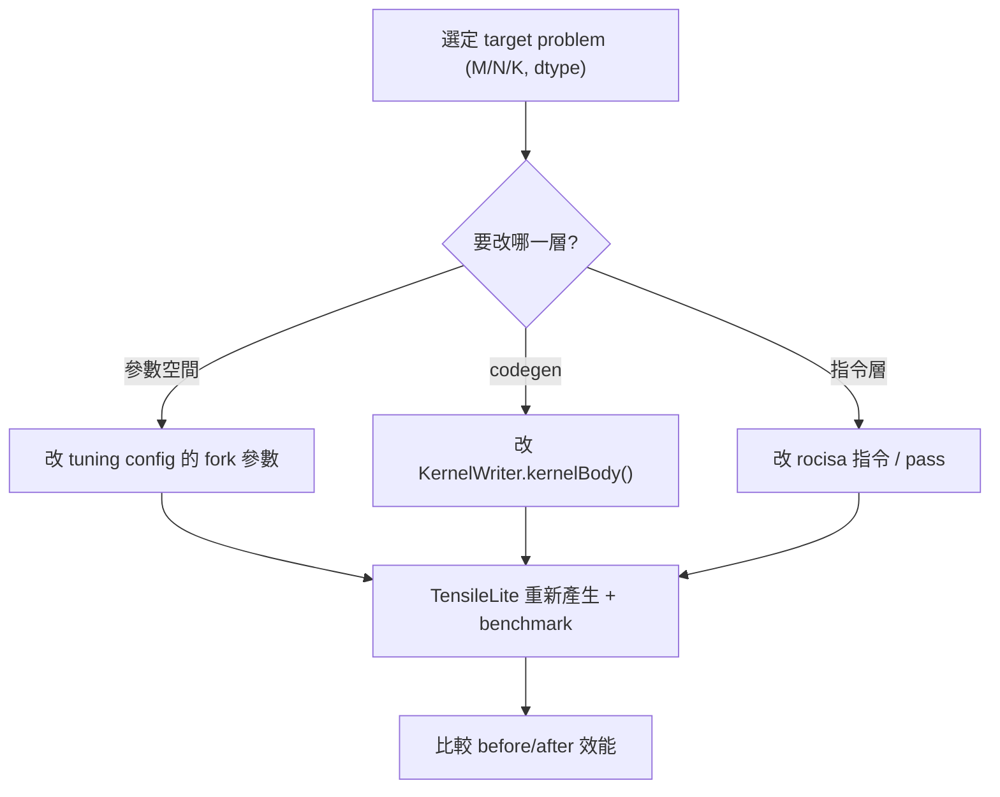

# GEMM 最佳化切入點：要改什麼、在哪裡改

> 路徑說明：本檔在 repo 內的 `study_docs/hipblaslt/`，code 連結為相對路徑（`../../projects/...`，先回到 repo root 再進 `projects/`）。
> 行號可能隨 commit 漂移，對不上時以符號名稱為準。建議先讀 [runtime-flow.md](runtime-flow.md)
> 與 [tensilelite-pipeline.md](tensilelite-pipeline.md)。

## 白話總覽

「最佳化 GEMM kernel」在這個 repo 通常不是直接手刻一支 kernel，而是調整 **Solution 參數**
（tile 大小、要不要 double buffer、用哪種 MFMA 指令等），讓 TensileLite 產生更快的 kernel；
或更深入地在 `KernelWriter` 改 codegen 邏輯。流程是：

1. 選一個目標 problem（固定的 M/N/K 與資料型別）。
2. 改參數或 codegen → 用 TensileLite 重新產生 + benchmark。
3. 比 before/after 的效能，確認真的變快（見 [profiling-rocprof.md](profiling-rocprof.md)）。

> 名詞：**tile** = 把大矩陣切成小塊，每個 workgroup 算一塊；tile 大小直接影響快取/暫存器使用與效能。
> **MFMA** = AMD 矩陣乘加指令（Matrix Fused Multiply-Add），是 GEMM 在 CDNA GPU 上的核心算力來源。

## 架構 / 流程圖



## 逐步 trace

### 你會調的參數從哪來：Solution 與 Problem

一個候選 kernel 就是一個 `Solution`，由 YAML 設定 + 衍生參數組成。tile 大小、LDS、MFMA 等衍生參數
都在 `assignDerivedParameters` 計算。

- `Solution` 類別：[class Solution](../../projects/hipblaslt/tensilelite/Tensile/SolutionStructs/Solution.py#L471)
- 衍生參數計算：[assignDerivedParameters](../../projects/hipblaslt/tensilelite/Tensile/SolutionStructs/Solution.py#L1478)
- 問題定義 `ProblemType`：[class ProblemType](../../projects/hipblaslt/tensilelite/Tensile/SolutionStructs/Problem.py#L818)
- tuning 的 `ProblemSizes` 區段：[ProblemSizes](../../projects/hipblaslt/tensilelite/Tensile/SolutionStructs/Problem.py#L282)

> 名詞：**LDS** = Local Data Share，GPU 上 workgroup 共用的高速 shared memory。

### 三個調整層級（由淺到深）

1. **改 tuning config 的參數空間（最常見、風險最低）**
   - 在 YAML 的 fork 區段擴充/縮小要嘗試的 tile 大小、`DepthU`、`GlobalReadVectorWidth` 等，
     讓 TensileLite 多試幾組，再讓 LibraryLogic 自動挑贏家。
   - 衍生與驗證邏輯參考 [assignDerivedParameters](../../projects/hipblaslt/tensilelite/Tensile/SolutionStructs/Solution.py#L1478)。

2. **改 kernel 產生邏輯（codegen）**
   - 在 `kernelBody()` 內調整指令排程、prefetch、local/global read-write 等。
   - 程式碼：[kernelBody()](../../projects/hipblaslt/tensilelite/Tensile/KernelWriter.py#L5279)
   - 模組化建構元件（MAC、read/write、排程）在 `../../projects/hipblaslt/tensilelite/Tensile/Components/`。

3. **改 rocisa 指令層（最深，需熟 AMD ISA）**
   - rocisa 負責逐條 AMDGPU 指令的產生與最佳化 pass；改這層才會直接動到輸出的組合語言。

> 建議實習初期從第 1 層開始最有效率；想練 AMD ISA 再往第 2、3 層深入。

## 關鍵資料結構

| 結構 | 角色（白話） | 位置 |
|------|--------------|------|
| `Solution` | 一個候選 kernel 的參數集合 | [定義](../../projects/hipblaslt/tensilelite/Tensile/SolutionStructs/Solution.py#L471) |
| `assignDerivedParameters` | 由輸入參數推導 tile / LDS / MFMA 等 | [定義](../../projects/hipblaslt/tensilelite/Tensile/SolutionStructs/Solution.py#L1478) |
| `ProblemType` | 要算哪種運算、資料型別、index 配置 | [定義](../../projects/hipblaslt/tensilelite/Tensile/SolutionStructs/Problem.py#L818) |

## 如何建置 / 執行以觀察此流程

最小最佳化迭代迴圈：

```bash
cd /data1/perlee/rocm-libraries/projects/hipblaslt/tensilelite
invoke rocisa && invoke build-client          # 一次性準備

# 改 tuning config 後，重新產生 + benchmark
Tensile/bin/Tensile my_gemm_tune.yaml out/
#   out/2_BenchmarkData/*.csv  -> Gflops / 時間
#   out/3_LibraryLogic/*.yaml  -> 選了哪個 solution
```

整合回 hipBLASLt 後，對單一 solution 做受控比較：

```bash
cd /data1/perlee/rocm-libraries/projects/hipblaslt/build/release
./clients/hipblaslt-bench -m 4096 -n 4096 -k 4096 \
    --a_type bf16_r --b_type bf16_r --c_type bf16_r --d_type bf16_r --compute_type f32_r \
    --algo_method index --solution_index <idx> --print_kernel_info -v
```

- bench 選項：[clients/bench/README.md](../../projects/hipblaslt/clients/bench/README.md)
- 加速建議：device-lib build 很慢，可用 `invoke build -f 'gfx942/...'` 縮小範圍（見官方
  [AGENTS.md](../../projects/hipblaslt/AGENTS.md)）。

## Terminology

- `tile` - 矩陣切塊，每個 workgroup 算一塊。
- `MFMA` - AMD 矩陣乘加指令，GEMM 算力來源。
- `LDS` - workgroup 共用的高速 shared memory。
- `DepthU` - K 方向一次處理的深度（影響重用與暫存器壓力）。
- `solution_index` - bench 用來固定某個 solution 的索引。

## 交叉連結

- 上一層全局：[README.md](README.md)
- kernel 怎麼產生與挑選：[tensilelite-pipeline.md](tensilelite-pipeline.md)
- 改完怎麼量測與驗證：[profiling-rocprof.md](profiling-rocprof.md)
- build / PR 規範見官方 [AGENTS.md](../../projects/hipblaslt/AGENTS.md)（本文件不重複）。

## 一句話總結

> 先在 config 層調參數讓 TensileLite 幫你找好 kernel；要更極致再進 KernelWriter / rocisa。
> 每次都用 benchmark + profiling 證明真的變快，下一篇 [profiling-rocprof.md](profiling-rocprof.md)。
