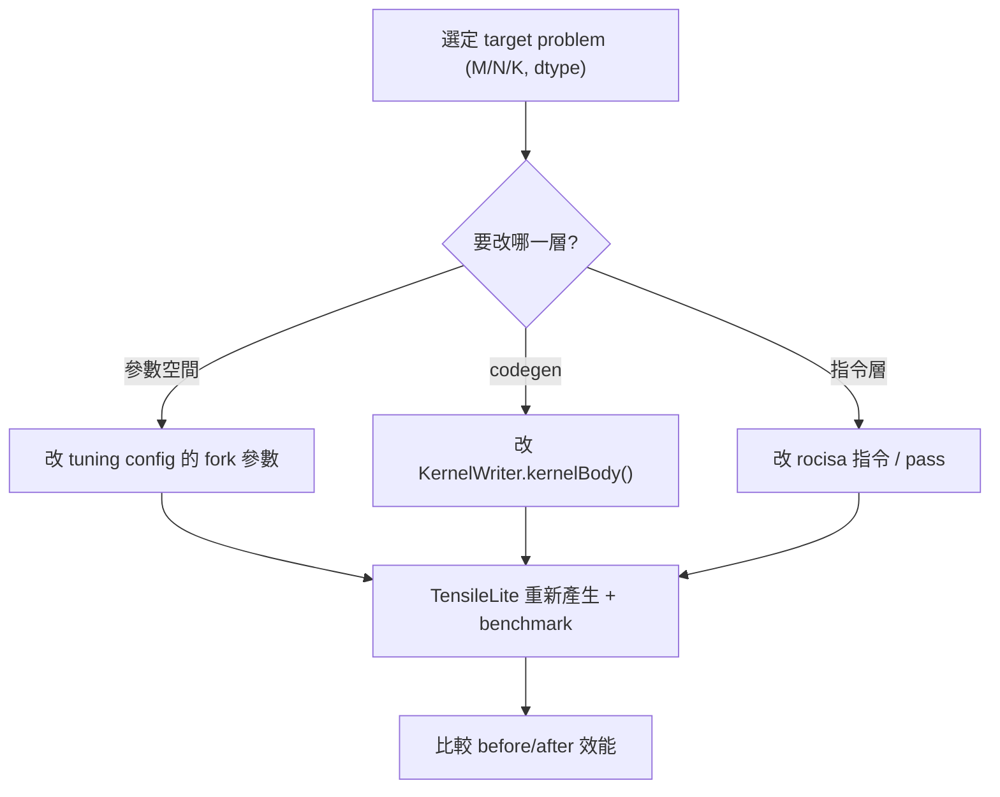

# GEMM 最佳化切入點：要改什麼、在哪裡改

路徑說明：本檔在 repo 內的 `study_docs/hipblaslt/`，code 連結為相對路徑（`../../projects/...`，先回到 repo root 再進 `projects/`）。行號可能隨 commit 漂移，對不上時以符號名稱為準。建議先讀 [runtime-flow.md](runtime-flow.md) 與 [tensilelite-pipeline.md](tensilelite-pipeline.md)。

**權威內部來源**：solution selection（兩層）、調參工具生態（GEKO / bench-driven swap）、codegen 重構（snippet / StinkyTofu）見 [internal_docs/hipblaslt-tensilelite-reference.md](../internal_docs/hipblaslt-tensilelite-reference.md) Module B/C；參數速查見 [tuning-config-reference.md](tuning-config-reference.md)。

## 白話總覽

「最佳化 GEMM kernel」在這個 repo 通常不是直接手刻一支 kernel，而是調整 **Solution 參數**
（tile 大小、要不要 double buffer、用哪種 MFMA 指令等），讓 TensileLite 產生更快的 kernel；
或更深入地在 `KernelWriter` 改 codegen 邏輯。流程是：

1. 選一個目標 problem（固定的 M/N/K 與資料型別）。
2. 改參數或 codegen → 用 TensileLite 重新產生 + benchmark。
3. 比 before/after 的效能，確認真的變快（見 [profiling-rocprof.md](profiling-rocprof.md)）。

名詞：
- **tile** = 把大矩陣切成小塊，每個 workgroup 算一塊；tile 大小直接影響快取/暫存器使用與效能。
- **MFMA** = AMD 矩陣乘加指令（Matrix Fused Multiply-Add），是 GEMM 在 CDNA GPU 上的核心算力來源。

## 架構 / 流程圖



## 逐步 trace

### 你會調的參數從哪來：Solution 與 Problem

一個候選 kernel 就是一個 `Solution`，由 YAML 設定 + 衍生參數組成。tile 大小、LDS、MFMA 等衍生參數
都在 `assignDerivedParameters` 計算。

- `Solution` 類別：[class Solution](../../projects/hipblaslt/tensilelite/Tensile/SolutionStructs/Solution.py#L471)
- 衍生參數計算：[assignDerivedParameters](../../projects/hipblaslt/tensilelite/Tensile/SolutionStructs/Solution.py#L1478)
- 問題定義 `ProblemType`：[class ProblemType](../../projects/hipblaslt/tensilelite/Tensile/SolutionStructs/Problem.py#L818)
- tuning 的 `ProblemSizes` 區段：[ProblemSizes](../../projects/hipblaslt/tensilelite/Tensile/SolutionStructs/Problem.py#L282)

> 名詞：**LDS** = Local Data Share，GPU 上 workgroup 共用的高速 shared memory。

### 三個調整層級（由淺到深）

1. **改 tuning config 的參數空間（最常見、風險最低）**
   - 在 YAML 的 fork 區段擴充/縮小要嘗試的 tile 大小、`DepthU`、`GlobalReadVectorWidth` 等，
     讓 TensileLite 多試幾組，再讓 LibraryLogic 自動挑贏家。
   - 衍生與驗證邏輯參考 [assignDerivedParameters](../../projects/hipblaslt/tensilelite/Tensile/SolutionStructs/Solution.py#L1478)。
   - 這裡最關鍵的旋鈕是 **MacroTile（一個 workgroup 算多大的輸出塊）**——它是什麼、怎麼由 `ThreadTile`/`WorkGroup`/`MatrixInstruction` 推導、為什麼牽動 register/LDS/occupancy、怎麼掃它，見專篇 [macrotile-tuning.md](macrotile-tuning.md)。

2. **改 kernel 產生邏輯（codegen）**
   - 在 `kernelBody()` 內調整指令排程、prefetch、local/global read-write 等。
   - 程式碼：[kernelBody()](../../projects/hipblaslt/tensilelite/Tensile/KernelWriter.py#L5279)
   - 模組化建構元件（MAC、read/write、排程）在 [Tensile/Components/](../../projects/hipblaslt/tensilelite/Tensile/Components/)。

3. **改 rocisa 指令層（最深，需熟 AMD ISA）**
   - rocisa 負責逐條 AMDGPU 指令的產生與最佳化 pass；改這層才會直接動到輸出的組合語言。

> 建議實習初期從第 1 層開始最有效率；想練 AMD ISA 再往第 2、3 層深入。

## GEMM 公式語意：`alpha` / `beta` 與 epilogue（深入）

要調 GEMM，得先真的看懂它在算什麼。hipBLASLt 的通式是 `D = Activation(alpha * op(A) * op(B) + beta * op(C) + bias)`。乘法本身是「element 層級的 MAC（乘加）」很直覺；比較容易卡住的是 `alpha`、`beta` 兩個係數，以及它們為什麼跟 epilogue 綁在一起。這節把來龍去脈講清楚（名詞速查另見 [glossary.md](../glossary.md)）。

### `alpha` / `beta` 是什麼

這是通用 BLAS GEMM 的標準形式。`alpha`/`beta` 是**兩個純量係數**：

- `alpha`：縮放矩陣乘積 `op(A)*op(B)` 的結果。
- `beta`：縮放「原本就存在於輸出位置的舊 `C`」。
- 常見特例：`beta=0` → 完全忽略舊 C（純 `D = A*B`）；`beta=1, alpha=1` → 把 A*B **累加**到舊 C 上（`D = A*B + C`）。

### 為什麼「迭代法／很多演算法」需要 `alpha`, `beta`？

關鍵在於：真實計算裡，**很少只算一次孤立的** `A*B` **就結束**，多半是「一個結果矩陣被反覆更新」。GEMM 之所以把 `alpha`、`beta` 直接做進介面，就是為了讓「**縮放後累加到既有結果**」這個超常見的動作一步完成。舉幾個具體例子：

- **分塊矩陣乘法（tiling / K 切段）**：一個大矩陣乘法 `C = A*B`，其中 K 維很大時會被切成好幾段 `A₁B₁ + A₂B₂ + …` 逐段算、逐段疊加。除了第一段用 `beta=0`（初始化），後面每一段都是 `C ← 1·(AᵢBᵢ) + 1·C`（`alpha=1, beta=1`）。**beta 在這裡就是「保留並累加上一輪結果」的開關**。
- **迭代法（iterative solver，如 CG、GMRES、power iteration 等）**：這類演算法的核心就是「拿上一輪的向量／矩陣 `x`，做一次矩陣運算，再和舊值加權合成新值」，形如 `x_new ← α·(M·x) + β·x_old`。這裡 `α` 通常是**步長 / 學習率**，`β` 是**保留多少舊狀態（動量、鬆弛因子 relaxation factor）**。所以「迭代」需要 alpha/beta，不是因為矩陣乘法本身需要，而是因為**每一輪都要把新算出來的東西按比例混進舊狀態**——這正是 `αA*B + βC` 的形狀。

一句話：**alpha 決定「這次算出來的東西佔多少權重」，beta 決定「舊結果保留多少」**。有了它們，累加、加權平均、步長更新都能用同一個 GEMM 呼叫表達，不必自己再寫一趟 scale+add。

### 到底什麼時候會真的用到「縮放」（alpha/beta ≠ 1）？

先破除一個常見誤會：**「普通 GEMM」其實很少剛好是** `alpha=beta=1`。

- `alpha=1, beta=1` 只是「不縮放、純累加」（`D = A*B + C`）這**一種**特例。
- 反而「全新算一個矩陣乘法」最常見的是 `beta=0`（`D = A*B`，直接覆蓋、根本不理會舊 C）。
- 所以「1」不是預設值，只是眾多取值中的幾個；係數 ≠ 1 是因為**很多演算法的公式本來就帶著係數**。

**alpha ≠ 1（縮放乘積結果）的實際場景**：

- **Attention 分數**：`scores = (Q · Kᵀ) / √d`，那個 `1/√d` 就是 `alpha`。與其算完再多跑一趟去除以 `√d`，不如直接把 `alpha = 1/√d` 交給 GEMM。
- **量化反量化（dequantization）**：int8 矩陣相乘後，要乘一個 scale 還原成浮點數，那個 scale 就是 `alpha`。
- **取平均**：要算 `N` 個東西的平均時，`alpha = 1/N`。

**beta ≠ 0 且 ≠ 1（加權混合舊值）的實際場景**：

- **移動平均 / 動量（EMA、optimizer momentum、running mean/var）**：`C ← 0.9·C_old + 0.1·(A*B)`，即 `beta=0.9, alpha=0.1`——把「新算的東西」按比例混進「舊狀態」。
- **迭代法的鬆弛（relaxation）**：`x ← (1-ω)·x + ω·(…)`，係數就是 `alpha`/`beta`。

一句話：`alpha`**／**`beta` **讓「公式裡的係數」被 GEMM 一步吃掉，不用事後再多跑一趟乘加**；它們是 0 或 1 只是其中幾種常見取值。

### 為什麼縮放要「摺進 epilogue」？跟 epilogue 有什麼關係？

先澄清一個誤解：**epilogue 不是某種特殊模式，它是「任何一顆 GEMM kernel 本來就有的尾段」**。一顆 GPU GEMM kernel 的結構固定是兩段：

- **主迴圈（main loop）**：每個 workgroup 負責輸出的一個 tile，沿 K 維把 `A×B` 的部分積不斷用 MAC 累加在**暫存器 / LDS** 裡。這一段跑完，暫存器裡拿到的是**還沒縮放的純** `A*B` **tile**。
- **收尾段（epilogue）**：主迴圈結束後、**把結果寫回 global memory 之前**的那一小段程式。

重點來了：`alpha * (A*B)`、`beta * C`、加 bias、套 activation、型別轉換……這些**收尾運算全部塞在 epilogue 一次做完**，因為它們都必須發生在「**結果正要被寫出去的那一刻**」。而那一刻，資料剛好就在暫存器裡、也正要去讀舊的 `C`——所以最自然、最省的做法就是**在 epilogue 順手做掉**：

```
主迴圈： acc = Σ A*B                       // 純乘積，累加在暫存器
epilogue： out = alpha*acc + beta*C[tile]  // ← alpha/beta 在這裡
           out = Activation(out + bias)    // bias、activation 也在這裡
           （順便做型別轉換，例如 fp32 acc → fp16 輸出）
           寫回 D[tile]
```

**各步驟的成本**：

- `alpha * acc`：`acc` 本來就在暫存器裡，乘一個純量幾乎零成本。
- `beta * C`：這是唯一會多一次記憶體讀取的部分（要把舊 C 讀進來）。但**如果** `beta=0`**，kernel 會直接跳過讀 C**——省掉整趟讀取，這也是為什麼 `beta=0` 通常比 `beta≠0` 快。
- bias、activation、型別轉換：資料都還在暫存器、正要寫出，順手做完，全程**只有一趟 global memory 來回**。

為什麼強調「摺進去 = 免費」？因為若**不**在 epilogue 做，你就得：先把純 `A*B` 整塊寫回顯存 → 再啟一顆 kernel 把整塊讀回來、乘 alpha、讀 C 乘 beta、加 bias、套 activation、再寫回。這等於對整個輸出矩陣**多跑一趟 global memory 來回**，而 GEMM 尾段常是**記憶體頻寬受限**的，這趟來回很貴。反之 epilogue 裡做，資料本來就在暫存器、C 本來就要讀，乘兩個純量幾乎不增加成本——這就是「摺進同一個 kernel 的收尾階段，等於免費完成」的意思。

所以「正常 GEMM」和「epilogue」不是兩件事：**正常 GEMM kernel 本身就內含 epilogue，alpha/beta 縮放（連同 bias、activation、型別轉換）正是 epilogue 的職責。** 這也解釋了為什麼調 GEMM 時，epilogue 融合（bias/activation/scaling 一起做）是省記憶體頻寬的關鍵手段。

## 關鍵資料結構

| 結構 | 角色（白話） | 位置 |
|------|--------------|------|
| `Solution` | 一個候選 kernel 的參數集合 | [定義](../../projects/hipblaslt/tensilelite/Tensile/SolutionStructs/Solution.py#L471) |
| `assignDerivedParameters` | 由輸入參數推導 tile / LDS / MFMA 等 | [定義](../../projects/hipblaslt/tensilelite/Tensile/SolutionStructs/Solution.py#L1478) |
| `ProblemType` | 要算哪種運算、資料型別、index 配置 | [定義](../../projects/hipblaslt/tensilelite/Tensile/SolutionStructs/Problem.py#L818) |

## 如何建置 / 執行以觀察此流程

最小最佳化迭代迴圈：

```bash
cd /data1/perlee/rocm-libraries/projects/hipblaslt/tensilelite
invoke rocisa && invoke build-client          # 一次性準備

# 改 tuning config 後，重新產生 + benchmark
Tensile/bin/Tensile my_gemm_tune.yaml out/
#   out/2_BenchmarkData/*.csv  -> Gflops / 時間
#   out/3_LibraryLogic/*.yaml  -> 選了哪個 solution
```

整合回 hipBLASLt 後，對單一 solution 做受控比較：

```bash
cd /data1/perlee/rocm-libraries/projects/hipblaslt/build/release
./clients/hipblaslt-bench -m 4096 -n 4096 -k 4096 \
    --a_type bf16_r --b_type bf16_r --c_type bf16_r --d_type bf16_r --compute_type f32_r \
    --algo_method index --solution_index <idx> --print_kernel_info -v
```

- bench 選項：[clients/bench/README.md](../../projects/hipblaslt/clients/bench/README.md)
- 加速建議：device-lib build 很慢，可用 `invoke build -f 'gfx942/...'` 縮小範圍（見官方
  [AGENTS.md](../../projects/hipblaslt/AGENTS.md)）。

## Terminology

- `tile` - 矩陣切塊，每個 workgroup 算一塊。
- `MFMA` - AMD 矩陣乘加指令，GEMM 算力來源。
- `LDS` - workgroup 共用的高速 shared memory。
- `DepthU` - K 方向一次處理的深度（影響重用與暫存器壓力）。
- `solution_index` - bench 用來固定某個 solution 的索引。

## 交叉連結

- 上一層全局：[README.md](README.md)
- MacroTile（tile 大小）是什麼、怎麼推導與 tune：[macrotile-tuning.md](macrotile-tuning.md)
- 參數速查（`MatrixInstruction` / tile 階層）：[tuning-config-reference.md](tuning-config-reference.md)
- kernel 怎麼產生與挑選：[tensilelite-pipeline.md](tensilelite-pipeline.md)
- 改完怎麼量測與驗證：[profiling-rocprof.md](profiling-rocprof.md)
- build / PR 規範見官方 [AGENTS.md](../../projects/hipblaslt/AGENTS.md)（本文件不重複）。

## 一句話總結

先在 config 層調參數讓 TensileLite 幫你找好 kernel；要更極致再進 KernelWriter / rocisa。每次都用 benchmark + profiling 證明真的變快，下一篇 [profiling-rocprof.md](profiling-rocprof.md)。
