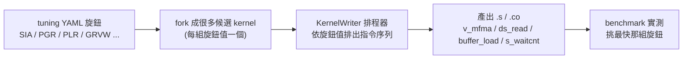

# 指令排程與 latency-hiding：TensileLite 怎麼決定「用哪條指令、排在哪、何時等」

> 路徑說明：本檔在 `study_docs/hipblaslt/`，code 連結為相對路徑（`../../projects/...`，先回到 repo root 再進 `projects/`）。**行號會隨 commit 漂移，對不上時以符號名稱（函式/類別名）為準。**
>
> 前置閱讀：先看 [kernelwriter-implementation.md](kernelwriter-implementation.md)（導演/執筆者分工、`kernelBody()` 骨架、§4 兩層排程器的**概觀**）與 [../isa/mfma-deep-dive.md](../isa/mfma-deep-dive.md)（§6 MFMA latency）。本篇是這兩處的**合流深入版**——把「選指令」「排指令」「插等待」三件事一次講穿，並用一個具體例子把 tuning 旋鈕串到最終產出的 ISA 指令。

## 0. 一句話總結（先看這句）

> TensileLite 在 **codegen（build 階段 1）** 就把 kernel 的每一條 ISA 指令**選好、排好、算好要等多久**。你在 tuning YAML 裡調的 `ScheduleIterAlg`／`PrefetchGlobalRead`／`PrefetchLocalRead`／`GlobalReadVectorWidth` 等旋鈕，本質上是**餵給排程器的參數**；不同的旋鈕值讓同一套排程器排出不同的指令序列，再由 benchmark 挑出最快的那組。

## 1. 白話總覽：三種「決定」＋一個關鍵澄清

要讀懂這件事，先把「決定」拆成三種，它們**發生在不同函式、可獨立理解**：

- **(A) 決定用哪條指令（instruction selection）**：這一筆 global load 要發 `buffer_load_dwordx4` 還是 `dwordx2`？這一筆 LDS 讀要 `ds_read_b128` 還是 `ds_read2_b64`？這一輪 MFMA 要 `v_mfma_f32_16x16x16_f16` 還是別的變體？→ 見 Part A。
- **(B) 決定指令排在哪（scheduling）**：把 global load、LDS write、LDS read、MFMA 這幾種動作**交錯**排在一起，好讓記憶體搬運跟計算重疊。這由**兩層排程器**負責，`ScheduleIterAlg`（SIA）是它的主開關 → 見 Part B。
- **(C) 決定何時等（latency-hiding / waitcnt）**：GPU 發出 load 後不會馬上有資料、MFMA 發出後要好幾個 cycle 才算完。要在「用到結果之前」插入 `s_waitcnt`／`s_nop` 等待指令，同時用「別的有用工作」填滿等待空檔把延遲藏掉 → 見 Part C。

### 關鍵澄清：這些都在 codegen 決定，不是 runtime

很多人以為「tuning 時 TensileLite 一邊試一邊決定指令排法」——**不是**。正確的因果鏈是：



也就是說：**排程與選指令發生在 build 階段 1（`BenchmarkProblems` 內的 `writeBenchmarkFiles` → `KernelWriter`），runtime 只是查表載入已經排好的 `.co`。** tuning 的角色是「把不同旋鈕值展開成候選、實測、挑贏家」，不是即時改排法。三階段全貌見 [tensilelite-pipeline.md](tensilelite-pipeline.md)。

> 名詞（首次出現先解釋）：
>
> - **SIA = ScheduleIterAlg**：指令排程演算法的選擇（0/1/2/3/4），決定第二層排程器怎麼交錯指令。
> - **PGR = PrefetchGlobalRead**：提前幾輪把下一批資料從 HBM 載入，藏 global load 延遲。
> - **PLR = PrefetchLocalRead**：提前把 LDS 資料讀進 VGPR，藏 `ds_read` 延遲。
> - **GRVW = GlobalReadVectorWidth**：一次 global load 讀幾個連續元素（向量化寬度）。
> - **bpl = bytes per load**：一筆 load 要搬幾個 byte，決定選哪條 `buffer_load_*`。
> - **vmcnt / lgkmcnt**：AMD GPU 的兩個「未完成記憶體動作」計數器；`s_waitcnt` 就是等它們降到某個值。

## 2. Part A｜怎麼決定用哪些指令（兩階段選擇）

指令選擇是**兩階段**設計，先認清這點其餘都好懂：

1. **init 階段（每支 kernel 算一次）**：依「寬度 + 對齊」挑一條最適合的指令，存進張量參數 dict（`tP`）快取起來。
2. **codegen 階段（每次要發 load/store 時）**：拿出快取的指令物件，換算出真正的 opcode 與寬度發出去。

### 2.1 init 階段：一張指令表 + 「挑最寬能塞下的」

- **指令表**：在 [`_initKernel()`](../../projects/hipblaslt/tensilelite/Tensile/KernelWriter.py#L6689) 裡建立 `self.memoryInstructions`（[約 L7473](../../projects/hipblaslt/tensilelite/Tensile/KernelWriter.py#L7473)），把所有候選指令依 `GlobalRead`/`GlobalWrite`/`LocalRead`/`TrLocalRead`/`LocalWrite` 分池，**每池由寬到窄排序**。`GlobalRead` 池裝的是 **buffer 還是 flat** 指令，由 [`kernel["BufferLoad"]`](../../projects/hipblaslt/tensilelite/Tensile/KernelWriter.py#L7452) 在這裡決定。
- **挑選器**：[`findMemoryInstructionForWidthStride()`](../../projects/hipblaslt/tensilelite/Tensile/KernelWriterAssembly.py#L378) 從池子頭（最寬）往下找第一條「塞得下且對齊合法」的指令——條件是 `要載的寬度 >= blockWidth`、`寬度 是 blockWidth 的整數倍`、（要合併時）所有 stride 都能被 `offsetMultiplier` 整除。外層包裝 [`selectMemoryInstruction()`](../../projects/hipblaslt/tensilelite/Tensile/KernelWriterAssembly.py#L413) 決定「能不能用合併形式」（`ds_read2`/`ds_write2` 這種雙 offset 指令）。
- **結果快取進 `tP`**：三個 init 函式各自把選中的指令存進張量參數：
  - [`initGlobalReadMemoryInstruction()`](../../projects/hipblaslt/tensilelite/Tensile/KernelWriterAssembly.py#L442) → `tP["globalReadInstruction"]`（寬度 = `nrcv*bpeGR/bpr`）。
  - [`initLocalWriteMemoryInstruction()`](../../projects/hipblaslt/tensilelite/Tensile/KernelWriterAssembly.py#L453) → `tP["localWriteInstruction"]`。
  - [`initLocalReadMemoryInstruction()`](../../projects/hipblaslt/tensilelite/Tensile/KernelWriterAssembly.py#L491) → `tP["localReadInstruction"]`。LDS-transpose（`enableLDSTr`）情境改用 `TrLocalRead` 池、由 [`selectTransposedDSReadInstuctionIdx()`](../../projects/hipblaslt/tensilelite/Tensile/KernelWriterAssembly.py#L438) 依 `bpe` + 回傳暫存器數精確比對。

> `MemoryInstruction` 這個資料結構本身（`blockWidth`/`numBlocks`/`getInst()`）定義在 [AsmMemoryInstruction.py](../../projects/hipblaslt/tensilelite/Tensile/AsmMemoryInstruction.py#L37)。`getInst(highBits)` 會在需要「高 16-bit pack」時換成 `_d16_hi` 變體。

### 2.2 旗標如何改「選哪條」

| 旋鈕 / 旗標 | 對指令選擇的影響 |
|---|---|
| `BufferLoad` | 決定 `GlobalRead` 池裝 buffer（`buffer_load_*`）還是 flat（`flat_load_*`）指令 |
| `GlobalReadVectorWidth` | 經 `tP["glvw"]` 影響 `bpl`（bytes per load），決定選多寬的 load |
| `LocalReadVectorWidth` | 影響 local read 寬度，決定 `ds_read_b*` 的寬度與要不要 pack |
| `DirectToLds` | codegen 時把 buffer load 加上 `lds=True`（直接寫進 LDS，跳過 VGPR），dst VGPR 設 0 |
| `DirectToVgpr` | **不改 opcode**，只改 dst register layout 與發射順序（`reorderGRInstForDTV`） |
| `enableGLTr` | 走 transpose load 指令（`GlobalLoadTR8B64`/`TR16B128`），且強制非 buffer |
| `enableTDMA/B`（TDM） | 完全繞過上面：委派給 [Components/TensorDataMover.py](../../projects/hipblaslt/tensilelite/Tensile/Components/TensorDataMover.py#L218) 發單一 `TensorLoadToLds` 描述子指令 |

### 2.3 codegen 階段：把快取的指令變成真正的 opcode

- **global load**：[`globalReadDo()`](../../projects/hipblaslt/tensilelite/Tensile/KernelWriterAssembly.py#L11091)（非 TDM 路徑走內部 `globalReadBody`）算出 `bpl = bpe * glvw`，再交給 [`chooseGlobalRead()`](../../projects/hipblaslt/tensilelite/Tensile/KernelWriterAssembly.py#L16123) 依 `bpl` 派 opcode：`4→buffer_load_b32`、`8→b64`、`12→b96`、`16→b128`、`24/32/64→用多條 b128/b64 拼`。`lds`/`hi16` 旗標再選 `_lds`/`_d16_hi` 變體。
- **LDS write**：[`localWriteDo()`](../../projects/hipblaslt/tensilelite/Tensile/KernelWriterAssembly.py#L12082) 取出 `tP["localWriteInstruction"].getInst()`，`numBlocks==1` 發單一 `ds_write`，`==2` 發 `ds_write2`（雙 offset）。
- **LDS read**：[`localReadDo()`](../../projects/hipblaslt/tensilelite/Tensile/KernelWriterAssembly.py#L13034) 委派給 [Components/LocalRead.py](../../projects/hipblaslt/tensilelite/Tensile/Components/LocalRead.py#L45) 的 `LocalReadVALU`/`LocalReadMFMA`，同樣依 `numOffsets` 選 `ds_read` vs `ds_read2`，最後由 [`_emitLdsRead()`](../../projects/hipblaslt/tensilelite/Tensile/Component.py#L226) 發出指令。
- **MFMA 變體**：[`mfmaIter()`](../../projects/hipblaslt/tensilelite/Tensile/KernelWriterAssembly.py#L8596) 內的 `dataTypeToMfmaInstTypePair()` 依 A/B 資料型別（f16/bf16/f8/xf32…）＋ `SourceSwap` 選出正確的 `v_mfma_*` 變體。**哪些變體、各自 cycle 多少、為什麼挑深 K**——完整表格見 [../isa/mfma-deep-dive.md §2](../isa/mfma-deep-dive.md#2-dense-mfma-變體表cdna3--gfx942)（本篇不重寫）。

## 3. Part B｜怎麼排指令（兩層排程器 + SIA）

這是最精華的部分：怎麼把 load / LDS write / LDS read / MFMA **交錯**排在一起。TensileLite 用**兩層排程**（概觀見 [kernelwriter-implementation.md §4](kernelwriter-implementation.md#4-主迴圈與指令排程base-層)，本節深入）。

### 3.1 第一層：`makeSchedule` — 把 GR/LW 分配到哪個迭代

[`makeSchedule()`](../../projects/hipblaslt/tensilelite/Tensile/KernelWriter.py#L653) 本身很薄：它建立 `perIterGlobalRead[]` 與 `perIterLocalWrite[]` 兩個「每迭代的桶子」，然後把**實際分配邏輯整包丟給 SIA 元件**：

```python
siaComponent = Component.SIA.find(self)     # 依 _ScheduleIterAlg 選 SIA0/1/2/3
siaComponent.schedIntoIteration(...)         # 填 perIterGlobalRead[] / perIterLocalWrite[]
```

它只決定「哪一輪 global read / local write 放進第幾個 unroll 迭代」，不決定跟 MFMA 的細部先後。

### 3.2 第二層：`_makeSubIterSchedule` — 在單一迭代內交錯

[`_makeSubIterSchedule()`](../../projects/hipblaslt/tensilelite/Tensile/KernelWriter.py#L873) 取出第一層分配到「這個迭代」的 GR/LW，再把 local read、pack、wait、MFMA 依相依性交錯，產出這個迭代最終的指令流。它一開頭就依 `scheduleIterAlg` 分流：

```
if scheduleIterAlg == 0:   ... (L892)
elif scheduleIterAlg == 1: ... (L959)
elif scheduleIterAlg == 2: ... (L1005)
elif scheduleIterAlg == 3: ... (L1132)
else: assert 0
```

### 3.3 SIA=0/1/2/3 各做什麼（白話）

- **SIA=0（最陽春）**：固定順序把整塊模組串接（global read → wait → barrier → local read → local write → wait → pack → MFMA），**完全不與個別 MFMA 交錯**。第一層對應 `noSchedGlobalRead`/`noSchedLocalWrite`（不排程）。
- **SIA=1（粗排 / legacy）**：把 local read **對半切**，前半 → 包住一整塊 global read → 後半 → local write 丟到最後 → MAC 一整塊尾接。它只在 global read 這塊附近粗略切開 local read，**不做逐-MFMA 交錯**。原始碼註解自稱是暫時方案（`TODO: remove this half logic after stinkytofu works`）。
- **SIA=2（compute/fetch 分離）**：只用一個迭代，靠 `s_setprio`（`SSetPrior`）**拉高 MFMA 的執行優先權**，把「計算」跟「取資料」分開，讓兩個 workgroup 交錯（WG0 算的時候 WG1 取，反之亦然）。GR 擺頂、LW 擺底，交錯的工夫花在 **pack 排程 + 優先權提示**，不是把 GR/LW 塞進 MFMA 之間。需要 `ExpandPointerSwap`（EPS=1），否則 VALU 指令會破壞交錯。
- **SIA=3（逐-MFMA 全交錯，生產路徑）**：最精密。它 [逐一走過每條 MFMA](../../projects/hipblaslt/tensilelite/Tensile/KernelWriter.py#L1643)（`for i in range(numMfmaPerIter)`），在每個 MFMA 位置依序穿插：
  1. **這一輪的 local read**（受 MFMA latency 預算 `miLatencyLeft` 與 LDS 讀取 FIFO 模型節流）；
  2. **global read**，每條 MFMA 塞 `numGlobalReadInsPerMfma` 筆（範圍 `grStart..grEndMfmaIndex`）；
  3. **local write**，每條 MFMA 塞 `numLocalWriteModPerMfma` 筆（範圍 `lwStartMfmaIndex..lwEndMfmaIndex`）；
  4. LDS 指標交換、barrier、**下一輪的 local read（PLR 預取）**、waitcnt、pack、補 MFMA 相依的 `s_nop`，最後才是 **MFMA 本身**。

一句話對比：**SIA=1 是「切兩半」、SIA=2 是「用優先權分離＋pack 交錯」、SIA=3 是「把 GR/LW/LR 一筆筆插到 MFMA 之間」。** DirectToVgpr、PGR≥3、CustomSchedule 都要求 SIA=3。

### 3.4 SIA 元件與選擇機制

四個具體元件都在 [Components/SIA.py](../../projects/hipblaslt/tensilelite/Tensile/Components/SIA.py)：`SIA3`（[L37](../../projects/hipblaslt/tensilelite/Tensile/Components/SIA.py#L37)）/ `SIA2`（L95）/ `SIA1`（L123）/ `SIA0`（L151），各自帶 `kernel = {"_ScheduleIterAlg": n}` 標籤。[`Component.SIA.find()`](../../projects/hipblaslt/tensilelite/Tensile/Component.py#L168) 用 `matches()` 把這個標籤跟 `writer.states.kernel["_ScheduleIterAlg"]` 比對，選出唯一符合的元件。SIA1 與 SIA2 在第一層分配上其實**相同**（都用 Default helpers），差別純粹在第二層。

### 3.5 另一條路：CustomSchedule（CMS，表格驅動）

[Components/CustomSchedule.py](../../projects/hipblaslt/tensilelite/Tensile/Components/CustomSchedule.py) 是第二層的**替代方案**：不是逐指令即時交錯，而是照一張手調好的 `ScheduleInfo`（[L221](../../projects/hipblaslt/tensilelite/Tensile/Components/CustomSchedule.py#L221)）把每個程式碼片段擺到指定位置。由 [`hasCustomSchedule()`](../../projects/hipblaslt/tensilelite/Tensile/Components/CustomSchedule.py#L518) 把關（需 `UseCustomMainLoopSchedule` + MFMA + gfx950 + SIA=3），在 [`kernelBody`](../../projects/hipblaslt/tensilelite/Tensile/KernelWriter.py#L4795) 與 `_makeSubIterSchedule` **互斥**。

### 3.6 排程被哪些旋鈕 gate、PGR/PLR 怎麼餵進來

- **`ScheduleGlobalRead` / `ScheduleLocalWrite` 被 gate**：在 [flag→state 區塊](../../projects/hipblaslt/tensilelite/Tensile/KernelWriter.py#L6868)，這兩個只有在 `PrefetchGlobalRead` 且 `BufferLoad` 為真時才生效（flat load 會更新 lgkmcnt，難以排程）。PGR=0 時排程直接被關掉。
- **PLR → `numItersPLR`**：[約 L6943](../../projects/hipblaslt/tensilelite/Tensile/KernelWriter.py#L6943) 算出「local read 提前幾個迭代」。它接著決定 `localWriteEndIter = LoopIters - numItersPLR - 1`（[L4212](../../projects/hipblaslt/tensilelite/Tensile/KernelWriter.py#L4212)，local write 可以攤在幾個迭代上）與 `isBarrier = LoopIters - numItersPLR`（分隔「本輪讀」與「下一輪預取讀」的界線）。
- **PGR → GR/LW 分佈與配對**：PGR≥2 時，global read 會被扣住、跟對應的 local write **配對**插入（先 load 後 write）；PGR=1 時 GR 直接排入。SIA3 專用的 `numGlobalReadInsPerMfma`/`numLocalWriteModPerMfma`（每 MFMA 塞幾筆）由 SIA.py 的 `getScheduleParamMfma`/`calculateGRPMandLWPM` 算出。
- **`ScheduleIterAlg=4`（特例）**：在 [SolutionStructs/Solution.py](../../projects/hipblaslt/tensilelite/Tensile/SolutionStructs/Solution.py#L627) 被 remap 成內部 `_ScheduleIterAlg=0` + `_StinkyTofuOptLevel=3`——意思是「classic 排程走最陽春的 SIA0，之後整包丟給 StinkyTofu 重排」（見 Part C）。

## 4. Part C｜藏 latency 的 strategy（prefetch + waitcnt）

### 4.1 為什麼需要等？

兩個延遲來源：**(1) MFMA 多 cycle**——一條 `v_mfma_*` 要 8~64 個 pass 才算完，發完不能馬上讀它的累加器（見 [../isa/mfma-deep-dive.md §6](../isa/mfma-deep-dive.md#6-latency--throughput為何-mfma-後要等怎麼把延遲藏掉)）。**(2) 記憶體延遲**——`buffer_load` / `ds_read` 發出後要好幾百 / 幾十 cycle 資料才回來。

TensileLite 用 rocisa 的 `SWaitCnt` 表達等待，它有四個**邏輯** counter：`vlcnt`（VMEM load）、`vscnt`（VMEM store）、`dscnt`（LDS）、`kmcnt`（scalar/常數讀）。在 **gfx942** 上這四個會合成硬體真正的兩個 counter（[rocisa common.hpp](../../projects/hipblaslt/tensilelite/rocisa/rocisa/include/instruction/common.hpp#L2553)）：

```
gfx942:  vmcnt   = vlcnt + vscnt      (load 與 store 共用一個 vmcnt)
         lgkmcnt = dscnt + kmcnt
```

所以文件裡看到的 `vlcnt` 就是最後的 `vmcnt`、`dscnt` 就是 `lgkmcnt`。

### 4.2 藏延遲的手法清單（都在 codegen 端）

- **PGR / PLR prefetch**：提前把資料從 HBM / LDS 搬進來，等它回來的空檔拿去算前一批。
- **首批預取**：[`setupNewTile()`](../../projects/hipblaslt/tensilelite/Tensile/KernelWriter.py#L2621) 發新 tile 的第 0 輪 global read。
- **shadow init / initC**：在等首批 global read 回來的空檔，順便把 C accumulator 清零、算好 store 位址（用計算填記憶體延遲）。
- **`_interleavePackAB()`**：把 A/B 的型別轉換（pack）碼交錯，避免集中 stall。
- **SIA2 的 `s_setprio`**：用優先權讓兩個 workgroup 的 compute/fetch 重疊。
- **SIA3 的逐-MFMA 交錯**：把 load/read/write 一筆筆插進 MFMA 之間，讓記憶體動作在 MFMA 算的時候「背景進行」。

### 4.3 waitcnt 怎麼算——count-based，不是 dependency scoreboard

**這是最關鍵、也最容易誤解的一點**：TensileLite 的 classic 路徑**不做逐暫存器的相依追蹤**，而是**用「數數」算 counter 值**。

- 核心函式 [`wait()`](../../projects/hipblaslt/tensilelite/Tensile/KernelWriterModules.py#L63)（由 [`KernelWriter._wait()`](../../projects/hipblaslt/tensilelite/Tensile/KernelWriter.py#L10334) 派發）。它的三個 `skip*` 參數是 API：`-1` = 這個 counter 不參與，`n` = 「等到只剩 n 個迭代前的 load/read 還沒完成」。
- counter 值 = `skip × 每迭代的 load/read 數`，而「每迭代幾筆」直接來自 tiling 參數：global 用 `NumLoadsPerpendicular*`/`NumLoadsCoalesced*`，local read 用 `numReadsPerIter*`。**沒有 scoreboard 追蹤每筆 load 寫到哪個 VGPR**，只是「我知道每輪發幾筆記憶體動作，要露出 n 輪前的資料就讓 counter 降到 n × 每輪筆數」。
- **事後重算**：`_makeSubIterSchedule` 排完後，會依 prefetch/PLR 的實際情況[重算 `waitCode.dscnt`](../../projects/hipblaslt/tensilelite/Tensile/KernelWriter.py#L2433)（哪些 read 是屬於未來迭代的預取、可以不等；SIA3 交錯到 waitcnt 之後的 local read 要扣回來；還沒寫完的 local write 要加上）。
- **local write 前的遞減 vmcnt**：[Components/SIA.py 的 `getReadsToWait`](../../projects/hipblaslt/tensilelite/Tensile/Components/SIA.py#L982) + `schedLocalWrite` 在每個 `ds_write` 前插一個**遞減的** `s_waitcnt vmcnt(readsToWait)`，讓每筆 local write 只等「餵給它的那一筆 global load」，而不是等全部 load 都回來（`vmcnt(0)`）。這正是「interleave」策略。
- **唯二的相依例外**：只有 `numItersPLR==0`（`OptimizeNumItersPLR0`）時，會掃描指令用 `hasAnyDependency(...)` 判斷；其餘穩態迴圈全是純數數。

### 4.4 StinkyTofu：另一條完全獨立的路（gfx1250-only）

較新架構（gfx1250+）走 `ScheduleIterAlg=4`：classic 排程被強制成最陽春的 SIA0，整包組語交給 **StinkyTofu**（pass-based IR 最佳化器）在自己的 IR 裡**重排指令 + 用 def-use 相依追蹤插 waitcnt**。這是**獨立後端**，不是「classic 先亂插、StinkyTofu 再修」。

- gate：`_StinkyTofuOptLevel`（[Solution.py](../../projects/hipblaslt/tensilelite/Tensile/SolutionStructs/Solution.py#L627)），還要 `rocisa.isSupportedByStinkyTofu(ISA)`。
- 交接：[KernelWriter.py 約 L6558](../../projects/hipblaslt/tensilelite/Tensile/KernelWriter.py#L6558)——支援才呼叫 StinkyTofu、回傳 `st_asm`；否則回傳 classic 的 `str(moduleKernelBody)`。
- **gfx942 上 `isSupportedByStinkyTofu` 為 false**，所以完全不走 StinkyTofu，classic 路徑（Part C 前三節）算出的 waitcnt 就是最終值。白話總覽見 [../stinkytofu/README.md](../stinkytofu/README.md)。

## 5. 貫穿範例：一個 SIA=3 迭代長什麼樣、哪個旋鈕動了哪一格

把前面三個 Part 合起來。下面是一個 SIA=3 主迴圈迭代**簡化後**的 pseudo-asm（省略位址計算、實際暫存器編號），重點是看**每一格是由哪個旋鈕/機制決定的**：

```asm
; ── 一個 unroll 迭代內的一條 MFMA slot（SIA=3，PGR=2、PLR=1）──

  ds_read_b128   v[LR..], [ldsA + off]     ; (B) 本輪 local read；寬度←LocalReadVectorWidth
                                           ;     位置←SIA3 逐-MFMA 交錯、受 miLatencyLeft 節流

  buffer_load_dwordx4 v[G2L..], off, srd   ; (A)(B) 下一輪 global read；opcode←bpl(=bpe*GRVW)
                                           ;     每 MFMA 塞 numGlobalReadInsPerMfma 筆←PGR/SIA3

  s_waitcnt vmcnt(k)                        ; (C) 遞減 vmcnt：只等「餵給下面這筆 ds_write」的 load
  ds_write_b128  [ldsA + off], v[G2L..]     ; (A)(B) local write；與上面的 load 配對（PGR>=2）
                                           ;     位置在 lwStart..lwEnd←ScheduleLocalWrite

  ds_read_b128   v[LRnext..], [ldsA + off]  ; (B) 下一輪的 PLR 預取讀；只在 iter>=isBarrier 出現
                                           ;     isBarrier = LoopIters - numItersPLR ←PLR

  s_waitcnt lgkmcnt(x)                       ; (C) 等 LDS：x=count-based 值，_makeSubIterSchedule
                                           ;     依 prefetch/PLR 重算 waitCode.dscnt
  s_nop 1                                    ; (C) 補 MFMA 寫回相依（miDependency 不足時才插）
  v_mfma_f32_16x16x16_f16 acc, v[..], v[..]  ; (A) MFMA 變體←資料型別+SourceSwap
```

逐格對照「動哪個旋鈕會變」：

- 把 `GlobalReadVectorWidth` 從 4 調到 2 → `buffer_load_dwordx4` 變 `dwordx2`（Part A，`bpl` 變小）。
- 把 `PrefetchGlobalRead` 2→1 → global read 不再跟 local write 配對、`vmcnt` 遞減策略改變（Part B/C）。
- 把 `PrefetchLocalRead` 1→0 → 那條「下一輪 PLR 預取讀」消失、`isBarrier` 位移、`lgkmcnt` 值跟著重算（Part B/C）。
- 把 `ScheduleIterAlg` 3→1 → 整個「逐-MFMA 穿插」塌成「local read 對半 + MAC 一整塊尾接」（Part B）。
- 把 `ScheduleLocalWrite` 關掉（或 PGR=0）→ local write 不再攤進 MFMA 之間，改集中發射（Part B `noSchedLocalWrite`）。

> 這就是「tuning 旋鈕 → 排程器行為 → 產出 ISA 指令」因果鏈的具體樣貌：**你在 YAML 動一個數字，改的是上面某幾格的存在與否、位置、或寬度。**

## 6. 「想改 X 行為，開哪個」對照表

（延續 [kernelwriter-implementation.md §7](kernelwriter-implementation.md#7-抽象介面對應清單) 的風格）

- 改**指令選擇邏輯**（哪條 load/read/write）→ `KernelWriterAssembly.py` 的 `selectMemoryInstruction` / `findMemoryInstructionForWidthStride` / `chooseGlobalRead`，指令表在 `_initKernel` 的 `self.memoryInstructions`。
- 改 **MFMA 變體選擇** → `KernelWriterAssembly.py` 的 `mfmaIter` / `dataTypeToMfmaInstTypePair`（語意見 [mfma-deep-dive.md](../isa/mfma-deep-dive.md)）。
- 改**第一層分配**（GR/LW 進哪個迭代）→ `KernelWriter.py::makeSchedule` + `Components/SIA.py`（`schedGlobalRead`/`schedLocalWrite`）。
- 改**第二層交錯**（迭代內順序、SIA 行為）→ `KernelWriter.py::_makeSubIterSchedule` 對應的 `scheduleIterAlg` 分支。
- 改**表格式排程**（CMS）→ `Components/CustomSchedule.py`（`ScheduleInfo` / `customMainLoopSchedule` / `hasCustomSchedule`）。
- 改 **waitcnt 計算** → `KernelWriterModules.py::wait`、`KernelWriter.py::_makeSubIterSchedule` 的 dscnt 重算段、`Components/SIA.py::getReadsToWait`。
- 改 **gfx1250+ 的重排/補等待** → StinkyTofu（見 [../stinkytofu/key-passes.md](../stinkytofu/key-passes.md)）。

## 7. 交叉連結 + 一句話總結

- 上一層概觀（兩層排程器的入門）：[kernelwriter-implementation.md §4](kernelwriter-implementation.md#4-主迴圈與指令排程base-層)
- MFMA latency / 變體 / 為什麼挑深 K：[../isa/mfma-deep-dive.md §6/§2](../isa/mfma-deep-dive.md#6-latency--throughput為何-mfma-後要等怎麼把延遲藏掉)
- `s_waitcnt` counter 模型與 gfx942 opcode 速查：[../isa/gfx942-isa-reference.md](../isa/gfx942-isa-reference.md)
- LDS bank conflict（影響 `ds_read` 延遲）：[../isa/lds-bank-conflicts.md](../isa/lds-bank-conflicts.md)
- 組語產生**之後**的最佳化層（gfx1250+）：[../stinkytofu/README.md](../stinkytofu/README.md)
- SIA/PGR/PLR 作為 tuning 旋鈕的速查：[tuning-config-reference.md](tuning-config-reference.md)
- `Components/` 檔案級職責地圖：[components-codegen-map.md](components-codegen-map.md)

> **一句話總結**：指令**選擇**是「init 挑最寬能塞下的、codegen 依 `bpl` 發 opcode」；指令**排程**是「第一層 `makeSchedule` 分配到迭代、第二層 `_makeSubIterSchedule` 依 SIA 交錯」；**藏 latency** 是「prefetch 填空檔 + count-based 的 `s_waitcnt`」。三者全在 codegen 決定，tuning 旋鈕只是餵進去的參數——`ScheduleIterAlg` 選交錯法、`PGR/PLR` 選預取深度、`GRVW` 選 load 寬度。gfx942 走 classic 路徑；gfx1250+ 才把重排/補等待交給 StinkyTofu。
