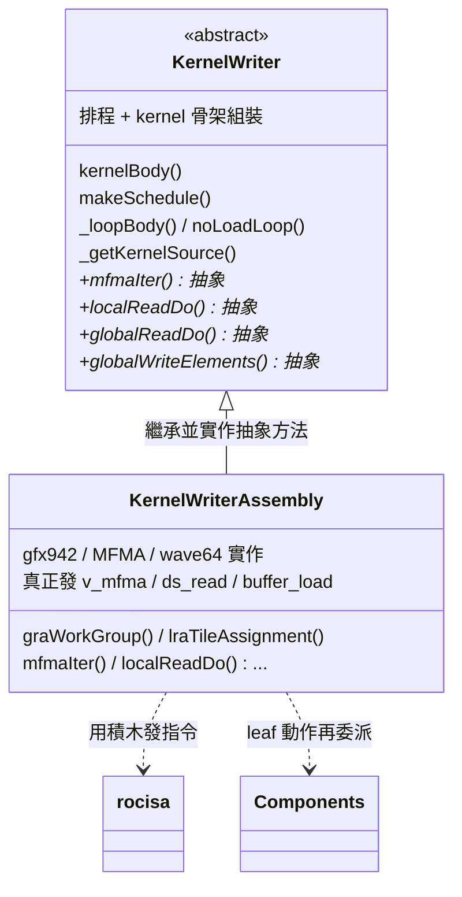
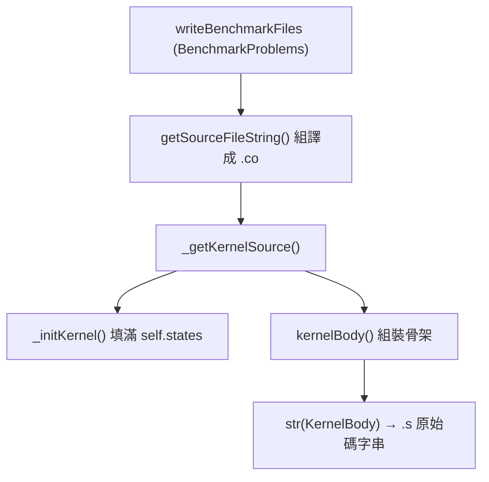
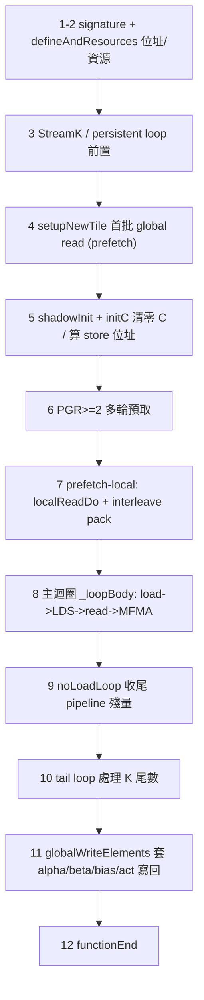

# KernelWriter 實作導讀：kernel 組語是怎麼一條一條被寫出來的

> 路徑說明：本檔在 `study_docs/hipblaslt/`，code 連結為相對路徑（`../../projects/...`，先回到 repo root 再進 `projects/`）。**行號會隨 commit 漂移，對不上時以符號名稱（函式/類別名）為準。**
>
> 建議先讀 [tensilelite-pipeline.md](tensilelite-pipeline.md)（三階段全貌），本篇是它「kernel 組合語言怎麼吐出來」那一小節的**深入版**。想找「改某個行為要動哪個檔」的地圖，搭配 [components-codegen-map.md](components-codegen-map.md)。

## 白話總覽：兩個人分工寫組語

TensileLite 要把一個 GEMM solution（一組 tuning 參數）變成一支可執行的 GPU assembly kernel。這件事由兩個檔案「分工」完成，用一個比喻最好懂：

- **導演（排程表）＝ [`KernelWriter.py`](../../projects/hipblaslt/tensilelite/Tensile/KernelWriter.py)**：它是**抽象基底類別**（`class KernelWriter`，`abc.ABCMeta`）。它決定「這支 kernel 的骨架長怎樣、每個 step 先做什麼後做什麼、load / MFMA / store 怎麼交錯排程」，但它**自己不真的寫出任何一條硬體指令**——需要發指令的地方，它呼叫一堆「抽象方法」（例如 `mfmaIter`、`localReadDo`、`globalReadDo`），把細節丟給子類別。
- **執筆者（下筆寫組語）＝ [`KernelWriterAssembly.py`](../../projects/hipblaslt/tensilelite/Tensile/KernelWriterAssembly.py)**：它是 `class KernelWriterAssembly(KernelWriter)`，**繼承**導演並**實作**那些抽象方法。它才是真正產生 `v_mfma_*`、`ds_read/ds_write`、`buffer_load/buffer_store` 等一條條 AMDGPU 指令的地方（透過 rocisa）。

> 名詞：
>
> - **rocisa** = 一個 C++ 工具庫（Nanobind 綁定），提供「一個 Python 物件 = 一條 AMDGPU 指令」的積木（例如 `VMovB32`、`SWaitCnt`、`SBarrier`）。KernelWriterAssembly 就是用這些積木拼出整支 kernel。想深入 rocisa 本身（目錄結構、核心概念、怎麼新增一條指令、與 StinkyTofu 的介面），見專篇 [rocisa.md](rocisa.md)。
> - **抽象方法（abstract method）** = 基底類別只宣告「有這個動作」，但把「怎麼做」留給子類別填。這讓同一套排程骨架能換不同硬體後端（見下節）。

一句話：**`KernelWriter.py` 排好順序，`KernelWriterAssembly.py` 逐條發指令。**

## 為什麼要拆兩層？

把「排程骨架」和「指令發射」分開，好處是**同一套主迴圈/prefetch 邏輯可以支援不同硬體後端**。基底類別只認得抽象動作（「這裡要做一次 local read」），至於在 gfx942 上要發什麼指令、用幾個 VGPR、LDS 位址怎麼算，全部由 `KernelWriterAssembly`（MFMA / wave64 那套）負責。未來若要支援別的架構，理論上只要換一個實作子類別，不必動主迴圈。

注意最後一條線：`KernelWriterAssembly` 本身也不是最底層。像 `localReadDo` / `globalReadDo` 這種「葉節點動作」，它會再委派給 `Components/` 下的元件（見[抽象介面對應清單](#7-抽象介面對應清單)一節與 [components-codegen-map.md](components-codegen-map.md)）。

## 檔案有多大、怎麼讀

| 檔案 | 行數（約） | 角色 |
|------|-----------|------|
| [`KernelWriter.py`](../../projects/hipblaslt/tensilelite/Tensile/KernelWriter.py) | ~10,900 | 抽象基底：排程 + kernel 骨架組裝 |
| [`KernelWriterAssembly.py`](../../projects/hipblaslt/tensilelite/Tensile/KernelWriterAssembly.py) | ~19,600 | gfx942/MFMA 實作：逐條發指令 |

合計約 3 萬行。**不要想從頭讀到尾。** 正確讀法是：先抓住 `kernelBody()` 這條主軸（骨架），需要細節時再照著[對應清單](#7-抽象介面對應清單)跳到 `KernelWriterAssembly.py` 對應的方法。本篇就是照這個順序帶你走一遍。

## 1. 貫穿全域的資料結構 / 共享狀態

在看流程前，先認識幾個「到處被傳來傳去」的物件，否則讀任何一個方法都會一直卡在「這個 `self.states.xxx` 是什麼」。它們都定義在 [`KernelWriter.py`](../../projects/hipblaslt/tensilelite/Tensile/KernelWriter.py) 前段：

| 物件 | 定義（約行） | 白話 |
|------|------|------|
| `StateValues` (`self.states`) | L151 | **最重要的大狀態包**。裝了 kernel 設定、硬體能力（`asmCaps`/`archCaps`/`regCaps`）、每種資料型別的 byte 數（`bpeA`/`bpeB`…）、排程結果（`scheduleIterAlg`、各種 `*MfmaIndex`）、迴圈資訊、VGPR/SGPR 配置數量等。幾乎每個方法都在讀寫它。 |
| `StateVgprs` (`self.vgprs`) | L418 | 記錄「哪個用途對應哪個 VGPR 起始編號」（如座標 `coord0/1`、store 位址 `addrC/addrD`、每次 global read 用到的 register list）。 |
| `ConstValues` (`self.consts`) | L79 | 編譯期常數（LDS init 值、`ldsOOB` 越界標記值等）。 |
| `MatrixInfo` / `ABMatrixInfo` | L87 / L100 | 每個 tensor（A/B/C/D/E/bias/metadata）的 VGPR 佈局資訊：`numVgprValu`、`numVgprG2L`（global→LDS 暫存）、`startVgprLocalReadAddr` 等。`self.states.a`、`self.states.b`、`self.states.c` … 就是這些。 |
| `StreamKSettings` | L138 | StreamK 變體的功能旗標快照，`_initKernel` 時填一次，之後 frozen 不可改。 |
| `CodeModules` (`self.codes`) | L449 | **排程的產物容器**。`makeSchedule()` 把 global read / local write / MFMA 的程式碼片段（rocisa `Module`）算好，分門別類塞進這裡（`unrollLoopHeader`、`perIterGlobalRead[]`、`perIterLocalWrite[]`…），主迴圈再照這個計畫組裝。 |

還有一個關鍵、但不是 class 而是 dict 的東西：

- **`tensorParametersA` / `tensorParametersB`（常簡稱 `tP`）**：一個大 dict，描述某個輸入 tensor（A 或 B）的所有屬性——`tensorChar`（`"A"`/`"B"`）、是否 sparse、bpe、local read/write 指令種類、offset 狀態等。**幾乎每個方法的第一個或第二個參數都是它。** sparse 情境下還會從 `tP["tpsMetadata"]` 取出 metadata 的 `tPM`。

> 讀原始碼時看到 `tP["tensorChar"]` 就是在問「我現在在處理 A 還是 B」。

## 2. 頂層輸出流程：從 solution 到一份 source string

外部（`BenchmarkProblems.writeBenchmarkFiles` → `KernelFileContextManager`）拿到一個 solution 後，最終呼叫的入口是：

- [`getSourceFileString()`](../../projects/hipblaslt/tensilelite/Tensile/KernelWriterAssembly.py#L176)（抽象方法，實作在 assembly 子類）：對 Assembly kernel，它負責產生 `.s` 原始碼、組譯成 `.o`、產出 code object，並回傳可放進 `Kernels.cpp` 的字串。它內部呼叫 →
- [`_getKernelSource()`](../../projects/hipblaslt/tensilelite/Tensile/KernelWriter.py#L10602)：先 `_initKernel()` 初始化所有狀態，再依 `UseSubtileImpl` 決定呼叫 [`kernelBody()`](../../projects/hipblaslt/tensilelite/Tensile/KernelWriter.py#L5279) 或 [`kernelBodySubtile()`](../../projects/hipblaslt/tensilelite/Tensile/KernelWriter.py#L4895)，把回傳的 `KernelBody` 轉成字串。

初始化的兩個關鍵函式：

- [`__init__()`](../../projects/hipblaslt/tensilelite/Tensile/KernelWriter.py#L491)：建立 `self.do`（各動作的開關，如 `do["GlobalReadA"]`、`do["MAC"]`、`do["GlobalWrite"]`——除錯時可關掉某段）、`self.db`（除錯旗標）、空的 `states`/`vgprs`/`consts`/`codes`。
- [`_initKernel()`](../../projects/hipblaslt/tensilelite/Tensile/KernelWriter.py#L6689)：**真正把 `StateValues` 填滿**——依 kernel 參數與硬體能力算出所有 VGPR/SGPR 佈局、tile 尺寸、每次 unroll 要讀幾次、PLR/PGR 相關數字等。這是一個很長但「純計算、不發指令」的函式；kernelBody 之後就靠這些數字行事。

## 3. kernelBody 解剖（主組裝點，[L5279](../../projects/hipblaslt/tensilelite/Tensile/KernelWriter.py#L5279)）

`kernelBody()` 是整支 kernel 的「組裝現場」。它建立一個 `moduleKernelBody`，然後**照固定順序**把各階段的程式碼 `add` 進去。以下是主要階段（省略大量 sparse / StreamK / TDM / DirectToVgpr 的分支細節，這些是同一骨架上的變體）：

1. **Function signature** — `self.functionSignature()`：kernel 的參數宣告、kernarg 佈局。
2. **資源與位址定義** — `self.defineAndResources(...)`：配置 VGPR/SGPR pool、算好各種 global/local 位址的基底。這一步會呼叫底下第 7 節那些 `gra*` / `lwa*` / `lra*` 位址計算方法。
3. **StreamK / persistent loop 前置** — `Component.StreamK.find(self).preLoop(...)`、`openPersistentLoop(...)`。
4. **`setupNewTile()`**（[L2621](../../projects/hipblaslt/tensilelite/Tensile/KernelWriter.py#L2621)）— 針對這個 tile 發出**第一批 global read**（prefetch 的第一輪）並算好位址。
5. **Shadow init / initC** — 在等 global read 回來的空檔，順便把 C accumulator 清零（`initC`），把 store 用的 workgroup 位址算好（`globalWriteWorkGroupInit`）。這是「用計算填滿記憶體延遲」的典型手法。
6. **PGR≥2 的額外預取** — 若 `PrefetchGlobalRead>=2`，多發幾輪 global read + local write swap，讓 pipeline 更深。
7. **prefetch-local（PLR）** — 若 `numItersPLR`，先把 LDS 裡的資料 `localReadDo` 進 VGPR，並用 `_interleavePackAB` 交錯 A/B 的 pack（型別轉換）碼。
8. **主 unrolled loop** — 由內部的 `_kernelBody()` 呼叫 [`_loopBody()`](../../projects/hipblaslt/tensilelite/Tensile/KernelWriter.py#L4068)（見第 4 節），這是 K 維度的主迴圈，反覆做 load→LDS→read→MFMA。
9. **noLoadLoop（收尾迴圈）** — [`noLoadLoop()`](../../projects/hipblaslt/tensilelite/Tensile/KernelWriter.py#L3944)：主迴圈跑完後，pipeline 裡還有已預取但沒算完的資料，用「不再 load、只把剩下的算完」的迴圈收尾（NGLL / NLL / OptNLL 幾種變體）。
10. **tail loop（K 尾數）** — 當 K 不是 `DepthU` 整數倍時，用 `tailLoop*` 系列處理剩餘的幾個 K。
11. **global write（寫回結果）** — `notLocalSplitUGlobalWriteIndices()` + [`notLocalSplitUGlobalWrite()`](../../projects/hipblaslt/tensilelite/Tensile/KernelWriter.py#L10243)（或 LocalSplitU 版本），內部呼叫 `globalWriteElements()` 把 C tile 套用 alpha/beta/bias/activation 後寫回 HBM。
12. **`functionEnd()`** — 收尾（`s_endpgm` 等）。

> `kernelBodySubtile()`（[L4895](../../projects/hipblaslt/tensilelite/Tensile/KernelWriter.py#L4895)）是 `UseSubtileImpl` 開啟時走的另一條組裝路徑，骨架概念類似但把 macro tile 再切 subtile 排程；一般 kernel 走 `kernelBody()` 即可，先不用深究。

## 4. 主迴圈與指令排程（base 層）

這是 KernelWriter 最精華、也最難的部分：怎麼把 global load、LDS write、LDS read、MFMA **交錯排在一起**，讓記憶體搬運與計算重疊，藏住延遲。

> **本節是概觀。** 想深入「SIA=0/1/2/3 各自怎麼排、指令怎麼被選出來、`s_waitcnt` 怎麼算、以及一個 SIA=3 迭代長什麼樣（含 tuning 旋鈕如何逐格影響產出）」，見專篇 [instruction-scheduling-and-latency.md](instruction-scheduling-and-latency.md)。

### 兩層排程器

註解（[L623–L652](../../projects/hipblaslt/tensilelite/Tensile/KernelWriter.py#L623)）點明 Tensile 用**兩層排程**：

- [`makeSchedule()`](../../projects/hipblaslt/tensilelite/Tensile/KernelWriter.py#L653)（**第一層**）：決定「global read / global inc / local write」要塞進哪一個 unroll 迭代（iteration）。產物寫進 `self.codes.perIterGlobalRead[]`、`self.codes.perIterLocalWrite[]`、`unrollLoopHeader`，並算出一堆 `*MfmaIndex`（例如 local write 從第幾個 MFMA 開始/結束）。它**只排計畫，不直接組裝**。
- [`_makeSubIterSchedule()`](../../projects/hipblaslt/tensilelite/Tensile/KernelWriter.py#L873)（**第二層**）：在單一迭代**內部**，把 local read、pack、wait、MFMA 這些指令依相依性交錯排好。

主迴圈的 driver [`_loopBody()`](../../projects/hipblaslt/tensilelite/Tensile/KernelWriter.py#L4068) 則是「照著 `makeSchedule` 訂好的計畫盲目執行」——每個迭代取出 `perIter*` 的片段，穿插呼叫 `localReadDo` / `mfmaIter`，組成迴圈本體。

### prefetch 與 pack 交錯

- [`setupNewTile()`](../../projects/hipblaslt/tensilelite/Tensile/KernelWriter.py#L2621)：新 tile 的首批 global read（prefetch 的第 0 輪）。
- [`setupPrefetchAcrossPersistentLoads()`](../../projects/hipblaslt/tensilelite/Tensile/KernelWriter.py#L3088)：PrefetchAcrossPersistent（PAP）情境下，跨 persistent loop 迭代預取下一個 tile。
- [`_interleavePackAB()`](../../projects/hipblaslt/tensilelite/Tensile/KernelWriter.py#L778)：低精度型別（如 FP16/FP8）從 LDS 讀進來後常需要「pack / 型別轉換」；這個函式把 A 和 B 的 pack 碼交錯排列，避免集中在一起造成 stall。

> 名詞：
>
> - **PGR (PrefetchGlobalRead)** = 提前幾輪把下一批資料從 HBM 載入，藏住 global load 延遲。
> - **PLR (PrefetchLocalRead)** = 提前把 LDS 資料讀進 VGPR，藏住 `ds_read` 延遲。
> - 這兩個就是 [tensilelite-kernel-generator.md](../internal_docs/tensilelite-kernel-generator.md) 裡最常被 tune 的旋鈕，這裡是它們在 codegen 端的實作位置。

## 5. 指令發射前的位址計算（KernelWriterAssembly）

在真正 load/read/write 前，要先算好一堆位址。這些方法多半在 `defineAndResources` 階段被呼叫，全部由 assembly 子類實作：

- `graWorkGroup`（[L3210](../../projects/hipblaslt/tensilelite/Tensile/KernelWriterAssembly.py#L3210)）：把 workgroup id 映射到它負責的 tile 座標（含 StreamK/GSU 的重新分配、WGM「workgroup mapping」空間填充走訪順序，影響 L2 命中率）。
- `graTileAssignment` / `graUnrollAssignment` / `graFinalOffsets` / `graAddresses` / `graIncrements`：一路把「這個 thread 要讀 A/B 的哪些元素」換算成實際的 global 位址與每次迴圈的位址增量。
- `lwaFirstOffset`（LDS write 起始位址）、`lraTileAssignment`（LDS read 的 tile 對應）：算 LDS 端的位址。

> `gra` = **G**lobal **R**ead **A**ddress，`lwa` = **L**ocal **W**rite **A**ddress，`lra` = **L**ocal **R**ead **A**ddress。看到這些前綴就知道是在算哪一段的位址。

## 6. 指令發射深入（KernelWriterAssembly 熱路徑）

以下四個方法是「真正把 GPU 指令寫出來」的核心，也是 P3 codegen 優化最常改的地方。它們大多**再往下委派給 `Components/`**（`Component.XXX.find(self)`），所以要改細節時終點常常在 `Components/` 而非這裡。

### 6.1 `mfmaIter` — 發 MFMA 指令（計算核心）

- 位置：[L8596](../../projects/hipblaslt/tensilelite/Tensile/KernelWriterAssembly.py#L8596)
- 做什麼：發出一輪 `v_mfma_*` 矩陣乘加指令（一個 K-step 內的所有 MFMA）。內部的 `dataTypeToMfmaInstTypePair()` 依 A/B 資料型別（f16/bf16/f8/xf32…）與 `SourceSwap` 選出正確的 MFMA 指令變體（`InstType.INST_*`），再交給 rocisa 發指令。tail 情境還會補 `shiftK`（處理 K 尾數）。
- 想深入 MFMA 語意：[../isa/mfma-deep-dive.md](../isa/mfma-deep-dive.md)。

### 6.2 `localReadDo` / `localWriteDo` — LDS ↔ VGPR 搬運

- `localReadDo`：[L13034](../../projects/hipblaslt/tensilelite/Tensile/KernelWriterAssembly.py#L13034)。發 `ds_read`，把 LDS 裡的 A/B tile 讀進 VGPR 供 MFMA 使用。**它直接委派給元件**：`Component.LocalRead.find(self)`，回傳 `(localReadCode, packCode)`——pack 就是型別轉換碼。
- `localWriteDo`：[L12082](../../projects/hipblaslt/tensilelite/Tensile/KernelWriterAssembly.py#L12082)。發 `ds_write`，把剛從 HBM 載入 VGPR（G2L 暫存）的資料寫進 LDS。用 `tP["localWriteInstruction"]` 決定每次寫幾個 block、blockWidth 等。
- LDS 佈局與 bank conflict（`TransposeLDS`/`LdsPad*` 的效果）：[../isa/lds-bank-conflicts.md](../isa/lds-bank-conflicts.md)。

### 6.3 `globalReadDo` — 從 HBM 載入

- 位置：[L11091](../../projects/hipblaslt/tensilelite/Tensile/KernelWriterAssembly.py#L11091)
- 做什麼：發 `buffer_load`（或 DirectToLds / TDM 路徑）把 A/B 從 HBM 載入。依 `enableTDMA`/`DirectToLds` 等旗標委派給不同元件（如 `TensorDataMoverLoad.find(self)`）。`SuppressNoLoadLoop` 時會在最後一輪把 SRD limit 設 0 以避免越界讀。
- 對應 tuning 旋鈕：`DirectToLds`、`DirectToVgpr`、`GlobalReadVectorWidth`。

### 6.4 `globalWriteElements` — 把結果寫回 HBM（epilogue）

- 位置：[L14828](../../projects/hipblaslt/tensilelite/Tensile/KernelWriterAssembly.py#L14828)
- 做什麼：整個 epilogue 的組裝——對算完的 C tile 依序套用 **alpha 縮放、beta（讀回舊 C）、bias、activation**，再用 `buffer_store` 寫回 D（以及選用的 E/AmaxD）。它處理 full-tile 與 edge-tile（邊界不足一個 tile）兩種路徑、GSU/StreamK 的部分和累加、以及各種輸出型別轉換。這是 KernelWriterAssembly 裡最龐大的方法之一。
- 上游呼叫者：base 層的 `notLocalSplitUGlobalWrite`（[L10243](../../projects/hipblaslt/tensilelite/Tensile/KernelWriter.py#L10243)）/ `localSplitUGlobalWrite`。

### 6.5 Stream-K：fixup（部分和合併）與對 ISA / codegen 的影響

Stream-K 把傳統「一個 output tile 配一個 workgroup、整條 K 自己跑完」改成「**把所有 tile 的 K 迭代平均分給固定數量的 workgroup**」，好處是負載平衡、CU idle 降低（尤其瘦長 / tile 填不滿 CU 的 GEMM）。代價是**同一個 tile 的 K 被拆給多個 workgroup**，各自只算出**部分和（partial sum）**，必須合併——這個合併收尾步驟就叫 **fixup**（示意：9 tile 分 4 CTA 時，切點落在 tile 中間，被拆的 tile 各算一半，fixup 把兩半加起來補成完整結果）。

支援情況：CDNA3（MI300）需 `TENSILE_SOLUTION_SELECTION_METHOD=2` 啟用；**CDNA4（MI350）上 Origami+Stream-K 是唯一策略**（見 [how-to-use-streamk.rst](../../projects/hipblaslt/docs/how-to/how-to-use-streamk.rst)、[solution-selection.md](solution-selection.md#42-它不是被動-fallback開關會讓它插隊)）。

對 ISA / codegen 的具體影響（比一般 tile-based 多出來的東西）：

- **部分和合併路徑**：`globalWriteElements`（§6.4）多一條 GSU/StreamK 部分和累加——部分和寫進 workspace（通常 FP32），再由負責的 workgroup 讀回相加（fixup）；或用 `global_atomic_add` 原子累加（非決定性，追求 bit-reproducible 要用 workspace 版）。
- **跨 CU 的 producer/consumer 旗標同步**：一個 workgroup 寫完部分 tile → 設 global flag → 別的 workgroup 輪詢 flag 才讀部分和。需要**跨 CU 的記憶體可見性**：`s_waitcnt vscnt(0)`、device-scope（`scope:SCOPE_DEV`）、`glc/dlc`，見 `Tensile/Components/StreamK.py` 的 `StreamKMemoryOrdering`。
- **世代差異**：`StreamKMemoryOrderingDefault`（SMEM flag + `glc/dlc/SCOPE_DEV` 就夠）vs `StreamKMemoryOrderingDevScopeFences`（更新架構需 `global_wb scope:SCOPE_DEV`、volatile/atomic VMEM 前 `s_wait_xcnt 0`、flag 走 VMEM）——同一功能在不同世代要發不同同步序列。
- **workgroup→tile 重新映射 + persistent loop**：`graWorkGroup` 含 StreamK/GSU 重分配與 `StreamKXCCMapping`（對齊 XCD/L2 局部性）；常搭 persistent kernel（`openPersistentLoop`），發的 workgroup 數可用 `TENSILE_STREAMK_FIXED_GRID` / `TENSILE_STREAMK_MAX_CUS` 控制。
- **cache / 開銷取捨**：Stream-K 的成本主要是 workspace 部分和 + flag 同步流量（A/B 總讀取量沒變、且高度共享多半 L2 已有），所以只在「省下的 idle > 這些開銷」時才由 cost model（Origami，含逐層 cache 命中率建模）選用；大方陣（已填滿 CU）不會用它。

> 執行模型層面的 HW queue / CU 派工背景見 [../gpu_knowledge/execution-model.md](../gpu_knowledge/execution-model.md#併發與派工hw-queueacevs-cuwgp)。

## 7. 抽象介面對應清單

（想改 X，開哪個？base 宣告在 `KernelWriter.py`、實作在 `KernelWriterAssembly.py`）

`KernelWriter.py` 在 [L9742–L10353](../../projects/hipblaslt/tensilelite/Tensile/KernelWriter.py#L9742) 集中宣告了一批抽象方法（多為一行 `pass`），實作全部在 `KernelWriterAssembly.py`。這張清單是「想改某個行為 → 該開哪個方法」的導覽（格式：`職責` — base 宣告行 / asm 實作行）：

### 位址計算

- `graWorkGroup`（workgroup→tile 映射、WGM）— base L9796 / asm L3210
- `graTileAssignment`（tile 座標指派）— L9890 / L3298
- `graFinalOffsets`（最終 global 讀取 offset）— L9939 / L3848
- `graAddresses`（global 讀取位址）— L9946 / L5123
- `graIncrements`（每圈位址增量）— L9954 / L5180
- `lwaFirstOffset`（LDS write 起始 offset）— L9968 / L5516
- `lraTileAssignment`（LDS read tile 對應）— L9975 / L5670

### 迴圈控制

- `openLoop` / `closeLoop`（開/關 K 主迴圈）— L10086 / L7511、L10093 / L7667
- `initC`（C accumulator 清零）— L10071 / L6014

### 搬運與計算（第 6 節詳述）

- `globalReadDo`（HBM→VGPR/LDS）— L10129 / L11091
- `localWriteDo`（VGPR→LDS）— L10165 / L12082
- `localReadDo`（LDS→VGPR）— L10200 / L13034
- `macIter`（非 MFMA 的 FMA/MAC 發射）— asm L8457
- `mfmaIter`（MFMA 發射）— asm L8596

### 寫回（epilogue）

- `computeStoreVgprs`（算 store 用的座標/位址 VGPR）— asm L13284
- `notLocalSplitUGlobalWrite`（一般 store 路徑）— L10243 / L14119
- `globalWriteElements`（套 alpha/beta/bias/act + store）— asm L14828

> **關鍵觀念**：`localReadDo` / `globalReadDo` / `mfmaIter` 這些方法在 assembly 子類裡常常只是「選對元件並委派」——真正一條條指令的樣板在 [`Components/`](../../projects/hipblaslt/tensilelite/Tensile/Components/)。所以「想改 prefetch/排程」多半動 base 層的 `makeSchedule`/`_loopBody`；「想改 read-write/MFMA 的實際指令」則追到 `Components/`。這條「base → asm → Components」的分工，正是 [components-codegen-map.md](components-codegen-map.md) 要補齊的地圖。

## 交叉連結

- 三階段全貌（本篇的上一層）：[tensilelite-pipeline.md](tensilelite-pipeline.md)
- rocisa 積木庫本身（本篇的下一層：指令物件/`Module`/怎麼加指令/build/與 StinkyTofu 介面）：[rocisa.md](rocisa.md)
- 「改 X 行為開哪個 Component 檔」地圖：[components-codegen-map.md](components-codegen-map.md)
- 動手改 kernel / 調參數的三個層級：[gemm-optimization.md](gemm-optimization.md)
- MFMA 指令語意：[../isa/mfma-deep-dive.md](../isa/mfma-deep-dive.md)
- LDS bank conflict 與 `TransposeLDS`/`LdsPad`：[../isa/lds-bank-conflicts.md](../isa/lds-bank-conflicts.md)
- 手寫 asm kernel 的階段拆解（背景）：[../amd-isa-kernel.md](../amd-isa-kernel.md)
- tuning 參數 → kernel 的產生流程（權威內部指南）：[../internal_docs/tensilelite-kernel-generator.md](../internal_docs/tensilelite-kernel-generator.md)
- 架構脈絡（snippet / StinkyTofu 重構方向）：[../internal_docs/hipblaslt-tensilelite-reference.md](../internal_docs/hipblaslt-tensilelite-reference.md) Module C.2
- 組語**產生之後**的最佳化層（gfx1250+ 走 StinkyTofu 重排/補等待指令）：[../stinkytofu/README.md](../stinkytofu/README.md)

## 一句話總結

> `KernelWriter.py`（導演）在 `kernelBody()` 裡把 signature → prefetch → 主迴圈 → 收尾 → 寫回排成骨架，並用兩層排程器交錯 load/read/MFMA；`KernelWriterAssembly.py`（執筆者）實作那些抽象動作、透過 rocisa 與 `Components/` 逐條發出 gfx942 指令。**排程在 base、發指令在 asm、指令樣板在 Components——這是讀這 3 萬行的座標系。**
