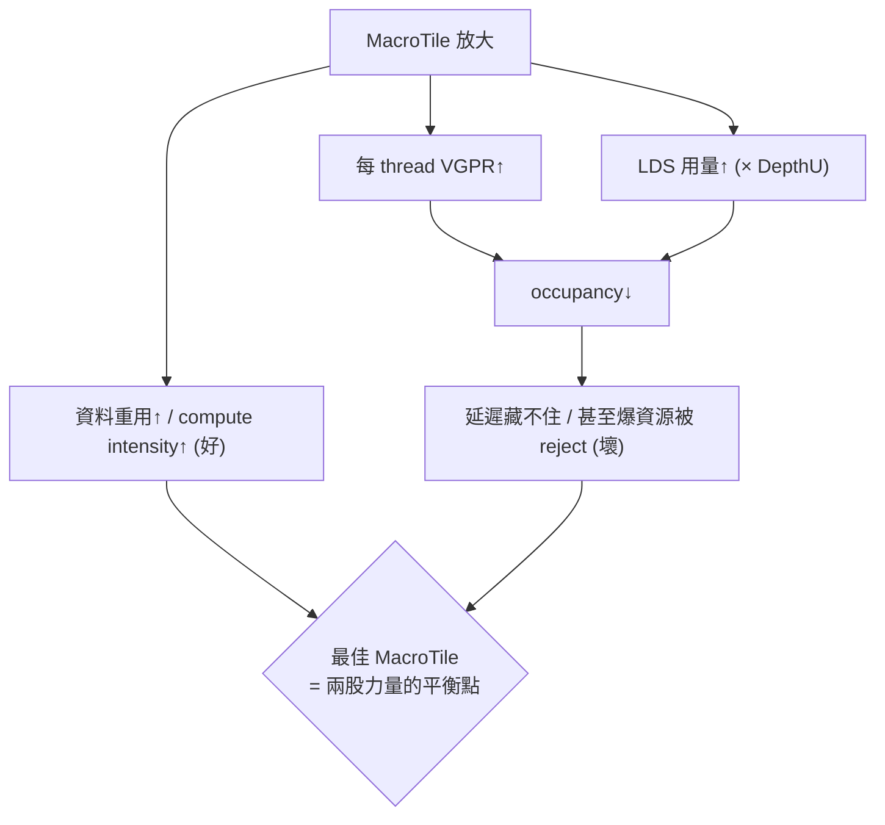

# MacroTile tuning：一個 workgroup 該算多大的輸出塊，為什麼要調它

> 路徑說明：本檔在 repo 內的 `study_docs/hipblaslt/`，code 連結為相對路徑（`../../projects/...`，先回到 repo root 再進 `projects/`）。**行號會隨 commit 漂移，對不上時以符號名稱（函式/類別/參數名）為準。**
>
> 建議先讀 [gemm-optimization.md](gemm-optimization.md)（要改什麼、在哪裡改）與 [tuning-config-reference.md](tuning-config-reference.md)（參數速查）。本篇是那兩篇裡「tile 大小」這件事的**深入版**：把 MacroTile 到底是什麼、怎麼由參數算出來、為什麼要 tune、怎麼 tune 一次講清楚。

## 一句話先講重點

**MacroTile 就是「一個 workgroup（thread block）負責算出來的那一塊 C 輸出子矩陣有多大」**，通常寫成 `MacroTileM x MacroTileN`（例如 `128x128`）。它不是你直接填的數字，而是由 `ThreadTile`、`WorkGroup`（或 MFMA 的 `MatrixInstruction`）等參數**相乘推導**出來的。調 MacroTile＝在「算力/資料重用」與「register/LDS 用量、occupancy」之間找平衡點，是 GEMM tuning 最關鍵的旋鈕之一。

---

## 1. 白話直覺：為什麼要「切塊」（tiling）

GEMM 要算的是 `C = A * B`（先不管 alpha/beta/bias）。假設 C 是 `4096 x 4096`，你**不可能**叫一個 GPU 執行緒把整個 C 算完——沒有那麼多暫存器，也沒有那麼多快取。

於是做法是**切塊（tiling）**：把大大的 C 切成很多小方塊，每個方塊交給一個 **workgroup**（一群一起工作、能共用高速記憶體的執行緒）去算。

> 名詞先解釋：
> - **workgroup（thread block）**＝一群 GPU 執行緒，會被排到**同一個 CU（Compute Unit）**上、可以共用 LDS（見下）並互相同步。
> - **tile（切塊）**＝把大矩陣切成的小塊。每個 workgroup 負責一塊。
> - **CU（Compute Unit）**＝GPU 上的運算單元，是排程的基本硬體單位；MI300/gfx942 有很多個 CU。

**這個「一個 workgroup 負責的 C 小方塊」的大小，就叫 MacroTile。** 白話：

```
       整個 C (例如 4096 x 4096)
   ┌───────┬───────┬───────┬─────┐
   │  MT   │  MT   │  MT   │ ... │   每一格 MT = 一個 workgroup 算的
   ├───────┼───────┼───────┼─────┤   MacroTile，例如 128 x 128
   │  MT   │  MT   │  MT   │ ... │
   ├───────┼───────┼───────┼─────┤   → 需要 (4096/128) x (4096/128)
   │  ...  │  ...  │  ...  │ ... │     = 32 x 32 = 1024 個 workgroup
   └───────┴───────┴───────┴─────┘
```

如果 MacroTile 是 `128x128`，那算完整個 `4096x4096` 就需要 `32 x 32 = 1024` 個 workgroup。MacroTile 越大，需要的 workgroup 越少、每個 workgroup 幹的活越多；MacroTile 越小則相反。這個「大小怎麼選」正是要 tune 的事。

---

## 2. tile 的三層階層：MI tile → wave tile → macro tile

在 CDNA（MI300/gfx942）上，GEMM 的算力來自 **MFMA 指令**（Matrix Fused Multiply-Add，AMD 的矩陣乘加硬體指令，一條就能算一個小矩陣塊）。所以 tile 是**一層套一層**堆出來的，MacroTile 是最外層：

```
Macro tile  (一個 workgroup，含它所有 wave)     ← 這就是 MacroTile，我們要調的
   ↑  疊 WaveM x WaveN 個 wave
Wave tile   (一個 wave 跑的所有 MI 加起來)
   ↑  一個 wave 沿 M/N 重複 WaveTileM x WaveTileN 條 MI
MI tile     (一條 MFMA 硬體指令算的塊)          ← 例如 16x16、32x32
```

> 名詞：
> - **MI（MatrixInstruction）tile**＝一條 MFMA 指令一次算出的 C 小塊，形狀固定由硬體決定（常見 `16x16`、`32x32`）。
> - **wave（wavefront）**＝一組同時執行同一條指令的執行緒；gfx942 上一個 wave＝**64** 條 thread（`WavefrontSize=64`）。
> - **wave tile**＝一個 wave 沿 M/N 各重複幾條 MI 指令所覆蓋的 C 塊。

這張階層圖在 [tuning-config-reference.md](tuning-config-reference.md)〈MatrixInstruction 與 tile 階層〉也有對照，這裡把「怎麼從最小塊疊到 MacroTile」講得更細一點。

---

## 3. MacroTile 到底怎麼被算出來（實際程式碼）

**關鍵觀念：你在 YAML 裡通常不直接寫 `MacroTile`，而是寫 `ThreadTile` + `WorkGroup`（傳統 VALU 路徑）或 `MatrixInstruction`（MFMA 路徑）；TensileLite 幫你推導出 `MacroTile0`（=M 方向）與 `MacroTile1`（=N 方向）。** 推導在 [`assignProblemIndependentDerivedParameters`](../../projects/hipblaslt/tensilelite/Tensile/SolutionStructs/Solution.py) 裡。

### 3.1 最核心的一行：MacroTile = SubGroup × ThreadTile

不論走哪條路徑，最後都會回到這兩行（[Solution.py 約 L717–L720](../../projects/hipblaslt/tensilelite/Tensile/SolutionStructs/Solution.py#L717)）：

```python
# state 是這個 solution 的參數 dict
state["MacroTile0"] = state["SubGroup0"] * state["ThreadTile0"]   # M 方向
state["MacroTile1"] = state["SubGroup1"] * state["ThreadTile1"]   # N 方向
```

白話拆解：
- **`ThreadTile0/1`（TT）**＝**一條 thread**自己負責算的 C 小塊有多大（M 方向 × N 方向）。這直接決定每條 thread 要用多少暫存器來存累加結果。
- **`SubGroup0/1`（SG）**＝一個 workgroup 沿 M/N 各排幾條 thread。`SubGroup0 * SubGroup1 * LocalSplitU`＝`NumThreads`（整個 workgroup 的執行緒數，[Solution.py 約 L710](../../projects/hipblaslt/tensilelite/Tensile/SolutionStructs/Solution.py#L710)）。
- 兩者相乘 → 一個 workgroup 沿該方向覆蓋的 C 長度＝MacroTile。

所以「MacroTile 面積 = NumThreads × (每 thread 的 ThreadTile 面積)」。**這條等式就是 register 壓力的來源**：MacroTile 放大，若 NumThreads 不變，就是每條 thread 的 ThreadTile 變大 → 每條 thread 要更多 VGPR 存累加值。

如果 YAML 同時明寫了 `MacroTile`，TensileLite 會**檢查它跟推導值一致，不一致就 reject 這個 solution**（[Solution.py 約 L721–L724](../../projects/hipblaslt/tensilelite/Tensile/SolutionStructs/Solution.py#L721)）：

```python
if "MacroTile" in state:
    if state["MacroTile0"] != state["MacroTile"][0] \
        or state["MacroTile1"] != state["MacroTile"][1]:
        reject(state, printRejectionReason, "MacroTile mismatch")
```

合法值定義見 [ValidParameters.py](../../projects/hipblaslt/tensilelite/Tensile/Common/ValidParameters.py)（`MacroTile` 註解直接寫 `MT0 = wg0*tt0, MT1 = wg1*tt1`，約 [L689](../../projects/hipblaslt/tensilelite/Tensile/Common/ValidParameters.py#L689)）。

### 3.2 MFMA 路徑：從 9 元素 MatrixInstruction 推導

gfx942/MI300 走的是 MFMA 路徑，這時大家在 YAML 填的是 9 元素的 `MatrixInstruction`：

```
MatrixInstruction = [ M, N, K, B, MIBlockM, WaveTileM, WaveTileN, WaveM, WaveN ]
                      └──前 4 = 硬體 MI 形狀──┘  └BlkM┘  └── WaveTile ──┘ └── Wave ──┘
```

這 9 個數字如何被拆成內部參數，見 [`matrixInstructionToMIParameters`](../../projects/hipblaslt/tensilelite/Tensile/SolutionStructs/Validators/MatrixInstruction.py#L38)。關鍵幾行（`mi` 就是這 9 元素）：

```python
waves = mi[7] * mi[8]                       # WaveM * WaveN = 一個 workgroup 的 wave 數
wg0   = mi[4] * mi[0] * mi[7]               # MIBlockM * MatrixInstM * WaveM
result["WorkGroup"] = [wg0, waves*wavefrontSize//wg0, workGroup[2]]
result["MIWaveTile"] = [mi[5], mi[6]]       # = WaveTileM, WaveTileN
```

接著在 [Solution.py 約 L680–L689](../../projects/hipblaslt/tensilelite/Tensile/SolutionStructs/Solution.py#L680) 由這些量算出 `ThreadTile0/1` 與 `SubGroup0/1`，再回到 3.1 那條 `MacroTile = SubGroup × ThreadTile`。實務上可用 [ValidParameters.py](../../projects/hipblaslt/tensilelite/Tensile/Common/ValidParameters.py#L698) 註解裡的公式心算：

```
MacroTileM = MatrixInstM × MIBlockM × WaveTileM × WaveM
MacroTileN = MatrixInstN × WaveTileN × WaveN         (乘上對應的 block/wave 因子)
```

### 3.3 一個具體例子（直接抄自原始碼註解）

[ValidParameters.py 約 L708–L711](../../projects/hipblaslt/tensilelite/Tensile/Common/ValidParameters.py#L708) 給了一個權威 worked example，最能建立直覺：

```
MatrixInstruction = [32, 32, 1, 2,  1,  4, 1,  2, 2]
                     └MatrixInst┘  Blk  WT    Wave
```

一步步算：
1. **MI tile**：`32x32`，且 B=2（2-block 變體）、MIBlockM=1 → 一條 MI 算 `(32 x 64)`。
2. **× wave tile**：WaveTile `4x1` → 一個 wave 算 `(32*4) x (64*1) = 128 x 64`。
3. **× wave 排列**：Wave `2x2`（一個 workgroup 有 2×2＝4 個 wave）→
   **MacroTile = `(32*4*2) x (64*1*2) = 256 x 128`**。

也就是說這組參數的一個 workgroup 會算出一塊 `256 x 128` 的 C。原始碼註解的結論原文：

> `means (32x64) per MI * (4x1) per wave * (2x2) per workgroup = (32*4*2)x(64*1*2) = 256x128 macro tile`

### 3.4 從 kernel 名字反推 MacroTile

TensileLite 產出的 kernel/solution 名字把參數編碼進去，`MT` 開頭那段就是 MacroTile。例如 `MT128x96x64`＝MacroTile `128x96` + DepthU `64`（對照見 [tuning-config-reference.md](tuning-config-reference.md)〈Solution / kernel 命名〉）。看到 bench 或 log 裡的 kernel 名，第一眼看 `MT` 就知道它的 tile 多大。

---

## 4. 為什麼 MacroTile 這麼重要？它牽動的四件事

MacroTile 一動，下面四個硬體資源與效能因子會**同時**跟著變，這就是它必須被 tune 的根本原因。

### 4.1 資料重用（compute intensity）→ 想要「大」

GEMM 的本質是「載入一次資料、盡量多算幾次」。一個 `M x N` 的 MacroTile，在 K 維度每前進一段，會載入 A 的 `M x DepthU` 與 B 的 `DepthU x N`，卻能貢獻 `M x N` 個乘加。所以：

- MacroTile 越大 → 每從 HBM 搬進來的一份資料被重複用得越多 → **compute intensity（算力/頻寬比）越高**，越不會被記憶體頻寬卡住。
- MacroTile 太小 → 一直在搬資料、算沒幾下 → 浪費頻寬與算力，memory-bound。

> 名詞：**compute intensity（算術強度）**＝每從記憶體搬 1 byte 能做幾次浮點運算。GEMM 想把它拉高，才能餵飽 MFMA 單元。

### 4.2 register（VGPR）用量 → 限制「別太大」

由 3.1，每條 thread 要存的 C 累加值 = `ThreadTile0 x ThreadTile1 = MacroTile 面積 / NumThreads`。MacroTile 越大（NumThreads 不變時），每條 thread 吃越多 **VGPR**（向量暫存器）。

VGPR 是硬體上**固定且珍貴**的資源。用太多會直接壓低 occupancy——`getVgprOccupancy` 就是拿「總 VGPR ÷ 這個 kernel 每 wave 要的 VGPR」算能塞幾個 wave（[KernelWriterAssembly.py 約 L231](../../projects/hipblaslt/tensilelite/Tensile/KernelWriterAssembly.py#L231)）；超過上限（gfx942 每 thread 最多 256 VGPR）這個 solution 會被**靜默淘汰**（tuning 時常見一堆 `VGPR > 256` 被丟掉，屬正常）。

> 名詞：**VGPR（Vector General-Purpose Register）**＝每條 thread 私有的向量暫存器；累加結果、載入暫存都放這。

### 4.3 LDS 用量 → 也限制「別太大」

workgroup 會先把 A、B 的 tile 從 HBM 搬進 **LDS**（Local Data Share，workgroup 共用的高速 shared memory），再從 LDS 餵給 MFMA。需要的 LDS 大小約為：

```
LDS bytes ≈ DepthU × MacroTile × bpe    (A、B 各一份，另加 pad)
```

對應程式碼（[Solution.py 約 L3129–L3135](../../projects/hipblaslt/tensilelite/Tensile/SolutionStructs/Solution.py#L3129)）：

```python
ldsNumBytes = int((state["_DepthU%s"%mxTc] + ldsPad) * state["MacroTile%s"%mxTc] * bpe)
```

所以 **MacroTile 或 DepthU 放大，LDS 用量成正比增加**。LDS 每個 CU 容量有限（gfx942 為 64KB），用太多同樣壓低 occupancy——`getLdsLimitedOccupancy` 就是拿「裝置 LDS ÷ 這 kernel 要的 LDS」算能塞幾個 workgroup（[KernelWriterAssembly.py 約 L286](../../projects/hipblaslt/tensilelite/Tensile/KernelWriterAssembly.py#L286)），超限也會被 reject。

> 名詞：**LDS（Local Data Share）**＝一個 CU 上、同 workgroup 共用的高速 scratchpad（≈ NVIDIA 的 shared memory）。

### 4.4 occupancy → 上面兩者的總結果

**occupancy＝一個 CU 上能同時「住」幾個 wave/workgroup。** 越高越能用別的 wave 的計算蓋住記憶體延遲。最終 occupancy 取 VGPR、LDS、SGPR 三者算出來的**最小值**（[`getOccupancy` 約 L249](../../projects/hipblaslt/tensilelite/Tensile/KernelWriterAssembly.py#L249)）：

```python
return min(ldsLimitedOccupancy, vgprLimitedOccupancy, accvgprLimitedOccupancy, sgprLimitedOccupancy)
```

這就把 4.2 與 4.3 綁在一起：**MacroTile 放大 → VGPR 與 LDS 同時上升 → occupancy 下降**。

### 4.5 memory coalescing / 載入形狀

MacroTile 也決定每個 workgroup 要從 HBM 載入多少、怎麼分給 thread。載入次數約為（[Solution.py 約 L1085](../../projects/hipblaslt/tensilelite/Tensile/SolutionStructs/Solution.py#L1085)）：

```python
totalLoadsNeeded = (MacroTile × DepthU) // (GlobalReadVectorWidth × WavefrontSize)
```

MacroTile 與 `GlobalReadVectorWidth`、`WavefrontSize` 若搭配不好，會讓每條 thread 的載入不成整齊的向量（coalescing 變差），甚至因為除不盡而被 reject。所以 MacroTile 不能單獨調，要跟 `DepthU`、`GlobalReadVectorWidth` 一起看。

### 小結：一張圖看四個牽連



**一句話：MacroTile 調大能提高資料重用與算力密度，但會吃掉 register/LDS、壓低 occupancy；tuning 就是在這兩股相反的力量間，替特定 problem size 與硬體找到那個甜蜜點。**

---

## 5. MacroTile 相關參數與限制（tuning config 怎麼設）

在 TensileLite 的 YAML（`ForkParameters` 區段，見 [tuning-config-reference.md](tuning-config-reference.md)），跟 MacroTile 直接相關的旋鈕與它們的關係／限制：

| 參數 | 白話作用 | 與 MacroTile 的關係 / 限制 |
|---|---|---|
| `MatrixInstruction`（9 元素，MFMA 路徑） | 決定 MI 形狀 + wave tile + wave 排列 | **MacroTile 直接由它相乘得出**（見 §3.2/3.3）。gfx942 最常調的就是它 |
| `ThreadTile`（`[tt0, tt1]`，VALU 路徑） | 每 thread 算的 C 小塊 | `MacroTile = SubGroup × ThreadTile`；放大直接增 VGPR |
| `WorkGroup`（`[wg0, wg1, LocalSplitU]`） | workgroup 的 thread 排列 | 提供 `SubGroup0/1`；`wg0*wg1*LocalSplitU = NumThreads` 必須是 `WavefrontSize` 的倍數（[Solution.py 約 L711](../../projects/hipblaslt/tensilelite/Tensile/SolutionStructs/Solution.py#L711)） |
| `MacroTile`（`[MT0, MT1]`，選填） | 直接指定 tile | 若填了必須等於推導值，否則 reject（§3.1）；合法值見 [ValidParameters.py](../../projects/hipblaslt/tensilelite/Tensile/Common/ValidParameters.py#L689) |
| `DepthU` | K 方向一次處理的深度 | **與 MacroTile 一起決定 LDS 用量**（`LDS ≈ DepthU × MacroTile × bpe`）；大 K/compute-bound 用大值，小 K/memory-bound 用小值 |
| `GlobalReadVectorWidthA/B` | 向量化載入寬度 | 要能整除 `MacroTile × DepthU / NumThreads`，否則載入不整齊或被 reject（§4.5） |
| `LocalSplitU` / `GlobalSplitU` | 把 K 切給多 wave/workgroup | 改變 NumThreads 與每 thread 工作量，間接影響 MacroTile 與 register 的權衡 |
| `MaxOccupancy` | 人為上限 occupancy | 用「多配 LDS」的方式**壓低** occupancy 換取更少快取抖動（[ValidParameters.py 約 L680](../../projects/hipblaslt/tensilelite/Tensile/Common/ValidParameters.py#L680)） |

幾個實務限制與眉角：
- **DepthU 與 MacroTile 建議取 2 的次方**（[ValidParameters.py 約 L300–L301](../../projects/hipblaslt/tensilelite/Tensile/Common/ValidParameters.py#L300) 有相關註解），方便向量化與位址對齊。
- **極端小 tile 有特例被擋**：例如 `MacroTile0==16 且 MacroTile1==16 且 DepthU==512` 會被 reject（[Solution.py 約 L2521](../../projects/hipblaslt/tensilelite/Tensile/SolutionStructs/Solution.py#L2521)），因為太瘦長的組合無意義。
- **WaveSeparateGlobalRead** 要求 MacroTile 是 wave 數的倍數，否則 reject（[Solution.py 約 L1123](../../projects/hipblaslt/tensilelite/Tensile/SolutionStructs/Solution.py#L1123)）。

### 一個 fork 空間的例子（示意）

```yaml
ForkParameters:
  # 讓 TensileLite 對這幾種 MacroTile 幾何各產一個候選 kernel，再自動挑贏家
  - MatrixInstruction:
    - [16, 16, 16, 1,  1,  4, 4,  2, 2]   # → MacroTile 128 x 128
    - [16, 16, 16, 1,  1,  8, 8,  2, 2]   # → 更大的 MacroTile（重用↑，但 VGPR/LDS↑）
    - [16, 16, 16, 1,  1,  2, 2,  2, 2]   # → 更小的 MacroTile（occupancy↑，重用↓）
  - DepthU: [32, 64, 128]                  # 跟 MacroTile 一起決定 LDS
  - GlobalReadVectorWidthA: [-1, 4, 8]
```

> 這是**概念示意**（實際合法組合以 [ValidParameters.py](../../projects/hipblaslt/tensilelite/Tensile/Common/ValidParameters.py) 與本機測試 YAML 如 [f32_gsu.yaml](../../projects/hipblaslt/tensilelite/Tensile/Tests/common/gsu/f32_gsu.yaml) 為準）。TensileLite 會對 `ForkParameters` 取笛卡兒積，每個組合產一個候選 kernel，benchmark 後由 LibraryLogic 對每個 problem size 挑最快的（見 [tensilelite-pipeline.md](tensilelite-pipeline.md)）。

---

## 6. 為什麼「不同情況要不同 MacroTile」（tuning 的真正理由）

沒有一個 MacroTile 到處最快，因為最佳點同時取決於 **problem size** 與 **硬體**：

**依 problem size：**
- **大方陣（如 4096³）**：compute-bound，適合**大 MacroTile**（如 `256x256`、`128x256`）＋大 DepthU，把 compute intensity 拉滿、餵飽 MFMA。
- **瘦長矩陣（如 M 或 N 很小、K 很大）**：大 MacroTile 會有很多 thread 算到 tile 邊界外（浪費），這時**小 MacroTile** 或非方形 tile（如 `64x256`）更貼合形狀，也讓 workgroup 數夠多鋪滿所有 CU。
- **小矩陣**：workgroup 太少會鋪不滿 GPU（許多 CU 閒置），此時偏好**小 MacroTile** 以產生更多 workgroup，或搭 `GlobalSplitU` 把 K 切開增加平行度。

**依硬體（如 gfx942 / MI300）：**
- 每個 CU 的 VGPR 數、LDS 容量（gfx942＝64KB/CU）、`MaxWavesPerSimd` 都是固定上限。同一組 MacroTile 在資源較少的架構上可能 occupancy 掉到 1、甚至爆掉被 reject；換架構就得重調。
- gfx942 用 wave64（`WavefrontSize=64`）、MFMA 指令形狀（`16x16`、`32x32`）與 gfx11/gfx1150 的 WMMA、wave32 不同，同一份 config 的數值不能直接照搬（見 [tuning-config-reference.md](tuning-config-reference.md) 開頭的架構差異警告）。

**這就是為什麼要 tune**：對每個目標 problem size + 目標架構，掃一批候選 MacroTile（連同 DepthU 等），實測挑贏家，寫進 library logic 表。runtime 再依當下 M/N/K 查表選對應 tile 的 kernel（查表機制見 [solution-selection.md](solution-selection.md)）。

---

## 7. 怎麼動手 tune MacroTile（最小迴圈）

沿用 [gemm-optimization.md](gemm-optimization.md) 的迭代迴圈，聚焦在 MacroTile：

```bash
cd /data1/perlee/rocm-libraries/projects/hipblaslt/tensilelite
invoke rocisa && invoke build-client          # 一次性準備

# 在 YAML 的 ForkParameters 擴充/縮小 MatrixInstruction / DepthU 的候選值，再：
Tensile/bin/Tensile my_gemm_tune.yaml out/
#   out/2_BenchmarkData/*.csv  -> 看各候選（含不同 MacroTile）的 GFlops，WinnerGFlops 是贏家
#   out/3_LibraryLogic/*.yaml  -> 每個 size 最後選了哪個 solution（看名字裡的 MT???x???）
```

觀察重點：
- CSV 裡會看到**大量候選被淘汰**（`VGPR > 256` / `LDS 超限`）——這正是 §4.2/4.3 在起作用，屬正常現象（見 [tuning-config-reference.md](tuning-config-reference.md)〈量測對照〉）。
- 比較不同 MacroTile 的 GFlops 曲線，通常會看到「太小→太大」中間有一個峰值，那就是這個 problem size 的甜蜜點。
- 想對單一 solution 做受控比較、確認 tile 大小，用 `hipblaslt-bench --print_kernel_info` 看 kernel 名裡的 `MT` 段（見 [gemm-optimization.md](gemm-optimization.md) 的 bench 範例）。
- 改完務必用 profiling 證明真的變快：見 [profiling-rocprof.md](profiling-rocprof.md)。

---

## Terminology（本篇小抄）

- **MacroTile（MT）** — 一個 workgroup 負責算的 C 輸出子矩陣大小，`MacroTileM x MacroTileN`；由 `SubGroup × ThreadTile` 推導。
- **ThreadTile（TT）** — 一條 thread 自己算的 C 小塊；決定每 thread 的 VGPR 累加用量。
- **SubGroup / WorkGroup** — workgroup 沿 M/N 的 thread 排列；`NumThreads = SubGroup0 × SubGroup1 × LocalSplitU`。
- **MatrixInstruction（MI）** — MFMA 硬體指令的形狀與堆疊參數（9 元素）；gfx942 上 MacroTile 主要由它推導。
- **wave / WavefrontSize** — 一組同步執行的 thread；gfx942＝64。
- **DepthU** — K 方向一次處理深度；與 MacroTile 一起決定 LDS 用量。
- **VGPR** — 每 thread 私有向量暫存器；MacroTile 大→用量大→occupancy 低。
- **LDS** — workgroup 共用高速 shared memory；`LDS ≈ DepthU × MacroTile × bpe`。
- **occupancy** — 一個 CU 能同時容納的 wave/workgroup 數；取 VGPR/LDS/SGPR 限制的最小值。
- **compute intensity** — 每搬 1 byte 能做幾次運算；MacroTile 越大越高。

## 交叉連結

- 上一層全局：[README.md](README.md)
- 要改什麼、在哪裡改（三個調整層級）：[gemm-optimization.md](gemm-optimization.md)
- 參數速查（`MatrixInstruction` / tile 階層 / kernel 命名）：[tuning-config-reference.md](tuning-config-reference.md)
- kernel 產生與挑選的三階段：[tensilelite-pipeline.md](tensilelite-pipeline.md)
- runtime 依 M/N/K 查表選對應 tile 的 kernel：[solution-selection.md](solution-selection.md)
- MacroTile 在 codegen 端如何被 KernelWriter 用（`_initKernel` 算 tile 尺寸、`kernelBody` 排程）：[kernelwriter-implementation.md](kernelwriter-implementation.md)
- LDS bank conflict 與 `TransposeLDS`/`LdsPad`（LDS 這一路的細節）：[../isa/lds-bank-conflicts.md](../isa/lds-bank-conflicts.md)
- MFMA 指令語意（MI tile 的底層）：[../isa/mfma-deep-dive.md](../isa/mfma-deep-dive.md)
- 改完怎麼量測驗證：[profiling-rocprof.md](profiling-rocprof.md)

## 一句話總結

> **MacroTile ＝ 一個 workgroup 算多大一塊 C，由 `ThreadTile × SubGroup`（或 `MatrixInstruction` 相乘）推導出來。調大它能提升資料重用與算力密度，但會吃 VGPR/LDS 並壓低 occupancy——MacroTile tuning 就是替每個 problem size 與硬體，在這兩股相反力量之間找出實測最快的那個 tile 大小。**
