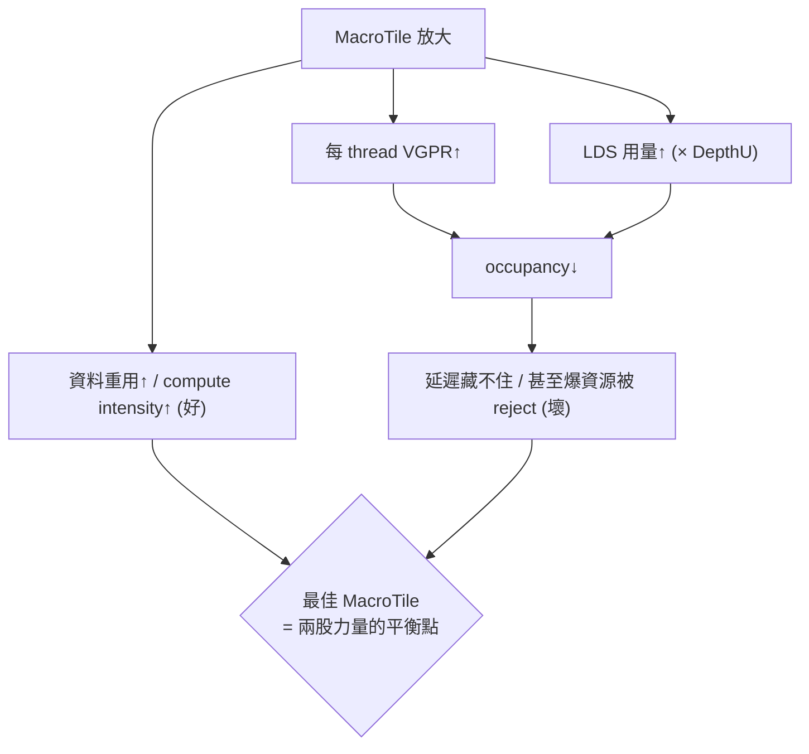
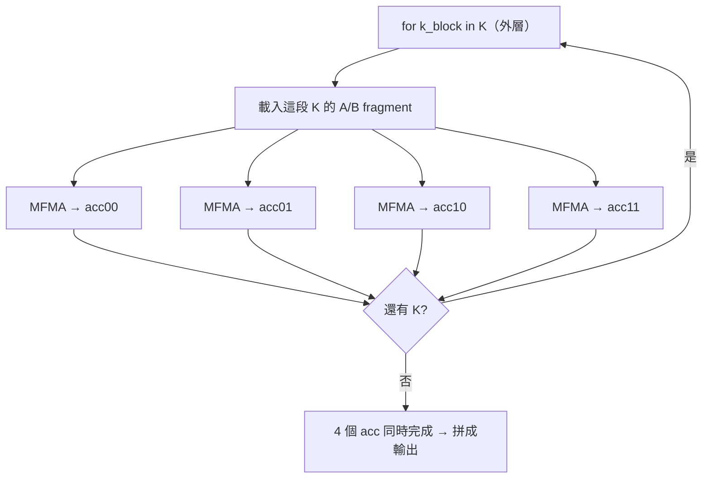

# MacroTile tuning：一個 workgroup 該算多大的輸出塊，為什麼要調它

> 路徑說明：本檔在 repo 內的 `study_docs/hipblaslt/`，code 連結為相對路徑（`../../projects/...`，先回到 repo root 再進 `projects/`）。**行號會隨 commit 漂移，對不上時以符號名稱（函式/類別/參數名）為準。**
>
> 建議先讀 [gemm-optimization.md](gemm-optimization.md)（要改什麼、在哪裡改）與 [tuning-config-reference.md](tuning-config-reference.md)（參數速查）。本篇是那兩篇裡「tile 大小」這件事的**深入版**：把 MacroTile 到底是什麼、怎麼由參數算出來、為什麼要 tune、怎麼 tune 一次講清楚。

## 一句話先講重點

**MacroTile 就是「一個 workgroup（thread block）負責算出來的那一塊 C 輸出子矩陣有多大」**，通常寫成 `MacroTileM x MacroTileN`（例如 `128x128`）。它不是你直接填的數字，而是由 `ThreadTile`、`WorkGroup`（或 MFMA 的 `MatrixInstruction`）等參數**相乘推導**出來的。調 MacroTile＝在「算力/資料重用」與「register/LDS 用量、occupancy」之間找平衡點，是 GEMM tuning 最關鍵的旋鈕之一。

---


## 1. 白話直覺：為什麼要「切塊」（tiling）

GEMM 要算的是 `C = A * B`（先不管 alpha/beta/bias）。假設 C 是 `4096 x 4096`，你**不可能**叫一個 GPU 執行緒把整個 C 算完——沒有那麼多暫存器，也沒有那麼多快取。

於是做法是**切塊（tiling）**：把大大的 C 切成很多小方塊，每個方塊交給一個 **workgroup**（一群一起工作、能共用高速記憶體的執行緒）去算。

> 名詞先解釋：
>
> - **workgroup（thread block）**＝一群 GPU 執行緒，會被排到**同一個 CU（Compute Unit）**上、可以共用 LDS（見下）並互相同步。
> - **tile（切塊）**＝把大矩陣切成的小塊。每個 workgroup 負責一塊。
> - **CU（Compute Unit）**＝GPU 上的運算單元，是排程的基本硬體單位；MI300/gfx942 有很多個 CU。

**這個「一個 workgroup 負責的 C 小方塊」的大小，就叫 MacroTile。** 白話：

```
       整個 C (例如 4096 x 4096)
   ┌───────┬───────┬───────┬─────┐
   │  MT   │  MT   │  MT   │ ... │   每一格 MT = 一個 workgroup 算的
   ├───────┼───────┼───────┼─────┤   MacroTile，例如 128 x 128
   │  MT   │  MT   │  MT   │ ... │
   ├───────┼───────┼───────┼─────┤   → 需要 (4096/128) x (4096/128)
   │  ...  │  ...  │  ...  │ ... │     = 32 x 32 = 1024 個 workgroup
   └───────┴───────┴───────┴─────┘
```

如果 MacroTile 是 `128x128`，那算完整個 `4096x4096` 就需要 `32 x 32 = 1024` 個 workgroup。MacroTile 越大，需要的 workgroup 越少、每個 workgroup 幹的活越多；MacroTile 越小則相反。這個「大小怎麼選」正是要 tune 的事。

---


## 2. tile 的三層階層：MI tile → wave tile → macro tile

在 CDNA（MI300/gfx942）上，GEMM 的算力來自 **MFMA 指令**（Matrix Fused Multiply-Add，AMD 的矩陣乘加硬體指令，一條就能算一個小矩陣塊）。所以 tile 是**一層套一層**堆出來的，MacroTile 是最外層：

```
Macro tile  (一個 workgroup，含它所有 wave)     ← 這就是 MacroTile，我們要調的
   ↑  疊 WaveM x WaveN 個 wave
Wave tile   (一個 wave 跑的所有 MI 加起來)
   ↑  一個 wave 沿 M/N 重複 WaveTileM x WaveTileN 條 MI
MI tile     (一條 MFMA 硬體指令算的塊)          ← 例如 16x16、32x32
```

> 名詞：
>
> - **MI（MatrixInstruction）tile**＝一條 MFMA 指令一次算出的 C 小塊，形狀固定由硬體決定（常見 `16x16`、`32x32`）。
> - **wave（wavefront）**＝一組同時執行同一條指令的執行緒；gfx942 上一個 wave＝**64** 條 thread（`WavefrontSize=64`）。
> - **wave tile**＝一個 wave 沿 M/N 各重複幾條 MI 指令所覆蓋的 C 塊。

這張階層圖在 [tuning-config-reference.md](tuning-config-reference.md)〈MatrixInstruction 與 tile 階層〉也有對照，這裡把「怎麼從最小塊疊到 MacroTile」講得更細一點。

> ⚠️ **先別跟 §3.1 搞混**：這套 `MI / WaveTile / Wave` 是 **MFMA 硬體視角**；§3.1 會用**另一套詞彙** `SubGroup × ThreadTile` 描述**同一個 MacroTile**（那是 TensileLite 的內部表示）。兩者是同一個乘積、**不是兩件事**，但它們**不是一層換名字**（零件對不起來）。為什麼等價、又為什麼零件對不起來，見 §3.3。

---


## 3. MacroTile 到底怎麼被算出來（實際程式碼）

**關鍵觀念：你在 YAML 裡通常不直接寫** `MacroTile`**，而是寫** `ThreadTile` **+** `WorkGroup`**（傳統 VALU 路徑）或** `MatrixInstruction`**（MFMA 路徑）；TensileLite 幫你推導出** `MacroTile0`**（=M 方向）與** `MacroTile1`**（=N 方向）。** 推導在 `[assignProblemIndependentDerivedParameters](../../projects/hipblaslt/tensilelite/Tensile/SolutionStructs/Solution.py)` 裡。

### 3.1 最核心的一行：MacroTile = SubGroup × ThreadTile

不論走哪條路徑，最後都會回到這兩行（[Solution.py 約 L717–L720](../../projects/hipblaslt/tensilelite/Tensile/SolutionStructs/Solution.py#L717)）：

```python
# state 是這個 solution 的參數 dict
state["MacroTile0"] = state["SubGroup0"] * state["ThreadTile0"]   # M 方向
state["MacroTile1"] = state["SubGroup1"] * state["ThreadTile1"]   # N 方向
```

白話拆解：

- `ThreadTile0/1`**（TT）**＝**一條 thread**自己負責算的 C 小塊有多大（M 方向 × N 方向）。這直接決定每條 thread 要用多少暫存器來存累加結果。
- `SubGroup0/1`**（SG）**＝一個 workgroup 沿 M/N 各排幾條 thread。`SubGroup0 * SubGroup1 * LocalSplitU`＝`NumThreads`（整個 workgroup 的執行緒數，[Solution.py 約 L710](../../projects/hipblaslt/tensilelite/Tensile/SolutionStructs/Solution.py#L710)）。
- 兩者相乘 → 一個 workgroup 沿該方向覆蓋的 C 長度＝MacroTile。

所以「MacroTile 面積 = NumThreads × (每 thread 的 ThreadTile 面積)」。

**這條等式就是 register 壓力的來源**：MacroTile 放大，若 NumThreads 不變，就是每條 thread 的 ThreadTile 變大 → 每條 thread 要更多 VGPR 存累加值。

如果 YAML 同時明寫了 `MacroTile`，TensileLite 會**檢查它跟推導值一致，不一致就 reject 這個 solution**（[Solution.py 約 L721–L724](../../projects/hipblaslt/tensilelite/Tensile/SolutionStructs/Solution.py#L721)）：

```python
if "MacroTile" in state:
    if state["MacroTile0"] != state["MacroTile"][0] \
        or state["MacroTile1"] != state["MacroTile"][1]:
        reject(state, printRejectionReason, "MacroTile mismatch")
```

**怎麼讀**：`state["MacroTile0/1"]` 是 TensileLite 由參數**推導出來**的值；`state["MacroTile"][0/1]` 是你在 YAML 裡**明寫**的值（可不填）。只要 M 或 N 任一方向對不上就 `reject`（丟棄這個 solution）。用意是防止「手寫的 MacroTile」和「參數推導的 MacroTile」不一致而自相矛盾——也就是說 `MacroTile` 欄位只能拿來「double-check」，不能拿來「覆蓋」推導結果。

合法值定義見 [ValidParameters.py](../../projects/hipblaslt/tensilelite/Tensile/Common/ValidParameters.py)（`MacroTile` 註解直接寫 `MT0 = wg0*tt0, MT1 = wg1*tt1`，約 [L689](../../projects/hipblaslt/tensilelite/Tensile/Common/ValidParameters.py#L689)）。

### 3.2 MFMA 路徑：從 9 元素 MatrixInstruction 推導

gfx942/MI300 走的是 MFMA 路徑，這時大家在 YAML 填的是 9 元素的 `MatrixInstruction`：

```
MatrixInstruction = [ M, N, K, B, MIBlockM, WaveTileM, WaveTileN, WaveM, WaveN ]
                      └硬體MI形狀┘ └ BlkM ┘  └── WaveTile ──┘      └── Wave ──┘
```

> ❓ **你問過（2026-07）**：第 4 個 `B` 和第 5 個 `MIBlockM` 差在哪？`MIBlockM` 是指不同的獨立 MI 嗎？
>
> - `**B`（`MatrixInstB`，硬體屬性）**＝一條 MFMA 指令**一次平行算幾個獨立 block**（對應指令名的 `_2B`/`_4B`/`_16B`；沒標＝1）。挑哪條 MFMA 變體就固定了，**不能亂填**。
> - `**MIBlockM`（佈局旋鈕）**＝把那 `B` 個 block **沿 M 排幾個**，剩下的沿 N（`MIBlockN = B / MIBlockM`）。每條指令覆蓋的 tile ＝ `(M × MIBlockM) × (N × MIBlockN)`。例：`16x16` 的 4-block 變體配 `MIBlockM=4` → 排成 4×1 → 每指令 `64×16`；同樣 B=4 但 `MIBlockM=2` → 排成 `32×32`。
> - **關鍵：兩者都在「同一條指令內部」**——那 B 個 block 是**一條** MFMA 一次算出來的，不是多條指令。真正「發射多條不同 MI 指令」是 `WaveTile`（第 6、7 元素）在管的，**別跟** `MIBlockM` **混**。
> - **實務：gfx942 AI GEMM 幾乎都** `B=1`**（單 block、深 K），此時** `MIBlockM` **恆為 1、不用管**；多 block 是淺 K 舊形式，仍在 ISA 但大 GEMM 少挑（原因見 §3.4 的提醒）。

> ❓ **你問過（2026-07）**：一個 wave tile 算幾個 MI 是誰決定的？—— 就是 `WaveTileM × WaveTileN`（第 6、7 個元素，**你自己填的**，程式碼取成 `MIWaveTile`）；每條 MI 的形狀（前 4 個）是硬體固定的。至於「該填多少」沒有公式，是 tune 出來的（見 §6/§8）。

這 9 個數字如何被拆成內部參數，見 `[matrixInstructionToMIParameters](../../projects/hipblaslt/tensilelite/Tensile/SolutionStructs/Validators/MatrixInstruction.py#L38)`。關鍵幾行（`mi` 就是這 9 元素）：

```python
waves = mi[7] * mi[8]                       # WaveM * WaveN = 一個 workgroup 的 wave 數
wg0   = mi[4] * mi[0] * mi[7]               # MIBlockM * MatrixInstM * WaveM
result["WorkGroup"] = [wg0, waves*wavefrontSize//wg0, workGroup[2]]
result["MIWaveTile"] = [mi[5], mi[6]]       # = WaveTileM, WaveTileN
```

**怎麼讀這幾行**（`mi[0..8]` 就是 9 元素 `[M, N, K, B, MIBlockM, WaveTileM, WaveTileN, WaveM, WaveN]`）：

- `waves = mi[7] * mi[8]`＝`WaveM × WaveN`＝一個 workgroup 裡總共幾個 wave（如 `2×2 = 4`）。
- `wg0 = mi[4] * mi[0] * mi[7]`＝`MIBlockM × MatrixInstM × WaveM`＝workgroup 沿 **M 方向**排幾條 thread：一個 wave 沿 M 覆蓋 `MatrixInstM × MIBlockM` 個 lane，再乘上沿 M 的 `WaveM` 個 wave。
- `WorkGroup = [wg0, waves*wavefrontSize//wg0, LocalSplitU]`＝把「總 thread 數＝`waves × 64`」拆成 `[M 方向, N 方向, splitK]`；N 方向的數量用「總數 ÷ M 方向」補回來（所以不用另外給）。
- `MIWaveTile = [mi[5], mi[6]]`＝原封不動取出 `WaveTileM, WaveTileN`。

**為什麼這樣算**：MFMA 把「thread 怎麼排」綁死在硬體 lane 佈局上，不能像 VALU 那樣自由填 `WorkGroup`；所以 TensileLite 反過來**從你給的 MI/WaveTile/Wave 反推**出等效的 `WorkGroup` 與 `MIWaveTile`，下一步再算出 `ThreadTile/SubGroup`。

接著在 [Solution.py 約 L680–L689](../../projects/hipblaslt/tensilelite/Tensile/SolutionStructs/Solution.py#L680) 由這些量算出 `ThreadTile0/1` 與 `SubGroup0/1`，再回到 3.1 那條 `MacroTile = SubGroup × ThreadTile`。實務上可用 [ValidParameters.py](../../projects/hipblaslt/tensilelite/Tensile/Common/ValidParameters.py#L698) 註解裡的公式心算：

```
MacroTileM = MatrixInstM × MIBlockM × WaveTileM × WaveM
MacroTileN = MatrixInstN × WaveTileN × WaveN         (乘上對應的 block/wave 因子)
```

**怎麼讀**：這條就是把 §2 那張階層圖「從最內層 MI 往外、每一層在 M 方向的放大倍數」乘起來，每個因子代表一層：

- `MatrixInstM`：一條 MFMA 指令在 M 方向算多長（硬體固定，如 16、32）。
- `MIBlockM`：這條指令的 `B` 個 block 沿 M 排幾個（見上面 `B` / `MIBlockM` 說明）。
- `WaveTileM`：一個 wave 沿 M 疊幾條 MI（第 6 元素，你填的）。
- `WaveM`：一個 workgroup 沿 M 疊幾個 wave（第 8 元素）。

四者相乘＝一個 workgroup 沿 M 覆蓋的 C 總長＝`MacroTileM`；`MacroTileN` 同理（每個 M 換成 N，並用 `MIBlockN = B / MIBlockM`）。

### 3.3 §2 的 `MI×WaveTile×Wave` 和 §3.1 的 `SubGroup×ThreadTile` 是同一個 MacroTile

> ❓ **你問過（2026-07）**：§2 先講 `MacroTile → WaveTile → MI tile`，§3 又變成 `SubGroup × ThreadTile`，這兩套是等價的嗎？—— **是等價的，但不是「同一層換名字」**，見本節。

**一句話：兩套詞彙乘出來是同一個 MacroTile，只是把它切成不同層次的兩種說法。**

- **§2 的** `MI × WaveTile × Wave` 是 **MFMA 硬體視角**——你在 YAML 填 `MatrixInstruction` 時腦中該有的圖：一條 MFMA 指令 → 疊成一個 wave → 疊成一個 workgroup。
- **§3.1 的** `SubGroup × ThreadTile` 是 **TensileLite 內部通用公式**——不管走 VALU 還是 MFMA 路徑，程式最後都把 MacroTile 表示成這個乘積（LDS 計算、載入分配等程式碼全用它寫）。

**為什麼會有兩套？（歷史）** `SubGroup × ThreadTile` 是 MFMA 出現**之前**（傳統 VALU 路徑）的老概念，那時「一條 thread 真的擁有 C 上一個小矩形」，thread 排成 `SubGroup0 × SubGroup1` 的 2D 網格，這條公式是**字面上的幾何關係**。有了 MFMA 後，一條指令要**整個 wave（64 lane）合作**才算得動，「一條 thread 一個矩形」的直覺就崩了，於是自然改用 `MI/WaveTile/Wave`（§2）。但 TensileLite **沒丟掉舊表示法**（太多程式碼依賴它），而是**從你填的** `MatrixInstruction` **反算出** `SubGroup/ThreadTile`（§3.2 的 [Solution.py L680–L689](../../projects/hipblaslt/tensilelite/Tensile/SolutionStructs/Solution.py#L680)），再套回 §3.1 那條式子。所以關係是「輸入 → 翻譯 → 內部表示」：

```
§2（你填的，MFMA 硬體視角）  ──Solution.py L680–689 翻譯──▶  §3.1（TensileLite 內部表示）
     MI × WaveTile × Wave                                    SubGroup × ThreadTile
                          └─────────── 同一個 MacroTile ───────────┘
```

**用一個乾淨例子證明兩條路殊途同歸**（取 `MI=16×16`、`WaveTile=4×4`、`Wave=2×2`、`WavefrontSize=64`，此例 `B=1` 使 `MatrixInstBM=MatrixInstBN=1`、`MIWaveGroup=[WaveM,WaveN]=[2,2]`）：

用 §2 硬體視角（`MacroTile = MI × WaveTile × Wave`）：

```
MacroTileM = 16 × 4 × 2 = 128
MacroTileN = 16 × 4 × 2 = 128
```

用 §3.1 內部公式（先用 [Solution.py L686–L689](../../projects/hipblaslt/tensilelite/Tensile/SolutionStructs/Solution.py#L686) 算中間量，再相乘）：

```
ThreadTile0 = MatrixInstBM × WaveTileM × (M×N / WFS) = 1 × 4 × (256/64) = 16
ThreadTile1 = MatrixInstBN × WaveTileN               = 1 × 4           = 4
SubGroup0   = MIWaveGroup0 × (WFS / N)               = 2 × (64/16)     = 8
SubGroup1   = MIWaveGroup1 × N                       = 2 × 16          = 32

MacroTile0 = SubGroup0 × ThreadTile0 = 8 × 16 = 128   ✓
MacroTile1 = SubGroup1 × ThreadTile1 = 32 × 4 = 128   ✓
```

**怎麼讀這些中間量**（`WFS` = WavefrontSize = 64）：

- `(M×N / WFS)`＝一條 MI 的一個 block 有 `M×N` 個輸出，卻由一個 wave 的 64 條 lane 分攤 → **每條 lane 要存** `M×N/WFS` **個 C 累加值**。這就是 MFMA 版 `ThreadTile`（每 lane 的累加器顆數）被放大的來源。
- `SubGroup0 = MIWaveGroup0 × (WFS / N)`、`SubGroup1 = MIWaveGroup1 × N`＝把一個 wave 的 64 條 lane 按 MFMA 硬體佈局攤成 M、N 兩個方向的 thread 數（`WFS/N` 沿 M、`N` 沿 N），再各乘上該方向的 wave 數。
- 所以這裡的 `ThreadTile / SubGroup` 已經不是「一條 thread 的漂亮小矩形」，而是「湊出正確 MacroTile 的記帳量」（見下方誤會對照表）。

兩條路都得到 `128×128`，是**同一個 MacroTile**。（順帶自洽：`NumThreads = SubGroup0 × SubGroup1 = 8×32 = 256 = 4 wave × 64`，正好等於 `Wave = 2×2 = 4` 個 wave。）

**最容易踩的誤會：零件對不起來，只有總乘積相等。** 千萬別把它們當成「一層換個名字」：


| §2 的零件          | §3.1 的零件                    | 兩者關係                                                |
| --------------- | --------------------------- | --------------------------------------------------- |
| `WaveTileN = 4` | `ThreadTile1 = 4`           | 這個例子剛好相等——但**是巧合**（因為 `BN=1`、N 方向沒有硬體放大因子），**不是通則** |
| `WaveTileM = 4` | `ThreadTile0 = 16`          | **不相等**：被 MFMA 硬體因子 `(M×N / WFS) = 4` 放大了           |
| `Wave = 2×2`    | `SubGroup0=8, SubGroup1=32` | **完全不同**：SubGroup 還吃了 `WFS/N`、`N` 這些硬體係數            |


原因：在 MFMA 路徑，`ThreadTile` 的真正意義已退化成「**每條 lane 存幾個 C 累加值（VGPR 顆數）**」、`SubGroup` 變成「**為了讓乘積湊對的記帳數字**」，都不再是 VALU 時代那個「一條 thread 的漂亮小矩形」。這也是為什麼 §2 要另用 `MI/WaveTile/Wave` 當 MFMA 的直覺模型——`SubGroup/ThreadTile` 在 MFMA 下已經不直覺了。

> **結論**：`❌ WaveTile = ThreadTile`、`❌ Wave = SubGroup`；`✅ MI × WaveTile × Wave = SubGroup × ThreadTile = 同一個 MacroTile`。§2 是輸入視角、§3.1 是內部等價表示，中間靠 §3.2 的程式碼翻譯。

---


### 3.4 一個具體例子（直接抄自原始碼註解）

[ValidParameters.py 約 L708–L711](../../projects/hipblaslt/tensilelite/Tensile/Common/ValidParameters.py#L708) 給了一個權威 worked example，最能建立直覺：

```
MatrixInstruction = [32, 32, 1, 2,  1,  4, 1,  2, 2]
                     └MatrixInst┘  Blk  WT    Wave
```

一步步算：

1. **MI tile**：`32x32`，且 B=2（2-block 變體）、MIBlockM=1 → 一條 MI 算 `(32 x 64)`。
2. **× wave tile**：WaveTile `4x1` → 一個 wave 算 `(32*4) x (64*1) = 128 x 64`。
3. **× wave 排列**：Wave `2x2`（一個 workgroup 有 2×2＝4 個 wave）→
  **MacroTile =** `(32*4*2) x (64*1*2) = 256 x 128`。

也就是說這組參數的一個 workgroup 會算出一塊 `256 x 128` 的 C。原始碼註解的結論原文：

> `means (32x64) per MI * (4x1) per wave * (2x2) per workgroup = (32*4*2)x(64*1*2) = 256x128 macro tile`

> ⚠️ **別被這個例子誤導：**`B=2` **只是為了示範** `B / MIBlockM` **的折疊機制**（B=1 時 `MIBlockM` 恆為 1，就沒有 block 可折、示範不出東西）。這組（連 `K` 都寫 `1`）是 [ValidParameters.py 註解的算術範例](../../projects/hipblaslt/tensilelite/Tensile/Common/ValidParameters.py#L708)，**不是** AI 會實際 tune 出來的 kernel。
>
> - **真實 gfx942 AI GEMM 幾乎都挑「單 block、深 K」（**`B=1`**）的變體**，例如 `16x16x16`、`32x32x8`——因為**深 K 單 block 是全速率（≈256 MAC/cycle），多 block 淺 K 只有半速率（≈128 MAC/cycle）**（見 [../isa/mfma-deep-dive.md](../isa/mfma-deep-dive.md) 的 Blocks/Cycles 對照）。
> - 真實 config 長這樣：`[16, 16, 32, 1,  1,  4, 4,  2, 2]`（**K=32 深、B=1、MIBlockM=1**），而不是本例的 `B=2`。
> - 多 block 變體（`_2B`/`_4B`/`_16B`）**仍在 gfx942 ISA、沒有被移除**，也一樣是「MI 指令」；只是大型 AI GEMM 因半速率而少挑它。所以「這是一條 MI 指令」和「AI 都用單 block MI 指令」並不衝突——單 block 只是 MI 指令家族的一個子集。


### 3.5 從 kernel 名字反推 MacroTile

TensileLite 產出的 kernel/solution 名字把參數編碼進去，`MT` 開頭那段就是 MacroTile。例如 `MT128x96x64`＝MacroTile `128x96` + DepthU `64`（對照見 [tuning-config-reference.md](tuning-config-reference.md)〈Solution / kernel 命名〉）。看到 bench 或 log 裡的 kernel 名，第一眼看 `MT` 就知道它的 tile 多大。

### 3.6 同一個 MacroTile 有多種分解，為什麼還要另外填 WaveTile + Wave

> ❓ **你問過（2026-07）**：都能（間接）指定 MacroTile 了，為什麼還要填 WaveTile？—— 見本節。

因為在 MFMA 路徑，你**不是直接給 MacroTile，而是給它的分解** `MI × WaveTile × Wave`（§3.2）；而**同一個 MacroTile 可以有很多種分解，效能各異**。以 MI=16×16、目標 MacroTile 128×128 為例：


| WaveTile | Wave | MacroTile | 特性                         |
| -------- | ---- | --------- | -------------------------- |
| 4×4      | 2×2  | 128×128   | 4 wave/wg、每 wave 算 16 個 MI |
| 2×2      | 4×4  | 128×128   | 16 wave/wg、每 wave 算 4 個 MI |
| 8×8      | 1×1  | 128×128   | 1 wave/wg、每 wave 算 64 個 MI |


三者 MacroTile 一樣，但「工作怎麼分給 wave」完全不同：

- **多開 wave**（Wave↑）→ workgroup 內平行 + LDS 共用多
- **每 wave 多扛 MI**（WaveTile↑）→ register 重用 + 藏延遲多，但吃 VGPR
- 所以光給 MacroTile 這個乘積不夠，**分解本身就是效能旋鈕**，要另外填、且要 tune（見 §5.1 做法 A/B、§7）。

> **上限：一個 workgroup（＝一個 macrotile）最多 16 個 wave（gfx942 / wave64）。** 因為一個 workgroup 最多 `1024` 個 thread，而 gfx942 一個 wave＝64 thread → `1024 / 64 = 16`。所以 **`WaveM × WaveN × LocalSplitU ≤ 16`**（上表 `Wave 4×4 = 16` 就是頂）；TensileLite 的合法值產生器也把 `WaveM`、`WaveN` 各限在 `{1, 2, 4}`（[ValidParameters.py L175–178](../../projects/hipblaslt/tensilelite/Tensile/Common/ValidParameters.py#L175)）。
> - 若開 `LocalSplitU > 1`（K 也切給 wave），那些 wave 會吃掉同一個 16 的額度，`WaveM × WaveN` 就得更小（例 `LocalSplitU=2` → `WaveM×WaveN ≤ 8`）。
> - 這是「**單一 workgroup 內**」的上限，跟「一個 CU 能**同時住**幾個 wave（occupancy，跨多個 workgroup 加總，通常 >16）」是兩回事（見 §4.4）。
> - wave32 架構（如 gfx11 / WMMA）則是 `1024 / 32 = 32` 個 wave。

---


## 4. 為什麼 MacroTile 這麼重要？它牽動的四件事

MacroTile 一動，下面四個硬體資源與效能因子會**同時**跟著變，這就是它必須被 tune 的根本原因。

### 4.1 資料重用（compute intensity）→ 想要 MacroTile「大」

GEMM 的本質是「載入一次資料、盡量多算幾次」。一個 `M x N` 的 MacroTile，在 K 維度每前進一段，會載入 A 的 `M x DepthU` 與 B 的 `DepthU x N`，卻能貢獻 `M x N` 個乘加。所以：

- MacroTile 越大 → 每從 HBM 搬進來的一份資料被重複用得越多 → **compute intensity（算力/頻寬比）越高**，越不會被記憶體頻寬卡住。
- MacroTile 太小 → 一直在搬資料、算沒幾下 → 浪費頻寬與算力，memory-bound。

> 名詞：**compute intensity（算術強度）**＝每從記憶體搬 1 byte 能做幾次浮點運算。GEMM 想把它拉高，才能餵飽 MFMA 單元。

**再精確一點（順便定義 `M_t`、`N_t`）**：設一個 MacroTile 是 `M_t × N_t`（`M_t = MacroTileM`＝tile 的列數、`N_t = MacroTileN`＝tile 的 column 數；注意是 **tile 的邊長，不是問題的 M/N**）。一個 `A[i,k]` 會被 tile 內 `N_t` 個輸出 column 共用（**重用 `N_t` 次**）、一個 `B[k,j]` 會被 `M_t` 個輸出列共用（**重用 `M_t` 次**），所以整塊 tile 的 compute intensity ≈ `M_t·N_t / (M_t + N_t)`——**只由 MacroTile 邊長決定**。換句話說，**GEMM 的資料重用只發生在 M、N 兩個方向；K 是純 reduction、沿 K 沒有重用**（每個 K 切片都是新資料、用一次就丟）。這也是為什麼「K 方向的切片深度 `DepthU`」**動不了** compute intensity（詳見 §4.6）。

把上面那句用算式寫清楚——一塊 `M_t × N_t` 的 tile 算完整條 K（A、B 各只從 HBM 讀一次）：

```
搬入量 = M_t×K (整片 A) + K×N_t (整片 B)
計算量 = M_t×N_t×K   (MAC)
CI = (M_t×N_t×K) / (M_t×K + K×N_t) = M_t·N_t / (M_t + N_t)   ← K 整個約掉
```

**K（連帶 `DepthU`）在 CI 裡整個約掉**，所以 compute intensity 只由 `M_t`、`N_t`（MacroTile 邊長）決定——這就是「放大 MacroTile 才能舒緩 bandwidth、放大 DepthU 不行」的根據。


### 4.2 register（VGPR）用量 → 限制 MacroTile「別太大」

由 3.1，每條 thread 要存的 C 累加值 = `ThreadTile0 x ThreadTile1 = MacroTile 面積 / NumThreads`。

MacroTile 越大（NumThreads 不變時），每條 thread 吃越多 **VGPR**（向量暫存器）。

VGPR 是硬體上**固定且珍貴**的資源。用太多會直接壓低 occupancy。`getVgprOccupancy` 就是拿「總 VGPR ÷ 這個 kernel 每 wave 要的 VGPR」算能塞幾個 wave（[KernelWriterAssembly.py 約 L231](../../projects/hipblaslt/tensilelite/Tensile/KernelWriterAssembly.py#L231)）；超過上限（gfx942 每 thread 最多 256 VGPR）這個 solution 會被**靜默淘汰**（tuning 時常見一堆 `VGPR > 256` 被丟掉，屬正常）。

> 名詞：**VGPR（Vector General-Purpose Register）**＝每條 thread 私有的向量暫存器；累加結果、載入暫存都放這。


### 4.3 LDS 用量 → 也限制 MacroTile「別太大」

> ❓ **你問過（2026-07）**：一個 wave 需要的資料會一次全載進 LDS 嗎？不然怎麼省？
>
> **不會**：LDS 一次只放 **DepthU 深的 K 切片、不是整條 K**（公式裡是 `DepthU`，不是 K）。整條 K 塞不下 64KB，所以主迴圈把 K 切成一段段 **DepthU chunk**，**串流過同一塊 LDS buffer**（算這段、同時 prefetch 下一段＝double buffer）；而且是**整個 workgroup 合作把每段載進共享 LDS、各 wave 再讀**。「省」是**每一段 K 都省一次、重複 K 次**（見 §5.2 的三層重用），不是靠一次載很多。

workgroup 會先把 A、B 的 tile 從 HBM 搬進 **LDS**（Local Data Share，workgroup 共用的高速 shared memory），再從 LDS 餵給 MFMA。需要的 LDS 大小約為：

```
LDS bytes ≈ DepthU × (MacroTileM + MacroTileN) × bpe    (＋pad)
            └── A 那份 = DepthU × MacroTileM ──┘ └── B 那份 = DepthU × MacroTileN ──┘
```

**怎麼讀**：

- **這裡的 `MacroTile` 是「邊長」，不是 macrotile 數量、也不是 `MacroTileM × MacroTileN` 面積。** 一個 workgroup 在 LDS 只放**一份 A tile ＋ 一份 B tile**：A tile 形狀是 `MacroTileM × DepthU`（因為 A 是 M×K）、B tile 是 `DepthU × MacroTileN`（因為 B 是 K×N）。所以 **A 那份用 M 邊長、B 那份用 N 邊長**。
- 「**A、B 各一份**」＝各算一次再相加，攤開就是 `LDS ≈ DepthU × (MacroTileM + MacroTileN) × bpe`（方形 tile 如 128×128 時，兩份各 `DepthU×128`、合計 `DepthU×256`）。程式碼就是 `calcLdsNumBytesAB("A")` 用 `MacroTileA`（=`MacroTile0`=M）＋ `calcLdsNumBytesAB("B")` 用 `MacroTileB`（=`MacroTile1`=N）相加。
- 乘 `bpe`（每元素幾 byte，FP16=2、FP8=1…）把「元素數」換成 byte 數，最後再加 padding（見下）。
- **式子裡是** `DepthU`**、不是整條 K**——只跟一個切片有關，這正是為什麼放大 `MacroTile` 或 `DepthU` 會讓 LDS 等比長大，而放大問題本身的 K 不會。

對應程式碼（[Solution.py 約 L3129–L3135](../../projects/hipblaslt/tensilelite/Tensile/SolutionStructs/Solution.py#L3129)）：

```python
ldsNumBytes = int((state["_DepthU%s"%mxTc] + ldsPad) * state["MacroTile%s"%mxTc] * bpe)
```

**怎麼讀**：

- `%s` 會被換成 `A` 或 `B`（A、B 各算一次，對應上式的「各一份」）
- `_DepthU` 是內部實際用的切片深度、`+ ldsPad` 是防 bank-conflict 的墊片（見下方名詞）
- 整條＝`(切片深度 + 墊片) × 該邊 MacroTile × bpe`，跟上面的 ≈ 式一致，只是把 pad 與 A/B 分開精算。

所以 **MacroTile 或 DepthU 放大，LDS 用量成正比增加**。LDS 每個 CU 容量有限（gfx942 為 64KB），用太多同樣壓低 occupancy——`getLdsLimitedOccupancy` 就是拿「裝置 LDS ÷ 這 kernel 要的 LDS」算能塞幾個 workgroup（[KernelWriterAssembly.py 約 L286](../../projects/hipblaslt/tensilelite/Tensile/KernelWriterAssembly.py#L286)），超限也會被 reject。

> 名詞：**LDS（Local Data Share）**＝一個 CU 上、同 workgroup 共用的高速 scratchpad（≈ NVIDIA 的 shared memory）。

> `DepthU` 是什麼、可不可以自己設、怎麼選，以及**為什麼它動不了 bandwidth**（常見的「大 DepthU 一次算比較久＝比較不吃頻寬」其實是誤解）——見 **§4.6**。這裡只需知道：`DepthU` 越大、LDS 用越多。

> 名詞：**ldsPad（LDS padding）**＝在 LDS 裡每個 K 切片／每列**多留幾格空隙**（不參與計算），把存取 stride 從 2 的次方推成**與 32 互質**（如 16→17、32→33），藉此把存取打散到 **32 個 LDS bank**、消除 bank conflict（否則多個 lane 擠同一 bank 會排隊序列化，餓著 MFMA）。就是上面公式裡那個 `+ ldsPad`。代價是多吃一點 LDS（可能壓 occupancy），屬「用容量換頻寬」的取捨；旋鈕 `LdsPadA` / `LdsPadB` 填 `-1` 由 `calcLdsPadPerOperand`[（Solution.py L2885）](../../projects/hipblaslt/tensilelite/Tensile/SolutionStructs/Solution.py#L2885) 自動算、`0`＝不 pad。原理與 worked example 見 [../isa/lds-bank-conflicts.md](../isa/lds-bank-conflicts.md)。


### 4.4 occupancy → 上面兩者的總結果

**occupancy＝一個 CU 上能同時「住」幾個 wave/workgroup。** 越高越能用別的 wave 的計算蓋住記憶體延遲。最終 occupancy 取 VGPR、LDS、SGPR 三者算出來的**最小值**（`getOccupancy` [約 L249](../../projects/hipblaslt/tensilelite/Tensile/KernelWriterAssembly.py#L249)）：

> ⚠️ **`occupancy` 到底是什麼（別望文生義）**：它**不是「資源被占用多少 byte」，而是「同時常駐的 wave 數 ÷ 硬體上限（`MaxWavesPerSimd`）」**——`getVgprOccupancy` 回傳的就是「這個 CU 塞得下幾個 wave」、且被 `MaxWavesPerSimd` 夾住。像**旅館入住率**：wave 排程槽（房間）填越滿越好，所以**越高越好**。
> - 你直覺「越低越好」的其實是**每個 wave 的 VGPR/LDS 用量**；那個**越低 → 塞得下越多 wave → occupancy 越高**（兩者方向一致，只是換個講法）。
> - **高 occupancy＝手上 ready 的 wave 多＝藏延遲本錢多**（一個 wave 在等記憶體，就切去跑另一個）。
> - **但書**：高 occupancy **不是**單調保證更快——每 thread 用更多暫存器、靠 **ILP**（wave 內平行）藏延遲，有時低 occupancy 反而快（見 §4.6 的 Lever 2）。

```python
return min(ldsLimitedOccupancy, vgprLimitedOccupancy, accvgprLimitedOccupancy, sgprLimitedOccupancy)
```

**怎麼讀（為什麼取 min，不是 max）**：先看清楚每一項的意義——`xLimitedOccupancy ＝ 該資源總量 ÷ 每個 wave 要用的量`，也就是「**光看這個資源，這個 CU 塞得下幾個 wave**」的**上限**（越大越寬鬆、越小越吃緊），**不是「用了多少」**。一個 wave 要常駐，LDS、VGPR、accum-VGPR（MFMA 累加器）、SGPR 四種資源都得有它的份，**哪一種先見底就再也塞不下下一個**（其他資源還有剩也沒用），所以實際能塞的數目＝最緊的那個上限＝**最小值**（木桶效應：最短的板決定水位）。例：四者各自允許 `[VGPR 8, LDS 2, SGPR 10, accVGPR 6]` 個 wave，實際就是 `min = 2`（LDS 先滿，第 3 個 wave 沒地方放）。

**常見誤會**：「取 min 不就報得很低嗎？不是該看誰**占最多**嗎？」——其實**「占最多的資源」正好就是「允許最少 wave 的那個」**，是同一件事的兩種講法（用「每 wave 使用率」看要取 **max**、用「可容納 wave 數」看要取 **min**，指向同一個瓶頸資源）。而那個最小值就是**真實** occupancy——你本來就不可能超過最稀缺資源允許的數目。這也解釋了為什麼 MacroTile 只要把其中一種（VGPR 或 LDS）推爆，occupancy 就整個掉下來。

這就把 4.2 與 4.3 綁在一起：**MacroTile 放大 → VGPR 與 LDS 同時上升 → occupancy 下降**。

### 4.5 memory coalescing / 載入形狀

MacroTile 也決定每個 workgroup 要從 HBM 載入多少、怎麼分給 thread。載入次數約為（[Solution.py 約 L1085](../../projects/hipblaslt/tensilelite/Tensile/SolutionStructs/Solution.py#L1085)）：

```python
totalLoadsNeeded = (MacroTile × DepthU) // (GlobalReadVectorWidth × WavefrontSize)
```

**怎麼讀**：

- 分子 `MacroTile × DepthU`＝一個 workgroup 為了算這段 K，要從 HBM 搬進來的元素總數（一邊 tile 的面積：寬 `MacroTile` × 深 `DepthU`）。
- 分母 `GlobalReadVectorWidth × WavefrontSize`＝**一次**向量化載入能搬的元素數：每條 thread 一次抓 `GlobalReadVectorWidth` 個連續元素、一個 wave 有 `WavefrontSize`（gfx942＝64）條 thread。
- 相除＝要發幾趟載入才搬得完。**若除不盡**（分子不是分母的整數倍）代表載入湊不成整齊的向量存取 → 這個 solution 直接被 reject。所以 `MacroTile`、`DepthU`、`GlobalReadVectorWidth` 三者要互相配合、不能單獨調。

MacroTile 與 `GlobalReadVectorWidth`、`WavefrontSize` 若搭配不好，會讓每條 thread 的載入不成整齊的向量（coalescing 變差），甚至因為除不盡而被 reject。所以 MacroTile 不能單獨調，要跟 `DepthU`、`GlobalReadVectorWidth` 一起看。

### 小結：一張圖看四個牽連




**一句話：MacroTile 調大能提高 Data reuse 與 OI，但會吃掉 register/LDS、壓低 occupancy；tuning 就是在這兩股相反的力量間，替特定 problem size 與硬體找到那個甜蜜點。**

### 4.6 DepthU 深入：為什麼它動不了 bandwidth、到底在調什麼

> ❓ **你問過（2026-07）**：`DepthU` 跟計算的 K 是同一個嗎？可以自己設嗎？大 `DepthU` 是不是「一次算比較久、比較不用一直跟 HBM 要資料」所以適合 memory-bound？—— 見本節。`DepthU` 是與 MacroTile 並列、最常被搞混的旋鈕。

**(1) `DepthU` ≠ 問題的 K，是兩種東西**

- **計算的 K（problem K）**＝GEMM 收縮維度 `C[M×N] = A[M×K] × B[K×N]` 裡的 K，是**使用者呼叫時給的、固定的**（例如 4096），改它就是算別的問題。
- `DepthU`＝**你自己設的旋鈕**（YAML 的 `DepthU`，或填 `-1` 自動搜），是「主迴圈每一輪沿 K 吃多深的一小段」。主迴圈把整條 K 切成約 `K / DepthU` 段，一段段串流過同一塊 LDS buffer（所以 LDS 公式用 `DepthU`，不是整條 K）。`DepthU` 通常要能被 MFMA 的 `MatrixInstK`（9 元素第 3 個）整除，因為一段 `DepthU` 內部還會再切成 `DepthU / MatrixInstK` 次 MFMA。

**(2) 關鍵：reuse 只來自 M/N，`DepthU`（K 方向）動不了 compute intensity**

§4.1 已說明：資料重用（→ compute intensity）**只來自 M、N 方向，K 是純 reduction、沿路沒有重用**。`DepthU` 是 K 方向的切塊參數，所以**加大它製造不出重用、也就舒緩不了 bandwidth**；要提高 compute intensity / 舒緩頻寬，得放大 **MacroTile**，不是 `DepthU`。

**(3) 用算式看：`DepthU` 會「約掉」**

先看符號式——一次主迴圈（吃一段 `DepthU`）：

```
載入 = M_t×DepthU + DepthU×N_t
計算 = M_t×N_t×DepthU
算/搬 = (M_t×N_t×DepthU) / (M_t×DepthU + DepthU×N_t) = M_t·N_t / (M_t + N_t)   ← DepthU 約掉
```

**連「單一圈」的算/搬比都與 `DepthU` 無關**，而且與 §4.1 整條 K 的 CI 是同一個值。再用數字驗證一次（固定 MacroTile `128×128`、算 `K=4096`）：

| | DepthU = 64 | DepthU = 256 |
| ---- | ---- | ---- |
| 主迴圈圈數 | 4096/64 = **64** | 4096/256 = **16**（少） |
| 每圈載入 | `128×64` (A) + `64×128` (B) | **4 倍大** |
| 每圈計算 | `128×128×64` MAC | **4 倍多** |
| 每圈「算/搬」比 | `(128×128×64)/(2×128×64) = 64` | `= 64`（**一樣**） |
| 整條 K 總搬運量 | `64圈 × 2×128×64 = 2×128×4096` | `16圈 × 2×128×256 = 2×128×4096`（**一樣**） |

看最後兩列：**`DepthU` 會被約掉**——每圈「算/搬」比與整條 K 的總搬運量都不變。

**(4) 迷思破除：大 `DepthU` ≠ 搬比較少**

大 `DepthU` 只是把同樣多的資料改成「**次數少、每次大口**」搬進來，**總搬運量與 compute intensity 完全不變**。所以「一次算比較久」**不等於**「搬比較少」，也就**舒緩不了 bandwidth**。你發的載入請求變少，但每筆更大，總 byte 一樣。

**(5) 那 `DepthU` 到底在調什麼？（跟 CI 無關的三件事）**

- **LDS → occupancy**：`LDS ≈ DepthU × (MacroTileM + MacroTileN) × bpe`（§4.3）；`DepthU` 越大吃越多 LDS → occupancy 越低。
- **主迴圈 overhead**：`DepthU` 越大、圈數越少，branch / 指標更新 / prefetch setup 攤得越薄。
- **ILP / 藏延遲**：`DepthU` 越大，一輪內越多獨立 MFMA 可交錯，靠 ILP 餵飽矩陣單元、藏住延遲。

**(6) 放進 roofline：`MacroTile` 動 OI（選位置）、`DepthU` 貼屋頂（不動 OI）**

「大/小 `DepthU`→compute/memory-bound」最容易被誤解成「`DepthU` 決定 bound」。其實要分**兩個不同層級的旋鈕**：

- **Lever 1｜`MacroTile` 動 OI**：`OI = M_t·N_t/(M_t+N_t)`（§4.1）。放大 MacroTile → OI 升高 → 在 roofline 上**往右越過 ridge**，把 kernel 從 memory-bound 推向 compute-bound。**決定你落在 ridge 哪一側（＝決定 bound）的是這個，不是 `DepthU`。**
- **Lever 2｜`DepthU` 貼屋頂**：`DepthU` 在 OI 算式裡被約掉（見 (3)）、**動不了 OI**；它只在「**當前 OI／當前 bound**」下，用 occupancy ↔ ILP 把實際效能**貼近那條屋頂線**。

```
效能
 ^            ____________ 算力屋頂 (compute peak)
 |     BW斜線/
 |         / ·kernel   ← Lever 2 (DepthU/occupancy)：當前 OI 下把效能往屋頂頂
 |        /
 |       /   → Lever 1 (MacroTile)：把 OI 往右推、翻過 ridge
 +----------|----------------> OI (FLOP/byte)
          ridge = peak_compute / peak_bw
```

所以那句要讀成「**既定 bound 下，`DepthU` 該怎麼選**」：

- **compute-bound（OI 已過 ridge，大 K / 大方陣）→ 大 `DepthU`**：瓶頸是「矩陣單元別閒著」，大 `DepthU` 用少 overhead + ILP 把 MFMA 餵滿（K 夠深才容得下）。
- **memory-bound（OI 在 ridge 左邊）→ 小 `DepthU`**：瓶頸是「HBM 頻寬有沒有餵滿」，靠**高 occupancy——很多 wave 同時常駐、很多筆請求並行在途**（Little's law）才撐得滿；小 `DepthU` 省 LDS → occupancy 高 → 撐滿頻寬。這是靠**跨 wave 的並行**，不是把單一 wave 的搬運攤平（單 wave 的「算/搬」比已被 `DepthU` 約掉）。藏記憶體延遲另有 `PrefetchGlobalRead`（double-buffer）負責——那是**獨立**旋鈕、任何 `DepthU` 都能開，大 `DepthU` 給的是 **ILP**、不是「手動 prefetch」。`DepthU` 太小還會讓 global load 太碎、傷 coalescing，並非越小越好。

**那為什麼不乾脆一律衝大 MacroTile 把 OI 拉過 ridge？** 因為 OI 拉不上去有兩種硬限制：

- **資源**：大 MacroTile 吃爆 VGPR/LDS → occupancy 掉、甚至 reject（§4.2 / §4.3）。
- **問題形狀**：瘦長矩陣 `N_t ≤ N`，OI 被鎖在低點；小矩陣用大 tile 會讓 workgroup 太少、鋪不滿 CU（§7）。

這些 problem **逃不出 memory-bound**（OI 上限就是低），只能用 Lever 2（小 `DepthU` + 高 occupancy）把有限的頻寬榨滿。

一句話：**`MacroTile` 選你在 roofline 的位置（動 OI）；`DepthU` 幫你貼到那個位置的屋頂（不動 OI）。**

**(7) 怎麼選（實務）**

取 2 的次方、能被 `MatrixInstK` 整除、跟 MacroTile 一起看 LDS 預算（兩者是乘法關係、不能單獨調）；通常在 `ForkParameters` 給候選（`DepthU: [32, 64, 128]`）讓 TensileLite 掃 + benchmark 挑贏家，或填 `-1` 讓 [`depthUIteration`（Solution.py L2700）](../../projects/hipblaslt/tensilelite/Tensile/SolutionStructs/Solution.py#L2700) 自動搜。

---


## 5. GEMM 計算順序與資源取捨（K-outer、資料重用、省什麼）


### 5.1 MI tile 的計算順序：K-outer，以及為什麼不「一次算完一個 MI tile」

> ❓ **你問過（2026-07）**：一個 wave tile 裡多個 MI tile，是「先把一個 MI tile 的 K 全算完再換下一個」嗎？先做 M 還是 N？—— 見本節。

一個 wave tile 若含多個 MI tile（`WaveTileM × WaveTileN > 1`），**不是**「把 T00 的整條 K 做完、再做 T01」，而是 **K 在最外層，所有 MI tile 各持獨立累加器、一起沿 K 交錯累加、最後同時完成**：




**證據**：§4.2 說「每 thread 的累加器 VGPR = 整個 wave tile 面積 / NumThreads」——**所有 MI tile 的累加器在整個 K 迴圈期間同時 live**。若真的「一個 MI tile 做完再換」，同時只需一組累加器，VGPR 就不會隨整個 wave tile 面積增長。

**做法 A（K-outer、全 tile 交錯）vs 做法 B（一個 tile 做完再換）**

兩種都**正確**（每個 MI tile 各自沿 K 獨立累加），差在成本。以 `32×16 @ 16×32`、WaveTile 2×2（4 個 16×16 tile，A 分 A0/A1 兩個 M-band、B 分 B0/B1 兩個 N-band）為例：


|           | 做法 A（K-outer 全 tile）                  | 做法 B（一個 tile 做完再換）               |
| --------- | ------------------------------------- | -------------------------------- |
| A 從 LDS 讀 | A0、A1 各讀 **1 次**（載入後就餵給共用它的 2 個 tile） | T00 讀 A0、T01 **再讀 A0**… → **2×** |
| B 從 LDS 讀 | B0、B1 各讀 **1 次**                      | **2×**                           |
| 累加器 VGPR  | 4 組同時 live（多）                         | 1 組 live（少）                      |


- **做法 A 把 LDS 讀取砍半**（WaveTile 越大省越多：A 省 `WaveTileN` 倍、B 省 `WaveTileM` 倍），這是 register blocking 的本質（§4.1）。
- **做法 B 省 VGPR，但重讀共享 A/B、把重用丟光**——等於讓 `WaveTile>1` 失去意義（那還不如 `WaveTile=1×1` + 多開 wave）。所以主流走做法 A；VGPR 特別吃緊時才可能偏 B，這也是 WaveTile 要 tune 的原因。
- 差異**不是**來自 K 累加鏈快慢（同累加器 K 鏈本來就 0 等待，見 [mfma-deep-dive §6](../isa/mfma-deep-dive.md#6-latency--throughput為何-mfma-後要等怎麼把延遲藏掉)）。

**先做 M 還是 N？**

因為 **K 是外層、M×N 是每個 K step 內都要掃一遍的內層**，所以問題其實是「每個 K step 內，走訪 4 個 MI tile 是 m-major 還是 n-major」。**兩者都合法、結果一樣**（累加器獨立），只影響 fragment 重用時序與 MFMA 排程——是 codegen 的排程選擇，**不影響正確性**，通常不用你操心。

### 5.2 資料重用的三層：LDS 只存一份，「重複」發生在暫存器

> ❓ **你問過（2026-07）**：各 wave 保留自己的 reg、只拿自己要的資料，那 wave 之間會有重複資料嗎？—— 見本節。

重用分三層，別混：


| 層              | 發生什麼                                        | 有沒有重複                                 |
| -------------- | ------------------------------------------- | ------------------------------------- |
| **HBM → LDS**  | 整個 workgroup **合作載入一次**，把 A/B 切片放進 LDS      | HBM 只讀一次，**不重複**                      |
| **LDS（共享）**    | A/B 在 LDS **只存一份**，workgroup 內所有 wave 都從這裡讀 | LDS **單一份、不重複**（這正是 cross-wave 重用的機制） |
| **LDS → VGPR** | 每個 wave 把**自己 MFMA 要的**那塊讀進**自己的暫存器**       | **這裡才重複**：需要同一塊資料的 wave，各自在 VGPR 存一份  |


所以「wave 之間有重複資料」**對，但重複在暫存器，不在 LDS**：LDS 那份是單一、共享的（省掉「每個 wave 各自回 HBM 抓」）；MFMA 運算元一定要在 VGPR，所以每個 wave 終究把自己那塊 copy 進自己的 VGPR——同一個值同時存在多個 wave 的暫存器裡。這是必要且便宜的 on-chip 成本，真正貴的 HBM 頻寬已被 LDS 單一份共享吃下來。example03 的 row-band 共用 A、col-band 共用 B 就是這個道理（見 [../../asm/example03_mfma/kernel-walkthrough.md](../../asm/example03_mfma/kernel-walkthrough.md)）。

### 5.3 省 LDS 頻寬 vs 省容量：省了怎麼「被別人用到」

> ❓ **你問過（2026-07）**：省 LDS / 省 VGPR 時，被省的資源能被別人佔有嗎？能中途釋放嗎？不然省了有意義嗎？—— 見本節。

要先分清兩種「省」，它們兌現的機制不同：

- **頻寬類（做法 A 少讀 LDS）**：省的是**讀取次數**，不是空間。**直接在這個 kernel 內生效**（LDS pipe 較閒、矩陣單元較不挨餓），**不需要釋放給別人**——就像「少跑幾趟腿」本身就省時間。
- **容量類（VGPR 顆數、LDS bytes）**：是 **per-wave / per-workgroup、整段生命期靜態保留的**，**不能在 kernel 執行到一半釋放給別人**（LDS 只會被同一 workgroup 的下一段 K 用 double buffer 回收）。但省它仍有意義——靠 **occupancy** 兌現：每個 wave/workgroup 佔得少 → 硬體**一開始就能讓更多 wave/workgroup 同時常駐**（§4.4 `getOccupancy = min(vgpr, lds, …)`），省下的額度被那些**並存的**wave/workgroup 用掉。

所以「被別人用到」發生在 **wave/workgroup 上場（排程）的時間點**，不是某個 wave 執行中途把資源讓出去。

---


## 6. MacroTile 相關參數與限制（tuning config 怎麼設）

在 TensileLite 的 YAML（`ForkParameters` 區段，見 [tuning-config-reference.md](tuning-config-reference.md)），跟 MacroTile 直接相關的旋鈕與它們的關係／限制：


| 參數                                     | 白話作用                           | 與 MacroTile 的關係 / 限制                                                                                                                                                             |
| -------------------------------------- | ------------------------------ | -------------------------------------------------------------------------------------------------------------------------------------------------------------------------------- |
| `MatrixInstruction`（9 元素，MFMA 路徑）      | 決定 MI 形狀 + wave tile + wave 排列 | **MacroTile 直接由它相乘得出**（見 §3.2/3.3）。gfx942 最常調的就是它                                                                                                                                |
| `ThreadTile`（`[tt0, tt1]`，VALU 路徑）     | 每 thread 算的 C 小塊               | `MacroTile = SubGroup × ThreadTile`；放大直接增 VGPR                                                                                                                                   |
| `WorkGroup`（`[wg0, wg1, LocalSplitU]`） | workgroup 的 thread 排列          | 提供 `SubGroup0/1`；`wg0*wg1*LocalSplitU = NumThreads` 必須是 `WavefrontSize` 的倍數（[Solution.py 約 L711](../../projects/hipblaslt/tensilelite/Tensile/SolutionStructs/Solution.py#L711)） |
| `MacroTile`（`[MT0, MT1]`，選填）           | 直接指定 tile                      | 若填了必須等於推導值，否則 reject（§3.1）；合法值見 [ValidParameters.py](../../projects/hipblaslt/tensilelite/Tensile/Common/ValidParameters.py#L689)                                                |
| `DepthU`                               | K 方向一次處理的深度                    | **與 MacroTile 一起決定 LDS 用量**（`LDS ≈ DepthU × MacroTile × bpe`）；大 K/compute-bound 用大值，小 K/memory-bound 用小值（詳見 §4.6）                                                              |
| `GlobalReadVectorWidthA/B`             | 向量化載入寬度                        | 要能整除 `MacroTile × DepthU / NumThreads`，否則載入不整齊或被 reject（§4.5）                                                                                                                    |
| `LocalSplitU` / `GlobalSplitU`         | 把 K 切給多 wave/workgroup         | 改變 NumThreads 與每 thread 工作量，間接影響 MacroTile 與 register 的權衡                                                                                                                        |
| `MaxOccupancy`                         | 人為上限 occupancy                 | 用「多配 LDS」的方式**壓低** occupancy 換取更少快取抖動（[ValidParameters.py 約 L680](../../projects/hipblaslt/tensilelite/Tensile/Common/ValidParameters.py#L680)）                                  |


幾個實務限制與眉角：

- **DepthU 與 MacroTile 建議取 2 的次方**（[ValidParameters.py 約 L300–L301](../../projects/hipblaslt/tensilelite/Tensile/Common/ValidParameters.py#L300) 有相關註解），方便向量化與位址對齊。
- **極端小 tile 有特例被擋**：例如 `MacroTile0==16 且 MacroTile1==16 且 DepthU==512` 會被 reject（[Solution.py 約 L2521](../../projects/hipblaslt/tensilelite/Tensile/SolutionStructs/Solution.py#L2521)），因為太瘦長的組合無意義。
- **WaveSeparateGlobalRead** 要求 MacroTile 是 wave 數的倍數，否則 reject（[Solution.py 約 L1123](../../projects/hipblaslt/tensilelite/Tensile/SolutionStructs/Solution.py#L1123)）。
- **一個 workgroup（＝一個 macrotile）最多 16 個 wave**（gfx942 / wave64：`1024 threads ÷ 64 = 16`）→ `WaveM × WaveN × LocalSplitU ≤ 16`，且 `WaveM`、`WaveN` 各 ≤ 4（詳見 §3.6）。

> ❓ **你問過（2026-07）**：user 通常會自己手挑 WaveTile / MacroTile 的大小嗎？—— 多半不會。一般 hipBLASLt 使用者用**預先 tune 好的 library**（根本不碰）；要 tune 的人也是**在** `ForkParameters` **給候選範圍讓 TensileLite 掃**（fork → benchmark → 挑贏家），而不是憑經驗填死一個；GEKO 的 `--tune` 更是用 **Ductile 基因演算法**把 `MatrixInstruction / MacroTile / DepthU …` 當 gene 自動演化（見 [../internal_docs/ductile-tensilelite-tuning.md](../internal_docs/ductile-tensilelite-tuning.md)）。手寫死值只出現在教學/debug（如 example03）。


### 一個 fork 空間的例子（示意）

```yaml
ForkParameters:
  # 讓 TensileLite 對這幾種 MacroTile 幾何各產一個候選 kernel，再自動挑贏家
  - MatrixInstruction:
    - [16, 16, 16, 1,  1,  4, 4,  2, 2]   # → MacroTile 128 x 128
    - [16, 16, 16, 1,  1,  8, 8,  2, 2]   # → 更大的 MacroTile（重用↑，但 VGPR/LDS↑）
    - [16, 16, 16, 1,  1,  2, 2,  2, 2]   # → 更小的 MacroTile（occupancy↑，重用↓）
  - DepthU: [32, 64, 128]                  # 跟 MacroTile 一起決定 LDS
  - GlobalReadVectorWidthA: [-1, 4, 8]
```

> 這是**概念示意**（實際合法組合以 [ValidParameters.py](../../projects/hipblaslt/tensilelite/Tensile/Common/ValidParameters.py) 與本機測試 YAML 如 [f32_gsu.yaml](../../projects/hipblaslt/tensilelite/Tensile/Tests/common/gsu/f32_gsu.yaml) 為準）。TensileLite 會對 `ForkParameters` 取笛卡兒積，每個組合產一個候選 kernel，benchmark 後由 LibraryLogic 對每個 problem size 挑最快的（見 [tensilelite-pipeline.md](tensilelite-pipeline.md)）。

---


## 7. 為什麼「不同情況要不同 MacroTile」（tuning 的真正理由）

沒有一個 MacroTile 到處最快，因為最佳點同時取決於 **problem size** 與 **硬體**：

**依 problem size：**

- **大方陣（如 4096³）**：compute-bound，適合**大 MacroTile**（如 `256x256`、`128x256`）＋大 DepthU——**大 MacroTile 把 compute intensity 拉滿**、**大 DepthU 以少 overhead + ILP 餵飽 MFMA**（`DepthU` 動不了 CI，見 §4.6）。
- **瘦長矩陣（如 M 或 N 很小、K 很大）**：大 MacroTile 會有很多 thread 算到 tile 邊界外（浪費），這時**小 MacroTile** 或非方形 tile（如 `64x256`）更貼合形狀，也讓 workgroup 數夠多鋪滿所有 CU。
- **小矩陣**：workgroup 太少會鋪不滿 GPU（許多 CU 閒置），此時偏好**小 MacroTile** 以產生更多 workgroup，或搭 `GlobalSplitU` 把 K 切開增加平行度。

**依硬體（如 gfx942 / MI300）：**

- 每個 CU 的 VGPR 數、LDS 容量（gfx942＝64KB/CU）、`MaxWavesPerSimd` 都是固定上限。同一組 MacroTile 在資源較少的架構上可能 occupancy 掉到 1、甚至爆掉被 reject；換架構就得重調。
- gfx942 用 wave64（`WavefrontSize=64`）、MFMA 指令形狀（`16x16`、`32x32`）與 gfx11/gfx1150 的 WMMA、wave32 不同，同一份 config 的數值不能直接照搬（見 [tuning-config-reference.md](tuning-config-reference.md) 開頭的架構差異警告）。

**這就是為什麼要 tune**：對每個目標 problem size + 目標架構，掃一批候選 MacroTile（連同 DepthU 等），實測挑贏家，寫進 library logic 表。runtime 再依當下 M/N/K 查表選對應 tile 的 kernel（查表機制見 [solution-selection.md](solution-selection.md)）。

---


## 8. 怎麼動手 tune MacroTile（最小迴圈）

沿用 [gemm-optimization.md](gemm-optimization.md) 的迭代迴圈，聚焦在 MacroTile：

```bash
cd /data1/perlee/rocm-libraries/projects/hipblaslt/tensilelite
invoke rocisa && invoke build-client          # 一次性準備

# 在 YAML 的 ForkParameters 擴充/縮小 MatrixInstruction / DepthU 的候選值，再：
Tensile/bin/Tensile my_gemm_tune.yaml out/
#   out/2_BenchmarkData/*.csv  -> 看各候選（含不同 MacroTile）的 GFlops，WinnerGFlops 是贏家
#   out/3_LibraryLogic/*.yaml  -> 每個 size 最後選了哪個 solution（看名字裡的 MT???x???）
```

觀察重點：

- CSV 裡會看到**大量候選被淘汰**（`VGPR > 256` / `LDS 超限`）——這正是 §4.2/4.3 在起作用，屬正常現象（見 [tuning-config-reference.md](tuning-config-reference.md)〈量測對照〉）。
- 比較不同 MacroTile 的 GFlops 曲線，通常會看到「太小→太大」中間有一個峰值，那就是這個 problem size 的甜蜜點。
- 想對單一 solution 做受控比較、確認 tile 大小，用 `hipblaslt-bench --print_kernel_info` 看 kernel 名裡的 `MT` 段（見 [gemm-optimization.md](gemm-optimization.md) 的 bench 範例）。
- 改完務必用 profiling 證明真的變快：見 [profiling-rocprof.md](profiling-rocprof.md)。

---


## 9. problem size 怎麼決定「切多大 / 切幾個」macro tile

> ❓ **你問過（2026-07）**：給一個 problem size，怎麼決定切成多大、多少個 macro tile？—— 見本節。

要分成兩個「不同時間點」決定的事：

- **每塊多大（MacroTile size）**：**不是 runtime 依 problem size 現算**，而是 **tune 時實測決定、baked 進每個 kernel**；runtime 由 **solution selection** 依 `(M,N,K, 型別, layout, epilogue)` **查表挑一個 kernel** → 就決定了 MacroTile（查表機制見 [solution-selection.md](solution-selection.md)）。啟發式方向見 §7（大方陣→大 tile、瘦長→非方形、小矩陣→小 tile+GSU）。
- **切成幾塊（workgroup 數）**：選定 MacroTile 後**純除法算出**：`workgroup 數 = ceil(M/MacroTileM) × ceil(N/MacroTileN)`（§1）。**K 不切成 tile，是每個 workgroup 內部的迴圈**（沿 DepthU 一段段吃）；只有想增平行度時才用 **GSU / Stream-K** 把 K 也切給多個 workgroup。

example03（手寫範例，MacroTile 寫死 32×32）算 256×256 就固定切成 `8×8 = 64` 個 workgroup。真實 hipBLASLt 則是 solution selection 依 size 選不同 MacroTile 的 kernel，再各自這樣算 grid。

## 10. tuning 是量「(kernel, shape) 配對、跑整個 problem」，不是孤立量 macrotile

> ❓ **你問過（2026-07）**：tuning 是以 shape 為單位還是以 macrotile 為單位測？只看 macrotile 怎麼會準？—— 見本節。

benchmark 的一次量測 = 「用**候選 kernel**（帶某 MacroTile/DepthU…）去算一整個 `(M,N,K)` 的 GEMM，測**整體 GFLOPS**」。所以是**兩個軸**：候選 kernel（`ForkParameters` 笛卡兒積）× 一組 problem shapes，每個候選對每個 shape **跑完整 GEMM**，再**對每個 shape 各挑最快**寫進 LibraryLogic（§8 的 `2_BenchmarkData` → `3_LibraryLogic`）。

**macrotile 不等於整個 problem 的解**：它只是「每個 workgroup 的小塊」，整個 problem 是眾多 workgroup 一起跑；而 **CU 填充度、tail/quantization、跨 workgroup 的 L2 重用**這些決定性因素**只有實跑整個 shape 才顯現**——所以無法孤立量一個 macrotile、也無法用公式挑，必須 per-shape 實測。這也是為什麼 LibraryLogic 要「按 shape」存最佳解。

## 11. 一個 problem 能用多個不同 macrotile 嗎

> ❓ **你問過（2026-07）**：一個 problem 裡能同時用多個不同 macrotile 嗎？—— 見本節。

- **單一 GEMM、單一 kernel launch：不行，一個 macrotile**。solution selection 只把問題對應到**一個** solution，而 **MacroTile baked 在該 kernel 裡**，所有 workgroup 共用（[../internal_docs/hipblaslt-tensilelite-reference.md](../internal_docs/hipblaslt-tensilelite-reference.md)：solution = 一份完整 kernel 設定）。
- **邊界不整齊**：靠**同一個 kernel 內的 full-tile / edge-tile 兩條路徑**處理（[kernelwriter-implementation.md](kernelwriter-implementation.md) `globalWriteElements`），**不是換 macrotile**。
- **GSU / Stream-K**：是**同 macrotile 的 K 拆分**，平面 tile 形狀不變。
- **真正用到多個 macrotile**：只在 **grouped / batched GEMM**（一次呼叫含多個形狀不同的子 GEMM）——每個子 GEMM 各自選各自的 solution，但**每個子 GEMM 本身仍是單一 macrotile**。

---


## Terminology（本篇小抄）

- **MacroTile（MT）** — 一個 workgroup 負責算的 C 輸出子矩陣大小，`MacroTileM x MacroTileN`；由 `SubGroup × ThreadTile` 推導。
- **ThreadTile（TT）** — 一條 thread 自己算的 C 小塊；決定每 thread 的 VGPR 累加用量。
- **SubGroup / WorkGroup** — workgroup 沿 M/N 的 thread 排列；`NumThreads = SubGroup0 × SubGroup1 × LocalSplitU`。
- **MatrixInstruction（MI）** — MFMA 硬體指令的形狀與堆疊參數（9 元素）；gfx942 上 MacroTile 主要由它推導。
- **wave / WavefrontSize** — 一組同步執行的 thread；gfx942＝64。
- **DepthU** — K 方向一次處理深度；與 MacroTile 一起決定 LDS 用量。
- **VGPR** — 每 thread 私有向量暫存器；MacroTile 大→用量大→occupancy 低。
- **LDS** — workgroup 共用高速 shared memory；`LDS ≈ DepthU × MacroTile × bpe`。
- **occupancy** — 一個 CU 能同時容納的 wave/workgroup 數；取 VGPR/LDS/SGPR 限制的最小值。
- **compute intensity** — 每搬 1 byte 能做幾次運算；MacroTile 越大越高。
- **bpe（bytes per element）** — 每個元素的位元組數：FP32=4、FP16/BF16=2、FP8/BF8=1、FP4=0.5。在 `LDS ≈ DepthU × MacroTile × bpe` 裡把「元素數」換算成「byte 數」；型別越小佔的 LDS/VGPR/頻寬越少。


## 交叉連結

- 上一層全局：[README.md](README.md)
- 要改什麼、在哪裡改（三個調整層級）：[gemm-optimization.md](gemm-optimization.md)
- 參數速查（`MatrixInstruction` / tile 階層 / kernel 命名）：[tuning-config-reference.md](tuning-config-reference.md)
- kernel 產生與挑選的三階段：[tensilelite-pipeline.md](tensilelite-pipeline.md)
- runtime 依 M/N/K 查表選對應 tile 的 kernel：[solution-selection.md](solution-selection.md)
- MacroTile 在 codegen 端如何被 KernelWriter 用（`_initKernel` 算 tile 尺寸、`kernelBody` 排程）：[kernelwriter-implementation.md](kernelwriter-implementation.md)
- LDS bank conflict 與 `TransposeLDS`/`LdsPad`（LDS 這一路的細節）：[../isa/lds-bank-conflicts.md](../isa/lds-bank-conflicts.md)
- MFMA 指令語意（MI tile 的底層）：[../isa/mfma-deep-dive.md](../isa/mfma-deep-dive.md)
- 改完怎麼量測驗證：[profiling-rocprof.md](profiling-rocprof.md)


## 一句話總結

> **MacroTile ＝ 一個 workgroup 算多大一塊 C，由** `ThreadTile × SubGroup`**（或** `MatrixInstruction` **相乘）推導出來。調大它能提升資料重用與算力密度，但會吃 VGPR/LDS 並壓低 occupancy——MacroTile tuning 就是替每個 problem size 與硬體，在這兩股相反力量之間找出實測最快的那個 tile 大小。**

