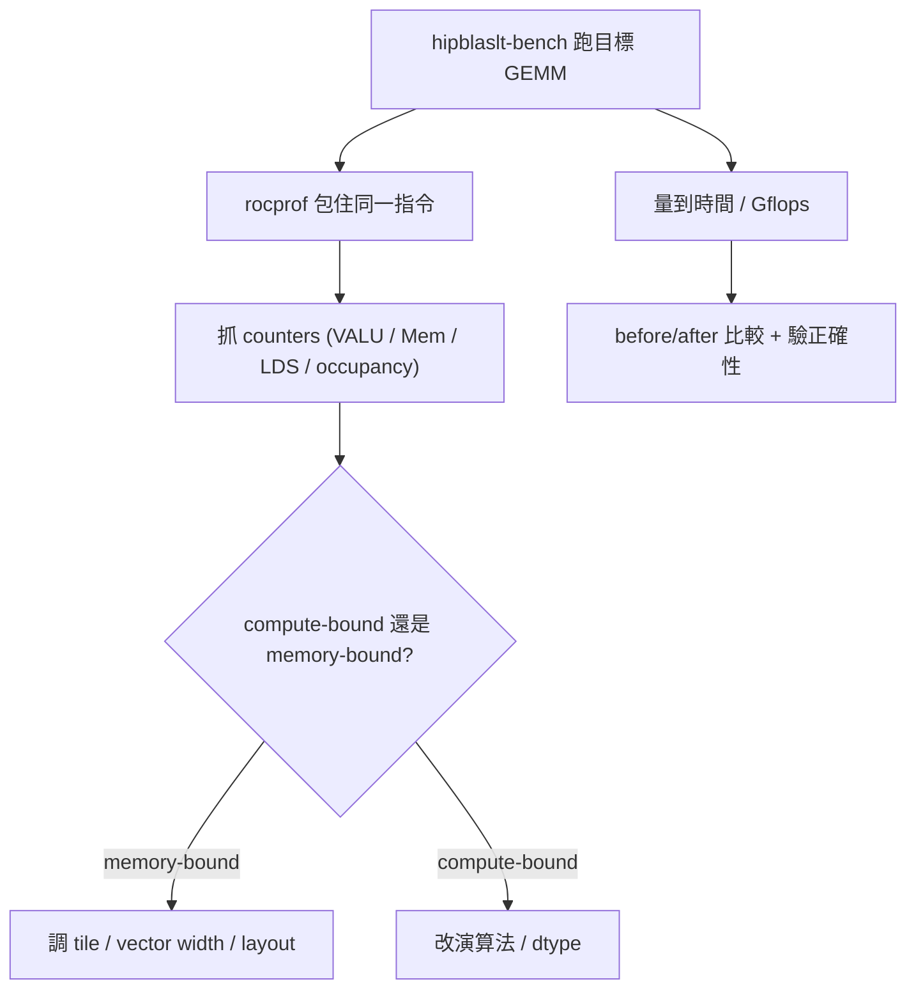

# 用 rocprof 量測 + 用 TensileLite 驗證最佳化

路徑說明：本檔在 repo 內的 `study_docs/hipblaslt/`，code 連結為相對路徑（`../../projects/...`，先回到 repo root 再進 `projects/`）。行號可能隨 commit 漂移，對不上時以符號名稱為準。建議先讀 [gemm-optimization.md](gemm-optimization.md)。

## 白話總覽

最佳化要回答兩個問題：

1. **變快了嗎？** → 比 before/after 的執行時間 / Gflops（用 `hipblaslt-bench` 或 TensileLite benchmark）。
2. **為什麼變快 / 還卡在哪？** → 看 kernel 內部指標（用 `rocprof`）：算力有沒有吃滿、記憶體頻寬瓶頸、
   暫存器/LDS 用量、佔用率（occupancy）等。

兩者搭配：bench 給你「結果數字」，rocprof 給你「原因」。

名詞：
- **occupancy（佔用率）** = GPU 上同時有多少 wavefront 在跑，太低通常代表暫存器/LDS 用太多。
- **rocprof** = ROCm 的 GPU profiler，可抓 kernel 時間與硬體計數器（counters）。

## 架構 / 流程圖



## 逐步 trace

### 第一步：用 hipblaslt-bench 產生一個可量測的 kernel

`hipblaslt-bench` 能跑指定大小的 GEMM 並印出用到的 kernel/solution，是 profiling 的好起點。

```bash
cd /data1/perlee/rocm-libraries/projects/hipblaslt/build/release
./clients/hipblaslt-bench -m 4096 -n 4096 -k 4096 \
    --a_type bf16_r --b_type bf16_r --c_type bf16_r --d_type bf16_r \
    --compute_type f32_r --print_kernel_info -i 50 -j 10
```

常用旗標（完整見 [clients/bench/README.md](../../projects/hipblaslt/clients/bench/README.md)）：

| 旗標 | 用途 |
|------|------|
| `-m -n -k` | 矩陣大小 M/N/K |
| `--algo_method index --solution_index <idx>` | 固定用某個 solution，做受控比較 |
| `--print_kernel_info` | 印出 solution / kernel 名 / index |
| `-i / -j` | timing 迭代數 / 暖機（cold）迭代數 |
| `--use_gpu_timer` | 用 GPU 計時（更準的 kernel 時間） |
| `-v` | 跟 CPU 結果比對驗證正確性 |

效率/額外效能欄位可用環境變數打開：

```bash
HIPBLASLT_BENCH_PERF=1 ./clients/hipblaslt-bench -m 4096 -n 4864 -k 32896 \
    --a_type bf16_r --b_type bf16_r --c_type bf16_r --d_type bf16_r \
    --compute_type f32_r --iters 200 --cold_iters 50 --use_gpu_timer
```

### 第二步：用 rocprof 抓硬體指標

用 rocprof 包住上面的 bench 指令即可。實際指令名稱依環境上的版本而定（`rocprof` / `rocprofv2` /
`rocprofv3`），先用 `--help` 確認。

抓 kernel 時間與 trace：

```bash
rocprofv2 --hip-trace --hsa-trace \
  ./clients/hipblaslt-bench -m 4096 -n 4096 -k 4096 \
    --a_type bf16_r --b_type bf16_r --c_type bf16_r --d_type bf16_r \
    --compute_type f32_r -i 50 -j 10
```

抓特定 counters：

```bash
# metrics.txt 內容，例如：
#   pmc: VALUUtilization VALUBusy MemUnitBusy MemUnitStalled LDSBankConflict
rocprofv2 -i metrics.txt -o prof.csv \
  ./clients/hipblaslt-bench -m 4096 -n 4096 -k 4096 \
    --a_type bf16_r --b_type bf16_r --c_type bf16_r --d_type bf16_r --compute_type f32_r
```

repo 內 TensileLite client 也整合了 rocprofiler，想看「程式如何讀 counters」可參考：

- [RocProfiler.cpp](../../projects/hipblaslt/tensilelite/client/src/RocProfiler.cpp)
- [Profiler.hpp](../../projects/hipblaslt/tensilelite/client/include/Profiler.hpp)

### 第三步：怎麼讀這些指標（白話對照）

| 觀察到 | 可能含義 | 通常往哪調 |
|--------|----------|------------|
| VALU/MFMA busy 很高、時間接近理論值 | 算力吃滿，接近 compute-bound | 已不錯；改演算法或資料型別才有空間 |
| MemUnit busy/stalled 高、算力低 | 卡在記憶體頻寬（memory-bound） | 加大 tile / 改 vector width / 改 layout 提高重用 |
| LDS bank conflict 高 | shared memory 存取衝突 | 調整 LDS padding / 存取 pattern |
| occupancy 低、暫存器用量高 | 暫存器壓力大 | 減小 tile / 減少 unroll |

> 務實順序：先看 kernel 時間 → 判斷 compute-bound 還是 memory-bound → 再針對瓶頸調對應參數
> （參數在哪改見 [gemm-optimization.md](gemm-optimization.md)）。

### 第四步：用 TensileLite benchmark 驗證最佳化是真的

`hipblaslt-bench` 是整合後的端到端量測；TensileLite benchmark 則在 tuning 階段就比較候選 kernel，
數據落在 `out/2_BenchmarkData/*.csv`（含每個 solution 的 Gflops）。before/after 標準做法：

1. 用**同一份 config、同一台 GPU、同樣的 iters/cold_iters**，分別量「改之前」與「改之後」。
2. 比較 `2_BenchmarkData` 的 Gflops，或 `hipblaslt-bench` 的時間 / `HIPBLASLT_BENCH_PERF=1` 的 efficiency。
3. 多跑幾次取中位數，避免頻率波動造成假象（可用 `HIPBLASLT_BENCH_FREQ=1` 觀察頻率）。
4. 務必加 `-v` 確認結果正確，「快但算錯」不算數。

TensileLite 三階段與輸出位置見 [tensilelite-pipeline.md](tensilelite-pipeline.md)。

## 關鍵資料結構

| 結構 | 角色（白話） | 位置 |
|------|--------------|------|
| `RocProfiler` (client) | TensileLite client 內讀取 rocprofiler counters 的實作 | [定義](../../projects/hipblaslt/tensilelite/client/src/RocProfiler.cpp) |
| `Profiler` 介面 | client profiler 的抽象介面 | [定義](../../projects/hipblaslt/tensilelite/client/include/Profiler.hpp) |

## 如何建置 / 執行以觀察此流程

需先用 `--clients` 建好 `hipblaslt-bench`（建置細節見官方
[AGENTS.md](../../projects/hipblaslt/AGENTS.md)），再依上面第一、二步執行。

## Terminology

- `occupancy` - 同時在跑的 wavefront 數量；低代表資源壓力大。
- `compute-bound` - 瓶頸在算力。
- `memory-bound` - 瓶頸在記憶體頻寬。
- `counters` - GPU 硬體計數器（VALU busy、MemUnit busy 等）。
- `Gflops` - 每秒十億次浮點運算，常用效能指標。

## 交叉連結

- 上一層全局：[README.md](README.md)
- 要改哪些參數來改善瓶頸：[gemm-optimization.md](gemm-optimization.md)
- benchmark 數據怎麼產生：[tensilelite-pipeline.md](tensilelite-pipeline.md)
- build / PR 規範見官方 [AGENTS.md](../../projects/hipblaslt/AGENTS.md)（本文件不重複）。

## 待擴充：bench + rocprof cookbook（roofline 數字）

> **狀態：outline，待擴充。** 對應 roadmap：**P0 / 06-30** 與 **P3**。以下為大綱，內容會補上。

- 可直接貼的 metrics 清單：`VALUUtilization`、`VALUBusy`、`MemUnitBusy`、`MemUnitStalled`、
  `LDSBankConflict`、`Wavefronts`（每個一句：看什麼瓶頸）
- MI300X roofline 數字：FP16/BF16 峰值 FLOP/s、HBM 峰值頻寬、ridge point
- 從 GEMM 維度算 arithmetic intensity，判斷落在 roofline 哪一側（compute- vs memory-bound 界線）
- 常見診斷 recipe：memory-bound 怎麼救（向量化載入 / coalescing）、compute-bound 怎麼救
  （MFMA 利用率 / occupancy）
- hipBLASLt 端的 bench / 除錯旋鈕（內部參考 [internal_docs/hipblaslt-tensilelite-reference.md](../internal_docs/hipblaslt-tensilelite-reference.md)
  Module A.5/B.4）：`--print_kernel_info`、`HIPBLASLT_LOG_MASK=64` + `HIPBLASLT_LOG_FILE`、`HIPBLASLT_BENCH_FREQ`；
  以及內部「hipBLASlt Startup Guide into Profiling, Debugging and Optimization」(pageId `1179073633`，可經 MCP 抓)

### 實測 baseline：MI300X / bf16 4096³（第一次跑通）

作為之後調參對照的具體起點（P2 調參會回頭比對）：

- **指令**：`./build/release/clients/hipblaslt-bench -m 4096 -n 4096 -k 4096 -r bf16_r --compute_type f32_r --print_kernel_info`
- **環境**：MI300X（gfx942），ROCm 7.2.4；自編 hipBLASLt（`--architecture=gfx942 --skip_rocroller`）
- **選到的 solution**：index `90105`，name `Cijk_Ailk_Bljk_BBS_BH_UserArgs_MT256x224x64_MI16x16x1_..._ISA942_...`（MacroTile 256×224×64 / MI 16×16×1 / GSU1）
- **效能**：`607868` Gflops（≈ 608 TFLOPS，約 **47% bf16 peak**）、GB/s `414.64`、時間 `226.1 us`
- **其他**：`Is supported 1 / Total solutions: 1`
- **換算驗證**：`2·4096³ ≈ 137.4 GFLOP ÷ 226.1 µs ≈ 608 TFLOPS`，與輸出一致

> kernel 名含 `ISA942` 代表確實跑在 gfx942 上；早期用 gfx90a build 的執行檔放到 MI300X 會一啟動就 segfault，排查與解法見 [../architecture/shared-and-build.md](../architecture/shared-and-build.md) 的〈常見建置踩坑〉。

## 一句話總結

> bench 回答「快多少」，rocprof 回答「為什麼」，TensileLite benchmark 在 tuning 階段就能比候選 kernel。
> 控制變因 + 取中位數 + 驗正確性，最佳化才站得住腳。
