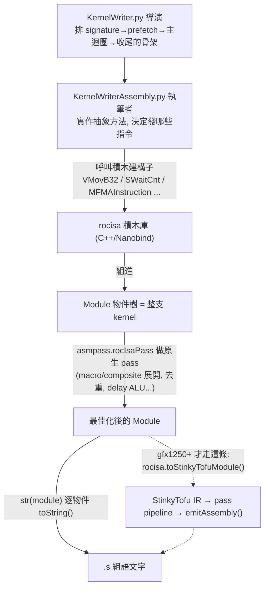

# rocisa 深入導讀：用程式積木「組」出 AMDGPU 組合語言

> 路徑說明：本檔在 `study_docs/hipblaslt/`，原始碼連結用相對路徑（`../../projects/...`，先回到 repo root 再進 `projects/`）。**行號會隨 commit 漂移，交叉引用一律以符號名稱（類別/函式名、檔名）為準。** rocisa 原始碼在 [`../../projects/hipblaslt/tensilelite/rocisa`](../../projects/hipblaslt/tensilelite/rocisa)。
>
> 建議先讀 [kernelwriter-implementation.md](kernelwriter-implementation.md)（誰在用 rocisa）與 [tensilelite-pipeline.md](tensilelite-pipeline.md)（整條產 kernel 的流水線）。本篇補的是「rocisa 這個積木庫**自己**長什麼樣、怎麼運作、怎麼改」。

## 一分鐘總覽

- **rocisa 是什麼**：一個 **C++ 寫的「AMDGPU 組合語言產生器」**，再用 **Nanobind** 把它綁定成 Python 模組 `rocisa`。它提供「**一個 Python 物件 = 一條組語指令**」的積木（例如 `VMovB32`、`SWaitCnt`、`SBarrier`、`MFMAInstruction`），以及把這些積木串起來的容器 `Module`。
- **誰在用它**：TensileLite 的 [`KernelWriterAssembly.py`](../../projects/hipblaslt/tensilelite/Tensile/KernelWriterAssembly.py) 拿這些積木，一條一條「拼」出整支 GEMM kernel 的組語，最後 `str()` 成 `.s` 文字丟去組譯。
- **為什麼不直接寫 C++ 給 Clang/LLVM 編**：因為 TensileLite 要**程式化地、依 tuning 參數動態決定**每條指令（發幾個 `buffer_load`、MFMA 怎麼排、prefetch 幾輪…）。用 Python 物件表示每條指令，才好做排程、計數、改寫、插等待指令這些「對指令做手術」的事——這是走 C++/Clang 拿不到的控制粒度。
- **和 StinkyTofu 的關係**：舊架構（gfx942 等）rocisa 產出的組語**直接就是最終組語**；新架構（gfx1250+）則把 rocisa 組語透過 `rocisa.toStinkyTofuModule(...)` 轉成 StinkyTofu IR 再最佳化。詳見 [與 StinkyTofu 的介面](#七與-stinkytofu-的介面) 與 [../stinkytofu/README.md](../stinkytofu/README.md)。

---

## 一、rocisa 是什麼、為什麼存在

### 先講白話 why

要把一支 GPU kernel 寫成組合語言，最直覺的做法是「人手寫一份 `.s` 檔」。但 TensileLite 的處境不同：它要為**成千上萬種 tuning 參數組合**各自產生一支專屬 kernel（不同 tile 大小、不同 unroll、不同資料型別、不同 prefetch 深度……）。人手寫不可能，必須**用程式生成組語**。

「用程式生成組語」最陽春的寫法是字串拼接：

```python
kernel_str = ""
kernel_str += "v_mov_b32 v0, 1\n"
kernel_str += "s_waitcnt vmcnt(0)\n"
# ...
```

這樣能動，但很快就會失控：你想「數一數這支 kernel 用了幾條 MFMA」「把某段的等待指令重排」「依硬體能力換一個指令變體」時，面對的是一坨**無結構的字串**，什麼都難做。

rocisa 的解法是：**把每一條指令做成一個物件**。`v_mov_b32 v0, 1` 不再是字串，而是一個 `VMovB32(vgpr(0), 1)` 物件；整支 kernel 是一棵由這些物件組成的樹（`Module`）。物件知道自己是什麼指令、用了哪些暫存器、issue latency 多少、印出來長怎樣。於是「數指令」「重排」「改寫」「插 waitcnt」全都變成「對物件樹做操作」，乾淨又可程式化。

> 一句話：**rocisa 把「組語文字」升級成「組語物件樹」，讓 TensileLite 能像操作資料結構一樣操作一支 kernel。**

### 為什麼不走 Clang/LLVM

一個常見疑問：AMD 有 `amdclang++`，為什麼 TensileLite 不直接寫 C++/HIP 讓編譯器產指令？取捨在於**控制粒度**：

- 走 Clang/LLVM：你交出「高階程式碼」，由編譯器決定暫存器分配、指令選擇與排程。方便，但 TensileLite 想要的「這一輪 unroll 精確發這幾條 `ds_read`、MFMA 卡在第幾個 slot、prefetch 提前幾圈」這種**逐指令、逐週期的手工排程**，交給編譯器就拿不回來了。
- 走 rocisa：TensileLite **自己掌握每一條指令**，能做極細緻的軟體管線化（software pipelining）與延遲隱藏——這正是高效能 GEMM kernel 的關鍵。代價是要自己維護一套「組語積木庫 + 排程邏輯」，也就是 rocisa + `KernelWriter*`。

> 對照練 ISA 那條軌（[../amd-isa-kernel.md](../amd-isa-kernel.md)）：階段 A 你用 `hipcc` 編 C++ 反組譯看 ISA（走 LLVM）；階段 B 讀 TensileLite 的輸出，那是 **rocisa 程式化產生**、沒經過 Clang/LLVM 的組語。兩者是不同的產生路徑。

---

## 二、在整條流水線的定位

rocisa 是 codegen 的**最內層積木**。往外一層層包：`KernelWriter.py`（導演/排程）→ `KernelWriterAssembly.py`（執筆者/發指令）→ **rocisa（積木）**；產出的組語之後，較新架構再交給 StinkyTofu 加工。



聚焦看 rocisa 自己：它同時扮演三個角色（本篇後續逐一展開）——

1. **積木供應商**：提供所有指令類別 + 容器 `Module`（[三](#三目錄結構導覽)、[四](#四核心概念一個-python-物件一條指令)）。
2. **原生最佳化器**：`rocisa.asmpass.rocIsaPass` 對 `Module` 做一輪 pass（展開 macro/composite、去重複、插 delay ALU、估 cycles），見 [六](#六rocisa-自己的-pass層asmpass)。
3. **StinkyTofu 橋接點**：把 rocisa 的 `Module` 轉成 StinkyTofu IR，見 [七](#七與-stinkytofu-的介面)。

> 導演/執筆者的分工細節不在此重述，見 [kernelwriter-implementation.md](kernelwriter-implementation.md) 的〈白話總覽：兩個人分工寫組語〉。本篇只從「積木被誰、怎麼呼叫」的角度帶到 rocisa 邊界。

---

## 三、目錄結構導覽

以下依實際原始碼（[`rocisa/`](../../projects/hipblaslt/tensilelite/rocisa)）整理。C++ 採「header (`include/`) 放定義、source (`src/`) 放 Nanobind 綁定」的分工：**指令/容器的 C++ 類別多半定義在 `.hpp`，而對應的 `.cpp` 主要負責把它 `def` 給 Python**。

| 路徑 | 角色 |
|------|------|
| [`rocisa/__init__.py`](../../projects/hipblaslt/tensilelite/rocisa/rocisa/__init__.py) | Python 套件入口：`from ._rocisa import *`，把 C++ 子模組註冊到 `rocisa.*` 命名空間，並做**過期檢查**（見下）與定義 `hasStinkyTofuBackend()`。 |
| [`rocisa/src/main.cpp`](../../projects/hipblaslt/tensilelite/rocisa/rocisa/src/main.cpp) | **Nanobind 模組入口** `NB_MODULE(_rocisa, m)`：依序呼叫各 `init_*(m)` 建立子模組；並 `registerAllBackends()` 註冊 StinkyTofu backend。 |
| [`rocisa/include/base.hpp`](../../projects/hipblaslt/tensilelite/rocisa/rocisa/include/base.hpp) | 最底層基底 `Item`（所有節點的父類）與全域單例 `rocIsa`（存 kernel/硬體能力、輸出選項）。 |
| [`rocisa/include/code.hpp`](../../projects/hipblaslt/tensilelite/rocisa/rocisa/include/code.hpp) | **容器層**：`Module`（指令樹）、`TextBlock`、`Label`、`Macro`、`StructuredModule`、`KernelBody`、簽章相關 `Signature*`、buffer SRD 的 `SrdUpperValue*`。 |
| [`rocisa/include/container.hpp`](../../projects/hipblaslt/tensilelite/rocisa/rocisa/include/container.hpp) | **運算元層**：`Container` / `RegisterContainer`，以及 `vgpr()` / `sgpr()` / `accvgpr()` 這些「產生暫存器運算元」的工廠函式。 |
| [`rocisa/include/instruction/instruction.hpp`](../../projects/hipblaslt/tensilelite/rocisa/rocisa/include/instruction/instruction.hpp) | **指令基底**：`Instruction`、`CommonInstruction`（大多數 VALU/SALU 指令的父類）、`CompositeInstruction`（一個物件展開成多條指令）、`MacroInstruction`。 |
| `rocisa/include/instruction/*.hpp` + `src/instruction/*.cpp` | **各類指令定義**（見下表），按功能分檔。 |
| [`rocisa/include/register.hpp`](../../projects/hipblaslt/tensilelite/rocisa/rocisa/include/register.hpp) | `RegisterPool`：VGPR/SGPR 的配置池（checkout/checkin、對齊、overflow、統計 occupancy）。 |
| [`rocisa/include/enum.hpp`](../../projects/hipblaslt/tensilelite/rocisa/rocisa/include/enum.hpp) | 列舉：`InstType`（指令/資料型別如 `INST_F16`/`INST_F8`…）、`RegisterType`、`DataTypeEnum` 等。 |
| [`rocisa/src/functions/`](../../projects/hipblaslt/tensilelite/rocisa/rocisa/src/functions) | **高階 helper**：不是單一指令，而是「一小段常用序列」的產生器，如 `vectorStaticDivide`（向量整數除法展開）、cast、branch 輔助。 |
| [`rocisa/src/pass/`](../../projects/hipblaslt/tensilelite/rocisa/rocisa/src/pass) | **rocisa 原生 pass**：`pass.cpp`（入口 `rocIsaPass`）、`graph.cpp`（建暫存器相依圖）、`composite.cpp` / `macro_inline.cpp`（展開）、`remove.cpp`（去重）、`insert_delay_alu.cpp`、`cycle.cpp`（估 cycles）。 |
| [`rocisa/src/count.cpp`](../../projects/hipblaslt/tensilelite/rocisa/rocisa/src/count.cpp) | 計數工具：`countInstruction` / `countMFMA` / `countGlobalRead` / `countLocalWrite` … 供 `KernelWriter` 統計指令數。 |
| [`rocisa/CMakeLists.txt`](../../projects/hipblaslt/tensilelite/rocisa/CMakeLists.txt)、[`pyproject.toml`](../../projects/hipblaslt/tensilelite/rocisa/pyproject.toml) | build 設定（scikit-build-core + nanobind，連 `stinkytofu` 與 `origami`）。 |
| [`rocisa/docs/`](../../projects/hipblaslt/tensilelite/rocisa/docs) | 官方開發者小抄：`how-to-add-a-class.md`、`how-to-add-a-function.md`、`using-rocisa-in-tensilelite.md`。 |
| [`rocisa/test/`](../../projects/hipblaslt/tensilelite/rocisa/test) | pytest：`test_instruction.py`、`test_code.py`、`test_container.py`、pass/plugin 測試等。 |

### 指令定義分檔（`include/instruction/` + `src/instruction/`）

| 檔名（`*.hpp` / `*.cpp`） | 涵蓋的指令族 | 代表類別 |
|------|------|------|
| `common` | 一般 VALU / SALU / 同步 | `VMovB32`、`SMovB32`、`SBarrier`、`SNop`、`SWaitCnt` |
| `mem` | 記憶體搬運 | `BufferLoadB128/B64/B32`、`DSStore*`、`DSLoad*`、`GlobalReadInstruction`/`LocalReadInstruction` 家族 |
| `mfma` | 矩陣乘加 | `MFMAInstruction`、`SMFMAInstruction`（sparse）、`MXMFMAInstruction`（帶 scale 的 MX 格式） |
| `branch` | 分支/跳轉 | `BranchInstruction`、long-branch 系列 |
| `cmp` | 比較 | `VCmp*` / `SCmp*` |
| `cvt` | 型別轉換 | `VCvt*`（f32↔f16、pk fp8…） |
| `extension` | 擴充/組合指令（多為 `CompositeInstruction`） | e.g. `ECvt*` |

> 關鍵發現（供核對）：**`mem.cpp` 是最大宗的指令檔**，因為 GEMM 的搬運指令變體最多（不同寬度、buffer/global/ds、DirectToLds…）；MFMA 檔雖然只三個類別，但單一 `MFMAInstruction` 內部靠 `variant`（`[M,N,K,B]`）與 `InstType`/硬體能力旗標，就能展開出 fp16/bf16/fp8/fp6/fp4… 幾十種指令字串。

---

## 四、核心概念：一個 Python 物件 = 一條指令

### 4.1 積木模型：Item → Instruction / Module

rocisa 的一切都是 `Item`（[`base.hpp`](../../projects/hipblaslt/tensilelite/rocisa/rocisa/include/base.hpp)）。兩個最重要的子類：

- **`Instruction`**（[`instruction.hpp`](../../projects/hipblaslt/tensilelite/rocisa/rocisa/include/instruction/instruction.hpp)）：一片葉子，代表**一條**指令。每個具體指令類別都覆寫關鍵方法：
  - `toString()`：印出這條指令的組語文字（例如 `v_mfma_f32_16x16x16_f16 a[0:3], v0, v1, a[0:3]`）。
  - `getParams()` / `getSrcParams()` / `getDstParams()`：回傳運算元清單（給排程/相依分析用）。
  - `getIssueLatency()`：這條指令的發射延遲（排程器藏延遲時要用）。
- **`Module`**（[`code.hpp`](../../projects/hipblaslt/tensilelite/rocisa/rocisa/include/code.hpp)）：一個**容器節點**，`itemList` 裝一串 `Item`（可以是指令，也可以是子 `Module`，因此是一棵樹）。整支 kernel 就是一個大 `Module`。

`Module` 提供大量「組裝」方法（節錄）：

- `add(item, pos=-1)` / `addItems([...])`：把積木加進來（`pos` 可插指定位置）。
- `addComment(...)` / `addComment0/1/2(...)`：加註解 `TextBlock`。
- `appendModule(m)` / `addModuleAsFlatItems(m)`：把另一個 `Module` 的內容併進來。
- `toString()`：**遞迴**把每個子項的 `toString()` 串起來 → 整段組語。
- `prettyPrint()`：印出樹狀結構（除錯用）。
- `countType(cls)` / `flatitems()` / `findNamedItem(name)`：查詢/走訪。

> 之所以做成「樹」而不是「一條長清單」，是為了讓 `KernelWriter` 能**把 kernel 分段命名管理**（signature 一段、prefetch 一段、主迴圈一段…），排程時整段整段搬移、抽換、計數。

### 4.2 運算元：`vgpr()` / `sgpr()`

指令的暫存器運算元用工廠函式產生（[`container.hpp`](../../projects/hipblaslt/tensilelite/rocisa/rocisa/include/container.hpp)），回傳 `RegisterContainer`：

- `vgpr(idx, regNum=1)` / `vgpr("name")`：向量暫存器（每 lane 各一份）。
- `sgpr(idx, regNum=1)` / `sgpr("name")`：純量暫存器（整個 wave 共用）。
- `accvgpr(...)`：accumulator VGPR（MFMA 的累加暫存器）。

`regNum` 表示佔幾個連號暫存器（例如一個 64-bit 位址用 `sgpr(x, 2)`）。實際「哪個編號給誰用」由 `RegisterPool`（[`register.hpp`](../../projects/hipblaslt/tensilelite/rocisa/rocisa/include/register.hpp)）的 checkout/checkin 管理。

### 4.3 常見指令類別舉例（附 Python 用法）

下面示範「用積木拼一小段」的感覺（Python 端，實際由 `KernelWriterAssembly` 呼叫；建構子簽章以 `src/instruction/*.cpp` 的 Nanobind `nb::arg` 為準）：

```python
from rocisa.code import Module
from rocisa.container import vgpr, sgpr
from rocisa.instruction import VMovB32, SMovB32, SBarrier, SWaitCnt

mod = Module("demo")
mod.add(SMovB32(sgpr(0), 0, comment="s0 = 0"))            # s_mov_b32 s0, 0
mod.add(VMovB32(vgpr(1), 1, comment="v1 = 1"))            # v_mov_b32 v1, 1
mod.add(SWaitCnt(vlcnt=0, comment="wait all VMEM loads")) # 等載入計數歸零(composite, 見下)
mod.add(SBarrier(comment="sync workgroup"))               # s_barrier
print(str(mod))   # 遞迴印出這幾條的組語文字
```

各類別的定位：

| 積木 | 定義處（符號） | 白話 |
|------|------|------|
| `VMovB32` | `common.hpp` `struct VMovB32 : CommonInstruction` | `v_mov_b32`：搬一個 32-bit 值進 VGPR。典型 `CommonInstruction`（有 dst + srcs，可帶 DPP/SDWA/VOP3 修飾）。 |
| `SMovB32` | `common.hpp` `struct SMovB32 : CommonInstruction` | `s_mov_b32`：純量版搬值。 |
| `SBarrier` | `common.hpp` `struct SBarrier : Instruction` | `s_barrier`：workgroup 同步；依硬體能力（`HasNewBarrier`/`HasClusterBarrier`）決定實際發哪種 barrier。 |
| `SWaitCnt` | `common.hpp` `struct SWaitCnt : CompositeInstruction` | 等待記憶體計數歸零（`vlcnt`/`vscnt`/`dscnt`/`kmcnt`）。是 **composite**：依 ISA 可能展開成 `s_waitcnt vmcnt(x) lgkmcnt(y)` 或分開的新指令。 |
| `MFMAInstruction` | `mfma.hpp` `struct MFMAInstruction : Instruction` | `v_mfma_*`：矩陣乘加。詳見 [五](#五以-mfma-為例如何新增修改一條指令)。 |

> 名詞：**`CompositeInstruction`**（[`instruction.hpp`](../../projects/hipblaslt/tensilelite/rocisa/rocisa/include/instruction/instruction.hpp)）= 一個「看起來是一條」的物件，`toString()` 時其實會 `setupInstructions()` 展開成**多條**真指令。`SWaitCnt` 就是這樣：對外是一個等待語意，對內依架構拆成正確的等待指令組合。原生 pass 的 `compositeToInstruction` 會在最佳化前把它們攤平（見 [六](#六rocisa-自己的-pass層asmpass)）。

---

## 五、以 MFMA 為例：如何新增/修改一條指令

MFMA 是 GEMM 的算力核心，也是最能說明「rocisa 一個類別涵蓋一大堆指令變體」的例子。實作面看兩個檔：

- **定義**：[`rocisa/include/instruction/mfma.hpp`](../../projects/hipblaslt/tensilelite/rocisa/rocisa/include/instruction/mfma.hpp) — `struct MFMAInstruction : public Instruction`。
- **綁定**：[`rocisa/src/instruction/mfma.cpp`](../../projects/hipblaslt/tensilelite/rocisa/rocisa/src/instruction/mfma.cpp) — `void mfma_inst(nb::module_ m_mfma)` 把它 `def` 給 Python。

### 5.1 `MFMAInstruction` 的欄位與它怎麼變成指令字串

建構子（符號 `MFMAInstruction(...)`）的關鍵參數：

- `instType`：輸入資料型別（`InstType::INST_F16`、`INST_BF16`、`INST_F8`、`INST_F8_BF8`、`INST_F6`、`INST_F4`…）。
- `accType`：累加型別（通常 `INST_F32`）。
- `variant`：`std::vector<int>`，即 `[M, N, K, B]`——MFMA 的幾何（例如 `16×16×16`，`B` 為 blocks）。
- `mfma1k`：是否為 `_1k` 變體。
- `acc` / `a` / `b`：累加器與兩個輸入運算元（`RegisterContainer`）。
- `acc2`（或 `acc2_imm`）、`neg`、`reuseA`/`reuseB`（gfx1250 的 matrix-reuse hint）。

字串怎麼組出來（讀 `mfma.hpp` 的 `preStr()` / `getArgStr()` / `typeConvert()`）：

- `preStr()` 依 `accType`、`variant`、硬體能力旗標（`getAsmCaps()["HasMFMA"]`、`HasMFMA_explictB`、`HasWMMA*`…）拼出**指令助憶碼**，例如 `v_mfma_f32_16x16x16_f16`；在只有 WMMA 的架構上則會變成 `v_wmma_*`。
- `typeConvert(InstType)` 把型別列舉翻成字尾字串（`f16`/`bf16`/`i8`/`f8f6f4`/`f4`…），還會依 `variant[2]`（K）與 `HasWMMA_V3` 等能力挑對的字尾。
- `getArgStr()` 補運算元與 `cbsz`/`blgp`（fp8/fp6/fp4 的輸入排列）、`matrix_*_fmt`（WMMA）、`neg_lo`、`matrix_a_reuse` 等修飾。
- `getIssueLatency()` 透過 template `getMFMAIssueLatency<isSparse>(dataType, variant[0], variant[3])` 算延遲（依 arch 與型別調整 `mi_divisor`）。

> 關鍵發現（供核對）：**一個 `MFMAInstruction` 類別 = 幾十種硬體指令**。它不是「一個 opcode 一個類別」，而是把 opcode 拆成「助憶碼骨架 + `InstType`/`variant`/`asmCaps` 決定的變體」。所以想支援「新的 MFMA 型別組合」，多半不是加新類別，而是在 `typeConvert()`/`getArgStr()` 的 `switch` 補一個 `InstType` 分支。同檔還有 `SMFMAInstruction`（結構化稀疏，多一個 `metadata` 運算元）與 `MXMFMAInstruction`（MX 縮放格式，多 `mxsa`/`mxsb`/`mxScale*Type`）。

### 5.2 新增/修改一條指令的實作路徑（通則）

照官方 [`docs/how-to-add-a-class.md`](../../projects/hipblaslt/tensilelite/rocisa/docs/how-to-add-a-class.md) 的步驟，配合上面觀察，通則是：

1. **改字串產生就好** → 只動對應 `*.hpp` 裡該類別的 `preStr()` / `getArgStr()` / `typeConvert()`（例如新增一個 `InstType` 分支）。多數「支援新型別變體」屬於這類，**不必碰 Python**。
2. **要新增一個指令類別** → 在對應 `*.hpp` 定義 `struct X : public CommonInstruction`（或 `Instruction` / `CompositeInstruction`），實作建構子與 `toString()`／`getParams()` 等；並依 [`how-to-add-a-class.md`](../../projects/hipblaslt/tensilelite/rocisa/docs/how-to-add-a-class.md) 加上**拷貝建構子**與 `clone()`（deepcopy 要用）。
3. **暴露給 Python** → 在對應 `*.cpp` 的 `xxx_inst(nb::module_ m)` 裡 `nb::class_<X, 父類>(m, "X").def(nb::init<...>(), nb::arg(...)=...)`，並 `def("__str__", &X::toString)`、`def("__deepcopy__", ...)`。若參數順序敏感，可用 `nb::kw_only()` 強制 Python 端具名傳參（`MXMFMAInstruction` 就這樣做，避免 C++ 簽章調動造成 silent 錯綁）。
4. **重編** → `invoke rocisa`（見 [八](#八nanobind-綁定與-build)）。因為有 [過期檢查](#82-過期檢查staleness)，忘了重編會直接 `ImportError`。

> 想加的是「一小段常用序列」而非單一指令（例如某種除法展開），放到 [`functions/`](../../projects/hipblaslt/tensilelite/rocisa/rocisa/src/functions) 當 helper，作法見 [`how-to-add-a-function.md`](../../projects/hipblaslt/tensilelite/rocisa/docs/how-to-add-a-function.md)。

---

## 六、rocisa 自己的 pass 層（asmpass）

除了「產指令」，rocisa 還有一層**原生最佳化**，入口是 `rocisa.asmpass.rocIsaPass`（C++ 在 [`src/pass/pass.cpp`](../../projects/hipblaslt/tensilelite/rocisa/rocisa/src/pass/pass.cpp)）。`KernelWriter.py` 產完 `Module` 後會呼叫它。流程（讀 `rocIsaPass()`）：

1. `removeDuplicatedFunction`（可選）：移除重複的 function 區塊。
2. `macroToInstruction` + `compositeToInstruction`：把 `Macro` 與 `CompositeInstruction`（如 `SWaitCnt`）**攤平**成真正的指令序列。
3. `convertTextVariablesToRegisters`：把文字變數換成暫存器。
4. 若開最佳化（`doOpt()`）：`buildGraph` 建暫存器相依圖 → `removeDuplicateAssignment`（去掉多餘賦值）→ 回報 pass 後的 `maxVgpr`。
5. `insertDelayAlu`（可選）：插入 `s_delay_alu` 之類的排程提示。
6. `getCycles`（可選）：估算 cycle 數（`cycle.cpp`）。

參數/回傳由 `rocIsaPassOption`（`insertDelayAlu`/`removeDupFunc`/`removeDupAssign`/`getCycles`/`numWaves`）與 `rocIsaPassResult`（`cycles`/`maxVgpr`）承載。

> **與既有文件的一處出入（以原始碼為準）**：[../stinkytofu/tensilelite-integration.md](../stinkytofu/tensilelite-integration.md) 說 rocisa「較少系統性的 pass-based 最佳化」。更精確地說：**rocisa 確實有自己的一層 pass**（去重、相依圖、delay ALU、cycle 估算），只是規模與抽象程度不如 StinkyTofu 的 LLVM 風格 pass manager。所以差別是「輕量原生 pass」vs「完整 IR + pass pipeline」，而非「有 vs 沒有」。

---

## 七、與 StinkyTofu 的介面

rocisa 是 StinkyTofu 的**上游**與**橋接點**。切分標準是 GPU 架構：舊架構走 rocisa（rocisa 產出即最終組語），gfx1250+ 走 StinkyTofu。相關函式都掛在 `rocisa` 頂層（因為 StinkyTofu 被**編進同一個 `_rocisa.so`**，見 `main.cpp` 的 `init_stinkytofu(m)` 與 `registerAllBackends()`）：

| 函式 | 用途 | 誰呼叫 |
|------|------|------|
| `rocisa.hasStinkyTofuBackend()` | 這次 build 有沒有把 StinkyTofu 編進來（[`__init__.py`](../../projects/hipblaslt/tensilelite/rocisa/rocisa/__init__.py) 靠 `hasattr` 判斷）。 | [`Solution.py`](../../projects/hipblaslt/tensilelite/Tensile/SolutionStructs/Solution.py) 檢查 `ScheduleIterAlg==4` 時 |
| `rocisa.isSupportedByStinkyTofu(isaVersion)` | **這個架構**有沒有 StinkyTofu backend。 | `Solution.py`、[`KernelWriter.py`](../../projects/hipblaslt/tensilelite/Tensile/KernelWriter.py) |
| `rocisa.getRegisteredArchKeys()` | 列出目前註冊了哪些架構 backend。 | 除錯/檢查支援清單 |
| `rocisa.toStinkyTofuModule(body, version, name, signature=..., ...)` | 把 rocisa 的 `Module`（`moduleKernelBody.body`）**轉成 StinkyTofu IR**。 | `KernelWriter.py`（`_StinkyTofuOptLevel` 有值且架構支援時） |

轉換後由 StinkyTofu 跑 pass pipeline、`emitAssembly()` 吐回最佳化組語，當成這支 kernel 的最終組語。**這裡只點出介面，內部運作與觸發旗標（`ScheduleIterAlg=4` → remap → 轉換 → pipeline → emit）不重寫**，完整流程見：

- 觸發與轉換路徑：[../stinkytofu/tensilelite-integration.md](../stinkytofu/tensilelite-integration.md)
- rocisa vs StinkyTofu vs rocRoller 的定位取捨：[../stinkytofu/ecosystem-and-impact.md](../stinkytofu/ecosystem-and-impact.md)

---

## 八、Nanobind 綁定與 build

### 8.1 Nanobind 怎麼把 C++ 暴露成 Python

**Nanobind** 是輕量的 C++↔Python 綁定庫（pybind11 的精神繼承者）。rocisa 用它把 C++ 類別/函式包成 Python 可 import 的東西。串接方式：

1. **模組入口**（[`main.cpp`](../../projects/hipblaslt/tensilelite/rocisa/rocisa/src/main.cpp)）：`NB_MODULE(_rocisa, m)` 定義出擴充模組 `_rocisa`，裡面依序呼叫 `init_base(m)`、`init_containers(m)`、`init_inst(m)`、`init_code(m)`、`init_pass(m)`、`init_stinkytofu(m)`… 每個負責一塊。
2. **子模組**：各 `init_*` 用 `m.def_submodule("code"/"container"/"instruction"/"enum"/"asmpass"/...)` 建子模組，再在裡面 `nb::class_<...>` 註冊類別、`m.def(...)` 註冊函式。例如指令都掛在 `instruction` 子模組（`init_inst` → `common_inst`/`mem_inst`/`mfma_inst`/…）。
3. **每個類別的綁定**（以 [`mfma.cpp`](../../projects/hipblaslt/tensilelite/rocisa/rocisa/src/instruction/mfma.cpp) 為模板）：
   ```c++
   nb::class_<rocisa::MFMAInstruction, rocisa::Instruction>(m_mfma, "MFMAInstruction")
       .def(nb::init<...>(), nb::arg("instType"), nb::arg("accType"), /* ...預設值... */)
       .def_rw("a", &rocisa::MFMAInstruction::a)   // 可讀寫欄位
       .def("__str__", &rocisa::MFMAInstruction::toString)
       .def("__deepcopy__", [](const MFMAInstruction& self, ...){ return new MFMAInstruction(self); });
   ```
   `nb::class_<子類, 父類>` 讓 Python 端也看得到繼承關係；`__str__` 綁到 `toString()` 所以 `str(inst)` 就是組語文字；`__deepcopy__` 綁到拷貝建構子。
4. **Python 套件層**（[`__init__.py`](../../projects/hipblaslt/tensilelite/rocisa/rocisa/__init__.py)）：`from ._rocisa import *`，並把 C++ 子模組登記進 `sys.modules["rocisa.<name>"]`，於是 `from rocisa.instruction import VMovB32`、`from rocisa.code import Module` 才能用。TensileLite 端就是這樣 import 的（見 `KernelWriterAssembly.py` 頂部的 `from rocisa.code import ...` 等）。

### 8.2 過期檢查（staleness）

`__init__.py` 有一段**防呆**：若偵測到 C++ 原始碼比已編好的 `_rocisa.so` 新（改了 `.hpp/.cpp` 卻忘了重編），import 時直接 `raise ImportError("... bindings are stale ... Rebuild: invoke rocisa")`。這靠 build 時產生的 `_build_info.py`（記 source root / build dir）比對 mtime。所以**改完 rocisa 一定要重編**，否則 import 就失敗，不會 silently 用舊的。

### 8.3 怎麼 build

最常用（在 tensilelite root 下）：

```bash
cd /data1/perlee/rocm-libraries/projects/hipblaslt/tensilelite
pip3 install invoke
invoke rocisa          # 編 C++ 擴充並以 editable 方式裝進當前 venv，讓 `import rocisa` 到處可用
```

- 底層走 **scikit-build-core + nanobind**（[`pyproject.toml`](../../projects/hipblaslt/tensilelite/rocisa/pyproject.toml)），CMake 設定在 [`CMakeLists.txt`](../../projects/hipblaslt/tensilelite/rocisa/CMakeLists.txt)。
- **相依**：需要 ROCm SDK（`amdclang++`）、`hip::host`，並連結 `stinkytofu` 與 `origami`（`_rocisa.so` 會把 StinkyTofu 一起編/連進來）。
- 也可獨立編：`cd rocisa && pip install -e .`（見 [`rocisa/README.md`](../../projects/hipblaslt/tensilelite/rocisa/README.md)）。
- 這一步就是 [tensilelite-pipeline.md](tensilelite-pipeline.md)〈如何建置〉裡那句 `invoke rocisa` 的實體。

---

## 九、延伸閱讀 / 交叉連結

- **誰在用 rocisa（上一層）**：[kernelwriter-implementation.md](kernelwriter-implementation.md) — `KernelWriter.py`（導演/排程）vs `KernelWriterAssembly.py`（執筆者/發指令）＋ `Components/` 的三層分工。
- **整條產 kernel 的流水線**：[tensilelite-pipeline.md](tensilelite-pipeline.md) — 三階段與 `invoke rocisa` 在其中的位置。
- **最內層 codegen 的組件交互**：[component-interactions/build-and-tuning.md](component-interactions/build-and-tuning.md) — rocisa 為何不經過 Clang/LLVM。
- **從學 ISA 的角度看 rocisa 逐條產指令**：[../amd-isa-kernel.md](../amd-isa-kernel.md) 階段 B。
- **MFMA 指令語意本身**：[../isa/mfma-deep-dive.md](../isa/mfma-deep-dive.md)。
- **組語產生「之後」的最佳化（gfx1250+）**：[../stinkytofu/README.md](../stinkytofu/README.md)、觸發與轉換路徑 [../stinkytofu/tensilelite-integration.md](../stinkytofu/tensilelite-integration.md)、生態取捨 [../stinkytofu/ecosystem-and-impact.md](../stinkytofu/ecosystem-and-impact.md)。
- **名詞速查**：[../glossary.md](../glossary.md) 的 rocisa 詞條。
- **官方開發者小抄**：[`rocisa/docs/how-to-add-a-class.md`](../../projects/hipblaslt/tensilelite/rocisa/docs/how-to-add-a-class.md)、[`how-to-add-a-function.md`](../../projects/hipblaslt/tensilelite/rocisa/docs/how-to-add-a-function.md)、[`using-rocisa-in-tensilelite.md`](../../projects/hipblaslt/tensilelite/rocisa/docs/using-rocisa-in-tensilelite.md)。

## 一句話總結

> **rocisa 把「AMDGPU 組語」變成「C++ 寫、Nanobind 綁到 Python 的物件積木」——一個物件一條指令、`Module` 把它們串成一棵 kernel 樹；TensileLite 的 `KernelWriterAssembly` 靠它逐條發指令，因此能做編譯器拿不到的逐指令手工排程（不經 Clang/LLVM）。改一條指令通常只動對應 `*.hpp` 的字串邏輯再 `invoke rocisa` 重編；舊架構它的輸出就是最終組語，gfx1250+ 則經 `toStinkyTofuModule` 交棒給 StinkyTofu。**
