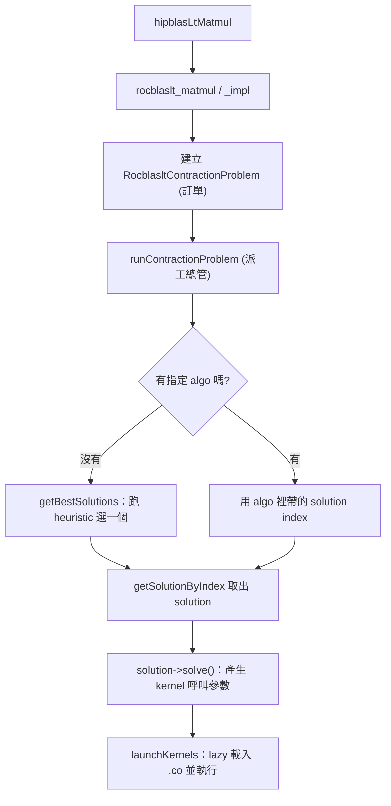

# 執行期 GEMM 呼叫鏈：從 `hipblasLtMatmul` 到 kernel 跑起來

> 路徑說明：本檔在 repo 內的 `study_docs/hipblaslt/`，code 連結為相對路徑（`../../projects/...`，先回到 repo root 再進 `projects/`）。
> 行號可能隨 commit 漂移，對不上時以符號名稱為準。先看 [README.md](README.md) 了解全局。

## 白話總覽

你在程式裡呼叫 `hipblasLtMatmul(...)` 想算一個矩陣乘法，背後其實經過五個關卡，像餐廳出餐：

1. **前台收單** — 公開 API `hipblasLtMatmul` 收到你的呼叫。
2. **轉內場** — 轉交內部 `rocblaslt` 層，把參數整理成一份「訂單」（problem）。
3. **派工** — `tensile_host` 拿著訂單去找「該叫哪位師傅」。
4. **選師傅** — 依矩陣大小（M, N, K）查一張事先做好的表，選出最適合的 kernel（solution）。
5. **取工具開工** — 把該 kernel 的機器碼檔（`.co`）載入 GPU 並 launch 執行。

> 名詞：**problem** = 這次要算什麼的描述（大小、型別、是否轉置等）。**solution** = 被選中的 kernel 設定。

## 架構 / 流程圖



## 逐步 trace

### 關卡 1：公開 API 入口

`hipblasLtMatmul` 是你直接呼叫的函式，做的事很單純：把外部不透明的 handle 轉成內部型別，
再轉呼叫內部的 `rocblaslt_matmul`。

- 程式碼：[hipblasLtMatmul](../../projects/hipblaslt/library/src/amd_detail/hipblaslt.cpp#L521)

### 關卡 2：進入 rocBLASLt 層，整理成「訂單」

真正幹活的是 `rocblaslt_matmul`，它再呼叫 `rocblaslt_matmul_impl`：驗證參數、抽出矩陣大小 M/N/K，
組出一份 `RocblasltContractionProblem`（內部統一的訂單格式），最後丟去派工。

- 對外 wrapper：[rocblaslt_matmul](../../projects/hipblaslt/library/src/amd_detail/rocblaslt/src/rocblaslt_mat.cpp#L713)
- 核心實作：[rocblaslt_matmul_impl](../../projects/hipblaslt/library/src/amd_detail/rocblaslt/src/rocblaslt_mat.cpp#L44)

> 名詞：**contraction**（張量縮併）是 GEMM 的數學一般化講法；這裡當成「矩陣乘法問題」理解即可。

### 關卡 3：派工總管

訂單進入 Tensile host 整合層的總管 `runContractionProblem`：取得 library（食譜本）與 adapter
（負責載入/launch 的人），把當下的 M/N/K、stride、epilogue 更新進 Tensile 的 problem，選出 solution，最後 launch。

- 派工總管：[runContractionProblem](../../projects/hipblaslt/library/src/amd_detail/rocblaslt/src/tensile_host.cpp#L3235)
- 更新 problem：[updateTensileProblem](../../projects/hipblaslt/library/src/amd_detail/rocblaslt/src/tensile_host.cpp#L2086)

> 名詞：**epilogue** = GEMM 主乘法之後的收尾運算（加 bias、套 activation 等）。

### 關卡 4：依矩陣大小選 kernel

關鍵分岔：呼叫時**有指定 algo** 就直接讀出其中的 solution index；**沒指定**就現場跑 heuristic 選一個最好的。
真正比對矩陣大小的「查表」邏輯，在 TensileLite 的 library logic（一棵依條件分層的樹）。

- heuristic 排序：[getBestSolutions](../../projects/hipblaslt/library/src/amd_detail/rocblaslt/src/tensile_host.cpp#L4316)
- 條件樹比對：[ExactLogicLibrary::findTopSolutions](../../projects/hipblaslt/tensilelite/include/Tensile/ExactLogicLibrary.hpp#L264)
- 依 index 取 solution：[MasterSolutionLibrary getSolutionByIndex](../../projects/hipblaslt/tensilelite/include/Tensile/MasterSolutionLibrary.hpp#L210)

> 名詞：**heuristic** = 不用實際跑就猜哪個 solution 最快的規則。

### 關卡 5：lazy 載入 `.co` 並 launch

選好 solution 後呼叫 `solve()` 產生實際的 kernel 呼叫參數（grid 大小、引數），交給 adapter launch。
為縮短啟動時間，kernel 的機器碼檔（`.co`）是**第一次用到才載入**（lazy load）。

- 展開成 kernel 呼叫：[ContractionSolution::solve](../../projects/hipblaslt/tensilelite/src/ContractionSolution.cpp#L3052)
- lazy 載入 shard：[MasterSolutionLibrary::loadLibrary](../../projects/hipblaslt/tensilelite/include/Tensile/MasterSolutionLibrary.hpp#L146)
- 逐 kernel launch（需要時才載入 .co）：[SolutionAdapter::launchKernel](../../projects/hipblaslt/tensilelite/src/hip/HipSolutionAdapter.cpp#L522)
- lazy 載入實作：[FindCodeObject](../../projects/hipblaslt/tensilelite/src/hip/HipSolutionAdapter.cpp#L279)
- `hipModuleLoad` 載入 module：[loadCodeObjectFile](../../projects/hipblaslt/tensilelite/src/hip/HipSolutionAdapter.cpp#L100)

> 名詞：**.co** = code object，編譯好的 GPU 機器碼檔，等同那位師傅要用的工具。

## 關鍵資料結構

| 結構 | 角色（白話） | 位置 |
|------|--------------|------|
| `RocblasltContractionProblem` | rocBLASLt 內部統一的「訂單」 | [定義](../../projects/hipblaslt/library/src/amd_detail/rocblaslt/include/rocblaslt-types.h#L485) |
| `TensileDataGemm` | host 端把 problem/inputs/kernels 綁在一起的包裹 | [定義](../../projects/hipblaslt/library/src/amd_detail/rocblaslt/src/tensile_host.cpp#L3051) |
| `ContractionSolution` | 一個 kernel 的完整描述，含 `solve()` | [定義](../../projects/hipblaslt/tensilelite/include/Tensile/ContractionSolution.hpp#L226) |
| `KernelInvocation` | 一次 kernel 呼叫（kernel 名、`.co`、grid、引數） | [定義](../../projects/hipblaslt/tensilelite/include/Tensile/Tensile.hpp#L122) |

## 如何建置 / 執行以觀察此流程

用 `hipblaslt-bench` 跑一個 GEMM 並印出實際選到的 kernel/solution（建置與選項見官方文件）：

```bash
cd /data1/perlee/rocm-libraries/projects/hipblaslt/build/release
./clients/hipblaslt-bench -m 4096 -n 4096 -k 4096 \
    --a_type bf16_r --b_type bf16_r --c_type bf16_r --d_type bf16_r \
    --compute_type f32_r --print_kernel_info
```

- bench 選項說明：[clients/bench/README.md](../../projects/hipblaslt/clients/bench/README.md)

## Terminology

- `problem` - 這次要算什麼的描述。
- `solution` - 被選中的 kernel 設定組合。
- `heuristic` - 不實際跑就猜最快 solution 的規則。
- `epilogue` - GEMM 後的收尾運算（bias / activation）。
- `.co` / `code object` - 編譯好的 GPU 機器碼檔。
- `lazy load` - 第一次用到才載入。

## 交叉連結

- 上一層全局：[README.md](README.md)
- 那些 kernel 與選擇邏輯哪來的：[tensilelite-pipeline.md](tensilelite-pipeline.md)
- build / PR 規範見官方 [AGENTS.md](../../projects/hipblaslt/AGENTS.md)（本文件不重複）。

## 一句話總結

> 執行期就是「整理訂單 → 查表選 kernel → lazy 載入機器碼 → launch」。
> 那張表和那些機器碼檔哪來的？下一篇 [tensilelite-pipeline.md](tensilelite-pipeline.md)。
