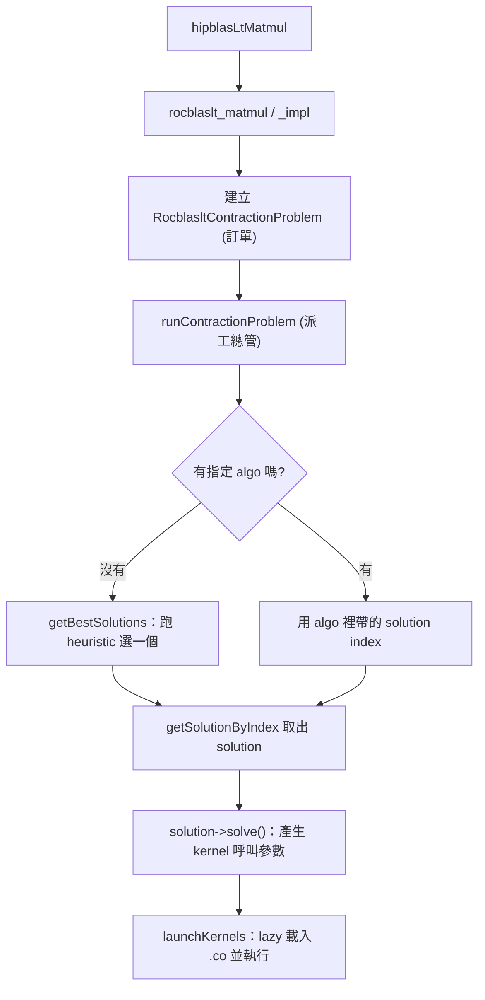

# 執行期 GEMM 呼叫鏈：從 `hipblasLtMatmul` 到 kernel 跑起來

路徑說明：本檔在 repo 內的 `study_docs/hipblaslt/`，code 連結為相對路徑（`../../projects/...`，先回到 repo root 再進 `projects/`）。行號可能隨 commit 漂移，對不上時以符號名稱為準。先看 [README.md](README.md) 了解全局。

**權威內部來源**：第 4 關「選師傅」的 solution selection 權威定義＝**兩層**（先 equality 查精確 M,N,K 命中就用；查不到走 grid 取最近代表點），見 [internal_docs/hipblaslt-tensilelite-reference.md](../internal_docs/hipblaslt-tensilelite-reference.md) Module B。

## 白話總覽

你在程式裡呼叫 `hipblasLtMatmul(...)` 想算一個矩陣乘法，背後其實經過五個關卡，像餐廳出餐：

1. **前台收單** — 公開 API `hipblasLtMatmul` 收到你的呼叫。
2. **轉內場** — 轉交內部 `rocblaslt` 層，把參數整理成一份「訂單」（problem）。
3. **派工** — `tensile_host` 拿著訂單去找「該叫哪位師傅」。
4. **選師傅** — 依矩陣大小（M, N, K）查一張事先做好的表，選出最適合的 kernel（solution）。
5. **取工具開工** — 把該 kernel 的機器碼檔（`.co`）載入 GPU 並 launch 執行。

名詞：

- **problem** = 這次要算什麼的描述（大小、型別、是否轉置等）。
- **solution** = 被選中的 kernel 設定。


## 架構 / 流程圖




## 逐步 trace


### 關卡 1：公開 API 入口

`hipblasLtMatmul` 是你直接呼叫的函式，做的事很單純：把外部不透明的 handle 轉成內部型別，
再**原樣**轉呼叫內部的 `rocblaslt_matmul`（這層不做計算，只轉型別與轉手）。

- 程式碼：[hipblasLtMatmul](../../projects/hipblaslt/library/src/amd_detail/hipblaslt.cpp#L521)

這支 API 的 16 個參數，正是你描述一個 GEMM 所需要的全部資訊：


| 參數                     | 型別 / 來源                        | 功能（白話）                                                                        |
| ---------------------- | ------------------------------ | ----------------------------------------------------------------------------- |
| `handle`               | `hipblasLtHandle_t`            | 函式庫 handle：綁定裝置與環境（哪張 GPU、設定）。                                                |
| `matmul_descr`         | `hipblasLtMatmulDesc_t`        | 運算描述：轉置與否（transA/B）、compute type、bias、activation、scale 等**收尾與精度設定**都掛在這。      |
| `alpha`                | `const void*`                  | 公式裡的 `alpha`，縮放 `op(A)*op(B)`。指標型別依 compute type。                             |
| `A` / `B`              | `const void*`                  | 左/右輸入矩陣的 device 資料指標。                                                         |
| `matA` / `matB`        | `hipblasLtMatrixLayout_t`      | A/B 的 layout：資料型別、列數/行數、leading dimension（ld）、batch 數與 batch stride、儲存 order。 |
| `beta`                 | `const void*`                  | 公式裡的 `beta`，縮放 `op(C)`。`beta=0` 時可略過讀 C。                                      |
| `C`                    | `const void*`                  | 加項矩陣 C 的資料指標（常與 D 同 buffer）。                                                  |
| `matC`                 | `hipblasLtMatrixLayout_t`      | C 的 layout（同上）。                                                               |
| `D`                    | `void*`                        | 輸出矩陣 D 的資料指標（結果寫這）。                                                           |
| `matD`                 | `hipblasLtMatrixLayout_t`      | D 的 layout（同上）。                                                               |
| `algo`                 | `const hipblasLtMatmulAlgo_t*` | **可選**：指定要用哪個 solution（內含 solution index）。傳 `nullptr` 代表「請幫我用 heuristic 選」。   |
| `workspace`            | `void*`                        | 給 kernel 用的暫存 device 記憶體（某些 solution 需要）。                                     |
| `workspaceSizeInBytes` | `size_t`                       | 上述 workspace 的大小；也用來**過濾**掉需要更多 workspace 的 solution。                         |
| `stream`               | `hipStream_t`                  | 要在哪條 HIP stream 上非同步執行。                                                       |


名詞：

- **ld（leading dimension）** = 矩陣在記憶體中相鄰兩欄（或列）起點的間距，用來支援 sub-matrix。
- **order** = 資料是 column-major / row-major 等排列方式。


### 關卡 2：進入 rocBLASLt 層，整理成「訂單」

真正幹活的是 `rocblaslt_matmul`，它再呼叫 `rocblaslt_matmul_impl`：驗證參數、抽出矩陣大小 M/N/K，
組出一份 `RocblasltContractionProblem`（內部統一的訂單格式），最後丟去派工。

- 對外 wrapper：[rocblaslt_matmul](../../projects/hipblaslt/library/src/amd_detail/rocblaslt/src/rocblaslt_mat.cpp#L713)
- 核心實作：[rocblaslt_matmul_impl](../../projects/hipblaslt/library/src/amd_detail/rocblaslt/src/rocblaslt_mat.cpp#L44)

`rocblaslt_matmul` 的參數**和關卡 1 一模一樣**（`handle, alpha, A, matA, B, matB, beta, C, matC, D, matD, algo, workspace, workspaceSizeInBytes, stream` 與 `matmul_descr`），
只是型別從對外的 `hipblasLt*` 換成內部的 `rocblaslt_*`。它先做指標/handle 合法性檢查，再轉呼叫 `rocblaslt_matmul_impl`。

重點在 `rocblaslt_matmul_impl`：它透過 `rocblaslt_matmul_valid_args` **從** `matmul_descr` **與各 layout 抽出/推導**一組「問題欄位」，
這些欄位就是下一關「訂單」`RocblasltContractionProblem` 的內容：


| 推導出的欄位                           | 來源                        | 功能（白話）                                       |
| -------------------------------- | ------------------------- | -------------------------------------------- |
| `m, n, k`                        | matA/matB/matD + transA/B | 矩陣乘法的三個維度（結果 `m×n`，內積長度 `k`）。                |
| `lda, ldb, ldc, ldd, lde`        | 各 layout                  | 各矩陣的 leading dimension（記憶體跨距）；`lde` 給輔助輸出 E。 |
| `batch_stride_a/b/c/d/e`         | 各 layout                  | batched GEMM 時，相鄰兩個 batch 的資料間距。             |
| `type_a, type_b, type_c, type_d` | 各 layout                  | A/B/C/D 的資料型別（如 bf16、fp16、fp8）。              |
| `compute_type`                   | `matmul_descr`            | 累加/計算精度（如 f32）。                              |
| `trans_a, trans_b`               | `matmul_descr`            | A/B 是否轉置（決定 `op(A)`、`op(B)`）。                |
| `bias, bias_type`                | `matmul_descr`            | epilogue 的 bias 向量指標與型別（沒有則為 null）。          |
| `scaleAlphaVec`                  | `matmul_descr`            | per-channel/per-token 的 alpha 縮放向量（量化常用）。    |
| `E, aux_type`                    | `matmul_descr`            | 輔助輸出（例如保存 activation 前的中間值，給反傳用）。            |
| `gradient`                       | `matmul_descr`            | 是否為反向（梯度）模式，影響 epilogue 行為。                  |


名詞：

- **contraction**（張量縮併）是 GEMM 的數學一般化講法；這裡當成「矩陣乘法問題」理解即可。
- **batched GEMM** = 一次算很多個同形狀的小矩陣乘法。


### 關卡 3：派工總管

訂單進入 Tensile host 整合層的總管 `runContractionProblem`：取得 library 與 adapter （負責載入/launch 的人），把當下的 M/N/K、stride、epilogue 更新進 Tensile 的 problem，選出 solution，最後 launch。

- 派工總管：[runContractionProblem](../../projects/hipblaslt/library/src/amd_detail/rocblaslt/src/tensile_host.cpp#L3235)
- 更新 problem：[updateTensileProblem](../../projects/hipblaslt/library/src/amd_detail/rocblaslt/src/tensile_host.cpp#L2086)

`runContractionProblem` 的參數：


| 參數         | 型別 / 來源                              | 功能（白話）                                                                                |
| ---------- | ------------------------------------ | ------------------------------------------------------------------------------------- |
| `handle`   | `rocblaslt_handle`                   | 取得對應裝置的 library 與 adapter（負責載入/launch 的人）。                                            |
| `algo`     | `const rocblaslt_matmul_algo*`       | 使用者指定的 solution；`nullptr` **代表沒指定 → 走 heuristic**（`getBestSolutions`）。                |
| `prob`     | `const RocblasltContractionProblem&` | 上一關組好的「訂單」（M/N/K、型別、stride、epilogue 等）。                                               |
| `gemmData` | `std::shared_ptr<void>`              | host 端包裹（實際是 `TensileDataGemm`），把 Tensile 的 problem / inputs / 選到的 kernel 綁在一起，跨呼叫重用。 |


`updateTensileProblem(prob, tensileProblem)` 則是把上面的「訂單」翻譯成 Tensile 自己的 problem 物件：


| 參數               | 型別 / 來源                                | 功能（白話）                                                                                          |
| ---------------- | -------------------------------------- | ----------------------------------------------------------------------------------------------- |
| `prob`           | `const RocblasltContractionProblem&`   | 來源訂單。                                                                                           |
| `tensileProblem` | `TensileLite::ContractionProblemGemm&` | 目標物件：把 M/N/K、各型別、stride、free/batch/bound index、epilogue（bias/activation）等寫進去，供查表與 `solve()` 使用。 |


名詞：

- **epilogue** = GEMM 主乘法之後的收尾運算（加 bias、套 activation 等）。
- **adapter** = 負責把 kernel 的 `.co` 載入 GPU 並 launch 的執行者。


### 關卡 4：依矩陣大小選 kernel

關鍵分岔：呼叫時**有指定 algo** 就直接讀出其中的 solution index；**沒指定**就現場跑 heuristic 選一個最好的。
真正比對矩陣大小的「查表」邏輯，在 TensileLite 的 library logic（一棵依條件分層的樹）。這棵條件樹的分層、尺寸比對層的 fallback（精確 → 區間 → 最近鄰）、以及它與 build-time 決策樹的關係，整理在 [solution-selection.md](solution-selection.md)。

- heuristic 排序：[getBestSolutions](../../projects/hipblaslt/library/src/amd_detail/rocblaslt/src/tensile_host.cpp#L4316)
- 條件樹比對：[ExactLogicLibrary::findTopSolutions](../../projects/hipblaslt/tensilelite/include/Tensile/ExactLogicLibrary.hpp#L264)
- 依 index 取 solution：[MasterSolutionLibrary getSolutionByIndex](../../projects/hipblaslt/tensilelite/include/Tensile/MasterSolutionLibrary.hpp#L210)

`getBestSolutions`（沒指定 algo 時跑）參數：


| 參數                        | 型別 / 來源                               | 功能（白話）                                              |
| ------------------------- | ------------------------------------- | --------------------------------------------------- |
| `prob`                    | `RocblasltContractionProblem const&`  | 訂單；查表的依據（M/N/K、型別等）。                                |
| `handle`                  | `rocblaslt_handle`                    | 取得 library 與裝置硬體資訊。                                 |
| `gemmData`                | `std::shared_ptr<void>`               | host 端包裹（`TensileDataGemm`），內含已更新的 Tensile problem。 |
| `requestedAlgoCount`      | `int`                                 | **輸入**：希望回傳幾個候選 solution。                           |
| `heuristicResultsArray[]` | `rocblaslt_matmul_heuristic_result[]` | **輸出**：選出的候選（含各自的 `algo` / solution index）寫進這個陣列。   |
| `returnAlgoCount`         | `int*`                                | **輸出**：實際填了幾個（可能少於 requested）。                      |
| `maxWorkSpaceBytes`       | `size_t`                              | workspace 上限：**過濾掉**需要更多暫存記憶體的 solution。            |


選定（或由 algo 指定）一個 index 後，用 `getSolutionByIndex(problem, hardware, index)` 從表取出實際 solution：


| 參數         | 型別 / 來源            | 功能（白話）                                                 |
| ---------- | ------------------ | ------------------------------------------------------ |
| `problem`  | `MyProblem const&` | Tensile problem；必要時用來補算該 solution 的 host workspace 大小。 |
| `hardware` | `Hardware const&`  | 目標 GPU 屬性。                                             |
| `index`    | `const int`        | 要取出的 solution 索引（lazy load 時可能觸發載入它所在的 shard）。         |


名詞：

- **heuristic** = 不用實際跑就猜哪個 solution 最快的規則。
- **solution index** = 選擇表裡每個候選 kernel 的唯一編號，貫穿「選 → 取 → launch」。

沒被 tune 過的矩陣大小怎麼辦？選擇表是「最近鄰」設計，所以任意 M/N/K 都查得到一個 solution：

- tuning 只在**有限的代表 size** 上 benchmark；遇到沒測過的 size，就用距離函數找「最接近的 benchmark 點」，套用那個點選出的贏家。見 [ProblemMatchingLibrary](../../projects/hipblaslt/tensilelite/include/Tensile/MatchingLibrary.hpp#L44-L47)（"find the benchmarked size that is closest to the size asked for"）。
- kernel 本身用 tiling 寫成，對任意大小通用，所以「能不能算」不受 size 限制；離 tuning 點越遠只是可能選到非最佳 kernel，而非算不出來。完整說明見 [tensilelite-pipeline.md](tensilelite-pipeline.md) 的〈有限的 kernel 如何涵蓋無限大的 problem size〉。
- 最近鄰只是條件樹尺寸比對層最底部的泛化葉子策略（精確 → 區間 → 最近鄰），與整棵條件樹的關係見 [solution-selection.md](solution-selection.md)。


### 關卡 5：lazy 載入 `.co` 並 launch

選好 solution 後呼叫 `solve()` 產生實際的 kernel 呼叫參數（grid 大小、引數），交給 adapter launch。
為縮短啟動時間，kernel 的機器碼檔（`.co`）是**第一次用到才載入**（lazy load）。

- 展開成 kernel 呼叫：[ContractionSolution::solve](../../projects/hipblaslt/tensilelite/src/ContractionSolution.cpp#L3052)
- lazy 載入 shard：[MasterSolutionLibrary::loadLibrary](../../projects/hipblaslt/tensilelite/include/Tensile/MasterSolutionLibrary.hpp#L146)
- 逐 kernel launch（需要時才載入 .co）：[SolutionAdapter::launchKernel](../../projects/hipblaslt/tensilelite/src/hip/HipSolutionAdapter.cpp#L522)
- lazy 載入實作：[FindCodeObject](../../projects/hipblaslt/tensilelite/src/hip/HipSolutionAdapter.cpp#L279)
- `hipModuleLoad` 載入 module：[loadCodeObjectFile](../../projects/hipblaslt/tensilelite/src/hip/HipSolutionAdapter.cpp#L100)

`ContractionSolution::solve(problem, inputs, hardware)` 把抽象的 solution 展開成一次或多次具體的 kernel 呼叫：


| 參數         | 型別 / 來源                               | 功能（白話）                                            |
| ---------- | ------------------------------------- | ------------------------------------------------- |
| `problem`  | `ContractionSolution::Problem const&` | 這次要算的 problem（M/N/K、型別、epilogue），用來算 grid 大小與選分支。 |
| `inputs`   | `ContractionSolution::Inputs const&`  | 實際的資料：A/B/C/D 指標、alpha/beta 值、bias/scale 等指標。     |
| `hardware` | `Hardware const&`                     | 目標 GPU 屬性（影響 workgroup、佔用率等決策）。                   |


回傳一組 `KernelInvocation`（kernel 名、要用哪個 `.co`、grid/workgroup 大小、引數）。接著交給 adapter：

`SolutionAdapter::launchKernel(kernel, stream, startEvent, stopEvent, isKernelLoaded)`：


| 參數                         | 型別 / 來源                   | 功能（白話）                                                                                             |
| -------------------------- | ------------------------- | -------------------------------------------------------------------------------------------------- |
| `kernel`                   | `KernelInvocation const&` | 一次 kernel 呼叫的完整描述（含 `codeObjectFile`、`kernelName`、grid、args）。                                      |
| `stream`                   | `hipStream_t`             | 在哪條 HIP stream 上 launch。                                                                           |
| `startEvent` / `stopEvent` | `hipEvent_t`              | 可選的計時 event（量測 kernel 時間用）。                                                                        |
| `isKernelLoaded`           | `bool`                    | 該 kernel 的 `.co` 是否已載入；`false` **且有** `codeObjectFile` **時才呼叫** `FindCodeObject` **觸發 lazy load**。 |


名詞：

- **.co** = code object，編譯好的 GPU 機器碼檔，等同那位師傅要用的工具。
- **KernelInvocation** = 「這一刀怎麼切」的完整指示：用哪支 kernel、哪個 `.co`、開多少 thread、傳什麼引數。


## 關鍵資料結構


| 結構                            | 角色（白話）                                 | 位置                                                                                             |
| ----------------------------- | -------------------------------------- | ---------------------------------------------------------------------------------------------- |
| `RocblasltContractionProblem` | rocBLASLt 內部統一的「訂單」                    | [定義](../../projects/hipblaslt/library/src/amd_detail/rocblaslt/include/rocblaslt-types.h#L485) |
| `TensileDataGemm`             | host 端把 problem/inputs/kernels 綁在一起的包裹 | [定義](../../projects/hipblaslt/library/src/amd_detail/rocblaslt/src/tensile_host.cpp#L3051)     |
| `ContractionSolution`         | 一個 kernel 的完整描述，含 `solve()`            | [定義](../../projects/hipblaslt/tensilelite/include/Tensile/ContractionSolution.hpp#L226)        |
| `KernelInvocation`            | 一次 kernel 呼叫（kernel 名、`.co`、grid、引數）   | [定義](../../projects/hipblaslt/tensilelite/include/Tensile/Tensile.hpp#L122)                    |


## 深入問答：`adapter` / `rocblaslt_handle` / `gemmData`

這幾個名詞在關卡 3～5 一直出現，這裡把它們的角色講深一點（源自實際 trace 這條呼叫鏈時的疑問）。

### `adapter` 的定義

- `adapter` 指 [`TensileLite::hip::SolutionAdapter`](../../projects/hipblaslt/tensilelite/include/Tensile/hip/HipSolutionAdapter.hpp#L45)，是 **HIP 層的執行代理**：它持有已載入的 code object modules（`hipModule_t`）、維護「kernel 名稱 → `hipFunction_t`」的對應、負責 `.co` 的 lazy 載入（`loadCodeObjectFile` / `initializeLazyLoading` / `FindCodeObject`），並最終發出 `hipModuleLaunchKernel`。
- 概念上它是**抽象的** `KernelInvocation`**（由** `solve()` **產生）與底層 HIP driver 呼叫之間的橋**，把「裝置端 launch 的機械細節」封裝起來。實作上是 **per-device 快取的單例**（一張 GPU 一個 adapter），由 tensile host 用 `get_library_and_adapter()`（[tensile_host.cpp#L2958](../../projects/hipblaslt/library/src/amd_detail/rocblaslt/src/tensile_host.cpp#L2958)）依 device id 取得並在第一次使用時 lazy 初始化。

### `rocblaslt_handle` 的定義

- 是 rocBLASLt 的 **opaque 內部 context/session handle**，承載這一組呼叫共用的狀態：device id、stream、device properties，以及對已載入 library / adapter 狀態的存取。
- 它是對外 `hipblasLtHandle_t` 的內部對應物；每個 API 呼叫都帶著它，讓 host 知道「這次跑在哪張卡、用哪份 library」。

### 都有 `prob` 了，為什麼 `gemmData` 裡還要包 problem 和 kernel？

疑問拆解：傳入 `algo` 是不是代表 kernel 還沒選定？那 `gemmData` 裡的 kernel 會被變動嗎？還是這個 pointer 就是拿來被填資料的？

**你的直覺基本正確——`gemmData` 就是一個傳進來被填 / 被重用的可變工作緩衝。** 它的型別是 [`TensileDataGemm`](../../projects/hipblaslt/library/src/amd_detail/rocblaslt/src/tensile_host.cpp#L3051)，欄位有 `problem`（Tensile 格式）、`inputs`、`kernels`、`algoIndex`。要點：

- `prob`（`RocblasltContractionProblem`）是 **rocblaslt 格式的「訂單」**；`gemmData->problem`（`ContractionProblemGemm`）是**翻譯成 Tensile 格式後的 problem**，兩者不是重複，是**同一問題的兩種表述**，由 `updateTensileProblem(prob, data->problem)` 做轉換。
- 之所以把它們包在一個持久物件裡，是為了**重用**：hipBLASLt 的 ext API 允許你建立一個 gemm 物件後**重複呼叫**，`gemmData` 讓重複呼叫時不必每次重新翻譯 problem / 重新配置。
- `kernels` 欄位是**輸出槽**：選定 solution 後由 `solve()` 產生 `KernelInvocation` 填進去，會被（重）寫入——所以是的，它會被變動。
- 傳入 `algo` 只是**指定要用哪個 solution index**（若為 `nullptr` 就跑 heuristic 選）；真正的 kernel（`.co` / `KernelInvocation`）要到 `solve()` / launch 才展開。所以「傳 algo 時 kernel 尚未實體選定」是對的，`gemmData` 的用途正是被傳進來承接這些結果。

> 關卡 4 的「查表選 kernel」實際怎麼走訪條件樹（精確 → 區間 → 泛化的 fallback、為何用樹），見 [solution-selection.md](solution-selection.md)。


## 如何建置 / 執行以觀察此流程

用 `hipblaslt-bench` 跑一個 GEMM 並印出實際選到的 kernel/solution（建置與選項見官方文件）：

```bash
cd /data1/perlee/rocm-libraries/projects/hipblaslt/build/release
./clients/hipblaslt-bench -m 4096 -n 4096 -k 4096 \
    --a_type bf16_r --b_type bf16_r --c_type bf16_r --d_type bf16_r \
    --compute_type f32_r --print_kernel_info
```

- bench 選項說明：[clients/bench/README.md](../../projects/hipblaslt/clients/bench/README.md)


## Terminology

- `problem` - 這次要算什麼的描述。
- `solution` - 被選中的 kernel 設定組合。
- `heuristic` - 不實際跑就猜最快 solution 的規則。
- `epilogue` - GEMM 後的收尾運算（bias / activation）。
- `.co` / `code object` - 編譯好的 GPU 機器碼檔。
- `lazy load` - 第一次用到才載入。


## 交叉連結

- 上一層全局：[README.md](README.md)
- 那些 kernel 與選擇邏輯哪來的：[tensilelite-pipeline.md](tensilelite-pipeline.md)
- build / PR 規範見官方 [AGENTS.md](../../projects/hipblaslt/AGENTS.md)（本文件不重複）。


## 一句話總結

> 執行期就是「整理訂單 → 查表選 kernel → lazy 載入機器碼 → launch」。
> 那張表和那些機器碼檔哪來的？下一篇 [tensilelite-pipeline.md](tensilelite-pipeline.md)。

