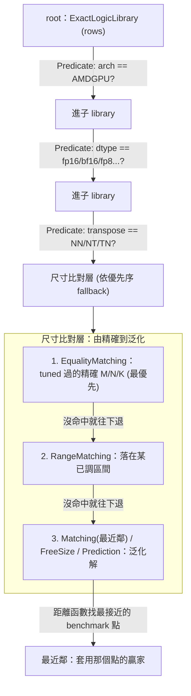
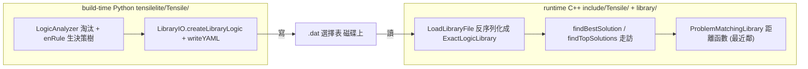

# runtime 怎麼查表選 kernel：條件樹 / 尺寸比對層 / 最近鄰

路徑說明：本檔在 repo 內的 `study_docs/hipblaslt/`，code 連結為相對路徑（`../../projects/...`，先回到 repo root 再進 `projects/`）。行號可能隨 commit 漂移，對不上時以符號名稱為準。

建議先讀 [runtime-flow.md](runtime-flow.md) 關卡 4、[tensilelite-pipeline.md](tensilelite-pipeline.md) 階段 2。

## 為什麼要有這篇：先解一個常見混淆

讀 pipeline 與 runtime 文件時，很容易把三個名詞當成同一件事或彼此無關的東西：

- **「條件樹」**（library logic、`ExactLogicLibrary`）
- **「尺寸比對」**（Equality / Range / FreeSize / Prediction …）
- **「最近鄰」**（沒 tune 過的 size 用距離函數補）

它們其實是**同一套查表機制裡的不同層**，有明確的**從屬關係**。一句話先定位：

> - **「條件樹」是整個查表的骨架（外層路由）**
> - **「最近鄰」是這棵樹走到最底層「比尺寸」時，其中一種挑法（葉子節點的策略）**
> - **最近鄰是長在條件樹裡面的，不是條件樹本身，也不是跟它平行的另一套東西。**

另外還有一個時間點的混淆要一起解掉：**build-time 也有一棵「決策樹」**（`LibraryLogic.py` 的 `enRule` 產生的），它跟 runtime 走的那棵條件樹是**同一份資料的兩端**（build 時「寫」、runtime 時「讀」），不是兩套不同的樹。

## 一張圖看懂層次




重點：**最近鄰不是整棵樹，而是尺寸比對層最底部、在精確與區間都沒命中後才輪到的泛化 fallback。**

## 1. 「條件樹」是什麼：整棵外層路由樹

runtime 的選擇表在記憶體裡是一棵 `ExactLogicLibrary`。它的核心資料結構是一串 `rows`，每個 row = **（一個 Predicate 條件, 一個子 library）**，而且是**按「最佳到最差」排好序**的：

```55:67:rocm-libraries/projects/hipblaslt/tensilelite/include/Tensile/ExactLogicLibrary.hpp
    /**
 * Represents a set of sub-libraries, each with associated predicates. It
 * should be placed in order of best to worst solutions. We assume the best
 * solution is the first one where we match the predicates.
 *
 * Examples: Picking solutions written for a particular GPU, solutions that
 * assume that a particular size is a multiple of something, etc.
 */
    template <typename MyProblem, typename MySolution, typename MyPredicate>
    struct ExactLogicLibrary : public SolutionLibrary<MyProblem, MySolution>
    {
        using Row = LibraryRow<MyProblem, MySolution, MyPredicate>;
        std::vector<Row>          rows;
```

> 名詞：**Predicate** = 一個回傳 true/false 的條件判斷函式，形式像 `predicate(problem, hardware) → 成立 / 不成立`。例如「GPU 是不是 AMDGPU？」「dtype 是不是 fp16？」「A 有沒有轉置？」每一個這樣的問題都是一個 Predicate。

查表時的走訪邏輯（見 [findTopSolutions](../../projects/hipblaslt/tensilelite/include/Tensile/ExactLogicLibrary.hpp#L264)）就是：**逐一走每個 row，只要某個 row 的 Predicate 對「當下 problem + hardware」成立，就遞迴走進它的子 library 繼續往下比對**。一層一層下去，就形成一棵「依條件分層的樹」。分層順序由外而內、先便宜後精細：

1. 先用**便宜的條件**過濾：GPU 架構是不是 `AMDGPU`。
2. 再比對 **problem 屬性**：轉置樣式（transpose，如 NN/NT/TN）、資料型別（fp16/bf16/fp8…）。
3. 最後才做**尺寸比對**（M/N/K）——也就是下一節。

**重點：條件樹管的是「arch → 型別 → 轉置 → 尺寸層」這種一路往下分流的過程，它涵蓋所有層級，不只尺寸。**

## 2. 尺寸比對層：精確 → 區間 → 泛化的 fallback

走到最底層「比尺寸」時，還有一個**內部優先序（fallback）**。從 runtime 走訪程式碼可以看到它依序測試各種 matching predicate：

- `EqualityMatching`**（精確，最優先）**：這次的 M/N/K 剛好是 tuning 時**測過的精確尺寸** → 直接回傳那個尺寸選出的贏家。命中它的 solution 還會被打上 `Equal` tag（供 `matmulIsTuned()` 判斷）。
- `RangeMatching`**（區間）**：尺寸落在某個已調區間內。
- `Matching`**(最近鄰) /** `FreeSizeMatching` **/** `GridBasedMatching` **/** `PredictionMatching`**（泛化解）**：前兩者都沒命中時的通用解。

為什麼要 fallback？因為 tuning 只在**有限的代表性尺寸**上 benchmark（見 [tensilelite-pipeline.md](tensilelite-pipeline.md)〈有限的 kernel 如何涵蓋無限大的 problem size〉），不可能窮舉所有 M/N/K。所以設計成「**先找精確、找不到退區間、再退泛化**」——既讓 tuned 過的尺寸拿到最佳解，又保證任意尺寸都查得到一個能用的 solution。

## 3. 「最近鄰」是什麼：尺寸層裡的一個葉子策略

你在其他文件看到的「沒測過的 size 用最近鄰補」，對應的正是上面泛化解裡的 `ProblemMatchingLibrary`。它用一個**距離函數**找「離要求的 size 最近的 benchmark 點」，套用那個點的贏家：

```43:49:rocm-libraries/projects/hipblaslt/tensilelite/include/Tensile/MatchingLibrary.hpp
     * \ingroup SolutionLibrary
     *
     * Uses a distance function to select solutions based on benchmarks.
     * Benchmarks are performed to determine the optimal solution at a number of
     * specific sizes. At runtime, we find the benchmarked size that is closest
     * to the size asked for.
     */
```

`ProblemFreeSizeLibrary`（[FreeSizeLibrary.hpp#L46-L49](../../projects/hipblaslt/tensilelite/include/Tensile/FreeSizeLibrary.hpp#L46-L49)）帶有幾乎相同的註解，是同一類「基於 benchmark + 距離」的泛化選法。

**所以正確的圖像是「最近鄰包在條件樹裡面」**：

```
條件樹 (ExactLogicLibrary)              ← 「條件樹」= 整棵
└─ ...arch / dtype / transpose 分層...
   └─ 尺寸比對層
      ├─ 精確 (EqualityMatching)
      ├─ 區間 (RangeMatching)
      └─ 最近鄰 (Matching / 距離函數) ← 「最近鄰補」= 這一個葉子
```

- 它們不是同義詞，也不是二選一。
- 最近鄰是條件樹**最底層**、且是在「精確、區間都沒命中」之後才輪到的**泛化 fallback**。
- 代價：離 tuning 點越遠的 size，選到的 kernel 可能非絕對最佳，但**不是算不出來**（kernel 用 tiling 寫成，對任意大小通用）。


## 4. build-time 決策樹 vs runtime 條件樹：用的是哪一份 code

最後解掉時間點的混淆。`tensilelite-pipeline.md` 階段 2 也講到「決策樹 / 選擇邏輯樹」，那是 **build-time** 的產物；runtime 走的是它序列化出來的檔。**兩者是同一份資料的兩端，用的是完全不同的兩套 code**：

- **build 端（寫）= Python，在** `tensilelite/Tensile/`：`LibraryLogic.py` 分析 benchmark → 生出 Exact 對照表 + Range 決策樹 → 用 `LibraryIO.py` 寫成 `3_LibraryLogic/` 的 YAML（最終打包成 `.dat`）。
- **runtime 端（讀）= C++，在** `tensilelite/include/Tensile/` **與** `library/`：載入 `.dat` → 反序列化重建成 `ExactLogicLibrary` 等物件 → 查表時走訪它。

一句話：**build 端的 code 只在你跑 tuning 時執行一次（產檔）；runtime 端的 code 每次** `hipblasLtMatmul` **呼叫都會走（讀檔查表）。中間唯一的接點就是磁碟上的** `.dat`**。**

### 4.1 build 端用哪些 code（Python，只在 tuning 時跑一次）


| 角色         | 檔案 / 符號                                  | 行號                                                                                                                                              | 做什麼                                                                                                                       |
| ---------- | ---------------------------------------- | ----------------------------------------------------------------------------------------------------------------------------------------------- | ------------------------------------------------------------------------------------------------------------------------- |
| 入口         | `LibraryLogic.py` `main()`               | [L1591](../../projects/hipblaslt/tensilelite/Tensile/LibraryLogic.py#L1591)                                                                     | 階段 2 入口，讀 `2_BenchmarkData/`、寫 `3_LibraryLogic/`。                                                                         |
| 主流程        | `LibraryLogic.py` `generateLogic()`      | [L1427](../../projects/hipblaslt/tensilelite/Tensile/LibraryLogic.py#L1427)                                                                     | 掃每個 problem type，逐一分析後寫檔。                                                                                                 |
| 單一 type 分析 | `LibraryLogic.py` `analyzeProblemType()` | [L48](../../projects/hipblaslt/tensilelite/Tensile/LibraryLogic.py#L48)                                                                         | 建 `LogicAnalyzer`、跑淘汰、產出 `logicTuple`（含 exact + range）。                                                                   |
| 分析器        | `LibraryLogic.py` `class LogicAnalyzer`  | [L240](../../projects/hipblaslt/tensilelite/Tensile/LibraryLogic.py#L240)                                                                       | 把數據讀成 `data[size][solution]=GFlops` 並做選擇。                                                                                 |
| 淘汰 1       | `removeInvalidSolutions()`               | [L546](../../projects/hipblaslt/tensilelite/Tensile/LibraryLogic.py#L546)                                                                       | 任一 size 跑不出來（gflops==0）→ 整個 solution 踢掉。                                                                                  |
| 淘汰 2（預設）   | `keepWinnerSolutions()`                  | [L605](../../projects/hipblaslt/tensilelite/Tensile/LibraryLogic.py#L605)                                                                       | 只留當過任一 size 第一名的贏家聯集。                                                                                                     |
| 淘汰 2（舊版）   | `removeLeastImportantSolutions()`        | [L578](../../projects/hipblaslt/tensilelite/Tensile/LibraryLogic.py#L578)                                                                       | 移除省時貢獻低於門檻的 solution。                                                                                                     |
| **生成決策樹**  | `enRule()`                               | [L667](../../projects/hipblaslt/tensilelite/Tensile/LibraryLogic.py#L667)                                                                       | 把 Range 尺寸壓成精簡決策樹（相鄰同贏家合併、變則加分支）。                                                                                         |
| 生成 exact 表 | `exactWinners` → `logicTuple`            | [L224-L233](../../projects/hipblaslt/tensilelite/Tensile/LibraryLogic.py#L224)                                                                  | Exact 點直接建對照表，連同 rangeLogic 打包成回傳的 `logicTuple`。                                                                          |
| 組資料        | `LibraryIO.py` `createLibraryLogic()`    | [L713](../../projects/hipblaslt/tensilelite/Tensile/LibraryIO.py#L713)                                                                          | 把 `logicTuple` 轉成可寫檔的結構（含 arch/型別/exact/range）。                                                                           |
| 寫檔         | `LibraryIO.py` `writeYAML()` / `write()` | [L242](../../projects/hipblaslt/tensilelite/Tensile/LibraryIO.py#L242) / [L230](../../projects/hipblaslt/tensilelite/Tensile/LibraryIO.py#L230) | 由 `generateLogic()` 在 [L1534-L1542](../../projects/hipblaslt/tensilelite/Tensile/LibraryLogic.py#L1534) 呼叫，落地成 YAML/JSON。 |


### 4.2 runtime 端用哪些 code（C++，每次 matmul 呼叫都走）


| 角色           | 檔案 / 符號                                                                   | 行號                                                                                                                                                                                            | 做什麼                                                                                                                                         |
| ------------ | ------------------------------------------------------------------------- | --------------------------------------------------------------------------------------------------------------------------------------------------------------------------------------------- | ------------------------------------------------------------------------------------------------------------------------------------------- |
| 載入 `.dat`    | `tensile_host.cpp` `LoadLibraryFilePreload` / `LoadLibraryFile`           | [L2915](../../projects/hipblaslt/library/src/amd_detail/rocblaslt/src/tensile_host.cpp#L2915) / [L2925](../../projects/hipblaslt/library/src/amd_detail/rocblaslt/src/tensile_host.cpp#L2925) | 第一次 matmul 由 `initialize()`([L2765](../../projects/hipblaslt/library/src/amd_detail/rocblaslt/src/tensile_host.cpp#L2765)) 觸發，把 `.dat` 讀進來。 |
| 反序列化定義       | `Serialization/ExactLogicLibrary.hpp`、`Serialization/MatchingLibrary.hpp` | —                                                                                                                                                                                             | 描述 `.dat` 欄位如何映射回 `ExactLogicLibrary` / `ProblemMatchingLibrary` 物件。                                                                        |
| 具體型別         | `ContractionLibrary.hpp`                                                  | [L47-L63](../../projects/hipblaslt/tensilelite/include/Tensile/ContractionLibrary.hpp#L47)                                                                                                    | `ContractionProblemMatchingLibrary = ProblemMatchingLibrary<...>`（L60-61）等 typedef。                                                         |
| **條件樹走訪**    | `ExactLogicLibrary.hpp` `findBestSolution()`                              | [L104](../../projects/hipblaslt/tensilelite/include/Tensile/ExactLogicLibrary.hpp#L104)                                                                                                       | 逐 row 測 Predicate，精確命中就回傳，否則保留第一個 fallback。                                                                                                 |
| 條件樹走訪（top-N） | `ExactLogicLibrary.hpp` `findTopSolutions()`                              | [L264](../../projects/hipblaslt/tensilelite/include/Tensile/ExactLogicLibrary.hpp#L264)                                                                                                       | 同上但回傳前 N 名；此處可見 Equality/Range/FreeSize 各 matching tag。                                                                                     |
| **最近鄰葉子**    | `MatchingLibrary.hpp` `ProblemMatchingLibrary::findBestSolution()`        | [L87](../../projects/hipblaslt/tensilelite/include/Tensile/MatchingLibrary.hpp#L87)                                                                                                           | 呼叫 `table->findBestMatch(problem, ...)`（距離函數）。                                                                                              |
| 距離函數本體       | `PropertyMatching.hpp` `findBestMatch()`                                  | [L96](../../projects/hipblaslt/tensilelite/include/Tensile/PropertyMatching.hpp#L96)                                                                                                          | 對每個 benchmark 點算距離、挑最近的（見 [L348](../../projects/hipblaslt/tensilelite/include/Tensile/PropertyMatching.hpp#L348) `DistanceMatchingCommon`）。 |


### 4.3 對照關係




**重點：build 端** `enRule` **決定了 runtime 條件樹尺寸層長什麼樣；runtime 端只是把** `.dat` **反序列化後照著走，不再做任何選擇邏輯的「計算」。** 這也是為什麼改了 tuning config 要重跑 build 才會反映到 runtime，因為選擇邏輯是 build 時「烤」進 `.dat` 的。

## 常見誤解澄清（速查）


| 誤解                                       | 正解                                                                                |
| ---------------------------------------- | --------------------------------------------------------------------------------- |
| 「條件樹」和「最近鄰」是同一件事                         | 不是。條件樹是整棵骨架；最近鄰只是尺寸層最底部的一個泛化葉子策略。                                                 |
| 「最近鄰」和「條件樹」是兩套平行機制                       | 不是。最近鄰**長在**條件樹裡面（尺寸層 → 泛化解 → 距離函數）。                                              |
| build-time 的「決策樹」和 runtime 的「條件樹」是兩棵不同的樹 | 不是。是**同一份資料的兩端**：`enRule` 生成 → runtime 走訪。                                        |
| tuning 沒測過的 size 會「算不出來」                 | 不會。kernel 用 tiling 對任意 size 通用；最近鄰只是挑「可能非最佳但能用」的贏家。                               |
| runtime 讀的選擇表是 YAML                      | 不是。runtime 載入的是 MessagePack 的 `.dat`；YAML 是 build 中間可讀版。見 [README.md](README.md)。 |


## Terminology

- **條件樹 / library logic** - runtime 的 `ExactLogicLibrary`，`rows = (Predicate, 子 library)` 按最佳到最差排序、逐 row 遞迴走訪。
- **Predicate** - 回傳 true/false 的條件判斷（arch / dtype / transpose / size matching…）。
- **尺寸比對層** - 條件樹最底層對 M/N/K 的比對，優先序為 Equality → Range → 泛化。
- **最近鄰 (Matching / FreeSize)** - 尺寸層的泛化葉子策略，用距離函數找最接近的 benchmark 點套用其贏家。
- **enRule** - build-time `LibraryLogic.py` 生成 Range 決策樹的函式；產出即 runtime 條件樹的來源。


## 交叉連結

- 產物怎麼被生成（階段 2 挑贏家、輸出決策樹）：[tensilelite-pipeline.md](tensilelite-pipeline.md)
- 一次呼叫查表選 solution 的完整呼叫鏈：[runtime-flow.md](runtime-flow.md) 關卡 4
- 選擇表放哪、是 `.dat` 不是 YAML、lazy load：[README.md](README.md)
- 更早的學習軌跡（B 節條件樹 QA）：[../notes/0625-建立全局地圖.md](../notes/0625-建立全局地圖.md)


## 一句話總結

> 「條件樹」是 arch/型別/轉置/尺寸全分層的整棵路由樹；「最近鄰」是它走到尺寸層、精確與區間都沒命中後的泛化葉子策略；build-time 的決策樹與 runtime 條件樹是同一份資料的兩端。三者是一套機制的不同層，不是三件事。

