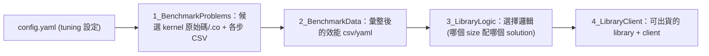

# TensileLite 三階段：kernel 是怎麼產生與挑選的

> 路徑說明：本檔在 repo 內的 `study_docs/hipblaslt/`，code 連結為相對路徑（`../../projects/...`，先回到 repo root 再進 `projects/`）。
> 行號可能隨 commit 漂移，對不上時以符號名稱為準。建議先讀 [runtime-flow.md](runtime-flow.md)。

## 白話總覽

[runtime-flow.md](runtime-flow.md) 講的是「執行時查表選 kernel」。那張表和那些 kernel，是 TensileLite
在**建置時**做出來的。TensileLite 做三件事，像出一本食譜：

1. **BenchmarkProblems（試做與試吃）** — 依 YAML 設定產生大量候選 kernel，編譯、在真實 GPU 上 benchmark。
2. **LibraryLogic（寫食譜）** — 分析 benchmark 數據，挑出「哪種矩陣大小該用哪個 kernel」。
3. **ClientWriter（裝訂出版）** — 把選出的 kernel 包成可用的 library 與 benchmark client。

> 名詞：**tuning** = 試很多種 kernel 設定、比較效能、挑最快的過程。

## 架構 / 流程圖



## 逐步 trace

### 入口

命令列入口 `Tensile/bin/Tensile` 呼叫 `Tensile()`，再由 `executeStepsInConfig()` 依 config 內容依序觸發三階段。

- 頂層驅動：[Tensile()](../../projects/hipblaslt/tensilelite/Tensile/Tensile.py#L478)
- 三階段分派：[executeStepsInConfig()](../../projects/hipblaslt/tensilelite/Tensile/Tensile.py#L71)

### 階段 1：BenchmarkProblems（產生 + 編譯 + benchmark）

依 YAML 把參數「fork」成很多組合，每組變成一個候選 kernel，編譯成 `.co`，再跑 benchmark 量速度。

- 入口：[BenchmarkProblems.main()](../../projects/hipblaslt/tensilelite/Tensile/BenchmarkProblems.py#L818)
- 單一 problem-type 的 generate→build→benchmark 迴圈：[_benchmarkProblemType()](../../projects/hipblaslt/tensilelite/Tensile/BenchmarkProblems.py#L557)

> 名詞：**fork** = 把一個參數的多個可能值展開成多組設定（例如 tile 試 64/128/256），形成多個候選 kernel。

### 階段 2：LibraryLogic（挑每個 size 的最佳解）

讀 `2_BenchmarkData/` 的效能數據，對每種矩陣大小挑最快的 solution，寫成一棵「選擇邏輯」輸出到 `3_LibraryLogic/`。

- 入口：[LibraryLogic.main()](../../projects/hipblaslt/tensilelite/Tensile/LibraryLogic.py#L1591)
- 主流程：[generateLogic()](../../projects/hipblaslt/tensilelite/Tensile/LibraryLogic.py#L1427)
- 單一 problem-type 分析：[analyzeProblemType()](../../projects/hipblaslt/tensilelite/Tensile/LibraryLogic.py#L48)

> 這一步產出的 YAML，就是 runtime 在 [runtime-flow.md](runtime-flow.md) 關卡 4 讀進去查表用的東西。

### 階段 3：ClientWriter（打包成 library / client）

讀 `3_LibraryLogic/` 的選擇邏輯，重建 solutions、編出最終 library（`.co` + 索引），並產生 benchmark client。

- 入口：[ClientWriter.main()](../../projects/hipblaslt/tensilelite/Tensile/ClientWriter.py#L92)

### kernel 組合語言怎麼吐出來：KernelWriter + rocisa

候選 kernel 的 GPU 組合語言由 `KernelWriter.py` 產生，它呼叫 C++ 模組 `rocisa`（Nanobind 綁定）逐條產生指令。
一開始不用全懂，先記住入口。

- kernel 主體建構：[kernelBody()](../../projects/hipblaslt/tensilelite/Tensile/KernelWriter.py#L5279)
- 產生 source 的入口：[_getKernelSource()](../../projects/hipblaslt/tensilelite/Tensile/KernelWriter.py#L10602)

> 名詞：**rocisa** = 專門「組裝 AMDGPU 指令」的 C++ 工具庫；`KernelWriter.py` 像在用它寫組合語言。

## 一次 build 涵蓋什麼？候選 vs 出貨、size 範圍、何時要重跑

這節回答三個常見但文件易略過的疑問：build 出來的 `.co` 是不是一大堆、有限的 kernel 怎麼涵蓋無限大的矩陣、以及什麼時候需要重跑。

### 候選 `.co` 很多，但「出貨」的只留贏家

「一大堆 `.co`」其實分兩種，數量天差地別，別混在一起：

- **候選（大量、暫時）**：階段 1 把參數 fork 成很多組合，每組編成一個候選 `.co` 拿去 benchmark；大多數最後都用不到。它們是 `1_BenchmarkProblems/` 裡的**離線中間產物**，benchmark 完即可清掉。
- **出貨（精簡、被 runtime 用）**：階段 2 對每個 size 只挑最快的 solution，階段 3 只把**被選中的** solution 打包進最終 library。所以出貨那批 `.co` 是挑選後的集合，不是全部候選。

### 有限的 kernel 如何涵蓋無限大的 problem size

關鍵設計是把「能不能算」和「算得快不快」拆開：

- **kernel 對 size 通用**：solution 用 **tiling**（把輸出切成固定大小的 tile 分塊掃過）寫成，同一個 `.co` 算 `512×512` 或 `8192×8192` 只是 tile 數不同。能不能用由 kernel 的 predicate / assertion（如「K 要是某數的倍數」「需要多少 workspace」）決定，**不是 size 上限**。
- **tuning 只挑代表性 size**：要 benchmark 哪些 size 是在 tuning config（YAML）裡**人工列出**的有限清單，通常對齊真實負載（例如常見的 LLM GEMM shape），不窮舉。測得越廣，對那些 size 越準。
- **沒測過的 size 用最近鄰補**：runtime 對沒 tune 過的 M/N/K，用距離函數找「最接近的 benchmark 點」，套用那個點的贏家。見 [ProblemMatchingLibrary](../../projects/hipblaslt/tensilelite/include/Tensile/MatchingLibrary.hpp#L44-L47)（"find the benchmarked size that is closest to the size asked for"）與 [ProblemFreeSizeLibrary](../../projects/hipblaslt/tensilelite/include/Tensile/FreeSizeLibrary.hpp#L46-L49)。

> 名詞：**tiling** = 把大矩陣切成固定大小的小塊（tile），kernel 用迴圈逐塊計算，因此同一支 kernel 不綁定特定矩陣大小。

結論：size 可以無限大但 `.co` 數量有限——代價只是離 tuning 點越遠的 size，選到的 kernel 可能不是絕對最佳，而**不是算不出來**。

### 什麼時候要重跑 build、什麼時候不用

- **不用重跑**：使用既有 kernel，包含「為不同矩陣大小換用不同 kernel」。runtime 只是查表 + lazy load，**全程不編譯**，同一份 build 產物可重複用無數次。
- **需要重跑 TensileLite**：
  - 換 GPU 架構（`.co` 是 per-arch，例如 `gfx942` 的檔不能給別的架構用）。
  - 想要目前沒有的新調校點或新功能（為某個 shape 追求更快、支援新型別/epilogue）→ 改 config 重跑三階段。
  - 改了 kernel 產生邏輯或參數（`KernelWriter.py`、`rocisa`、tile 設定）→ 重跑才會反映到新的 `.co`。

## 關鍵資料結構 / 輸出目錄

| 目錄 | 內容（白話） | 定義 |
|------|--------------|------|
| `1_BenchmarkProblems/` | 候選 kernel 原始碼、`.co`、各步 CSV | [Constants.py](../../projects/hipblaslt/tensilelite/Tensile/Common/Constants.py#L13) |
| `2_BenchmarkData/` | 彙整後效能 `*.csv` / `*.yaml`（給 LibraryLogic） | [Constants.py](../../projects/hipblaslt/tensilelite/Tensile/Common/Constants.py#L13) |
| `3_LibraryLogic/` | 選擇邏輯 YAML（哪個 size 配哪個 solution） | [Constants.py](../../projects/hipblaslt/tensilelite/Tensile/Common/Constants.py#L15) |
| `4_LibraryClient/` | 最終 library `.co`、client | [Constants.py](../../projects/hipblaslt/tensilelite/Tensile/Common/Constants.py#L15) |

## 如何建置 / 執行以觀察此流程

```bash
cd /data1/perlee/rocm-libraries/projects/hipblaslt/tensilelite
pip3 install invoke
invoke rocisa          # 安裝 rocisa Python 模組（首次或改 rocisa 後）
invoke build-client    # 編出 tensilelite-client

# 跑一個 config，輸出到 out/（會依序產生 1_~4_ 目錄）
Tensile/bin/Tensile <config.yaml> out/
```

可拆兩步：先 `--build-only`（只產生+編譯），再 `--use-cache`（跑 benchmark + 後續階段）。範例 config 見
`../../projects/hipblaslt/tensilelite/Tensile/Tests/`。

## Terminology

- `tuning` - 試多種 kernel 設定、比較效能、挑最快的過程。
- `fork` - 把參數的多個值展開成多組候選設定。
- `rocisa` - 組裝 AMDGPU 指令的 C++ 工具庫。
- `library logic` - 「哪種 size 配哪個 solution」的選擇邏輯（YAML/MsgPack）。

## 交叉連結

- 上一層全局：[README.md](README.md)
- 這些產物在執行期怎麼被用：[runtime-flow.md](runtime-flow.md)
- 想動手改 kernel / 調參數：[gemm-optimization.md](gemm-optimization.md)
- build / PR 規範見官方 [tensilelite/AGENTS.md](../../projects/hipblaslt/tensilelite/AGENTS.md)（本文件不重複）。

## 一句話總結

> 三階段 = 試做 + 評分 + 出版食譜。最終的 `.co` 與選擇邏輯，就是 runtime 拿來查表用的。
> 想動手最佳化，下一篇 [gemm-optimization.md](gemm-optimization.md)。
