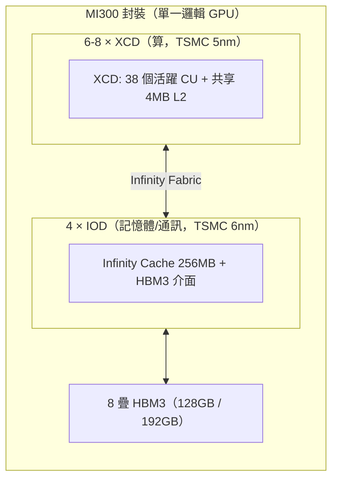

# CDNA3 / MI300（gfx942）架構與 ISA 深入筆記

> **來源（兩份 AMD 官方 PDF，整理自 PDF，日期 2026-07-14）：**
> - **AMD CDNA3 Architecture White Paper**（架構白皮書，27 頁）— [`../../../amd-cdna-3-white-paper.pdf`](../../../amd-cdna-3-white-paper.pdf)
> - **AMD Instinct MI300 (CDNA3) Instruction Set Architecture**（ISA 指令集手冊，561 頁）— [`../../../amd-instinct-mi300-cdna3-instruction-set-architecture.pdf`](../../../amd-instinct-mi300-cdna3-instruction-set-architecture.pdf)
>
> **對應硬體：** CDNA3 架構 / AMD Instinct **MI300**（MI300X 獨立 GPU、MI300A APU）/ LLVM target **`gfx942`**。
>
> **一句話定位：** 這是**本 repo 實驗平台（MI300 / gfx942）的第一手規格**——所有 kernel、benchmark、TensileLite tuning 都跑在這顆硬體上，遇到「這顆卡長怎樣、支援哪些 MFMA、有幾個暫存器」直接查這份。
>
> 頁碼標記說明：白皮書引用寫「(WP p.N)」；ISA 手冊寫「(ISA p.N of 553)」，用的是手冊自己的頁碼。MI350 / CDNA4（gfx950）是另一位 worker 負責的**未來 migration 目標**，本文只在對照處提及，不展開。

---

## 1. 白話總覽：MI300 到底是一顆怎樣的硬體，為什麼這樣設計

先用大白話把整顆卡講清楚，後面再進細節。

**（1）它不是「一整塊晶片」，而是一堆小晶粒（chiplet）疊起來拼出來的。**
傳統 GPU 是一大塊 silicon，但做太大良率會爛、成本會爆。CDNA3 改用 **3D 封裝 + chiplet**：把「算」和「記憶體/通訊」拆成不同小晶粒，各自用最適合的製程做，再用 **AMD Infinity Fabric**（晶片內部的高速網路）綁在一起，對外看起來仍是「一顆邏輯處理器」。(WP p.2, p.4)

- 負責「算」的小晶粒叫 **XCD**（Accelerator Complex Die，加速器複合晶粒），用 TSMC 5nm，裡面塞的是運算單元 CU 與最底層的 cache。
- 負責「記憶體/通訊」的小晶粒叫 **IOD**（I/O Die），用 TSMC 6nm，裡面放新的 **Infinity Cache**（末級快取）與 **HBM3** 記憶體介面。
- MI300 最多疊 **8 個 XCD + 4 個 IOD + 8 疊 HBM3**。(WP p.2)

**（2）它為 AI/ML 而生，重點在「矩陣運算」與「小資料型別」。**
GEMM（矩陣乘法）是深度學習的核心運算，CDNA3 每個 CU 裡都有一顆 **Matrix Core**（矩陣引擎），用 **MFMA** 指令做矩陣乘加。相較上一代 MI250X，FP16/BF16 吞吐 ×3.4、INT8 ×6.8，還**新增了 FP8 與 TF32**——資料型別越小，越省記憶體/快取、吞吐越高、越適合大型語言模型（LLM）。(WP p.6-8)

**（3）記憶體階層被整個重新設計，還加入了「快取一致性」。**
因為 chiplet 化，cache 從「靠著運算單元」變成「分層散在 XCD 與 IOD」：CU 私有的 L1/LDS → XCD 內共享的 4MB L2 → IOD 上的 256MB **Infinity Cache** → HBM3。而且為了讓 MI300A 這種「CPU+GPU 同封裝」的 APU 能共享記憶體，L2 成為硬體自動維護一致性的最底層。(WP p.8-11)

**（4）同一個架構長出兩種產品：**
- **MI300X**（獨立 GPU）：8 個 XCD、304 CU，火力全開拚 AI 訓練/推論。
- **MI300A**（APU）：把 GPU 砍到 6 個 XCD（少 25%）換進 3 顆「Zen 4」x86 CPU 晶粒，CPU 與 GPU **共用同一份記憶體**，是世界第一顆資料中心 APU，主打 HPC。(WP p.3, p.23)

一句話總結這一段：

> **MI300 = 「一堆小晶粒（算的 XCD + 管記憶體的 IOD）用 Infinity Fabric 拼成的一顆邏輯 GPU」，設計目標就是把矩陣運算（MFMA）與小資料型別（FP8/TF32）的吞吐拉到最高，並用重新設計的多層快取餵飽它。**

---

## 2. 架構重點（來自 CDNA3 白皮書）

### 2.1 chiplet 組成：XCD 與 IOD

CDNA2 的做法是「把兩塊一樣的晶粒拼起來」（同質），CDNA3 則是**真正的異質 chiplet**：一顆處理器由十幾塊各司其職的小晶粒組成。(WP p.4)



**XCD 內部（WP p.5）：**

- 每個 XCD 有一組共享全域資源：scheduler、hardware queues、**4 個 ACE**（Asynchronous Compute Engine，非同步計算引擎，負責把 workgroup 派給 CU）。
- 每個 ACE 對應 40 個 CU，但**實際只啟用 38 個 CU**（另 2 個關掉做良率管理，這就是為什麼常看到「MI300X = 304 CU」而不是 8×40=320）。
- 這 38 個 CU 共享一個 **4MB L2 cache**，L2 負責彙整整個晶粒的記憶體流量。

> **ACE ≠ Shader Engine（SE）**：ACE 是「命令前端」（讀 queue、派 workgroup），SE 是「執行後端」
> （把 CU 分群，每群自帶 SPI 分派器）——兩者是並存的兩條軸、都源自 GCN，ACE 不是 CDNA 版的 SE。
> 詳細對照見 [execution-model.md 的「硬體實體階層補充」](../gpu_knowledge/execution-model.md#硬體實體階層補充xcd--shader-engine--cuse-是什麼和-ace-差在哪)。
- 用 6-8 個 XCD 拼起來，最多 **304 CU**（比 MI250X 多約 40%）。(WP p.5)

### 2.2 CU（Compute Unit）與 Matrix Core

CU 是「運算的心臟」，是完整的多執行緒平行核心：指令 fetch/排程、scalar/vector/matrix 執行單元、load/store pipeline，加上 L1 cache 與 **LDS**（Local Data Share，工作群組內共享的 scratch RAM）。(WP p.6)

關鍵數字（WP p.6, p.8）：

- **指令 cache**：兩個 CU 共享，容量倍增到 **64KB、8-way**。
- **LDS**：維持 **64KB / CU**（與 CDNA2 相同）。
- **L1 向量資料 cache**：cache line 從 64B 倍增到 **128B**，容量倍增到 **32KB**，對 core 的頻寬也翻倍。**L1 採非常寬鬆的一致性模型，需要明確同步（見 §4.5 `s_waitcnt`）才有強一致性保證**——這點對讀寫組語很重要。

**Matrix Core（矩陣引擎）是這代最大的改進點：**

- 為既有型別加速：相較 MI250X，**FP16/BF16 ×3.4、INT8 ×6.8**。(WP p.6, Table 1)
- **新增 TF32**：19-bit 格式 = FP16 的 10-bit 尾數 + BF16 的 8-bit 指數 + 1 sign bit。名字取「TF32」是因為它幾乎可以無痛取代 FP32 又更快。(WP p.7)
- **新增 FP8（兩個 OCP 變體）**：E5M2（訓練用，範圍大）與 E4M3（推論用，精度高）。FP8 峰值吞吐是 FP32 的 16 倍。(WP p.7-8) —— 注意 **gfx942 硬體實作的是 FNUZ 變體**，細節見 §3.4。
- **稀疏（4:2 structured sparsity）**：當每 4 個值中至少 2 個是 0（50%+ 稀疏，常見於 transformer/LLM），Matrix Core 可用壓縮表示把吞吐再翻倍，最高達 **8K ops/clock/CU**。支援 INT8/FP8/FP16/BF16。(WP p.8)

#### 各數值格式的理論峰值吞吐（MI300X vs MI250X，Table 1，WP p.6）

| 運算 | MI300 (FLOPS/clock/CU) | MI250X (FLOPS/clock/CU) | MI300X 峰值 | 對 MI250X 加速 |
|------|------------------------|--------------------------|-------------|----------------|
| Matrix FP64 | 256 | 256 | 163.4 TFLOP/s | 1.7× |
| Vector FP64 | 128 | 128 | 81.7 TFLOP/s | 1.7× |
| Matrix FP32 | 256 | 256 | 163.4 TFLOP/s | 1.7× |
| Vector FP32 | 256 | 128 | 163.4 TFLOP/s | 3.4× |
| Matrix TF32 | 1024 | N/A | 490.3 TFLOP/s | 新增 |
| Matrix FP16 | 2048 | 1024 | 1307.4 TFLOP/s | 3.4× |
| Matrix BF16 | 2048 | 1024 | 1307.4 TFLOP/s | 3.4× |
| Matrix FP8 | 4096 | N/A | 2614.9 TFLOP/s | 新增 |
| Matrix INT8 | 4096 | 1024 | 2614.9 TOPs | 6.8× |

> 直覺：型別越小，每 clock 每 CU 能塞的乘加就越多（FP64 256 → FP8 4096，差 16 倍），這就是為什麼 tuning 時會優先想用最小可接受的型別。

### 2.3 記憶體階層：L1 → L2 → Infinity Cache → HBM3

這是 CDNA3 相較前代改動最大的地方。由內而外：(WP p.8-11)

| 層級 | 位置 | 大小 | 關鍵特性 | 頻寬（aggregate） |
|------|------|------|----------|-------------------|
| **VGPR / AGPR / LDS** | CU 內 | LDS 64KB/CU | 最快，手動管理（LDS）或編譯器配置（暫存器） | — |
| **L1 向量 cache** | CU 內 | 32KB/CU | 128B line，寬鬆一致性 | — |
| **L2 cache** | XCD 內共享 | 4MB，16-way，16 通道×256KB | **XCD 內私有**、是硬體自動維護一致性的最底層 | 讀取最高約 **34.4 TB/s**（8 個 XCD 合計） |
| **Infinity Cache（LLC / MALL）** | IOD 上 | **256MB**，16-way，128 通道 | memory-side cache（只快取記憶體內容、不吸收 dirty 資料、**不參與一致性**） | **17.2 TB/s** |
| **HBM3** | 封裝上 8 疊 | 128GB(MI300A) / 192GB(MI300X) | 5.2 Gbps，匯流排 1024-bit × 8 = 8192-bit | **5.3 TB/s** |

要點：

- **L2 是「每個 XCD 私有」，不跨 XCD 共享**。這正是後面 tuning 時 WGM（workgroup mapping）/ staggerU 想解的問題——把會用到同一塊資料的 workgroup 盡量排到同一個 XCD，才吃得到 L2。詳見 [`../gpu_knowledge/memory-hierarchy-and-chiplet.md`](../gpu_knowledge/memory-hierarchy-and-chiplet.md)。
- **Infinity Cache 是 memory-side cache**：它掛在 IOD、貼著記憶體控制器，只快取「記憶體有的內容」，不處理 snoop 流量，所以效率高、還能快取原本 uncacheable 的 I/O buffer。(WP p.10)
- L2 內含 channel 概念（16 通道，每通道 64B 寫），往 IOD 的介面每 XCD 共 1KB/clock。(WP p.11)

### 2.4 封裝、Infinity Fabric 互連與分割（partitioning）

- **Infinity Fabric（4th Gen）**：晶片內把所有 XCD/IOD/HBM/Infinity Cache 綁成約 **4TB/s** 的 on-package 網路；對外連結升級到 **32 Gbps**。(WP p.15, p.26)
- 每個 IOD 有 2 條 x16 雙向 inter-package Infinity Fabric link，其中一條可設定為 **x16 PCIe Gen5** 純 I/O。(WP p.15)
- **MI300X 平台**：用 7 條 Infinity Fabric link 組成「全連接 8-GPU」節點（OCP UBB 板型），每張卡另有 x16 PCIe Gen5 連 host。對 allreduce/allgather 這類集合通訊特別有利。(WP p.16)
- **空間分割（spatial partitioning）**：一顆 MI300 可切成多個 virtual GPU。
  - MI300X：最多 **8 個分割**（SPX 1 / DPX 2 / QPX 4 / CPX 8 個 XCD 對應），另有 HBM 的 NPS（NPS1 / NPS4）記憶體分割，記憶體分割數需 ≤ GPU 分割數。(WP p.12-14)
  - MI300A：最多 **3 個分割**（SPX / TPX），每分割 2 個 XCD。
  - 支援 SR-IOV 虛擬化。

### 2.5 MI300A（APU）vs MI300X（獨立 GPU）完整規格對照（Table 2，WP p.23-25）

| 項目 | MI300A APU | MI300X 獨立 GPU |
|------|-----------|-----------------|
| 架構 | AMD CDNA3 | AMD CDNA3 |
| XCD 數 | 6 | 8 |
| Compute Units | **228** | **304** |
| Stream Processors | 14,592 | 19,456 |
| Matrix Cores | 912 | 1,216 |
| 峰值 engine clock | 2,100 MHz | 2,100 MHz |
| Zen 4 CPU 晶粒（CCD） | 3（共 24 核） | 無 |
| CPU/GPU 統一記憶體 | 是 | 無 |
| 電晶體數 | 146 Billion | 153 Billion |
| FP64 Vector | 61.3 TF | 81.7 TF |
| FP32 Vector | 122.6 TF | 163.4 TF |
| FP64 / FP32 Matrix | 122.6 TF | 163.4 TF |
| TF32 Matrix（稀疏） | 490.3（980.6）TF | 653.7（1,307.4）TF |
| FP16 / BF16（稀疏） | 980.6（1,961.2）TF | 1,307.4（2,614.9）TF |
| FP8（稀疏） | 1,961.2（3,922.3）TF | 2,614.9（5,229.8）TF |
| INT8（稀疏） | 1,961.2（3,922.3）TOPs | 2,614.9（5,229.8）TOPs |
| 記憶體容量 | 128GB HBM3 | 192GB HBM3 |
| 記憶體介面 | 1024-bit × 8 疊 | 1024-bit × 8 疊 |
| 記憶體頻寬（峰值） | up to 5.3 TB/s | up to 5.3 TB/s |
| L1 / L2 / Infinity Cache | 32KiB / 4MB / 256MB | 32KiB / 4MB / 256MB |
| 分割數 | up to 3 | up to 8 |
| Form factor | SH5 Socket | OAM |
| 最大功耗 | 550W 或 760W | 750W |

> 本 repo 的實驗多半針對 **MI300X**（304 CU、192GB）。MI300A 的差異記著即可：CU/記憶體較少、但 CPU 與 GPU 共用同一份記憶體（省掉 host↔device copy）。

---

## 3. ISA 重點（來自 MI300 ISA 手冊）

ISA 手冊 561 頁，這裡只抓對 **GEMM / kernel / 讀組語 / tuning** 最有用的部分。手冊章節大綱：1 Introduction、2 Program Organization、3 Kernel State、4 Program Flow Control、5 SALU、6 VALU、**7 Matrix Arithmetic（MFMA，最關鍵）**、8 Scalar Memory、9 Vector Memory、10 Flat Memory、11 Data Share（LDS）、12 Instructions（逐條 opcode）、13 Microcode Formats。

### 3.1 執行模型與基本名詞（ISA Ch.1-2）

- **Wavefront**：64 個 work-item（lane）一起在一個 CU 上平行執行（AMD 的 wave 是 **64**，不是 NVIDIA 的 32）。(ISA p.4)
- **SALU（Scalar ALU）**：每個 wavefront 只算一個共同值，管所有控制流。
- **VALU（Vector ALU）**：每個 work-item 各有自己的 VGPR，逐 lane 做算術。
- **Workgroup**：一群能快速同步、並透過 LDS 共享資料的 wavefront。
- 每條指令是 **32 或 64 bit**。

### 3.2 暫存器檔（Register File）與 Kernel State（ISA Ch.3, p.8）

這是 tuning 時算 occupancy 的硬體上限，務必記牢：

| 暫存器 | 數量 / 大小 | 說明 |
|--------|-------------|------|
| **VGPR**（V0–V255） | **256 個** × 32-bit | 一般向量暫存器（architectural VGPR，"Arch"） |
| **AccVGPR / AGPR**（AV0–AV255） | **256 個** × 32-bit | **Matrix Core 專屬的累加暫存器**（Accumulation VGPR） |
| **SGPR**（S0–S103） | **104 個** × 32-bit | 純量暫存器 |
| **LDS** | **64KB** | 工作群組內共享的 scratch RAM，帶簡單算術能力 |
| EXEC | 64-bit | 執行遮罩，每 lane 一 bit，控制哪些 thread 執行 |
| VCC | 64-bit | 向量比較結果遮罩 |
| SCC | 1-bit | 純量比較結果 |
| M0 | 32-bit | 暫存用途（GPR indexing、bounds 等） |

**Arch VGPR vs AGPR 的直覺（ISA p.40）：**
Matrix Core 有「自己的一份 VGPR 檔」叫 AGPR，跟一般 SIMD 用的 Arch VGPR 分開。MFMA 指令用一個 **ACC bit** 決定資料是走 Arch 還是 Acc VGPR（A/B 各由 ACC 欄位的低/高 bit 控制，C/D 由 **ACC_CD** bit 控制）。兩者之間用 `V_ACCVGPR_READ` / `V_ACCVGPR_WRITE` 搬資料。

> 為什麼重要：真實 GEMM kernel 會把累加器（C/D 矩陣）放進 **AGPR**，把 256 個 Arch VGPR 留給 A/B 載入與其他運算，藉此塞下更多 wave（提高 occupancy）。這也是 `asm/example03` 刻意只用 Arch VGPR、真實 kernel 卻用 AGPR 的原因（見 [`../isa/mfma-deep-dive.md`](../isa/mfma-deep-dive.md)）。

### 3.3 MFMA：矩陣乘加指令（ISA Ch.7，本 repo 的重中之重）

**MFMA = Matrix Fused-Multiply-Add**，用 Matrix Core 做 `D = C + A × B`。

**核心原始運算**：Matrix Core 硬體的基本單元是 **4×1 乘 1×4 的外積**（outer product），產生 16 個輸出值；MFMA 指令就是把這個原始運算平行/串接組合出來的。(ISA p.40)

> Matrix Core 的**微架構與 dataflow**（外積陣列如何把 A/B 從 VGPR 流過去、累加回 AGPR，以及 MFMA 與 VALU 共用 issue port、為何能用 prefetch 藏延遲、CDNA3 vs CDNA4 在這一層的差異）另有專節整理：[`../isa/mfma-deep-dive.md` §7 Matrix Core 微架構與 dataflow](../isa/mfma-deep-dive.md#7-matrix-core-微架構與-dataflow)。

**指令命名規則（一定要會拆）：**

```text
V_MFMA_[輸出型別]_[M]X[N]X[K][_[B]B]_[輸入型別]
```

- `M × N × K`：每個 block 的矩陣維度（A 是 M×K、B 是 K×N、D/C 是 M×N）。
- `B`（`_2B` / `_4B` / `_16B`）：一次算幾個 block（blocks），沒寫就是 1。
- 例：`V_MFMA_F32_16x16x16_F16` = 輸入 FP16、累加/輸出 F32、單一 16×16×16 block。
- 語意：`D[b,i,j] = C[b,i,j] + Σ_k A[b,i,k] * B[b,k,j]`。(ISA p.46)

#### Dense MFMA 指令列表（Table 28，ISA p.42）

`Cycles` 欄是該變體的執行 pass 數（越大延遲越高，排程時要用更多獨立指令去掩蓋，見 §3.6）。

| 指令 | 常見形狀（Variants） | Blocks | Cycles | 說明 |
|------|----------------------|--------|--------|------|
| `V_MFMA_F32_*_F32` | 32x32x1_2B / 16x16x1_4B / 4x4x1_16B / 32x32x2 / 16x16x4 | 2/4/16/1/1 | 64/32/8/64/32 | F32 A&B 的矩陣乘（FMA） |
| `V_MFMA_F32_*_F16` | 32x32x4_2B / 16x16x4_4B / 4x4x4_16B / **32x32x8** / **16x16x16** | 2/4/16/1/1 | 64/32/8/32/16 | F16 A&B 矩陣乘 |
| `V_MFMA_F32_*_BF16` | 32x32x4_2B / 16x16x4_4B / 4x4x4_16B / **32x32x8** / **16x16x16** | 2/4/16/1/1 | 64/32/8/32/16 | BF16 A&B 矩陣乘 |
| `V_MFMA_I32_*_I8` | 32x32x4_2B / 16x16x4_4B / 4x4x4_16B / **32x32x16** / **16x16x32** | 2/4/16/1/1 | 64/32/8/32/16 | I8 A&B（輸出 I32） |
| `V_MFMA_F32_*_XF32` | 16x16x8 / 32x32x4 | 1 | 16/32 | F32 資料但降精度乘（即 TF32；尾數取 10-bit） |
| `V_MFMA_F64_*_F64` | 16x16x4 / 4x4x4_4B | 1/4 | 32/16 | F64 矩陣乘（DGEMM） |
| `V_MFMA_F32_*_BF8_BF8` / `_BF8_FP8` / `_FP8_BF8` / `_FP8_FP8` | **16x16x32** / **32x32x16** | 1 | 16/32 | FP8/BF8 矩陣乘（A、B 可各自選 FP8 或 BF8） |

**實務上 GEMM 最常用的是那幾個「單 block、大 K」的變體**（表中粗體）：`16x16x16_F16`、`32x32x8_F16`、`16x16x32_I8`、`16x16x32_FP8` 等——K 越大，每條 MFMA 攤到的資料搬運越划算。

**MFMA 的硬性行為（Table 28 附註，ISA p.42）：**

- **忽略 MODE 的 Round Mode，強制 RNE**（round-to-nearest-even）；忽略 exec mask，對所有 thread 當作 1。
- 不支援例外（DGEMM 例外，見 §3.4）。
- Src0/Src1 只能是 VGPR，Src2（即 C）可用 inline/constant；VGPR 位址需偶數對齊。
- 輸入/輸出暫存器必須**連續且對齊到所需暫存器數**（例如需要 4 個輸入暫存器就得從能被 4 整除的起點開始）。

**register layout 直覺（ISA p.41, p.43）：** 一個 wave 有 64 lane，MFMA 把矩陣元素攤在「lane × register」的二維座標上（每欄一個 lane、每列一個 register/logical item）。輸出以 **4×N 的 tile** 為單位打包（這是 Matrix Core 內部結構造成的）。完整公式（`l = j + 32*((i/4)%2)` 等）見 ISA p.43-47；本 repo 另有 [`../isa/mfma-deep-dive.md`](../isa/mfma-deep-dive.md) 會以 `asm/example03` 為起點推廣。

#### 稀疏 MFMA：V_SMFMAC 家族（Table 32，ISA p.52）

做 4:2 結構化稀疏的 `D = C + A × B`，其中**只有 A 稀疏**（每 4 個沿 K 方向的值有 2 個為 0），非零值壓緊成 2:1，另用一個 VGPR 存「哪兩個非零」的 2-bit 索引。

| 指令 | 形狀 | Cycles | 說明 |
|------|------|--------|------|
| `V_SMFMAC_F32_*_F16` | 16x16x32 / 32x32x16 | 16/32 | 稀疏 F16 |
| `V_SMFMAC_F32_*_BF16` | 16x16x32 / 32x32x16 | 16/32 | 稀疏 BF16 |
| `V_SMFMAC_I32_*_I8` | 16x16x64 / 32x32x32 | 16/32 | 稀疏 I8 |
| `V_SMFMAC_F32_*_{BF8/FP8}_{BF8/FP8}` | 16x16x64 / 32x32x32 | 16/32 | 稀疏 FP8/BF8 |

> 注意稀疏版的 K 是稠密版的 2 倍（例如 F16 稠密 16x16x16 → 稀疏 16x16x32），對應「A 壓掉一半、吞吐翻倍」。SMFMAC 是 accumulate 型（C 與 D 同一 VGPR，Src2 改放索引）。

### 3.4 資料型別細節：FP8 / BF8 與「FNUZ」是什麼（ISA Ch.7.2-7.3, p.50-52）

**先解釋 FNUZ**：FNUZ = **F**inite **N**aN **U**nsigned **Z**ero，意思是這個 8-bit 浮點格式「**沒有無限大（Inf）、只有一種 NaN 編碼、而且只有一個（無正負號的）零**」。把本來拿去表示 ±Inf/±0/多種 NaN 的編碼省下來，換取多一點可表示的有限數值範圍。**gfx942（CDNA3）的 FP8/BF8 就是 FNUZ 變體**——這點從 ISA 的格式表可以直接看出來：

#### Small Float 格式（Table 30，ISA p.50）

| 格式 | Sign-Exp-Mant | bias | ±0 | INF | NaN | Max(norm) |
|------|---------------|------|-----|-----|-----|-----------|
| FP16 | E5M10 | 15 | 0x0000 / 0x8000 | 0x7C00 / 0xFC00 | 正常 | 65504 |
| **FP8** | **E4M3** | 8 | **只有 0x00（無 −0）** | **N/A（無 Inf）** | **0x80（單一 NaN）** | 240 |
| **BF8** | **E5M2** | 16 | 只有 0x00 | 0x80 | 0x80 | 57344 |

- gfx942 名詞對應：ISA 把 **E4M3 叫「FP8」**（尾數多、精度高，推論用）、**E5M2 叫「BF8」**（指數多、範圍大，訓練用）。
- 「FP8 只有一個 NaN、沒有 Inf、只有一個零」正是 FNUZ 的特徵；在 LLVM/HIP 型別上對應 `__hip_fp8_e4m3_fnuz` / `__hip_fp8_e5m2_fnuz`（或 rocBLAS/hipBLASLt 的 `*_fnuz` datatype）。
- **對照未來**：CDNA4 / gfx950（MI350，另一位 worker 負責）改用 **OCP** 標準的 FP8（`e4m3`/`e5m2` 非 FNUZ）並加入 MXFP。所以在 gfx942 上做 FP8 tuning 時，型別要選 **FNUZ 版**，migrate 到 gfx950 時型別名稱與數值行為會變——這是重要的相容性陷阱。白皮書用 OCP 命名（E5M2/E4M3）描述，硬體實際行為以本 ISA 表為準。

**轉換指令**：`CVT_PK_FP8_F32` / `CVT_PK_BF8_F32`（packed，兩個一起轉，RNE）、`CVT_SR_FP8_F32` / `CVT_SR_BF8_F32`（stochastic rounding，用一個隨機值輔助 rounding，訓練常用）；反向 `CVT_F32_FP8` 等。要正確產生 FP8/BF8 結果，需設 `SH_MEM_CONFIG` bit[8]=1。(ISA p.50-51)

**浮點 denorm / 例外處理（ISA p.52）：** `V_MFMA_F32_*_F32` 尊重 MODE 的 denorm 旗標；但 XF32(TF32)、所有 <32-bit 型別（F16/BF16/FP8/BF8）與 C 輸入/結果輸出都**忽略 MODE.denorm、不 flush denormal**；`V_MFMA_F64`（DGEMM）強制 RNE、允許 denorm，且**唯一支援算術例外**的 MFMA。

### 3.5 記憶體與 LDS 指令（ISA Ch.8-11）

讀 TensileLite 產出的 GEMM 組語時會大量遇到這些：

- **Scalar Memory（SMEM，Ch.8）**：`s_load_dword*` 從常數/唯讀路徑載入到 SGPR（例如 kernel 參數、descriptor）；`s_memrealtime`、`s_dcache_wb/inv`。
- **Vector Memory Buffer（MUBUF/MTBUF，Ch.9）**：`buffer_load/store_*`，透過 **buffer resource descriptor（V#）** 描述位址/格式/stride。支援 **buffer load 直接寫進 LDS**（GEMM prefetch 常用，繞過 VGPR）。有 scope / temporal（nt = non-temporal）控制。
- **Flat / Global / Scratch（Ch.10）**：`global_load/store_dword{,x2,x4}` 是 GEMM 搬 A/B tile 的主力；scratch 是 per-thread private spill。
- **Data Share / LDS（DS，Ch.11）**：`ds_read/write_b32/b64/b128`，用立即 offset 定址；GEMM 把 global 載入的 tile 先擺進 LDS，再由各 lane 讀出餵給 MFMA。LDS 的 bank conflict 是效能關鍵（見 [`../isa/lds-bank-conflicts.md`](../isa/lds-bank-conflicts.md)）。

### 3.6 同步：`s_waitcnt` 與手動插入 wait state（ISA Ch.3.1, Ch.4.4-4.5, Ch.7.5）

**為什麼需要它（白話）：** GPU 為了掩蓋延遲，記憶體指令是「發出去就繼續往下跑」，不會等資料回來。硬體只幫你解大部分相依，少數情況**要程式自己插 `s_waitcnt`** 等資料到位，否則會讀到舊值。(ISA p.19)

硬體用幾個「計數器」追蹤還沒完成的指令，`s_waitcnt` 就是「等某個計數器降到某值以下再繼續」：

| 計數器 | 位寬 | 計的是 | 白話 |
|--------|------|--------|------|
| **VMCNT** | 6-bit | 已發出但未完成的 **VMEM**（向量記憶體）指令 | 等 `global_load` / `buffer_load` 的資料回來 |
| **LGKMCNT** | 4-bit | **L**DS / **G**DS / **K**（constant/scalar 讀）/ **M**essage | 等 `ds_read` / `s_load` 完成 |
| **EXPCNT** | 3-bit | export / GDS | 等輸出完成 |

- 不同型別的 VMEM 回傳可能亂序；同型別依發出順序回（scalar-memory-read 例外，只能用 `s_waitcnt 0`）。(ISA p.19)
- 另有 **VSCNT**（vector store count，gfx9 系列），對應組語裡的 `s_waitcnt_vscnt`——store 完成的計數。
- **MFMA 專屬的相依（Ch.7.5, Table 37, ISA p.55-58）**：矩陣指令**不是單一 cycle 完成**，且中間結果可被觀察到，所以在「發出 MFMA」與「讀它的結果 / 改它的輸入暫存器」之間，**必須插入一定數量的獨立指令或 `s_nop`**。需要的等待數取決於前一條 MFMA 是幾 pass、以及第二條怎麼用那個暫存器（當 SrcC 累加可 0 等待、當 SrcA/B 或跨型別則要等更多）。例：「非 DL VALU 寫 VGPR → MFMA 讀該 VGPR」需 2 個 wait；「MFMA 寫 → 一般 VALU/VMEM 讀」依 pass 數要 5/7/11/19。

> 實務直覺：這就是為什麼真實 GEMM kernel 會**連發多條 MFMA 並穿插 LDS/global prefetch**——用「有用的獨立工作」去填 MFMA 的延遲空檔，而不是空等 `s_nop`。

---

## 4. 對本 repo 的意義（怎麼用到 hipBLASLt / TensileLite / 寫 kernel / 讀組語）

| 這份規格的事實 | 在本 repo 怎麼對應 |
|----------------|--------------------|
| LLVM target = **`gfx942`** | 編譯 `hipcc --offload-arch=gfx942`；TensileLite logic YAML 的 `ArchitectureName: "gfx942"`。選錯代號 kernel 不會在這張卡跑（見 [`../isa/amd-datacenter-gpu-isa.md`](../isa/amd-datacenter-gpu-isa.md)）。 |
| MFMA 形狀表（Table 28） | TensileLite 的 `MatrixInstruction` 9-element 就是在挑這裡的 M×N×K×B 變體與型別；`__builtin_amdgcn_mfma_f32_16x16x16f16` 這類 intrinsic 直接對應某一列。GEMM 選 shape ≈ 在這張表裡選一列。 |
| 256 VGPR + 256 AGPR + 64KB LDS | occupancy 上限；累加器放 **AGPR**、A/B 放 Arch VGPR，才塞得下更多 wave（見 [`../gpu_knowledge/execution-model.md`](../gpu_knowledge/execution-model.md) occupancy 段）。 |
| FP8 = **FNUZ** 變體 | 在 gfx942 上做 FP8 GEMM/tuning 要用 `*_fnuz` 型別；migrate 到 gfx950(OCP FP8) 時型別行為會變，需重新驗證。 |
| L2 **per-XCD 私有**、Infinity Cache 256MB | 解釋 WGM / staggerU 為何存在、Origami/Formocast 怎麼估 L2/MALL 命中率（見 [`../gpu_knowledge/memory-hierarchy-and-chiplet.md`](../gpu_knowledge/memory-hierarchy-and-chiplet.md)）。 |
| `s_waitcnt`(vmcnt/lgkmcnt) + MFMA 需插獨立指令 | 讀 TensileLite 產出的 `.s` 時看到滿滿的 `s_waitcnt`、`s_nop`、連發 MFMA 就懂在做什麼（見 [`../isa/gfx942-isa-reference.md`](../isa/gfx942-isa-reference.md)、[`../isa/mfma-deep-dive.md`](../isa/mfma-deep-dive.md)）。 |
| 稀疏 SMFMAC + hipSparseLt | ROCm 6 起支援稀疏 core；若做 4:2 稀疏 GEMM 對應 Table 32。 |

---

## 5. 名詞（Terminology）

- **CDNA3**：AMD 資料中心 GPU 的第 3 代運算架構（MI300 系列）。對應 LLVM target `gfx942`。
- **XCD（Accelerator Complex Die）**：裝運算單元（CU）與 L1/L2 的加速器小晶粒，TSMC 5nm。MI300 有 6-8 個。
- **IOD（I/O Die）**：裝 Infinity Cache 與 HBM3 介面的 I/O 小晶粒，TSMC 6nm。MI300 有 4 個。
- **CU（Compute Unit）**：GPU 的運算核心，含 scalar/vector/matrix 單元 + L1 + LDS。MI300X 有 304 個。
- **Matrix Core**：CU 內做矩陣乘加的引擎，執行 MFMA/SMFMAC 指令。
- **MFMA（Matrix Fused-Multiply-Add）**：`D = C + A×B` 的矩陣指令家族（`V_MFMA_*`）。
- **SMFMAC**：4:2 稀疏版 MFMA（只有 A 稀疏）。
- **AGPR / AccVGPR（Accumulation VGPR）**：Matrix Core 專屬、與一般 Arch VGPR 分開的暫存器檔（AV0–AV255，256 個），常用來放累加器。
- **VGPR / SGPR**：向量（每 lane 各一，256 個）/ 純量（每 wave 共用，104 個）暫存器。
- **LDS（Local Data Share）**：workgroup 內共享的 64KB scratch RAM。
- **Wavefront / wave**：64 個 work-item 一組平行執行的單位。
- **FNUZ（Finite, NaN, Unsigned Zero）**：gfx942 的 8-bit 浮點變體——無 Inf、單一 NaN、單一無號零，換取更大有限範圍。FP8=E4M3FNUZ、BF8=E5M2FNUZ。
- **TF32（XF32）**：19-bit 混合格式（FP16 的 10-bit 尾數 + BF16 的 8-bit 指數），可近似取代 FP32。ISA 指令中稱 XF32。
- **Infinity Cache（MALL / LLC）**：IOD 上的 256MB memory-side 末級快取，不參與一致性。
- **Infinity Fabric**：把所有 chiplet 與外部裝置綁在一起的高速互連（on-package 約 4TB/s）。
- **`s_waitcnt` / VMCNT / LGKMCNT / EXPCNT / VSCNT**：等待記憶體指令完成的計數器與同步指令。
- **APU（MI300A）vs 獨立 GPU（MI300X）**：前者含 3 顆 Zen4 CPU 晶粒且 CPU/GPU 共用記憶體；後者純 GPU、火力更大。

---

## 6. 交叉連結

- 官方規格索引（哪份 PDF 對應哪一代）：[`../isa/spec-sources.md`](../isa/spec-sources.md)
- 產品線 ↔ CDNA 世代 ↔ gfx 代號對照：[`../isa/amd-datacenter-gpu-isa.md`](../isa/amd-datacenter-gpu-isa.md)
- gfx942 opcode 速查（stub，待擴充）：[`../isa/gfx942-isa-reference.md`](../isa/gfx942-isa-reference.md)
- MFMA 指令變體 / register layout 深入（stub，待擴充）：[`../isa/mfma-deep-dive.md`](../isa/mfma-deep-dive.md)
- 記憶體階層與 XCD 晶粒組織：[`../gpu_knowledge/memory-hierarchy-and-chiplet.md`](../gpu_knowledge/memory-hierarchy-and-chiplet.md)
- 執行模型（grid/block/wave/CU/occupancy）：[`../gpu_knowledge/execution-model.md`](../gpu_knowledge/execution-model.md)
- 頂層學習地圖：[`../README.md`](../README.md)
- 本資料夾（internal_docs）索引：[`./README.md`](./README.md)

---

## 7. 一句話總結

> **MI300 / gfx942 是「一堆 XCD（算）+ IOD（記憶體）用 Infinity Fabric 拼成的一顆 CDNA3 GPU」；它的效能核心是 Matrix Core 的 MFMA 指令（支援 FP16/BF16/INT8/FP8-FNUZ/TF32/FP64 與 4:2 稀疏），受限於每 CU 的 256 VGPR + 256 AGPR + 64KB LDS，並靠 `s_waitcnt` 與 MFMA 間插入獨立指令來管相依——這三件事（MFMA 表、暫存器上限、同步語意）就是本 repo 做 GEMM tuning 與讀組語時最常回來查的第一手依據。**

---

## 8. 來源

- **AMD CDNA3 Architecture White Paper**（架構白皮書，27 頁）：[`../../../amd-cdna-3-white-paper.pdf`](../../../amd-cdna-3-white-paper.pdf)
- **AMD Instinct MI300 (CDNA3) Instruction Set Architecture**（ISA 指令集手冊，561 頁）：[`../../../amd-instinct-mi300-cdna3-instruction-set-architecture.pdf`](../../../amd-instinct-mi300-cdna3-instruction-set-architecture.pdf)

> 本文所有數字與事實均出自上述兩份 PDF（內文以「(WP p.N)」「(ISA p.N of 553)」標註出處）。頻寬/容量等以白皮書內文敘述為準；圖表 legend 若與內文略有出入，以內文為準（已於 §2.3 註明）。
