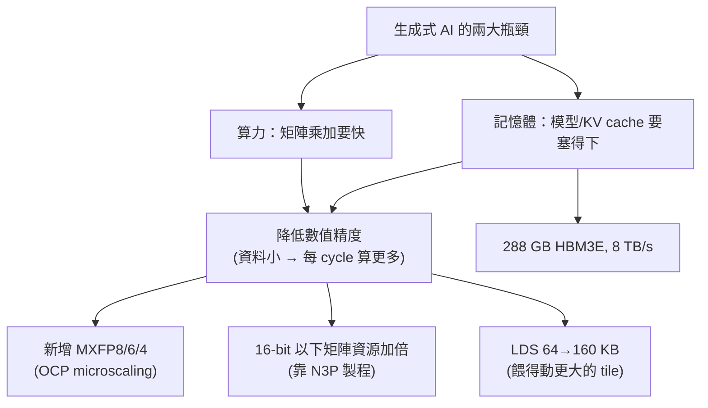

# CDNA4 / MI350（gfx950）深入：架構與 ISA，以及從 gfx942 migrate 要注意什麼

路徑說明：本檔在 `study_docs/internal_docs/`。連同層檔用 `./`、上一層 `study_docs/` 用 `../`、
`isa/` 用 `../isa/...`、`gpu_knowledge/` 用 `../gpu_knowledge/...`。PDF 放在 repo 外的同層
`/data1/perlee/`，從本檔連過去用 `../../../<檔名>.pdf`（`internal_docs/` → `study_docs/` →
`rocm-libraries/` → `/data1/perlee/`）。

> **來源（整理自兩份 AMD 官方 PDF，日期 2026-07-14）：**
>
> - [AMD CDNA™ 4 Architecture White Paper](../../../amd-cdna-4-architecture-whitepaper.pdf)（架構白皮書，21 頁）——
>   架構總覽、XCD/IOD chiplet、CU/Matrix Core、記憶體階層、資料型別（Fig 4）、世代吞吐對照（Table 1, p8）、產品規格（Table 2, p18–19）。
> - [AMD Instinct™ CDNA4 Instruction Set Architecture Reference Guide](../../../amd-instinct-cdna4-instruction-set-architecture.pdf)（ISA 指令集手冊，608 頁 / 內文標 600 頁，版本 5-August-2025）——
>   主要引用 **Chapter 7「Matrix Arithmetic Instructions」（內文 p41–69）**、Ch 2.2.1 LDS（p6）、Ch 3 暫存器（VGPR/AGPR, p8–12）、Ch 6.7.1 Packed Convert（p39–40）、Ch 11.4 MFMA Transpose Load（p98–99）。
> - 對應硬體：**MI350X / MI355X**、架構世代 **CDNA4**、LLVM target **`gfx950`**。
>
> **平台定位（先讀）：** 本 repo 的**實驗 / 研究平台是 MI300（gfx942 / CDNA3）**。
> **本檔（CDNA4 / MI350 / gfx950）是「後續需要時才 migrate 的目標」，不是目前實驗用的架構。**
> 所以本檔的重點不是「把 608 頁指令抄一遍」，而是**「CDNA4 相對 CDNA3 差在哪、migrate 時要改什麼」**。
> 更遠一代（CDNA5 / gfx1250 / MI450）的斷裂式改動另見 [../gpu_knowledge/cdna5-gfx1250.md](../gpu_knowledge/cdna5-gfx1250.md)。
> 產品名 ↔ gfx 代號的總表見 [../isa/amd-datacenter-gpu-isa.md](../isa/amd-datacenter-gpu-isa.md)、官方 PDF 索引見 [../isa/spec-sources.md](../isa/spec-sources.md)。

---

## 1. 白話總覽：CDNA4 到底變了什麼、為什麼

先給一句話抓重點：

> **CDNA4（MI350）不是把 CDNA3（MI300）換個 ISA，而是「同一套 GFX9 家族、往低精度 AI 再壓一級」。**
> 舊 kernel 換個 `--offload-arch=gfx950` 大多能編、能跑；真正要重做的是**資料型別（新增 MXFP、fp8 改 OCP）**、
> **MFMA 指令組合**、以及因為 **LDS 從 64 KB 變 160 KB** 而要重跑的 **tuning**。

為什麼 AMD 這一代把力氣幾乎全押在「低精度 AI」上？因為現代生成式 AI（尤其 transformer / LLM）的瓶頸有兩個：
**算力**（矩陣乘加要夠快）和**記憶體**（參數與 KV cache 要塞得下）。降低數值精度可以「一石二鳥」——
資料變小 → 同樣的資料路徑一個 cycle 能算更多筆（算力↑）、佔的記憶體/頻寬也更少（容量與能效↑）。
CDNA4 就沿著這條路走：

- **新增 MXFP8 / MXFP6 / MXFP4（OCP MX microscaling）**：比 CDNA3 的 fp8 又細又省，是這一代最重要的新東西。
- **把 16-bit 以下型別的矩陣執行資源加倍**：靠新製程（TSMC N3P）多出來的電晶體，讓每個 CU 對 fp16/bf16/fp8 的矩陣吞吐翻倍。
- **LDS 從 64 KB 加大到 160 KB、讀頻寬加倍、可直接從 L1 載入**：因為矩陣乘法對「資料重用」極度依賴 LDS。
- **記憶體升級到 288 GB HBM3E、8 TB/s**：塞得下更大的模型與更長的 context。
- **chiplet 重新切割**：從 4 個 IOD 變 2 個 IOD，降低封裝內互連延遲與功耗。

反過來說，有一件事**變慢**了，migrate FP64/HPC 負載要特別注意：**Matrix FP64 每 cycle 的吞吐被砍半**（見 §4 Table 1）。
AMD 的取捨很明確——把電晶體預算從 FP64 矩陣挪去餵低精度 AI。

---

## 2. 架構重點（來自白皮書）：相對 CDNA3 的變化

### 2.1 封裝與 chiplet：8 XCD + 2 IOD（CDNA3 是 4 IOD）

CDNA3 首創的 **chiplet（小晶片）** 做法在 CDNA4 延續，但**重新切割**了。先解釋兩個名詞：

- **XCD（Accelerator Complex Die，加速器複合晶片）**：放「運算」的晶片——CU、L2 cache 都在這裡，對效能最敏感。
- **IOD（I/O Die，輸入輸出晶片）**：放「記憶體與通訊」的晶片——Infinity Cache、記憶體控制器、Infinity Fabric 都在這裡。

MI350 一顆 GPU = **8 個 XCD（3D 疊在上層）+ 2 個 IOD（下層）+ 8 疊 HBM3E**，用 on-package Infinity Fabric 綁在一起。

| 面向 | CDNA3（MI300X） | CDNA4（MI350X/MI355X） | 為什麼這樣改 |
|------|------|------|------|
| XCD 數 | 8 | 8 | 不變 |
| **IOD 數** | **4** | **2（較大，兩者間直連）** | 簡化封裝內 Fabric、降低延遲與功耗；IOD 間直連比 CDNA3 快約 14% |
| XCD 製程 | N5 | **N3P**（更密、更快） | 電晶體預算拿去加倍低精度矩陣資源 |
| IOD 製程 | N6 | N6（不變） | SRAM / I/O 不吃先進製程，維持成本效益 |

> 直覺：**運算晶片（XCD）用最新製程衝效能，記憶體/IO 晶片（IOD）用便宜製程顧成本**——
> 這正是 chiplet「每塊各用最適製程」的好處。記憶體階層與 chiplet 的觀念補充見
> [../gpu_knowledge/memory-hierarchy-and-chiplet.md](../gpu_knowledge/memory-hierarchy-and-chiplet.md)。

### 2.2 運算規模：CU 略少但每個更強

CDNA4 的每個 XCD 有 **36 個 CU（其中 32 個 active**，留 4 個做良率備援），排成 4 組 × 9 CU。
8 個 XCD 合計**最多 256 個 CU**——比 CDNA3 略少（MI300X 為 304 CU），但**每個 CU 更強**，
所以全域資源（scheduler、hardware queue、ACE）只需小改。

| 規格（Table 2, p18） | MI350X | MI355X |
|------|------|------|
| 架構 / gfx | CDNA4 / gfx950 | CDNA4 / gfx950 |
| XCD 數 | 8 | 8 |
| Compute Units | 256 | 256 |
| Stream Processors | 16,384 | 16,384 |
| Matrix Cores | 1,024 | 1,024 |
| 最高頻率 (peak) | 2,200 MHz | 2,400 MHz |
| 電晶體數 | 185 B | 185 B |
| 記憶體 | 288 GB HBM3E | 288 GB HBM3E |
| 記憶體頻寬 (peak) | 8.0 TB/s | 8.0 TB/s |
| 功耗 | 1000 W（氣冷 AC） | 1400 W（液冷 DLC） |

> MI350X 與 MI355X 差別主要在**功耗/散熱與時脈**（進而影響 peak 算力），架構與記憶體容量相同。
> MI350X 走「drop-in 相容前代 MI325X 平台」路線，MI355X 走「液冷、最大效能密度」路線。

### 2.3 記憶體階層：LDS 大改，其餘微調

這一代對記憶體階層的重點就是 **LDS（Local Data Share，CU 內的軟體可控共享記憶體）**。先講為什麼 LDS 對 GEMM 這麼關鍵：
矩陣乘法會**大量重用**同一批 A/B 資料，把它們搬進 LDS 一次、重複讀很多次，才不會一直去打 L2/HBM。所以 LDS 越大、頻寬越高，
矩陣單元就越不容易「餓著」。

| 階層 | CDNA3 | CDNA4 | 變化 |
|------|------|------|------|
| **LDS / CU** | **64 KB**（32 banks × 512 entries × 4B） | **160 KB**（64 banks × 640 entries × 4B） | **>2 倍容量**；讀頻寬加倍到 **256 bytes/clock**；**可直接從 L1 載入**（省 VGPR 與延遲） |
| L1 vector cache | 32 KB | 32 KB（128B line、64-way） | 幾乎不變 |
| L2 cache / XCD | 4 MB | 4 MB（16-way、16 channels，每 cycle 128B 讀 + 64B 寫） | 幾乎不變；新增可 cache 非同調 DRAM 資料、writeback 保留副本等同調優化 |
| Instruction cache | — | 64 KB（8-way，**相鄰兩 CU 共用**） | — |
| Infinity Cache | 256 MB | 256 MB（16-way、掛 8 疊記憶體） | 組織不變 |
| HBM | 192 GB HBM3 / 5.3 TB/s（MI300X） | **288 GB HBM3E / 8.0 TB/s**（8 Gbps，比 MI325X 快 >33%） | 容量升到 36 GB/stack × 8 |

> **LDS 三個改動對 GEMM 的意義**：(1) 容量翻倍 → 可放更大的 tile；(2) 讀頻寬翻倍 → 餵得動加倍後的矩陣單元；
> (3) 可從 L1 直接載入 LDS → 少一次「先進 VGPR 再寫 LDS」的搬運，降低 VGPR 壓力與延遲。**這三點直接改變 tile 大小的最佳解，所以 tuning 必須重跑（見 §6）。**

### 2.4 互連與分割（partitioning）

- **Infinity Fabric**：8 條 16-bit 全雙工連結，每條 38.4 Gbps（CDNA3 為 32 Gbps，快約 20%），
  單向 76.8 GB/s；每 GPU 對外 >1 TB/s（P2P 聚合 1075.2 GB/s、總聚合 1203.2 GB/s）。其中 1 條配成 PCIe Gen5 接 host。
- **Compute 分割**：SPX（1 分割 / 8 XCD）、DPX（2 分割 / 各 4 XCD）、QPX（4 分割 / 各 2 XCD）、CPX（8 分割 / 各 1 XCD）——
  可把一顆 GPU 切成最多 8 個獨立實例服務小模型推論。
- **Memory 分割（因為 IOD 從 4 變 2 而大改）**：**NPS1**（288 GB 跨 8 疊全交錯，好移植）或
  **NPS2**（切成 2 × 144 GB，各綁一個 IOD，流量不跨 IOD → 延遲/頻寬/功耗更好）。最有效率的模式是 **DPX+NPS2**。

### 2.5 資料型別總覽（Fig 4, p7）

CDNA4 硬體支援的數值格式（重點在後半段的低精度）：

| 型別 | 位元結構 | 說明 |
|------|------|------|
| float64 / float32 / float16 | 傳統 IEEE | 高精度、科學計算用 |
| **fp8（OCP OFP8）** | E5M2 / E4M3 | 每個 tensor 一個 scale（per-tensor） |
| **mxfp8** | E5M2 / E4M3 + 共享指數 | **每 32 個元素共用一個 8-bit scale**（block n×32） |
| **mxfp6** | E3M2 / E2M3 + 共享指數 | 每 32 元素共享 scale |
| **mxfp4** | E2M1 + 共享指數 | 每 32 元素共享 scale，最省 |
| int8 | 7-bit + sign | 整數推論 |

> 「E**x**M**y**」讀法：x 個指數位、y 個尾數位（另有 1 個符號位）。例如 **E4M3 = 4 指數 + 3 尾數**（動態範圍小、精度較高，偏推論）；
> **E5M2 = 5 指數 + 2 尾數**（範圍大、精度低，偏訓練）。MXFP 的關鍵詞是**「每 32 個元素共用一個 scale」**（見 §5 的 MX 說明）。

---

## 3. ISA 重點（來自 ISA 手冊）：新增/改變的指令與型別

這一節是本檔的核心，全部對照 **Chapter 7 Matrix Arithmetic Instructions**。先建立心智模型，再看新指令。

### 3.1 Matrix Core 與暫存器：AGPR 仍在（跟 CDNA3 一樣）

Matrix Core 是 CDNA 的矩陣運算單元，它有**自己的一組暫存器 AccVGPR（俗稱 AGPR）**，跟一般的 Arch VGPR 分開：

- **Arch VGPR（V0–V255）**：一般向量暫存器。
- **AccVGPR / AGPR（AV0–AV255）**：矩陣累加專用；一個 wave 最多 **512 個** VGPR（Arch + Acc 兩池共用這個上限）。
- MFMA 指令用 **ACC / ACC_CD bit** 指定 A/B/C/D 各自放在 Arch 還是 Acc；用 `V_ACCVGPR_READ` / `V_ACCVGPR_WRITE` 在兩者間搬資料。

> 這點**與 CDNA3 相同**（CDNA3 也是 256 VGPR + 256 AGPR、MFMA 累加寫 AGPR）。AGPR 是什麼、為何存在、
> 為何 epilogue 要把累加器搬回 VGPR，詳見 [../gpu_knowledge/cdna5-gfx1250.md](../gpu_knowledge/cdna5-gfx1250.md) §1
> （該檔講的是「gfx1250 把 AGPR 拿掉」，但前半段對 AGPR 的解釋對 gfx942/gfx950 完全適用）。
> **重點：AGPR 在 CDNA4 還在，要到 CDNA5 / gfx1250 才會被併進 VGPR。**

Matrix Core 的最小運算原語是 **4×1 乘 1×4 的外積（outer product）→ 產生 16 個輸出**；dense 與 2:4 sparse 都用這個原語串起來組成 MFMA。

> Matrix Core 的**微架構與 dataflow**（外積陣列的 operand 流向、issue port、MFMA 佔管線的行為，以及 **CDNA3 vs CDNA4 在這一層的差異**——同一套發射模型、把矩陣單元加寬與 LDS 餵料加粗）另見 [`../isa/mfma-deep-dive.md` §7 Matrix Core 微架構與 dataflow](../isa/mfma-deep-dive.md#7-matrix-core-微架構與-dataflow)。

### 3.2 MFMA 指令命名法

MFMA 指令長這樣：`V_MFMA_[輸出型別]_[M]x[N]x[K][_[B]B]_[輸入型別]`

- `M x N x K`：每個 block 的矩陣維度（`D(M×N) = C(M×N) + A(M×K) × B(K×N)`）。
- `B`（可選）：一次做幾個 block（不寫就是 1）。
- 例：`V_MFMA_F32_16x16x32_F16` = 輸出 F32、輸入 F16、單 block、16×16 輸出、K=32。

### 3.3 新增的 MFMA 型別/形狀（Table 28，重點整理）

下表挑出**對 GEMM / tuning 最有意義**的 dense MFMA。**粗體=CDNA4 的重點新增**：

| 指令 | 形狀 | 輸入型別 | 備註 |
|------|------|------|------|
| `V_MFMA_F32_*_F16` | 16x16x32 / 32x32x16（也有舊的 …x16 / …x8） | FP16 | **更深的 K**（一條算更多），對應 16-bit 資源加倍 |
| `V_MFMA_F32_*_BF16` | 16x16x32 / 32x32x16 | BF16 | 同上 |
| `V_MFMA_I32_*_I8` | 16x16x64 / 32x32x32 | INT8 | 更深的 K |
| `V_MFMA_F32_*_{FP8,BF8}` | 16x16x32 / 32x32x16 | fp8/bf8（**OCP**） | A/B 可混 FP8/BF8 四種組合 |
| **`V_MFMA_F32_16x16x128_F8F6F4`** | 16x16x128 | **FP4/FP6/FP8 混合** | **A、B 各自獨立選型別**（見下）；若 A 或 B 是 F8 → 32 cycle，否則 16 cycle |
| **`V_MFMA_F32_32x32x64_F8F6F4`** | 32x32x64 | **FP4/FP6/FP8 混合** | 同上；F8 → 64 cycle，否則 32 cycle |
| **`V_MFMA_SCALE_F32_16X16X128_F8F6F4`** | 16x16x128 | **MXFP（帶 block scale）** | **這就是 MXFP 的硬體入口**（見 §3.4） |
| **`V_MFMA_SCALE_F32_32X32X64_F8F6F4`** | 32x32x64 | **MXFP（帶 block scale）** | 同上 |
| `V_MFMA_F64_*_F64` | 16x16x4 / 4x4x4_4B | FP64 | 保留，但每 cycle 吞吐砍半（見 §4） |

**`F8F6F4` 的「A/B 各自獨立選型別」怎麼運作**：這兩條指令用 **CBSZ[2:0] 指定 A 矩陣格式、BLGP[2:0] 指定 B 矩陣格式**
（本來 CBSZ/BLGP 是 broadcast 控制欄位，這裡被重新定義），支援任意混搭：

| CBSZ/BLGP 編碼 | 格式 |
|------|------|
| `000` | E4M3（FP8） |
| `001` | E5M2（BF8） |
| `010` | E2M3（FP6） |
| `011` | E3M2（BF6） |
| `100` | E2M1（FP4） |

> 對 tuning 的意義：CDNA4 讓你可以「A 用 FP4、B 用 FP6」這種混合精度 GEMM，一條指令搞定——這是 CDNA3 沒有的彈性。

### 3.4 Block Scaled Matrices：MXFP 的硬體實作（7.2）

這是**理解 MXFP 最關鍵的一節**。所謂「block scaling（區塊縮放）」就是：

- **沿 K 維度每 32 個元素為一個 block，共用一個 scale factor。**（block size = 32，格式 F4/F6/F8）
- **scale 的格式是 E8M0**：8-bit「純指數」（bias 127，有效值 −127..127，`0xFF` 表 NaN）——也就是一個 2 的次方倍率。
- **計算流程**：dot product 算完後、accumulate 之前，把 scale 乘進去。硬體實際做的是把指數相加：
  `d_exp = (a0_exp+b0_exp) + (a1_exp+b1_exp) + … + c_exp + scale_a + scale_b`。

`V_MFMA_SCALE_F32_*_F8F6F4` 是一條 **4-DWORD 指令**，把「載入 scale」和「MFMA」融合成一條：
以 `V_MFMA_F32_16x16x128_F8F6F4` 為例，K=128 → 每 32 個 K 一個 scale → **每列 4 個 scale**；M=N=16 → 16 列 →
共 `16 × 4 = 64` 個 8-bit scale（剛好是一個 VGPR 的 1/4，分佈在 64 個 lane）。scale 可來自 VGPR 或 inline constant（取 float 的指數部分）。

> **一句話抓住 MX**：「per-tensor scale」（整個 tensor 一個倍率，CDNA3 的 fp8 是這樣）→「micro scaling」（每 32 個元素一個倍率）。
> 顆粒更細 → 同一個低精度格式能用在更多樣的 tensor 上而不爆掉動態範圍。這就是 OCP MX 標準的核心，也是 CDNA4 最大的新賣點。

### 3.5 fp8 從 FNUZ 改成 OCP 變體（7.3，Table 30）

CDNA4 的 ISA 明確把 fp8/bf8 定義為 **OCP OFP8 變體**，數值特性如下：

| 格式 | Sign-Exp-Mant | Bias | INF | NaN | Max | 判讀 |
|------|------|------|------|------|------|------|
| FP8 | E4M3 | **7** | **無 INF** | `0x7F` / `0xFF` | **448** | OCP E4M3（偏推論） |
| BF8 | E5M2 | **15** | **有 INF**（`0x7C`/`0xFC`） | `0x7D–7F` | 57344 | OCP E5M2（偏訓練） |
| FP6 | E2M3 | 1 | 無 | 無 | 7.5 | — |
| BF6 | E3M2 | 3 | 無 | 無 | 28.0 | — |
| FP4 | E2M1 | 1 | 無 | 無 | 6.0 | — |

**為什麼這對 migrate 很重要**：CDNA3（gfx942）的 fp8 用的是 **FNUZ 變體**（E4M3FNUZ / E5M2FNUZ，
"Finite, No inf, Unsigned Zero"），其 bias、max、NaN/INF 表示法與 OCP **不同**（例如 CDNA3 的 E4M3FNUZ 無 INF、
只有單一 NaN、max 約 240）。CDNA4 換成 OCP 後**同一批 fp8 bit pattern 的數值意義會變**，所以 fp8 的資料、scale、
校正流程 migrate 時不能直接沿用。（CDNA3 側 FNUZ 的精確數字以
[../isa/amd-datacenter-gpu-isa.md](../isa/amd-datacenter-gpu-isa.md) 與 CDNA3 ISA 為準；
本 repo 的產品線對照已標明「CDNA3 用 FNUZ、CDNA4 用 OCP」。）

> 小提醒：CDNA4 白皮書的散文把 CDNA3 的 fp8 也籠統稱為「OCP 8-bit Floating Point Specification」，
> 但**兩代的實際 ISA 數值定義不同**（FNUZ vs OCP OFP8）——以 ISA 手冊 Table 30 的具體數字為準，別被白皮書措辭誤導。
> 另外：要讓 BF8/FP8 運算結果正確，`SH_MEM_CONFIG` 的 bit[8] 必須設為 1。

### 3.6 TF32 改為 BF16 軟體模擬

CDNA3 有 **TF32**（NVIDIA 帶起的專有格式）的**硬體原生**支援。CDNA4 在與客戶/生態討論後
**把 TF32 移出硬體，改用 BF16 做軟體模擬**。對多數模型精度相同，但這代表：**如果舊程式依賴 TF32 的硬體路徑，
migrate 後那條路會走 BF16 emulation，效能特性不同**，需要重新評估。

### 3.7 大量新的轉換指令（`CVT_SCALE_*` / `CVT_SR_*`，6.7.1 & 7.3）

為了讓新格式「好用」，CDNA4 加了一整批 pack/unpack 與帶 scale 的轉換指令：

- **`CVT_SCALE_PK_{FP4,FP6,BF6,FP8,BF8}_{F32,F16,BF16}`** 及反向：在 F32/F16/BF16 與 F4/F6/F8 之間互轉，
  並套用 **E8M0（bias 127）的 8-bit scale**（每 32 個元素共享一個）——這是把資料打包成 MXFP 的工具。
- **`CVT_SR_*`（Stochastic Rounding，隨機捨入）**：`CVT_SR_FP8_F32` / `CVT_SR_BF8_F32` / `CVT_SR_FP16_F32` /
  `CVT_SR_BF16_F32` 等。低精度訓練常用隨機捨入來降低量化偏差；F32/F16/BF16 → FP4/FP6 需多趟（multipass）並每趟重抽亂數。
- 溢位行為受 `FP16_OVFL` 控制（設了就 clamp 到 ±MAX，否則 ±INF/NaN）；轉到 FP4/FP6 超範圍會 saturate、過小則變 0。

### 3.8 Sparse（2:4 結構化稀疏）也加深了 K（7.5，Table 33）

`V_SMFMAC_*` 系列做 **4:2 結構化稀疏**（A 矩陣每 4 個元素有 2 個為 0，只存非零 → 2:1 壓縮，只有 A 可稀疏）。
CDNA4 新增了**更深 K** 的變體：

- `V_SMFMAC_F32_16x16x128_{BF8/FP8 四種組合}`、`V_SMFMAC_I32_16X16X128_I8`（K=128）
- `V_SMFMAC_F32_32x32x64_{BF8/FP8}`、`V_SMFMAC_I32_32X32X64_I8`（K=64）

搭配 Table 1 的稀疏欄，稀疏可讓 fp8/fp16 等再多一倍 peak（例：FP8 5.0 PF → 10 PF）。

### 3.9 新的 LDS transpose load，專門餵 MFMA（11.4）

CDNA4 新增 **`DS_READ_B64_TR_B16 / _B8 / _B4` 和 `DS_READ_B96_TR_B6`**：在把資料從 **LDS 載到 VGPR 時順手做矩陣轉置**
（16/8/6/4-bit 資料各一種）。這對 GEMM 很實用——A 常是 column-major、B 常是 row-major，用 transpose load 就不必額外花指令去喬 layout，
直接餵給 MFMA。（用前 EXEC 要全 1、LDS 位址要對齊資料大小。）

---

## 4. 世代吞吐對照（Table 1, p8）：哪些變快、哪些變慢

下表是**每 clock、每 CU** 的理論吞吐（FLOPS/clock/CU），以及 MI355X 對 MI300X 的 peak 加速比。**這張表最能一眼看出 CDNA4 的取捨**：

| 運算 | MI300X (per clk/CU) | MI355X (per clk/CU) | MI355X peak | 加速比 |
|------|------|------|------|------|
| Vector FP64 | 128 | 128 | 78.6 TF | ~0.96× |
| Vector FP32 | 256 | 256 | 157.3 TF | ~0.96× |
| Vector FP16 | 256 | 256 | 157.3 TF | ~0.96× |
| **Matrix FP64** | **256** | **128** | 78.6 TF | **~0.5×（砍半！）** |
| Matrix FP32 | 256 | 256 | 157.3 TF | ~0.96× |
| Matrix FP16 \| 稀疏 | 2048 | **4096** | 2.5 \| 5.0 PF | 1.9× |
| Matrix BF16 \| 稀疏 | 2048 | **4096** | 2.5 \| 5.0 PF | 1.9× |
| Matrix FP8 \| OCP-FP8 稀疏 | 4096 | **8192** | 5.0 \| 10 PF | 1.9× |
| Matrix INT8 \| 稀疏 | 4096 | **8192** | 5.0 \| 10 POPs | 1.9× |
| **Matrix MXFP6** | NA | **16384** | 10 PF | 全新 |
| **Matrix MXFP4** | NA | **16384** | 10 PF | 全新 |

重點解讀：

- **低精度 AI 全面加倍**（fp16/bf16/fp8/int8 每 CU 吞吐 ×2），再加 **MXFP6/MXFP4 全新**（每 CU 16384，peak 10 PF）。
- **Matrix FP64 每 cycle 砍半**（256 → 128）——這是最需要注意的 regression。**HPC / DGEMM 為主的負載 migrate 前務必評估**。
- Vector 與 Matrix FP32 大致持平（peak 略降是因為 CU 數從 304 → 256、時脈/功耗取捨）。
- 另外白皮書提到 **transcendental（超越函數）速率 ×2**，用來加速 attention 的 softmax，維持整體 pipeline 平衡。

---

## 5. CDNA3 → CDNA4 遷移對照（gfx942 → gfx950）

一張表看「哪些變了、要改什麼」：

| 面向 | CDNA3 / gfx942（MI300） | CDNA4 / gfx950（MI350） | migrate 時要做什麼 |
|------|------|------|------|
| 編譯 target | `--offload-arch=gfx942` | `--offload-arch=gfx950` | 改 target；大多數 kernel 可重編（同 GFX9 家族，非斷裂式） |
| fp8 格式 | **FNUZ**（E4M3FNUZ / E5M2FNUZ） | **OCP OFP8**（E4M3 bias7/max448、E5M2 有 INF） | fp8 資料/scale/校正**不可直接沿用**，需按 OCP 重做 |
| 低精度新型別 | 無 | **MXFP8 / MXFP6 / MXFP4（OCP MX，每 32 元素共享 E8M0 scale）** | 想吃 MXFP 要用 `V_MFMA_SCALE_*_F8F6F4` + `CVT_SCALE_*` 打包 |
| MFMA 指令 | fp16/bf16/fp8/int8 MFMA（K 較淺） | 新增 **F8F6F4 混合精度**、**SCALE（MXFP）**，並**加深 K** | 重寫/重選 MFMA 指令；A/B 可混精度 |
| Matrix FP64 | 256 /clk/CU | **128 /clk/CU（砍半）** | FP64/HPC 負載要重評效能 |
| TF32 | 硬體原生 | **BF16 軟體模擬** | 依賴 TF32 硬體路徑的程式要重評 |
| 16-bit 以下矩陣吞吐 | 基準 | **×2 /clk/CU** | 峰值變高，但要重跑 tuning 才吃得到 |
| LDS / CU | 64 KB | **160 KB**（讀頻寬 ×2、可從 L1 直載） | tile / LDS 預算的最佳解改變 → **重跑 tuning** |
| VGPR / AGPR | 256 + 256（AGPR 仍在） | 256 + 256（**AGPR 仍在**） | 心智模型不變（AGPR 到 CDNA5 才移除） |
| CU 數 | 304 | 256 | 佔用率/grid 規劃略調 |
| 記憶體 | 192 GB HBM3 / 5.3 TB/s | 288 GB HBM3E / 8.0 TB/s | 可放更大模型/更長 context |
| Memory partition | NPS1/2/4（4 IOD） | **NPS1 / NPS2（2 IOD）** | 最有效率模式改為 **DPX+NPS2** |
| wavefront | wave64 | wave64（不變） | 不變 |

> 一句話：**gfx942 → gfx950 是「同家族升級」而非「換 ISA」**（對比 gfx950 → gfx1250 才是斷裂式，見
> [../gpu_knowledge/cdna5-gfx1250.md](../gpu_knowledge/cdna5-gfx1250.md)）。真正要花力氣的是**資料型別（fp8 OCP、MXFP）、
> MFMA 指令組合、以及因 LDS 變大而必須重跑的 tuning**——不是「換個 flag 就好」。

---

## 6. 對本 repo 的意義：migrate 到 MI350 的 checklist

本 repo（hipBLASLt / TensileLite）目前一切都在 gfx942 上跑。若哪天要 migrate 到 gfx950，照這張 checklist 走：

1. **編譯 target**：`hipcc --offload-arch=gfx950`（或 build 系統對應設定）。先確認能編、能跑正確性。
2. **TensileLite 要重跑 tuning**：產出的 logic YAML 裡 `ArchitectureName: "gfx950"`——**不能沿用 gfx942 的 tuning 結果**。
   因為 LDS（64→160 KB）、矩陣吞吐（×2）、MFMA 形狀都變了，最佳 tile / MI 選擇會不同。
   （tuning 流程見 [../isa/amd-datacenter-gpu-isa.md](../isa/amd-datacenter-gpu-isa.md) 與
   [./tensilelite-kernel-generator.md](./tensilelite-kernel-generator.md)。）
3. **MFMA 指令選型**：想吃新型別要改用對應 opcode——
   - 一般 fp8/bf8：注意已是 **OCP** 語意；
   - 混合精度 fp4/fp6/fp8：`V_MFMA_F32_*_F8F6F4`（CBSZ/BLGP 選 A/B 型別）；
   - **MXFP（帶 scale）**：`V_MFMA_SCALE_F32_*_F8F6F4` + 用 `CVT_SCALE_*` 把資料打包成「每 32 元素一個 E8M0 scale」。
   - TensileLite 端已有 MX（MXFP8/MXFP4）kernel 的參考 YAML，見
     [./tensilelite-yaml-config-kernel-a-e.md](./tensilelite-yaml-config-kernel-a-e.md)。
4. **能不能吃 MXFP？** 硬體支援（見 §3.4），但要確認上層（hipBLASLt API / TensileLite codegen / 你的呼叫端）
   有把資料按 MX 格式（block=32、E8M0 scale）準備好；否則只是「硬體支援」但「軟體沒餵對」。
5. **fp8 數值正確性**：因 FNUZ → OCP，fp8 的量化/反量化、scale、以及任何 hard-code 的常數都要按 OCP 重新驗證。
   另記得設 `SH_MEM_CONFIG` bit[8]=1（通常由 runtime/編譯器處理，但除錯時要知道）。
6. **FP64 / HPC 負載特別留意**：Matrix FP64 每 cycle 砍半——若你的 workload 以 DGEMM 為主，migrate 後可能變慢，要先量測。
7. **LDS 用量重規劃**：160 KB 讓更大 tile 成為可能，但也要重算 occupancy（LDS 與 VGPR 一起決定一個 CU 能掛幾個 wave）。

---

## 7. 名詞（Terminology）

- **CDNA4 / gfx950 / MI350**：同一顆 GPU 的三個名字——架構世代 CDNA4、LLVM target `gfx950`、產品名 MI350X/MI355X。
- **XCD（Accelerator Complex Die）**：放運算（CU + L2）的 chiplet；MI350 有 8 個。
- **IOD（I/O Die）**：放記憶體/通訊（Infinity Cache + 記憶體控制器 + Infinity Fabric）的 chiplet；CDNA4 有 2 個（CDNA3 是 4 個）。
- **LDS（Local Data Share）**：CU 內軟體可控的共享記憶體（類似 NVIDIA 的 shared memory）；CDNA4 為 160 KB/CU。
- **MFMA（Matrix Fused-Multiply-Add）**：CDNA 的矩陣乘加指令 `v_mfma_*`，GEMM 算力來源。
- **AGPR / AccVGPR**：矩陣累加專用暫存器，獨立於一般 VGPR；CDNA4 仍在（CDNA5 才併入 VGPR）。
- **MX（OCP Microscaling）**：OCP 制定的「微縮放」低精度標準——**一小塊（block）資料共用一個 scale**。
- **MXFP8 / MXFP6 / MXFP4**：MX 家族的浮點格式；CDNA4 用 **block=32、scale=E8M0** 實作。
- **scale block（區塊縮放）**：沿 K 維度每 32 個元素共用一個 scale factor（CDNA4 的做法）。
- **E8M0**：8-bit「純指數」格式（bias 127），MX 的 scale 用它——本質是一個 2 的次方倍率。
- **ExMy**：浮點小格式的位元配置——x 個指數位、y 個尾數位（+1 符號位）。如 E4M3 / E5M2 / E2M1。
- **OCP vs FNUZ fp8**：兩種 fp8 規格。**FNUZ**（Finite, No inf, Unsigned Zero，CDNA3 用）與 **OCP OFP8**（CDNA4 用）
  在 bias、max、INF/NaN 表示法上不同 → bit pattern 的數值意義不同。
- **TF32 軟體模擬**：CDNA4 不再硬體原生支援 TF32，改用 BF16 模擬其行為。
- **Stochastic Rounding（隨機捨入）**：`CVT_SR_*` 指令用的捨入法，降低低精度量化的系統性偏差。
- **NPS1 / NPS2（NUMA Per Socket）**：記憶體分割模式——NPS1 全交錯、NPS2 切成 2 池各綁一個 IOD。
- **SPX / DPX / QPX / CPX**：compute 分割模式（1 / 2 / 4 / 8 個分割）。

---

## 8. 交叉連結

- 同層 CDNA3 對照（另一位 worker 建立中）：[./cdna3-mi300-architecture-and-isa.md](./cdna3-mi300-architecture-and-isa.md)
- 官方 PDF 索引（CDNA3/CDNA4 白皮書 + ISA）：[../isa/spec-sources.md](../isa/spec-sources.md)
- 產品名 ↔ CDNA 世代 ↔ gfx 代號總表：[../isa/amd-datacenter-gpu-isa.md](../isa/amd-datacenter-gpu-isa.md)
- 更下一代（CDNA5 / gfx1250 / MI450）的斷裂式改動：[../gpu_knowledge/cdna5-gfx1250.md](../gpu_knowledge/cdna5-gfx1250.md)
- 記憶體階層與 chiplet 觀念：[../gpu_knowledge/memory-hierarchy-and-chiplet.md](../gpu_knowledge/memory-hierarchy-and-chiplet.md)
- 本資料夾其他相關檔（TensileLite / MX kernel 參考）：
  [./tensilelite-kernel-generator.md](./tensilelite-kernel-generator.md)、
  [./tensilelite-yaml-config-kernel-a-e.md](./tensilelite-yaml-config-kernel-a-e.md)
- 頂層學習地圖：[../README.md](../README.md)

---

## 9. 一句話總結

> **CDNA4（MI350 / gfx950）= 「CDNA3 同家族、往低精度 AI 再壓一級」**：新增 MXFP8/6/4（OCP MX，每 32 元素共享 E8M0 scale）、
> fp8 從 FNUZ 改 OCP、16-bit 以下矩陣吞吐加倍、LDS 64→160 KB、chiplet 4 IOD→2 IOD、記憶體 288 GB HBM3E/8 TB/s；
> 代價是 Matrix FP64 每 cycle 砍半、TF32 改軟體模擬。**從 gfx942 migrate 主要是換 target + 重做資料型別 + 重跑 tuning，
> 不是換 ISA。**

---

## 10. 來源

- [AMD CDNA™ 4 Architecture White Paper](../../../amd-cdna-4-architecture-whitepaper.pdf)（架構白皮書，21 頁）
- [AMD Instinct™ CDNA4 Instruction Set Architecture Reference Guide](../../../amd-instinct-cdna4-instruction-set-architecture.pdf)（ISA 指令集手冊，608 頁，版本 5-August-2025）

> 本檔數字與事實忠於上述兩份 PDF 的實際內容（LDS 160 KB、HBM 288 GB/8 TB/s、Table 1 吞吐、Table 28/30/33 指令與型別、
> block scaling 細節等）。CDNA3 側（gfx942 / FNUZ）的對照數字以本 repo 既有筆記與 CDNA3 ISA 為準，非本檔兩份 PDF 的內容。
