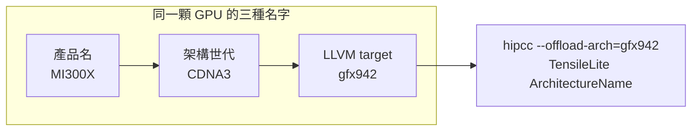

# AMD Datacenter GPU 型號 ↔ ISA 架構對照

路徑說明：本檔在 `study_docs/isa/`。連回頂層用 `../`（如 `../amd-isa-kernel.md`）、
連到別的子資料夾用 `../gpu_knowledge/...`。

> 本 repo 的目標架構是 **gfx942（MI300 / CDNA3）**。這份文件把它放回整條 AMD Instinct
> 產品線裡，讓你知道「gfx942 是誰、上一代下一代是什麼、差在哪」，避免只看單一世代的盲點。

## 白話總覽

AMD 的資料中心 GPU 叫 **Instinct MI 系列**，用的運算架構叫 **CDNA**（一代一代往上：CDNA1 → CDNA4）。
但編譯器（LLVM / hipcc）不認得「MI300」這種行銷名稱，它只認 **ISA 代號 `gfxXXX`**（俗稱 LLVM target）。
所以同一顆 GPU 有三個名字要對得起來：

- **產品名**（人看的）：MI300X、MI350X…
- **架構世代**（AMD 行銷/白皮書）：CDNA3、CDNA4…
- **ISA / LLVM target**（工具鏈認的）：`gfx942`、`gfx950`…

一句話：**產品名 → 架構世代 → gfx 代號，這條對應鏈記熟，編譯與調校才不會選錯目標。**

## 為何重要（知道對應關係有什麼用）

1. **編譯要選對 target**：`hipcc --offload-arch=gfx942`。選錯 gfx 代號，kernel 根本不會在這張卡上跑。
2. **TensileLite tuning 綁架構**：產出的 logic YAML 裡 `ArchitectureName: "gfx942"` 就是這個代號；
   換卡（例如 gfx950）要重跑 tuning，不能直接沿用。
3. **能用哪些資料型別/指令看世代**：MFMA 支援的型別（fp16 / bf16 / fp8 / MXFP…）逐代不同，
   知道自己是哪一代，才知道手上這張卡能不能吃 fp8 / MXFP。

名詞：

- **ISA** = 指令集架構，這裡指 AMDGPU 的組語代號 `gfxXXX`。
- **LLVM target / target ID** = 同一個東西，編譯旗標 `--offload-arch=` / `-mcpu=` 用的值。
- **CDNA** = AMD 資料中心 GPU 的運算架構家族（對比消費級的 RDNA）。

## 對應關係圖



## 核心對照表（Instinct MI 系列 ↔ gfx）

| 產品 | 架構世代 | LLVM target (gfx) | 首度/關鍵特性 | 備註 |
|------|----------|-------------------|----------------|------|
| MI50 / MI60 | Vega20（GCN5，**非 CDNA**） | `gfx906` | **無 MFMA** | 只作對照起點，矩陣算力靠一般 VALU |
| MI100 | CDNA（CDNA1） | `gfx908` | **首度導入 MFMA / Matrix Core** | MFMA 家族從這代開始 |
| MI210 / MI250 / MI250X | CDNA2 | `gfx90a` | 強化 MFMA、原生 FP64 矩陣 | MI250(X) 為雙 die（2 個 GCD） |
| MI300A / MI300X / MI325X | CDNA3 | `gfx942` | 加入 **FP8（FNUZ 變體）**、chiplet（XCD） | **← 本 repo 目標**；MI300A 為 APU（含 CPU） |
| MI350X / MI355X | CDNA4 | `gfx950` | **MXFP8 / MXFP6 / MXFP4（OCP MX）**、更大 LDS（160 KB/CU） | TF32 改為軟體模擬 |

> wavefront 大小：上表所有 CDNA GPU 都是 **wave = 64 lane**（和消費級 RDNA 可能是 32 不同，
> 見下方 CDNA vs RDNA）。

## 世代演進重點（差在哪）

主軸是 **MFMA 支援的資料型別越來越廣**，這直接決定能不能吃低精度 AI 負載：

- **CDNA1（gfx908）**：導入 MFMA，支援 fp16 / bf16 / int8 等（相對 Vega 的一大跳）。
- **CDNA2（gfx90a）**：強化 MFMA 吞吐，強項是 **原生 FP64 矩陣**（HPC 導向）。
- **CDNA3（gfx942）**：加入 **FP8**（E5M2 / E4M3，AMD 用的是 **FNUZ** 變體），並改用 chiplet（多顆 XCD）。
- **CDNA4（gfx950）**：支援 **MXFP8 / MXFP6 / MXFP4**（OCP MX，每 32 個元素共用一個指數），
  fp8 改為 **OCP 變體**；**TF32 改為用 BF16 軟體模擬**（不再是硬體原生）；LDS 加大到 160 KB/CU。

> 想深入 MFMA 指令變體與 register layout（目前聚焦 gfx942），見 [mfma-deep-dive.md](mfma-deep-dive.md)。

## 重要陷阱：gfx940 / gfx941 不要用

你可能在舊資料或某些工具的硬編碼表裡看到 `gfx940` / `gfx941`——**那是 MI300 的 pre-release / A0
工程樣品代號，已淘汰**。所有出貨的 MI300A / MI300X 一律是 **`gfx942`**。判斷本機實際 target 不要用猜的：

```bash
# 直接問硬體它是哪個 gfx（最準）
/opt/rocm*/bin/rocminfo | grep -i gfx
# 或看 HIP/ROCm 完整設定
/opt/rocm*/bin/hipconfig --full
```

看到 `Name: gfx942` 就對了。工具鏈裡也查不到 `gfx940/gfx941`（LLVM AMDGPU backend 不列它們）。

## CDNA vs RDNA（別跟消費級搞混）

同樣是 AMD GPU，但兩條產品線的 ISA 代號段、矩陣指令都不同：

| 家族 | 用途 | 產品 | gfx 段 | 矩陣指令 | wavefront |
|------|------|------|--------|----------|-----------|
| **CDNA** | 資料中心 / HPC / AI | Instinct MI 系列 | `gfx9xx`（gfx908/90a/942/950） | **MFMA**（`v_mfma_*`） | 固定 64 |
| **RDNA** | 消費級遊戲 / 工作站 | Radeon / Radeon PRO | `gfx10xx / 11xx / 12xx` | **WMMA**（非 MFMA） | 32 或 64 |

重點：本 repo 全程用 **CDNA / MFMA / wave64**；若看到 RDNA、WMMA、wave32 的資料，那是另一條線，
不能直接套用。wavefront / SM-CU 的觀念見 [../gpu_knowledge/execution-model.md](../gpu_knowledge/execution-model.md)。

## Terminology

- **Instinct MI 系列** - AMD 的資料中心 GPU 產品線（MI50 → MI355X）。
- **CDNA** - Instinct 用的運算架構家族（CDNA1~CDNA4）；對比消費級的 RDNA。
- **gfx / LLVM target / target ID** - 編譯器認的 ISA 代號（如 `gfx942`），`--offload-arch=` 用的值。
- **MFMA** - CDNA 的矩陣乘加指令（`v_mfma_*`），從 CDNA1（gfx908）開始有；GEMM 算力來源。
- **XCD** - CDNA3 起的 chiplet（Accelerator Complex Die），一顆 GPU 由多個 XCD 組成。
- **FNUZ / OCP（MX）** - 兩種 fp8 / 低精度格式標準；CDNA3 用 FNUZ、CDNA4 支援 OCP MX。

## 交叉連結

- 本 repo 目標架構的 opcode 速查：[gfx942-isa-reference.md](gfx942-isa-reference.md)
- MFMA 指令變體 / register layout（gfx942）：[mfma-deep-dive.md](mfma-deep-dive.md)
- 寫 kernel → 反組譯認得 gfx942 指令：[../amd-isa-kernel.md](../amd-isa-kernel.md)
- wavefront / CU / MFMA 的執行模型觀念：[../gpu_knowledge/execution-model.md](../gpu_knowledge/execution-model.md)
- 頂層學習地圖：[../README.md](../README.md)

## 一句話總結

**Instinct MI 系列（CDNA 架構）每顆 GPU 都有「產品名 → CDNA 世代 → gfx 代號」三個名字；
本 repo 目標是 gfx942（MI300 / CDNA3），上一代是 gfx90a（MI200 / CDNA2）、下一代是 gfx950（MI350 / CDNA4）。
編譯、tuning 認的都是 gfx 代號，記熟這條鏈才不會選錯目標。**

## 來源

本文對應關係與特性查證自（2026-07）：

- ROCm Documentation — GPU hardware specifications（Instinct GPU 型號 / 架構 / LLVM target 表）。
- ROCm Documentation — AMD Instinct MI300 / MI350 Series workload optimization（CDNA3 vs CDNA4 特性、資料型別差異）。
- LLVM — User Guide for AMDGPU Backend（`gfx906/gfx908/gfx90a/gfx942/gfx950` 與 CDNA 世代對應、gfx940/941 已淘汰）。
