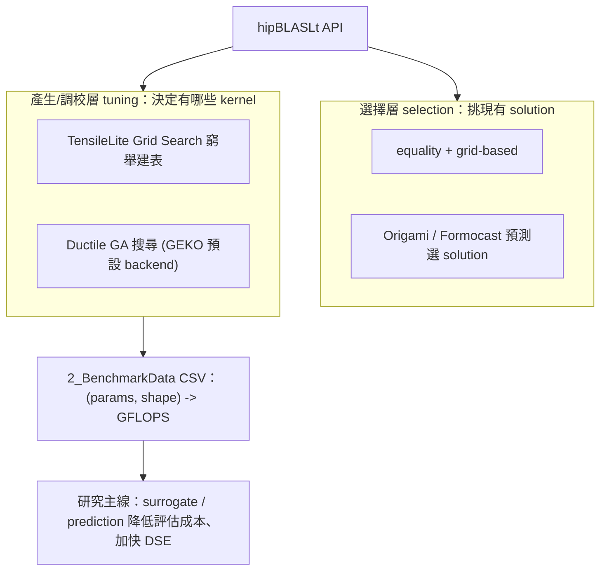
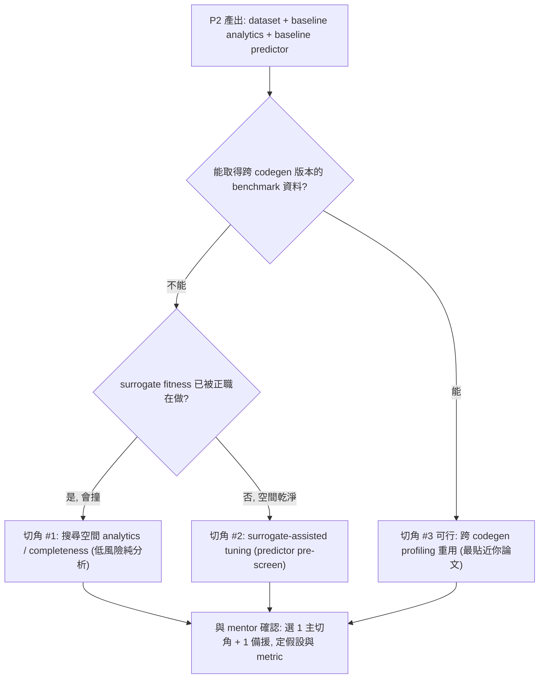

# hipBLASLt / TensileLite 實習學習 Roadmap（8 週）

> **這份是 canonical（唯一可編輯來源）。** 另有兩份只讀 mirror：Claude Code plan 檔
> （`~/.claude/plans/rocm-libraries-repo-familiar-starry-aurora.md`）與 [../.cursor/learning-roadmap.md](../.cursor/learning-roadmap.md)。
> 要改 roadmap **一律改本檔**；在 Claude Code 內改本檔會自動同步兩份 mirror，在 Cursor 內或直接改
> mirror 則需手動同步（見 [../CLAUDE.md](../CLAUDE.md)）。

## Context（為什麼做這份計畫）

你是短期實習生（剩近 2 個月，從 2026-06-25 起算 ~8 週），起步目標是「熟悉 hipBLASLt 與
TensileLite、寫 GPU kernel 熟悉 AMD ISA」。短期硬截止：**2026-07-01** 前把 codebase / workflow
摸熟、HIP 練熟（P0，已完成）。

**方向調整（2026-07-06 與 mentor 談定）**：核心產品項目（Ductile / GEKO 的 GA tuning）皆已有正職
主導，intern 能切入的合併型貢獻僅剩零星小 ticket；mentor 因此**鼓勵往研究型題目發展**。這和你的研究
背景高度同構——你做 NPU tile-level DSE：用 instruction 維度 offline profiling 建 latency 表，痛點是
configuration 一改就要重 profiling、拖慢 DSE，方向是用 **prediction 改善 profiling data 重用、加快
DSE**。因此本 roadmap 後半段（P2~P4）從「codegen 優化 PR」**重導向**為「**用 prediction / surrogate
降低 GEMM tuning 的 profiling 成本、加快 DSE**」的研究線。

**North Star（最終交付的真目標）**：一份**團隊用得上的研究產出**——針對「GEMM tuning 每次 codegen /
config 一改就要重跑 grid search 建表」這個成本問題，用 surrogate / prediction 降低評估成本，交付
**分析 + prototype + writeup**，對接 solution-library GA 搜尋這條線（JIRA `SWDEV-477426`）。

- **真目標（研究主線）**＝在既有 benchmark 資料上建 predictor / analytics，量化「省下多少評估、DSE
加速多少」，產出可被 SolutionSelection / Tensile team 參考的結論；**不需動正職維護的 Ductile/GEKO 核心**。
- **floor（風險底線，非目標）**＝**2~3 顆小 ticket commit**（docs/config/test/小 bug），滿足「main repo
多顆 commit」與熟悉 PR/CI 流程，是研究高變異時的安全網，**不等於**最終交付。
- 每個 phase 都對照〈目標反推總覽〉反推「為了交付，我必須*能做到*什麼」，而非「把教材讀完」。
**最高槓桿的第一步是與 mentor 對齊研究題目 + 資料 / repo 存取**（見 07-08）。


### 生態系定位（本 roadmap 全篇沿用此地圖）

先把名詞理清（你在描述時容易混）：主管講的 **Ductile** 屬**產生 / 調校層（tuning）**，用基因演算法
（GA）取代 grid search 窮舉建表；「預測選 kernel」則屬**選擇層（selection）**，是 Origami / Formocast
的事。研究主線鎖定 **tuning 層的評估成本**，用既有 benchmark CSV 做 offline 建模。




- **痛點對照**：你 NPU 研究「config 一改就要重 profiling」↔ 這裡「codegen / 參數一改就要重跑 grid
笛卡兒積 benchmark」。GA（Ductile）用少量評估找好解；Formocast 用模擬預測免 benchmark——分別對應
你研究的「加快搜尋」與「用預測減少 profiling」兩軸。
- **你的 edge**：Ductile / grid 是整支 kernel end-to-end 量 GFLOPS，沒把 compute / memory 拆開重用；
你論文「拆解 profiling 後跨 config 重用」的想法在此可能是新角度（見 P3 切角 #3）。

本計畫評估了兩份既有資產並把它們融合成一條可執行的學習軌：

- `study_docs/`**（rocm-libraries 內）** — 偏「看懂現有系統」（Track 1）：runtime-flow →
tensilelite-pipeline → gemm-optimization → profiling-rocprof，外加 architecture 導覽。
深度足夠當系統地圖，但 Track 2（動手 ISA）只有方法論，可跑範例靠 [asm/](../../asm) 補上。
- **[asm/](../../asm)（主管未完成的教材）** — 補上 study_docs 缺的實作半邊。四個**完整可編譯、
重注解**的 gfx942 範例，自成漸進：
  - [example01_reduce_sum](../../asm/example01_reduce_sum) — 手寫 AMDGCN reduce baseline + HIP launcher + CMake。
  - [example02_reduce_sum](../../asm/example02_reduce_sum) — 用 rocprof-compute 找瓶頸 → 改 `global_load_dwordx4` 優化（1.9×），
  附完整 roofline / counter 解讀。**這是「profiling 驅動優化」的最佳範本**。
  - [example03_mfma](../../asm/example03_mfma) — **MFMA GEMM + LDS tiling**（`v_mfma_f32_16x16x4_f32`），最接近最終工作，
  附 ATT thread-trace（rocprof-compute-viewer）流程。
  - [example04_global_mem_oob](../../asm/example04_global_mem_oob) — buffer descriptor (V#) / `num_records` 邊界檢查的 ISA 深潛。

**結論：[asm/](../../asm) 作為 Track 2 的實作骨幹**，與 study_docs 的 Track 1 交織。`asm/ex03` 是通往
真實 GEMM 優化的天然橋樑。（`asm/` 在 repo 外的同層 `/data1/perlee/asm`，容器內 `/src/asm`。）

### 環境現況（已驗證，省下數天）

- GPU：**gfx942 (MI300X)**；ROCm 6.4.0 在 host，另有 **ROCm 7.2.0 docker 容器** `perlee`
（[run.sh](../run.sh) 啟動，掛載 `/data1/perlee`→`/src`）。
- hipBLASLt **已建置完成**：[projects/hipblaslt/build/release](../projects/hipblaslt/build/release)
存在，`hipblaslt-bench` 已可用。
→ 不必花時間從頭 build，可直接 bench / profile。
- [asm/](../../asm) 各範例附 CMake，容器內 `cmake -S . -B build && cmake --build build` 即可跑。


### 學習者起點（據此校準節奏）

- 約 1.5 年前寫過簡單 CUDA/Triton（已大半忘），近期在補 GPU 硬體架構 + launch workflow + 軟硬體名詞。
→ **HIP 語法可快速帶過**（CUDA→HIP 幾乎一對一），P0 的 A-1/A-2 視為「喚回記憶 + 對照組語」。
- **讀得懂組合語言** → [asm/](../../asm) 可加速看，gfx942 指令當增量學。
- **優化所知不深**（僅 occupancy、shared memory 資源控管）→ 把時間移到「優化 + profiling」，
這是最薄弱、也是 P3 成敗關鍵。需補的概念：
  - memory coalescing / 向量化載入
  - latency hiding 與 Little's Law
  - compute-bound vs memory-bound 判讀、roofline
  - occupancy ↔ 暫存器/LDS 取捨、bank conflict
  - [asm/example02_reduce_sum/README.md](../../asm/example02_reduce_sum/README.md) 是這些概念最好的單篇教材。
- **全職且願意加碼** → 進度表以工作日為主軸，里程碑排得積極，週末為彈性追進度/緩衝。


### 如何使用本 roadmap

- **每天一個小節**：標題格式 `### MM-DD（週幾）｜一句話主題`，底下是可勾選的
checklist（`- [ ]`）。每天開工前掃一遍當天 checklist，收工前逐項打勾確認進度。
- **目的導向（重要）**：P0~P1 的主 item 以「**搞懂什麼 / 能做到什麼**」為主，而非「讀哪份文件」。
每個主 item 底下有：可勾子項（拆成具體理解點）、一行 `✅ 完成判準`（自我驗證真的懂了）、
一行 `📚 參考資源`（現有 doc / asm 行段 / codebase 路徑 / AMD 選做）。動手項（**跑** / **寫**）
仍附可貼指令與預期輸出。
- **📚 參考資源是手段不是目的**：現有教學文件還不夠完整。資源若標記 **（待擴充：）**，表示
該主題對應一份規劃中、目前只是 outline 的文件（清單見 [README.md](README.md)「規劃中文件」），會隨學習補齊；
在它長好前，以同列其他資源 + codebase 為準。
- **（AMD 資源，選做）** 標記的 item 來自公司內部 HIP 課程與 GCN 架構 talk，是補充非必修；
趕進度時可略過，完整對照見檔末「AMD 訓練資源對照表」。
- **兩層測驗**：每天有**內嵌快速自測**（題數視內容調整，答案收在 `<details>` 摺疊區，先自答再核對）；
完成當天 item 後若想要更深入的檢核，向我要求啟動 `learning-quiz` skill——我會依當天目標生成
互動測驗檔（放 [study_docs/quizzes/](quizzes/)）、批改你的作答、指出要回去補強的具體主題。
- **筆記自己寫**：每天的「筆記提示」列出該記什麼；筆記由**你親手寫**在 [study_docs/notes/](notes/)
（檔名 `MMDD-{當天主題}.md`），用 `learning-notes` skill 開新筆記（含 template），我只協助補
code / doc 連結，不代寫內容。
- **P0–P2 逐日詳列；P3–P4 框架化**（給里程碑、決策樹與可重複套用的迭代 checklist 模板，
因為研究主線是開放式探索，無法預先寫死每天步驟）。

---


## 全程節奏總覽


| 階段  | 日期            | 主題                                                            | 產出                                                                 |
| --- | ------------- | ------------------------------------------------------------- | ------------------------------------------------------------------ |
| P0  | 06-25 ~ 07-01 | Codebase + workflow 摸熟、HIP 練熟（**硬截止**）                        | 能跑 bench/profile、自寫 HIP kernel 反組譯、讀懂 ex01/02                      |
| P1  | 07-02 ~ 07-08 | AMD ISA（ex03 MFMA；ex04 選讀）、tensilelite pipeline 實跑、**收斂研究題目** | 讀懂 MFMA GEMM 組語、跑過一次 Tensile tuning、定案研究切角 + 資料/repo 存取            |
| P2  | 07-09 ~ 07-22 | tuning 參數（gene）空間 + 工具生態 + **資料生成 pipeline** + floor tickets  | 可重跑的 benchmark 資料集 + baseline analytics + 1~2 顆 floor commit       |
| P3  | 07-23 ~ 08-13 | 研究主線（開放式）：三切角決策樹 → 建 predictor/analytics → 量化 DSE 加速          | surrogate/prediction 的分析 + prototype（floor：floor commit 累積到 2~3 顆） |
| P4  | 08-14 ~ 08-20 | 研究 writeup、對接 SWDEV-477426/team、收尾、buffer                     | 研究產出 writeup + commit 清單 + 實習總結                                    |


> 提醒：每個工作日都有單一可 follow 的目標（見下）。落後時用週末補；floor ticket 與研究主線平行推進，
> 但 floor 不佔研究主時段。研究切角在 07-08 先與 mentor 對齊、07-23~25 kickoff 依資料可得性定案。


## 目標反推總覽（每個 phase 學的東西如何用到最終交付）

> 讀法：**從右往左**——先看「研究交付需要的能力」，再確認「在哪學」「解鎖 P3 哪個任務」。
> 任何學習若在此表找不到下游任務，就降級為選讀。


| 研究交付需要的能力                                            | 在哪學（phase / 天）                         | 解鎖 P3 的哪個任務                                     |
| ---------------------------------------------------- | -------------------------------------- | ----------------------------------------------- |
| 判讀 compute/memory-bound、讀 rocprof counter            | P0・06-30（ex02）                         | 定義 predictor 目標 / feature、判讀 benchmark 是否可信     |
| 理解 kernel 參數（gene）空間、gene → kernel 結構映射              | P1・07-07 + P2・07-09~10                 | 定義 predictor 的輸入特徵空間（染色體編碼）                     |
| 跑 grid search 產出 `2_BenchmarkData`、看懂 fitness=GFLOPS | P1・07-06 + P2・07-11                    | 產生研究用的訓練/評估資料                                   |
| 建立可重複的 benchmark 資料生成 pipeline                       | P2・07-14~22                            | predictor 訓練資料 + ground truth（切角 #1/#2/#3 共用地基） |
| tuning 工具生態（grid/GA/Ductile/GEKO/Formocast）定位        | P2・07-11                               | 選對研究切角、對接 SWDEV-477426、避免撞正職                    |
| **研究題目 + 資料/repo 存取 + 是否撞正職**                        | **mentor 對齊軌**（07-08、07-23~25 kickoff） | **選對研究切角、產出團隊用得上的結論**                           |


---


## P0：Codebase + Workflow 摸熟、HIP 練熟（06-25 → 07-01，硬截止）

> 註：North Star 已於 07-06 調整為研究線（見上方 Context），但 **P0 基礎完全不變且更重要**——
> profiling / counter 判讀（06-30）是之後定義 predictor 目標與判讀 benchmark 可信度的根基。P0 已完成，
> 以下日程原貌保留。

階段目標：07-01 結束時，你能:

- (a) 講清楚 build-time / runtime 兩階段如何交接
- (b) 跑 `hipblaslt-bench` + rocprof 並看懂輸出
- (c) 自己寫 HIP kernel 並反組譯對照 gfx942 組語
- (d) 逐行讀懂 ex01/ex02 的組語與優化邏輯
- (e) 建立 GPU 通用心智模型：講清 grid/block/warp/SM/CU 階層、CPU→GPU launch 流程、
CUDA↔HIP 軟硬體名詞對照（這層是讀 gfx942 組語的通用前導）
- (f) **啟動 mentor 對齊**：本週內與 mentor/team 談過一次，產出候選題目 / 素材清單
（這是 North Star 的第一步，比任何讀文件都優先；此次 sync 後方向定為研究線，見 Context）

關鍵檔案：[study_docs/README.md](README.md)、[architecture/README.md](architecture/README.md)、[hipblaslt/](hipblaslt/)、
[asm/example01_reduce_sum/](../../asm/example01_reduce_sum)、[asm/example02_reduce_sum/](../../asm/example02_reduce_sum)、[amd-isa-kernel.md](amd-isa-kernel.md)。

### 06-25（四）｜建立全局地圖 + 進容器驗證工具

**今日目標**：對整個 repo 與 runtime 呼叫鏈有「一張地圖」，且容器內工具鏈全部可用。

- [x] **搞懂** build-time vs runtime 兩階段分工，以及 repo 為何長這樣
  - [x] 能說出「build 時 TensileLite 做食譜、runtime 時 hipBLASLt 查食譜出菜」這條主軸
  - [x] 知道為何只有 [projects/hipblaslt](../projects/hipblaslt) 是完整 source（sparse checkout），其餘是骨架
  - [x] 分清 [library/](../projects/hipblaslt/library)（runtime 本體）vs [tensilelite/](../projects/hipblaslt/tensilelite)（build-time kernel 產生器）的職責
- [x] **搞懂** runtime GEMM 呼叫鏈：`hipblasLtMatmul` 如何一路走到 kernel launch
  - [x] 入口無邏輯：`hipblasLtMatmul`（[library/src/amd_detail/hipblaslt.cpp](../projects/hipblaslt/library/src/amd_detail/hipblaslt.cpp)）只做型別轉換、轉呼叫
  - [x] 收斂成問題：`rocblaslt_matmul_impl`（[rocblaslt/src/rocblaslt_mat.cpp](../projects/hipblaslt/library/src/amd_detail/rocblaslt/src/rocblaslt_mat.cpp)）把 descriptor
    收成一個 `RocblasltContractionProblem`
  - [x] dispatch hub：`runContractionProblem`（[rocblaslt/src/tensile_host.cpp](../projects/hipblaslt/library/src/amd_detail/rocblaslt/src/tensile_host.cpp)）＝
    選 solution → `solve()` 產 launch 描述 → `launchKernels`
  - [x] 出菜：`SolutionAdapter::launchKernel`（[tensilelite/src/hip/HipSolutionAdapter.cpp](../projects/hipblaslt/tensilelite/src/hip/HipSolutionAdapter.cpp)）
    lazy `hipModuleLoad` 再 launch
- [x] **跑**：進容器並確認工具鏈可用
  ```bash
  bash run.sh            # 或 docker exec -it perlee bash
  which hipcc amdclang++ rocprofv3 rocprof-compute
  rocminfo | grep -m1 gfx     # 應顯示 gfx942
  ```
  - [x] 成功進入容器
  - [x] 四個工具 `which` 都印出路徑
  - [x] `rocminfo` 確認是 gfx942
  - ✅ 完成判準：四個工具路徑齊全且確認 GPU 為 gfx942（MI300X）
- [ ] **（AMD 資源，選做）** GCN talk #1「GPU Overview and Scheduling Kernels」建立硬體心智模型
  - 📚 參考資源：[study_docs/gpu_knowledge/](gpu_knowledge/)（[execution-model.md](gpu_knowledge/execution-model.md) 執行模型、[kernel-launch.md](gpu_knowledge/kernel-launch.md) CPU→GPU launch、[cuda-hip-terminology.md](gpu_knowledge/cuda-hip-terminology.md) 名詞對照）

- **筆記提示**：把 runtime 呼叫鏈用自己的話各寫一句（每個函式做什麼）；記下容器內各工具的實際路徑。
筆記寫在 [study_docs/notes/0625-建立全局地圖.md](notes/0625-建立全局地圖.md)（用 `learning-notes` skill 開）。
- **快速自測**（完成後想要深度測驗可用 `learning-quiz` skill）：
  1. 為什麼本機只有 `projects/hipblaslt` 有完整程式碼，其他庫只是骨架？
  2. runtime 選 kernel 是在「公開 API 層」還是「`tensile_host` 層」決定的？
  3. `RocblasltContractionProblem` 在這條鏈裡扮演什麼角色？
  答案 1. 本機是 sparse checkout，只 check out hipBLASLt 全量；其餘為 build 骨架。 2. 在 `tensile_host` 層（`runContractionProblem` → 依矩陣大小選 solution）。 3. 把使用者 descriptor 收斂成「這次要解的問題」的單一真相來源，往下傳給 dispatch hub。


### 06-26（五）｜跑通第一次 bench + 看懂 build/runtime 接點

**今日目標**：完整跑通一次 `hipblaslt-bench` 並看懂輸出欄位；說清楚磁碟上的兩階段接點。

- [x] **搞懂** 磁碟上的兩階段接點：build 產物如何被 runtime 載入
  - [x] 認識兩種產物：選擇表 `.dat`（MessagePack 二進位）與 kernel `.co`（code object）
  - [x] 知道 runtime 尋找 library 的順序（env var `HIPBLASLT_TENSILE_LIBPATH` → 相對 `.so`）
  - [x] 理解 lazy load：用到某 size 才載對應 shard / `.co`，不是一次全載
- [x] **搞懂** build-time 三階段 pipeline 各自產出什麼
  - [x] 階段 1 BenchmarkProblems：產生 + 編譯 + benchmark 候選 kernel
  - [x] 階段 2 LibraryLogic：每個 size 從計時結果挑「贏家」solution
  - [x] 階段 3 ClientWriter：打包成 library / client
- [ ] **搞懂** CPU→GPU kernel launch 的通用流程（把 06-25 的 runtime 呼叫鏈接到「硬體實際怎麼跑」）
  - [ ] kernel launch 是**非同步**的：CPU 提交工作後通常立刻返回，要結果才 synchronize
  - [ ] `<<<>>>`（HIP `hipLaunchKernelGGL`）不是普通函式呼叫，而是把工作單排進 stream / command queue
  - [ ] 參數會被打包進 launch（device pointer 的值、純量值），不是讓 GPU 直接解讀 host pointer
  - [ ] GPU front-end / command processor 取 command 後，自行把 grid 拆成 block → 分派到 SM/CU
- [ ] **（全程指引，建議）讀** `hip-book-guide` 建立《Accelerated Computing with HIP》查書索引
  - [ ] 知道四條閱讀路徑：新手（Ch1-2-4-5）/ 優化（Ch3-5-6-11+附錄A）/ 移植（Ch2-8-4-5）/ 多 GPU（Ch6-9-10-11）
- [ ] **跑** 既有 bench（已建置完成，免重 build），把抽象呼叫鏈對應到真實輸出：
  ```bash
  ./build/release/clients/hipblaslt-bench -m 4096 -n 4096 -k 4096 -r f16_r --print_kernel_info
  ```
  - [ ] 指令成功跑完、印出結果列
  - [ ] 找到 solution name 欄位
  - [ ] 找到 solution index 欄位（記下來）
  - [ ] 找到 Gflops 欄位
  - ✅ 完成判準：能對照輸出講出「這次 heuristic 選了哪個 solution、跑多快」
  - 📚 參考資源：
    - [clients/bench/README.md](../projects/hipblaslt/clients/bench/README.md)（旗標）
    - 內部參考 [hipblaslt-tensilelite-reference.md](internal_docs/hipblaslt-tensilelite-reference.md)
    Module A.5/B.4 的除錯旋鈕：
      - `--print_kernel_info`：看 solution/kernel 名與 index churn
      - `HIPBLASLT_LOG_MASK=64` + `HIPBLASLT_LOG_FILE`：記錄選了哪個 solution
      - `HIPBLASLT_BENCH_FREQ`：收集頻率以穩定量測
- [ ] **（AMD 資源，選做）** HIP 200「[HIP Tools](internal_docs/hip-training-at-amd.md#hip-200-hip-tools)」（~1.5h）的 ROCm Profiler/Tracer 段（HW5 即 profiling + debugger 練習）

- **筆記提示**：記下這次 bench 選到的 solution index 與 Gflops，P2 調參時會回頭對照。
筆記寫在 [study_docs/notes/0626-跑通第一次bench.md](notes/0626-跑通第一次bench.md)。
- **快速自測**：
  1. runtime 載入的選擇表是 YAML 還是 MessagePack？`3_LibraryLogic/` 的 YAML 是同一份嗎？
  2. 一次 build 產生很多候選 `.co`，最後「出貨」的是哪些？
  3. kernel launch 為何是非同步的？要拿到 kernel 結果，CPU 必須做什麼？
  答案 1. runtime 載入的是 MessagePack 二進位 `.dat`；`3_LibraryLogic/` YAML 只是可讀中間產物。 2. 只留每個 size 的「贏家」solution（由 LibraryLogic 從 benchmark 結果挑出）。 3. CPU 只把工作排進 stream/command queue 就返回，讓 CPU/GPU 能重疊；要結果須等同步點 （`hipDeviceSynchronize` / `hipStreamSynchronize` / event，或 blocking copy）。


### 06-27（六，彈性）｜HIP A-1：第一支自寫 kernel + 反組譯

**今日目標**：寫出 vector add，反組譯對照基本 gfx942 指令家族。

- [ ] **搞懂** GPU 執行階層（通用，gfx942 字彙的前導）
  - [ ] 軟體抽象：grid → block → thread；硬體實體：GPU → SM/CU → warp/wavefront → lane
  - [ ] block 會放到單一 SM/CU（才能共享 shared memory/LDS）；`__syncthreads()` 只同步 block 內，不能同步整個 grid
  - [ ] warp/wavefront 是硬體發令單位：NV warp=32、CDNA wave=64、RDNA 32or64（勿硬寫 32，查 `warpSize`）
  - [ ] 影響效能的三件事：warp divergence、memory coalescing、occupancy
  - [ ] AMD 的「類 CUDA core」是 SIMD lane / Stream Processor、「類 Tensor core」是 Matrix Core（MFMA）；AMD 無「CUDA core」之名
- [ ] **喚回** CUDA→HIP 名詞對照（你有 CUDA 背景，這步是喚回記憶不是從零學）
  - [ ] 執行模型：`threadIdx/blockIdx/blockDim/gridDim` 同名；warp(32) ↔ wavefront(64)
  - [ ] API：`cudaMalloc/cudaMemcpy/<<<>>>` ↔ `hipMalloc/hipMemcpy/hipLaunchKernelGGL`
  - [ ] 記憶體：`__shared__` ↔ LDS；registers ↔ VGPR/SGPR
- [ ] **搞懂** gfx942 執行模型的基本字彙（讀任何組語的前提；上面通用階層的 AMD 落地版）
  - [ ] wave = 64 lane；一個 wave 共用一個 exec mask
  - [ ] SGPR（全 wave 共用，放純量：指標/迴圈數）vs VGPR（每 lane 私有，放 per-thread 資料）
  - [ ] `s_waitcnt vmcnt`（等 HBM global load/store）vs `lgkmcnt`（等 LDS/scalar/kernarg）
- [ ] **動手** 寫 vector add、反組譯、把組語對回原始碼
  ```bash
  hipcc --offload-arch=gfx942 --save-temps -c vadd.hip
  # 找 .s 檔，對照 A-1 的指令家族表
  ```
  - [ ] 寫出 vector add kernel
  - [ ] 編譯成功並找到 `.s` 檔
  - [ ] 在 `.s` 對照出 `s_load_*`（載 kernarg）
  - [ ] 對照出 `global_load_*`（讀 HBM）與 `v_add_f32`（運算）
  - [ ] 對照出 `s_waitcnt` 與 `s_endpgm`
  - ✅ 完成判準：能逐條指出 `.s` 裡每個指令家族對應原始 C++ 的哪一行
  - 📚 參考資源：[asm/example01_reduce_sum/](../../asm/example01_reduce_sum)（同類手寫組語可比對）
- [ ] **（AMD 資源，選做）** HIP 101「Part A」（~2h，kernel language/thread hierarchy）；
  GCN talk #5「Compiling for gfx9」

- **筆記提示**：記下 `s_waitcnt` 的 `vmcnt` vs `lgkmcnt` 差別（你 06-29 會大量用到）；另記一句
「通用 warp/wavefront 與 gfx942 wave=64 如何對應」（NV 32 / CDNA 64）。
筆記寫在 `study_docs/notes/0627-第一支HIP-kernel反組譯.md`。
- **快速自測**：
  1. `s_waitcnt vmcnt(0)` 與 `lgkmcnt(0)` 分別等的是哪類記憶體操作？
  2. 一個 wavefront 有幾個 lane？exec mask 的作用是什麼？
  3. 同一個值該放 SGPR 還是 VGPR，依據是什麼？
  4. 一個 256-thread block 在 CDNA（gfx942）上切成幾個 wavefront？在 NVIDIA 上切成幾個 warp？
  5. `__syncthreads()` 能同步整個 grid 嗎？block 與 block 之間怎麼溝通？
  答案 1. `vmcnt`＝向量記憶體（HBM global load/store）；`lgkmcnt`＝LDS/GDS/kernarg 等 scalar 類。 2. 64 lane；exec mask 決定哪些 lane 實際執行（條件分支/邊界保護靠它開關 lane）。 3. 全 wave 一致的純量放 SGPR；per-lane 不同的（如 index、載入值）放 VGPR。 4. CDNA wave=64 → 256/64 = 4 個 wavefront；NVIDIA warp=32 → 256/32 = 8 個 warp。 5. 不能；`__syncthreads()` 只同步同一個 block 內。block 間要透過 global memory / atomics / 第二個 kernel 溝通（block 執行順序也無保證）。


### 06-28（日，彈性）｜HIP A-2：tiled matmul + LDS

**今日目標**：寫 tiled matmul，反組譯確認 LDS 指令出現。

- [ ] **搞懂** LDS（shared memory）的角色與 `ds`+`s_barrier` 協作模式
  - [ ] LDS 指令家族：`ds_write_b32/64/128`、`ds_read_*`，由 `lgkmcnt` 追蹤
  - [ ] 為何 tiling 要先把 HBM 資料 staging 進 LDS 再重複使用（省 HBM 流量）
  - [ ] `s_barrier` 的必要性：跨 wave 共享 LDS，寫完要全體同步才能讀
- [ ] **認識** LDS bank conflict（這是現有教材最大缺口，先建立概念）
  - [ ] 概念：LDS 32 banks、每 bank 4 bytes、`bank = (byte_addr/4) % 32`
  - [ ] 同 wave 多 lane 落同 bank 不同址 → N-way conflict 被序列化
- [ ] **動手** 寫 tiled matmul（用 shared memory），反組譯確認 LDS 指令出現
  - [ ] 寫出有 shared memory tiling 的 matmul kernel
  - [ ] 反組譯找到 `ds_write_b*`（寫 LDS）與 `ds_read_b*`（讀 LDS）
  - [ ] 反組譯找到 `s_barrier`
- [ ] **（AMD 資源，選做）** HIP 100「[Fundamentals](internal_docs/hip-training-at-amd.md#hip-100-fundamentals-of-hip-programming)」的 Matrix Transpose naive→LDS 優化段
  （與 A-2 同主題，是最貼近的官方教材；課程頁有 naive 版與 optimized LDS 版的對照說明）

- **筆記提示**：記下 LDS 一個 bank 的寬度與 bank conflict 的觸發條件（P3 會用）。
筆記寫在 `study_docs/notes/0628-tiled-matmul與LDS.md`。
- **快速自測**：
  1. LDS（shared memory）相對 HBM 的延遲與頻寬差在哪個量級？
  2. `ds_read` / `ds_write` 由哪個 counter（vmcnt / lgkmcnt）追蹤？
  3. 什麼存取 pattern 會造成 32-way bank conflict？
  答案 1. LDS 延遲約數十 cycle、頻寬遠高於 HBM；HBM 延遲達上千 cycle。 2. lgkmcnt。 3. 同 wave 的 lane 以 128-byte（32×4）為間距存取，全部落同一 bank → 被序列化成 32 拍。


### 06-29（一）｜精讀 example01：逐行讀懂手寫 AMDGCN reduce

**今日目標**：能逐行讀懂一支完整手寫 kernel 並 build & run 到 PASS。

- [ ] **讀** [asm/example01_reduce_sum/README.md](../../asm/example01_reduce_sum/README.md) 全 4 節
  - [ ] Prerequisites / Build：知道怎麼用 CMake 把 `.s` 組成 `.hsaco`
  - [ ] Run / Expected output：知道成功會印 `verification : PASS`
- [ ] **讀** `.s`（[reduce_sum_f32_gfx942.s](../../asm/example01_reduce_sum/reduce_sum_f32_gfx942.s)，219 行）逐段
  - [ ] L13–36：kernarg load → exec-mask 邊界保護的 `global_load_dword` → `s_waitcnt vmcnt(0)`
  - [ ] L38–56：第一個 LDS reduction 階段（`ds_write` → `s_barrier` → +128 offset）
  - [ ] L57–172：其餘 7 個 reduction 階段（offset 遞減）+ 最終 `global_store`
  - [ ] L174–219：AMDHSA kernel descriptor / metadata（每欄對應一個實體資源）
- [ ] **跑**：
  ```bash
  cd /src/asm/example01_reduce_sum
  cmake -S . -B build && cmake --build build -j"$(nproc)"
  ./build/hip_launch_reduce_sum            # 應印 verification : PASS
  ```
  - [ ] build 成功
  - [ ] 執行印出 `verification : PASS`
  - ✅ 完成判準：跑出 PASS，且能對應「組語裡哪段對應這次輸出的部分和」
  - 📚 參考資源：[asm/example01_reduce_sum/](../../asm/example01_reduce_sum)（README + `.s`）（待擴充：[isa/gfx942-isa-reference.md](isa/gfx942-isa-reference.md)）

- **筆記提示**：畫一張 LDS tree reduction 圖（256→128→…→1），標每階段的 `s_barrier`。
筆記寫在 `study_docs/notes/0629-精讀example01.md`。
- **快速自測**：
  1. 為什麼每個 reduction 階段之間都要 `s_barrier`？
  2. 這支 baseline 為什麼慢？（從每個 wave 一次載入多少 bytes 想）
  答案 1. 下一階段要讀上一階段寫進 LDS 的部分和，必須等整個 workgroup 寫完才能讀。 2. 每 wave 只發一條 `global_load_dword`＝256 B/wave，之後 stall 等 HBM（~上千 cycle），頻寬利用率低。


### 06-30（二）⭐優化重點日｜example02：profiling 驅動優化完整迴圈

**今日目標**：第一次跑通「profile → 讀 counter → 改 code → 驗證加速」的完整迴圈，並能講出
瓶頸如何從 counter 讀出來。這是你最薄弱、也是研究線 profiling 判讀的關鍵基礎。
**（解鎖研究線：判讀 compute/memory-bound、判斷 benchmark 是否可信、定義 predictor 的目標 / feature。）**

- [ ] **讀** [asm/example02_reduce_sum/README.md](../../asm/example02_reduce_sum/README.md) 全 4 節（四個範例裡 **profiling 最佳單篇教材**）
  - [ ] Build and run：跑得起來
  - [ ] Generating profiling data：學會 `profile` → `analyze` 兩階段
  - [ ] How the report led us to dwordx4：學會「從報告讀出瓶頸 → 決定改哪行」的推理鏈
  - [ ] Performance comparison vs example01：看懂 before/after 數字表
- [ ] **跑** profile 與 analyze：
  ```bash
  cd /src/asm/example02_reduce_sum
  cmake -S . -B build && cmake --build build -j"$(nproc)"
  rocprof-compute profile --name reduce_n128m --path prof/n128m -- \
      ./build/hip_launch_reduce_sum ./build/reduce_sum_f32.hsaco 134217728
  rocprof-compute analyze --path prof/n128m --tui
  ```
  - [ ] build 並跑完 `profile`（首次收集較久）
  - [ ] `analyze --tui` 打得開報告
  - [ ] 面板 2.1「System SoL」：讀 HBM BW% 與 VALU FLOPs%
  - [ ] 面板 7.2「Wavefront Runtime」：讀 Dependency Wait Cycles
  - [ ] 面板 10.1「Instruction Mix」：讀 VMEM 指令數/wave
  - ✅ 完成判準：能從三個面板各讀出一個關鍵數字並說它代表什麼
- [ ] **讀** `.s` L25–56（向量化載入 + ILP register tree），對照 ex01 `.s` L13–36
  - [ ] 找出兩條 `global_load_dwordx4`（每 thread 8 floats）
  - [ ] 看懂 8→1 的 ILP pairwise 加法樹
- [ ] **讀** [study_docs/hipblaslt/profiling-rocprof.md](hipblaslt/profiling-rocprof.md)「第三步：怎麼讀這些指標」counter 解讀表
  - [ ] memory coalescing / 向量化載入
  - [ ] latency hiding 與 Little's Law
  - [ ] compute-bound vs memory-bound 判讀
- [ ] **（AMD 資源，選做）** HIP 200「[HIP Tools](internal_docs/hip-training-at-amd.md#hip-200-hip-tools)」HW5（profiler trace/counter + debugger 讀 kernel 組語）＋ HIP 201「[Performance Tuning for HIP Programs](internal_docs/hip-training-at-amd.md#hip-201-performance-tuning-for-hip-programs)」（~1.5h），與本日 profiling 迴圈同主題

- **筆記提示**：抄下 ex01→ex02 的對照數字（HBM 峰值佔比 44.7%→83.7%、1.90×、Dependency Wait
84.8%→95.4%），並寫一句「為何 L2 延遲反而上升卻更快」（Little's Law）。
筆記寫在 `study_docs/notes/0630-profiling驅動優化.md`。
- **快速自測**：
  1. HBM 峰值佔比從 44.7% 升到 83.7% 代表 kernel 變成什麼 bound？
  2. 為何 ex02 的 L2-Fabric 延遲（1270→2477 cycle）上升，throughput 反而更高？
  3. 怎麼從 counter 一眼判斷 compute-bound vs memory-bound？
  答案 1. 更接近純 memory-bound（已逼近 HBM 頻寬上限）。 2. Little's Law：in-flight 請求數變多（每 wave 8 floats、2 條 dwordx4），用更多並行度掩蓋延遲， 單筆延遲上升但總吞吐提高。 3. VALU/MFMA busy 高→compute-bound；MemUnit busy/stalled 高、HBM BW% 逼近峰值→memory-bound。


### 07-01（三）✅ 硬截止驗收｜HIP A-3：MFMA builtin + 自我總驗收

**今日目標**：召喚並反組譯出 MFMA 指令；通過 P0 總驗收。

- [ ] **搞懂** MFMA 是什麼、為何用 builtin 召喚
  - [ ] 知道 MFMA＝矩陣乘累加硬體指令，一條算一整塊 tile（非逐元素）
  - [ ] 知道用 builtin（如 `__builtin_amdgcn_mfma_f32_16x16x16f16`）讓編譯器發 `v_mfma_*`
- [ ] **動手** 寫 builtin kernel 並反組譯
  - [ ] 寫出呼叫該 builtin 的 kernel 並編譯
  - [ ] 反組譯找到 `v_mfma_*` 指令
- [ ] **總驗收（自我檢核，全部要能做到）**：
  - [ ] 對人講清楚 build-time / runtime 兩階段如何交接
  - [ ] 跑過 `hipblaslt-bench` + rocprof-compute 並能解讀輸出
  - [ ] 自寫 HIP kernel 並反組譯對照預期指令
  - [ ] 逐行讀懂 ex01（手寫 reduce）與 ex02（向量化 + profiling）

- **筆記提示**：把上面四點各寫 2–3 句「我能做到」的證據（截圖/指令/數字），當實習週報素材。
筆記寫在 `study_docs/notes/0701-MFMA-builtin與P0驗收.md`。建議用 `learning-quiz` 做一次 P0 總複習測驗。
- **快速自測**：
  1. MFMA 指令 `v_mfma_f32_16x16x4_f32` 一次算的是什麼形狀的矩陣乘累加？
  2. 若 06-30 還沒跑通 profiling，今天該優先補哪一項、捨哪一項？
  答案 1. 一個 wave（64 lane）算 `D[16x16] += A[16x4] * B[4x16]`，累加在每 lane 的 4 個 VGPR。 2. 優先補 ex02 的 profiling 迴圈（P3 關鍵）；A-3 可壓縮到「找到 `v_mfma_*` 即可」。


## P1：AMD ISA 深化 + tensilelite 實跑（07-02 → 07-08）

階段目標：讀懂真實 MFMA GEMM 組語（ex03）、實跑一次完整 TensileLite tuning，並在真實 GEMM `.s`
建立「參數 → kernel 結構」的介面級理解。**並在 07-08 與 mentor 收斂研究切角 + 敲定資料 / repo 存取**
（見 Context 的方向調整；07-07/07-08 已從「codegen 手改準備」轉為研究線）。（ex04 buffer 邊界改為
按需選讀，見 07-04。）

關鍵檔案：[asm/example03_mfma/](../../asm/example03_mfma)、[asm/example04_global_mem_oob/](../../asm/example04_global_mem_oob)（選讀）、
`tensilelite/Tensile/` 下的 [KernelWriter.py](../projects/hipblaslt/tensilelite/Tensile/KernelWriter.py)、[SolutionStructs/](../projects/hipblaslt/tensilelite/Tensile/SolutionStructs)、[Components/](../projects/hipblaslt/tensilelite/Tensile/Components)、[Tests/](../projects/hipblaslt/tensilelite/Tensile/Tests)。

### 07-02（四）｜⚙️ Charge day（不上班・team 活動）

公司活動，當天不排 roadmap 任務。原本的 example03「結構 + tiling」內容已平均攤提到
07-03、07-04、07-05（見下）。P1 階段結束日仍為 07-08，不延期。

### 07-03（五）｜example03：結構 + tiling + 主迴圈 + ATT

**今日目標**：看懂 MFMA register layout 與 LDS staging，逐行讀懂主迴圈，並用 ATT trace 看出
實際 stall 在哪。（內容較滿——這是把 07-02 charge day 的 example03 結構併入的一天；`.s` 深讀
若當天消化不完，可順延到 07-04／07-05。）
**（研究線用途：建立「一支真實 GEMM kernel 長什麼樣」的介面級直覺，之後理解 gene→kernel 映射用；
方向已於 07-06 轉研究線，見 Context。）**

- [ ] **（原 07-02）讀** [asm/example03_mfma/README.md](../../asm/example03_mfma/README.md) 結構三節
  - [ ] 「What the kernel does」：kernel 做的是 32×32 輸出塊的 tiled GEMM
  - [ ] 「Tiling summary」表：256 thread / 4 wave / 4 個 16×16 子 tile 如何組成 32×32
  - [ ] 「Constraints」：這支教學 kernel 的尺寸/型別限制
- [ ] **（原 07-02）讀** `.s`（[mfma_gemm_f32_gfx942.s](../../asm/example03_mfma/mfma_gemm_f32_gfx942.s)，259 行）L6–119 結構段
  - [ ] L6–41 檔頭註解：tiling 表、kernarg layout、**MFMA register layout**（lane↔元素）
  - [ ] L43–59：kernarg load、tile 基底座標、stride 常數
  - [ ] L61–119：各 lane 的 global staging 位址、LDS 讀位址、accumulator 清零
- [ ] **（原 07-02）跑** build & run（ATT 也需要先 build 出 `.hsaco`，故放在跑 ATT 前）：
  ```bash
  cd /src/asm/example03_mfma
  cmake -S . -B build && cmake --build build -j"$(nproc)"
  ./build/hip_launch_mfma_gemm          # 應印 verification : PASS, max_abs_err 0
  ```
  - [ ] build 成功
  - [ ] 執行印出 `verification : PASS`、`max_abs_err 0`
  - ✅ 完成判準：拿到可被 ATT 使用的 `.hsaco`
- [ ] **讀** `.s` L121–167 主迴圈
  - [ ] L121–140：`.Lkloop` 開頭——4 條 global load → `ds_write` → `s_barrier`
  - [ ] L141–156：核心——8 條 `ds_read` + 4 條 `v_mfma_f32_16x16x4_f32`
  - [ ] L165–167：`s_nop 15` pipeline drain
- [ ] **讀 + 跑** ATT thread trace（RCV GUI 在桌機端，容器內僅收集）
  - [ ] 讀 [asm/example03_mfma/README.md](../../asm/example03_mfma/README.md)「Thread trace with RCV」Stage 1–2
  - [ ] 跑 trace：
    ```bash
    rocprofv3 --att --att-target-cu 0 --att-shader-engine-mask 0x1 \
        --kernel-include-regex "mfma_gemm_f32" -d prof/att_mfma -- \
        ./build/hip_launch_mfma_gemm ./build/mfma_gemm_f32.hsaco 512 512 512
    ```
  - [ ] 在輸出辨認開頭 `s_waitcnt lgkmcnt(0)`（等 kernarg load）造成的數千 cycle stall

- **筆記提示**：抄下 MFMA register layout（lane l 持有 A/B/D 的哪個元素），理解 gene→kernel 映射時會用到；
記下 ATT 輸出目錄結構（`code.json` = 每指令 hitcount/latency）。筆記寫在 `study_docs/notes/0703-example03-MFMA-GEMM.md`。
- **快速自測**：
  1. 一條 `v_mfma_f32_16x16x4_f32` 的 K 維只有 4，BK=16 要幾條 MFMA 串起來？
  2. `s_nop 15` 解決的是什麼問題？
  3. 為什麼 ATT 範例固定用 512×512×512 並 pin CU 0？
  答案 1. 4 條（每條 K=4，串 4 次覆蓋 BK=16）。 2. MFMA 寫回 accumulator 有長延遲；`s_nop` 填空避免太早讀到未就緒的 VGPR。 3. 保證 CU 0 一定被排到、trace 資料量可控、可重現。


### 07-04（六，彈性）｜候選 shape / baseline 資料初探（ex04 buffer 改選讀）

**今日目標**：把彈性日用在**離研究線最近的事**——對幾個候選 shape 做初步 bench、預習 baseline 數字
（這批數字是之後研究資料集的第一手素材），並補前面落後項。ex04（buffer 邊界）**降為選讀**：它對
研究線（surrogate / analytics）不在關鍵路徑上，留到真的撞到記憶體定址/邊界再回來看。

- [ ] ⭐**候選 shape / baseline 資料初探**（為 07-08 收斂研究切角、P2 資料 pipeline 暖身）
  - [ ] 對 2~3 個候選 shape 各跑一次 `hipblaslt-bench`，記下 Gflops 與選到的 solution
  - [ ] 粗判每個候選偏 compute- 還是 memory-bound（沿用 06-30 的判讀法）
- [ ] **（彈性，補 07-03）選做** 補讀 ex03 `.s` L6–119 未消化的部分，直到看懂 tiling 與
  MFMA register layout
- [ ] **（選讀／按需，非必修）讀** [asm/example04_global_mem_oob/README.md](../../asm/example04_global_mem_oob/README.md) 四節
  ——研究線不需要；純為 ISA 完整性，掃過建立印象即可
  - [ ] 「The store loop」：這支 kernel 只用單 lane 反覆 store 的設計
  - [ ] 「The kinds of global-memory OOB」表：5 類越界的差別（丟棄/fault/corruption）
  - [ ] 「Kernel argument layout」：kernarg 怎麼擺
  - [ ] safe / fault 兩節：兩種 `num_records` 設定造成的不同結果
  - ✅ 完成判準：能講出 5 類 OOB 中哪些會 fault、哪些靜默
- [ ] **（選讀／按需）讀** `.s`（[oob_store_gfx942.s](../../asm/example04_global_mem_oob/oob_store_gfx942.s)，161 行）L62–113
  - [ ] SRD（V#）在 `s[4:7]` 的構造（`s_and_b32` 遮罩 + `s_mov_b32` 設 word3）
  - [ ] `.Lloop` 的 `buffer_store_dwordx4 ... offen offset:N nt`
  - [ ] 64-bit base 進位（`s_add_u32` + `s_addc_u32`）與 `num_records` 夾擠遞減（`s_cselect_b32`）
- [ ] **(選讀／按需) 跑** safe 與 fault 兩模式：
  ```bash
  cd /src/asm/example04_global_mem_oob
  cmake -S . -B build && cmake --build build -j"$(nproc)"
  ./build/hip_launch_oob_store ./build/oob_store.hsaco safe    # 無 fault，OOB 被丟棄
  ./build/hip_launch_oob_store ./build/oob_store.hsaco fault   # GPU memory access fault
  ```
  - [ ] safe 模式：無 fault、越界寫入被丟棄
  - [ ] fault 模式：出現 GPU memory access fault（SIGABRT）
  - ✅ 完成判準：能對應「兩次 `num_records` 設定差異 → 為何一個安全一個 fault」
  - 📚 參考資源：[asm/example04_global_mem_oob/](../../asm/example04_global_mem_oob)（待擴充：[isa/gfx942-isa-reference.md](isa/gfx942-isa-reference.md)）
- [ ] **（AMD 資源，選做）** GCN talk #3「Memory, IO, and CU Architecture on gfx9」

- **筆記提示**：主記候選 shape 的 baseline 表（候選 shape / Gflops / 瓶頸初判），供 07-08 參考；
若有讀 ex04（選讀），附記 Raw Buffer 範圍檢查公式：越界 iff `inst_offset + voff >= num_records`
（比的是 offset 不是 base，base 前進時 `num_records` 要同步遞減）。筆記寫在 `study_docs/notes/0704-候選shape初探與buffer選讀.md`。
- **快速自測**：
  1. 為什麼 `flat` / `global_*` 指令沒有 `num_records` 邊界保護，`buffer_*` 有？
  2. safe 模式為何不會 fault？
  答案 1. 邊界檢查是 buffer（MUBUF）指令透過 SRD 的 `num_records` 硬體做的；flat/global 走平坦定址，無此欄位。 2. 越界的 store 其 offset ≥ `num_records`，硬體直接丟棄該 lane 的寫入，不觸發 fault。


### 07-05（日，彈性/緩衝）｜補進度 + 鞏固 example03

**今日目標**：把前面落後項補齊；務必鞏固 example03（因 07-02 charge day 把 ex03 壓到 07-03，
這裡是它的緩衝）。

- [ ] 補齊 06-25~07-04 任何未打勾的 item
  - [ ] 掃過前面每天的 checklist，補完未勾的子項
- [ ] 鞏固 ex03：能不看檔默畫 example03 完整流程
  - [ ] 默畫：tiling（32×32 組成）→ 主迴圈 `.Lkloop`（load/ds_write/barrier/ds_read/mfma）→ store
- [ ] **（AMD 資源，選做）** HIP 102「[Part B](internal_docs/hip-training-at-amd.md#hip-102-hip-programming-part-b)」的「Example: Reduction」段（回扣 ex01/ex02；課程頁附 HW3 Histogram 完整 C++ 可當額外練習）

- **筆記提示**：補完原 07-02 要記的 MFMA register layout（lane l 持有 A/B/D 的哪個元素，理解
gene→kernel 映射時會用到）；列出目前還不夠有把握的 1–2 個主題，P2 安排時間補。筆記寫在
`study_docs/notes/0705-補進度與鞏固example03.md`。可用 `learning-quiz` 對 P0~P1 最薄弱主題做一次綜合測驗，找出要回補的點。


### 07-06（一）｜實跑一次 TensileLite tuning

**今日目標**：親手跑完一次 tuning，看到 `0_`~`4_` 輸出目錄生成。

- [ ] **讀** [study_docs/hipblaslt/tensilelite-pipeline.md](hipblaslt/tensilelite-pipeline.md)「如何建置 / 執行以觀察此流程」
  - [ ] 看懂 `invoke rocisa` / `invoke build-client` / `Tensile/bin/Tensile` 各做什麼
- [ ] **跑** 一次完整 tuning（小 config 練手最合適）：
  ```bash
  cd projects/hipblaslt/tensilelite
  invoke rocisa            # 首次或改過 rocisa 後才需要
  invoke build-client
  Tensile/bin/Tensile Tensile/Tests/common/gsu/f32_gsu.yaml out/
  ls out/                  # 應見 0_Build 1_BenchmarkProblems 2_BenchmarkData 3_LibraryLogic 4_LibraryClient
  ```
  - [ ] `invoke rocisa` 成功
  - [ ] `invoke build-client` 成功
  - [ ] `Tensile/bin/Tensile` 跑完不報錯
  - [ ] `ls out/` 看到 `0_`~`4_` 五個目錄
  - ✅ 完成判準：五個輸出目錄都生成，且能說出每個放什麼
  - 📚 參考資源：[study_docs/hipblaslt/tensilelite-pipeline.md](hipblaslt/tensilelite-pipeline.md)；[Tensile/Tests/common/gsu/f32_gsu.yaml](../projects/hipblaslt/tensilelite/Tensile/Tests/common/gsu/f32_gsu.yaml)（待擴充：[hipblaslt/tuning-config-reference.md](hipblaslt/tuning-config-reference.md)）

- **筆記提示**：記下五個輸出目錄各放什麼（對照 pipeline 文件的輸出目錄表）。筆記寫在 `study_docs/notes/0706-跑TensileLite-tuning.md`。
- **快速自測**：
  1. `3_LibraryLogic/` 與 `2_BenchmarkData/` 內容差在哪？
  2. 改了 config 一定要重跑整條 pipeline 嗎？
  答案 1. `2_BenchmarkData` 是每個 size 所有候選的計時 CSV；`3_LibraryLogic` 是挑完贏家後的選擇邏輯 YAML（出貨用）。 2. 不一定，視改動而定（可用 `--build-only` / cache 等避免全跑）；詳見 pipeline 文件「何時要重跑」。


### 07-07（二）｜在真實 GEMM 組語裡認出優化手法（介面級理解）

**今日目標**：用 ex01–03 學的指令當索引（ex04 選讀），在 TensileLite 產出的真實 kernel 組語裡認出
prefetch / double buffer / MFMA 排程。

> **研究線定位（降級）**：方向已轉研究線，本日**不再是為「手改 codegen」做準備**，而是**介面級理解**：
> 建立「哪些參數（gene）→ 產生哪種 kernel 結構」的直覺。重點放在最後一項「kernel 命名規則 ↔ YAML
> 參數」——那正是之後 predictor 的**輸入特徵（染色體編碼）**。組語逐條深讀可略過，看懂命名編碼即可。

- [ ] **讀** [study_docs/amd-isa-kernel.md](amd-isa-kernel.md)「階段 B」三小節
  - [ ] B-1：為何 TensileLite 用 rocisa 產組語、不是 hipcc
  - [ ] B-2：怎麼從 build 產出拿到一支真實 GEMM kernel 的組語
  - [ ] B-3：把階段 A 學的指令對應回 GEMM kernel 的對照表
- [ ] **讀** 昨天產出的 `out/1_BenchmarkProblems/.../*.s`（挑一支），對照 B-3 表辨認
  - [ ] 找出 prefetch global read（下一輪 load 提前出現）
  - [ ] 找出 double buffer（LDS 雙緩衝交替）
  - [ ] 找出 MFMA 主迴圈排程與 `s_waitcnt` 調度
- [ ] **解讀** TensileLite kernel 命名規則（看到 solution/kernel 名就能反推 YAML 參數）
  - [ ] 名稱把完整 config 編進去，如 `Cijk_..._MT128x96x64_MI16x16x1_..._WG64_2_1_..._PGR2_PLR1_ISA...`
  - [ ] 認得片段：`MT`＝macro tile、`MI`＝MFMA 指令形狀、`WG`＝workgroup、`PGR`/`PLR`＝prefetch global/local read 深度、`ISA`＝目標架構

- **筆記提示**：把「手寫 ex03 的 `.Lkloop`」與「真實 GEMM kernel 主迴圈」並排，記下多了哪些
優化（prefetch / 更深 unroll / 排程交錯）。筆記寫在 `study_docs/notes/0707-真實GEMM組語認優化.md`。
- **快速自測**：
  1. 為什麼 TensileLite 用 rocisa 直接產組語，而不是寫 HIP C++ 給 hipcc 編？
  2. double-buffer prefetch 在組語上長什麼樣（提示：下一輪的 global load 出現在哪）？
  答案 1. 為精準控制指令排程 / 暫存器配置 / 延遲掩蓋，這是 hipcc 自動編譯難以保證的。 2. 本輪 MFMA 還在算時，就先發出下一輪的 `global_load`（載入與計算重疊），用雙緩衝交替 LDS。


### 07-08（三）⭐｜定位 tuning 參數空間 + 生態定位 + 收斂研究題目

**今日目標**：把 tuning 的**參數空間（gene）與工具生態**定位清楚，並**與 mentor 收斂研究切角 + 敲定
資料 / repo 存取**（這是研究線最高槓桿的一步，取代原本的「收斂 codegen target」）。

- [ ] **讀** [study_docs/hipblaslt/gemm-optimization.md](hipblaslt/gemm-optimization.md)「你會調的參數從哪來：Solution 與 Problem」
  - [ ] 搞懂使用者參數（`MatrixInstruction` / `WorkGroup` / `DepthU`…）如何衍生成 tile 幾何
  - [ ] 用「gene」視角看這些參數：**每個可調參數＝一個 gene，值域組成搜尋空間**（GA 的染色體）
- [ ] **定位** tuning / selection 生態（讀文件建立座標，不必動 code）
  - [ ] **tuning 層**：grid search（現行窮舉建表）vs Ductile GA（GEKO 預設 backend）——各解決什麼
  - [ ] **selection 層**：equality/grid、Origami、Formocast（模擬式效能預測）——與研究主線的關係
  - [ ] 讀 JIRA `SWDEV-477426`「Create a genetic algorithms driven search for building solution libraries」
    的 scope（尤其第 4 點 analytics-driven search），確認研究主線對接點
- [ ] ⭐**與 mentor 收斂研究切角 + 資料 / repo 存取 + 避免撞正職**（研究線的定案關卡）
  - [ ] 對齊研究方向落在三切角哪個附近（見 P3）：#1 analytics / #2 surrogate-assisted / #3 跨 codegen reuse
  - [ ] 確認**能否取得**：GEKO / Ductile / TuningDriver repo，或至少既有 `2_BenchmarkData` 資料集
  - [ ] 確認你選的切角**不與正職重疊**（若 surrogate fitness 已有人做 → 往 #1/#3 靠）
  - [ ] 列 **floor ticket 候選 2~3 個**（docs/config/test/小 bug），作為 commit floor

- **筆記提示**：記下「gene 空間長什麼樣（哪些參數、值域）」＋「三切角初判 + 資料可得性 + floor ticket
候選」。筆記寫在 `study_docs/notes/0708-參數空間與研究題目收斂.md`。
- **快速自測**：
  1. 主管講的 Ductile 屬 tuning 層還是 selection 層？它取代的是什麼？
  2. 「用 prediction 減少 profiling」對應到生態裡哪個既有工具的思路？
  3. 你的 predictor 輸入特徵（染色體）大致由哪些參數組成？
  答案 1. tuning 層；取代 grid search 的笛卡兒積窮舉 benchmark（GA 用少量評估找好解）。 2. Formocast（模擬 / 模型預測效能，免窮舉 benchmark）——研究主線的近親。 3. `DepthU`、`MatrixInstruction`、`WorkGroup(Mapping)`、`GlobalReadVectorWidth`、`StaggerU`、 `PrefetchGlobalRead/LocalRead`、`GlobalSplitU` 等 tuning 參數的離散值。


## P2：參數（gene）空間 + 工具生態 + 資料生成 pipeline + floor tickets（07-09 → 07-22）

階段策略：**打好研究線的三塊地基**——(1) 把 tuning 參數空間（gene）與 gene→kernel 映射搞熟（predictor
的輸入特徵）；(2) 把 tuning / selection 工具生態定位清楚（grid / GA / Ductile / GEKO / Formocast）；
(3) 建立**可重複的 benchmark 資料生成 pipeline**，穩定產出 `(params, shape, GFLOPS, counters)` 資料集
（三個研究切角共用的訓練資料與 ground truth）。同時**平行**用小 ticket 累積 commit floor。

里程碑：一套可重跑的 benchmark 資料集 + 一份 baseline analytics（搜尋空間初探）+ 1~2 顆 floor commit。

關鍵檔案：[projects/hipblaslt/AGENTS.md](../projects/hipblaslt/AGENTS.md)、[clients/bench/README.md](../projects/hipblaslt/clients/bench/README.md)、
[tensilelite/AGENTS.md](../projects/hipblaslt/tensilelite/AGENTS.md)、[Solution.py](../projects/hipblaslt/tensilelite/Tensile/SolutionStructs/Solution.py)、[Common/ValidParameters.py](../projects/hipblaslt/tensilelite/Tensile/Common/ValidParameters.py)、[Tests/common/gsu/f32_gsu.yaml](../projects/hipblaslt/tensilelite/Tensile/Tests/common/gsu/f32_gsu.yaml)。

**先決條件（07-09 開工前完成）**：精讀 [projects/hipblaslt/AGENTS.md](../projects/hipblaslt/AGENTS.md) 與
[tensilelite/AGENTS.md](../projects/hipblaslt/tensilelite/AGENTS.md) 的 build / 測試 / PR 規範（floor ticket 會用到）：

- 分支 `users/<user>/<branch>`、base `develop`
- 新檔加 SPDX header、PR 套六段模板
- 本地檢查：`invoke build` / `invoke build-client` / `tox -e unit`

> **資料 / repo 前提**：研究線資料來源＝TensileLite grid search 自己產出的 `2_BenchmarkData/*.csv`
> （tensilelite 已在 workspace，可本地跑，見 07-06/07-11）。Ductile / GEKO / TuningDriver **不在
> sparse-checkout 內**；若 07-08 與 mentor 談到能取得他們的既有資料集會更省事，否則以本地 grid search
> 自產資料為主。


### 07-09（三）｜讀 Solution / Problem：gene 空間從哪來

**今日目標**：看懂使用者參數如何衍生成 tile 幾何，建立「gene（可調參數）→ 衍生參數 → kernel 幾何」
的因果感——這是 predictor 的**輸入特徵空間**與 GA 的**染色體編碼**。

- [ ] **讀** [tensilelite/Tensile/SolutionStructs/Solution.py](../projects/hipblaslt/tensilelite/Tensile/SolutionStructs/Solution.py) 的 `assignDerivedParameters`
  （約 L1478）與 `assignProblemIndependentDerivedParameters`（約 L618）
  - 完成後能說出：`MacroTile0 = SubGroup0 * ThreadTile0`、`NumThreads` 怎麼來
- [ ] **讀** [tensilelite/Tensile/SolutionStructs/Problem.py](../projects/hipblaslt/tensilelite/Tensile/SolutionStructs/Problem.py) 的 `ProblemType`（約 L818）
- [ ] **研究視角**：分清「**自由 gene**（可獨立調的原始參數）vs **衍生特徵**（由 gene 算出，不獨立）」——
  predictor 的輸入應是自由 gene，避免把衍生量當獨立特徵造成共線性
  - ✅ 完成判準：能列出「哪些是自由 gene、哪些是衍生」，並說出為何這對 predictor 特徵設計重要

- **筆記提示**：畫一張「使用者參數（gene）→ 衍生參數 → tile 幾何」依賴圖（`MatrixInstruction`/`WorkGroup` → tile），
標出哪些是自由 gene。
- **小測驗**：
  1. `MatrixInstruction` 9 元素格式各代表什麼？macro tile 怎麼從它推出？
  2. `ProblemType` 與 `Problem` 差在哪？
  答案 1. `[M,N,K,B, WaveM,WaveN, WaveTileM,WaveTileN, WaveTileK]`；`MacroTile0 = WaveM*WaveTileM*M`。 2. `ProblemType` 是問題「規格」（op/型別/transpose/bias…）；`Problem` 是一組具體 M,N,K,batch。


### 07-10（四）｜讀懂 tuning config 的 fork 區段（gene 值域）

**今日目標**：看懂 config YAML 結構，知道每個 fork 參數控制什麼、值域多大——這決定 gene 的**離散值域**
與搜尋空間大小。

- [ ] **讀** [tensilelite/Tensile/Tests/common/gsu/f32_gsu.yaml](../projects/hipblaslt/tensilelite/Tensile/Tests/common/gsu/f32_gsu.yaml)（61 行）整份結構：
  `GlobalParameters` / `BenchmarkProblems`（ProblemType + ForkParameters）/ `BenchmarkFinalParameters`
- [ ] **讀** [tensilelite/Tensile/Common/ValidParameters.py](../projects/hipblaslt/tensilelite/Tensile/Common/ValidParameters.py) 裡 `DepthU`、`GlobalReadVectorWidth`、
  `WorkGroup` 的定義與註解
  - 完成後能說出每個 fork 參數控制的硬體行為（unroll / coalescing / tile / split-K / tile 排序）
- [ ] **研究視角**：估算「單一 config 的笛卡兒積大小」與「加一個 gene 值域成長多少」——這正是 grid search
  成本爆炸、需要 GA / surrogate 的動機，也是你之後量化「省下多少評估」的分母
  - ✅ 完成判準：能對某個 fork 區段算出候選數，並說出「哪些 gene 值域最能撐大空間」

- **筆記提示**：列一張 gene 小抄（各 fork 參數管什麼 + 值域）：
  - `DepthU`、`GlobalReadVectorWidthA/B`
  - `MatrixInstruction`、`WorkGroupMapping`
  - `GlobalSplitU`、`PrefetchGlobalRead`
- **小測驗**：
  1. `GlobalSplitU` > 1 在輸出端會多出什麼動作？什麼情況（K 大小）受益？
  2. `ForkParameters` 裡每個參數給多個值，產生的是什麼？空間為何指數成長？
  答案 1. 把 K 切給多個 workgroup，輸出端要做 atomic-add 或多緩衝 reduction；K 很大時受益。 2. 各參數值的笛卡兒積——每個組合是一個候選 solution；每加一個 gene 或值，候選數等比成長 → 指數爆炸。


### 07-11（五）⭐｜跑 grid search 產出第一批資料集 + 定位工具生態

**今日目標**：親手跑 grid search 產出 `2_BenchmarkData/*.csv`，**把它當研究資料集的第一批樣本**（gene →
GFLOPS），並把 tuning / selection 工具生態定位清楚（研究主線要對接的對象）。

- [ ] **寫 + 跑**：複製 [f32_gsu.yaml](../projects/hipblaslt/tensilelite/Tensile/Tests/common/gsu/f32_gsu.yaml)，擴一點 fork 值域（如 `DepthU` 多給 2~3 值），重跑
  `Tensile/bin/Tensile <你的config> out_tune/`
- [ ] **看資料集雛形**：`out_tune/2_BenchmarkData/*.csv` ＝ 一列一個 candidate 的 `(gene 參數, shape, GFLOPS)`
  - [ ] 能對應 CSV 欄位 ↔ 07-09/07-10 的 gene；確認「fitness = GFLOPS」怎麼讀
  - [ ] 觀察同一 shape 下不同 gene 的 GFLOPS 分佈（之後 predictor 要學的就是這個映射）
- [ ] **定位** tuning / selection 工具生態（研究對接對象，先知道有哪些、誰做什麼）
  - [ ] tuning：`Tensile/bin/Tensile`（grid 窮舉）、**Ductile**（GA backend）、**GEKO**（編排，預設 ductile）
  - [ ] selection：`hipblaslt-bench --algo_method all`（dense search）、bench-driven swap、Origami / **Formocast**（模擬預測）
  - [ ] **分層策略（由便宜到貴）**：① dense search 既有 solutions → ② bench-driven swap → ③ TensileLite/GA tuning 擴 kernel pool
- [ ] **補讀研究主線參考**（建立問題意識，供 P3 切角選定）
  - [ ] JIRA `SWDEV-477426` scope（GA 建 solution library；第 2 點 completeness、第 4 點 analytics-driven）
  - [ ] Solution Selection Metrics（`744174730`）：**efficiency vs ideal** 的定義——你評估 predictor / DSE 好壞的 metric

- **筆記提示**：記下 CSV 的欄位 schema（哪些是 gene / shape / label / counter）＋ 工具生態取捨表 ＋
研究 metric（efficiency vs ideal）。筆記寫在 `study_docs/notes/0711-grid資料集與工具生態.md`。
- **小測驗**：
  1. grid search 產出的 CSV 為什麼天生就是 predictor 的訓練資料？
  2. 為何先 dense search / swap、最後才 GA / TensileLite tuning？
  答案 1. 每列＝(gene 參數, shape) → 實測 GFLOPS，正是「輸入特徵 → label」的監督式訓練樣本。 2. 前兩者不重產 kernel、成本低；只有在既有 pool 仍不夠好時，才投入昂貴的 GA / codegen tuning。


### 07-12 ~ 07-13（六/日，彈性）｜floor ticket #1：送出第 1 顆 PR

**里程碑：floor commit #1 送出（floor＝commit 數安全網，非研究主線）。**

- [ ] 找低風險題材（**平行軌，不佔研究主時段**；優先選順手且能鋪路研究線的小改）：
  - 首選：與研究資料 / tuning 相關的小改（config 註解、tuning test 補強、docs 修正）
  - 次選：泛用的文件錯字、註解補強、明顯小 bug、缺測試、config 清理
- [ ] 依 [AGENTS.md](../projects/hipblaslt/AGENTS.md)：開分支 `users/<user>/<branch>`、加 SPDX header、填 PR 六段模板
- [ ] 跑本地檢查（如 `tox -e unit`），推上去跑 CI

- **筆記提示**：記下 PR / CI 流程踩到的坑（build 時間、lint、模板要求），第 2 顆 floor ticket 會再用。
- **小測驗**：
  1. PR 的 base 分支是什麼？分支命名規則？
  2. 新檔案一定要加什麼？
  答案 1. base `develop`；分支 `users//`。 2. SPDX header（Copyright + `SPDX-License-Identifier: MIT`）。


### 07-14 ~ 07-18（一~五）⭐｜建立資料生成 pipeline + 搜尋空間 analytics EDA

**今日目標**：把 07-11 的一次性跑法**工程化成可重複的資料生成 pipeline**，產出乾淨資料集；並做第一輪
**搜尋空間 analytics EDA**（研究切角 #1 的第一步、也是 #2/#3 的前置）。平行送 **floor ticket #2**。
**（解鎖 P3：資料集 + analytics 是三個研究切角共用地基。）**

- [ ] **建立資料生成 pipeline**（一支腳本，重複跑不同 config / shape 產出統一資料集）
  - [ ] 輸入：一組 config（gene 值域）+ 一組 shape；輸出：合併後的 `dataset.csv`，欄位＝`(gene..., M,N,K,batch, dtype, GFLOPS[, counters])`
  - [ ] 從 `2_BenchmarkData/*.csv` 解析並正規化欄位；記錄環境（GPU、ROCm、driver、iteration）以利重現
  - [ ] 過濾 invalid（超 VGPR/LDS 被丟棄的 candidate）與離群值；固定 iteration / 取中位數降噪
  - [ ] （選配）對挑出的 candidate 用 `HIPBLASLT_BENCH_PERF=1` + rocprof-compute 補 counter 欄位
- [ ] **搜尋空間 analytics EDA**（切角 #1 第一步）
  - [ ] 畫 GFLOPS 分佈、gene ↔ 效能的關係（單變量 + 交互）
  - [ ] 初估 feature importance（哪些 gene 對效能影響最大）與 landscape 平滑度（鄰近 gene 效能是否連續）
  - [ ] 用「efficiency vs ideal」定義每個 shape 的 best-of-pool，作為之後 predictor 的評估基準
- [ ] **floor ticket #2**：再送 1 顆小 commit（平行軌，同 07-12/13 流程）

- **筆記提示**：記下 pipeline 的可貼指令 + 資料集 schema + EDA 三結論（feature importance / 平滑度 /
best-of-pool）。筆記寫在 `study_docs/notes/0714-資料pipeline與analytics.md`。
- **小測驗**：
  1. 為什麼資料集要記錄環境（GPU/ROCm/iteration）並過濾 invalid candidate？
  2. landscape「平滑」與否，如何影響 predictor / GA 的可行性？
  答案 1. benchmark 有雜訊且隨環境漂移；不記錄與不過濾會讓 label 不可比、模型學到假訊號、結果不可重現。 2. 越平滑（鄰近 gene 效能相近），surrogate 越好學、GA 局部搜尋越有效；崎嶇則需更多樣本或更強模型。


### 07-19 ~ 07-22（六~二）⭐｜彙整資料集 + baseline analytics + 敲定 P3 切角

**里程碑：一份可重跑的資料集 + baseline analytics 報告 + 累積 1~2 顆 floor commit；並與 mentor 敲定 P3 研究切角。**
**（解鎖 P3：kickoff 時不需再從零選題——資料、baseline、切角、metric 都已就緒。）**

- [ ] **彙整資料集到「研究可用」規模**：擴幾組 shape / gene 值域，跑 pipeline 累積到足夠訓練/驗證的樣本數
  - [ ] 切好 train / validation（**避免 leakage**：如按 shape 或 config 分組切，而非隨機切列）
  - [ ] 記錄資料集版本與生成指令（可重現）
- [ ] **baseline analytics 報告**（把 07-14 EDA 收斂成給 mentor 看的一頁）
  - [ ] best-of-pool / efficiency-vs-ideal 現況、feature importance、landscape 平滑度結論
  - [ ] 一個**平庸 baseline predictor**（如線性 / 隨機森林）當對照，報 rank correlation（Spearman/Kendall）與 top-k 命中率
- [ ] ⭐**與 mentor 敲定 P3 切角**（決策樹輸入，見 P3）
  - [ ] 依 (a) 資料可得性（能否拿到跨 codegen 版本資料 → 開 #3）、(b) 是否撞正職、(c) mentor 認為有用者，選定主切角
  - [ ] 寫下一句話**研究假設**與**成功 metric**（如「predictor pre-screen 可在保住 top-1 的前提下省 X% benchmark」）

- **筆記提示**：把資料集 schema + 切分策略 + baseline predictor 數字 + 敲定的切角/假設/metric 記下來，
P3 直接沿用。筆記寫在 `study_docs/notes/0719-資料集彙整與切角定案.md`。
- **小測驗**：
  1. 為什麼 train/val 要按 shape / config 分組切，而不是隨機切列？
  2. 為何用 rank correlation / top-k 命中率、而非絕對 GFLOPS 誤差，來評估 tuning 用的 predictor？
  答案 1. 同一 config 的多列高度相關，隨機切會 leakage、高估準度；分組切才測得出對「沒見過的設定」的泛化。 2. tuning 只需「挑出好的 gene」＝排序 / 選 top-k 對就好，絕對值誤差不必最小；rank/命中率更貼近下游用途。


## P3：研究主線（surrogate-assisted DSE，07-23 → 08-13）

> 本階段是**開放式研究探索**，故採框架化：給決策樹（選切角）、三切角里程碑、研究迭代日模板，
> 而非寫死每天步驟。每天從模板複製一份 checklist 來用。

階段目標：在 P2 建好的資料集 + baseline 上，把**選定的研究切角**推進到「有量化結論 + 可展示 prototype」。
研究主線是**開放式**（結果不保證），故 **floor＝P2 起累積到 2~3 顆 floor commit**（commit 數安全網），
研究主線與 floor 平行，但研究佔主時段。**不動正職維護的 Ductile / GEKO 核心**，只用既有 / 自產 benchmark
資料做 offline 建模與分析。

關鍵素材：P2 的 `dataset.csv` 與資料生成 pipeline、`Tensile/bin/Tensile`（產更多資料）、
Solution Selection Metrics（efficiency vs ideal）、Python 建模工具（sklearn / xgboost 等）。
（研究計畫細節待擴充：[research/surrogate-dse-plan.md](research/surrogate-dse-plan.md)。）

### 決策樹（07-23~25 kickoff 依此定主切角）




三切角都以 P2 的資料集為地基，共用同一套「efficiency vs ideal / rank correlation / 省下的評估次數」metric。

### 三切角里程碑（選定主切角後，套對應這段）

- **切角 #1 — 搜尋空間 analytics / completeness**（最低風險、純分析；對接 `SWDEV-477426` scope 2/4）
  - 產出：feature importance 排名、landscape 平滑度量化、completeness 指標（「任意 shape 都有近最佳 kernel」的可證性）。
  - 交付：一份能指導「GA 該重點搜哪些 gene、grid 該裁哪些軸」的分析報告。
- **切角 #2 — surrogate-assisted tuning**（最貼近研究命題、可行性高）
  - 產出：predictor（gene → GFLOPS 或排序）→ 在 GA / grid 前 **pre-screen** candidate → 量化「保住 top-1/top-k 前提下省下的 benchmark 次數」與 tuning-time vs quality 取捨曲線。
  - 交付：prototype（predictor + pre-screen 迴圈）+ 對照「純窮舉」的加速數字。
- **切角 #3 — 跨 codegen profiling 重用**（最novel、最貼近你論文；需跨版本資料）
  - 產出：量化「codegen 改版前後效能排序保留度」→ 建 correction / transfer model → 量「重用舊資料可省下多少 re-profiling」。
  - 交付：跨版本重用實驗 + 一句話結論「舊 profiling 能否 / 何時可安全重用」。


### 里程碑與時間框

- **07-23 ~ 07-25 kickoff + 定切角**：跑決策樹、與 mentor 確認主切角 + 備援、定研究假設與成功 metric；
必要時用 pipeline 補資料到夠用。
- **07-26 ~ 08-01 建 v1 模型 / 分析**：切角 #1 出第一版 analytics；#2 訓 v1 predictor 並接 pre-screen；
#3 做跨版本排序保留度量測。每步對照 P2 baseline。
- **08-02 ~ 08-09 迭代強化（主力時間）**：改特徵 / 模型 / 資料，逼近成功 metric；畫取捨曲線。
**這段是研究核心，盡量留足時間。**
- **08-10 ~ 08-13 收斂結果**：凍結最佳結果、整理圖表與資料，為 P4 writeup 備料；floor commit 補到 2~3 顆。


### 研究迭代日 checklist 模板（每天複製一份）

- [ ] **定 hypothesis**：今天要驗證的一句話假設（例：「加 shape 特徵能讓 predictor 的 top-1 命中率 +X%」）
- [ ] **改一個變因**：特徵 / 模型 / 資料切分 / pre-screen 比例（一次只改一個）
- [ ] **跑評估**：在固定 validation 上算 metric（rank correlation / top-k 命中率 / 省下的評估次數）
- [ ] **對照 baseline**：與 P2 baseline predictor 或純窮舉比，確認改善是否真實（非過擬合 / 非雜訊）
- [ ] **記錄**：hypothesis / 改動 / 數字 / 結論（成立或否）寫進研究日誌

- **每日進度自我檢核**：
  1. 這次改善是在 held-out validation 上、且非 leakage 造成的嗎？
  2. 我的 metric 是否真的對應下游用途（tuning 只需排序 / 選 top-k 對）？
  答案 1. 需在按 shape/config 分組切出的 validation 上成立；同一 config 混進 train/val 會 leakage 高估。 2. 是——tuning 用的 predictor 重點是「把好的 gene 排前面 / 選中 top-k」，不是最小化絕對 GFLOPS 誤差。


## P4：研究 writeup + 收尾 + buffer（08-14 → 08-20）

階段目標：把 P3 的研究產出收斂成**團隊用得上的 writeup**，並對接 solution-library GA 這條線。

- [ ] **寫研究 writeup**（內部 report / RFC 風格；這是 North Star 的最終交付）
  - [ ] 問題（GEMM tuning 每次 codegen/config 一改就要重跑 grid 建表的成本）
  - [ ] 方法（資料集 + 選定切角的 predictor / analytics / 重用模型）
  - [ ] 資料集（來源、規模、切分、可重現指令）
  - [ ] 結果（預測準度 / rank correlation、省下的評估次數、DSE 加速、efficiency-vs-ideal、取捨曲線圖）
  - [ ] 限制與 next steps（資料/架構泛化、與 Formocast/Ductile 的關係、能否落地）
- [ ] **對接團隊**：把結論連到 JIRA `SWDEV-477426`（GA 建 solution library；分析可餵給該線），
  必要時找負責人 William Gilmartin / SolutionSelection team 對齊後續
- [ ] **收尾 floor commits**：把 floor ticket 累積到 2~3 顆、回應 review、修 CI
- [ ] buffer 吸收任何前期落後
- [ ] （行有餘力，加碼）延伸主切角（多一組 shape / dtype、或試備援切角），強化結論

- **筆記提示**：實習總結應包含——研究產出（切角、量化結論、prototype）、floor commit / PR 清單、
遇到的坑與解法、若再多兩週會做什麼。

---


## 風險與 scope 控制（客觀評估）

- **最大風險（戰略）：研究題目選錯 / 撞正職 / 拿不到資料。**
  - 緩解：07-08 先與 mentor 對齊切角 + 資料/repo 存取，07-23~25 kickoff 用決策樹定案；不要 solo 埋頭做完才對齊。
  - **研究題目 + 資料可得性對齊，比任何讀文件都優先。**
- **次大風險：研究主線是開放式探索，結果不保證。**
  - 緩解：**floor＝2~3 顆 floor ticket commit**（平行、不佔主時段），確保「main repo 多顆 commit」不落空。
  - 三切角有難度梯度（#1 純分析最穩 → #2 → #3 最novel），選定主切角時同時定一個**備援切角**，卡住可退。
  - 每個切角都以 P2 資料集為地基，先確保「資料 + baseline predictor」可用，再談改進。
- **不要過度投入 codegen 手改 / 深 ISA。** 方向已轉研究線；07-07 之後 codegen 深潛與 ex04 降為選讀，
只需介面級理解 gene→kernel 映射，別前置占研究時間。
- **不要過度投入 HIP C++。** HIP 只是 P0 反組譯練單字的手段，A-1~A-3 夠用。
- **避免評估陷阱：** benchmark 有雜訊、易 leakage。固定環境 / 取中位數 / 按 shape/config 分組切 train-val，
單次跑贏或隨機切列的高準度都不算數。
- **floor commit 早做。** P2 的 floor ticket 平行推進，別全擠到最後；也順帶熟悉 PR/CI 流程。


## 驗證方式（如何確認每階段達標）

- P0：容器內自寫 HIP kernel 反組譯出預期指令；`hipblaslt-bench` + rocprof-compute 跑通 ex02 並能解讀。
- P1：`Tensile/bin/Tensile` 跑出 `1_`~`4_`；能在真實 GEMM` .s` 認出 prefetch/MFMA 排程並讀懂 kernel 命名編碼；
07-08 與 mentor 對齊研究切角 + 資料/repo 存取。
- P2：一份**可重跑、已切分**的 benchmark 資料集 + baseline analytics（feature importance / 平滑度 /
best-of-pool）+ baseline predictor 數字；1~2 顆 floor commit 出現在 main repo 且 CI 綠。
- P3（研究主線）：選定切角在 **held-out validation** 上有量化改進（rank correlation / top-k 命中率 /
省下的評估次數 / DSE 加速），且有可展示 prototype；floor commit 累積到 2~3 顆。
- P4：一份自足、含圖表與可重現指令的研究 writeup，對接 `SWDEV-477426` / SolutionSelection team。


## AMD 訓練資源對照表

公司內部文件已抓成完整 markdown 存於 [internal_docs/](internal_docs/)（取代原本 repo 根目錄的網頁
snapshot PDF），後續 agent 可直接讀全文；分類 URL 索引見 [internal_docs/README.md](internal_docs/README.md)：

- HIP 課程全文：[internal_docs/hip-training-at-amd.md](internal_docs/hip-training-at-amd.md)
- GCN 架構 talk 系列：[internal_docs/gcn-architecture-training-resources.md](internal_docs/gcn-architecture-training-resources.md)
- hipBLASLt / TensileLite 內部總參考：[internal_docs/hipblaslt-tensilelite-reference.md](internal_docs/hipblaslt-tensilelite-reference.md)

定位：HIP 課程與 GCN talk 屬**選做補充**（非必修，趕進度可略過），每日 checklist 已用
「**（AMD 資源，選做）**」標記嵌入相關日期；**hipBLASLt/TensileLite 參考則與實習主線直接相關、非選做**，
其重點已以 `📚 參考資源` 嵌入各階段（見下方第三張表）。

### HIP 課程（Learning Center）

課程名稱連結指向 [hip-training-at-amd.md](internal_docs/hip-training-at-amd.md) 內對應章節（含 topics、作業題目、部分原始碼）。


| 課程                                                                                                                                                               | 時長    | 對應階段               | 為何在這裡學                                          |
| ---------------------------------------------------------------------------------------------------------------------------------------------------------------- | ----- | ------------------ | ----------------------------------------------- |
| [HIP 100 Fundamentals](internal_docs/hip-training-at-amd.md#hip-100-fundamentals-of-hip-programming)（Matrix Transpose naive→LDS、GCN compute units、LDS）           | ~3h   | P0（06-27/28）       | LDS / shared memory 與 A-2 tiled matmul 同主題的官方教材 |
| [HIP 101 Programming Part A](internal_docs/hip-training-at-amd.md#hip-101-hip-programming-part-a)（kernel language、thread/memory hierarchy）                       | ~2h   | P0（06-27）          | 喚回 HIP 語法，配合 A-1 反組譯                            |
| [HIP 102 Programming Part B](internal_docs/hip-training-at-amd.md#hip-102-hip-programming-part-b)（Reduction、atomics/warp-ops/sync、streams；HW3 Histogram 附完整 C++） | ~2h   | P1（07-05）          | reduction 主題回扣 ex01/ex02                        |
| [HIP 103 AMD GPU Architecture](internal_docs/hip-training-at-amd.md#hip-103-amd-gpu-architecture)（GCN 架構、kernel launch、指令執行、記憶體階層；HW4 memory coalescing）         | ~1.5h | P0~P1（06-27、07-04） | GCN 架構與 memory coalescing 官方練習，對齊 ISA 與 ex04    |
| [HIP 200 HIP Tools](internal_docs/hip-training-at-amd.md#hip-200-hip-tools)（ROCm Info / Profiler / Tracer / Debugger；HW5 profiling+debug）                        | ~1.5h | P0（06-26、06-30）    | bench/profile 前先認識工具鏈                           |
| [HIP 201 Performance Tuning for HIP Programs](internal_docs/hip-training-at-amd.md#hip-201-performance-tuning-for-hip-programs)                                  | ~1.5h | P0（06-30）、P3       | 優化主題，對齊 ex02 profiling 與 P3 主線                  |
| [HIP 202 HIPify - CUDA to HIP](internal_docs/hip-training-at-amd.md#hip-202-hipify-and-cuda-to-hip)                                                              | ~3h   | 選讀                 | CUDA→HIP 移植工具，背景補充                              |
| [HIP 203 HIP/ROCm Libraries A](internal_docs/hip-training-at-amd.md#hip-203-hiprocm-libraries-a)（rocBLAS）                                                        | ~1.5h | P2（07-19~22）       | hipBLASLt 的近親，理解 BLAS library 設計                |
| [HIP 204 HIP/ROCm Libraries B](internal_docs/hip-training-at-amd.md#hip-204-hiprocm-libraries-b)（rocSPARSE/rocFFT/rocRAND）                                       | ~1.5h | 選讀                 | 其他 ROCm 數值庫概覽                                   |
| [HIP 300 Multi-GPU Scaling](internal_docs/hip-training-at-amd.md#hip-300-multi-gpu-scaling)（multi-GPU、RCCL）                                                      | ~1.5h | 選讀                 | 多卡擴展，與本實習單卡主線關聯較低                               |


### GCN（gfx9）架構 talk 系列

連結與離線影片/投影片清單見 [gcn-architecture-training-resources.md](internal_docs/gcn-architecture-training-resources.md)
（影片/投影片本體在 SharePoint / Stream，需 SSO，無法經 MCP 抓取，僅保留 URL）。


| Talk       | 主題                                        | 對應階段                | 為何在這裡學                   |
| ---------- | ----------------------------------------- | ------------------- | ------------------------ |
| #1         | GPU Overview and Scheduling Kernels       | P0（06-25）           | 建立 GPU 排程的整體心智模型         |
| #2         | Scheduling Kernels                        | P0~P1               | 補充 wave / workgroup 排程細節 |
| #3         | Memory, IO, and CU Architecture on gfx9   | P1（07-04，搭 ex04 選讀） | 記憶體階層；若讀 ex04（選讀）時一起看    |
| #5         | Compiling for gfx9                        | P0（06-27）           | 配合反組譯，理解 compile→ISA 流程  |
| #6 / #9    | HIP Programming Course（基礎 / 進階）           | P0~P1               | HIP 語法與進階用法影片版           |
| #4, #7, #8 | gfx9 Product Portfolio / ML Apps / OpenMP | 選讀                  | 背景知識，與本實習主線關聯較低          |


### hipBLASLt / TensileLite 內部參考（Module A/B/C，**非選做**）

[hipblaslt-tensilelite-reference.md](internal_docs/hipblaslt-tensilelite-reference.md)（ROVO 整理的內部總索引，
本身再連向 ~50 份內部頁面）與實習主線直接對應，建議當「主參考」逐階段查用。三個 module 對應到本 roadmap 的階段：


| Module                    | 內容重點                                                                               | 對應階段                     | 主線用途                                 |
| ------------------------- | ---------------------------------------------------------------------------------- | ------------------------ | ------------------------------------ |
| **A：hipBLASLt 基礎**        | API/descriptor、呼叫堆疊、bench 旋鈕、入門 best practices                                     | P0                       | 看懂 runtime 呼叫鏈與 `hipblaslt-bench` 輸出 |
| **B：Solution Selection**  | equality+grid 兩層選擇、StreamK/Origami/Formocast、GEKO、bench-driven swap、debug 旋鈕       | P0（概念）、P1~P2（生態定位）       | 理解 kernel 怎麼被選 / 被 tune、研究線對接對象      |
| **C：TensileLite Codegen** | YAML→kernel→library pipeline、kernel 命名規則、snippet/StinkyTofu、characterization tests | P1（pipeline）、P2（gene 空間） | 認出真實 kernel、理解 gene→kernel 映射        |


### 研究線參考（Ductile / GEKO / GA tuning，**與 P1~P4 研究主線直接相關**）

方向轉研究線後，以下為主線核心參考。Confluence 頁用 page id 標註（同一 `amd.atlassian.net/wiki` 站，
用 cloud_atlassian 抓取）；JIRA 用 issue key。


| 參考                                                                    | 類型         | 對應階段         | 主線用途                                                                          |
| --------------------------------------------------------------------- | ---------- | ------------ | ----------------------------------------------------------------------------- |
| Ductile 與 TensileLite Tuning 深入比較（`1772982240`）                       | Confluence | P1（07-08）、P2 | GA 染色體 / fitness / `--convert-config`、grid vs GA 取捨的權威整理                      |
| JIRA `SWDEV-477426`（GA-driven search for building solution libraries） | JIRA       | P1~P4        | 研究主線對接的 feature（scope 2 completeness、scope 4 analytics）；負責人 William Gilmartin |
| GEMM Kernel Optimization / GEKO（`1186895430`）                         | Confluence | P2（07-11）    | GEKO 編排、`--backend ductile|tensile`、tuning→merge 流程                           |
| Formocast Design RFC（`1304232451`）                                    | Confluence | P2、P3（#2/#3） | 模擬式效能預測——「用預測減少 benchmark」的近親與對照                                              |
| Difference between Origami and Formocast（`1304199634`）                | Confluence | P1（07-08）    | 釐清 selection 層兩個預測 heuristic 的差別                                              |
| Solution Selection Metrics（`744174730`）                               | Confluence | P2~P3        | efficiency vs ideal 定義＝研究成果的評估 metric                                         |


## 每日提醒

每日 **09:15（UTC+8）= 01:15 UTC**（cron `15 1 * * `*）durable 提醒，讀本檔推送「今日目標」+
目前階段（P0~P4）。注意：recurring 排程**七天後自動過期**，過期後需重新設定。