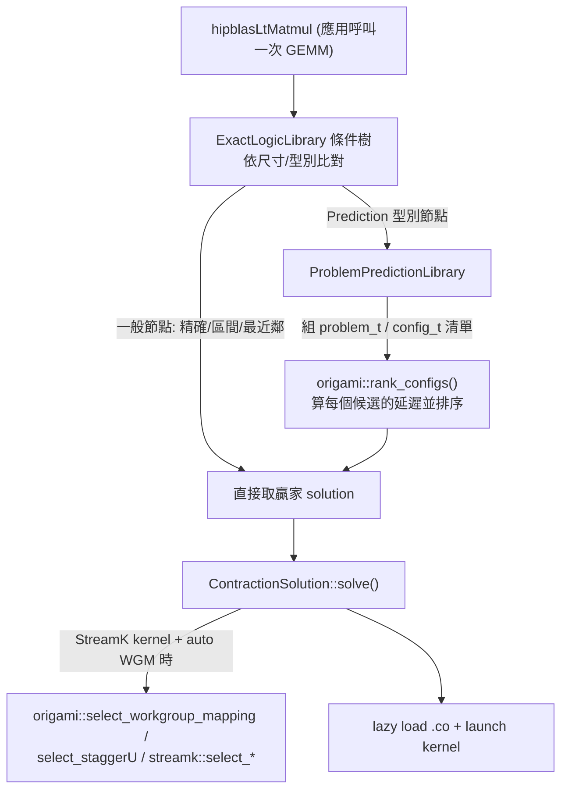

# Origami 白話總覽：GPU GEMM 的「不用跑就先算出誰最快」選擇器

路徑說明：本檔在 repo 內的 `study_docs/origami/`。連到 study_docs 其他文件用相對路徑（如 `../hipblaslt/component-interactions/runtime-and-selection.md`）；連到原始碼與官方文件用 `../../shared/...`、`../../projects/...`（往上兩層回到 repo root 再往下）。行號可能隨 commit 漂移，對不上時以符號名稱為準。

> 這一組文件是**寫給沒有效能建模 / 編譯器背景的讀者**。每個名詞第一次出現都會先用一句白話解釋，再往下講細節。看不懂任何一段，先回到本檔「名詞小抄」對照。

## 一句話總結（先看這句）

> **Origami 是一個「不用真的把 kernel 跑一遍，只靠硬體參數 + 數學模型估算延遲，就幫你從一堆候選 GEMM 設定裡挑出最快那個」的分析式選擇器（analytical solution selector）。**

它最好記的方式，是跟同資料夾的 [StinkyTofu](../stinkytofu/README.md) 對照：

- **StinkyTofu**＝kernel 組語**已經產生後**，把它「排得更快、補上等待指令」的最佳化器。
- **Origami**＝在**還沒決定要用哪支 kernel 前**，先「算出哪個設定會最快」的選擇器。

一個管「怎麼把選中的 kernel 弄快」，一個管「先選出該用哪個 kernel」。

## 30 秒總覽：它在解決什麼問題？

先回憶一個 GEMM library（如 hipBLASLt）的日常：使用者呼叫一次矩陣乘法 `D = A × B`，library 手上其實有**很多支預先做好的 kernel**（不同 tile 大小、不同排程），每支只在某些矩陣形狀上最快。所以每次呼叫都要回答一個問題：**這次的 (M, N, K) 該用哪一支 kernel？**

傳統做法有兩種，各有痛點：

- **查表（最近鄰）**：建置時對一些代表性尺寸實測過，runtime 就找「最接近的那格」用它的贏家。問題是**沒測過的尺寸只能靠鄰居猜**，離得遠時可能選到爛 kernel。
- **真的跑跑看（benchmark）**：每個候選都實際跑一遍取最快。最準，但**太慢**，runtime 根本等不起。

Origami 走第三條路：**用一個數學模型「算」出每個候選會跑多久**。

> 用一個類比：你要從機場開車到旅館，不想每條路線都實際開一次（太慢），也不想只憑「上次走過的類似路」硬猜（不準）。Origami 就像一個**路況估算器**：輸入路線（候選設定）、車速與路寬（硬體參數），直接**算出每條路的預估時間**，挑最短的。它不保證跟實測一模一樣，但快、而且對「沒走過的路」也能給出合理估計。

所以 Origami 的價值是：**兼顧「查表的快」與「benchmark 的準」**——用一個輕量分析模型，在 runtime 就能對任意尺寸快速估出「誰最快」。

> 名詞：
>
> - **GEMM**＝一般化矩陣乘法（General Matrix Multiply），深度學習與科學運算最核心的運算。
> - **kernel**＝在 GPU 上實際跑的那段運算程式。
> - **config / solution（設定 / 解）**＝一支 kernel 的完整參數組合（tile 大小、矩陣指令形狀、occupancy 等）。Origami 的工作就是從一堆 config 裡挑最好的。
> - **latency（延遲）**＝這裡指「kernel 估計要跑幾個 GPU cycle」，數字越小代表越快。

## 「analytical / deterministic」是什麼意思？

官方 README（[../../shared/origami/README.md](../../shared/origami/README.md)）第一句就說它是 *"a fast, analytical, deterministic methodology to select optimal GEMM configuration"*。拆開來講：

- **analytical（分析式）**＝用**公式算**，不是用機器學習去「訓練」出來的，也不是真的跑 kernel 量出來的。給定輸入，套一組物理 / 硬體公式（算力、記憶體頻寬、cache 命中率）就得到延遲估計。
- **deterministic（決定性）**＝同樣的輸入永遠得到同樣的輸出，不含隨機性。這對 library 很重要——同一個 GEMM 每次都選一樣的 kernel，效能才穩定、才好除錯（`rank_configs` 裡甚至特別做了「不管候選清單順序如何都選同一個」的 tie-break，見 [latency-model.md](latency-model.md)）。
- **fast（快）**＝因為只是套公式，一次預測是微秒等級，runtime 選 solution 完全負擔得起。

> 一句話：**Origami = 用一組硬體 / 效能公式，把「這個 config 會跑多久」算出來 → 對所有候選算一遍 → 排序挑最快。**

## 它在整條 GEMM 流程的哪個位置？

Origami 主要在**執行時（runtime）被 hipBLASLt 呼叫**，用來選 solution：

重點分兩塊：

1. **選 solution**：條件樹走到 `Prediction` 型別節點時，把「挑哪支 kernel」交給 `origami::rank_configs()`。
2. **選 launch 參數**：選定 kernel 後，如果是 StreamK kernel 且開了 auto WGM，`ContractionSolution` 還會再呼叫 Origami 的 `select_workgroup_mapping` / `select_staggerU` / `streamk::select_`* 來決定「工作怎麼分配到 GPU 上」。

> 另外還有一條**建置 / tuning 時**的用途：Origami 內嵌了一個更精細的模擬器 **Formocast**，tuning 時用來「預測剪枝」加速調校。這條線與 selection vs tuning 的分工，見 [ecosystem-and-formocast.md](ecosystem-and-formocast.md)。

## 這組文件怎麼讀（導讀順序）

1. 本檔（README）— 先建立「它是什麼、為什麼、在哪裡」的直覺。
2. [latency-model.md](latency-model.md) — **核心**：白話拆解 Origami 怎麼「算」延遲——`rank_configs` 的流程、compute vs memory 取最大值的直覺、cache 階層模型、以及那些 magic number 背後的想法。
3. [api-and-usage.md](api-and-usage.md) — 七個公開函式、關鍵資料結構（`problem_t` / `config_t` / `hardware_t` …）的欄位表、Python / C++ 最小範例、build / 測試、debug logging（把模型內部值 dump 成 CSV）。
4. [hipblaslt-integration.md](hipblaslt-integration.md) — Origami 實際上怎麼被 hipBLASLt / TensileLite 呼叫：`ProblemPredictionLibrary` → `rank_configs` 的路徑、`TENSILE_SOLUTION_SELECTION_METHOD` 開關、StreamK 的 WGM / staggerU / grid 選擇、`UtilsOrigami.hpp` 型別橋接。
5. [ecosystem-and-formocast.md](ecosystem-and-formocast.md) — 拉遠看：selection layer vs tuning layer 的分界、Origami vs Formocast 的對照（含量化 KPI / MI350 實測）、Formocast 模型分解與整合方向、三種角色的實際影響、可延伸閱讀的內部文件清單，以及一個關鍵 FAQ：**Origami 憑什麼 claim >90%？runtime 會不會回測？隨機選會不會更好？**
6. [debugging-and-calibration.md](debugging-and-calibration.md) — 實戰：選型出問題怎麼分層定位（selection / model / pool）、Origami 的 `demystify` Debugging Dashboard、Formocast 的 rocprof counter 驗證，以及新架構 bring-up 校正 `architecture_constants` 的 micro-benchmark SOP。
7. [source-map.md](source-map.md) — **原始碼地圖**：origami core（~8421 行）的檔案 → 函式 → 呼叫圖 → 資料結構對照索引，含 attention / streamk / heuristics 等現有文件較少著墨的子系統、函式快查表、Python bindings 對照、擴充點。想讀懂 / 修改原始碼時看這份。
8. [performance-modeling-concepts.md](performance-modeling-concepts.md) — **GPU 效能建模概念前置教材**：對 GPU 架構不熟、讀 latency-model / formocast model「有看沒有懂」時先看這份。以 kernel 執行階段為主線，逐段講背後的 GPU 概念（cache line、coalescing、bank conflict、FIFO、latency hiding…）+ Origami 粗估 / Formocast 細估，並與 [../gpu_knowledge/](../gpu_knowledge/README.md) 交叉比對。

## 名詞小抄（Origami 用語 → 白話）

| 名詞                                           | 白話解釋                                                                                                                                                                                  |
| -------------------------------------------- | ------------------------------------------------------------------------------------------------------------------------------------------------------------------------------------- |
| **GEMM**                                     | 一般化矩陣乘法 `D = α·op(A)·op(B) + β·op(C)`，是 Origami 的主要建模對象。                                                                                                                              |
| **config / solution**                        | 一支 kernel 的完整設定（tile 大小、矩陣指令、occupancy…）；Origami 從一堆 config 挑最好的。                                                                                                                     |
| **latency（延遲）**                              | 模型估的「kernel 要跑幾個 cycle」，越小越快。                                                                                                                                                         |
| **macro tile（MT）**                           | 一個 workgroup 一次負責算的輸出區塊大小 `(MT_M, MT_N, MT_K)`，是最關鍵的可調參數。                                                                                                                             |
| **matrix instruction（MI）**                   | 一條硬體矩陣乘加指令（MFMA / WMMA）一次算的小塊 `(MI_M, MI_N, MI_K)`，是算力的最小單位。                                                                                                                          |
| **occupancy**                                | 一個 CU（運算單元）上同時常駐幾個 wavefront；越高越能藏延遲，但受暫存器 / LDS 限制。                                                                                                                                  |
| **arithmetic intensity（計算密度）**               | 每搬一份資料能做多少次運算（FLOPs / bytes）；越高越偏 compute-bound、越吃得到算力。                                                                                                                               |
| **compute-bound / memory-bound**             | kernel 的瓶頸是「算力不夠」還是「搬資料不夠快」；Origami 對兩者各算一個延遲再取大的。                                                                                                                                    |
| **L2 / MALL / DRAM**                         | GPU 的記憶體階層：L2 快取 → MALL（Infinity Cache，較大的末級快取）→ DRAM（HBM 主記憶體），越往後越慢越大。                                                                                                              |
| **WGM（workgroup mapping）**                   | 把 workgroup 的編號重新排一下，讓相鄰 workgroup 共用同一塊資料、提高 L2 命中率。                                                                                                                                 |
| **staggerU**                                 | 讓不同 workgroup 從 K 維的不同位置起跑，避免大家同時搶同一塊資料造成 cache 衝突。                                                                                                                                   |
| **StreamK**                                  | 一種把 K 維切開、讓 workgroup 平均分擔工作的排程法，需要額外的 reduction 收尾。                                                                                                                                  |
| **XCD**                                      | 一顆 GPU 上的一塊晶粒（chiplet）；MI300 這類多晶粒 GPU 有多個 XCD，各有自己的 L2。                                                                                                                              |
| **prediction mode: estimation / simulation** | Origami 兩種預測模式：`estimation`＝快速公式估算（預設）；`simulation`＝走內嵌的 Formocast 模擬器，較慢但較準。                                                                                                         |
| **Formocast**                                | 內嵌在 Origami 裡、給 TensileLite 用的更精細模擬式預測器；見 [ecosystem-and-formocast.md](ecosystem-and-formocast.md)。                                                                                   |
| **OOB（Out-of-Box，開箱即用）**                     | 一種**部署情境**：裝好官方 ROCm + 庫、未做客製 tuning 就直接使用；該情境下的效能叫 OOB performance。注意 OOB **不是**最差效能（已含官方預裝查表 + Origami 選型）。釐清見 [ecosystem-and-formocast.md](ecosystem-and-formocast.md)「OOB 是情境」小節。 |
| **OOB shapes**                               | library 裡**沒有 Equality 精確 tune 結果**的矩陣形狀（類似 zero-shot），runtime 走 grid/Origami 路徑選 kernel；正是 Origami 負責提升效能的對象。                                                                        |
| **selection efficiency（選型效率）**               | 選到的 kernel 實測效能 ÷ pool 裡最快 kernel（best-of-pool）的實測效能；量化 OOB performance 好壞的主要指標，Origami KPI 目標 >90%。注意這是 **design-time 的統計 KPI，不是 runtime guarantee**——runtime 純套公式、不做任何回測；憑什麼 claim >90%、以及為何遠勝隨機選，見 [ecosystem-and-formocast.md](ecosystem-and-formocast.md)「Origami 憑什麼 claim >90%？runtime 會回測嗎？」小節。 |

## 交叉連結

- **GPU 效能建模概念前置教材（不熟 GPU 架構先看）→ [performance-modeling-concepts.md](performance-modeling-concepts.md)**
- **原始碼地圖（檔案 → 函式 → 呼叫圖 → 資料結構）→ [source-map.md](source-map.md)**
- 執行時 hipBLASLt 怎麼呼叫 origami（`Prediction` 節點 → `rank_configs`）→ [../hipblaslt/component-interactions/runtime-and-selection.md](../hipblaslt/component-interactions/runtime-and-selection.md)
- 五組件整體交互全景（hipBLASLt / TensileLite / StinkyTofu / origami / GEKO）→ [../hipblaslt/component-interactions/README.md](../hipblaslt/component-interactions/README.md)
- selection 層 vs tuning 層的分界（GEKO / Ductile 是 tuning，origami / Formocast 是 selection）→ [../geko-ductile/README.md](../geko-ductile/README.md)
- **Formocast 完整白話介紹（設計 / 模型 / API / 整合 / 限制與研究盲區 / 除錯校正）→ [formocast/README.md](formocast/README.md)**
- Origami vs Formocast 逐項對照（原始 Confluence 對照表）→ [../internal_docs/origami-vs-formocast.md](../internal_docs/origami-vs-formocast.md)
- Formocast 設計 RFC → [../internal_docs/formocast-design-rfc.md](../internal_docs/formocast-design-rfc.md)
- 姊妹主題：kernel 組語產生後的最佳化器 StinkyTofu → [../stinkytofu/README.md](../stinkytofu/README.md)
- repo 位置與資料夾角色（`shared/origami`）→ [../architecture/shared-and-build.md](../architecture/shared-and-build.md)
- 記憶體階層背景（L2 / MALL / Infinity Cache 命名與大小、cache vs scratchpad、XCD / chiplet 與 CDNA 世代）→ [../gpu_knowledge/memory-hierarchy-and-chiplet.md](../gpu_knowledge/memory-hierarchy-and-chiplet.md)
- 跨文件名詞彙總 → [../glossary.md](../glossary.md)
- Origami 官方 README（英文、含安裝 / API / 支援 GPU）→ [../../shared/origami/README.md](../../shared/origami/README.md)
- 內部生態系整理報告（本組第 5/6 篇的主要補充來源，含量化數字、debug 工作流、內部文件索引）→ [ROCm Origami 與 GEMM Solution Selection 生態系整理報告](https://amd.atlassian.net/wiki/spaces/~7120204c779face96d403c9783064701435635/pages/1784683664)
- 學術出處（tritonBLAS 分析式 GEMM 選型論文）→ [arXiv:2512.04226](https://arxiv.org/abs/2512.04226)

