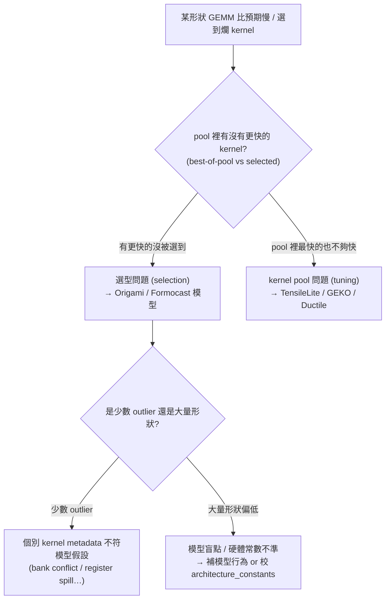
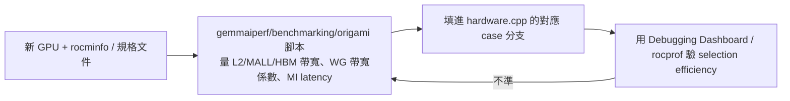

# Origami / Formocast 的除錯與校正實戰

路徑說明：本檔在 `study_docs/origami/`。連原始碼往上兩層：`../../shared/...`。行號會漂移，以符號名稱為準。建議先讀 [README.md](README.md)、[latency-model.md](latency-model.md)、[api-and-usage.md](api-and-usage.md)。

> 本檔改寫並整理自內部 Confluence 整理報告 [ROCm Origami 與 GEMM Solution Selection 生態系整理報告](https://amd.atlassian.net/wiki/spaces/~7120204c779face96d403c9783064701435635/pages/1784683664)（下稱「生態系報告」），以及它引用的《[Origami – Kernel performance prediction](https://amd.atlassian.net/wiki/spaces/MLSE/pages/1441948407)》《[Origami Debugging Guide](https://amd.atlassian.net/wiki/spaces/MLSE/pages/1148624920)》《[Formocast Debugging Guide](https://amd.atlassian.net/wiki/spaces/MLSE/pages/1304330986)》。前幾篇講「模型怎麼算、怎麼被呼叫」；本篇講**當它選錯、或要上新架構時，怎麼查、怎麼校正**。

## 一句話總結

> **選型出問題時，先分三層定位——是「選錯 kernel（selection）」、「模型有盲點（model）」、還是「根本沒有好 kernel / 硬體常數設錯（pool / hardware）」；Origami 用 `demystify` 的 Debugging Dashboard 看 selection efficiency，Formocast 用 rocprof counter 對模型假設；上新架構則照 `get_arch_constants` 的 micro-benchmark SOP 把硬體常數量出來填進去。**

## 一、責任切面：出問題先分三層

Origami 最大的價值之一，是讓「GEMM 為什麼慢」變成一個**可分工、可行動**的問題。遇到「某些形狀明顯跑到爛 kernel」或「預期的加速沒出現」，先照這張圖定位是哪一層的責任（依生態系報告 §5.3）：



一句話記住責任邊界（依生態系報告 §5.1 / §7.1）：

- **API 用錯** → 看 hipBLASLt。
- **kernel pool 不夠好**（pool 裡最快的也不夠快）→ 看 TensileLite / GEKO / Ductile（tuning 層）。
- **有好 kernel 卻沒選到** → 看 Origami / Formocast（selection 層）。
- **ASM 行為可疑** → 看 StinkyTofu / IR pipeline（見 [../stinkytofu/README.md](../stinkytofu/README.md)）。

> 關鍵觀念：**selection efficiency ＝ 選到的 kernel 實測效能 ÷ pool 裡最快 kernel（best-of-pool）的實測效能**。這個比值把「選型問題」和「pool 問題」乾淨切開——比值接近 100% 代表選得好（要更快得回去 tune 出更好的 kernel）；比值低代表 pool 裡有好貨但 Origami 沒挑中。

## 二、Origami 除錯：四類問題 + Debugging Dashboard

《Origami Debugging Guide》把選型問題分成**四類**（依生態系報告 §4.3）：

| 類別 | 症狀 | 通常要動的地方 |
|------|------|--------------|
| 1. 模型選錯 kernel | pool 有更快的卻沒選到 | 模型假設 / 校正權重（`heuristics.cpp`）、arch 常數 |
| 2. grid / workgroup 數選得不好 | StreamK grid、WGM 排布不佳 | `select_grid_size` / `select_workgroup_mapping`（見 [hipblaslt-integration.md](hipblaslt-integration.md)） |
| 3. 可用 kernel 本身不夠好 | best-of-pool 就已經很慢 | **不是 Origami 的責任**——回 tuning 層加 kernel |
| 4. 新架構常數設錯 | 整張卡普遍選不準 | `get_arch_constants`（見第四節） |

### Debugging Dashboard（`demystify`）

《Origami Debugging Guide》提供一個以 `demystify` repo 為基礎的視覺化儀表板，用來掃描參數、分析 selection efficiency、畫圖找 outlier（依生態系報告 §4.3 / §5.3）：

```bash
# 概念示意（實際指令 / repo 位置見 Origami Debugging Guide）
streamlit run dashboard.py
```

看 dashboard 的判讀原則：

- **多數形狀 efficiency 接近 100%、只有少數 outlier** → 多半是**個別 kernel 的 metadata 不符模型假設**（例如那支 kernel 實際有 bank conflict 或 register spill，模型看不到），屬第 1 類的個案。
- **大量形狀 efficiency 偏低** → 模型有系統性盲點（某種 memory pattern、GSU/LSU overhead 沒建模），或 `architecture_constants` 需要重新校正——要動模型或常數，不是個案修補。

### 搭配 Origami 內建 debug log

Dashboard 看「結果分佈」，`ANALYTICAL_GEMM_DEBUG` 看「單次評估的中間值」，兩者互補（見 [api-and-usage.md](api-and-usage.md)「Debug logging」）：

```bash
export ANALYTICAL_GEMM_DEBUG=1
export ORIGAMI_LOG_FILE=/tmp/origami_debug.csv   # 每次 GEMM 評估一列
```

CSV 裡有 `L_mem`、`L_compute`、`H_mem_l2_*`（各層命中率）等欄位。想確認「模型是不是把某形狀誤判成 memory-bound」，就比對 `L_compute` vs `L_mem` 與各層命中率——這正是第 1 / 第 4 類問題的第一手線索。

## 三、Formocast 除錯：用 rocprof counter 對模型假設

Formocast 是**模擬式**模型（把 kernel 執行拆成 initial load / prefetch / 主迴圈 / tail loop / LSU・GSU / store 各段估延遲，見 [ecosystem-and-formocast.md](ecosystem-and-formocast.md)），所以它的 bug 多半是「某個硬體假設或 component 分解與實測對不上」。《Formocast Debugging Guide》的做法是**拿 rocprof 硬體計數器去驗模型假設**（依生態系報告 §4.3 / §5.3）：

| rocprof counter | 驗證的模型假設 |
|-----------------|---------------|
| `TCC_HIT_sum` / `TCC_MISS_sum` | L2 cache 命中率估得對不對。 |
| `TCP_TOTAL_CACHE_ACCESSES_sum` | global read → L1/L2 request 的倍數（multiplicity）對不對。 |
| （local read latency 相關） | local read latency 是否設對。 |

收集方式：用 TensileLite client 搭配 `ENABLE_ROCPROFSDK` 收 counter，再從 Formocast 的 performance breakdown **逐 component** 比對 profiler 輸出——若模擬明顯高估 / 低估，就從偏差最大的那一段（例如 prefetch 或 store latency）回頭修常數或模型。

> 白話對照：**Origami 除錯偏「看排名分佈找 outlier」；Formocast 除錯偏「拿硬體計數器逐段校模擬」。** 前者快、看整體；後者細、對單點。

## 四、新架構 bring-up：校正 `architecture_constants` 的 SOP

要讓 Origami 在一張**新 GPU**（如 gfx115x / gfx12xx / gfx13xx）上 day-one 就不至於盲選，關鍵是把該架構的硬體常數填對。這組常數由 `get_arch_constants(architecture_t)` 回傳（原始碼在 [hardware.cpp](../../shared/origami/src/origami/hardware.cpp)，型別見 [hardware.hpp](../../shared/origami/include/origami/hardware.hpp)），《Origami – Kernel performance prediction》有 step-by-step 教學。

### `architecture_constants` 欄位（依生態系報告 §3.2）

| 欄位 | 白話意義 |
|------|---------|
| `num_xcds` | XCD（晶粒 / die）數量，例 MI300X = 8。 |
| `mem1_perf_ratio` | L2 cache 峰值頻寬（TB/s）。 |
| `mem2_perf_ratio` | MALL / Infinity Cache 峰值頻寬（TB/s，含縮放因子）。 |
| `mem3_perf_ratio` | HBM / DRAM 峰值頻寬（TB/s）。 |
| `parallel_mi_cu` | 每個 CU 能並行執行的 matrix instruction 數。 |
| `mem_bw_per_wg_coefficients` | 每個 workgroup 可用記憶體頻寬的係數 `(0, k, 0)`。 |
| `mem_clock_ratio` | memory clock 相對 compute clock 的比率。 |

**gfx942（MI300X）具體例**：`get_arch_constants(gfx942)` 回傳類似 `{8, 17, 1.21875*6, 4, 4, (0, 0.015, 0), 1.5}`——8 個 XCD、L2 約 17 TB/s、MALL 約 6 TB/s（再乘補償係數）、HBM 約 4 TB/s、每 CU 4 條 parallel MI（依生態系報告 §3.2）。

> 提醒：這些是 `get_arch_constants` 回傳的**原始常數**；`hardware_t` 實例上存的是由它們**換算後**的值（例如 `hardware.cpp` 建構子會把 `mem1_perf_ratio` 依 compute clock 轉成內部單位）。要對照原始常數請看 `get_arch_constants` 的 case 分支，不是 `hardware_t` 欄位。

### 沒有 MALL 的架構：`NO_MALL_AVAILABLE` sentinel

不是每張卡都有 MALL。像 Strix Point iGPU（gfx1150）：`mem2_perf_ratio` 會設成特別的 sentinel `NO_MALL_AVAILABLE`，讓模型算記憶體階層時**直接跳過 MALL 那層**，只算 L2 與 DRAM；同時 `num_xcds = 1`、`parallel_mi_cu` 反映 RDNA iGPU 的 SIMD 配置（依生態系報告 §3.2）。這種「用 sentinel 代表某層不存在」的設計雖然有點 hack，但能維持統一的 API 介面。

### 量測流程（micro-benchmark → 填 `hardware.cpp`）

《Origami – Kernel performance prediction》給了一套 SOP，避免「靠直覺猜常數」（依生態系報告 §3.2）：



搭配《Origami – Kernel performance prediction》的「Worked Example: gfx1150 (Strix Point iGPU)」——它示範怎麼從 `rocminfo` + 硬體規格推出 `num_xcds / mem1_perf_ratio / mem3_perf_ratio / parallel_mi_cu / mem_bw_per_wg_coefficients`，並處理「沒有 MALL」的差異。對要為新 ASIC 填常數的人，那份幾乎是逐步教學。

> 另外，MI latency 存在 [hardware.hpp](../../shared/origami/include/origami/hardware.hpp) 的 `INSTRUCTION_MAP`（依 `(MI_M, MI_N, MI_K, dtype)` 查表），也來自微基準；新架構有新 MI opcode 時要一併補。

## 五、一條龍：一個典型除錯 / 校正流程

把前面串起來，一個實務流程大致是（依生態系報告 §5.3 / §6.2）：

1. **重現 + 量 efficiency**：用 hipBLASLt-bench 或自訂 sweep 跑出問題形狀，用 Origami Debugging Dashboard 看 best-of-pool vs selected 的分佈。
2. **分層定位**：efficiency 低 → selection 問題（往下）；best-of-pool 本身就慢 → pool 問題（回 tuning）。
3. **細看單點**：對 outlier 形狀開 `ANALYTICAL_GEMM_DEBUG=1` 倒 CSV，比對 `L_compute` / `L_mem` / cache 命中率，判斷是誤判 bound、還是 kernel metadata 不符。
4. **（用 Formocast 時）對硬體**：`ENABLE_ROCPROFSDK` 收 `TCC_HIT/MISS`、`TCP_TOTAL_CACHE_ACCESSES`，逐 component 校模擬。
5. **改對地方**：個案 → 修 kernel metadata / 標記；系統性 → 校 `architecture_constants` 或補模型行為；pool 不足 → 回 GEKO / TensileLite 加 kernel。
6. **回歸驗證**：重跑 dashboard + `test_ranking_regression.py`（見 [api-and-usage.md](api-and-usage.md)）確認沒把別的形狀弄壞。

## 交叉連結

- 上游概念：延遲模型怎麼算（compute vs memory、cache 命中率）→ [latency-model.md](latency-model.md)
- API / debug log 開關 / 迴歸測試 → [api-and-usage.md](api-and-usage.md)
- grid / WGM / staggerU 在 hipBLASLt 怎麼被選 → [hipblaslt-integration.md](hipblaslt-integration.md)
- selection vs tuning 分層、Origami vs Formocast、量化數字 → [ecosystem-and-formocast.md](ecosystem-and-formocast.md)
- 本檔主要來源（內部整理報告）→ [ROCm Origami 與 GEMM Solution Selection 生態系整理報告](https://amd.atlassian.net/wiki/spaces/~7120204c779face96d403c9783064701435635/pages/1784683664)
- 硬體常數 SOP → [Origami – Kernel performance prediction](https://amd.atlassian.net/wiki/spaces/MLSE/pages/1441948407)
- Origami 選型除錯 → [Origami Debugging Guide](https://amd.atlassian.net/wiki/spaces/MLSE/pages/1148624920)
- Formocast 模擬除錯 → [Formocast Debugging Guide](https://amd.atlassian.net/wiki/spaces/MLSE/pages/1304330986)

## 一句話總結

> **先用 selection efficiency（selected ÷ best-of-pool）分「選型 vs pool」，再用 dashboard 找 outlier、用 `ANALYTICAL_GEMM_DEBUG` CSV 看單點、用 rocprof counter 校 Formocast；上新架構就照 `get_arch_constants` 的 micro-benchmark SOP 填常數（沒 MALL 用 `NO_MALL_AVAILABLE`）。** 完整方法論見生態系報告與各 Debugging Guide。
