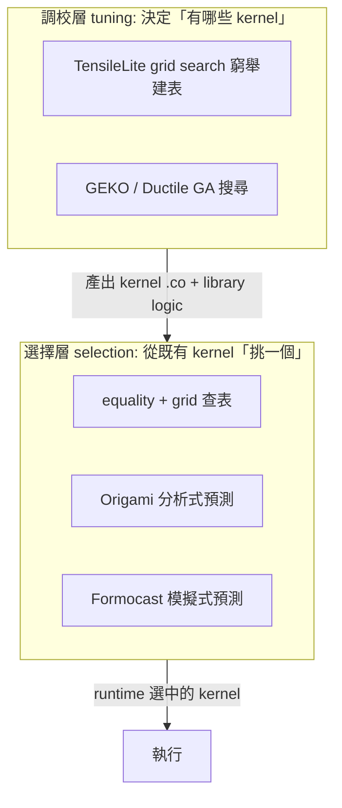
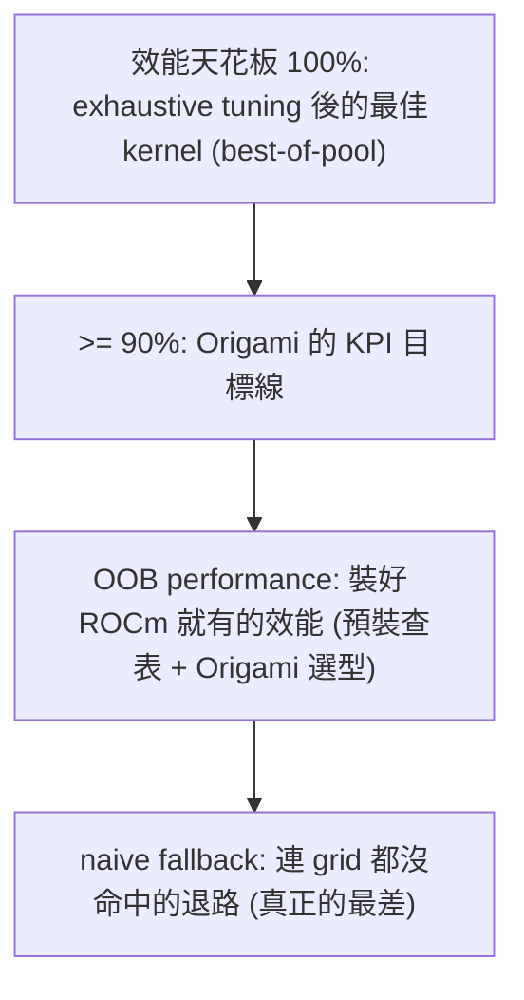

# Origami 的生態定位、與 Formocast 的關係、對開發者的影響

路徑說明：本檔在 `study_docs/origami/`。連原始碼往上兩層：`../../shared/...`、`../../projects/...`。行號會漂移，以符號名稱為準。建議先讀 [README.md](README.md)。

> 前四篇講「Origami 內部怎麼運作、怎麼被呼叫」；本檔拉遠一點：**它在整個 GEMM 工具生態站在哪、跟 Formocast 是什麼關係、對不同角色的開發者有什麼實際影響。** 原始逐項對照見 [../internal_docs/origami-vs-formocast.md](../internal_docs/origami-vs-formocast.md)。

## 一句話總結

> **在 GEMM 的兩大階段裡，Origami 屬於「選擇層（selection）」——從既有 kernel 裡挑最快的；而不是「調校層（tuning）」——決定要生出哪些 kernel。Formocast 是內嵌在 Origami 裡、給 TensileLite 用的更精細模擬式預測器：Origami 當快速前端與基礎設施，Formocast 當更準的後端。**

## 一、先分清楚：selection 層 vs tuning 層

GEMM library 的效能來自兩個彼此獨立的階段，最容易混淆，先講清楚：

- **調校層（tuning，建置時）**：決定「這個 library 裡到底放哪些 kernel」。用 grid search 窮舉、或用 GEKO / Ductile 的基因演算法（GA）搜尋，跑大量 benchmark 找好 kernel。**GEKO / Ductile 在這一層。**
- **選擇層（selection，多在執行時）**：kernel 已經備好，問題變成「這次 GEMM 該用哪一個」。equality / grid 查表是基礎，Origami / Formocast 是疊在上面的**預測式**選擇。**Origami 在這一層。**

> 一句話：**tuning 是「決定菜單上有哪些菜」，selection 是「這桌客人該上哪道菜」。Origami 管後者。** 這條界線在 [../geko-ductile/README.md](../geko-ductile/README.md) 有更完整的討論。

## 二、Origami 與 Formocast 的關係

很多人以為 Origami 和 Formocast 是兩個競爭產品，其實**Formocast 是內嵌在 Origami 原始碼裡的一個子模組**：

- 程式碼位置：[`shared/origami/src/simulator/tensilelite/`](../../shared/origami/src/simulator/tensilelite/)（`formocast.cpp` / `formocast_simulator.cpp`），header 在 [`include/origami/simulator/tensilelite/`](../../shared/origami/include/origami/simulator/tensilelite/)。
- 觸發方式：`config.prediction_mode == simulation` 時，`compute_total_latency` 就改走 `compute_formocast_latency`（見 [latency-model.md](latency-model.md)）；預設 `estimation` 走 Origami 自己的快速公式。

兩者定位的一句話：**Origami 是對外的 selection 前端與基礎設施（hipBLASLt runtime 呼叫的 `rank_configs` 就是它）；Formocast 是併進 Origami 的一個更精細的模擬式預測後端。** 對 hipBLASLt 而言，交互點永遠是 `origami::rank_configs()`，底層用哪套模型是 Origami 內部的事。

### 逐項對照（改寫自 Confluence 對照表）

| 面向 | Origami（estimation） | Formocast（simulation） |
|------|----------------------|------------------------|
| **準確度**（vs 逐尺寸精 tune） | ~90%（KPI；heuristics 可達 ~98% vs best-of-pool） | ~95%（MI350 BF16 TN 相對 Origami +5%，見下） |
| **速度** | 快（微秒級，適合 runtime 即時選） | 慢（模擬，較適合離線 / tuning） |
| **候選 pool** | 小 pool + MT 組合 + auto WGM | 任意 TensileLite 參數集合 |
| **記憶體模型** | perf_ratio + 取最壞界，較粗 | L1/L2/L3 逐層命中率，較細 |
| **library 支援** | 支援 Triton-based + StreamK | 目前 TensileLite-only、non-StreamK（進行中） |
| **吃的參數** | macro tile、matrix instruction、StreamK | 再加 DepthU、GSU method、PrefetchGlobalRead、VectorWidth、DirectToVgpr… 等完整 TensileLite 參數 |
| **主要函式** | `rank_configs` → `compute_total_latency` | `predictedPerformance` |
| **整合方向** | 當通用 GEMM 前端 / API（fast mode） | 併入 origami，當更準的後端（accuracy mode，fast-slow hybrid） |

> 白話取捨：**要快、要泛用（含 Triton / StreamK）→ Origami estimation；要準、參數要全（純 TensileLite tuning）→ Formocast simulation。** 兩者共用同一套資料結構（`hardware_t` / `config_t`），所以能無縫切換。

### 量化 KPI 與實測案例

前面的 ~90% / ~95% 是概略值。內部整理報告補了更具體的數字（依[生態系報告](https://amd.atlassian.net/wiki/spaces/~7120204c779face96d403c9783064701435635/pages/1784683664) §3.1 / §5.2）：

- **Origami 的 KPI**：目標是在關鍵客戶與 OOB 形狀上達到 **> 90% selection efficiency**（選到的 kernel 實測效能 ÷ pool 裡最快 kernel 的實測效能）；報告引用的內部參考指出在多數 workload 上，heuristics 效率可達 **~98% vs best-of-pool**。
- **Formocast 的 uplift**：在 **MI350 BF16 TN 約 13K sizes** 的測試中，改用 Formocast 選型的 library 相對原有 Origami library，**TN 方向幾何平均約 105.7%（約 +5%）**，NN / NT 方向約 **102.2% / 103.7%**。重現步驟見 [Reproducing Benchmarking Results for PR #6058](https://amd.atlassian.net/wiki/spaces/MLSE/pages/1629309136)。

> 白話：**在「大 solution pool + 複雜參數組合」下，更細的模擬器（Formocast）確實能比簡化 analytical model（Origami）多榨出約 5%**；代價是 tuning 成本較高（雖然靠 `PredictionThreshold` 已大幅降低）。所以實務策略常是「**production 以 Origami 為主；特定 ASIC / workload tuning 時再啟用 Formocast**」。

### 釐清：OOB 是「情境」，不是「最差效能」

上面 KPI 那句「> 90% selection efficiency on OOB 形狀」最容易被誤讀。很多人第一眼會把 **OOB（Out-of-Box，開箱即用）** 當成「最差的 baseline」，其實不是。這裡把幾個常混淆的名詞一次講清楚。

- **OOB 是一種「部署情境」，不是一個效能數字**：指使用者裝好官方 ROCm + 庫，**不跑任何客製 tuning** 就直接呼叫。在這個情境下量到的效能，才叫 **OOB performance**。
- **OOB ≠ 最差效能**：官方 library 在發行前**已經預裝了 AMD 做過的 tuning 結果**（Equality / GridBased 查表）與 **Origami 分析式模型**。所以 OOB performance 的好壞，取決於「官方預裝了多少 tuning 結果」加「Origami 選型的準度」——它是一個已經有相當基礎的水準，不是裸機亂選。

**那 OOB performance 怎麼量？** 就是用 **selection efficiency（選型效率）**：

$$\text{selection efficiency} = \frac{\text{OOB 選到的 kernel 實測 GFLOPS}}{\text{對該 shape 做完整 tuning 後最快 kernel 的 GFLOPS}}$$

- 分母（天花板 / baseline）是 **exhaustive tuning 能找到的最佳解**，也就是本檔前面 KPI 定義的 **best-of-pool**（見 [debugging-and-calibration.md](debugging-and-calibration.md) 的「selected ÷ best-of-pool」）。
- 換句話說：**OOB performance 是被評量的對象，不是拿來當底線的那一方**。>90% 代表 OOB 選出來的 kernel 至少跑到「完整 tune 後最佳解」的九成。

**「OOB shapes」又是什麼？** 直覺上很接近「zero-shot 的 shape」——就是**在 library 裡沒有 Equality（精確匹配）tuning 結果的矩陣形狀**。它在 runtime 會走 grid/Origami 路徑選 kernel。對照 runtime 的選型優先序（見 [../hipblaslt/component-interactions/runtime-and-selection.md](../hipblaslt/component-interactions/runtime-and-selection.md) §2.3–2.4）：

1. 先查 **Equality DB**：精確命中就直接用 → 這**不算** OOB shape（已被特別 tune 過）。
2. 查不到走 **GridBased / Origami**：這就是 OOB shape 的處理路徑——Origami 用模型即時估算誰最快。
3. 都不行才 **runtime search fallback**：真的跑幾個候選取最快（較貴）。

所以 **OOB shapes = 那些交給 Origami 分析模型負責的常見 shape**，Origami 的目標就是讓它們「不用額外 tuning 也接近最佳解」。

**用一張概念階梯把上面串起來：**

**回頭看 Origami 的四個目標，就會發現彼此一致**（不再矛盾）：

| 目標 | 白話解讀 |
|------|---------|
| 減少達成 OOB performance 所需的 tuning 成本 | 讓官方發行新 ROCm 前，不必對海量 shape 逐一跑 TensileLite / GEKO tuning，靠 Origami 模型就能讓多數 shape 的 OOB 表現夠好。 |
| fast + deterministic solution selection | OOB 情境下選型要快且可重複，不能每次 runtime 都跑 search（見 [latency-model.md](latency-model.md) 的 tie-break）。 |
| >90% selection efficiency on OOB shapes | 在那些沒被特別 tune 過的常見 shape 上，Origami 選出的 kernel 至少達最佳 tuned kernel 的九成吞吐。 |
| 新架構 day-one 合理效能 | 新 GPU 上線只要更新 `architecture_constants`（L2/MALL/HBM 帶寬、XCD 數等），不必重跑大量 tuning，OOB 就有堪用效能（見 [latency-model.md](latency-model.md) 硬體常數段）。 |

> 一句話總結：**OOB 是「使用情境」，OOB performance 是該情境下的效能水準，而它的好壞是拿「完整 tuning 後的最佳解」當天花板、用 selection efficiency 來衡量的。Origami 的存在，就是為了讓 OOB performance 盡量貼近那個天花板。**

### 常見疑問：Origami 憑什麼 claim「>90%」？runtime 會回測嗎？

看到「KPI >90% selection efficiency」，最容易冒出兩個追問，而它們正好戳中所有 analytical model 的核心，值得講清楚：

1. 難道 user 每次 runtime 跑 GEMM，Origami 都要「回測」一遍才知道有沒有選對？
2. 如果 pool 裡的 kernel 本來就不錯，那用 Origami 選，會不會還比隨機選差？

#### 澄清一：runtime 完全不回測——它只是「套公式算數字」

最關鍵、也最常被誤解的一點：**runtime 時 Origami 一次 benchmark 都不跑。** 它做的事極其單純（就是 [latency-model.md](latency-model.md) 那條公式）：

1. 拿這次的 `(M, N, K)`、型別、硬體常數、候選 config 清單。
2. 對每個 config 把數字**代進解析公式**（`max(compute, memory) × 輪數 + 開頭 + 結尾`），得到預測延遲。
3. 排序，取第一名回傳。

整個過程是**微秒級、純算術、決定性**的，沒有實測、沒有 profiling、沒有回測。

> 為什麼要強調這點？因為「回測 / benchmark」這個動作**只發生在 AMD 的設計 / 驗證階段，不在 user 的 runtime**。Origami 的整個存在意義，就是**為了不要在 runtime 量測**——真要 runtime 量得起，那直接把每個候選都跑一遍取最快就好（這就是最底層的 `runtime search fallback`，但它太慢，只在萬不得已才用）。

#### 澄清二：所以「>90%」是 design-time KPI，不是 runtime guarantee

順著澄清一，答案就很直接：**Origami 無法在 runtime「保證」選到的 kernel 一定是 best-of-pool 的 90%。** per-instance 意義上，它不 guarantee 任何單一 shape。

那這個 claim 憑什麼站得住？靠的**不是**「驗證過所有 shape」，而是一個更根本的槓桿：

> **只要模型的物理假設是對的，它對所有 shape 的「排序」就大致是對的。**

這跟 ML predictor 的 generalization 邏輯**本質不同**：ML 靠「看過夠多 training data」，遇到 distribution shift 就退化；Origami 靠「物理定律在所有 shape 上都成立」，天生具外推力。就像用 \(F = ma\) 或 `時間 = 距離 / 速度`——你不必事先走過每一段路，只要底層物理對，就能算沒走過的路。

用個具體例子（對 `M=8192, N=8192, K=256` 這種大矩陣）：

| 候選 | 參數 | Origami 的物理推理 | 結果 |
|------|------|------------------|------|
| Kernel A | MacroTile 256×256, DepthU=8 | 大 tile、算得多、data reuse 高 → compute-bound、吞吐高 | 選它 |
| Kernel B | MacroTile 32×32, DepthU=64 | tile 太小 → wave 數爆炸、scheduling overhead 大 → 吞吐低 | 淘汰 |

這個排序**不需要事先量過這個 shape**；只要帶寬模型與 compute 模型合理，它對**任何大矩陣**都大致成立。

而**被驗證的對象是「模型」，不是「每個 runtime instance」**：設計階段在有限但具代表性的 shape 上跑 exhaustive profiling，對「公式排出的名次 vs 真實名次」，目的是確認**這條物理曲線的形狀對**，而不是背下每個點的答案。就像確認一條直線只需量幾個點、不必量無限多點；查表法沒有曲線（只有離散點），才需要「量很多點」。這正是 Origami 相對「最近鄰查表」的本質優勢（見 [README.md](README.md) 30 秒總覽、[latency-model.md](latency-model.md) magic number 段「要的是排序對、不是絕對準」）。

所以更精確的講法是：

> **Origami 的 claim ≈「在模型假設成立的 shape regime 裡，selection efficiency > 90%」；而它用大量代表性 shape 的驗證，確認『模型假設成立的 regime』佔了 shape 空間的絕大多數。**

#### 誠實的界線：模型有盲區，所以要靠 fallback 兜底

模型不是萬能的。當某 shape 出現**模型抓不到的微架構效應**（bank conflict、cache thrashing、register spill…），排序就可能錯，該 shape 的 efficiency 就可能 < 90%，而 runtime 當下**不會自動察覺**（它沒量測，以為自己算對了）。這些 outlier 是**事後**在開發端的 dashboard sweep 才被抓出來的（見 [debugging-and-calibration.md](debugging-and-calibration.md) 的四類問題）。

處理方式就是本節前面那條選型優先序與概念階梯（`Equality → GridBased / Origami → Formocast → naive fallback`）兜底：真正在乎的客戶 shape 會被預先 Equality 精 tune 直接命中，**根本不靠模型硬扛**；Origami 只負責「沒被特別 tune 的常見 shape」。被抓到的 outlier 也會進下一輪 tuning / Equality，形成持續改善迴圈。

#### 澄清三：那「pool 本來就好，隨機選行不行？」——不行，差距很大

這個反面思考很自然，但它誤解了「pool 好」的意思：

> **「pool 好」＝ 天花板（best-of-pool）高，不代表 pool 裡每個 kernel 對這個 shape 都好。**

pool 是為了**涵蓋各種不同 shape** 才放進一大堆 config 的；它們是**各自專精不同 regime 的 specialist**，不是「都差不多好」。對**任一特定 shape**，pool 裡通常只有少數幾個好，其餘從平庸到災難級都有：一個為 `M=N=8192`（大 tile + 低 DepthU）設計的 kernel，套到 `M=N=32` 上 → tile 比整個矩陣還大、大量 wave 閒置 → 效能可能只剩最佳的 5~15%。

| 選法 | 期望 efficiency | 尾巴風險 |
|------|----------------|---------|
| 隨機選 | 常只有 ~40~60%（從「少數好 + 一堆爛」均勻抽） | 會踩到災難級 kernel（< 20%） |
| Origami | ~90%+（多數 workload ~98% vs best-of-pool） | outlier 靠 Equality / fallback 接住 |

Origami 相對隨機的壓倒性優勢，在於**避開災難**這件物理上很好判斷的事：「哪些 config 對這 shape 明顯不合理」（tile 塞不滿、切太細、Dot2 用在寬矩陣…）靠 `shortCircuit`（見 [latency-model.md](latency-model.md) 第二層）一眼就踢掉。**pool 越豐富，隨機選反而越糟（爛選項越多），Origami 的價值越大。**

> 類比：pool 裡的 kernel 像各科專科醫生，Origami 的工作是判斷「這個 shape 該掛哪一科」。隨機選＝隨機派一個心臟外科醫生去做眼科手術——他很厲害，但派錯科就是災難。

#### 一句話串起來

| 疑問 | 答案 |
|------|------|
| runtime 有回測嗎？ | **沒有，純算公式（微秒級）** |
| >90% 是 runtime guarantee 嗎？ | **不是，是 design-time 統計 KPI** |
| 那怎麼敢 claim？ | **物理模型的外推力 + 大量代表性驗證**（驗證模型，非每個 instance） |
| 會有 shape < 90% 嗎？ | **會**，模型有微架構盲區 |
| 盲區怎麼辦？ | dashboard 抓 outlier → Equality 硬綁 / 校模型 / 切 Formocast |
| pool 本來就好，隨機選行嗎？ | **不行**，kernel 是各 regime 的 specialist，選錯暴跌 |

> Origami 的核心 trade-off：**用「模型偶爾選錯」的風險，換「不必對每個 shape 做 exhaustive tuning」的巨大成本節省**；再靠「dashboard 找 outlier → Equality 補丁 / 模型校正」的迴圈，把「偶爾選錯」壓到可接受範圍。

### Formocast 的內部模型分解

Origami estimation 用「一輪取 `max(compute, memory)`」的粗骨架（見 [latency-model.md](latency-model.md)）；Formocast 則把一次 kernel 執行**拆成更多段**分別估延遲再組合（依生態系報告 §3.3）：

- initial loading cost（開場載入）
- prefetch 時間
- 主迴圈：LocalRead + MFMA + GlobalRead + LocalWrite + waitcnt 的交錯與重疊
- tail loop（尾迴圈）
- LSU / GSU overhead（split-K 相關）
- store latency（寫回）

正因為拆得細，Formocast 在「GSU / LSU / Stream-K 參數多到簡化模型分不出好壞」時，能給出更準的 ranking——這也是它相對 Origami 的價值所在。

> **fast-slow hybrid mode 願景**：長期方向是讓 Formocast 成為 Origami 的一個後端，使用者用環境變數在「fast mode（Origami）」與「accuracy mode（Formocast）」間切換，甚至自動 fast-slow 混合（依 [Tuning with Formocast](https://amd.atlassian.net/wiki/spaces/MLSE/pages/1308395122) 與 [Difference between Origami and Formocast](https://amd.atlassian.net/wiki/spaces/MLSE/pages/1304199634)）。

### Formocast 的殺手級用途：tuning 剪枝

Formocast 最實際的價值在**縮短 tuning 時間**。tuning 要對成千上萬個候選跑 benchmark，很貴。Formocast 可以**先預測、把明顯會慢的候選剪掉**，只實跑有希望的：

- [`SolutionIterator.cpp`](../../projects/hipblaslt/tensilelite/client/src/SolutionIterator.cpp) 用 `origami::Formocast`（`setProblem/setSolution/setHardware` → `predictedPerformance()`）依 `PredictionThreshold` 剪枝。
- Python 端 tuning config 用 `LibraryType: Prediction` + `PredictionThreshold`（例 [`bf16_tn_predict.yaml`](../../projects/hipblaslt/tensilelite/Tensile/Tests/common/gemm/bf16_tn_predict.yaml) 的 `PredictionThreshold: 0.1`）。
- **threshold 怎麼挑**：[Tuning with Formocast](https://amd.atlassian.net/wiki/spaces/MLSE/pages/1308395122) 建議可從 `0.5` 起試，視覆蓋度 / 品質再往 `0.3` 或 `0.0` 調——值越低過濾越寬鬆（實測越多、越準但越慢），越高剪得越狠（越快但可能漏掉好 kernel）。

> 這正好呼應研究線常提的「用 prediction 減少 profiling / benchmark 成本」——Formocast 就是這個想法在 tuning 上的落地。整合計畫（PR #3735 等）見 [../internal_docs/origami-vs-formocast.md](../internal_docs/origami-vs-formocast.md) 與 [../internal_docs/formocast-design-rfc.md](../internal_docs/formocast-design-rfc.md)。

## 三、Origami 涵蓋的其他能力

除了核心的 GEMM 選型，Origami 這個 library 還包含（見各 `.cpp`）：

- **attention 模型**（`attention.cpp`，`model_t::attention`）：給 Flash Attention 類 workload 選型。
- **StreamK 選擇**（`streamk.cpp`）：grid 大小、reduction 策略、SK3/SK4 hybrid 模式。
- **WGM / staggerU**（`origami.cpp`）：跨 XCD / L2 / MALL 的 cache 局部性最佳化（見 [hipblaslt-integration.md](hipblaslt-integration.md) 接觸點 2）。
- **heuristics**（`heuristics.cpp`）：各架構 / 問題特性的校正權重與否決規則。

**支援的 GPU**（官方 README）：gfx942（MI300，已最佳化）、gfx950（MI350，已最佳化）、gfx1100 / gfx115x iGPU / gfx1201（functional）、gfx1250（functional）。硬體常數來自微基準實測。

## 四、對開發者的實際影響

依[生態系報告](https://amd.atlassian.net/wiki/spaces/~7120204c779face96d403c9783064701435635/pages/1784683664) §6.1，可依角色分三類「要懂多少」：

### 框架 / 模型開發者（如 PyTorch / vLLM 整合）：不用管，但吃得到好處

如果你只是用 PyTorch / vLLM / ONNX Runtime（底層 ROCm + hipBLASLt），或偶爾寫 HIP 但重負載都來自 library kernel——**你幾乎不會直接碰 Origami**（不 import 它的 Python、不 link 它的 C++）。但你會被它影響：

- **選 kernel 的準度**：對「沒被逐尺寸精 tune 過」的形狀，Origami 用模型即時估算，通常比純「最近鄰查表」選得更好——你的 GEMM 更可能落在快的 kernel 上。
- **效能穩定性**：Origami 是 deterministic 的（見 [latency-model.md](latency-model.md) 的 tie-break），同一個 GEMM 每次選一樣的 kernel，效能不會忽好忽壞。
- **新架構 out-of-box 效能**：新卡（gfx950 / gfx1250）只要 Origami 補好硬體常數與 heuristic，library 就能較快給出堪用效能，不必等全面 tune。

> 記住一件事：**當你發現「同模型、同型別、換了張卡或新版本，GEMM 選到的 kernel 變了、變快了」，背後很可能就是 Origami 的模型 / 硬體常數在起作用。** 你要學的其實只有「怎麼開關某個 selection backend（環境變數）、出問題時怎麼採 hipBLASLt log + profiler trace 轉給 GEMM team」。

### 效能 / tuning 工程師：要懂它的模型與資料流

如果你要維護 hipBLASLt / TensileLite、為新 ASIC 調效能、或做「用預測降低 tuning 成本」這類研究，就得深入：

- **模型輸入 / 輸出**：`problem_t` / `config_t` / `hardware_t` 各欄位（見 [api-and-usage.md](api-and-usage.md)），以及 `rank_configs` 的排序 + tie-break 邏輯。
- **estimation vs simulation 的取捨**：什麼時候該用快的 Origami、什麼時候該用準的 Formocast。
- **debug logging**：`ANALYTICAL_GEMM_DEBUG=1` + `ORIGAMI_LOG_FILE=*.csv` 把模型中間值（cache 命中率、L_mem、L_compute…）倒出來分析，是驗證 / 校正模型的主要手段。
- **迴歸網**：`test_ranking_regression.py` 的各架構 golden 排名——改模型前後拿它確認排名沒跑掉。

> 對研究線特別有意義：Origami / Formocast 是「**用分析 / 模擬預測取代實測**」的現成範例。想做「surrogate / prediction 降低 GEMM tuning 的 profiling 成本」，Origami 的模型結構、Formocast 的 `PredictionThreshold` 剪枝、以及那套 efficiency-vs-ideal 的評估思路，都是直接可借鏡的近親。

### kernel / compiler 開發者：要懂模型的假設與限制

如果你寫 kernel 或改 codegen / IR，要理解「模型看得到什麼、看不到什麼」，才能產出**對模型友善**的 metadata：

- 確保 tile / block / grid 描述能準確反映實際 memory access pattern、GSU / LSU 行為與 instruction mix；避免在 ASM 層引入模型完全捕捉不到的特殊行為（否則就會變成 [debugging-and-calibration.md](debugging-and-calibration.md) 裡「個別 kernel metadata 不符模型假設」的 outlier）。
- 為新架構 bring-up 時，要讓 StinkyTofu / TensileLite / Origami 各層的常數與假設一致，別讓 analytical / simulation 模型與實際硬體脫節。

### e2e caveat：別只看 GEMM micro-benchmark

一個重要提醒（依生態系報告 §5.2）：Origami 在單顆 GEMM 上的 uplift，放到端到端 workload 可能被**上層框架的決策掩蓋**。例如某些 MLP 訓練 workload（HRT POC）在 compiled 模式下，small-K GEMM 被 TorchInductor 決定改走 Triton fused addmm，使 Origami 的貢獻對整體 step time 小於 0.1ms。

> 白話：**模型再好、kernel pool 再強，也要跟框架 backend 策略與 pool 品質一起看**——單看 GEMM micro-benchmark 會高估實際端到端效益。

## 五、何時該「打開黑盒」？

對多數人，**把 Origami 當黑盒即可**。只有這幾種情境才需要深入：

- **為新 ASIC bring-up 效能基準**：判斷 GEMM 選錯 kernel 是硬體常數沒填對、還是 heuristic 該調。
- **追查「選錯 kernel」**：某個形狀 Origami 一直選到慢 kernel，要開 debug log 看是命中率估錯還是 shortCircuit 誤殺。
- **tuning 提速研究**：想用 Formocast / 自建 predictor 剪枝、量化「省下多少 benchmark」。

> 這三種情境的實際 debug / 校正手法（Debugging Dashboard、rocprof counter、arch 常數 SOP）整理在 [debugging-and-calibration.md](debugging-and-calibration.md)。

## 六、可延伸閱讀的內部文件

[生態系報告](https://amd.atlassian.net/wiki/spaces/~7120204c779face96d403c9783064701435635/pages/1784683664) §4 把 Origami / Formocast 相關內部文件分類整理，重點如下（建議依此順序建立心智地圖）：

| 類別 | 文件 | 什麼時候看 |
|------|------|-----------|
| 高層願景 | [Origami Analytical Model](https://amd.atlassian.net/wiki/spaces/MLSE/pages/1056220720) | 一句話理解 Origami 是什麼、KPI 目標。 |
| 高層願景 | [Difference between Origami and Formocast](https://amd.atlassian.net/wiki/spaces/MLSE/pages/1304199634) | 建立 tuning vs selection、兩模型分工觀。 |
| 高層願景 | [Formocast Design Document (RFC)](https://amd.atlassian.net/wiki/spaces/MLSE/pages/1304232451) / [Formocast](https://amd.atlassian.net/wiki/spaces/MLSE/pages/1304330876) | simulation backend 的設計與全貌。 |
| 設計 / 實作 | [Origami – Kernel performance prediction](https://amd.atlassian.net/wiki/spaces/MLSE/pages/1441948407) | `get_arch_constants` 欄位、新架構 bring-up SOP、gfx1150 worked example。 |
| tuning workflow | [Tuning with Formocast](https://amd.atlassian.net/wiki/spaces/MLSE/pages/1308395122) | `PredictionThreshold` 怎麼設、如何整合回 hipBLASLt。 |
| 除錯 | [Origami Debugging Guide](https://amd.atlassian.net/wiki/spaces/MLSE/pages/1148624920) / [Formocast Debugging Guide](https://amd.atlassian.net/wiki/spaces/MLSE/pages/1304330986) | 選型 / 模擬出問題時的 dashboard、counter 流程。 |
| 整合 / 案例 | [Origami/Inductor integration plan](https://amd.atlassian.net/wiki/spaces/~jactaylo/pages/1220631594)、[[WIP] Enable Stream-K and Origami on Navi](https://amd.atlassian.net/wiki/spaces/VPGFXAT/pages/1006483607)、[Old Origami Guide](https://amd.atlassian.net/wiki/spaces/MLSE/pages/993110099) | 上游框架整合、實戰 bring-up。 |
| PR 重現 | [Reproducing Benchmarking Results for PR #6058](https://amd.atlassian.net/wiki/spaces/MLSE/pages/1629309136) | Formocast +5% uplift 的重現步驟。 |

## 一句話總結

> **Origami 是 selection 層的分析式選型基礎設施（快、泛用、deterministic，KPI >90% efficiency），Formocast 是它內嵌、給 TensileLite 用的更精細模擬後端（準、參數全、能做 tuning 剪枝，MI350 上約 +5%）；GEKO / Ductile 則在另一層（tuning）。** 對框架開發者 Origami 是黑盒（但吃得到選型紅利）；效能 / 研究開發者要懂它的模型輸入輸出、estimation/simulation 取捨與 debug 工具；kernel / compiler 開發者要產出對模型友善的 metadata。逐項對照見 [../internal_docs/origami-vs-formocast.md](../internal_docs/origami-vs-formocast.md)；除錯 / 校正手法見 [debugging-and-calibration.md](debugging-and-calibration.md)；完整生態整理見 [生態系報告](https://amd.atlassian.net/wiki/spaces/~7120204c779face96d403c9783064701435635/pages/1784683664)。
