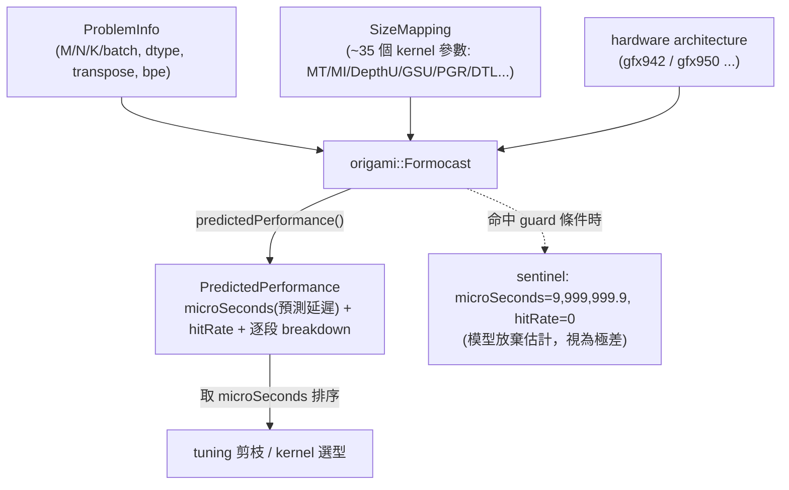

# Formocast 白話總覽：GEMM kernel 的「不上機就模擬跑多久」預測器

路徑說明：本檔在 `study_docs/origami/formocast/`。連到同組其他檔用相對路徑（如 `model.md`）；連到 origami 姊妹文件用 `../ecosystem-and-formocast.md`；連到原始碼用 `../../../shared/...`（往上三層回 repo root 再往下）；連到內部 Confluence 轉錄用 `../../internal_docs/...`。行號可能隨 commit 漂移，對不上時以符號名稱為準。

> 這一組文件是**寫給第一次接觸 Formocast 的人**（intern / 新工程師 / 要在研究實驗中使用它的人）。每個名詞第一次出現先用一句白話解釋，再往下講細節。看不懂任何一段，先回本檔「名詞小抄」對照。

## 一句話總結（先看這句）

> **Formocast 是一個「不用真的把 kernel 編出來、上 GPU 跑，只靠硬體參數 + 逐階段的物理模擬，就估算一支 TensileLite GEMM kernel 大概要跑多少微秒」的模擬式效能預測器（simulation-based performance predictor）。**

它住在 origami library 裡（原始碼在 [shared/origami/src/simulator/tensilelite](../../../shared/origami/src/simulator/tensilelite)），class 名是 `origami::Formocast`。

## 30 秒總覽：它在解決什麼問題、跟 Origami 有什麼不同？

先回憶 GEMM tuning / selection 的日常：一支 GEMM kernel 有幾十個可調參數（tile 大小、DepthU、prefetch、split-K…），組合爆炸。要知道「哪組參數最快」，傳統只能**真的把每組編出來上 GPU 跑**（benchmark），最準但**極慢**。

同資料夾的 [Origami](../README.md) 已經提供一種「不上機、用快速公式估延遲」的解法，但它**只讀粗粒度的幾何參數**（MacroTile、MatrixInstruction、occupancy…），看不到 DepthU、PrefetchGlobalRead 這類 TensileLite 專屬的細節。

Formocast 走更細的一條路：**把 kernel 執行拆成一段一段（初始化、prefetch、主迴圈、tail、store、split-K overhead…），逐段用硬體參數模擬要花多少 cycle，再加總成預測延遲。** 因為它讀得到那些細參數，所以能分辨「同樣 tile、只差 DepthU」的兩個 config 誰比較快——這正是 Origami 快速估算辦不到的。

> **補充（重要）：Formocast 其實不只「兩份 cpp」，而是兩條互相餵資料的模擬路徑。** 上面講的逐段加總是 **Path A 分析式模型**（選 kernel 時跑、快）；另有一條 **Path B 逐指令 cycle 模擬器**（編 kernel 時跑、慢），逐指令量出主迴圈「每輪幾個 cycle」再回填給 Path A。想先看整體版圖與檔案清單，直接讀 [source-map.md](source-map.md)。

> 用一個類比：Origami 像「路況估算器」——輸入路線與車速，快速算出大概時間。Formocast 更像「逐路段的行車模擬」——把整段路拆成起步、上高速、匝道、收費站、停車，各段分別算耗時再加起來。慢一點，但看得到路段層級的差異。

一句話定位兩者關係（詳見 [../ecosystem-and-formocast.md](../ecosystem-and-formocast.md)）：

- **Origami＝estimation（估算）**：快、runtime 選型用，官方對「best-of-pool」的效率 KPI 約 ~90%。
- **Formocast＝simulation（模擬）**：較慢、較細、TensileLite tuning 用，官方效率約 ~95%。
- 長期願景是讓 Formocast 成為 Origami 的一個後端，用環境變數在「fast mode（Origami）／accuracy mode（Formocast）」間切換（來源：內部 Confluence，見 [../../internal_docs/origami-vs-formocast.md](../../internal_docs/origami-vs-formocast.md)）。

## 一張圖看懂 Formocast 的資料流

## 這組文件怎麼讀（導讀順序）

1. 本檔（README）— 先建立「它是什麼、為什麼、跟 Origami 差在哪」的直覺。
2. [model.md](model.md) — **核心**：白話拆解 Formocast 怎麼「模擬」延遲——七段成本、compute vs memory、L1/L2/L3/HBM cache 模型與 hitRate、以及 per-arch 硬編常數。
3. [api-and-usage.md](api-and-usage.md) — `origami::Formocast` 的介面（setProblem/setSolution/setHardware/predictedPerformance）、`ProblemInfo` 與 `SizeMapping` 欄位表、`PredictedPerformance` 輸出、C++ 最小範例、測試怎麼跑。
4. [integration.md](integration.md) — Formocast 怎麼被呼叫：origami 內的 estimation vs simulation dispatch、TensileLite client 的 `PredictionThreshold` queue、以及 tuning workflow（threshold 怎麼設）。
5. [limitations-and-research-use.md](limitations-and-research-use.md) — **設計目的、使用限制，以及給 ductile-origami-warmstart 研究的「避免盲區」清單**（最重要的一份）。
6. [debugging-and-calibration.md](debugging-and-calibration.md) — 怎麼驗證/校正：rocprof counter 對照、逐段 breakdown 檢查、上新架構時填 `HardwareConstants` 常數的 SOP。

**實作深入（implementation deep-dive）**——想讀懂原始碼、改模型、或除錯 misprediction 時看這四份：

7. [source-map.md](source-map.md) — **原始碼全景圖**：完整檔案清單（~12 檔、~5000+ 行）、Path A/Path B 兩條模擬路徑的分工與資料流、`HardwareConstants` 232-byte binary blob 解碼。先看這份回答「難道只有兩份檔案？」。
8. [cycle-accurate-path.md](cycle-accurate-path.md) — **Path B 逐指令模擬器**（`rocisa/cycle.cpp`）：per-thread VGPR/SGPR 指令直譯器、GR/LR/LW FIFO stall 模型、bank conflict 分析、`MathClocksUnrolledLoop` 回填閉環。現有文件唯一沒提到的第二個模擬器。
9. [memory-model-internals.md](memory-model-internals.md) — **記憶體階層實作**：load request cascade、L1/L2/L3 hit-rate 三支（L2 實跑 workgroup 排程模擬）、request→cycle 換算、store request 數學。
10. [cost-phases-internals.md](cost-phases-internals.md) — **七段成本的程式碼公式**：每段對應的實際式子與變數、總加總順序、early-terminate guards 對照表。補足 model.md 的白話版。

## 名詞小抄（Formocast 用語 → 白話）

| 名詞 | 白話解釋 |
| --- | --- |
| **Formocast** | origami library 內、給 TensileLite 用的模擬式 GEMM 效能預測器；class `origami::Formocast`。 |
| **simulation vs estimation** | Formocast 是 simulation（逐段模擬、較細較慢、讀 backend 參數）；Origami 預設是 estimation（快速公式、只讀粗粒度幾何參數）。 |
| **ProblemInfo** | 「要算哪個 GEMM」：M/N/K、batch、dtype、transpose、每元素 byte 數（bpe）。是 Formocast 的問題輸入。 |
| **SizeMapping** | 「用哪一組 kernel 設定去算」：約 35 個 TensileLite 參數（MacroTile、MatrixInstruction、DepthU、GlobalSplitU、PrefetchGlobalRead、DirectToLds…）。是 Formocast 的 kernel 輸入。 |
| **PredictedPerformance** | Formocast 的輸出：`microSeconds`（預測延遲，越小越快）、`hitRate`（L2 命中率）、加上 init/loop/tail/store/gsu/lsu 各段 breakdown。 |
| **microSeconds** | 預測延遲（微秒）。這是排序/選型實際會用的數字。**注意它是「模型算的」，不是實測 GPU 時間。** |
| **hitRate** | 模型估的整體 L2 cache 命中率。 |
| **sentinel（哨兵值）** | 當參數組合命中某些 guard，Formocast 不做完整模擬、直接回 `microSeconds=9,999,999.9`。它是**有限浮點數**（不是 NaN），語意是「模型放棄估計、請視為極差」。細節見 [model.md](model.md) 與 [limitations-and-research-use.md](limitations-and-research-use.md)。 |
| **PredictionThreshold** | TensileLite client 的一個參數（0.0–1.0），決定「Formocast 排序後取前幾成 solution 進 benchmark queue」。>1 等於關閉此過濾。見 [integration.md](integration.md)。 |
| **HardwareConstants** | 每個 GPU 架構一組硬編常數（cache 容量/頻寬、HBM 頻寬、頻率、NumCUs、NumXCDs…）；上新架構要填。見 [debugging-and-calibration.md](debugging-and-calibration.md)。 |
| **GEMM** | 一般化矩陣乘法 `D = op(A)·op(B) + …`，Formocast 的建模對象。 |
| **tile / MacroTile（MT）** | 一個 workgroup 一次負責算的輸出區塊 `(MT0, MT1, DepthU)`。 |
| **MatrixInstruction（MI）** | 一條硬體矩陣乘加指令（MFMA）一次算的小塊，是算力最小單位。 |
| **DepthU** | K 方向一次 unroll 的深度；影響主迴圈與 LDS 用量。 |
| **GSU / LSU** | GlobalSplitU / LocalSplitU：把 K 維切給多個 workgroup / 一個 workgroup 內多 wave 分攤的兩種 split-K 方式，各有 reduction overhead。 |

## 交叉連結

- **原始碼全景與兩條模擬路徑** → [source-map.md](source-map.md)
- 實作深入：[cycle-accurate-path.md](cycle-accurate-path.md)、[memory-model-internals.md](memory-model-internals.md)、[cost-phases-internals.md](cost-phases-internals.md)
- Origami vs Formocast 的生態定位、量化 KPI、tuning 剪枝應用 → [../ecosystem-and-formocast.md](../ecosystem-and-formocast.md)
- Origami 白話總覽（selection 層的快速估算器）→ [../README.md](../README.md)
- Formocast 設計 RFC（內部 Confluence 完整轉錄，primary source）→ [../../internal_docs/formocast-design-rfc.md](../../internal_docs/formocast-design-rfc.md)
- Origami vs Formocast 逐項對照（內部 Confluence 轉錄）→ [../../internal_docs/origami-vs-formocast.md](../../internal_docs/origami-vs-formocast.md)
- Formocast 原始碼 → [formocast_simulator.cpp](../../../shared/origami/src/simulator/tensilelite/formocast_simulator.cpp)、[formocast_simulator.hpp](../../../shared/origami/include/origami/simulator/tensilelite/formocast_simulator.hpp)
- 研究中如何使用 Formocast（factorization / 三層 rejection / 盲區）→ [../../research/ductile-origami-warmstart/qa/qa-06-origami-formocast-ecosystem-design.md](../../research/ductile-origami-warmstart/qa/qa-06-origami-formocast-ecosystem-design.md)

## 一句話總結

> **Formocast＝「逐段模擬 kernel 執行、不上機就估出微秒級延遲」的 TensileLite 效能預測器；比 Origami 快速估算更細（讀得到 DepthU 這類參數）、但也更慢、且只是模型預測不是實測。** 下一篇看 [model.md](model.md)。
