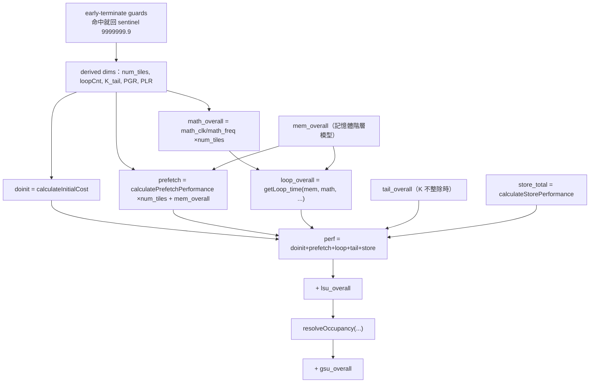

# 七段成本的實作公式：從 model.md 白話到程式碼

> 路徑基準：所有 code 連結為相對於本檔（`study_docs/origami/formocast/`）的相對路徑；行號會隨 commit 漂移，對不上時以符號名稱為準。

## 白話總覽

[model.md](model.md) 用「洗衣流程」把總延遲拆成七段（init / prefetch / loop / tail / store / GSU / LSU），講的是**直覺**。這份報告接著給你**每一段對應到程式碼的實際公式與變數**，讓你能：

- 對照 `PredictedPerformance` 的分項數字，知道每個是哪條式子算的。
- 想改模型時，知道去哪一行改。

全部發生在 [predictedPerformance()](../../../shared/origami/src/simulator/tensilelite/formocast_simulator.cpp#L493-L772) 這一個函式裡，最後加總成 `perf`（單位：微秒 µs）。

> 前置提醒：主迴圈的 compute 成本用的 `math_clk` **不是這裡算的**，是 Path B 逐指令量好回填的 `MathClocksUnrolledLoop`（見 [cycle-accurate-path.md](cycle-accurate-path.md)）；「memory」成本 `mem_overall` 是記憶體階層模型算的（見 [memory-model-internals.md](memory-model-internals.md)）。本報告聚焦「這些數字怎麼組成七段、怎麼加總」。

> 名詞小抄
> - **num_tiles**：把所有 workgroup 塞進所有 CU，要分幾波跑（`ceil(numberWGs / NumCUs)`）。
> - **loopCnt**：主迴圈跑幾輪（K 方向 unroll 的輪數）。
> - **PGR（PrefetchGlobalRead）**：預取幾層 global read。
> - **GSU / LSU**：Global / Local SplitU，沿 K 方向切給多個 workgroup / 同 workgroup 多 wave，最後要合併。
> - **sentinel（哨兵值）**：`9999999.9`，代表「模型放棄估計、當成極差」。是有限浮點數，不是 NaN。

## 架構 / 流程圖



## 先擋掉不合理的組合：early-terminate guards

白話：不是每組參數都值得完整估。先用一組 guard 擋掉明顯不合理或模型不支援的組合，命中就直接回 sentinel。

- 程式碼：[guards 區塊](../../../shared/origami/src/simulator/tensilelite/formocast_simulator.cpp#L568-L646)

| guard 條件 | 意義 | 位置 |
|-----------|------|------|
| `GlobalSplitU == 0` | 未初始化（暫不支援 streamK） | [simulator.cpp:570-577](../../../shared/origami/src/simulator/tensilelite/formocast_simulator.cpp#L570-L577) |
| `M<128 && MT0-M>=16`（或 N） | tile 相對問題過大（underflow 浪費） | [simulator.cpp:578-583](../../../shared/origami/src/simulator/tensilelite/formocast_simulator.cpp#L578-L583) |
| `M>=128 && MT0-M>=32`（或 N） | tile 過大（oversize） | [simulator.cpp:584-589](../../../shared/origami/src/simulator/tensilelite/formocast_simulator.cpp#L584-L589) |
| BF16/Half 的 K/depthU/MI 不相容 | 特定 dtype 下不合理的 K-depthU-MI 組合 | [simulator.cpp:590-599](../../../shared/origami/src/simulator/tensilelite/formocast_simulator.cpp#L590-L599) |
| `DirectToLdsA && M<MT0`（或 B/N） | DTL 與 tile 不相容 | [simulator.cpp:600-611](../../../shared/origami/src/simulator/tensilelite/formocast_simulator.cpp#L600-L611) |
| `PLR == 0`（`loopCnt < LocalSplitU`） | derived prefetch-local-read 為 0 | [simulator.cpp:641-646](../../../shared/origami/src/simulator/tensilelite/formocast_simulator.cpp#L641-L646) |

- 命中任一條就：`pp.microSeconds = 9999999.9; pp.hitRate = 0; return pp;`
- **關鍵坑**：`9999999.9` 是**有限浮點數**（`isfinite` 為 true）。任何只用「是否非有限」判斷有無分數的程式會漏掉它——研究用途請特別注意，見 [limitations-and-research-use.md](limitations-and-research-use.md)。
- guard **非窮舉**：有些不理想組合不會命中 guard，會回一個正常但偏差的值。

## 推導維度：num_tiles / loopCnt / K_tail / PGR / PLR

白話：進七段前，先從問題與參數推出幾個關鍵維度。

- 程式碼：[derived dims 區塊](../../../shared/origami/src/simulator/tensilelite/formocast_simulator.cpp#L613-L646)
- 重點：
  - `numberWGs = M_WGs_total * N_WGs_total * NumBatches * GlobalSplitU`
  - `num_tiles = ceil(numberWGs / NumCUs)`（[simulator.cpp:623](../../../shared/origami/src/simulator/tensilelite/formocast_simulator.cpp#L623)）
  - `loopCnt = ceil(total_loop / GlobalSplitU)`，`total_loop = ceil(K / depthU)`
  - `K_tail = K - floor(K/depthU)*depthU`（K 不能整除 depthU 的零頭）

## 逐段公式

### 1. init（doinit）

白話：kernel 啟動固定開銷，隨 tile 數放大。

- 程式碼：[calculateInitialCost()](../../../shared/origami/src/simulator/tensilelite/formocast_simulator.cpp#L20-L23)
- 公式：`initialCost * num_tiles + 1.7 * (num_tiles - 1)`
- `initialCost` 來自 `HardwareConstants`（per-arch 校準）。

### 2. prefetch（preloop）

白話：主迴圈開始前，先把第一輪 unroll 需要的 global 資料載進來。

- 程式碼：[calculatePrefetchPerformance()](../../../shared/origami/src/simulator/tensilelite/formocast_simulator.cpp#L25-L47)
- 內部：
  - `others = 220 + numAccPerWave * 4`（固定開銷 + 累加器數量）
  - `numGRA = MT0*depthU*bpeA / (waveNum*64) / grvwa`（A 的 global read 筆數；B 同理）
  - 回傳 `(grCycles2 + others + 1024*depthU/64) / math_frequency`
- 主體再處理：`prefetch *= num_tiles;` 然後 `prefetch += mem_overall;`（[simulator.cpp:698-699](../../../shared/origami/src/simulator/tensilelite/formocast_simulator.cpp#L698-L699)）
- `numAccPerWave = MT0*MT1 / waveNum / wavefrontSize`（[simulator.cpp:687](../../../shared/origami/src/simulator/tensilelite/formocast_simulator.cpp#L687)）

### 3. loop（loop_overall）：重疊的數學表達

白話：主迴圈是大 K 問題的主要耗時。一輪裡「算」和「搬」可重疊，所以取 max 或半和，而不是相加。

- 程式碼：[getLoop_time()](../../../shared/origami/src/simulator/tensilelite/formocast_simulator.cpp#L51-L65)
- compute 側：`math_overall = math_clk / math_frequency; math_overall *= num_tiles;`（[simulator.cpp:702](../../../shared/origami/src/simulator/tensilelite/formocast_simulator.cpp#L702)），其中 `math_clk = MathClocksUnrolledLoop`（Path B 回填）。
- memory 側：`mem_overall`（記憶體階層模型）。
- **重疊邏輯**：
  - 若 `pgr > 1 && loopCnt > 0` 且（`large` 或 `mem_overall/math >= 1.5`）：
    - `loop_overall = (math + mem_overall)/2 * (loopCnt-1) + mem_overall`（半重疊）
  - 否則 `pgr > 1` 但比值不夠：`loop_overall = math * (loopCnt-1) + mem_overall`
  - 若 `pgr <= 1`：`loop_overall = max(math, mem_overall) * loopCnt`（純取較慢者）
- `large` 門檻：`M*K*bpeA > 67108864 || N*K*bpeB > 67108864`（即單邊 > 64 MB，[simulator.cpp:703](../../../shared/origami/src/simulator/tensilelite/formocast_simulator.cpp#L703)）。

> 符號：`math`、`mem_overall`、`loop_overall` 單位皆為 µs；`loopCnt` 無單位（輪數）；越大越慢。這段就是 [model.md](model.md) 「取 max 是重疊的數學表達」的實作，且加上「半重疊」修正。

### 4. tail（tail_overall）：K 不整除的零頭

白話：K 不能被 depthU 整除時，剩下那幾輪要另外算。

- 程式碼：[tail 區塊](../../../shared/origami/src/simulator/tensilelite/formocast_simulator.cpp#L706-L713)
- 公式：`tail_overall = (mem_overall * K_tail/depthU + math_overall) + prefetch*2;` 再 `tail_overall *= num_tiles;`
- 只有 `K_tail > 0` 才計。

### 5. store（store_total）

白話：把輸出 D 寫回記憶體的成本。

- 程式碼：[calculateStorePerformance()](../../../shared/origami/src/simulator/tensilelite/formocast_simulator.cpp#L108-L159)（詳細 request 拆解見 [memory-model-internals.md](memory-model-internals.md)）
- 在總式中以 `store_total` 出現；另外 `store`（非邊緣）供 tie-breaker 用。

### 6. GSU（gsu_overall）：split-K 跨 workgroup 合併

白話：GlobalSplitU>1 時，多個 workgroup 各算部分和，最後要合併，這是額外開銷。

- 程式碼：[calculateGlobalSplitUOverhead()](../../../shared/origami/src/simulator/tensilelite/formocast_simulator.cpp#L198-L231)
- 兩種方法（`gsuMethod`）：
  - `== 2`（MultipleBuffer, MB）：[getMultipleBufferOverhead()](../../../shared/origami/src/simulator/tensilelite/formocast.cpp#L91-L153)，走記憶體頻寬 + buffer copy，較貴。
  - `== 3`（MultipleBufferSingleKernel, MBSK）：[getMultipleBufferSingleKernelOverhead()](../../../shared/origami/src/simulator/tensilelite/formocast.cpp#L155-L181)，含 atomic overhead，較省。
- 主體：`gsu_overall *= num_tiles;`（[simulator.cpp:661](../../../shared/origami/src/simulator/tensilelite/formocast_simulator.cpp#L661)）
- `storeGSU = 4 * store_total * GlobalSplitU`（[simulator.cpp:656](../../../shared/origami/src/simulator/tensilelite/formocast_simulator.cpp#L656)）餵給 MBSK。

### 7. LSU（lsu_overall）：split-K 同 workgroup 內 reduction

白話：LocalSplitU>1 時，同一 workgroup 內多個 wave 分攤 K，最後要在 LDS 做 reduction。

- 程式碼：[getLocalSplitKOverhead()](../../../shared/origami/src/simulator/tensilelite/formocast.cpp#L183-L230)
- 三部分：local write + local read + reduction cycle，依 `svw * bpeIn` 用 switch 取不同 `lw_cycle`。
- `lsu == 1` 時直接回 0（沒開 LSU）。
- 主體：`lsu_overall *= num_tiles;`（[simulator.cpp:665](../../../shared/origami/src/simulator/tensilelite/formocast_simulator.cpp#L665)）

### 8. CU occupancy 調整

白話：若一個 CU 上塞多個 tile 依序跑（CUOccupancy≥2），要加排隊懲罰。

- 程式碼：[resolveOccupancy()](../../../shared/origami/src/simulator/tensilelite/formocast_simulator.cpp#L414-L430)
- 三種情況：
  - `num_tiles>1 && CUOccupancy>=2`：整段重排成 `initialCost + (prefetch/tiles + mathCost + storeCost*4*num_tiles) + loopCnt*tiles*0.1`
  - `CUOccupancy>=2`（單 tile）：`perf += (CUOccupancy-1)*4*storeCost - storeCost + loopCnt*0.1`
  - 否則：`perf += loopCnt*0.1`

## 總加總順序（很重要，順序有意義）

- 程式碼：[加總區塊](../../../shared/origami/src/simulator/tensilelite/formocast_simulator.cpp#L715-L727)

```text
perf  = doinit + prefetch + loop_overall + tail_overall + store_total   // 主體五段
perf += lsu_overall                                                     // 先加 LSU
perf  = resolveOccupancy(..., prefetch, loop+tail, store_total, ...)    // 再過 occupancy 調整
perf += gsu_overall                                                     // 最後加 GSU
pp.microSeconds = perf
pp.hitRate      = l2_hit * 100
```

- 注意 LSU 在 occupancy 之前加、GSU 在之後加——順序不同，數值不同，改模型時要留意。
- `pp` 還會回填每一段分項（`init/preloop/loop/tail/store/gsu/lsu/num_tiles`）供除錯與 tie-breaker，見 [pp 回填](../../../shared/origami/src/simulator/tensilelite/formocast_simulator.cpp#L732-L755) 與 [api-and-usage.md](api-and-usage.md)。

## 關鍵資料結構

| 結構 | 角色（白話） | 位置 |
|------|--------------|------|
| `PredictedPerformance` | 輸出：µs + 七段分項 | [PredictedPerformance](../../../shared/origami/include/origami/simulator/tensilelite/formocast_simulator.hpp#L165-L192) |
| `SizeMapping` | 輸入：含 `MathClocksUnrolledLoop`、GSU/LSU/PGR 等 | [SizeMapping](../../../shared/origami/include/origami/simulator/tensilelite/formocast_simulator.hpp#L44-L82) |
| `MemoryAccessCosts` | 提供 `mem_overall` 給 loop/prefetch/tail | [MemoryAccessCosts](../../../shared/origami/include/origami/simulator/tensilelite/formocast_simulator.hpp#L124-L160) |

## 交叉連結

- 全景與兩路徑 → [source-map.md](source-map.md)
- `math_clk`（MathClocksUnrolledLoop）哪來的 → [cycle-accurate-path.md](cycle-accurate-path.md)
- `mem_overall` / store request 怎麼算 → [memory-model-internals.md](memory-model-internals.md)
- 七段直覺與洗衣比喻 → [model.md](model.md)
- 分項輸出欄位 → [api-and-usage.md](api-and-usage.md)

## 一句話總結

> **七段成本全在 `predictedPerformance()` 一個函式裡：先用 guards 擋掉不合理組合（回有限哨兵 9999999.9），再逐段算 init/prefetch/loop/tail/store/GSU/LSU，其中 loop 用 `max` 或半和表達 compute-memory 重疊，最後按「主體 + LSU → occupancy → GSU」的順序加總成 µs。** 想核對這些數字與真實 rocprof 的差距，接著讀 [debugging-and-calibration.md](debugging-and-calibration.md)。
