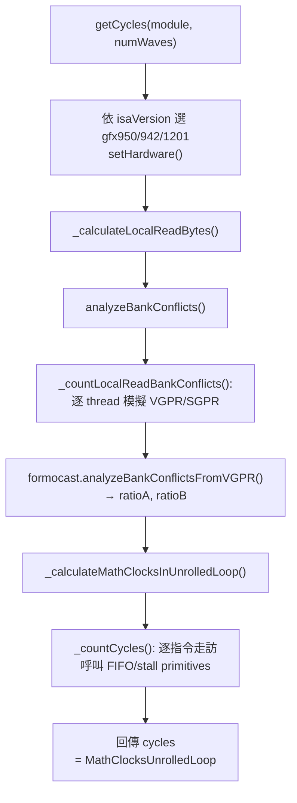

# Path B：逐指令 cycle 模擬器（cycle.cpp）

> 路徑基準：所有 code 連結為相對於本檔（`study_docs/origami/formocast/`）的相對路徑；行號會隨 commit 漂移，對不上時以符號名稱為準。

## 白話總覽

[model.md](model.md)、[integration.md](integration.md) 講的都是 **Path A 分析式模型**——快速套公式估 µs。但它們幾乎沒提到：**Path A 主迴圈那個「每輪幾個 cycle」的數字（`MathClocksUnrolledLoop`）到底哪來的？**

答案是 **Path B**：一個把 kernel 組合語言**一行一行「在紙上跑過一遍」**、逐指令累加 cycle 的模擬器，主體在 [cycle.cpp](../../../projects/hipblaslt/tensilelite/rocisa/rocisa/src/pass/cycle.cpp)（1232 行）。

用比喻：

- Path A 像「看食譜估這道菜大概 10 分鐘」。
- Path B 像「真的站在爐邊，切菜 2 分、爆香 1 分、等鍋熱 30 秒……逐步加起來」，最後把總分鐘數寫回食譜。
- 下次 Path A 看到食譜上寫「主步驟 8 分 20 秒」，就直接用，不用再猜。

Path B 比 Path A 細在三件事，這也是本報告的三個主題：

1. **逐 thread 模擬暫存器**：真的算出每條 local read 指令的位址，才能判斷 bank conflict。
2. **FIFO / stall 模型**：模擬 global read / local read / local write 佇列塞滿時的等待 cycle。
3. **bank conflict → latency**：把衝突比值換算成額外延遲。

> 為什麼要這麼細？因為主迴圈會重複很多輪，一輪估錯幾個 cycle，乘上幾千輪就是大誤差。主迴圈值得「逐指令量」，其餘階段用 Path A 的公式近似就好。

> 名詞小抄
> - **VGPR / SGPR**：GPU 的向量暫存器（每個 thread 各一份）／純量暫存器（整個 wave 共用）。
> - **wave / wavefront**：GPU 一次同步執行的一組 thread（AMD 上常見 64 個）。
> - **LDS（Local Data Share）**：workgroup 內共用的高速 scratchpad 記憶體，分成多個 bank。
> - **bank conflict**：同一拍多個 thread 打到同一個 LDS bank，得排隊，變慢。
> - **local read / write**：對 LDS 的讀／寫；**global read**：對主記憶體（經 cache）的讀。
> - **MFMA**：矩陣乘加指令（Matrix Fused Multiply-Add），GEMM 的算力主力。
> - **FIFO**：先進先出佇列；這裡用來模擬硬體「同時最多幾筆未完成的記憶體請求」。

## 架構 / 流程圖

## 逐步 trace

### 1. 入口 getCycles()：選架構、算 bank conflict、數 cycle

白話：先決定「這是哪顆 GPU」，再算 LDS bank conflict，最後逐指令數主迴圈 cycle。

- 程式碼：[getCycles()](../../../projects/hipblaslt/tensilelite/rocisa/rocisa/src/pass/cycle.cpp#L1202-L1231)
- 它自己 `new` 一個 `origami::Formocast formocast;`，只為了借用 formocast 裡那組 primitives（`getHardwareConstants`、FIFO、bank-conflict 分析），並不呼叫 `predictedPerformance()`。
- 依 `isaVersion` 對應 `{9,5,0}→gfx950`、`{9,4,2}→gfx942`、`{12,0,1}→gfx1201`；不支援就回 `0`。

> 交接：`getCycles()` 的回傳值，最後會被 TensileLite codegen 寫成 kernel 參數 `math_clocks_unrolled_loop`，再由 Path A 讀取（見 [source-map.md](source-map.md) 的資料流）。

### 2. 逐 thread 模擬 VGPR/SGPR：算出 local read 位址

白話：要判斷 bank conflict，得先知道「64 個 thread 各自的 local read 位址是多少」。位址不是常數，是一連串位址計算指令（`v_lshl`、`v_add`、`v_mad`…）算出來的。所以模擬器**真的逐 thread 跑這些整數運算**。

- 程式碼：[_countLocalReadBankConflicts()](../../../projects/hipblaslt/tensilelite/rocisa/rocisa/src/pass/cycle.cpp#L683-L772)
- 關鍵資料：`std::vector<std::unordered_map<std::string,int64_t>> vgprState(64)`——外層 index 是 thread id、內層 map 是「暫存器名 → 目前值」。
- 起手式：找到帶 `vgprSerial` 註解的指令後，把每個 thread 的 serial 初始化成自己的 tid（`vgprState[tid][vgprSerial] = tid;`）。這就是「每個 thread 不一樣」的種子。
- 逐指令：凡是 `v_` 開頭（VALU）就對 64 個 thread 各跑一次 [simulateInstructionTyped()](../../../projects/hipblaslt/tensilelite/rocisa/rocisa/src/pass/cycle.cpp#L429)；`s_mov` 這類 SGPR 指令則更新整個 wave 共用的 `sgprState`。
- 目的暫存器：從註解 `vgprLocalReadAddrA` / `vgprLocalReadAddrB` 抓出「哪個暫存器存的是 A/B 的 local read 位址」，最後拿它去分析 bank conflict。

**simulateInstructionTyped() 支援的指令**：用 `dynamic_pointer_cast` 逐型別比對，涵蓋約 40 種整數 VALU op，例如：

- 加減：`v_add_u32`、`v_sub_u32`、`v_add_co_u32`
- 乘：`v_mul_lo_u32`、`v_mul_hi_u32`、`v_mad_u32_u24`
- 位移／邏輯：`v_lshl_b32/b64`、`v_lshr_b32/b64`、`v_and_b32`、`v_or_b32`、`v_xor_b32`
- 融合位址算：`v_lshl_add_u32`、`v_add_lshl_u32`

> 這其實是一個**小型 AMDGPU 整數指令直譯器**。它不算浮點、不管 MFMA 的數值結果——只在乎「位址算出來是多少」，因為那決定 bank conflict。

### 3. bank conflict 分析：位址 → 衝突比值

白話：拿到 64 個 thread 的 local read 位址後，看它們落在哪些 LDS bank；如果太多 thread 擠同一個 bank，就有衝突。

- 程式碼：[analyzeBankConflictsFromVGPR()](../../../shared/origami/src/simulator/tensilelite/formocast.cpp#L975-L1029)（定義在 formocast.cpp，屬 A+B 共用）
- 參數：`NUM_BANKS = 32`、`BANK_WIDTH = 4` bytes（見 [Formocast::analyzeBankConflictsFromVGPR()](../../../shared/origami/src/simulator/tensilelite/formocast_simulator.cpp#L937-L951) 設定）。
- 算法：對每個 thread 的讀取範圍 `[addr, addr+LocalReadBytes-1]`，標記它跨到的每個 bank；統計每個 bank 被打幾次。
- 輸出比值：`ratio = maxUsage / avgUsage`。無衝突時 `ratio = 1.0`；越大代表越擠。分別得 `ratioA`、`ratioB`（回傳 `BankConflictResult`）。

### 4. 逐指令數 cycle：_countCycles() 與 FIFO primitives

白話：真正累加 cycle 的迴圈在這裡。它一條一條走訪主迴圈的指令，遇到不同指令就呼叫對應的 stall 模型，把「這條要等多久」加進 `cycles`。

- 程式碼：[_countCycles()](../../../projects/hipblaslt/tensilelite/rocisa/rocisa/src/pass/cycle.cpp#L775)（bank conflict 已先算好傳進來）
- 各指令對應的 primitive（primitives 全定義在 formocast.cpp）：

| 遇到的指令 | 呼叫的 primitive | 在做什麼 | 呼叫點 |
|-----------|------------------|----------|--------|
| local read（`ds_load_*`） | `getLocalReadQueueFullStallCycles` | LR 佇列滿了要等幾拍（含 bank conflict） | [cycle.cpp:883](../../../projects/hipblaslt/tensilelite/rocisa/rocisa/src/pass/cycle.cpp#L883) |
| local read 之後 | `pushLocalReadWrite` | 把這筆 LR 推進 FIFO，記其完成 cycle | [cycle.cpp:899](../../../projects/hipblaslt/tensilelite/rocisa/rocisa/src/pass/cycle.cpp#L899) |
| global read（`buffer_load_*`） | `getGlobalReadQueueFullStallCycles` | GR 佇列滿了要等幾拍 | [cycle.cpp:918](../../../projects/hipblaslt/tensilelite/rocisa/rocisa/src/pass/cycle.cpp#L918) |
| local write（`ds_store_*`） | `getLocalWriteQueueFullStallCycles` + `pushLocalReadWrite` | LW 發射間隔 + 推進 FIFO | [cycle.cpp:922-948](../../../projects/hipblaslt/tensilelite/rocisa/rocisa/src/pass/cycle.cpp#L922-L948) |
| `s_waitcnt` | `getLocalReadCompletionCycle` | 等 LR 完成（wait 到某個 count） | [cycle.cpp:958](../../../projects/hipblaslt/tensilelite/rocisa/rocisa/src/pass/cycle.cpp#L958) |

- 讀取位元組數（`bpr`）由指令型別決定：`DSLoadB128→16`、`B64→8`、`B32→4`（見 [cycle.cpp:855-862](../../../projects/hipblaslt/tensilelite/rocisa/rocisa/src/pass/cycle.cpp#L855-L862)）。
- bank conflict 選 A 還是 B：看該 `ds_load` 的來源暫存器是 `vgprLocalReadAddrA` 還是 `B`（見 [cycle.cpp:864-882](../../../projects/hipblaslt/tensilelite/rocisa/rocisa/src/pass/cycle.cpp#L864-L882)）。
- 還有架構特例，例如 gfx950「MFMA 後 4 拍內不能發 DSLoad」（[cycle.cpp:891-894](../../../projects/hipblaslt/tensilelite/rocisa/rocisa/src/pass/cycle.cpp#L891-L894)）。

### 5. FIFO / stall 模型細節

這些 primitive 都在 [formocast.cpp](../../../shared/origami/src/simulator/tensilelite/formocast.cpp)，是「硬體佇列有限深度」的抽象。

- **Global read 佇列**：[getGlobalReadQueueFullStallCycles()](../../../shared/origami/src/simulator/tensilelite/formocast.cpp#L840-L898)
  - FIFO 深度 16；沒滿就直接發射，滿了就依 GR 間隔算 stall。
  - `bpRead <= 4` 時 stall 較小（`grStallCycles = 1`）。
- **Local read 佇列（滿）**：[getLocalReadQueueFullStallCycles()](../../../shared/origami/src/simulator/tensilelite/formocast.cpp#L924-L947)
  - 每 wave 的佇列長度 = `16 / numWaves`；滿了依 `lrStallLatencyBuffer` 算等待。
- **Local read 完成**：[getLocalReadCompletionCycle()](../../../shared/origami/src/simulator/tensilelite/formocast.cpp#L900-L922)
  - `s_waitcnt` 時把已完成的 LR pop 掉，回傳仍需等到的 cycle。
- **推入 FIFO**：[pushLocalReadWrite()](../../../shared/origami/src/simulator/tensilelite/formocast_simulator.cpp#L865-L895)
  - 依 `bpr` 與是否 local read 決定 latency（呼叫下方 latency helper），把「完成 cycle」推進佇列。

### 6. bank conflict → latency 的換算

白話：衝突比值不是直接加 cycle，而是「基礎延遲 + 衝突懲罰」。

- Local read：[getLocalReadLatency()](../../../shared/origami/src/simulator/tensilelite/formocast.cpp#L956-L960)
  - 公式：`baseLatency + (bankConflict - 1) * conflictMultiplier`。
  - `bankConflict = 1`（無衝突）時懲罰為 0。
- Local write：[getLocalWriteLatency()](../../../shared/origami/src/simulator/tensilelite/formocast.cpp#L969-L973)
  - 公式：`baseLatency + bankConflict * conflictMultiplier`。
- `baseLatency` / `conflictMultiplier` 依讀寬 128/64/32-bit 取不同常數，全來自 `HardwareConstants`（如 `LocalReadBaseLatencyB128`、`LocalReadConflictMultiplierB128`），見 [Formocast::getLocalReadQueueFullStallCycles()](../../../shared/origami/src/simulator/tensilelite/formocast_simulator.cpp#L833-L847) 如何挑選。

> 符號說明：`bankConflict` 無單位（比值，1.0 = 無衝突）；`baseLatency`、`conflictMultiplier` 單位是 cycle；輸出是 cycle；越大越慢。常數來源是 per-arch 校準（見 [source-map.md](source-map.md) 的 blob 解碼）。

## 回填閉環：cycles 怎麼變成 Path A 的輸入

把整條 Path B 串起來：

1. [getCycles()](../../../projects/hipblaslt/tensilelite/rocisa/rocisa/src/pass/cycle.cpp#L1202-L1231) 回傳一輪主迴圈的 `cycles`。
2. TensileLite codegen 把它存成 solution 參數 `math_clocks_unrolled_loop`。
3. 選 kernel 時，[getSizeMapping()](../../../projects/hipblaslt/tensilelite/client/src/SolutionIterator.cpp#L261) 把它填進 `SizeMapping.MathClocksUnrolledLoop`。
4. Path A 的 [predictedPerformance()](../../../shared/origami/src/simulator/tensilelite/formocast_simulator.cpp#L566) 直接 `double math_clk = sizeMapping.MathClocksUnrolledLoop;` 拿去算主迴圈 compute 成本。

這就是為什麼 Path A 主迴圈估得準卻寫得短——**難的部分 Path B 已經逐指令做完了。**

## 關鍵資料結構

| 結構 | 角色（白話） | 位置 |
|------|--------------|------|
| `vgprState` | `[thread][暫存器名]→值`，逐 thread 模擬結果 | [_countLocalReadBankConflicts()](../../../projects/hipblaslt/tensilelite/rocisa/rocisa/src/pass/cycle.cpp#L693-L694) |
| `BankConflictResult` | A/B 的衝突比值 ratioA/ratioB | [BankConflictResult](../../../shared/origami/include/origami/simulator/tensilelite/formocast_simulator.hpp#L103-L106) |
| `HardwareConstants` | 提供 base latency / conflict multiplier | [HardwareConstants](../../../shared/origami/include/origami/simulator/tensilelite/formocast_simulator.hpp#L200-L237) |

## 另一個 driver：stinkytofu

同一組 primitives 也被另一個 pass 使用：[EstimateAsmCyclesPass.cpp](../../../shared/stinkytofu/src/transforms/asm/EstimateAsmCyclesPass.cpp)（996 行）。它是 stinkytofu 編譯框架內的 cycle 估計 pass，概念與 cycle.cpp 相同（逐指令走訪 + FIFO/stall），可視為 Path B 的替代 driver。細節不在本報告範圍。

## 交叉連結

- 全景與兩路徑分工 → [source-map.md](source-map.md)
- Path A 主迴圈怎麼用這個 cycle 數 → [cost-phases-internals.md](cost-phases-internals.md)
- 記憶體 request/hit 模型（另一種「搬資料」成本，屬 Path A）→ [memory-model-internals.md](memory-model-internals.md)
- 概念總覽 → [model.md](model.md)

## 一句話總結

> **Path B（cycle.cpp）是一個逐指令、逐 thread 的 AMDGPU 整數指令直譯器 + FIFO/stall 模型：它算出每個 local read 的位址判斷 bank conflict，再逐指令累加主迴圈 cycle，最後把結果當作 `MathClocksUnrolledLoop` 回填給 Path A。** 想看 Path A 如何把「搬資料」拆成 cache 層與 request，接著讀 [memory-model-internals.md](memory-model-internals.md)。
