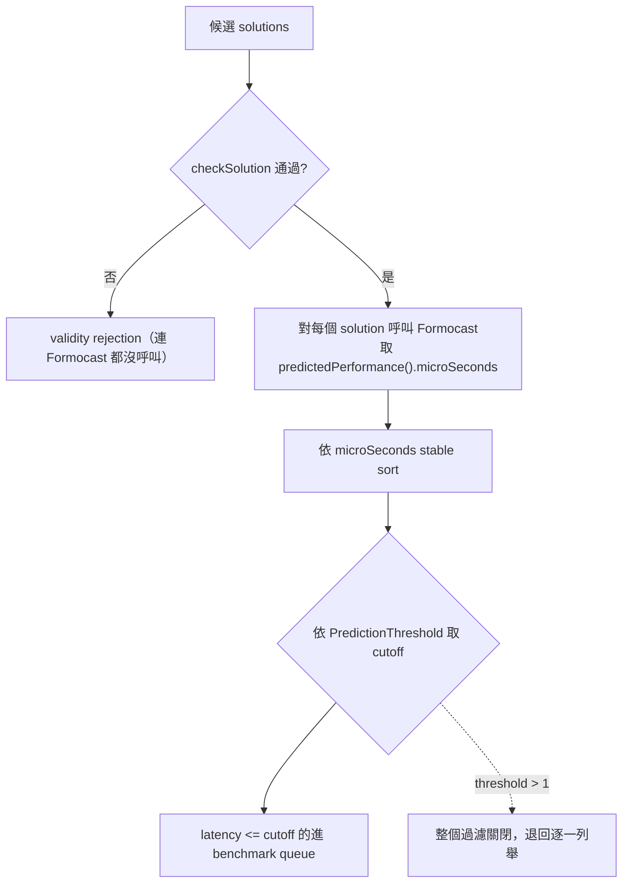

# Formocast 怎麼被整合與呼叫

路徑說明：本檔在 `study_docs/origami/formocast/`。原始碼連結用 `../../../shared/...`、`../../../projects/...`。行號會漂移，以符號名稱為準。

> **一句話：**Formocast 有兩個接觸點——(1) origami 內部依 `prediction_mode` 決定走 estimation 還是 Formocast simulation；(2) TensileLite client 用 Formocast 的預測延遲排序、依 `PredictionThreshold` 篩出要 benchmark 的 solution。

建議先讀 [model.md](model.md)、[api-and-usage.md](api-and-usage.md)。

## 接觸點一：origami 內的 estimation vs simulation dispatch

origami 對外的 latency 計算入口是 `compute_total_latency()`（在 [gemm.cpp](../../../shared/origami/src/origami/gemm.cpp)）。它依 config 的 `prediction_mode` 分岔：

```text
compute_total_latency(problem, hardware, config):
    if config.prediction_mode == simulation:
        return compute_formocast_latency(...)   # ← 走 Formocast
    else:
        return <estimation analytical model>    # ← 預設，快速公式
```

- `prediction_mode` 預設是 `estimation`（origami 快速估算）。要走 Formocast 必須把它設成 `simulation`。
- `compute_formocast_latency()`（同檔）做的事：把 `problem_t` 轉成 Formocast 的 `ProblemInfo`、把 `config_t`（含 `config.tensile()` 的 backend 參數）轉成 `SizeMapping`、設 hardware、呼叫 `predictedPerformance()`，然後**只取 `microSeconds` 回傳**。
- 對照：estimation 路徑**不讀** `config.tensile()`（`tensile_params_t`），所以看不到 DepthU/PGR 等細節；Formocast 路徑讀得到。這個「誰讀 backend metadata」的差異，是兩者辨識力不同的根源（見 [../ecosystem-and-formocast.md](../ecosystem-and-formocast.md)）。

**dataflow（actor → action → output → 下一個 consumer）**：

- origami `compute_total_latency` → 判斷 `prediction_mode` → 呼叫 `compute_formocast_latency` → 得 `microSeconds` → 交給 `rank_configs` 排序 → 選型。

## 接觸點二：TensileLite client 的 PredictionThreshold queue

runtime / tuning 端在 [SolutionIterator.cpp](../../../projects/hipblaslt/tensilelite/client/src/SolutionIterator.cpp) 的 `AllSolutionsIterator::preProblem` 直接用 Formocast 做「benchmark 前的預篩」：



流程要點：

1. 先 `checkSolution`（硬體/problem/task predicate）；不過的 solution 根本不進 Formocast。
2. 對通過的每個 solution 呼叫 Formocast、取 `microSeconds`。
3. 依 `microSeconds` 做 **stable sort**（穩定排序）。
4. 依 `PredictionThreshold` 算一個 percentile cutoff，latency 在 cutoff 以內的進 benchmark queue。

`PredictionThreshold` 的語意（0.0–1.0）：

| 值 | 效果 |
| --- | --- |
| `> 1.0` | **關閉**預測過濾，退回從 start-idx 逐一列舉（等於不用 Formocast 篩） |
| `1.0` | 全部通過的 solution 都入 queue |
| `0 < x < 1` | 只留 Formocast 排序前 `x·100%` 的 solution，依預測順序測 |
| `0.0` | 只取預測最快的那一個（top-1），最快但可能漏掉好 kernel |

一個容易誤會的點：**sentinel（`microSeconds=9,999,999.9`）會排到隊尾，但「排尾」不等於「被排除」**——若 `threshold=1.0`，連 sentinel 也會進 queue。是否被排除取決於 threshold，不是取決於 Formocast 是否回 sentinel。

## Tuning workflow：實務怎麼用 Formocast 調校

（來源：內部 Confluence「Tuning with Formocast」，見 [../ecosystem-and-formocast.md](../ecosystem-and-formocast.md) 的連結）

大致步驟：

1. **確認硬體被支援**（arch 常數已填，見 [debugging-and-calibration.md](debugging-and-calibration.md)）。
2. **準備 tuning YAML**，加一個 global 參數 `PredictionThreshold`（範圍 0.0–1.0）。
3. **挑 `PredictionThreshold`**（官方建議的實務值）：
   - 選一個 problem size，**先用 `0.5`** 起試。
   - 若 `0.5` 已能選到最佳解，**再往下調**。
   - **一般 `0.3` 適合多數硬體**。
   - **`0.0` 最快**（直接取預測最快的），但**效能會有取捨**。
   - 直覺：threshold 越高＝搜得越廣、品質可能越好但越慢；越低（→0.0）＝越快但可能漏掉好 kernel。
4. **擴充 solution pool / 參數覆蓋**：不同 problem 瓶頸不同，某些 TensileLite 參數可能還沒支援，需要時要請求加入。
5. **驗證 tuning 結果**：由 tuning YAML 產出 logic YAML → build hipBLASLt → 跑 hipblaslt-bench，確認被選中的 kernel 真的跑得出來、且快。

## 整合狀態（重要提醒）

（來源：內部 Confluence「Difference between Origami and Formocast」/「Formocast Design Document RFC」）

- Formocast 原始碼目前放在 **origami 的子資料夾**內；長期計畫是讓它成為 origami 的一個 backend，用**環境變數**在「fast mode（Origami）／accuracy mode（Formocast）」間切換，甚至自動 fast-slow 混合。
- 這個 env-var 模式切換與 fast-slow hybrid **尚未完全交付**（標為 in-progress）；在完全整合前，實務上常用「產一份 equality logic YAML 把某解指定給某 problem size，再 benchmark」的手動作法。
- 目前 Formocast **只支援 TensileLite**（不支援 Triton-based library）、且**主要是 non-StreamK**；StreamK / CMS / DTL 支援仍在進行中。

## 交叉連結

- 模型細節（七段、cache、sentinel）→ [model.md](model.md)
- 介面與資料結構 → [api-and-usage.md](api-and-usage.md)
- 三種 rejection 的區分（validity / sentinel / runtime queue）與研究盲區 → [limitations-and-research-use.md](limitations-and-research-use.md)
- origami 一般整合（`ProblemPredictionLibrary` → `rank_configs`）→ [../hipblaslt-integration.md](../hipblaslt-integration.md)
- 生態定位、fast-slow 願景、KPI → [../ecosystem-and-formocast.md](../ecosystem-and-formocast.md)

## 一句話總結

> **兩個接觸點：origami 內用 `prediction_mode=simulation` 切到 Formocast（只回 microSeconds）；TensileLite client 用 Formocast 排序 + `PredictionThreshold` 篩 benchmark queue（0.3 常用、0.0 最快但有取捨、>1 關閉）。** 下一篇看 [limitations-and-research-use.md](limitations-and-research-use.md)。
