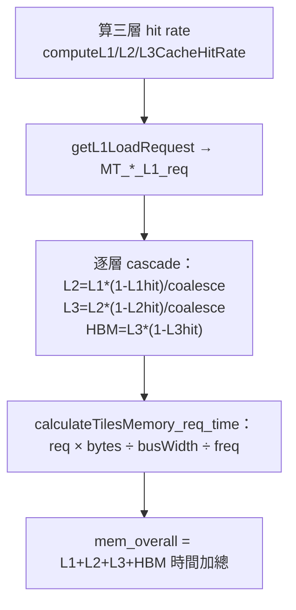

# 記憶體階層模型實作：request → hit → cycle

> 路徑基準：所有 code 連結為相對於本檔（`study_docs/origami/formocast/`）的相對路徑；行號會隨 commit 漂移，對不上時以符號名稱為準。

## 白話總覽

[model.md](model.md) 說主迴圈耗時取 `max(compute, memory)`，其中「memory」要「逐層算命中率與頻寬」。這份報告就是把那個「memory」拆開給你看：**Formocast 怎麼把「搬資料」變成一個 cycle 數字。**

用「搬貨」比喻整個 GEMM 的資料搬運：

- 一個 workgroup 要算它負責的 output tile，得反覆去搬 A、B 兩塊矩陣資料。
- 貨可能在很近的倉庫（L1）、稍遠（L2）、更遠（L3），或最遠的主倉（HBM）。越遠越慢。
- Formocast 分三步估：
  1. **要搬幾趟（request）**：這塊 tile 對 L1 發出幾個讀取請求。
  2. **近倉命中幾成（hit rate）**：命中就不用往下一層跑；沒中的才往下層丟。
  3. **換算成時間（cycle）**：`剩餘 request × 每筆 bytes ÷ 該層頻寬 ÷ 頻率`。

三步是**串接**的：L1 沒命中的 request 才會變成 L2 的 request，依此類推到 HBM。這就是本報告的主線。

> 名詞小抄
> - **tile / MacroTile (MT0, MT1)**：一個 workgroup 負責的 output 區塊大小，M 方向 MT0、N 方向 MT1。
> - **DepthU (depthU)**：K 方向一次 unroll 處理的深度。
> - **request**：對某層 cache 的一筆存取請求（本模型的核心計量單位）。
> - **hit rate**：命中率，0~1；命中就不必往下一層。
> - **bpe（bytes per element）**：每個矩陣元素幾 bytes（如 BF16 = 2）。
> - **bus width / bandwidth**：每 cycle 能搬多少 bytes。
> - **coalesce**：多筆小存取合併成一筆，省頻寬。
> - **A is T / N**：A 是否轉置（transpose）；影響存取 pattern 與 hit rate 分支。

## 架構 / 流程圖

主入口是 [calculateMTMemoryAccessCosts()](../../../shared/origami/src/simulator/tensilelite/formocast_simulator.cpp#L317-L412)，它把上面四步串起來，回傳一個 `MemoryAccessCosts`。

## 逐步 trace

### 1. L1 load request：一塊 tile 要對 L1 讀幾趟

白話：先算「不管命不命中，這塊 tile 對 L1 一共發出幾個讀請求」。這一步只看資料形狀與存取 pattern，還沒牽涉命中率。

- 程式碼：[getL1LoadRequest()](../../../shared/origami/src/simulator/tensilelite/formocast.cpp#L40-L88)
- 分支很多，主要看矩陣是否轉置（`isTransposed`）、是否 swizzle、是否 DirectToVGPR：
  - 轉置 + swizzle：`MTX * DU * bpe / 64` 再乘 `ceil(VW/2)`。
  - 轉置 + 非 swizzle：同基底，另算 `tcc_ea0_coalesced = L1CacheLineSize / (DU*bpe)`（合併因子）。
  - 非轉置：`ceil(MTX/NLC * bpe / L1BusWidthPerCU) * NLC * DU`。
- 小 vector（`grvw*bpe == 8` 或 `<= 2`）會讓 request 翻倍；DirectToVGPR 依 wave 數放大。
- 輸出參數 `tcc_ea0_coalesced`：下一層 cascade 會用到的合併因子。

在主體裡，A、B 各呼叫一次（注意 B 傳的是 `!transB`，因為 A/B 的「有利軸」相反）：

- 程式碼：[calculateMTMemoryAccessCosts() 中的 MT_A_L1_req / MT_B_L1_req](../../../shared/origami/src/simulator/tensilelite/formocast_simulator.cpp#L368-L386)

### 2. cascade：沒命中的才往下一層丟（這三個函式在 header）

白話：L1 沒命中的比例，乘上 request，就是要丟給 L2 的量；L2 沒命中的再丟 L3；L3 沒命中的丟 HBM。

- 程式碼（**inline 定義在 .hpp，不在 .cpp**，這常讓人「找不到」）：
  - [getL2LoadRequest()](../../../shared/origami/include/origami/simulator/tensilelite/formocast.hpp#L55-L57)：`L1_req * (1 - L1_hit) / (coalesce >= 1 ? 1 : 2)`
  - [getL3LoadRequest()](../../../shared/origami/include/origami/simulator/tensilelite/formocast.hpp#L59-L61)：`L2_req * (1 - L2_hit) / ceil(coalesce)`
  - [getHBMLoadRequest()](../../../shared/origami/include/origami/simulator/tensilelite/formocast.hpp#L63-L64)：`L3_req * (1 - L3_hit)`
- 主體套用：[MT_A/B 的 L2/L3/hbm req](../../../shared/origami/src/simulator/tensilelite/formocast_simulator.cpp#L389-L394)
- 直覺：`(1 - hit)` 就是「漏下去的比例」；命中率越高，往下層的 request 越少，越省時間。

### 3. 三層 hit rate 各自怎麼估

三個函式風格差很多：L1/L3 是**閉式公式**，L2 是**跑一個小型 workgroup 排程模擬**。

#### L1：閉式，A/B × 轉置與否分支，含 gfx942 特例

白話：看 tile 一條線的資料量與 cache line 的關係，推命中率；並處理 cache 是否被塞爆、小 vector、DirectToVGPR、bypass 等修正。

- 程式碼：[computeL1CacheHitRate()](../../../shared/origami/src/simulator/tensilelite/formocast.cpp#L233-L369)
- A 有 T/N 兩分支、B 也有 T/N 兩分支，共四塊對稱邏輯。
- **gfx942 特例**：`isL1FourBank` 為真時，若 `lda`/`ldb` 是 512/256 的倍數，L1 有效容量要 `/4` 或 `/2`（見 [L1 的 four-bank 判斷](../../../shared/origami/src/simulator/tensilelite/formocast.cpp#L277-L283)）。這就是 [model.md](model.md) 說「gfx942 的 L1 有特殊路徑」的實作。
- bypass（`NTA >= 2` / `NTB >= 2`）時 hit rate 直接歸 0（不經 L1）。

#### L2：真的跑一個 workgroup-mapping 模擬迴圈

白話：L2 是所有 workgroup 共用的，命不命中取決於「不同 workgroup 有沒有重複用到同一塊 A/B」。這牽涉 workgroup 怎麼被排到各個 XCD（chiplet）、WGM（workgroup mapping）怎麼重排——所以這裡**不是套公式，而是模擬排程**。

- 程式碼：[computeL2CacheHitRate()](../../../shared/origami/src/simulator/tensilelite/formocast.cpp#L410-L678)
- 它 for 迴圈跑過前 `min(totalWGNum, 10 * NumCUs)` 個 workgroup（[迴圈起點](../../../shared/origami/src/simulator/tensilelite/formocast.cpp#L469)），逐一：
  - 做 XCC/XCCG remap，把 workgroup 分到各 XCD。
  - 依 `wgm` 正負做 WorkGroupMapping 重排（`wgm>1` / `wgm<0` 兩套 sgpr 級位址運算）。
  - 依是否 GSUWGMRR 決定 gsu 維度怎麼拆。
  - 每個 XCD 維護一個「已快取的 workgroup 集合」，命中就記 hit、否則記 miss，並在每 `wgPerXCDIter` 個清一次快取。
- 最後 A/B 各自 `hit / (hit + miss)`，總命中率再依 M/N 加權（`totalHitRate`）。
- 這是三層裡**最重**的一段，可視為一個 Path A 內部的小型 trace 模擬。

> 為什麼只跑前 `10 * NumCUs` 個？這是刻意的取樣上限——用前幾波 workgroup 的行為代表整體，避免對超大問題跑滿。屬近似，換取速度。

#### L3：working set 放不放得下

白話：如果整個 A、B 加起來塞得進 L3，命中率就高；塞不下就退化成看 workgroup 分佈。

- 程式碼：[computeL3CacheHitRate()](../../../shared/origami/src/simulator/tensilelite/formocast.cpp#L371-L408)
- 判斷 `(M*K*bpeA) + (N*K*bpeB) < L3CacheCapacity`：
  - 放得下 → `A_L3_hit = 1 - 1/N_WGs_total`（幾乎全命中）。
  - 放不下 → 依 per-tile workgroup 數 / NumCUs 估。
- 一樣有 bypass（`NTA > 3 || NTA == 1`）。

### 4. request → cycle：加總成 mem_overall

白話：把每層「剩餘 request」換成時間，再把四層加起來。核心公式對每層都是同一形狀。

- 程式碼：[calculateTilesMemory_req_time()](../../../shared/origami/src/simulator/tensilelite/formocast_simulator.cpp#L242-L315)
- 每層時間 ≈ `request × (每筆 bytes) ÷ 該層每-CU 頻寬 ÷ 頻率`。例如：
  - `A_L1_clk += A_L1_req * 64 / L1BandWidthPerCU`
  - `A_L2_clk += A_L2_req * 128 / L2BandWidthPerCU`
  - L2 每-CU 頻寬 = `L2ReadArbEff * 128 * 16 / WGs_per_tile_XCD`，再與 `L2BusWidthPerCU` 取 min（見 [calcLClk lambda](../../../shared/origami/src/simulator/tensilelite/formocast_simulator.cpp#L262-L266)）。
- `scale_edge_A/B`：邊緣 tile（tile 比實際資料大）時按比例縮放 request（[scale_edge](../../../shared/origami/src/simulator/tensilelite/formocast_simulator.cpp#L259-L260)）。
- 分兩次呼叫 lambda：`num_tiles-1` 個「滿載 tile」用全部 CU，最後 1 個 tile 用實際 workgroup 數（[兩次 calcLClk](../../../shared/origami/src/simulator/tensilelite/formocast_simulator.cpp#L299-L301)）。
- 加總：`mem_overall = L1_overall + L2_overall + L3_overall + hbm_overall`，寫回 `MemoryAccessCosts.mem_overall`（[加總](../../../shared/origami/src/simulator/tensilelite/formocast_simulator.cpp#L303-L308)）。

> 注意：L1/L2 用 `math_frequency`，L3/HBM 用 `mem_frequency`（兩個時脈域）。這也是為什麼 hpp 裡分成兩個頻率欄位。

### 5. store request：寫回 D 矩陣的成本

白話：算完的結果要寫回記憶體，這也要 request。因為要處理「邊緣 tile」與各種 store vector width（SVW）的對齊細節，公式特別瑣碎。

- 三層 request：
  - [calculateStoreL1Request()](../../../shared/origami/src/simulator/tensilelite/formocast.cpp#L740-L837)（最長，大量 `non_edge_*` / `edge_*` × SVW 分支）
  - [calculateStoreL2Request()](../../../shared/origami/src/simulator/tensilelite/formocast.cpp#L702-L738)
  - [calculateStoreL3Request()](../../../shared/origami/src/simulator/tensilelite/formocast.cpp#L681-L700)
- 換算成時間 + GWVWD 懲罰：[calculateStorePerformance()](../../../shared/origami/src/simulator/tensilelite/formocast_simulator.cpp#L108-L159)
  - 一樣 `req × 64 ÷ writeBusWidth`，L1/L2 用 `math_frequency`、L3/HBM 用 `mem_frequency`。
  - **GWVWD 懲罰**：`GWVWD == 1` 時 `×2`、`GWVWD == 2` 時 `×1.5`（[store 懲罰](../../../shared/origami/src/simulator/tensilelite/formocast_simulator.cpp#L149-L156)）——窄的 store vector width 效率差。
- store 在總成本中的位置見 [cost-phases-internals.md](cost-phases-internals.md)。

### 6. hitRate 輸出：為什麼是 L2 命中率

白話：`PredictedPerformance.hitRate` 這個對外欄位，其實就是 L2 總命中率 ×100。

- 程式碼：[pp.hitRate = mem_costs.l2_hit * 100](../../../shared/origami/src/simulator/tensilelite/formocast_simulator.cpp#L730)
- 而 `l2_hit` 來自 [computeL2CacheHitRate() 的 totalHitRate](../../../shared/origami/src/simulator/tensilelite/formocast_simulator.cpp#L397)。
- SolutionIterator 會把它收進 `m_hitrate[i]` 供除錯輸出（見 [integration.md](integration.md)）。

## 關鍵資料結構

| 結構 | 角色（白話） | 位置 |
|------|--------------|------|
| `MemoryAccessCosts` | 各層 request、hit、`mem_overall`，及 A/B 的除錯分項 | [MemoryAccessCosts](../../../shared/origami/include/origami/simulator/tensilelite/formocast_simulator.hpp#L124-L160) |
| `CacheHitRates` | L1/L2/L3 三層各自的 tile0/tile1 命中率 | [CacheHitRates](../../../shared/origami/include/origami/simulator/tensilelite/formocast_simulator.hpp#L111-L116) |
| `HardwareConstants` | 提供各層容量、line size、bus width、頻率、ArbEff | [HardwareConstants](../../../shared/origami/include/origami/simulator/tensilelite/formocast_simulator.hpp#L200-L237) |

## 名詞與資料流（重點澄清）

- **request 是什麼、誰產生、誰消費**：
  - 產生：`getL1LoadRequest()` 依 tile 形狀算出 L1 request。
  - 傳遞：cascade 三個 inline 函式把「沒命中的比例」往下層轉成新 request。
  - 消費：`calculateTilesMemory_req_time()` 把各層 request 換成 cycle，加總成 `mem_overall`。
  - `mem_overall` 之後被 [getLoop_time()](../../../shared/origami/src/simulator/tensilelite/formocast_simulator.cpp#L51-L65) 拿去和 compute 取 `max`（見 [cost-phases-internals.md](cost-phases-internals.md)）。
- **coalesce 因子（`tcc_ea0_coalsced`）**：由 `getL1LoadRequest()` 產出，於 cascade 的 L2/L3 步驟當分母，代表「多筆存取被合併」而少算 request。

## 交叉連結

- 全景與兩路徑 → [source-map.md](source-map.md)
- `mem_overall` 如何進入七段成本、與 compute 取 max → [cost-phases-internals.md](cost-phases-internals.md)
- 另一種「逐指令」的記憶體/佇列建模（Path B）→ [cycle-accurate-path.md](cycle-accurate-path.md)
- 概念總覽 → [model.md](model.md)
- rocprof 對照 counter（驗證這裡的 request/hit）→ [debugging-and-calibration.md](debugging-and-calibration.md)

## 一句話總結

> **Formocast 的記憶體成本＝「request → hit → cycle」三步串接：`getL1LoadRequest` 起頭，cascade 把沒命中的往 L2/L3/HBM 丟，L1/L3 用閉式公式、L2 實跑一個 workgroup 排程模擬，最後每層 `req×bytes÷頻寬÷頻率` 加總成 `mem_overall`。** 想看 `mem_overall` 怎麼和 compute、prefetch、store 等合成最終 µs，接著讀 [cost-phases-internals.md](cost-phases-internals.md)。
