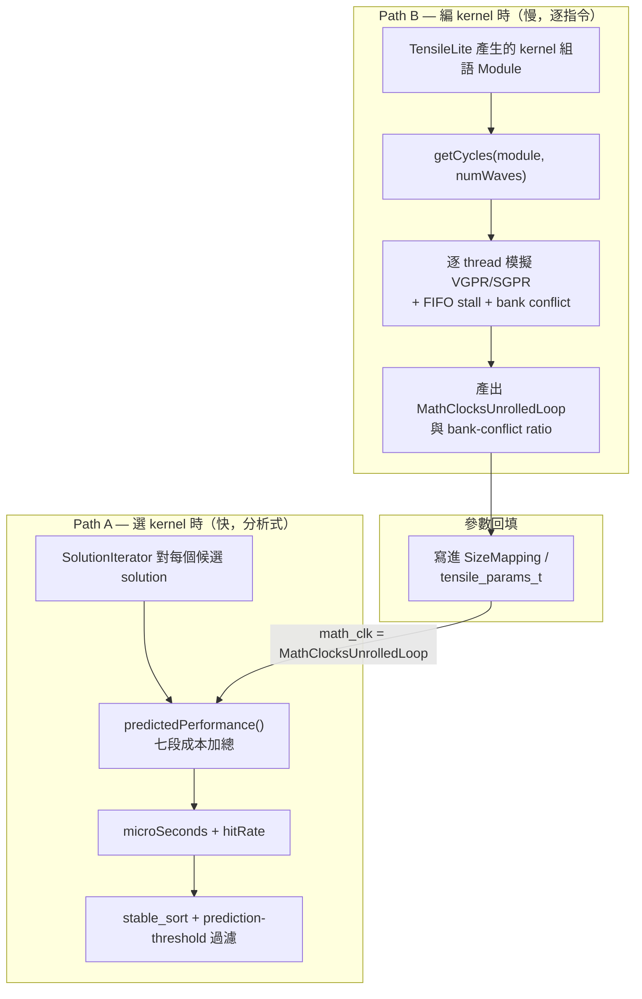

# Formocast 原始碼全景圖：不是兩份檔案，而是「兩個模擬器」

> 路徑基準：所有 code 連結為相對於本檔（`study_docs/origami/formocast/`）的相對路徑；行號會隨 commit 漂移，對不上時以符號名稱為準。

## 白話總覽

很多人第一次看 Formocast，只會看到這兩份各約 1000 行的檔案：

- [formocast_simulator.cpp](../../../shared/origami/src/simulator/tensilelite/formocast_simulator.cpp)（~952 行）
- [formocast.cpp](../../../shared/origami/src/simulator/tensilelite/formocast.cpp)（~1032 行）

於是會問：**「這樣就能模擬一顆 GPU 跑 GEMM 的延遲？」**

答案是：**不是靠這兩份，Formocast 其實是一整組協作的元件。** 用開餐廳比喻：

- 你以為看到的只是「外場點餐機」（快速估價）。
- 但背後還有一間「廚房計時房」（逐道菜實際計時），以及一本「這間店專屬的成本表」（硬體常數）。
- 點餐機之所以能「秒報價」，是因為最耗時的「一道菜要幾分鐘」早就被廚房量好、寫進菜單了。

換成技術語言，Formocast 由**兩條模擬路徑**組成，兩者分工並互相餵資料：

- **Path A — 分析式模型（analytical model）**：快、per-solution，在**選 kernel 時**跑，輸出 `microSeconds`。就是上面那兩份 cpp。
- **Path B — 逐指令 cycle 模擬器（cycle-accurate simulator）**：慢、per-kernel-assembly，在**編 kernel 時**跑，輸出「主迴圈每輪要幾個 cycle」（`MathClocksUnrolledLoop`）與 bank-conflict，**回填**進 kernel 參數表，之後被 Path A 當成一個現成數字直接用。

這份報告先帶你看**完整檔案版圖**、**兩條路徑怎麼分工與傳資料**，最後拆解**硬體常數那串 binary blob 到底是什麼**。看完你就能回答「為什麼分析式檔案看起來這麼小」。

> 名詞小抄
> - **GEMM**：一般矩陣乘法 `D = A × B (+C)`，深度學習最吃效能的核心運算。
> - **kernel**：一支實際在 GPU 上跑的程式（這裡指 TensileLite 產生的 GEMM 組合語言）。
> - **solution / config**：一組 kernel 的參數選擇（tile 大小、DepthU、GSU… 等）。同一個 GEMM 問題有成千上萬種 solution，要挑最快的那個。
> - **SizeMapping**：描述一個 solution 的參數結構（約 30 個欄位），是 Path A 的主要輸入之一。
> - **cycle**：GPU 時脈的一拍；把 cycle 數除以頻率就得到時間。

## 完整檔案版圖

以下是 Formocast 相關的 **canonical 原始碼**（不含 `agent_run/` 底下的 build 產物副本）。可以看到遠不只兩份、也不只在 origami 這個 library 裡。

| 檔案 | 行數 | 屬於哪條路徑 | 角色（白話） |
|------|------|--------------|--------------|
| [formocast_simulator.cpp](../../../shared/origami/src/simulator/tensilelite/formocast_simulator.cpp) | 952 | Path A | 主體 [predictedPerformance()](../../../shared/origami/src/simulator/tensilelite/formocast_simulator.cpp#L493-L772)：七段成本加總出 µs |
| [formocast.cpp](../../../shared/origami/src/simulator/tensilelite/formocast.cpp) | 1032 | A + B | Path A 的 cache/request/GSU/LSU/store 計算 **＋** Path B 用到的 FIFO/bank-conflict primitives |
| [formocast_simulator.hpp](../../../shared/origami/include/origami/simulator/tensilelite/formocast_simulator.hpp) | 784 | A + B | 全部 struct 定義（SizeMapping / ProblemInfo / HardwareConstants / PredictedPerformance…）+ `Formocast` class 宣告 |
| [formocast.hpp](../../../shared/origami/include/origami/simulator/tensilelite/formocast.hpp) | 362 | A + B | helper 宣告，**且 `getL2/L3/HBMLoadRequest` 是 inline 定義在這裡**（不在 cpp，容易找不到） |
| [gemm.cpp](../../../shared/origami/src/origami/gemm.cpp#L1938-L2017) | ~80 | A（呼叫端） | `compute_formocast_latency()`：把 origami 的型別轉成 Formocast 型別再呼叫 |
| [types.hpp](../../../shared/origami/include/origami/types.hpp) | — | A（資料） | `tensile_params_t`：承接 Formocast 專屬參數（含 `math_clocks_unrolled_loop`） |
| [SolutionIterator.cpp](../../../projects/hipblaslt/tensilelite/client/src/SolutionIterator.cpp) | 723 | A（主消費者） | 對每個候選 solution 呼叫 Path A、排序、依 threshold 過濾 |
| [UtilsOrigami.hpp](../../../projects/hipblaslt/tensilelite/include/Tensile/UtilsOrigami.hpp) | — | A（轉接） | TensileLite 端的 origami 轉接 util |
| [cycle.cpp](../../../projects/hipblaslt/tensilelite/rocisa/rocisa/src/pass/cycle.cpp) | 1232 | Path B | 逐指令 VGPR/SGPR 模擬器 + cycle 計數，入口 `getCycles()` |
| [EstimateAsmCyclesPass.cpp](../../../shared/stinkytofu/src/transforms/asm/EstimateAsmCyclesPass.cpp) | 996 | Path B | 用同一組 primitives 的替代 cycle estimator |
| [bindings.cpp](../../../shared/origami/python/src/origami/bindings.cpp) | — | A（介面） | origami 的 Python (nanobind) 綁定 |
| [test_formocast.cpp](../../../shared/origami/tests/test_formocast.cpp) | 819 | 測試 | Path A 的單元測試（12+ cases） |

粗算 canonical 相關程式碼 **~5000+ 行**，橫跨三個地方：

- `shared/origami/`（分析式模型本體 + 型別 + 綁定 + 測試）
- `projects/hipblaslt/tensilelite/`（消費者 SolutionIterator + 逐指令模擬器 cycle.cpp）
- `shared/stinkytofu/`（替代 cycle estimator）

> 這就是第一個重點：**Formocast 不是「兩份 cpp」，是一個橫跨三個子專案的子系統。**

## 架構 / 流程圖：兩條路徑怎麼接在一起



重點：兩條路徑的交界，就是 `SizeMapping.MathClocksUnrolledLoop` 這個欄位。Path B 把「一輪主迴圈多少 cycle」算好，Path A 直接拿來用（不自己重算）。

## 資料流：一個數字怎麼從 Path B 流到 Path A

用 **actor → action → input → output → next consumer** 的方式講清楚每個交接：

1. **Path B 的 [getCycles()](../../../projects/hipblaslt/tensilelite/rocisa/rocisa/src/pass/cycle.cpp#L1202-L1231)**
   - input：一支 kernel 的組語（`Module`）＋ wave 數。
   - action：逐指令模擬（見 [cycle-accurate-path.md](cycle-accurate-path.md)）。
   - output：一個整數 `cycles`（主迴圈每輪的 cycle 數）。
2. **TensileLite codegen**
   - action：把上一步的 `cycles` 存成 kernel 的參數 `math_clocks_unrolled_loop`。
   - output：帶著這個數字的 solution 參數。
3. **[SolutionIterator::getSizeMapping()](../../../projects/hipblaslt/tensilelite/client/src/SolutionIterator.cpp#L261)**（選 kernel 時）
   - action：把 solution 參數搬進 `Formocast::SizeMapping`，包含 `MathClocksUnrolledLoop`。
   - output：一份 `SizeMapping`。
4. **Path A 的 [predictedPerformance()](../../../shared/origami/src/simulator/tensilelite/formocast_simulator.cpp#L493-L772)**
   - action：`double math_clk = sizeMapping.MathClocksUnrolledLoop;`（[simulator.cpp:566](../../../shared/origami/src/simulator/tensilelite/formocast_simulator.cpp#L566)），用它算主迴圈 compute 成本。
   - output：`microSeconds`。
5. **[SolutionIterator::preProblem()](../../../projects/hipblaslt/tensilelite/client/src/SolutionIterator.cpp#L364-L429)**
   - action：對所有候選 solution 收集 `microSeconds` → `stable_sort` → 依 `prediction-threshold` 決定哪些進 benchmark queue。
   - output：縮小後的候選清單（詳見 [integration.md](integration.md)）。

> 也就是說：Path A「準」的關鍵——主迴圈那一段的指令 cycle 數——**不是它自己估的**，而是 Path B 逐指令量出來餵給它的。這正是 [model.md](model.md) 提到「`MathClocksUnrolledLoop` 是用實際指令 cycle 數」那句話的實作出處。

## 為什麼分析式檔案「看起來這麼小」

三個原因，都在把複雜度**搬到別處**：

- **最貴的工作外包給 Path B。**
  - 「一輪主迴圈幾個 cycle」牽涉逐指令排程、FIFO stall、bank conflict——這些全在 [cycle.cpp](../../../projects/hipblaslt/tensilelite/rocisa/rocisa/src/pass/cycle.cpp)（1232 行）做完，Path A 只拿一個整數。
- **硬體差異壓進常數表。**
  - 每個 GPU 架構的 cache 幾何、頻寬、頻率、實測係數，全存成一串 per-arch 的 binary blob（見下節），Path A 只做 `memcpy` 讀出來套公式。
- **重疊用一個 `max` 帶過。**
  - compute 與 memory 的重疊不逐 cycle 模擬，直接用 `max(compute, memory)`（或半重疊 `(a+b)/2`）近似，見 [cost-phases-internals.md](cost-phases-internals.md)。

所以 Path A 能「小」，是因為它站在 Path B 與常數表的肩膀上。

## HardwareConstants：那串 232-byte binary blob 是什麼

打開 [getHardwareConstants()](../../../shared/origami/src/simulator/tensilelite/formocast_simulator.cpp#L76-L106)，會看到每個架構都有一行像亂碼的陣列：

```cpp
unsigned char magic[232] = {0, 0, 0, 0, 0, 0, 224, 64, 0, 0, 0, 0, 0, 0, 80, 65, ...};
hw = archConstantMap(magic, 232);
```

它的原理很單純：**把 232 bytes 原封不動 `memcpy` 覆蓋成 `HardwareConstants` struct**，見 [archConstantMap()](../../../shared/origami/src/simulator/tensilelite/formocast_simulator.cpp#L67-L74)：

```cpp
std::memcpy(&hw, magic, std::min(magicSize, sizeof(Formocast::HardwareConstants)));
```

所以這串 blob 就是 [HardwareConstants](../../../shared/origami/include/origami/simulator/tensilelite/formocast_simulator.hpp#L200-L237) 這個 struct 的**記憶體實體 dump**。欄位順序（前段全是 8-byte `double`，little-endian）就是解碼順序：

| byte 位移 | 欄位 | 型別 |
|-----------|------|------|
| 0–7 | `L1CacheCapacity` | double |
| 8–15 | `L2CacheCapacity` | double |
| 16–23 | `L3CacheCapacity` | double |
| 24–31 | `L1CacheLineSize` | double |
| … | （依 hpp 欄位順序往下） | double |
| 尾段 | `NumXCDs`、`LocalRead/Write*Latency*`… | uint32_t |

**手動解碼一個欄位當範例**：gfx950 的前 8 bytes 是 `{0,0,0,0,0,0,224,64}`。

- little-endian double，最高位兩 byte 是 `224,64` = `0x40E0`。
- IEEE-754 解出來是 `32768.0` → 即 `L1CacheCapacity = 32768` bytes（32 KB）。

同理接下來 8 bytes `{0,0,0,0,0,0,80,65}` = `0x4150000000000000` = `4194304.0` → `L2CacheCapacity = 4194304` bytes（4 MB）。重點不是背數字，而是理解：

- 這是**平台校準結果的序列化**，不是魔法。
- 上新架構＝量出新常數 → 重新 dump 成 blob（填法見 [debugging-and-calibration.md](debugging-and-calibration.md)）。
- 想核對現有值，最簡單是在程式裡呼叫 [HardwareConstants::print()](../../../shared/origami/include/origami/simulator/tensilelite/formocast_simulator.hpp#L239-L271) 把每個欄位印出來，別去人肉解 hex。

> 目前 blob 內建三個架構：`gfx950`、`gfx942`、`gfx1201`（見 [getHardwareConstants()](../../../shared/origami/src/simulator/tensilelite/formocast_simulator.cpp#L76-L106)）。

## 關鍵資料結構（跨路徑都會看到）

| 結構 | 角色（白話） | 位置 |
|------|--------------|------|
| `SizeMapping` | 一個 solution 的所有 kernel 參數（Path A 輸入、Path B 回填目標） | [SizeMapping](../../../shared/origami/include/origami/simulator/tensilelite/formocast_simulator.hpp#L44-L82) |
| `ProblemInfo` | GEMM 問題本身（M/N/K/dtype/transpose） | [ProblemInfo](../../../shared/origami/include/origami/simulator/tensilelite/formocast_simulator.hpp#L330-L345) |
| `HardwareConstants` | per-arch 校準常數（blob 解出來的目標） | [HardwareConstants](../../../shared/origami/include/origami/simulator/tensilelite/formocast_simulator.hpp#L200-L237) |
| `PredictedPerformance` | Path A 的輸出（µs + hitRate + 七段分項） | [PredictedPerformance](../../../shared/origami/include/origami/simulator/tensilelite/formocast_simulator.hpp#L165-L192) |
| `BankConflictResult` | Path B 算出的 A/B bank-conflict 比值 | [BankConflictResult](../../../shared/origami/include/origami/simulator/tensilelite/formocast_simulator.hpp#L103-L106) |

欄位逐一說明見 [api-and-usage.md](api-and-usage.md)。

## 交叉連結

- 逐指令模擬那條路（Path B）→ [cycle-accurate-path.md](cycle-accurate-path.md)
- 記憶體階層與 load/store request 實作 → [memory-model-internals.md](memory-model-internals.md)
- 七段成本的實際公式 → [cost-phases-internals.md](cost-phases-internals.md)
- 概念總覽與七段直覺 → [model.md](model.md)
- 介面與資料結構欄位 → [api-and-usage.md](api-and-usage.md)
- dispatch / threshold 過濾 → [integration.md](integration.md)
- 上新架構、填常數 SOP → [debugging-and-calibration.md](debugging-and-calibration.md)

## 一句話總結

> **Formocast 不是兩份 1000 行的 cpp，而是「Path A 分析式模型 + Path B 逐指令模擬器 + per-arch 常數 blob + 轉接/消費層」約 5000+ 行的子系統；Path A 之所以精簡，是因為最貴的指令級工作與硬體差異都被 Path B 和常數表吸收了。** 想看 Path B 到底怎麼逐指令數 cycle，接著讀 [cycle-accurate-path.md](cycle-accurate-path.md)。
