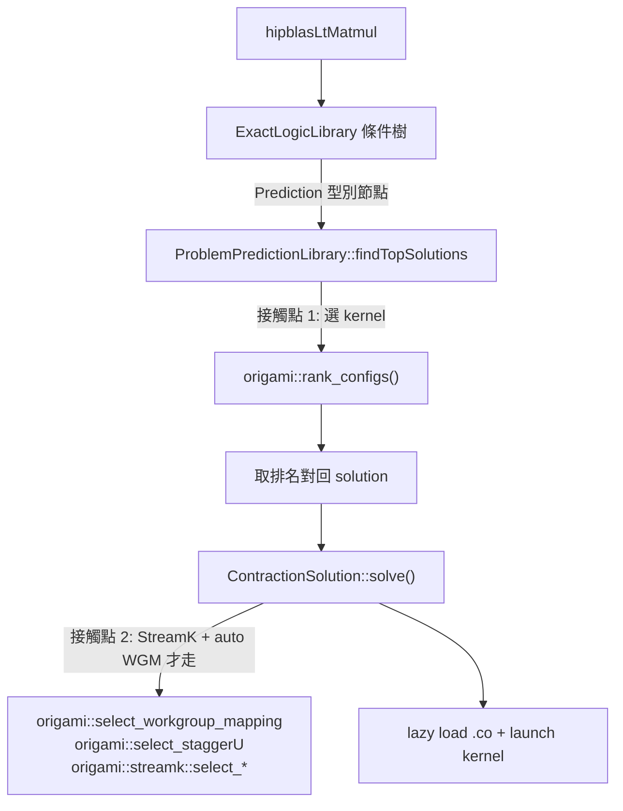

# Origami 怎麼被 hipBLASLt / TensileLite 呼叫

路徑說明：本檔在 `study_docs/origami/`。連原始碼往上兩層：`../../projects/...`、`../../shared/...`。行號會漂移，以符號名稱為準。建議先讀 [README.md](README.md)。

> 前幾篇講 Origami「內部怎麼算」，這篇講**外面怎麼用它**：hipBLASLt 在執行時哪一步會呼叫 Origami、用什麼開關打開、選好 kernel 後又怎麼再叫它選 launch 參數。與 hipBLASLt runtime 全景的關係，另見 [../hipblaslt/component-interactions/runtime-and-selection.md](../hipblaslt/component-interactions/runtime-and-selection.md)（本篇聚焦 Origami 這一側）。

## 一句話總結

> **執行時，hipBLASLt 的 solution 條件樹走到 `Prediction` 型別節點時，`ProblemPredictionLibrary` 就把問題翻成 `origami::problem_t` + 一份 `origami::config_t` 清單，呼叫 `origami::rank_configs()` 選 kernel；選定後若是 StreamK kernel，`ContractionSolution::solve()` 還會再叫 Origami 選 WGM / staggerU / grid。整條路徑用 `TENSILE_SOLUTION_SELECTION_METHOD` 這個環境變數開關。**

## 兩個接觸點

Origami 在 hipBLASLt runtime 有**兩個**被呼叫的地方，別搞混：



1. **選 kernel**（solution selection）：決定「這次 GEMM 用哪支 kernel」。
2. **選 launch 參數**：kernel 選定後，決定「這支 StreamK kernel 的 workgroup 怎麼排、K 怎麼錯開、grid 多大」。

## 接觸點 1：選 kernel（`ProblemPredictionLibrary` → `rank_configs`）

### 誰呼叫

hipBLASLt 的 solution 是一棵「依條件分層」的選擇樹（先比型別 / 轉置，最後比尺寸）。多數葉子是純比對節點，但有一種型別叫 **`Prediction`**，由 [`ProblemPredictionLibrary`](../../projects/hipblaslt/tensilelite/include/Tensile/PredictionLibrary.hpp)（`type() == "Prediction"`）負責。它持有一份 `origami::config_t` 清單，在 `findTopSolutions()` 裡呼叫 Origami：

```cpp
// PredictionLibrary.hpp（ProblemPredictionLibrary::findTopSolutions 內，節錄）
origami::problem_t origami_problem = {
    .size        = {m, n, k},
    .batch       = batch,
    .a_transpose = problem.transA() ? origami::transpose_t::T : origami::transpose_t::N,
    .b_transpose = problem.transB() ? origami::transpose_t::T : origami::transpose_t::N,
    // ... a/b/c/d dtype、mi_dtype ...
};

auto prediction_result = origami::rank_configs(
    origami_problem, *(pAMDGPU->analyticalHardware), origami_config_list);
```

### 資料怎麼接上（三段翻譯）

hipBLASLt 世界的型別跟 Origami 不一樣，所以有三段「翻譯」：

1. **problem 翻譯**：從 Tensile 的 `problem` 取 `m, n, k, batch`、轉置、各 dtype，組成 `origami::problem_t`。dtype 的對映由 [`UtilsOrigami.hpp`](../../projects/hipblaslt/tensilelite/include/Tensile/UtilsOrigami.hpp) 的 `datatypeToAnalyticalDatatype(rocisa::DataType)` 負責——它是一個純粹的 `switch`，把 `rocisa::DataType::Half` 對到 `origami::data_type_t::Half` 等等。這個 header 只做型別橋接，不含任何預測邏輯。

2. **config 清單翻譯**：[`Serialization/PredictionLibrary.hpp`](../../projects/hipblaslt/tensilelite/include/Tensile/Serialization/PredictionLibrary.hpp) 從 library logic（YAML / msgpack）反序列化，把每個 Tensile solution 對映成一個 `origami::config_t`（macroTile → `mt`、matrixInstruction → `mi`、`CUOccupancy` → `occupancy`、`workGroupMapping`、non-temporal A/B → `cache_hints_*` 等），並用 `config.index` 記住它對應第幾個 solution。

3. **hardware 翻譯**：[`HipHardware.cpp`](../../projects/hipblaslt/tensilelite/src/hip/HipHardware.cpp) 為每個裝置建一個 `origami::hardware_t`，掛在 `HipAMDGPU::analyticalHardware` 上，`rank_configs` 直接拿來用。

### 選完之後

`rank_configs` 回傳「排好序的 `prediction_result_t`」。hipBLASLt 依名次用 `r.config.index` 取回對應 solution，再套 `hardwarePredicate` / `problemPredicate` 確認這個 solution 真能跑，收集到需要的數量為止。

> 關鍵：**Origami 不真的跑 kernel，只用硬體參數估延遲**（見 [latency-model.md](latency-model.md)），所以能在 runtime 快速選——這正是它相對「純查表最近鄰」的價值：對沒精確 tune 過的尺寸也能較準地選。

## 接觸點 2：選 launch 參數（`ContractionSolution` → WGM / staggerU / streamk）

選定 kernel、進入 [`ContractionSolution::solve()`](../../projects/hipblaslt/tensilelite/src/ContractionSolution.cpp) 後，如果這是 **StreamK kernel 且開了 auto WGM**（YAML 裡 `workGroupMapping == 0`），hipBLASLt 會在 solve 時再呼叫 Origami 的輔助選擇器：

```cpp
// ContractionSolution.cpp（auto WGM 分支，節錄）
origami::workgroup_mapping_t prediction_results
    = origami::select_workgroup_mapping(origami_problem,
                                        *(hipAMDGPU->analyticalHardware),
                                        origami_config,
                                        skgrid);
```

同一段還會呼叫：

- `origami::select_staggerU(...)`——選 staggerU 的 mapping / 值 / stride shift（讓各 workgroup 從 K 的不同位置起跑，錯開 cache 爭用）。
- `origami::streamk::select_reduction / select_hybrid_mode / select_grid_size`——選 StreamK 的 reduction 策略、靜態/動態混合模式（SK3/SK4）、grid 大小。

另外 [`tensile_host.cpp`](../../projects/hipblaslt/library/src/amd_detail/rocblaslt/src/tensile_host.cpp) 會把 `streamk_tile_scheduling_ext` 傳下去，讓 AUTO 模式委派給 `origami::streamk::select_hybrid_mode`。

> 白話：接觸點 1 是「選哪道菜」，接觸點 2 是「這道菜的火候 / 擺盤怎麼調」——都問 Origami，但問的是不同函式。

## 開關：`TENSILE_SOLUTION_SELECTION_METHOD`

這條 Origami 路徑不是永遠開著，由環境變數控制（見 [env-variables.rst](../../projects/hipblaslt/docs/reference/env-variables.rst)）：

> `TENSILE_SOLUTION_SELECTION_METHOD=2` — "Origami with Stream-K (enables Origami solution selection for consistent performance)"

也就是說，它實質上就是「這次要不要走 Origami 預測」的開關，和條件樹走到 `Prediction` 節點的行為互相呼應——想強制或關閉 Origami 路徑時就調它。判斷是否啟用的邏輯在 [`ExactLogicLibrary.hpp`](../../projects/hipblaslt/tensilelite/include/Tensile/ExactLogicLibrary.hpp) 的 `usePredictionLibrary()`（見 `Debug.cpp`）：啟用時會略過 Equality / Range 節點，讓 Prediction library 勝出。

## 不只 TensileLite：跨 backend 共用同一個 API

Origami 設計上是「跨 backend 選型器」——`rank_configs` 吃的是一份候選 config 清單 + 硬體參數，只要 backend 能提供足夠 metadata（MacroTile、DepthU、VectorWidth、GSU/LSU 等），這份候選 pool 就能來自不同來源，「**插入相同的 Origami 呼叫點**」即可，不必為每個 backend 重寫 heuristics（依 [Origami/Inductor integration plan](https://amd.atlassian.net/wiki/spaces/~jactaylo/pages/1220631594)）。實際上：

- **rocRoller backend** 用同一支 API：[`rocroller/solution_selection.cpp`](../../projects/hipblaslt/library/src/amd_detail/rocblaslt/src/rocroller/solution_selection.cpp) 建 `origami::config_t` tile 清單後同樣呼叫 `origami::rank_configs`。
- **PyTorch Inductor**：[Origami/Inductor integration plan](https://amd.atlassian.net/wiki/spaces/~jactaylo/pages/1220631594) 規劃把 Origami-based selection 導入 Inductor 的 templated GEMM（`mm.py` / `bmm.py` 等）compile-time 選型，並處理 fused epilogue（如 gemm+relu）在模型中的影響。
- **TritonBLAS / Stream-K、CK**：同屬「能提供 kernel metadata 的候選來源」，可納入同一套 Origami 選型（見 [生態系報告](https://amd.atlassian.net/wiki/spaces/~7120204c779face96d403c9783064701435635/pages/1784683664) §2.1）。實戰案例如 [[WIP] Enable Stream-K and Origami on Navi](https://amd.atlassian.net/wiki/spaces/VPGFXAT/pages/1006483607)。
- CMake 上，hipBLASLt 把 `shared/origami` 當子專案：`tensilelite-host` link `roc::origami`（[tensilelite/CMakeLists.txt](../../projects/hipblaslt/tensilelite/CMakeLists.txt)）、`_rocisa` link `roc::origami`、rocRoller link `roc::origami-headers`。

> 所以別把 Origami 誤會成「只服務 TensileLite」；它是**跨 backend（TensileLite / rocRoller / CK / Triton / Inductor）共用**的分析式選型基礎設施。跨 backend 的 e2e 效益 caveat（如 Inductor 決策可能掩蓋 GEMM uplift）見 [ecosystem-and-formocast.md](ecosystem-and-formocast.md)。

## 附帶：tuning / codegen 也間接用到 Origami（透過 Formocast）

除了 runtime，Origami 內嵌的 **Formocast** 還在**建置 / tuning** 期被用到（這條線不是 `rank_configs`，細節見 [ecosystem-and-formocast.md](ecosystem-and-formocast.md)）：

- **tuning 剪枝**：[`SolutionIterator.cpp`](../../projects/hipblaslt/tensilelite/client/src/SolutionIterator.cpp) 直接用 `origami::Formocast`（`setProblem/setSolution/setHardware` → `predictedPerformance()`）做 `prediction-threshold` 剪枝，跳過預測會太慢的候選。
- **codegen cycle 分析**：rocisa 的 [`cycle.cpp`](../../projects/hipblaslt/tensilelite/rocisa/rocisa/src/pass/cycle.cpp) 用 `origami::Formocast` 分析 bank conflict、算 `MathClocksUnrolledLoop`。

## 一句話總結

> **接觸點 1（`ProblemPredictionLibrary::findTopSolutions` → `origami::rank_configs`）選 kernel，接觸點 2（`ContractionSolution::solve` → `select_workgroup_mapping` / `select_staggerU` / `streamk::select_*`）選 StreamK launch 參數，兩者都靠 `UtilsOrigami.hpp` 做 dtype 橋接、靠 `HipHardware` 提供 `analyticalHardware`，並用 `TENSILE_SOLUTION_SELECTION_METHOD=2` 開關。** rocRoller 共用同 API；tuning / codegen 則透過內嵌的 Formocast 間接用到——見 [ecosystem-and-formocast.md](ecosystem-and-formocast.md)。
