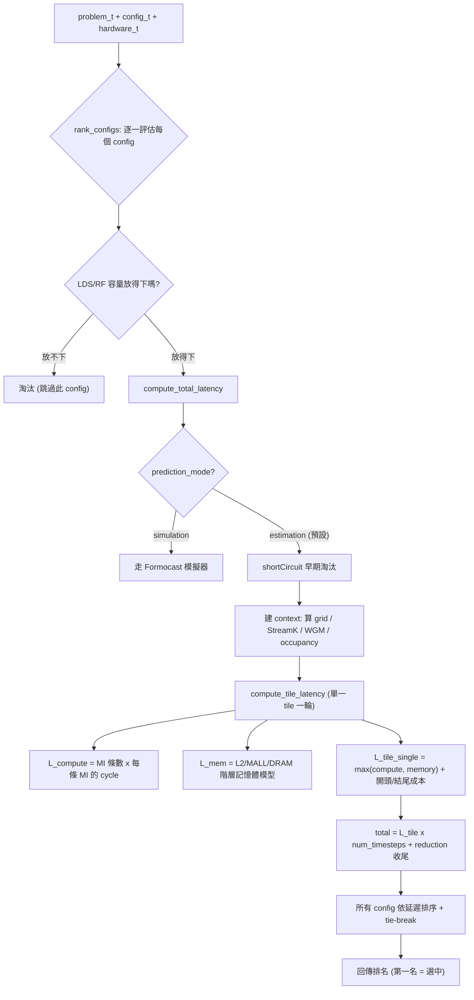

# Origami 的延遲模型：它到底怎麼「算」出誰最快

路徑說明：本檔在 `study_docs/origami/`。原始碼連結用 `../../shared/...`。行號會漂移，以符號名稱為準。建議先讀 [README.md](README.md)。

> 這是整組文件的**核心**。前面說 Origami「用公式算延遲」，這篇就把那條公式一層一層拆開講清楚——但**不需要**你會寫效能模型，看不懂就先抓「一句話直覺」。

## 一句話總結

> **對每個候選 config，Origami 分別算「算力要多久（compute）」與「搬資料要多久（memory）」，取比較慢的那個當「單一 tile 一輪」的時間，乘上要跑幾輪，再加上開頭 / 結尾的固定成本，就得到這個 config 的總延遲；對所有候選算一遍，延遲最小的就是贏家。**

## 為什麼是「取 compute 和 memory 的最大值」？

先講最關鍵、也最反直覺的一步。GPU kernel 在跑主迴圈時，**「算」和「搬資料」是同時進行的**（硬體會把下一輪要用的資料先搬進來，一邊搬一邊算，這叫 pipeline / latency hiding）。

既然兩件事重疊進行，那一輪要花多久，就取決於**比較慢的那一件**：

- 如果算力比較慢（compute-bound）→ 搬資料早就搬完在等，瓶頸是算 → 時間 ≈ compute。
- 如果搬資料比較慢（memory-bound）→ 算力早就算完在等，瓶頸是搬 → 時間 ≈ memory。

所以模型用 `max(compute, memory)`，而不是 `compute + memory`：

```cpp
// gemm.cpp: compute_tile_latency 內
double L_tile_single =
    std::max(L_compute * heuristic.weight_compute, L_mem * heuristic.weight_memory);
```

> 用類比：洗衣服時「洗衣機在洗」和「你在摺上一批」可以同時做。一輪的時間不是「洗 + 摺」相加，而是「洗和摺誰比較久」——因為兩件事並行。Origami 的主迴圈就是這個道理。
>
> （那些 `weight_compute` / `weight_memory` 是校正係數，讓模型估得更貼近實測；先忽略它們，抓 `max` 這個骨架就好。）

## 全景：從一個 config 到一個延遲數字



下面依這張圖，由外而內逐層講。

## 第一層：`rank_configs`——外層的迴圈與排序

進入點是 [`rank_configs`](../../shared/origami/src/origami/origami.cpp)。它做三件事：**逐一評估、依延遲排序、平手時再細分**。

### 1. 逐一評估 + 容量淘汰

對清單裡每個 config：

- 先檢查**放不放得下**：GEMM 走 `gemm::check_lds_capacity`（tile 需要的 LDS 共享記憶體不能超過硬體上限）；attention 模型還會多檢查暫存器檔（RF）容量。放不下就直接跳過（log 裡會印 `REJECTED: LDS capacity exceeded`）。
- 放得下，才呼叫 `gemm::compute_total_latency(...)` 算延遲。
- 若回傳的是「無限大」（`std::numeric_limits<double>::max()`，代表被某個規則否決），也不收進候選。

```cpp
// origami.cpp: rank_configs 內（節錄，GEMM 分支）
fits_in_lds = gemm::check_lds_capacity(hardware, config.mt, problem.a_dtype, problem.b_dtype);
if (!fits_in_lds) { /* ... 跳過 ... */ continue; }
latency = gemm::compute_total_latency(problem, hardware, config, hardware.N_CU);
```

### 2. 依延遲排序

用 `std::stable_sort` 依延遲**由小到大**排。`stable_sort`（穩定排序）代表延遲相同的兩個 config 會**維持原本輸入順序**——這是後面「決定性」的基礎。

### 3. 平手時的 tie-break（很重要，決定「決定性」）

實測 GPU 上，兩個延遲估計**非常接近**的 config 幾乎沒差別；但 library 需要每次都選同一個（否則效能忽好忽壞、難除錯）。所以 Origami 有一套明確的平手規則。

先決定「誰算平手」：看第一名的延遲，把延遲落在它 `heuristics_variance`（預設約 1%，可用環境變數 `ANALYTICAL_GEMM_HEURISTICS_VARIANCE` 調）範圍內的都算平手候選。然後**依序**套下面的規則，直到分出勝負：

| 順序 | 規則 | 白話理由 |
|------|------|---------|
| 1 | **arithmetic intensity 高者優先** | `2·MT_M·MT_N·MT_K / (MT_M·MT_K + MT_N·MT_K + MT_M·MT_N)`——每搬一份資料能做越多運算越划算，越能吃滿算力。 |
| 2 | **問題維度偏好** | 若 `M > N`，偏好 `MT_M` 較大的 tile；若 `N > M`，偏好 `MT_N` 較大的。讓 tile 形狀貼合問題形狀。 |
| 3 | **最終保底：MT 大小** | 依序比 `MT_M` → `MT_N` → `MT_K`，大者優先。**保證「不管候選清單順序如何都選同一個」**（測試 `deterministic_tie_breaking` 就是驗這件事）。 |

> 為什麼要這麼講究？因為 Origami 標榜 **deterministic（決定性）**。少了這套 tie-break，兩個延遲相同的 config 誰排前面就會受輸入順序影響，選出來的 kernel 可能跳來跳去，效能不穩。

`select_config` 就是 `rank_configs` 取第一名；`select_topk_configs` 取前 K 名。

## 第二層：`compute_total_latency`——一個 config 的總帳

進到 [`gemm::compute_total_latency`](../../shared/origami/src/origami/gemm.cpp)，流程如下：

### 0. 兩道快速否決

- **heuristic reject**：某些組合（例如 subtile kernel 配很小的 K）被規則直接判定不該用，回傳無限大，讓 `rank_configs` 淘汰它。
- **模式分流**：若 `config.prediction_mode == simulation`，改走內嵌的 **Formocast 模擬器**（`compute_formocast_latency`），本篇不展開，見 [ecosystem-and-formocast.md](ecosystem-and-formocast.md)。預設是 `estimation`，走下面的分析模型。

### 1. `shortCircuit`：不用算就先刷掉一批

這是效能優化：很多 config 根本不用跑完整模型就知道不合理，直接回無限大淘汰。例如：

- 問題很小、放得進一個 tile，卻選了「切更細」的 tile → 淘汰。
- 用了 Dot2 指令（`MI = 1×1×64`）但 `M > 2` → 淘汰（Dot2 只適合極瘦的問題）。
- **cache hint（non-temporal）用得對不對**：當 K 剛好對齊 128 bytes 時，只有在某一維遠大於另一維（如 `N` 的 bytes 是 `M` 的 5 倍以上）才該對某個矩陣開 non-temporal（不佔 cache）；用錯了就淘汰。

```cpp
// gemm.cpp: compute_total_latency 的 shortCircuit 節錄
if (M <= 256 && N <= 256 && K < 1024 && batch != 1 && (MT_M < M || MT_N < N))
  return std::numeric_limits<double>::max();
// Use Dot2 only for M < 3
if (MI_M == 1 && MI_N == 1 && MI_K == 64 && M > 2) return std::numeric_limits<double>::max();
```

> 白話：`shortCircuit` 就是「一眼就知道不行的先踢掉」，省下對它們算完整模型的時間。

### 2. 建 `context`：把「這個 kernel 會怎麼被排到 GPU 上」算出來

`context_t` 建構子（`gemm.cpp` 開頭）一次算好一堆「排布」相關的量，後面各步驟共用：

- **grid**：問題要切成幾個輸出 tile（`grid_m × grid_n`）。
- **launch 參數**：透過 `compute_launch_parameters`（內部呼叫 `streamk::select_grid_size` / `select_reduction`）算出 reduction 策略、實際用到幾個 CU（`active_cus`）、要跑幾個 **timestep**、split factor。
- **記憶體頻寬**：`compute_mem_bw_from_occupancy`——用到的 CU 越多，能分到的記憶體頻寬越高（但不是線性）。
- **WGM**：`predict_workgroup_mapping`（快速版）算 workgroup 怎麼排以最大化 L2 重用。
- **occupancy 衰減**：`occupancy_factor = pow(decay_base, real_occupancy)`——occupancy 越高，開頭 / 結尾成本被攤薄越多（一個經驗式衰減）。

> 名詞：**timestep（時步）**＝把所有輸出 tile 分批丟到 GPU 上跑，一「批」（所有 CU 各拿一個 tile 同時跑）就是一個 timestep。tile 多過 CU 數時就要跑好幾個 timestep。

### 3. 算單一 timestep + 乘上 timestep 數 + 加 reduction

```cpp
// gemm.cpp: compute_total_latency 尾段
double L_timestep    = compute_timestep_latency(problem, hardware, config, context);
double total_latency = L_timestep * context.num_timesteps;         // 3) 線性放大
double L_parallel_reduce = compute_parallel_reduction_latency(...); // 4) 收尾 reduction
total_latency += L_parallel_reduce;
```

- `compute_timestep_latency` 直接等於 `compute_tile_latency`（假設一個 timestep 的時間 ≈ 一個 CU 算完一個 K-完整輸出 tile 的時間）。
- 乘上 `num_timesteps`（要跑幾批）。
- 若用了 split-K + parallel reduction（把 K 切給多個 workgroup、最後要合併部分和），再加上那顆 reduction kernel 的成本；不 split 就是 0。

## 第三層：`compute_tile_latency`——一個 tile 一輪的細帳

這是模型的心臟（[`compute_tile_latency`](../../shared/origami/src/origami/gemm.cpp)）。它算「一個 CU 從頭到尾算完一個輸出 tile」要多久，拆成**主迴圈**與**開頭 / 結尾**兩部分。

### 主迴圈：`L_tile_single`（單輪）× `num_iter`（幾輪）

一個輸出 tile 要沿 K 維跑很多輪（每輪吃一小段 K = `MT_K`）。**單輪**的時間就是前面說的取最大值：

```cpp
double L_compute = compute_mt_compute_latency(problem, hardware, config);  // 算力
double L_mem     = compute_memory_latency(problem, hardware, config, context); // 記憶體
double L_tile_single = std::max(L_compute * w_compute, L_mem * w_memory);
L_tile_single += L_cvt;   // 型別轉換額外成本（見下）
```

**輪數** `num_iter ≈ k_per_split / MT_K - 1`（沿 K 要跑幾段，最後一段算進 epilogue）。

- **`L_compute`（算力）**＝這個 tile 需要幾條矩陣指令 × 每條指令要幾個 cycle：

```cpp
// gemm.cpp: compute_mt_compute_latency
size_t N_MI = compute_number_matrix_instructions(config.mt, config.mi); // MT 要切成幾個 MI 小塊
size_t L_MI = hardware.get_mi_latency(config.mi.m, config.mi.n, config.mi.k, problem.mi_dtype); // 查表：這條 MI 幾 cycle
size_t L_MT = L_MI * N_MI;   // 相乘
```

  每條 MI 的 cycle 數存在 `hardware.hpp` 的 `INSTRUCTION_MAP`（依架構 + `(MI_M, MI_N, MI_K, dtype)` 查表，來自微基準實測）。

- **`L_mem`（記憶體）**＝走記憶體階層模型，見下一節。

- **`L_cvt`（型別轉換）**：某些架構沒有原生 TF32、或需要把 FP32 拆成 BF16 來算，會有額外轉換成本（`compute_cvt_overhead` / `compute_cvt_overhead_x1`）。一般型別是 0。

### 開頭與結尾：prologue / epilogue

主迴圈之外還有固定成本：

- **`L_prologue`（開頭）**：載入第一批資料、暖機。以 `L_mem`（第一次要把資料搬進來）× tile 利用率懲罰 × occupancy 衰減估計。
- **`L_epilogue`（結尾）**：算完後把結果寫回、可能還有 in-kernel reduction。以 `L_compute + compute_epilogue_latency` × occupancy 衰減估計；若 K 不是 `MT_K` 的整數倍，還要加一個「K 對不齊」的懲罰（`problem_k_quant × epilogue_k_padding_penalty`）。

> `effective_tile_penalty`＝`1 / 利用率`：如果問題邊緣的 tile 沒被填滿（例如 M 不是 MT_M 整數倍，最後一排 tile 有一半是空算），利用率 < 1，這個懲罰就 > 1，把延遲往上調——反映「算了但沒用到」的浪費。

### 最後組裝

```cpp
// gemm.cpp: compute_tile_latency 尾段
double L_tile_total = L_tile_single * num_iter;             // 主迴圈
L_tile_total += w_prologue      * L_prologue;               // + 開頭
L_tile_total += w_epilogue      * L_epilogue;               // + 結尾
L_tile_total += w_wg_setup      * L_WG_setup;               // + workgroup 啟動
L_tile_total += w_loop_overhead * num_iter;                 // + 每輪迴圈開銷
L_tile_total *= w_tile_total;                               // 整體校正係數
```

> 白話：**主迴圈時間 × 輪數 + 開頭 + 結尾 + 每輪固定開銷**，各項再乘上校正權重。

## 第四層：`compute_memory_latency`——階層記憶體模型

這是 `L_mem` 的來源，也是 Origami 相對「純查表」最有價值的部分：它**估算資料在 cache 各層的命中率**，據此算搬資料要多久。

GPU 的記憶體像三層倉庫，越外層越大越慢：

```
CU 要資料 → L2 (快、小) → MALL / Infinity Cache (中) → DRAM / HBM (慢、大)
```

> 這幾層各是什麼、為什麼 MALL 又叫 Infinity Cache（256 MB）、L2 為何是「每個 XCD 私有分割」、以及 cache 與 scratchpad（LDS）的區別，見背景文件 [../gpu_knowledge/memory-hierarchy-and-chiplet.md](../gpu_knowledge/memory-hierarchy-and-chiplet.md)。

`compute_memory_latency` 的邏輯（[`gemm.cpp`](../../shared/origami/src/origami/gemm.cpp)）：

1. **估各層命中率**（`estimate_cache_hit_rates` → `estimate_l2_hit` / `estimate_mall_hit`）：用 WGM 排布下「相鄰 workgroup 共用多少資料」推算 A、B 兩個矩陣在 L1 / L2 / MALL 的命中率。命中率越高，越少資料要往更慢的層拿。
2. **算每個 CU 要載多少 bytes**（對齊 128 bytes cache line，MX 型別還要加 scale bytes）。
3. **分「暫時性 vs 非暫時性」流量**：non-temporal 的資料不佔 cache。
4. **逐層算延遲**：L2 → MALL → DRAM，各層用架構相關的頻寬比例（`mem1/mem2/mem3_perf_ratio`）並依 active CU 數縮放。
5. **取最慢的一層當瓶頸**：

```cpp
double L_mem = std::max({L_mem_l2   * heuristic.weight_mem_l2,
                         L_mem_mall * heuristic.weight_mem_mall,
                         L_mem_dram * heuristic.weight_mem_dram});
```

> 白話：**資料多半命中 L2 就快、常常要跑到 DRAM 就慢**；Origami 用 tile 幾何 + WGM 推命中率，把「這個 tile 大小在這張 GPU 上搬資料多痛」量化出來。這正是它能對「沒 benchmark 過的尺寸」也估得準的關鍵——因為它建模的是**硬體行為**，不是背答案。

## 那些 magic number 是怎麼回事？

讀原始碼會看到很多經驗常數：`weight_compute`、`main_loop_efficiency`、`pow(0.95, occupancy)`、`epilogue_k_padding_penalty`、staggerU 裡的 `0.95 × L2_capacity`……這些不是亂填的：

- 分析模型**先抓對物理骨架**（算力公式、頻寬、cache 命中率），但真實 GPU 有很多模型難以完美刻畫的細節（指令發射衝突、bank conflict、排程空檔）。
- 這些常數是**校正係數**：拿模型估計去對實測 benchmark，調到「排序」盡量貼近真實。它們大多集中在 `heuristics.cpp`，依架構 / 問題特性帶入不同值。
- 重點是：**Origami 要的是「排序對」（把好 config 排前面），不是「絕對延遲數字準」**。所以這些係數只要讓相對高低對就夠了——這也是為什麼它用 `stable_sort` + tie-break，而不是死磕絕對值。

> 一句話看待 magic number：**骨架靠物理、細節靠校正**；它們讓一個輕量模型的「排名」逼近昂貴的實測。

> 延伸：「只求排序對、不求絕對準」正是 Origami 敢對沒 benchmark 過的形狀出手的關鍵，也回答了常見疑問——**runtime 其實完全不回測（只套公式）、>90% 是 design-time 的統計 KPI 而非 runtime guarantee、以及為什麼還是遠比隨機選好**。完整拆解見 [ecosystem-and-formocast.md](ecosystem-and-formocast.md) 的「常見疑問：Origami 憑什麼 claim >90%？runtime 會回測嗎？」。

其中最「物理」的一組常數是**硬體常數**（`architecture_constants`：L2/MALL/HBM 頻寬、XCD 數、每 CU 並行 MI 數等），它們不是猜的，而是用 **micro-benchmark 量出來**再填進 `hardware.cpp`——這也是新架構 bring-up 時讓 Origami「day-one 不盲選」的關鍵步驟。量測 SOP 與各欄位意義見 [debugging-and-calibration.md](debugging-and-calibration.md) 第四節。

## 一句話總結

> **Origami 的延遲＝「一輪取 max(算力, 記憶體) × 輪數 + 開頭 + 結尾 + reduction」，其中記憶體那項靠 cache 階層命中率建模；對所有候選算一遍、由小到大排序、平手用 arithmetic intensity / 維度 / MT 大小分勝負。** 它建模的是硬體行為而非背答案，所以又快又能泛化到沒測過的尺寸——代價是絕對數字不必準、只求排名對。更細的欄位 / API 見 [api-and-usage.md](api-and-usage.md)，怎麼被 hipBLASLt 呼叫見 [hipblaslt-integration.md](hipblaslt-integration.md)。
