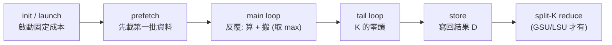

# GPU 效能建模要考慮哪些東西：讀懂 Origami / Formocast 的前置教材

> 路徑基準：本檔在 `study_docs/origami/`。GPU 背景文件連 `../gpu_knowledge/xxx.md`；原始碼連 `../../shared/...`；同目錄與 formocast 子文件用相對檔名。行號會漂移，以符號名稱為準。

## 這份文件要解決什麼問題

如果你讀 [latency-model.md](latency-model.md)（Origami）和 [formocast/model.md](formocast/model.md)（Formocast）覺得「每個字都看得懂、但兜不起來」——那是因為那兩份在講 **「模型怎麼算」**，卻預設你已經懂背後的 **GPU 架構事實**（cache line、bus width、coalescing、bank conflict、latency hiding、occupancy…）。

這份文件反過來：**先講「一個 GPU kernel 跑起來，時間到底花在哪」，再把每個時間去處對到 Origami / Formocast 怎麼估它。** 看完再回頭讀那兩份，就會「兜得起來」。

閱讀方式：

- **主線**是「一個 kernel 執行的各階段（component）」，一段一段走。每段固定四塊：
  1. 🧺 **白話**：這階段在做什麼。
  2. 🏗️ **背後的 GPU 概念**：需要哪個硬體事實才懂（已在 `gpu_knowledge/` 的用連結帶過、沒有的在這裡補）。
  3. 📐 **Origami 怎麼「粗估」**：快、公式化。
  4. 🔬 **Formocast 怎麼「細估」**：慢、逐層/逐指令。
- 最後有一張 **概念總表**（概念 → 兩模型怎麼用 → gpu_knowledge 有無涵蓋），與一份 **兩份落差清單**。

> ⚠️ 全篇請把兩件事分開：**「GPU 事實」**（硬體真的這樣運作）vs **「模型近似」**（Origami/Formocast 為了算得快，對事實做的簡化）。模型不是硬體，是硬體的簡化描述。

> 名詞小抄（最基本的幾個，其餘在 [../gpu_knowledge/](../gpu_knowledge/README.md)；縮寫搞混時查 [../gpu_knowledge/gpu-glossary.md](../gpu_knowledge/gpu-glossary.md)）
>
> - **kernel**：一次丟上 GPU 執行的函式（這裡＝一支 GEMM）。
> - **GEMM**：矩陣乘法 `D = A×B (+C)`。
> - **CU（Compute Unit）**：GPU 上的「一間工廠」，實際跑運算的硬體單位。
> - **wave / wavefront**：一組一起 lockstep 執行的 thread（CDNA 上 64 個）。
> - **tile / MacroTile (MT)**：一個 workgroup 一次負責算的輸出區塊 `(MT_M, MT_N, MT_K)`。
> - **cycle**：GPU 時脈一拍；時間 = cycle 數 ÷ 頻率。

---

## 第 0 章：兩個貫穿全篇的核心觀念

這兩個觀念每一段都會用到，先建立。

### 觀念一：compute vs memory 取 max —— 這就是「latency hiding」

GPU 跑主迴圈時，**「算」（compute）和「搬資料」（memory）是同時進行的**：硬體會一邊做這一輪的矩陣乘加，一邊把下一輪要用的資料先搬進來。既然重疊，一輪的時間就取決於**比較慢的那件事**，而不是兩者相加。

- compute 比較慢（**compute-bound**）→ 資料早搬完在等 → 一輪 ≈ compute 時間。
- memory 比較慢（**memory-bound**）→ 算力早算完在等 → 一輪 ≈ memory 時間。

所以模型寫 `max(compute, memory)`，不是 `compute + memory`。

> 🧺 類比：洗衣服時「洗衣機在洗」和「你在摺上一批」並行；一輪的時間是「洗、摺誰久」，不是相加。

> 🏗️ 這件事之所以成立，靠的是 **wave 切換零成本**——一個 wave 卡在等記憶體時，CU 立刻切去跑另一個已就緒的 wave，把等待藏起來。這正是 **occupancy（一個 CU 上同時常駐幾個 wave）越高越能藏延遲**的原因。背景見 [../gpu_knowledge/execution-model.md](../gpu_knowledge/execution-model.md) 的「wave 切換為何零成本」與「Occupancy 限制清單」兩節。

「取 max」是這件事最簡單的數學表達。Formocast 更進一步：當預取夠深（PGR≥2）且 memory 明顯比 compute 重（比值≥1.5）時，用**半重疊** `(compute+memory)/2` 表示「重疊但沒完全藏住」（見主迴圈一段）。

### 觀念二：roofline / arithmetic intensity —— 一個 kernel 該落在 compute 還是 memory 那邊

（這個 `gpu_knowledge/` 沒談，先補。）

**Arithmetic intensity（計算密度，AI）** = 每從記憶體搬 1 byte，能做幾次浮點運算（FLOPs / byte）。它決定一個 kernel 天生偏 compute-bound 還是 memory-bound：

- AI 高 → 搬一點資料能算很久 → 容易 compute-bound → 該用**大 tile**（重複利用搬進來的資料）。
- AI 低 → 算一點就得再去搬 → 容易 memory-bound → 該顧好 cache 命中率。

> 小例子：`M=N=K=4096` 的 BF16 GEMM，FLOPs ≈ `2·M·N·K`，要搬的資料 ≈ `(M·K+K·N+M·N)·2 bytes`。AI = FLOPs / bytes 很高 → 是 compute-bound，瓶頸在算力，選型應偏「能吃滿 MFMA」的大 tile。反之 `M=N=8192, K=256`（矮胖）AI 低、偏 memory-bound。

這也是 Origami tie-break 第一條規則用 AI 的原因：`2·MT_M·MT_N·MT_K / (MT_M·MT_K + MT_N·MT_K + MT_M·MT_N)`——平手時偏好 AI 高的 tile（見 [latency-model.md](latency-model.md) 的 tie-break 表）。

> 一句話：**observation 一 = 「一輪耗時取 max」，observation 二 = 「這個 kernel 天生偏哪邊」。** 前者算單輪時間，後者解釋為什麼某些 tile 對某些問題比較好。

---

## 主線：一個 kernel 執行的各階段，以及兩模型怎麼估

先看整條時間軸（Formocast 的七段最完整；Origami 是它的粗粒度版本）：

> 對照：
>
> - Origami 把這條時間軸壓成「主迴圈 `max(compute,memory)` × 輪數 + prologue + epilogue + reduction」
> - Formocast 明確拆成 init/prefetch/loop/tail/store/GSU/LSU 七段。同一件事、不同粗細
> - 詳見 [latency-model.md](latency-model.md) 與 [formocast/cost-phases-internals.md](formocast/cost-phases-internals.md)。

### 階段 1：init / launch —— 啟動的固定成本

🧺 **白話**：kernel 從被丟上 GPU 到真正開始算，中間有固定開銷（發射、workgroup 派工、暖機）。tile 越多這成本被重複越多次。

🏗️ **GPU 概念**：kernel launch 是 CPU 透過 doorbell/command processor 通知 GPU、由 workgroup dispatcher 把 workgroup 派到各 CU。這條流程見 [../gpu_knowledge/kernel-launch.md](../gpu_knowledge/kernel-launch.md)。對建模而言只需知道「有一筆固定 overhead，且隨要跑幾波 tile 放大」。

📐 **Origami**：混在 prologue / workgroup setup（`L_WG_setup`）與 occupancy 衰減裡，不單列。

🔬 **Formocast**：單列一段 `doinit = initialCost × num_tiles + 1.7 × (num_tiles−1)`，`initialCost` 是 per-arch 實測常數。細節見 [formocast/cost-phases-internals.md](formocast/cost-phases-internals.md)。

### 階段 2：prefetch 與 global-read pipelining —— 先把第一批資料載進來

🧺 **白話**：主迴圈開始前，得先把「第一輪」要用的資料從主記憶體搬進來。這一批沒有「上一輪」可以重疊，所以是純等待。

🏗️ **GPU 概念（**`gpu_knowledge` **較淺，這裡補）**：

- **Prefetch / PrefetchGlobalRead (PGR)**：硬體/kernel 可以「提前」發出下 N 輪的 global read，讓資料在需要前就到位。PGR=2 代表同時有兩輪的資料在飛行中。這是實現觀念一「重疊」的具體手段。
- **為什麼重疊需要 prefetch**：如果不提前發，主迴圈每輪都得「先等資料到、才能算」，就無法重疊。PGR 越深，越能把 memory 藏進 compute。代價是佔更多暫存器（放在途資料）。

📐 **Origami**：以 `L_prologue`（≈ 第一次 `L_mem` × 利用率懲罰 × occupancy 衰減）表示，不單獨建 PGR。

🔬 **Formocast**：單列 `prefetch`，公式含 global read 筆數 `numGRA/numGRB`、DepthU、`1024×depthU/64` 等項，且 **PGR 直接影響主迴圈的重疊程度**（見階段 4）。

### 階段 3：記憶體階層與 cache 模型 —— 全篇最重的一段

搬資料要多久，是 memory-bound kernel 的命脈。這一段把「一次 global read 要幾個 cycle」拆給你看。

🏗️ **背景**：記憶體像多層倉庫，越外層越大越慢：`register → LDS → L1 → L2 → MALL → HBM`。各層是什麼、cache 與 scratchpad（LDS）差別、L2 為何「每個 XCD 私有分割」，見 [../gpu_knowledge/memory-hierarchy-and-chiplet.md](../gpu_knowledge/memory-hierarchy-and-chiplet.md)。以下補建模才需要、但背景文件沒細講的東西。

#### 3a. cache line 與 per-CU bus width（補）

- **cache line**：cache 搬資料的最小單位（常見 64 或 128 bytes）。就算你只要 1 個元素，也會整條 line 搬進來。所以「存取有沒有對齊 line、有沒有把整條 line 用滿」很關鍵。
- **bus width per CU**：每個 CU 每 cycle 能從某層搬幾 bytes。時間的基本公式就是：
  > **cycle ≈ 要搬的 bytes ÷ 每-CU bus width ÷ 頻率**（再乘上該層要搬幾筆 request）。

📐 Origami：用 `mem1/mem2/mem3_perf_ratio`（L2/MALL/DRAM 的頻寬比例）粗略換算，不逐 line 算。
🔬 Formocast：明確用 `L1BusWidthPerCU`、`L2BusWidthPerCU`、cache line size 逐層算 `req × bytes ÷ busWidth ÷ freq`。見 [formocast/memory-model-internals.md](formocast/memory-model-internals.md)。

#### 3b. coalescing（合併存取）（補）

🏗️ 同一個 wave 的 64 個 thread 若讀「連續、對齊」的位址，硬體會把它們**合併成少數幾筆**大 transaction，省頻寬；若讀得零散（大 stride），就得發很多筆小 transaction，慢。

🔬 Formocast 用一個係數 `tcc_ea0_coalesced` 表示「多筆存取被合併」而少算 request（在 L2/L3 cascade 當分母）。Origami 不顯式建 coalescing，靠 hit-rate 與頻寬比例吸收。

#### 3c. cache hit-rate：兩模型最大的差異

🏗️ **概念**：命中（hit）就不必往下一層跑；沒命中（miss）才往更慢的層拿。命中率取決於「不同 workgroup 有沒有重複用到同一塊資料」（reuse locality），而這又被 **WGM（workgroup mapping）** 怎麼排、tile 多大決定。

📐 **Origami（幾何推估）**：用 tile 幾何 + WGM 排布「推算」相鄰 workgroup 共用多少資料 → 估 L2/MALL 命中率（`estimate_l2_hit` / `estimate_mall_hit`）。快，但不模擬實際存取序列。

🔬 **Formocast（部分真的模擬）**：L1/L3 用閉式公式；**L2 真的跑一個小型 workgroup 排程模擬迴圈**——把前 `min(totalWG, 10×NumCUs)` 個 workgroup 依 XCC/XCCG/WGM 排到各 XCD，逐一記 hit/miss。這是「靜態公式」與「動態模擬」的根本差異。詳見 [formocast/memory-model-internals.md](formocast/memory-model-internals.md)。

> ⚠️ 常見誤解：hit-rate 不是「查到的固定值」，是**模型推估的**。Origami 用幾何推、Formocast L2 用排程模擬推——都可能和真實 rocprof counter 有出入，這正是校準要對的東西（見 [debugging-and-calibration.md](debugging-and-calibration.md)）。

#### 3d. arbitration efficiency（仲裁效率）（補）

🏗️ 多個 CU 同時搶同一塊 L2/HBM 時，仲裁不可能 100% 有效率（有排隊、有衝突）。所以理論頻寬要打折。

🔬 Formocast 用實測常數 `L2ReadArbEff` / `L2WriteArbEff`（如讀 ~90%、寫 ~58%）把理論頻寬打折。Origami 把類似效果吸進 `mem*_perf_ratio`。

#### 3e. memory request FIFO / stall（補；Formocast Path B 才有）

🏗️ **概念**：硬體同時能容納的「未完成記憶體請求」數量有限（像一個有限長度的排隊佇列，FIFO）。發太快、佇列滿了，後面的請求就得**等（stall）**。這是「頻寬夠但佇列塞住」造成的延遲，roofline 那種「bytes÷頻寬」算不出來。

🔬 Formocast 的逐指令路徑（Path B）明確模擬 global read / local read / local write 三種 FIFO：

- global read FIFO 深度 16；滿了依請求間隔算 stall。
- local read/write 各有佇列與 stall 規則。

實作見 [formocast/cycle-accurate-path.md](formocast/cycle-accurate-path.md)。Origami 完全不建這層（用平均頻寬近似）。

### 階段 4：main loop —— 反覆「算 + 搬」，用 max 表示重疊

🧺 **白話**：沿 K 方向一輪一輪做：每輪吃一小段 K（= DepthU / MT_K），做矩陣乘加、同時搬下一輪資料。大 K 問題的主要耗時都在這。

🏗️ **GPU 概念（compute 側）**：矩陣乘加由 **MFMA / WMMA**（matrix core）指令做，一條指令算一個小塊 `(MI_M, MI_N, MI_K)`。一個 tile 要幾條 MI = tile 大小 ÷ MI 大小；每條 MI 要幾個 cycle 是硬體固定的（查表）。MFMA/issue port 背景見 [../gpu_knowledge/execution-model.md](../gpu_knowledge/execution-model.md) 的「CU 內的執行單元」與「issue port」。

📐 **Origami compute**：`L_compute = N_MI × L_MI`——`N_MI` 是要幾條 MI，`L_MI` 查 `hardware.hpp` 的 `INSTRUCTION_MAP`（per-arch × MI 形狀 × dtype 的微基準實測 cycle）。

🔬 **Formocast compute**：直接用 `MathClocksUnrolledLoop`——這是 **rocIsa 逐指令、逐 thread 量出來的「主迴圈每輪實際 cycle 數」**，比「MI 條數 × 查表」更準（把指令排程、發射衝突都算進去了）。它從哪來 → [formocast/cycle-accurate-path.md](formocast/cycle-accurate-path.md)。

**重疊（兩模型都做，但 Formocast 更細）**：

- Origami：`L_tile_single = max(L_compute, L_mem)`（單輪取 max）。
- Formocast：若 PGR>1 且 `mem/math ≥ 1.5` → 用半重疊 `(math+mem)/2 × (loopCnt−1) + mem`；否則 `max(math, mem) × loopCnt`。差別在於 Formocast 承認「重疊不完美」。

> 小例子：某輪 compute=100 cycle、memory=160 cycle。Origami 取 `max=160`。Formocast 若 PGR≥2 且 160/100=1.6≥1.5 → 取 `(100+160)/2=130`，反映「搬和算重疊了一部分、但沒完全藏住」。

### 階段 4.5：LDS bank conflict —— 為什麼「同樣的 local read」有時特別慢（補；full depth）

🧺 **白話**：主迴圈中，資料常先從 global memory 搬到 **LDS（workgroup 內共用的高速 scratchpad）**，再由各 thread 從 LDS 讀進暫存器餵給 MFMA。從 LDS 讀就可能撞上 bank conflict。

🏗️ **GPU 概念（full depth）**：

- LDS 被切成多個 **bank**（Formocast 模型用 32 個 bank，每個 bank 寬 4 bytes）。
- **一拍之內**，硬體可以讓「每個 bank 各服務一個 thread」——所以理想情況 32 個 thread 打 32 個不同 bank，一拍搞定。
- 但若**多個 thread 在同一拍打到同一個 bank**（不同位址、同 bank），就得**排隊分多拍**服務——這就是 bank conflict，讓 local read 變慢。
- 例外：所有 thread 讀**完全同一個位址**時，硬體 broadcast，不算衝突。

> 小例子：32 個 thread 讀的位址正好每隔 32×4=128 bytes 一個 → 全部落在 bank 0 → 32-way conflict → 這筆 local read 要 32 倍時間。反之位址連續（每 4 bytes 一個）→ 打滿 32 bank → 無衝突。

🔬 **Formocast 怎麼算（Path B）**：它**逐 thread 模擬位址計算指令**（一個小型整數指令直譯器），算出 64 個 thread 各自的 LDS 位址，看它們落在哪些 bank，用 `衝突比值 = 最忙 bank 的使用次數 / 平均使用次數` 當 conflict ratio，再換成 latency penalty：`latency = base + (ratio−1) × multiplier`。完整機制見 [formocast/cycle-accurate-path.md](formocast/cycle-accurate-path.md)。

📐 **Origami**：不建 bank conflict（用 magic-number 校正係數概略吸收）。這是 Formocast 比 Origami 細的一個典型例子。

> ⚠️ `gpu_knowledge/` 目前沒有專門講 LDS bank conflict 的文件——這一段就是補洞。

### 階段 5：tail loop —— K 的零頭

🧺 **白話**：K 不能被 DepthU 整除時，主迴圈跑完還剩「不足一輪」的零頭，得單獨處理。

🏗️ **GPU 概念**：這是「邊界（edge）不對齊」的通例——算了但可能沒填滿，效率打折。

📐 Origami：混進 epilogue 的「K 對不齊懲罰」（`epilogue_k_padding_penalty`）。
🔬 Formocast：單列 `tail_overall = (mem×K_tail/DepthU + math) + prefetch×2`。

### 階段 6：store / write-back —— 把結果寫回（補 write path）

🧺 **白話**：算完的 tile 結果（矩陣 D）要寫回記憶體。這也走 cache 階層，也要頻寬。

🏗️ **GPU 概念（**`gpu_knowledge` **沒談，補）**：

- 寫回走的是**寫入路徑**，有獨立的 **write bus width**（常和讀不同）。
- **store vector width（GWVWD）**：一次寫指令寫幾個元素。太窄（GWVWD=1）→ 發很多筆小寫、效率差。
- 邊界 tile（M 不是 MT_M 整數倍）的最後一排要特別處理（edge vs non-edge），寫回 request 數不同。

📐 Origami：以 `L_epilogue` 概括寫回，不逐層。
🔬 Formocast：逐層算 store request（L1/L2/L3），且對窄 GWVWD 加懲罰（GWVWD=1 → ×2、=2 → ×1.5）。細節見 [formocast/memory-model-internals.md](formocast/memory-model-internals.md)。

### 階段 7：split-K（GSU / LSU）—— 把 K 切開再合併的額外成本

🧺 **白話**：當 M、N 很小但 K 很大時，只切 M/N 會讓大部分 CU 閒著。解法是把 **K 也切開**，交給多個 workgroup（GSU）或同一 workgroup 內多個 wave（LSU）各算一部分和，最後再**合併（reduction）**。合併是額外成本。

🏗️ **GPU 概念**：

- **GSU（GlobalSplitU）**：跨 workgroup 分 K，部分和寫到 global/workspace 再合併——走記憶體頻寬（貴）。
- **LSU（LocalSplitU）**：同 workgroup 內多 wave 分 K，部分和在 LDS 合併——走 local write/read + reduction。

📐 Origami：以 `compute_parallel_reduction_latency`（split-K + parallel reduction 才有，否則 0）表示。
🔬 Formocast：GSU 分 MultipleBuffer（貴）vs MultipleBufferSingleKernel（省）兩種算法；LSU 算 local write/read/reduction cycle。見 [formocast/cost-phases-internals.md](formocast/cost-phases-internals.md)。

### 貫穿：occupancy / waves / timesteps —— 有多少平行度可以藏延遲

🧺 **白話**：問題要切成很多 tile，一次只有 `NumCUs` 個能同時跑，得跑好幾「波」（Origami 叫 **timestep**，Formocast 叫 **num_tiles**）。同時，一個 CU 上能塞幾個 wave（**occupancy**）決定能藏多少延遲。

🏗️ **GPU 概念**：occupancy 受 VGPR / LDS / wave slot 等多個上限的**最小值**限制。背景見 [../gpu_knowledge/execution-model.md](../gpu_knowledge/execution-model.md) 的「Occupancy 限制清單」。

📐 Origami：`total = L_timestep × num_timesteps + reduction`；用 `pow(decay, occupancy)` 把開頭/結尾成本隨 occupancy 攤薄。
🔬 Formocast：`num_tiles = ceil(numberWGs / NumCUs)`；CUOccupancy≥2 時加排隊懲罰（`resolveOccupancy`）。

---

## 概念總表：一個概念，兩模型怎麼用，gpu_knowledge 有沒有

> 「粗估」＝快、公式化；「細估」＝逐層/逐指令模擬。

| GPU 概念                                  | Origami（estimation）怎麼用              | Formocast（simulation）怎麼用              | gpu_knowledge 涵蓋？                                                                     |
| --------------------------------------- | ----------------------------------- | ------------------------------------- | ------------------------------------------------------------------------------------- |
| compute vs memory 取 max（latency hiding） | 單輪 `max(compute,memory)`            | `max` 或半重疊 `(a+b)/2`（看 PGR/比值）        | 概念在 [execution-model.md](../gpu_knowledge/execution-model.md)（wave 藏延遲）               |
| arithmetic intensity / roofline         | tie-break 用 AI                      | 隱含在 compute/memory 比值                 | ❌ 本文補                                                                                 |
| MFMA/MI cycle                           | `N_MI × L_MI` 查 `INSTRUCTION_MAP`   | `MathClocksUnrolledLoop`（rocIsa 逐指令量） | MFMA 概念在 [execution-model.md](../gpu_knowledge/execution-model.md)                    |
| cache 階層                                | L2/MALL/DRAM 三層                     | L1/L2/L3/HBM 四層逐層                     | ✅ [memory-hierarchy-and-chiplet.md](../gpu_knowledge/memory-hierarchy-and-chiplet.md) |
| cache line / bus width                  | `mem*_perf_ratio` 粗略                | `L1/L2BusWidthPerCU` + line size 逐筆   | ❌ 本文補                                                                                 |
| coalescing                              | 吸進 hit-rate                         | `tcc_ea0_coalesced` 係數                | 淺（[execution-model.md](../gpu_knowledge/execution-model.md) 提一句）                      |
| cache hit-rate                          | 幾何 + WGM 推估                         | L1/L3 公式、**L2 排程模擬**                  | 淺（只說「可估」）                                                                             |
| arbitration efficiency                  | 吸進 perf_ratio                       | `L2ReadArbEff`/`L2WriteArbEff`        | ❌ 本文補                                                                                 |
| memory request FIFO / stall             | 不建                                  | GR/LR/LW FIFO 逐指令模擬                   | ❌ 本文補（Path B）                                                                         |
| LDS bank conflict                       | 不建（校正吸收）                            | 逐 thread 位址模擬 → 32-bank 衝突比值          | ❌ 本文補                                                                                 |
| prefetch / PGR                          | `L_prologue` 概括                     | 單列 prefetch，且影響重疊程度                   | 淺                                                                                     |
| occupancy / waves                       | `pow(decay, occupancy)`、timesteps   | `num_tiles`、CUOccupancy 懲罰            | ✅ [execution-model.md](../gpu_knowledge/execution-model.md)                           |
| prologue/epilogue/init                  | prologue+epilogue+WG setup          | 單列 doinit / prefetch / tail           | 淺（launch 在 [kernel-launch.md](../gpu_knowledge/kernel-launch.md)）                     |
| store / write-back                      | `L_epilogue` 概括                     | 逐層 store request + GWVWD 懲罰           | ❌ 本文補                                                                                 |
| split-K（GSU/LSU）                        | parallel reduction latency          | GSU(MB/MBSK) + LSU reduction          | ❌ 本文補                                                                                 |
| WGM / staggerU（cache 局部性）               | `predict_workgroup_mapping` 推 L2 重用 | L2 排程模擬直接吃 WGM                        | 淺（XCD 分割在 [memory-hierarchy](../gpu_knowledge/memory-hierarchy-and-chiplet.md)）       |

---

## 兩份的落差：模型與 gpu_knowledge 各自多/少了什麼

### A. 建模有考慮、但 gpu_knowledge 目前沒（或只點到）——本文補的重點

- LDS **bank conflict** 的機制與 penalty（階段 4.5）。
- memory **request FIFO / stall**（階段 3e）。
- **cache line size、per-CU bus width、coalescing、arbitration efficiency**（階段 3a/3b/3d）。
- **prefetch / PGR 深度**與重疊的量化關係（階段 2、4）。
- **store/write-back path** 與 GWVWD（階段 6）。
- **split-K reduction** 成本（階段 7）。
- **roofline / arithmetic intensity**（第 0 章）。

> 這些若之後想補進 `gpu_knowledge/`，本文可當草稿來源。

### B. gpu_knowledge 有、但模型刻意簡化或忽略——模型的抽象邊界

- **kernel launch / stream / command processor 細節**（[kernel-launch.md](../gpu_knowledge/kernel-launch.md)）：模型只用一個 `initialCost` 常數概括。
- **CDNA5（gfx1250）的 WGP / WMMA / dual-issue / named barrier**（[cdna5-gfx1250.md](../gpu_knowledge/cdna5-gfx1250.md)）：這些微架構斷裂，Formocast 靠 per-arch 常數 + 逐指令量的 `MathClocksUnrolledLoop` 吸收，不顯式建模每個新機制。
- **TLB / page walk、Infinity Fabric 跨 XCD 頻寬**：兩模型皆未顯式建（屬已知盲區）。

> ⚠️ 「模型沒建」不代表「不重要」，而是「用更粗的近似或校正係數吸收」。當預測和實測差很多時，往往就是某個被忽略的效應在作怪——這時要回到 [debugging-and-calibration.md](debugging-and-calibration.md) 用 rocprof 對照。

---

## 建議的回頭閱讀路徑

1. 讀完本文建立 GPU 概念 →
2. 讀 [latency-model.md](latency-model.md)：現在「`max(compute,memory)`、cache 階層、magic number」都有背景了。
3. 讀 [formocast/model.md](formocast/model.md)：七段成本對得上本文主線。
4. 想看細節實作：
  - 記憶體/cache → [formocast/memory-model-internals.md](formocast/memory-model-internals.md)
  - bank conflict / FIFO / 逐指令 → [formocast/cycle-accurate-path.md](formocast/cycle-accurate-path.md)
  - 七段公式 → [formocast/cost-phases-internals.md](formocast/cost-phases-internals.md)
  - 原始碼位置 → [source-map.md](source-map.md)、[formocast/source-map.md](formocast/source-map.md)
5. 何時用 Origami、何時用 Formocast → [ecosystem-and-formocast.md](ecosystem-and-formocast.md)。

## 交叉連結

- GPU 背景：執行模型/occupancy → [../gpu_knowledge/execution-model.md](../gpu_knowledge/execution-model.md)；記憶體階層/XCD → [../gpu_knowledge/memory-hierarchy-and-chiplet.md](../gpu_knowledge/memory-hierarchy-and-chiplet.md)；kernel launch → [../gpu_knowledge/kernel-launch.md](../gpu_knowledge/kernel-launch.md)；CDNA5 → [../gpu_knowledge/cdna5-gfx1250.md](../gpu_knowledge/cdna5-gfx1250.md)
- Origami 模型 → [latency-model.md](latency-model.md)；Formocast 模型 → [formocast/model.md](formocast/model.md)
- 除錯/校準（rocprof 對照）→ [debugging-and-calibration.md](debugging-and-calibration.md)

## 一句話總結

> **一個 GEMM kernel 的時間花在：init → prefetch → 主迴圈（算與搬取 max）→ tail → store →（split-K 合併）；每一段背後都是一個 GPU 硬體事實（cache line、bus width、coalescing、bank conflict、FIFO、occupancy…）。Origami 用公式粗估這些、Formocast 用逐層/逐指令細估，差別就在對每個硬體事實刻畫多細。** 看懂這條對應關係，再回頭讀 [latency-model.md](latency-model.md) 與 [formocast/model.md](formocast/model.md) 就會「兜得起來」。

