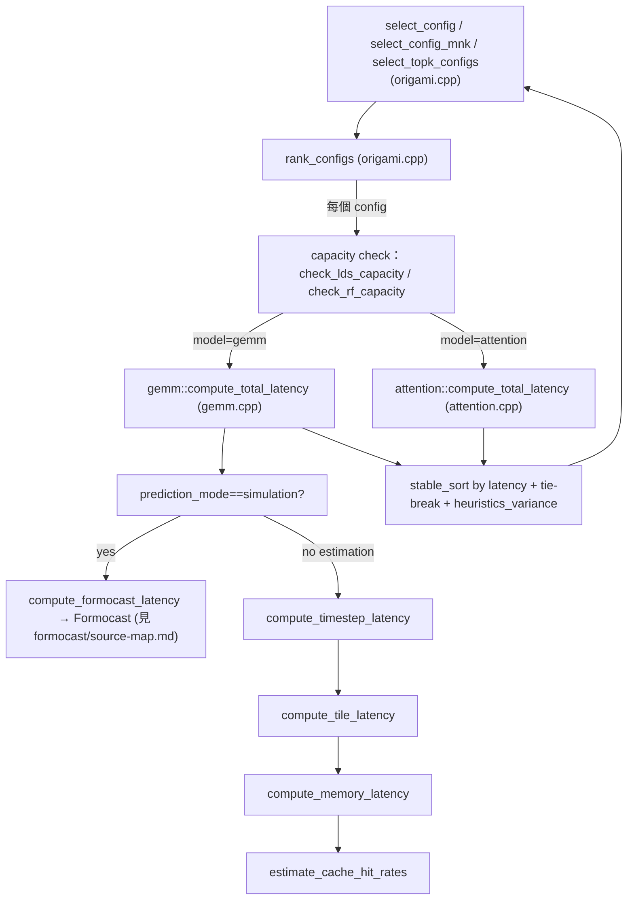

# Origami 原始碼對照整理：檔案 → 函式 → 呼叫圖 → 資料結構

> 路徑基準：本檔在 `study_docs/origami/`。連原始碼往上兩層：`../../shared/...`、`../../projects/...`；同目錄文件用檔名；formocast 子文件用 `formocast/xxx.md`。行號會隨 commit 漂移，對不上時以符號名稱為準。

## 白話總覽

其他文件（[README.md](README.md)、[latency-model.md](latency-model.md)、[api-and-usage.md](api-and-usage.md)…）帶你理解 Origami **怎麼運作、怎麼被呼叫**；這一份不同——它是一張**原始碼地圖**：告訴你「**哪個檔案做什麼、有哪些函式、彼此怎麼呼叫、資料結構在哪**」，讓你能快速跳到正確的檔案動手。

用比喻：前面幾份是「旅遊導覽（景點介紹）」，這份是「**捷運路線圖 + 站別索引**」。

這份文件的定位是**索引 + 補洞**：

- **索引**：把 origami core（非 formocast）的每個檔案、主要函式、呼叫關係串成一張表與一張圖。
- **補洞**：`attention.cpp` / `streamk.cpp` / `heuristics.cpp` 這幾個子系統，現有文件幾乎沒在原始碼層級解釋——這裡補上。
- **不重抄**：GEMM 延遲模型的公式內部（`compute_tile_latency` 那套）已在 [latency-model.md](latency-model.md) 講透；struct 欄位深表已在 [api-and-usage.md](api-and-usage.md)。本檔只給「入口 + 呼叫圖 + 位置」，深入處**連過去**。

> 範圍界線：origami library 分成 **core**（本檔）與 **formocast 模擬器**（另有專文）。formocast 是 core 的一個「更準的後端」，只有 `prediction_mode == simulation` 時才走；它自己的原始碼地圖在 [formocast/source-map.md](formocast/source-map.md)。

> 名詞小抄
> - **GEMM**：一般矩陣乘法 `D = op(A)·op(B)(+C)`，Origami 的主要建模對象。
> - **config / solution**：一組 kernel 參數選擇（tile 大小、MI、occupancy…）。
> - **latency**：模型預測的延遲（越小越快），選型就是比它。
> - **rank_configs**：Origami 的主引擎——對一堆候選 config 算 latency、排序。
> - **model_t**：要用哪個延遲模型（`gemm` 或 `attention`）。
> - **prediction_mode**：`estimation`（Origami 自己的快公式）或 `simulation`（轉呼 Formocast）。
> - **WGM / staggerU**：選完 tile 後，決定 workgroup 排法與 K 起點錯位的兩組後處理參數（為了 cache 局部性）。
> - **StreamK**：把 K 維切給多個 workgroup 再合併的排程法。

## 完整檔案版圖（origami core，共 ~8421 行）

### 實作 `src/origami/`（8 檔）

| 檔案 | 行數 | 角色一句話 |
|------|------|-----------|
| [origami.cpp](../../shared/origami/src/origami/origami.cpp) | 829 | **選型核心**：`select_config` / `rank_configs` / `select_topk_configs` / WGM / staggerU |
| [gemm.cpp](../../shared/origami/src/origami/gemm.cpp) | 2020 | GEMM 延遲模型 + `compute_total_latency`（simulation 時轉呼 Formocast） |
| [attention.cpp](../../shared/origami/src/origami/attention.cpp) | 721 | Flash attention 延遲模型（`model_t::attention`） |
| [streamk.cpp](../../shared/origami/src/origami/streamk.cpp) | 508 | StreamK grid / reduction / hybrid 選擇 |
| [heuristics.cpp](../../shared/origami/src/origami/heuristics.cpp) | 495 | per-arch/dtype heuristic 權重資料庫與查表 |
| [hardware.cpp](../../shared/origami/src/origami/hardware.cpp) | 336 | 硬體模型初始化、arch 常數、MI latency 查詢 |
| [logger.cpp](../../shared/origami/src/origami/logger.cpp) | 280 | debug logging（CSV 中間值）基礎設施 |
| [types.cpp](../../shared/origami/src/origami/types.cpp) | 124 | data type 轉換 util |

### 公開標頭 `include/origami/`（9 檔，共 3108 行）

| 檔案 | 行數 | 內容 |
|------|------|------|
| [types.hpp](../../shared/origami/include/origami/types.hpp) | 725 | 核心 struct/enum：`problem_t` / `config_t` / `tensile_params_t` / `prediction_result_t` / `data_type_t`… |
| [hardware.hpp](../../shared/origami/include/origami/hardware.hpp) | 808 | `hardware_t` class、`architecture_t`、MI latency 常數 `INSTRUCTION_MAP` |
| [gemm.hpp](../../shared/origami/include/origami/gemm.hpp) | 506 | GEMM 模型公開 API |
| [heuristics.hpp](../../shared/origami/include/origami/heuristics.hpp) | 369 | `heuristic_params_t` / `heuristic_key_t` / `heuristics_database_t` |
| [attention.hpp](../../shared/origami/include/origami/attention.hpp) | 249 | attention 模型公開 API |
| [origami.hpp](../../shared/origami/include/origami/origami.hpp) | 141 | **對外主 API**（`select_config` / `rank_configs`…） |
| [logger.hpp](../../shared/origami/include/origami/logger.hpp) | 121 | logging 巨集 |
| [streamk.hpp](../../shared/origami/include/origami/streamk.hpp) | 100 | StreamK API |
| [math.hpp](../../shared/origami/include/origami/math.hpp) | 89 | `ceiling_math` / `safe_ceil_div` / hashing 等小工具 |

### 其他

| 位置 | 角色 |
|------|------|
| [python/src/origami/bindings.cpp](../../shared/origami/python/src/origami/bindings.cpp)（498 行，67 個 `m.def`） | nanobind Python 綁定 |
| [python/src/origami/selector.py](../../shared/origami/python/src/origami/selector.py) | Python 高階 wrapper |
| [tests/](../../shared/origami/tests/)（~5296 行） | 各模組單元/迴歸測試 |
| [src/simulator/tensilelite/](../../shared/origami/src/simulator/tensilelite/) | **Formocast 模擬器**（另見 [formocast/source-map.md](formocast/source-map.md)） |

## 核心呼叫圖

**一句話串起來**：`select_config` 呼叫 `rank_configs`；`rank_configs` 對每個 config 先做 capacity check、再依 `model_t` 呼叫 gemm 或 attention 的 `compute_total_latency`、最後 `stable_sort` + tie-break 排名；gemm 這條若 `prediction_mode==simulation` 就岔去 Formocast，否則走 estimation 的 `compute_tile_latency → compute_memory_latency` 公式鏈。

## 逐檔導讀（file-by-file）

### origami.cpp — 選型核心

- **角色**：對外 API 的實作；把「一堆候選 → 排名/挑最好」這件事做完。
- **主要函式**（宣告見 [origami.hpp](../../shared/origami/include/origami/origami.hpp)）：
  - [select_config()](../../shared/origami/src/origami/origami.cpp#L797)：取 `rank_configs` 第一名。
  - [rank_configs()](../../shared/origami/src/origami/origami.cpp#L555)：主引擎——迴圈算 latency、`stable_sort`（[origami.cpp:609](../../shared/origami/src/origami/origami.cpp#L609)）、tie-break、依 `heuristics_variance` 在 top-N 內重排。
  - [select_config_mnk()](../../shared/origami/src/origami/origami.cpp#L772)：只給 M/N/K 的便捷版。
  - `select_topk_configs()`：回傳前 K 名。
  - [select_workgroup_mapping()](../../shared/origami/include/origami/origami.hpp#L62) / [select_staggerU()](../../shared/origami/include/origami/origami.hpp#L77)：選完 tile 後的後處理（WGM / staggerU）。
- **capacity check 先擋**：attention 走 `check_rf_capacity` + `check_lds_capacity`（[origami.cpp:576-583](../../shared/origami/src/origami/origami.cpp#L576-L583)）；gemm 走 `gemm::check_lds_capacity`（[origami.cpp:593](../../shared/origami/src/origami/origami.cpp#L593)）。放不下的 config 直接 `continue` 淘汰。
- **latency == max() 的哨兵**：`compute_total_latency` 回 `double::max()` 代表無效，該 config 不入排名（[origami.cpp:603](../../shared/origami/src/origami/origami.cpp#L603)）。
- **深入**：排序/tie-break/shortCircuit 的規則與 magic number → [latency-model.md](latency-model.md)。

### gemm.cpp — GEMM 延遲模型（入口 + 兩模式分派）

- **角色**：把「一個 GEMM config 要跑多久」算出來。本檔最大（2020 行），但**內部公式已在 latency-model.md 講透**，這裡只給入口與呼叫圖。
- **入口與分派**：
  - [compute_total_latency()](../../shared/origami/src/origami/gemm.cpp#L1844)：對所有 wave 加總延遲。
  - **simulation 岔路**：`if (config.prediction_mode == simulation) return compute_formocast_latency(...)`（[gemm.cpp:1858-1859](../../shared/origami/src/origami/gemm.cpp#L1858)）——這就是 Origami core 與 Formocast 的接點。轉接器 [compute_formocast_latency()](../../shared/origami/src/origami/gemm.cpp#L1938) 把 origami 型別轉成 Formocast 型別。
  - estimation 路徑：`compute_total_latency → `[compute_timestep_latency()](../../shared/origami/src/origami/gemm.cpp#L1769)` → `[compute_tile_latency()](../../shared/origami/src/origami/gemm.cpp#L1662)` → `[compute_memory_latency()](../../shared/origami/src/origami/gemm.cpp#L1379)` → `[estimate_cache_hit_rates()](../../shared/origami/src/origami/gemm.cpp#L1066)。
- **深入**：`max(compute, memory)`、prologue/epilogue、L2/MALL/DRAM 階層 → [latency-model.md](latency-model.md)；simulation 那條 → [formocast/source-map.md](formocast/source-map.md)。

### attention.cpp — Flash Attention 延遲模型（現有文件的補洞）

- **角色**：`model_t::attention` 時走的延遲模型；概念與 GEMM 類似但貼合 attention 的 Q/K/V 存取與 `q_heads`。
- **主要函式**（宣告見 [attention.hpp](../../shared/origami/include/origami/attention.hpp)）：
  - [compute_total_latency()](../../shared/origami/src/origami/attention.cpp)：attention 版總延遲（`rank_configs` 於 [origami.cpp:590](../../shared/origami/src/origami/origami.cpp#L590) 呼叫）。
  - [compute_cu_occupancy()](../../shared/origami/include/origami/attention.hpp#L44)：回傳 (active CUs, …) 四元組，估同時能塞多少 workgroup。
  - `check_rf_capacity()` / `check_lds_capacity()`：register file / LDS 放不放得下（capacity check 用）。
  - `compute_l2_hit_rate_global()`、`arithmetic_intensity()`、`compute_mt_compute_latency()`：與 GEMM 對應但為 attention 調整。
- **與 GEMM 的差異**：吃 `problem.q_heads`、Q/K/V 三個運算元的存取 pattern 不同、capacity check 多一層 RF（GEMM 只查 LDS）。
- **現況**：這是**目前唯一涵蓋 attention 原始碼的地方**；深入公式尚無專文，需要時直接讀原始碼。

### streamk.cpp — StreamK 排程選擇（補洞）

- **角色**：K 維切給多個 workgroup（StreamK）時，決定 grid 大小、reduction 策略、以及 SK3/SK4 hybrid 模式。
- **主要函式**（宣告見 [streamk.hpp](../../shared/origami/include/origami/streamk.hpp)）：
  - [compute_number_of_output_tiles()](../../shared/origami/include/origami/streamk.hpp#L47)：算輸出 tile 總數。
  - [select_grid_size()](../../shared/origami/include/origami/streamk.hpp#L73)：依 `grid_selection_t` 策略（`k_split_aware` / `data_parallel` / `analytical`…，見 [types.hpp](../../shared/origami/include/origami/types.hpp)）選 grid。
  - [select_reduction()](../../shared/origami/include/origami/streamk.hpp#L58)：選 `reduction_t`（`spinlock` / `tree` / `parallel` / `atomic`）。
  - [select_hybrid_mode()](../../shared/origami/include/origami/streamk.hpp#L94)：`hybrid_mode_t`（`static_` / `dynamic`），SK3/SK4 混合。
- **誰呼叫**：hipBLASLt 於 launch 參數階段呼叫（見 [hipblaslt-integration.md](hipblaslt-integration.md) 接觸點 2）。

### heuristics.cpp — 校正權重資料庫（補洞）

- **角色**：延遲模型的公式帶「權重」，這些權重依 (架構, dtype, 問題形狀) 不同。本檔就是那個查表資料庫，外加 hand-optimized kernel 的直接覆寫。
- **主要型別**（見 [heuristics.hpp](../../shared/origami/include/origami/heuristics.hpp)）：
  - [heuristic_params_t](../../shared/origami/include/origami/heuristics.hpp#L117)：一組 ~35 個權重（compute / memory / L1/L2/MALL / prologue / epilogue / loop overhead…），可 `merge_with` 疊加。
  - [heuristic_key_t](../../shared/origami/include/origami/heuristics.hpp#L183)：帶 wildcard 的查表鍵，配 specificity 分數（越具體越優先）。
  - [heuristics_database_t](../../shared/origami/include/origami/heuristics.hpp#L275)：singleton（`get_instance()`），提供 hand-optimized 的 O(1) 查表 + 一般規則的線性 fallback（[lookup()](../../shared/origami/include/origami/heuristics.hpp#L290)）。
- **怎麼命中**：`get_heuristic_params(problem, hardware, config)`（[heuristics.hpp:338](../../shared/origami/include/origami/heuristics.hpp#L338)）→ 用 `make_hand_optimized_kernel_key` / `make_tile_key` / `make_arch_dtype_key` 組鍵查表，命中的權重 merge 進 default。
- **開關**：是否套 heuristics 由 [runtime_options](../../shared/origami/include/origami/types.hpp)（`heuristics_enabled` / `heuristics_variance`）控制。
- **深入**：權重如何影響公式（magic number）→ [latency-model.md](latency-model.md)。

### hardware.cpp / hardware.hpp — 硬體模型與 arch 常數

- **角色**：把「這是哪顆 GPU」變成一組數字（CU 數、cache 容量、頻寬比、XCD 數、MI latency…）餵給模型。
- **主要函式**（見 [hardware.cpp](../../shared/origami/src/origami/hardware.cpp)）：
  - [get_hardware_for_arch()](../../shared/origami/src/origami/hardware.cpp) / [get_hardware_for_device()](../../shared/origami/src/origami/hardware.cpp#L139)：由架構列舉或 HIP device 取得 `hardware_t`。
  - `get_valid_matrix_instructions()` / `get_recommended_matrix_instruction()` / `get_mi_latency()`：查 `INSTRUCTION_MAP`（每 arch × MI 尺寸的實測 cycle）。
  - `has_MALL()` / `has_native_TF32()`：能力查詢。
- **支援架構**：`architecture_t` 列舉含 gfx90a/942/950/1100/115x/1201/1250（見 [hardware.hpp](../../shared/origami/include/origami/hardware.hpp)）。
- **深入**：新架構填常數 SOP、arch 常數欄位、per-GPU 範例 → [debugging-and-calibration.md](debugging-and-calibration.md)。

### types.cpp / types.hpp — 核心型別

- **角色**：定義 Origami 全域用的 struct/enum，`types.cpp` 只放 data type 轉換 util（`datatype_to_bits`、`string_to_datatype`…）。
- **核心 struct 位置**（欄位深表 → [api-and-usage.md](api-and-usage.md)）：
  - `problem_t`（M/N/K/batch/dtype/transpose/q_heads）、`config_t`（tile/MI/occupancy/prediction_mode/backend…）、`tensile_params_t`（TensileLite 專屬：depth_u/global_split_u/prefetch_global_read/**math_clocks_unrolled_loop**…）、`prediction_result_t`（latency + config）。
  - enums：`data_type_t` / `model_t` / `prediction_modes_t` / `transpose_t` / `grid_selection_t` / `reduction_t` / `target_t`。
- **重點細節**：`config.tensile()`（[config_t 的 accessor](../../shared/origami/include/origami/types.hpp)）回傳 `tensile_params_t`——其中 `math_clocks_unrolled_loop` 就是 Formocast Path B 回填的那個數字（見 [formocast/cycle-accurate-path.md](formocast/cycle-accurate-path.md)）。

### logger.cpp / logger.hpp — debug 記錄

- **角色**：把模型中間值（cache 命中率、L_mem、L_compute…）倒成 CSV，供驗證/校正。
- **開關**：環境變數 `ANALYTICAL_GEMM_DEBUG=1` + `ORIGAMI_LOG_FILE=*.csv`（用法 → [api-and-usage.md](api-and-usage.md)、[debugging-and-calibration.md](debugging-and-calibration.md)）。巨集見 [logger.hpp](../../shared/origami/include/origami/logger.hpp)（`OLOG_DEBUG` 等）。

### math.hpp — 共用小工具

- `ceiling_math`、`safe_ceil_div`、hashing 等；被 gemm/origami/formocast 各處引用。見 [math.hpp](../../shared/origami/include/origami/math.hpp)。

## 函式索引（快查表）

| 函式 | 檔案 | 一句話用途 |
|------|------|-----------|
| [select_config](../../shared/origami/src/origami/origami.cpp#L797) | origami.cpp | 選最快的一個 config |
| [rank_configs](../../shared/origami/src/origami/origami.cpp#L555) | origami.cpp | 對候選算 latency 並排名（主引擎） |
| [select_config_mnk](../../shared/origami/src/origami/origami.cpp#L772) | origami.cpp | 只給 M/N/K 的便捷選型 |
| [select_workgroup_mapping](../../shared/origami/include/origami/origami.hpp#L62) | origami.cpp | 選 WGM 後處理參數 |
| [select_staggerU](../../shared/origami/include/origami/origami.hpp#L77) | origami.cpp | 選 staggerU 後處理參數 |
| [compute_perf_gflops](../../shared/origami/include/origami/origami.hpp#L137) | origami.cpp | latency → GFLOPS |
| [gemm::compute_total_latency](../../shared/origami/src/origami/gemm.cpp#L1844) | gemm.cpp | GEMM 總延遲（含 simulation 岔路） |
| [compute_tile_latency](../../shared/origami/src/origami/gemm.cpp#L1662) | gemm.cpp | 單一 K-complete tile 延遲 |
| [compute_memory_latency](../../shared/origami/src/origami/gemm.cpp#L1379) | gemm.cpp | L1/L2/MALL/DRAM 記憶體成本 |
| [estimate_cache_hit_rates](../../shared/origami/src/origami/gemm.cpp#L1066) | gemm.cpp | 快取命中率估計 |
| [compute_formocast_latency](../../shared/origami/src/origami/gemm.cpp#L1938) | gemm.cpp | 轉接到 Formocast 模擬器 |
| [attention::compute_total_latency](../../shared/origami/include/origami/attention.hpp) | attention.cpp | attention 總延遲 |
| [compute_cu_occupancy](../../shared/origami/include/origami/attention.hpp#L44) | attention.cpp | attention 的 CU occupancy 估計 |
| [select_grid_size](../../shared/origami/include/origami/streamk.hpp#L73) | streamk.cpp | StreamK grid 大小 |
| [select_reduction](../../shared/origami/include/origami/streamk.hpp#L58) | streamk.cpp | StreamK reduction 策略 |
| [select_hybrid_mode](../../shared/origami/include/origami/streamk.hpp#L94) | streamk.cpp | StreamK SK3/SK4 hybrid |
| [heuristics_database_t::lookup](../../shared/origami/include/origami/heuristics.hpp#L290) | heuristics.cpp | 依 (arch,dtype,shape) 查權重 |
| [get_hardware_for_device](../../shared/origami/src/origami/hardware.cpp#L139) | hardware.cpp | 由 device 取 hardware_t |

## Python bindings 對照

- **綁定層**：[bindings.cpp](../../shared/origami/python/src/origami/bindings.cpp)（498 行，67 個 `m.def`）用 nanobind 把 C++ 函式與型別暴露到 Python。
- **暴露的型別**：`architecture_t` / `data_type_t` / `dim3_t` / `dim4_t` / `problem_t` / `config_t` / `tensile_params_t` / `hardware_t` / `prediction_result_t` / `workgroup_mapping_t` / `staggerU_t`…（`.def(nanobind::init<>())` 建構、`.def(...)` 綁欄位/方法）。
- **暴露的函式**：核心 `select_config` / `rank_configs` / `select_topk_configs` / `select_workgroup_mapping` / `select_staggerU` / `compute_perf_gflops`；StreamK `select_grid_size` / `select_reduction` / `compute_number_of_output_tiles`；GEMM 延遲各層與 attention 各層（前綴命名）；hardware `get_hardware_for_device/arch`、`datatype_to_*`。
- **高階 wrapper**：[selector.py](../../shared/origami/python/src/origami/selector.py) 提供更 Pythonic 的選型介面；Python 端 dtype 對應也在此層。
- **範例用法** → [api-and-usage.md](api-and-usage.md) 的 Python 範例。

## 擴充點（要改功能時去哪）

- **新增一個延遲模型**（如加一種 workload）：在 `model_t`（[types.hpp](../../shared/origami/include/origami/types.hpp)）加列舉 → 在 [rank_configs 的分派](../../shared/origami/src/origami/origami.cpp#L575-L600) 加分支 → 實作 `xxx::compute_total_latency`（仿 attention.cpp）。
- **新增一個架構**：填 [hardware.cpp](../../shared/origami/src/origami/hardware.cpp) 的 arch 常數與 `INSTRUCTION_MAP`；若需要，補 [heuristics.cpp](../../shared/origami/src/origami/heuristics.cpp) 的 per-arch 權重。SOP → [debugging-and-calibration.md](debugging-and-calibration.md)。
- **接更準的後端**：estimation → simulation 的岔路在 [gemm.cpp:1858](../../shared/origami/src/origami/gemm.cpp#L1858)；Formocast 的擴充點見 [formocast/source-map.md](formocast/source-map.md)。

## 交叉連結

- 生態定位、何時用 Origami / Formocast → [ecosystem-and-formocast.md](ecosystem-and-formocast.md)
- 延遲模型公式內部（gemm.cpp 深入）→ [latency-model.md](latency-model.md)
- API 與 struct 欄位深表 → [api-and-usage.md](api-and-usage.md)
- hipBLASLt 怎麼呼叫 Origami → [hipblaslt-integration.md](hipblaslt-integration.md)
- 除錯與新架構校準 → [debugging-and-calibration.md](debugging-and-calibration.md)
- Formocast（simulation 後端）原始碼地圖 → [formocast/source-map.md](formocast/source-map.md)
- 起步總覽 → [README.md](README.md)

## 一句話總結

> **Origami core 約 8421 行、分散在 8 個 .cpp + 9 個 .hpp：`origami.cpp` 是選型引擎（`rank_configs`），依 `model_t` 分派給 `gemm.cpp` 或 `attention.cpp` 的 `compute_total_latency`，gemm 這條在 `prediction_mode==simulation` 時岔去 Formocast；`streamk.cpp`/`heuristics.cpp`/`hardware.cpp` 分別管排程/權重/硬體常數。** 深入公式看 [latency-model.md](latency-model.md)、欄位看 [api-and-usage.md](api-and-usage.md)、simulation 後端看 [formocast/source-map.md](formocast/source-map.md)。
