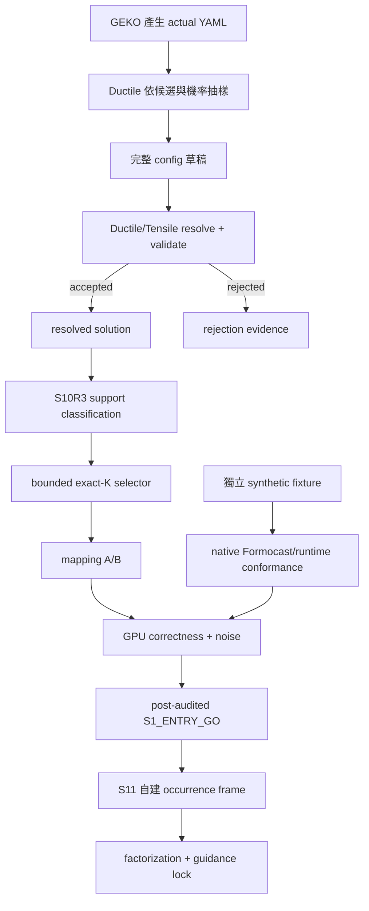

# Ductile Factorized Guidance 實驗白話導讀與問答

> **文件角色：**這是一份給第一次閱讀者使用的白話導讀與 FAQ，目的是方便在同一份文件上持續討論實驗設計。它不是 experiment authority，也不會取代正式的 charter、experiment plan、checkpoint design、lock 或 report。
>
> **衝突處理：**若本文件和正式文件衝突，以 [research charter](surrogate-dse-plan.md)、[experiment plan](ductile-origami-warmstart-experiment-plan.md)、[active checkpoint index](ductile-origami-warmstart/README.md) 及各 checkpoint design 為準。
>
> **歷史快照：**本文件 §§1–22 最初依據 2026-07-29 的 S10R2 狀態整理，當時 HEAD 是 `51c7667212bf40f0e893fc026ee65450d06d72ff`（`study: reseal S10R2 pre-evidence lock`）。S10R2 後來以 inconclusive／edge null 結束，S10R3 成為新的 active entry successor。
>
> **2026-08-01 補充：**§23 的 S10R3 專題問答依當日 committed design 與實作整理。Live chunk 數與 process 狀態會持續改變，因此本導讀不把暫時數字寫成 durable result；最新狀態仍須對照 [active checkpoint index](ductile-origami-warmstart/README.md)、formal artifacts 與 Git history。

---

## 1. 先用一分鐘理解整個研究

Formocast 可以看一整組 kernel 參數，預測這組 config 可能有多快。

Ductile 的 Gen0 初始化介面卻不是直接接收：

> 「請多抽這個完整 config。」

它主要接收的是：

> 「這個 gene 的每個候選值，各自應該多常被抽到。」

因此研究要做的事是：

```text
Formocast 對 whole config 的評分
    ↓
factorization
    ↓
每個 residual gene value 的抽樣偏好
    ↓
Ductile Gen0 initial population
    ↓
真實 GPU 品質判斷
```

核心問題是：

> 把 whole-config 訊號拆成 per-gene probabilities 後，還剩多少真正有用的資訊？

如果有用，再繼續問：

1. 離線 ranking 是否真的對準高品質 configs？
2. 這個 prior 經過 validity filter、去重及有限 population 後，是否仍能改善 Gen0？
3. Gen0 優勢是否能保留到固定 10 generations？
4. 同一方法能否在兩個新 held-out regimes 重現？
5. 若 Formocast predictor 失敗但 factorization oracle 仍有效，learned residual 能否補救？

這是一個 **stage-gated mechanism study**，不是完整 tuning speedup 或 production deployment 專案。

---

## 2. 目前最重要的結論

### 已經有正式科學結果

- **S00：positive**
  - 證明 evidence、lock、lineage、observer、checkpoint/resume 等 CPU-only 實驗基礎可信。
  - 不證明任何 GPU、Formocast 或 kernel performance 結果。
- **S10：negative**
  - 正確且可重現地得到 `S1_ENTRY_BLOCKED / FT-BLOCKED-MAPPING / edge=null`。
  - 只證明原始 S10 mapping boundary 不能通過，不證明 Formocast 沒有效。

### 已取消的嘗試

- **S10R1**
  - 因 nominal boundary selector、超長 valid-support 搜尋、ledger scaling 與治理成本偏離核心研究問題，在 A32 被取消。
  - 狀態是 `cancelled / BLOCKED / not_evaluated / edge=null`。
  - 不是 negative，也不是 inconclusive。
  - A33 已把約 34 GB bulk diagnostics 和 19 個舊 implementation paths 退休，只保留 identity tombstone。

### 已完成但沒有下游 edge 的 recovery

- **S10R2：inconclusive**
  - 依 frozen exact-ten criterion 完成 closeout。
  - 正式狀態是 `CHECKPOINT_COMPLETE / inconclusive / FT-INCONCLUSIVE / edge=null`。
  - 沒有啟動 S11。
  - S10R2 outcome artifacts 不得改作 S10R3 或 S11 formal evidence。

### 目前 active 的入口設計

- **S10R3**
  - 延續 support-aware entry，但改用 bounded deterministic exact-K corpus。
  - `K = max(10, C_greedy)`，且 `K <= 20`。
  - 先確認 Ductile 實際接受哪些 candidate values，再用最多 20 個 fresh configs 覆蓋 mandatory witnessed atoms。
  - 只有 post-audited `S10R3:S1_ENTRY_GO` 可以啟動 S11。

### 目前還沒有的科學結果

截至 2026-08-01 本次補充所查到的 committed projection：

- S10R3 尚未有 committed terminal scientific outcome。
- S11 仍需等待 post-audited `S10R3:S1_ENTRY_GO`。
- 本文件中的 live observations 不得冒充 committed result。
- S11–S41 尚未因 S10R3 取得新的正式下游 edge。

---

## 3. 完整 checkpoint 主線

```text
S00  Evidence foundation                     已完成 positive
  ↓
S10  原始 Stage-1 entry                      已完成 negative，edge=null

S10R1 舊 recovery                            已取消，不提供科學 edge
  ⋮ administrative / historical only

S10R2 support-aware entry                    已完成 inconclusive，edge=null
  ⋮ historical only

S10R3 bounded-cover support-aware entry      active entry checkpoint
  │ S1_ENTRY_GO
  ↓
S11  model-only factorization / guidance lock
  │ S1_GUIDANCE_LOCKED
  ↓
S12  real-score ranking / prior-mass / oracle audit
  │ D5_PASS
  ↓
S13  actual Gen0 mechanism
  │ D6_MECHANISM_POSITIVE
  ↓
S20  fixed-H10 persistence
  │ S2_DIRECTIONAL_PERSISTENCE_POSITIVE
  ↓
S30  held-out registry / procedure freeze
  │ S3_REGISTRY_PROCEDURE_LOCKED
  ↓
S31  two-cluster bounded replication

條件分支：
S12 predictor-specific failure + oracle positive ─┐
                                                   ├→ S40 → S41
S31 predictor heterogeneity + oracle positive ─────┘
```

只有 post-audited `S10R3:S1_ENTRY_GO` 可以啟動 S11。

---

## 4. 基礎名詞

### 4.1 Whole config

一個 whole config 是一整組 kernel 參數，例如：

```text
{
  group_0: candidate_157,
  DepthU: 64,
  PrefetchGlobalRead: 2,
  WorkGroupMapping: 8,
  DirectToVgprA: false,
  ...
}
```

Formocast 的輸入是這種完整 config 加上 problem size、hardware 等資訊，不是單一 DepthU。

### 4.2 Gene 與 gene value

在 GA 的語境裡：

- gene：一個可調 search-space key；
- gene value：這個 key 的其中一個候選值。

例如：

```text
gene       = DepthU
gene values = [32, 64, 128, 256, 512, 1024]
```

一個 config 就像一條 chromosome，由每個 gene 選出的一個 value 組成。

### 4.3 Group

YAML 中有些參數不是獨立抽樣，而是綁成一整包。

例如一個 grouped candidate 可能同時帶有：

- MatrixInstruction；
- WorkGroup；
- GlobalSplitU；
- MIArchVgpr；
- 其他 tile/solution fields。

Ductile 會把這一整包視為一個 categorical key，例如 `group_0`，一次選一整包，而不是把裡面的欄位拆開抽。

目前 actual YAML 的 `group_0` 有 9,918 個 expanded candidates。

### 4.4 Weight、probability 與 guidance

Ductile 本來就有 generic weighted-sampling 機制。

YAML 若替某個 key 提供 weight vector，Ductile 會轉成 probabilities：

```text
probability ∝ exp(-weight_beta × (weight - minimum_weight))
```

因此：

- weight 越小，通常越常被抽；
- weight 越大，通常越少被抽。

沒有 weight 的 key 使用 uniform sampling。

目前 actual YAML 主要替 `group_0` 提供 9,918 個 weights。這些 problem-dependent weights 是既有的 GEKO/YAML guidance。

「Guidance」在這裡不是保證正確，而是一個非均勻 prior：

> 在尚未做真實 GPU benchmark 前，先告訴 sampler 哪些候選較值得優先嘗試。

### 4.5 Existing guidance

Existing guidance 指 Formocast 介入前，YAML 已經提供的 groups、candidate order 與 weights。

研究明確保護它們：

- 不拆 group；
- 不重排 candidates；
- 不覆蓋 existing weights；
- 不把 group 內欄位再當成獨立 residual genes。

### 4.6 Residual gene

Residual gene 不是「模型殘差」。

它表示：

> 扣掉 existing grouped/weighted guidance 後，剩下尚未被 guidance 處理的可調參數。

一個 gene 要成為 residual guidance 候選，至少必須：

- ungrouped；
- currently unweighted；
- frozen free；
- 有兩個以上候選值；
- mapping 完整；
- support classification 足夠完整。

例如 DepthU 在 actual YAML 中是 ungrouped ForkParameter，且沒有自己的 weight vector，所以它可能是 residual gene。

但如果 S10R2 對 DepthU 的任一 value 只能得到 `support_unobserved` 或 `support_proven_absent`，整個 DepthU gene 就不能進 S11 guidance，仍維持原本 baseline sampling。

### 4.7 Factorization

Factorization 是把：

> 這個完整 config 的 Formocast score

轉成：

> 在其他參數變動時，某個 gene value 平均是否比較有利。

例子：

```text
DepthU=32  出現在很多完整 configs 中 → 平均 model benefit 0.42
DepthU=64  出現在很多完整 configs 中 → 平均 model benefit 0.71
DepthU=128 出現在很多完整 configs 中 → 平均 model benefit 0.58
DepthU=256 出現在很多完整 configs 中 → 平均 model benefit 0.31
```

再把這些平均 benefit 轉成 per-value probabilities。

真正的風險是：效能可能依賴多個參數的交互作用。Factorization 只留下每個 value 的平均效果，可能丟失「DepthU=64 只有搭配某些 MacroTile 才好」的資訊。

### 4.8 Gen0

Gen0 不是 weight。

Gen0 是依 probabilities 抽出的初始完整 configs 集合：

```text
weights
  ↓
probabilities
  ↓
validity filter + dedup + population fill
  ↓
Gen0 initial population
```

它發生在 crossover、mutation、selection/survival 之前。

實驗 requested population size 是 64，但 Ductile constructor 可能依最大 categorical key 擴大 resolved `P0`。正式執行必須記錄實際 `P0`，不能用 nominal 64 假設成本。

### 4.9 Canonical config

Canonical config 是：

> 用固定規則序列化、排序與 hash 的完整 config。

相同語意的 config，即使 Python dict key order 不同，也必須得到相同 canonical bytes 和 SHA-256。

Canonicalization 通常包括：

- 把 numpy／bool／int／list／dict 轉成固定 plain representation；
- 固定 key order；
- 固定 JSON encoding；
- 禁止 NaN／Inf；
- 對固定 bytes 計算 SHA-256。

Canonical 不表示「最好」或「預設」。它的功能是：

- 去重；
- 穩定識別；
- 跨 mapping、correctness、noise、benchmark join；
- 防止中途替換候選；
- 讓 verifier 可重現。

「10 個 canonical configs」表示依預鎖 deterministic 規則選出的 10 個不同合法 configs，並固定它們的 identity。

---

## 5. Ductile 實際建立 Gen0 的流程

### Step 1：解析 YAML

讀入：

- problem type；
- sizes；
- ForkParameters；
- Groups；
- candidate order；
- weights；
- validation 設定。

### Step 2：建立 SearchSpace

每個 search-space key 可能是：

- ungrouped gene，例如 DepthU；
- grouped categorical key，例如 `group_0`。

SearchSpace 內部先保存 candidate indices，再用 map 轉回實際 values。

### Step 3：weights 轉 probabilities

有 weight vector 的 key：

```text
p = exp(-weight_beta × normalized_weight)
p = p / sum(p)
```

沒有 weight 的 key：

```text
uniform
```

### Step 4：解析 initial population size

GA 先接收 requested `pop_size`，再依 search-space cardinality 決定 resolved population。

如果最大 key 的候選數比 requested population 大，Ductile 可能增加 early-generation population。

### Step 5：Nominal draw

每次抽樣為每個 key 選一個 index：

```text
group_0             選一個 candidate
DepthU              選一個 value
PrefetchGlobalRead  選一個 value
WorkGroupMapping    選一個 value
...
```

這形成一個 nominal full config。

### Step 6：valid_fn

SearchSpace 將 indices 轉成實際 values，呼叫 `valid_fn(full_config)`。

- `true`：保留；
- `false`：丟棄並繼續抽。

### Step 7：去重與填滿 population

合法 config 仍可能被重複抽到。

Ductile 使用 `IndividualSet` 去重，直到收集足夠多不同合法 configs，或到達 max iterations。

### Step 8：形成 Gen0

收集到的合法且不重複完整 configs 形成 initial population。

### Step 9：評估

將 configs 交給 evaluator：

- generate kernel；
- compile；
- correctness；
- GPU benchmark；
- 計算 fitness。

### Step 10：後續世代

若 `n_gen > 1`，才繼續：

- survival；
- selection；
- mating；
- mutation；
- 下一代評估。

---

## 6. Nominal space、valid support 與 operational Gen0

### 6.1 Nominal search space

YAML 中所有候選值的 Cartesian product：

```text
NominalSpace
= 所有 YAML candidate combinations
```

YAML 列出某個 value，只表示它是名義候選，不保證它能和其他 values 組成合法 solution。

### 6.2 Valid support

```text
ValidSupport
= { x ∈ NominalSpace | valid_fn(x) == true }
```

它是 nominal space 中 Ductile 真正可能接受的子集合。

組合可能因以下原因失效：

- MacroTile／WorkGroup 不相容；
- DepthU 與 K／MatrixInstruction 不相容；
- vector width 不符合資料排列；
- LDS／VGPR／occupancy 限制；
- GSU／LSU／prefetch 約束；
- dtype／transpose／architecture 限制；
- solution resolution 無法完成。

### 6.3 `pi_nominal`

YAML 和 weights 定義的原始抽樣分布，尚未考慮 validity。

### 6.4 `pi_valid`

```text
pi_valid(x)
= pi_nominal(x | valid_fn(x)=true)
```

也就是從 nominal distribution 抽樣後，只看被 validator 接受的 occurrences。

Validity rejection 會改變實際 frequencies。即使兩個 values 的 nominal probability 相同，如果其中一個 value 幾乎都搭配成無效 config，它在 valid support 中就很少出現。

### 6.5 `Pi_gen0,P0`

真正 Gen0 不是 P0 個完全獨立的 `pi_valid` draws，因為還有：

- duplicate removal；
- population fill；
- max iterations；
- fallback sampling；
- joint population effects。

所以研究分開處理：

- 用 `pi_valid` 建 model marginals；
- 用 exact `SearchSpace.sample(P0)` replay 看 operational sampler；
- 用正式 Gen0 populations 測真實 endpoint。

---

## 7. S10R2：第一版 support-aware entry（歷史設計）

本節保留 S10R2 的核心概念作歷史背景。Current successor S10R3 保留 support 三態與固定
discovery 原則，但把 exact-ten selector 改成最多 20 筆的 bounded exact-K。差異與後續用途
整理在 §23 的 S10R3 專題問答；正式規則以
[S10R3 design](ductile-origami-warmstart/s10r3-stage1-bounded-cover-entry-recovery-design.md)
為準。

### 7.1 為什麼不再強迫所有名義邊界？

舊 S10R1 固定 `DepthU=1024` 後跑了大量 draws 仍沒有 accepted config。

這不證明 1024 不存在，但顯示：

- YAML candidate 不等於 valid-support member；
- 強迫每個 extreme value 成為 mapping gate，可能讓整個研究卡在一個幾乎不可達的值；
- 研究會偏離「Formocast factorization 是否有用」的核心問題。

### 7.2 三態 support classification

每個 candidate value只能是：

#### `supported_witnessed`

至少一個包含該 value 的完整 config 通過同一 validator，並保存完整 witness/provenance。

#### `support_unobserved`

在固定抽樣 schedule 中沒有看到 witness，但沒有 complete proof。

這只能表示：

> 本次沒有觀察到。

不能表示：

> 這個 value 不存在。

#### `support_proven_absent`

只有以下證據才能成立：

- finite exhaustive enumeration；
- sound constraint proof；
- independently validated complete equivalent proof。

### 7.3 對 residual gene 的影響

若一個 residual gene 有任何 value 不是 `supported_witnessed`：

- 整個 gene 不允許進 S11 guidance；
- baseline YAML semantics 不變；
- 不阻止 support 完整的其他 genes；
- 不因單一 extreme value自動阻擋 entry。

### 7.4 固定 discovery schedule

- chunk size：512 draws；
- global：固定 32 chunks／16,384 draws；
- global 不可 early stop；
- global 完成後，從 sealed diagnostic registry 中挑前 15 個仍 unobserved targets；
- 每個 conditional target 固定 32 chunks／16,384 draws；
- conditional 也不可 early stop或延長；
- 總上限：512 chunks／262,144 draws；
- 第 6 個 global chunk、3,072 draws 是第一次 resource reforecast boundary。

### 7.5 Candidate atom registry

第一筆 formal draw 前，L0 要固定每一個 candidate value 的：

- deterministic atom ID；
- exact typed value；
- value hash；
- YAML pointer/blob；
- grouped／ungrouped；
- weighted／unweighted；
- source symbol/blob；
- diagnostic role；
- conditional priority。

S10R2 registry 目前有：

- 30 ordered axes；
- 10,024 candidate rows；
- 101 prelocked residual candidate atoms；
- 107 conditional diagnostic atoms。

### 7.6 Exact-ten corpus

Mandatory mapping atoms只能是：

```text
prelocked_candidate_atoms ∩ supported_witnessed
```

再由 deterministic greedy set-cover 選 exact 10 distinct config hashes。

規則包括：

- 最大化新增 mandatory coverage；
- 固定 first-occurrence order；
- 固定 config-hash tie-break；
- 少於 10 witnesses則 inconclusive；
- 需要超過 10 configs才能 cover 也 inconclusive；
- 不得第 11 筆；
- 不得 replacement；
- 不得用 Formocast／GFLOPS 挑選。

### 7.7 Mapping

Exact ten × 3 sizes，執行 A/B 兩次：

```text
10 configs × 3 sizes × 2 passes = 60 mapping rows
```

要求：

- 30/30 每 pass 完整；
- A/B byte/semantic parity；
- required fields 有 provenance；
- 不猜 occupancy、effective GSU 等 metadata；
- mapping failure = 0；
- 不替換 config。

### 7.8 Sentinel/helper conformance

Random exact-ten corpus不必碰巧命中 sentinel。

另用固定 synthetic whole-cohort fixture，直接驗證：

- pinned native `Formocast::predictedPerformance()`；
- pinned `SolutionIterator::checkSolution`；
- pinned `AllSolutionsIterator::preProblem` queue path；
- exact early-terminate pair；
- guard order；
- stable sort；
- threshold index/value；
- queue prefix。

### 7.9 GPU correctness與noise

Exact-ten 按 hash 排序，index 0、4、9 是 anchors。

先跑：

```text
3 anchors × 3 sizes = 9 correctness cells
```

全部通過後再跑：

```text
3 anchors × 3 sizes × 7 repeats = 63 noise cells
```

目標：

```text
config-level repeat CV P95 <= 0.5%
```

### 7.10 S10R2 outcome

- 全部通過：`positive / S1_ENTRY_GO -> S11`
- Mapping 可重現失敗：`negative / FT-BLOCKED-MAPPING`
- Generate/compile/smoke/correctness 失敗：`negative / FT-BLOCKED-CORRECTNESS`
- Support／exact-ten／noise 不足：`inconclusive / FT-INCONCLUSIVE`
- Harness/schema/native helper 缺陷：`CHANGES_REQUIRED / not_evaluated`
- Resource preflight 不通過：operational `BLOCKED / not_evaluated`

---

## 8. S11：Factorization 與 guidance lock

S11 是真正執行 factorization 的 checkpoint。

### 8.1 Global valid-occurrence frame

- 最多 8,192 accepted occurrences；
- duplicate occurrences 保留；
- 4,096 後只有所有 stability 條件都成立才能停止；
- dedup 只用來減少 mapping/Formocast 重算，analysis 時恢復 multiplicity。

### 8.2 Conditional top-up

對每個 eligible `(gene, value)`：

- 固定該 value；
- 其他 keys 按 nominal probabilities 抽；
- 通過同一 valid_fn；
- minimum 128 accepted；
- precision不足可到 256；
- 仍不足則該 gene 維持 uniform。

### 8.3 Model benefit

對每個完整 config，將 Formocast latency 轉成 percentile rank，再轉成 benefit：

```text
r_s(x) = latency percentile rank
b_s(x) = 1 - r_s(x)
```

再依 actual reduce function 聚合 sizes。

### 8.4 Shrinkage conditional mean

概念公式：

```text
mu_gv
= (該 value 的 benefit 總和 + alpha × global mean)
  / (support 數 + alpha)

alpha = 32
```

Shrinkage 避免小樣本 value 因偶然高分得到極端權重。

### 8.5 Gene eligibility

一個 gene 要接受 guidance，需同時滿足：

- 每 value support ≥128；
- model coverage ≥95%；
- sensitivity `S_g ≥ 0.05`；
- 2,000 次 permutation 勝過 null P95；
- 2,000 次 bootstrap 半寬 ≤0.025；
- best/worst pair 重現率 ≥90%；
- 至少 2/3 sizes 方向一致。

### 8.6 Probability construction

```text
epsilon = 0.20
alpha = 32
```

最終 probability 可理解成：

```text
20% uniform exploration
+ 80% Formocast preference
```

所有 guided genes 共用 global lambda，且 normalized entropy 必須 ≥0.80。

### 8.7 轉回 Ductile weights

研究先產生想要的 probability：

```text
p_g(v)
```

再轉成 Ductile 可接受的 cost weight：

```text
w_g(v) = -log(p_g(v)) / weight_beta
```

經 Ductile 自己的 weight→probability conversion 後，必須 round-trip 回原本的 probability。

---

## 9. Same-entropy shuffled control

### 9.1 為什麼需要？

如果 Formocast prior 比 uniform 更集中，F 勝 G 可能只是因為：

- search space 變集中；
- diversity 改變；
- duplicates 改變；
- 更常反覆抽少數 configs。

不一定表示 Formocast 把高機率放到正確 values。

### 9.2 機制

假設 F：

```text
Values: A    B    C    D
F:      55% 25% 15% 5%
```

S 使用完全相同的 probability multiset，但重新貼 labels：

```text
Values: A    B    C    D
S:      15% 55% 5%  25%
```

因此 F、S 有相同：

- entropy；
- concentration；
- epsilon floor；
- cardinality；
- guided gene 數；
- existing group weights。

唯一主要差別是：

- F：高機率放在 Formocast 認為好的 values；
- S：相同機率被 deterministic non-identity permutation 打亂。

Shuffle 必須在 real GFLOPS 前鎖定，不能看結果後挑一個特別差的 shuffle。

### 9.3 解讀

- F > G 且 F > S：有證據支持 Formocast 方向。
- F > G 但 F ≈ S：可能只是 concentration/entropy effect。
- F ≤ S：Formocast 沒證明比亂貼 labels 更好。
- F、S、G 都接近：可能 residual effect 很小、existing guidance 已飽和，或 validity/dedup 把差異洗掉。

Nominal entropy 相同不保證 realized population entropy 完全相同，因此還要報 validity、duplicates、realized frequencies 與 diversity。

---

## 10. S12：Real-score D5 audit

S12 是第一個正式用 real GPU labels 判斷 Formocast/factorization 的核心 checkpoint。

### 10.1 測量

- 256 unique configs；
- 3 sizes；
- 768 config×size observations；
- 分析單位仍是 config，不把 768 rows 當獨立樣本。

### 10.2 Metrics

- design-weighted Spearman；
- real top-decile cutoff；
- top-decile overlap/lift；
- arm-specific real-top-decile prior mass；
- importance ESS；
- coverage/rejection；
- cross-fitted oracle。

### 10.3 `D5_PASS`

全部要求：

- coverage/rejection gate 通過；
- aggregate Spearman ≥0.25；
- top-decile lift ≥2×；
- 至少 2/3 sizes 方向為正；
- Formocast residual prior mass 勝 existing baseline；
- 同時勝 shuffled；
- 每個相關 arm ESS ≥25；
- 沒有 correctness failure。

### 10.4 Oracle 的角色

Oracle 使用 held-out real-score marginals診斷：

- Formocast ranking/marginalization 失敗；
- factorized hook 本身表達力不足。

Oracle 不是 treatment arm，也不能把 D5 fail 改成 pass。

---

## 11. S13：Actual Gen0 mechanism

### Arms

- U：uniform／no optional guidance；
- G：existing YAML/GEKO guidance；
- F：G + Formocast residual guidance；
- S：G + same-entropy shuffled residual guidance。

### 設定

```text
requested pop_size = 64
n_gen = 1
period = 0
paired seeds = 3
```

Resolved `P0` 必須在 labels 前鎖定。若 `P0 != 64`，需 amendment及重新估算成本。

### Primary endpoint

```text
Gen0 top-decile hit rate
```

### `D6_MECHANISM_POSITIVE`

- F-G paired delta 至少 2/3 seeds >0；
- F-S paired delta 至少 2/3 seeds >0；
- median-quality guardrail 至少 2/3；
- proposal hashes/order/weights/space 一致；
- sampler replay 無 systematic anomaly；
- 無新增 correctness failure。

三個 seeds 只支持方向性 mechanism evidence，不做顯著性宣稱，也不等於 speedup。

---

## 12. S20：固定 10 代 persistence

### 設定

- G/F/S；
- `n_gen=10`；
- `period=0`；
- 5 個 fresh paired seeds；
- 與 Stage 1 seeds 完全分離。

### Primary metric

在共同 complete-evaluation support `U_floor` 上，積分 best-so-far log-quality：

```text
AUC_F - AUC_G
AUC_F - AUC_S
```

### Positive gate

- F-G AUC 至少 4/5 為正；
- F-S AUC 至少 4/5 為正；
- H10 endpoint F>G 至少 3/5；
- final non-inferiority 至少 4/5；
- 無 correctness/plumbing/mapping/systematic fill failure。

H5 只能是 blinded operational checkpoint，不能看到結果後決定要不要跑 H10。

---

## 13. S30／S31：Held-out bounded replication

### S30

在任何 Stage-3 score/label 前鎖定：

- 兩個新 primary clusters；
- 每 cluster 兩個 same-space sizes；
- 最多一個 technical reserve；
- fixed two-slot denominator；
- frozen procedure；
- 完整 budget。

S30 不跑 D5 或 GA。

### S31

每個 cluster：

1. mapping/access/noise；
2. model-only factorization；
3. 256 configs ×2 sizes D5；
4. D5 pass 才跑 G/F/S × H10 ×3 fresh seeds。

Positive 要求兩個 clusters 都通過。

一正一負是 regime heterogeneity，不能只報成功者，也不能跨 cluster 平均救回。

---

## 14. S40／S41：條件式 learned residual

### S40 trigger

只有：

- Formocast predictor-specific failure；
- oracle 仍支持 factorized main effects；
- forbidden causes 不存在；
- data floor 足夠；

才可啟動。

### Data floor

- 至少 4 independent clusters；
- 每 cluster ≥256 unique configs；
- 每 cluster ≥2 sizes；
- 總計 ≥1,024 configs／2,048 labels。

### S41 model

唯一 model：

```text
inclusion-weighted ridge residual correction
```

Target：

```text
log(real latency) - log(Formocast latency)
```

使用 whole-cluster holdout，禁止 random row split。

每個 primary held-out unit 都要：

- ranking strictly 勝 Formocast；
- prior mass strictly 勝 Formocast-factorized 與 shuffled；
- oracle gap strictly 變小。

預設不跑 actual GA，且 S41 沒有自動 outgoing edge。

---

## 15. Formocast rejection、early termination 與 runtime queue

這裡必須分成三層。

### 15.1 Ductile validity rejection

發生在 Formocast 之前：

- Python `valid_fn` false；
- solution resolution failure；
- C++ `checkSolution` hardware/problem/task predicate false。

這些沒有 Formocast score，不能稱為 Formocast rejection。

### 15.2 Formocast early-terminate sentinel

`predictedPerformance()` 正常回傳：

- predicted `microSeconds`；
- `hitRate`；
- tile、DepthU、GSU、loop、memory、math 等模型資訊。

遇到特定 guard，Formocast 不繼續完整 simulation，而直接回：

```text
microSeconds = 9,999,999.9
hitRate = 0
```

常見 early-terminate guard包括：

- GlobalSplitU=0；
- MacroTile 相對 problem M/N 過大；
- BF16/Half 的 K、DepthU、MatrixInstruction 組合不適合；
- DirectToLds 與 M/N/MT 不相容；
- derived PLR=0。

`9,999,999.9` 是有限浮點數：

```text
isfinite(9999999.9) == true
```

它不是 NaN／Inf／exception，而是一個「模型沒有提供正常估計、請視為極差」的 sentinel。

舊 S10 helper 只用 non-finite 判定，因此會漏掉這種 finite sentinel。

### 15.3 Runtime PredictionThreshold exclusion

Runtime 對通過 `checkSolution` 的 solutions：

1. 呼叫 Formocast；
2. 按 predicted latency stable sort；
3. 依 PredictionThreshold 建 benchmark queue。

Sentinel 通常排在最後，但 sentinel 不等於 runtime exclusion。

如果 threshold >1，prediction filtering 被停用；若 threshold 包含全部候選，sentinel 也不一定被排除。

因此新版必須分欄：

```text
ductile_validity_status
formocast_model_status
runtime_queue_status
```

不能全部叫 rejection。

---

## 16. 為什麼 valid-support discovery 用 CPU，不用 GPU？

目前 discovery 找的是：

> 符合 Ductile 規則的合法 config。

不是：

> 跑得最快的 config。

每個候選要做：

- Python config construction；
- Ductile validation；
- solution resolution；
- object/dict 操作；
- KernelWriter initialization；
- rejection taxonomy；
- ledger/provenance。

這些是大量分支、可變資料結構與 host-side 邏輯，不是 GPU 擅長的同質數值運算。

多數候選若連合法 solution 都建不出來，也不可能直接丟 GPU benchmark。

若要 GPU 化，等於要把完整 Python/Ductile validator 重寫成 GPU kernel，還要證明和 pinned CPU validator完全一致，工程成本很高且可能因 branch divergence 無法加速。

較實際的加速方向是 bounded CPU parallelism，但必須保持 deterministic ledger/order/lock semantics。

---

## 17. 「YAML 合法候選」不等於「一定有 valid config」

合法有多層：

1. 數值在允許範圍內；
2. YAML 把它列為 candidate；
3. 至少存在一個完整 joint config 通過 valid_fn；
4. 能 resolution/generate/compile；
5. GPU correctness 通過；
6. 效能好。

YAML candidate 只直接支持前兩項。

例如 `DepthU=1024` 是 actual YAML 的最大 DepthU 候選，不是隨便選的數字；但它是否能和其他 values 組成 valid config，仍需 joint validation。

舊 conditional stream 每次都固定 DepthU=1024，所以 zero-hit 不是「1024 很少被抽到」，而是「在那些 draws 中，其他參數搭配沒有形成 accepted joint config」。

這仍不能從 stochastic zero 推導 support 為零。

---

## 18. 實驗價值與主要風險

### 18.1 研究有沒有價值？

有，但範圍狹窄。

它不是首次使用 model 做 tuning，也不是首次有 problem-dependent initialization：

- GEKO 已有 existing group guidance；
- Formocast 已有 whole-config pre-screen。

真正的新問題是：

> Whole-config physics signal 能否透過既有 per-gene hook 保留下來？

這個問題可反證，而且各種 negative 都能定位 engineering failure layer，因此適合作為 bounded mechanism study。

### 18.2 正向成功不是唯一有價值結果

有價值的負結果包括：

- nominal space 和 valid support 嚴重錯位；
- Formocast ranking fail；
- ranking 好但 factorized prior fail；
- oracle 也失敗，表示交互作用太強；
- F 不勝 G，existing guidance 已飽和；
- F 不勝 S，只有 entropy concentration effect；
- offline prior 好，但 sampler/dedup 洗掉；
- Gen0 好，但 H10 washout；
- 兩 held-out clusters 異質。

### 18.3 最大風險

- Valid support 太稀疏；
- 沒有任何 residual gene 通過 S11 criteria；
- Formocast whole-config ranking 不足；
- factorization 丟失交互作用；
- resolved P0 遠大於 requested 64；
- GPU/compile成本超過 timebox；
- 多重 AND gate 導致高 false-negative；
- Stage 4 四-cluster data floor短期內不可達。

---

## 19. 新版 Agent 治理

### 19.1 三種單位

#### Scientific gate

不能合併或繞過的 criterion/edge。

#### Execution tranche

相容相鄰 gates 可共享：

- planner；
- implementer；
- verifier；
- run root；
- repair ledger。

#### Closure unit

共用 terminal report、parent update、staged audit、commit。

共享 tranche 不會刪除 scientific gate。

### 19.2 Tranches

- `T-S10R2`：S10R2 standalone；
- `T-S1-MECHANISM`：S11 → S12 → S13；
- `T-S20`：S20 standalone；
- `T-S3-REPLICATION`：S30 → S31；
- `T-S4-LEARNED-RESIDUAL`：S40 → S41。

### 19.3 Compact gate record

Tranche 中間的 positive gate 只寫小型 machine-readable record，沿 edge繼續，不立即做完整 closeout。

若中途 negative/inconclusive，才寫該 gate terminal report並停止。

最後一關 report 整合前面 compact records。

### 19.4 Resource budgets

以下消耗跨 generation、successor、sibling、replacement、restart、new root 累計：

- wall time；
- CPU/GPU time；
- storage；
- throughput samples；
- pre-empirical engineering；
- repair rounds；
- fresh threads。

不能因換名字或清理磁碟就 reset。

### 19.5 A34／A35

- A34 核准 prospective calibration boundary，要求先量 CPU/GPU/storage成本再 numeric relock。
- A35 將 S10R2 R2 repair round上限從 3 提高到 6，但 rounds 1–3完整 carry over，不能歸零。

---

## 20. Timeboxes

- Stage 1：最多 7 個 hands-on工作日；
- Stage 2：target 4 日、hard cap 5 日；
- Stage 3：hard cap 7 日；
- Stage 4：hard cap 5 日，且不是必跑。

這些是停止界線，不是完成保證。

S10R2 prospective numeric caps目前鎖定為：

- wall：11,827 秒；
- CPU：62,396 秒；
- GPU：2,901 秒；
- transient storage：2 GiB；
- safety factor：2.0。

若首 1% reforecast 顯示 projected cost 超過鎖定邊界，必須 safe pause，不能縮 workload救回。

---

## 21. S10R2 當時的實作與執行現況（歷史快照）

本節保存 2026-07-29 的 S10R2 pre-evidence 狀態，不是 2026-08-01 的 S10R3 live status。
S10R3 概念與資料用途見 §23；需要即時 process/chunk 數時應重新查核 live artifacts。

### 21.1 最新 durable Git 位置

本文件建立時，本地 branch HEAD：

```text
51c7667212bf40f0e893fc026ee65450d06d72ff
study: reseal S10R2 pre-evidence lock
```

重要 commits：

- `b0561d2c92`：tiered agent governance；
- `24d9ef2ba1`：S10R2 support-aware authority；
- `d66edf7ac8`：S10R1 artifact retirement；
- `f29ace7911`：S10R2 resource relock calibration authority；
- `bfe700ca76`：A35 repair budget提高至6；
- `8b94bb7db1`：第一次 pre-evidence seal，後來因 prelabel test repair superseded；
- `51c7667212`：重新 seal S10R2 pre-evidence lock。

### 21.2 S10R2 已有的 implementation

- `protocol/v1/run_s10r2_entry.py`
- `protocol/v1/s10r2/` package
- frozen contract
- schema
- native Formocast/runtime adapter
- candidate-atom registry
- size registry
- effective pre-evidence lock
- synthetic/offline tests

### 21.3 已完成的 pre-evidence 工作

- resource calibration；
- candidate registry 建立；
- native helper clean build；
- client build calibration；
- mapping/correctness/GPU fixed-cost calibration；
- numeric relock；
- adversarial audits；
- pre-evidence lock reseal。

### 21.4 還沒有的 formal evidence

- support classification；
- exact-ten corpus；
- formal mapping corpus；
- sentinel conformance evidence；
- correctness evidence；
- noise evidence；
- decision；
- positive compact gate record；
- formal report。

因此目前仍是：

```text
scientific_outcome = not_evaluated
edge = null
```

### 21.5 下一個合法步驟

第一次 seal 後曾修正一項 prelabel lifecycle test，因此重新 seal。

下一步應是：

1. 對 `51c766...` 的新 lock執行 fresh read-only post-seal audit；
2. 驗證 present-lock lifecycle branch；
3. 確認 formal evidence authorization；
4. 確認沒有 writer、outcome artifacts或 unrelated drift；
5. post-seal audit PASS 後，才能開始正式 CPU support discovery。

任何 support、mapping、Formocast、GPU correctness/noise label都不能在 post-seal audit 前產生。

---

## 22. Origami library、Origami estimation 與 Formocast

這三個名稱很容易被混在一起。最重要的第一步是把「library」和「library 裡的 prediction backend」分開。

### 22.1 一張圖先看懂三者關係

```text
Origami library（shared/origami）
│
├─ 對外 API／共用基礎設施
│  ├─ problem_t
│  ├─ hardware_t
│  ├─ config_t
│  ├─ rank_configs()
│  └─ select_config()
│
├─ prediction_mode = estimation（預設）
│  └─ Origami 快速 analytical estimation model
│
└─ prediction_mode = simulation
   └─ compute_formocast_latency()
      └─ origami::Formocast::predictedPerformance()
```

因此：

- **Origami library** 是整個軟體套件與 API；
- **Origami estimation** 是這個 library 裡的快速 analytical prediction mode；
- **`origami::Formocast`** 是同一個 library namespace 下、針對 TensileLite 的較細 simulation backend。

把「Origami 沒被選為本研究 primary model」理解成「Origami library 不能整合」是錯的。更精確的說法是：

> 本研究沒有把 **Origami estimation mode** 選成 formal primary treatment；Origami library 的資料結構與 API 仍然存在，而且 Formocast 本身就位於 `origami` namespace／source tree 內。

相關程式：

- [Origami public types](../../shared/origami/include/origami/types.hpp)
- [Origami public API](../../shared/origami/include/origami/origami.hpp)
- [Origami GEMM estimation/simulation dispatch](../../shared/origami/src/origami/gemm.cpp)
- [Formocast simulator](../../shared/origami/src/simulator/tensilelite/formocast_simulator.cpp)

### 22.2 Origami library 是什麼？

Origami library 位於 `shared/origami/`，它提供：

- 共用 problem/config/hardware 資料結構；
- C++ 與 Python API；
- GEMM analytical prediction；
- Attention prediction；
- StreamK grid/reduction 選擇；
- WGM／staggerU heuristics；
- config ranking、top-k、best-config selection；
- Formocast simulation backend。

典型 public API 是：

```text
rank_configs(problem, hardware, configs)
select_config(problem, hardware, configs)
select_topk_configs(problem, hardware, configs)
```

它們接受：

```text
problem_t
+ hardware_t
+ 一組 config_t
```

並回傳每個 config 的預估 latency 與排序結果。

白話說：

> Origami library 是「把 problem、hardware、候選 kernels 接進來，再用某種 prediction mode 排名」的完整框架。

官方範例與 API 說明可參考：

- [Origami README](../../shared/origami/README.md)
- [Origami API 與資料結構導讀](../origami/api-and-usage.md)
- [Origami 生態與 Formocast 關係](../origami/ecosystem-and-formocast.md)

### 22.3 Origami estimation mode 是什麼？

`config_t.prediction_mode` 預設是：

```text
prediction_modes_t::estimation
```

Estimation 是快速 analytical model。它不逐指令模擬完整 TensileLite kernel，而是使用較精簡的物理骨架：

1. 依 problem/config/hardware 算 grid、occupancy、workgroup mapping；
2. 估算 compute latency；
3. 估算 L2／MALL／HBM memory latency；
4. 主迴圈取 `max(compute, memory)`；
5. 加上 prologue、epilogue、loop overhead及 reduction；
6. 對全部 configs 排序。

概念公式：

```text
estimated latency
= max(compute latency, memory latency) × loop/timestep count
  + prologue
  + epilogue
  + reduction
  + calibrated overheads
```

Estimation 的優點：

- 快；
- deterministic；
- 適合 runtime selection；
- 支援較通用的 config/backend 模型；
- 不需要 benchmark 每個 config。

限制是：

- 模型較粗；
- 主要依賴 MacroTile、MatrixInstruction、occupancy、WGM、cache hints、vector width、problem/hardware 等通用欄位；
- 不會在 estimation path 讀取 `config.tensile()` 裡的 backend-specific `tensile_params_t`。

詳細模型可參考 [Origami latency model](../origami/latency-model.md)。

### 22.4 Formocast simulation mode 是什麼？

若：

```text
config.prediction_mode == prediction_modes_t::simulation
```

Origami 的 `gemm::compute_total_latency()` 會改走：

```text
compute_formocast_latency()
```

這個 adapter 會：

1. 把 `problem_t` 轉成 Formocast `ProblemInfo`；
2. 把 `config_t` 及 `config.tensile()` 轉成 Formocast `SizeMapping`；
3. 設定 hardware architecture；
4. 呼叫 `origami::Formocast::predictedPerformance()`；
5. 取得 `PredictedPerformance`；
6. 將其中的 `microSeconds` 當成 config latency。

Formocast 會比 estimation 模式更細地拆解：

- initial cost；
- prefetch；
- unrolled loop；
- LocalRead／GlobalRead／LocalWrite；
- MFMA／math cycles；
- wait/stall；
- L1/L2/L3/HBM access；
- tail loop；
- GSU／LSU overhead；
- store；
- occupancy。

直接呼叫 `origami::Formocast` 時，輸出不只一個 latency，還包含：

- `microSeconds`；
- `hitRate`；
- MT0／MT1；
- DepthU；
- GSU／LSU；
- loop count；
- memory/math breakdown；
- cache hit information；
- 其他 simulation 中間資訊。

### 22.5 Estimation 與 simulation 的輸入／輸出差異

兩者都需要：

- problem dimensions M/N/K/batch；
- transpose；
- dtype；
- hardware architecture/characteristics；
- MacroTile；
- MatrixInstruction；
- occupancy；
- workgroup mapping；
- global/vector widths。

Estimation 的輸出核心是：

```text
一個預估 latency
```

外層 `rank_configs` 再將 configs 依 latency 排序，輸出：

```text
prediction_result_t {
  latency,
  config
}
```

Formocast simulation 的原生輸出是更完整的：

```text
PredictedPerformance {
  microSeconds,
  hitRate,
  tile/depth/GSU/LSU/loop fields,
  math/memory/cache breakdown,
  ...
}
```

但若從 Origami 的通用 `compute_total_latency()` API 進入 simulation mode，外層目前只取 `microSeconds` 回傳作 ranking。

### 22.6 Estimation 忽略、Formocast 會讀的 Tensile-specific metadata

[types.hpp](../../shared/origami/include/origami/types.hpp) 對 `tensile_params_t` 的註解明確指出：

> 這些是 Tensile/TensileLite-specific parameters，供 Formocast simulation model 使用；estimation-based model 會忽略。

目前包含：

- `depth_u`；
- `global_split_u`；
- `global_accumulation`；
- `local_split_u`；
- `direct_to_vgpr_a`／`direct_to_vgpr_b`；
- `direct_to_lds_a`／`direct_to_lds_b`；
- `num_loads_coalesced_a`／`num_loads_coalesced_b`；
- `wave_num`；
- `wave_group_m`／`wave_group_n`；
- `prefetch_global_read`；
- `math_clocks_unrolled_loop`；
- `swizzle_a`／`swizzle_b`；
- `workgroup_mapping_xcc`；
- `workgroup_mapping_xcc_group`；
- `global_split_u_coalesced`；
- `global_split_u_wgm_round_robin`。

Formocast 還會結合 `config_t` 的一般欄位：

- MacroTile；
- MatrixInstruction；
- occupancy；
- WorkGroupMapping；
- GRVWA／GRVWB；
- GWVWD；
- VectorWidthA／B。

這個差異對本研究非常重要。

### 22.7 為什麼 fixed-tile residual-gene 研究選 Formocast primary？

本研究保護 existing `group_0`。很多大範圍幾何資訊，例如：

- MacroTile；
- MatrixInstruction；
- WorkGroup；
- 部分 GSU／tile 組合；

已經被 grouped candidate 和 existing weights 處理。

剩下想研究的 residual genes 常是更細的 TensileLite execution parameters，例如：

- DepthU；
- PrefetchGlobalRead；
- DirectToVgpr／DirectToLds；
- WGM／WGM XCC；
- vector/read widths；
- split-K method；
- wave group；
- load coalescing；
- exact loop math clocks。

如果兩個完整 configs：

- MacroTile 相同；
- MatrixInstruction 相同；
- occupancy 相同；

但只差 `tensile_params_t` 裡的某個 residual value，Origami estimation 可能看不到差異，或把兩者排成 model tie。

Formocast 則會把這些 metadata 放入 `SizeMapping` 和 simulation，因此比較有機會辨識：

> fixed tile 之後，哪個 residual config 比較好。

所以本研究的選擇是：

- Formocast：formal primary whole-config scorer；
- Origami estimation：sensitivity／ranking reference；
- 真實 GPU GFLOPS：最終 judgment。

這不表示 Formocast 一定比較準。它仍必須通過：

- coverage；
- sensitivity；
- D5 real-score ranking；
- prior-mass；
- same-entropy shuffled；
- actual Gen0。

### 22.8 為什麼 Origami estimation 只作 reference？

主要原因不是它「不能接」，而是本研究問題的 discrimination requirement。

當 fixed tile/group 已經鎖住後：

- estimation 最擅長的 MacroTile／MI／粗粒度 compute-memory 訊號可能已被固定；
- residual genes 的變化可能主要落在 estimation 不讀的 `tensile_params_t`；
- 多個不同 residual configs 可能映射成相同 estimation input；
- score ties 會讓 per-gene factorization 沒有可用 sensitivity。

因此將它設成 reference 可以回答：

- 快速 analytical model 是否仍看得到 residual ranking？
- Formocast 的額外 metadata 是否真的提供更多 discrimination？
- 若兩者排序相近，較便宜的 estimation 是否已足夠？

但本輪沒有再增加一個正式 Origami treatment arm，以避免：

- 增加 arms、samples 和 GPU judgment 成本；
- 稀釋主要 Formocast factorization問題；
- 在尚未證明 entry、support、mapping 前擴大 scope。

### 22.9 Origami estimation 能不能接到 Ductile factorization hook？

**技術上可以。**

Ductile per-gene hook 本身不要求 scorer 一定是 Formocast。Factorization 需要的抽象介面只是：

```text
score(full_config, problem, hardware) -> scalar benefit/latency
```

因此可以把 scorer 換成：

```text
Origami estimation:
  problem_t + hardware_t + config_t
      ↓
  compute_total_latency() / rank_configs()
      ↓
  whole-config estimated latency
      ↓
  同一套 per-gene marginalization
      ↓
  per-gene probabilities / Ductile weights
```

換句話說，Origami estimation 完全可以：

1. 對每個 valid full config 產生 latency；
2. 轉成 benefit rank；
3. 計算 `mu_gv`；
4. 通過同一 gene stability gate；
5. 轉成 probabilities；
6. 透過同一 Ductile weights hook 注入 Gen0。

真正的限制是：

> 如果 estimation 根本不讀某個 residual gene 對應的 metadata，那些不同 values 會得到相同或近似 score，factorization 雖然「能跑」，但不會產生有意義的 guidance。

所以：

- **not selected**：本輪基於模型辨識力、scope 與成本，沒有選為 formal primary treatment；
- **cannot integrate**：API／hook 結構上無法接入；

這兩句完全不同。本研究只支持前者，不支持後者。

### 22.10 什麼情況下未來值得把 Origami estimation 變成 formal arm？

例如：

- 研究對象改成 MacroTile／MatrixInstruction／StreamK 等 estimation 可見的 genes；
- Origami estimation 新增並實際使用更多 backend metadata；
- model-only audit證明它在 residual space 有足夠 score diversity；
- 需要測 fast analytical scorer能否以更低成本達到類似 prior；
- 有足夠資源加入另一個 model arm與對應 shuffled control；
- 研究問題改成 Formocast simulation vs Origami estimation 的 cost/accuracy trade-off。

若未來加入，必須在 real labels 前重新預註冊：

- scorer revision；
- input mapping；
- eligibility；
- factorization；
- control；
- sample size；
- claim boundary。

不能看完 Formocast結果後，再用同一 judgment pool臨時增加 Origami arm。

### 22.11 現有 SolutionIterator 已經怎麼整合 Formocast？

[SolutionIterator.cpp](../../projects/hipblaslt/tensilelite/client/src/SolutionIterator.cpp) 已直接：

1. include Formocast simulator header；
2. 對 solution 執行 `checkSolution`；
3. 從 problem 建立 `ProblemInfo`；
4. 從 `ContractionSolution::getSizeMapping()` 建立 Formocast `SizeMapping`；
5. 從 hardware 取得 architecture；
6. 呼叫：

   ```text
   formocast.setProblem(...)
   formocast.setSolution(...)
   formocast.setHardware(...)
   formocast.predictedPerformance()
   ```

7. 取 `microSeconds`；
8. stable sort；
9. 依 `PredictionThreshold` 建 benchmark queue。

因此本研究不能宣稱：

> 首次把 Formocast 接到 TensileLite tuning。

現有 integration 已經是 whole-config pre-screen。

本研究真正新增的問題是：

> 能否把現有 whole-config prediction，再 factorize 成 Ductile initial population 的 per-gene residual guidance？

也就是：

```text
既有 SolutionIterator：
whole-config score → benchmark queue

本研究：
whole-config score → per-gene marginals → Ductile Gen0 probabilities
```

兩者使用相近的模型輸入，但 intervention 位置不同。

### 22.12 簡單對照總結

```text
Origami library
= 對外 API、資料結構、ranking/selection infrastructure，以及多個 prediction backends

Origami estimation
= 快速、分析式、較通用；預設模式；不讀 tensile_params_t

origami::Formocast
= 較慢、較細、TensileLite-specific simulation；讀取更多 backend metadata

本研究 primary
= Formocast whole-config score

本研究 reference
= Origami estimation ranking/sensitivity

能否接同一 Ductile hook？
= 兩者都可以；差別在 scorer 看不看得到 residual genes、是否能產生有意義的 score variation
```

延伸閱讀：

- [Origami vs Formocast 內部對照](../internal_docs/origami-vs-formocast.md)
- [Origami ecosystem and Formocast](../origami/ecosystem-and-formocast.md)
- [Origami API 與使用方式](../origami/api-and-usage.md)
- [Origami latency model](../origami/latency-model.md)

---

## 23. 常見問答

### Q1：S10R2 已經 positive 了嗎？

沒有。S10R2 已正式 closeout 為 `inconclusive / FT-INCONCLUSIVE / edge=null`；它沒有啟動 S11。

### Q2：有 effective lock 是否等於可以宣稱結果？

不等於。Lock只表示規則與輸入已封存。還要 post-seal audit、正式 evidence、fresh verification、report、closure commit與post-commit audit。

### Q3：目前是在跑 CPU 還是 GPU實驗？

這是會變動的 live state。本輪 S10R3 討論發生時，active formal 工作仍在 CPU valid-support discovery，尚未把 mapping、GPU correctness、noise 或 decision 寫成 terminal scientific result。讀者必須以最新 live artifacts 重新查核，不能把這句當永久狀態。

### Q4：為什麼不直接跑 S11？

因為 S11 只有在 post-audited `S10R3:S1_ENTRY_GO` 後才可啟動。S10、S10R1 與 S10R2 都沒有這條 edge。

### Q5：為什麼 S10 technical PASS卻 scientific negative？

Technical PASS表示流程正確、證據完整、negative decision可重現；scientific negative表示 entry criterion沒通過。兩者回答不同問題。

### Q6：S10R1 zero-hit能否證明 DepthU=1024不存在？

不能。Stochastic non-discovery只能是 diagnostic/unobserved；absence需要complete proof。

### Q7：Formocast sentinel是不是 GPU量到10秒？

不是。`9,999,999.9` 是模型 early-terminate 特殊值，不是真實 GPU latency。

### Q8：Same-entropy shuffled為什麼重要？

它控制「抽樣變集中」本身的效果。只有 F持續勝過S，才支持Formocast把高機率放到正確 labels。

### Q9：Residual gene是不是誤差 residual？

不是。它是 existing group/weight guidance 之外剩下的 ungrouped、unweighted、free genes。

### Q10：Canonical config是不是最佳config？

不是。Canonical只表示用固定 bytes/hash識別，可重現、可去重、不可偷換。

### S10R3 專題問答：這個入口實驗到底在做什麼？

以下整理 2026-08-01 這輪討論中反覆出現的問題。先記住最簡單的比喻：

> S10R3 是驗橋，S11 是設計導航，S12／S13 才開始檢查導航是否真的帶來更好的路線。



#### Q11：S10R3 真的是必要且重要的實驗嗎？

在目前研究 claim 下，它是必要的 entry validation，但不是最後用來證明 Formocast 有效的
performance experiment。

它的重要性是避免後面把不同問題混在一起：

- Ductile 根本無法接受某些 joint configs；
- Ductile solution 到 Formocast input 的欄位接錯；
- native runtime 對 sentinel、validity、sort 或 threshold 的解讀不同；
- GPU kernel 無法 generate、compile 或產生正確結果；
- Formocast ranking 本身真的沒有用。

如果跳過入口驗證，S11 或 S12 失敗時，很難判斷是模型失敗還是資料管線接錯。

但「必要」不代表每一分鐘 CPU 搜尋都會直接提高 kernel performance。S10R3 的主要產物是
可信的 measurement boundary 與 failure localization，不是 speedup，也不是 production
readiness。正式 scope 可對照
[S10R3 hypothesis與claim boundary](ductile-origami-warmstart/s10r3-stage1-bounded-cover-entry-recovery-design.md#L113-L119)。

#### Q12：S10R3 搜尋到的內容，後面會怎麼使用？

不同 evidence 有不同消費者，不能全部叫做「訓練資料」：

| S10R3 產物 | 誰產生 | 下一個消費者 | 實際用途 | 不代表什麼 |
| --- | --- | --- | --- | --- |
| Accepted config occurrence | Ductile validator | Support classifier | 證明該完整 config 及其 values 至少有一個 fresh witness | 不代表效能好 |
| Rejected draw | Ductile validator | Audit/rejection taxonomy | 解釋沒有 witness 的直接原因並驗證 runner 沒有靜默丟資料 | 不進 S11 ranking frame |
| Support state | S10R3 classifier | Selector與S11 eligibility logic | 分成 witnessed、unobserved、proven absent | Stochastic zero 不證明不存在 |
| Final exact-K configs | Deterministic selector | Mapping A/B與GPU entry checks | 用少量但有覆蓋力的 configs 驗收資料橋接與執行邊界 | 不是最佳 configs |
| Native fixture transcript | Fixed synthetic fixture與compiled adapter | Verifier | 驗證真正 Formocast/runtime helper semantics | 不是 GPU performance |
| `S1_ENTRY_GO` | S10R3 decision + fresh verification | S11 dependency gate | 授權 S11 啟動自己的資料收集 | 不等於 guidance 已有效 |

Support 三態的實作入口可看
[classify_support](ductile-origami-warmstart/protocol/v1/s10r3/support.py#L491-L526)。

#### Q13：被 selector 選到的 configs 後續拿來做什麼？

Selector 選的不是最快 configs，而是一組「驗收樣本」。選擇規則只看哪些
`supported_witnessed` mandatory atoms 尚未被覆蓋，不讀 Formocast score 或 real GFLOPS。

S10R3 先計算 greedy cover 所需的 `C_greedy`：

```text
K = max(10, C_greedy)
K <= 20
```

`K` 是最後 config 數；如果 cover 只需要 8 個 configs，仍補到 10。如果需要 18 個，便用
18；超過 20 則不能假裝完成。規則見
[bounded exact-K selector](ductile-origami-warmstart/s10r3-stage1-bounded-cover-entry-recovery-design.md#L247-L270)。

Final K configs 的用途是：

1. 每個 config 與三個固定 problem sizes 配對。
2. Mapping pass A 產生 `3K` rows。
3. Fresh mapping pass B 再產生 `3K` rows。
4. A/B 比較 config、solution、`SizeMapping`、Formocast input 與 provenance。
5. 從排序後 config hashes 取預鎖 anchors 做 GPU correctness 與 noise。

一個 row 是「一個 config + 一個 problem size」的 mapping 記錄，不是 timing repetition。
例如 `K=18` 時，每個 pass 有 `18 configs × 3 sizes = 54 rows`；A/B 合計 108 rows。

#### Q14：S11 只會使用 S10R3 篩選出的 exact-K configs 嗎？

不會。這是最容易誤解的地方。

- S10R3 exact-K corpus：驗收 mapping/conformance 與 entry boundary。
- S11 occurrence frame：S11 自己收集、保留 multiplicity 的正式 model-only 分析資料。

Multiplicity 是同一 config 被 sampler 重複抽到的次數。S11 不能只保留 unique config，因為
重複次數本身代表抽樣分布的 operational mass。

Current S11 design 明定：

- S10R3 exact-K 只能作 entry fixture；
- S11 自建 4,096／8,192 accepted-occurrence frame；
- conditional support 使用 128／256 accepted occurrences；
- S10R3 rows 不能取代 S11 frame。

這個邊界見
[S11 future lock與outputs](ductile-origami-warmstart/s11-stage1-model-only-factorization-design.md#L145-L165)
及 [A38 dependency amendment](ductile-origami-warmstart/s11-stage1-model-only-factorization-design.md#L253-L271)。

#### Q15：既然不直接剪掉 parameters，為什麼要花時間做 support discovery？

因為 S10R3 的目標是 certification，不是 pruning。

- Certification 問：「後續的測量與 guidance 是否建立在合法、可重現的入口上？」
- Pruning 問：「哪些 candidates 可以從 search space 移除或永久降權？」

這兩個問題需要不同證據。S10R3 可以間接省下成本：它避免把 GPU 時間花在錯誤 mapping、
不合法 configs 或無法解釋的 pipeline failure 上。但它不保證減少 S11 的 frame，也不會自動
縮小 baseline YAML。

因此，如果期待的回報是「刪掉大量 parameters」，S10R3 本身確實不會達成。那需要另一個
明確以 operational pruning、constraint proof 或 conditional validity 為 estimand 的
checkpoint。

#### Q16：「檢查 Ductile → Formocast mapping 是否可靠」實際怎麼做？

Mapping 是把 Ductile/Tensile 的 resolved solution 轉成 Formocast 需要的欄位。它不是把
整個 Python object 原封不動傳過去，而是取出 `depthU`、MacroTile、matrix instruction、
vector widths、occupancy 與其他明確欄位。

實際流程是：

1. Experiment adapter 讀取被 selector 鎖定的 raw config。
2. 它呼叫 pinned Ductile/Tensile resolver 建立 solution。
3. 它實際 generate kernel metadata，不能用手填 proxy 跳過。
4. 它從 pinned `MasterSolutionLibrary.SizeMapping` 取得 Formocast fields。
5. 每個 required field 保存 source path與hash provenance。
6. Pass A 與 fresh pass B 比較完全相同的 logical projection。

Experiment-side resolver 可從
[mapping resolver](ductile-origami-warmstart/protocol/v1/s10r3/mapping.py#L160-L225)
開始讀；batch 與 A/B parity 分別在
[run_mapping_batch](ductile-origami-warmstart/protocol/v1/s10r3/mapping.py#L384-L421)
和
[verify_mapping_parity](ductile-origami-warmstart/protocol/v1/s10r3/mapping.py#L437-L483)。

#### Q17：如果程式具有確定性，為什麼還要跑 mapping A/B？

A/B 不是兩套獨立 mapping algorithm，而是同一 implementation 的兩次 fresh execution。
它檢查的是「聲稱 deterministic 的程式在真實執行環境是否真的重現」。

它能抓到：

- global state 或 cache 汙染；
- initialization order 依賴；
- unstable serialization；
- solution index/order 漂移；
- resume artifact 意外影響第二次執行。

它抓不到「兩次都做出相同錯誤」的 common-mode bug。因此 A/B 仍需要 source provenance、
synthetic oracle、fault injection、native conformance 與 fresh verifier；A/B 不是 correctness
proof 的全部。

#### Q18：Ductile config 和 Ductile solution 差在哪裡？GEKO weights 又在哪裡？

可以用「點餐單 → 廚房可執行工單」理解：

- **Actual YAML** 是完整菜單與抽樣規則。
  - 它包含 candidate lists、groups、existing weights 及 problem settings。
  - [DepthU candidate list](ductile-origami-warmstart/protocol/v1/inputs/s10-generated.yaml#L49-L60)
    列出 `32` 到 `1024`。
  - [Ductile weights block](ductile-origami-warmstart/protocol/v1/inputs/s10-generated.yaml#L24894-L24901)
    目前只對 `group_0` 提供 positional weights。
- **Ductile config** 是 sampler 從菜單抽出的一張完整點餐單。
  - 它為每個 gene 選一個 value。
  - 例如選到 `DepthU=256`，並同時選出 MacroTile、vector width 等其他值。
  - 它仍可能因 joint constraints 不合法。
- **Ductile solution** 是 resolver 展開、補齊 derived fields 並通過 validation 後的可執行
  kernel 描述。
  - 它包含 problem type、ISA、constants、derived metadata與kernel structures。
  - 它是 mapping、code generation 與後續 compilation 的輸入。
  - 它還不是最後的 GPU binary，也不代表 kernel correctness/performance 已通過。

GEKO 與 Ductile 仍是兩個不同 remote feature branches 的 source authorities。GEKO 產生這次
actual YAML 的 candidate/group/weight snapshot；Ductile 消費 YAML，將可用 weights 轉成
probabilities並抽 config，再將 config resolve成 solution。不是「GEKO 每次直接送一個
solution 給 Ductile」。

#### Q19：Mapping 程式是誰寫的？它是 GEKO 或 Ductile 內建的嗎？

目前 S10R3 mapping adapter 是本研究 checkpoint 的 experiment-side integration code，
由 S10R3 implementer 寫來連接 pinned Ductile/Tensile representation 與 Formocast input。
它不是 GEKO 自己產生的 mapping，也不是可以脫離 checkpoint contracts 任意使用的 upstream
generic truth。

它仍盡量避免自行發明 semantics：

- solution 由 pinned Ductile/Tensile resolver 產生；
- required fields 從 pinned `MasterSolutionLibrary.SizeMapping` 讀取；
- source/blob/hash被記錄；
- guessed or unresolved fields fail closed。

因此 reviewer 要驗證的不只是「程式作者是誰」，而是每一個欄位是否能回到 authoritative
source，以及替換 source/helper 時 tests 是否會失敗。

#### Q20：「Native Formocast/runtime 測試補強」是什麼？為什麼它有補強作用？

Python mapping A/B 只證明兩次 mapping 輸出一致；它不能單獨證明真正 C++ consumer 會用同樣
方式解讀欄位。

Native conformance 會編譯並執行 actual C++ path：

- 呼叫 `origami::Formocast::predictedPerformance()`；
- 建立 runtime solution cohort；
- 呼叫 `AllSolutionsIterator::preProblem`；
- 檢查 invalid solution 排除、stable sort、tie、threshold與queue prefix；
- 綁定 source、binary、adapter、toolchain與argv identity。

Adapter 中的實際 Formocast 呼叫在
[predict](ductile-origami-warmstart/protocol/v1/s10r3/native_formocast_runtime_adapter.cpp#L153-L165)，
runtime queue 在
[runtimeQueue](ductile-origami-warmstart/protocol/v1/s10r3/native_formocast_runtime_adapter.cpp#L167-L204)。

它使用獨立、固定、score-blind 的 synthetic fixture，因為 random exact-K configs 不保證會
自然涵蓋 sentinel、tie 或所有 threshold branch。Fault tests 還會故意替換 helper、adapter、
guard order 或 queue semantics，確認 harness 能 fail closed。

它補強的是 integration semantics，不是 prediction accuracy。Native test通過仍不能證明
Formocast ranking正確、kernel更快或 production ready；這些是後續 real-GFLOPS checkpoints
的問題。

#### Q21：S10R3 對後續實驗最具體的幫助是什麼？

S10R3 交付給後續的不是「一小批最佳 config」，而是五個邊界：

1. **Support boundary**
   - 哪些 candidate values 至少有 fresh valid witness。
   - 哪些仍只是 `support_unobserved`。
2. **Mapping boundary**
   - Ductile solution 是否能無猜測地轉成 Formocast input。
3. **Native semantics boundary**
   - Actual C++ predictor與runtime queue是否按照 frozen interpretation 工作。
4. **Execution boundary**
   - Selected anchors 是否能 generate、compile、正確執行且 noise 可接受。
5. **Authority edge**
   - 只有上述條件都依 contract通過並 post-audited，才產生 `S1_ENTRY_GO`。

S11 接著在這個已驗收的橋上建立自己的 occurrence frame、factorization與weights；S12/S13
再檢查 model ranking與actual Gen0 mechanism。這就是為什麼 S10R3 的價值主要是降低錯誤
結論風險，而不是直接減少後續樣本數。

#### Q22：一個 value 沒有 witness，就凍結整個 gene，會不會太極端？

會。這是 current S10R3/S11 authority 選擇的保守 all-or-nothing policy，不是唯一可行的
技術方案。

它的理由是：只要同一 gene 還有 value 缺少 mapping/support evidence，便不讓 Formocast
重新分配該 gene 的任何機率，避免研究者看到結果後只挑容易處理的 values。

它的代價也很明確：假設 `DepthU=32` 到 `512` 都有 witness，只有 `1024` unobserved，整個
DepthU 仍不能接受 guidance。這會浪費已有資訊，甚至讓 S11 沒有 guidable gene。

因此這輪討論另建立了非權威草案
[value-level bounded guidance amendment proposal](s10r3-s11-value-level-guidance-amendment-proposal.md)。
它目前是 `DRAFT_PENDING_DESIGN_DISCUSSION`，不修改正在執行的 S10R3 或 approved S11。

#### Q23：為什麼不直接把這類 value 的機率 hardcode 成很低或零？

先釐清一個事實：Actual YAML 的 existing weights 目前只對 `group_0` 提供，`DepthU` 是
currently unweighted residual gene。把 `DepthU=1024` 設成低機率或零不是沿用一個既有 GEKO
per-value probability，而是新增研究 policy。

直接設成零有很強的含義：它把 stochastic non-discovery 轉成 operational pruning。除非有
complete absence proof，否則可能排除極稀有但合法的 joint context。

較溫和的候選是 trust-region mixture：

```text
p1(v) = (1 - alpha) * p0(v) + alpha * gW(v)
```

- `v`：一個 candidate value，例如 `DepthU=1024`。
- `p0(v)`：baseline probability。
- `gW(v)`：只在已有 witness values 上正規化的 Formocast probability；unobserved value為零。
- `alpha`：預先鎖定的 guidance strength，介於零與一；越大代表模型影響越強。
- `p1(v)`：guided arm 最終 probability，所有 values 合計必須是一。

只作數學示例：若 `p0(1024)=1/6`、`alpha=0.5` 且 `1024` unobserved，則：

```text
p1(1024) = 0.5 * (1/6) + 0.5 * 0 = 1/12
```

它從約 16.7% 降為約 8.3%，但不歸零。`alpha=0.5` 只是例子，不是已核准常數。

這個方案能讓 witnessed values 接受 bounded guidance，同時保留 unobserved value 的非零
floor。但它會改變 S11 eligibility、sampling distribution與 scientific estimand，必須經
正式雙 reviewer design discussion、使用者核准、contract更新與 fresh seal；不能在看到
結果後偷偷套用。

#### Q24：讀者最可能卡在哪裡？

這輪問題反映的不是單一名詞不懂，而是五個 mental models 疊在一起：

1. **把 support discovery 當成 optimizer。**
   - 實際上它先做 certification；它不是找最快 config。
2. **把 GEKO weights 當成 whole-config instructions。**
   - 實際上 YAML 同時包含 groups、candidate lists與部分 weights；Ductile仍要抽出完整 config。
3. **把 candidate value、config、solution 當成同一物件。**
   - Candidate value是單一選項；config是所有選項的完整組合；solution是展開並驗證後的
     kernel 描述。
4. **把 deterministic 當成 correct。**
   - A/B 一致只能排除部分 nondeterminism；兩次仍可能一致地做錯，所以還需要 native path、
     provenance、fault tests與GPU correctness。
5. **把 operational rarity 當成 mathematical absence。**
   - 大量 zero-hit 強烈支持「在目前 sampling law 下極罕見」，但 complete absence仍需要
     exhaustive或sound proof。

最後用一句話重新對齊：

> S10R3 驗證「能不能可信地研究」；S11 建立「模型建議怎麼抽」；S12／S13 才回答「這個建議是否真的有用」。

---

## 24. 閱讀與討論順序建議

如果要針對設計提出問題，建議依序閱讀：

1. 本導讀；
2. [research charter](surrogate-dse-plan.md)；
3. [experiment plan](ductile-origami-warmstart-experiment-plan.md)；
4. [active checkpoint index](ductile-origami-warmstart/README.md)；
5. [S10R2 historical design](ductile-origami-warmstart/s10r2-stage1-support-aware-entry-recovery-design.md)；
6. [S10R3 active design](ductile-origami-warmstart/s10r3-stage1-bounded-cover-entry-recovery-design.md)；
7. [Value-level guidance proposal](s10r3-s11-value-level-guidance-amendment-proposal.md)；
8. [S11 design](ductile-origami-warmstart/s11-stage1-model-only-factorization-design.md)；
9. [S12 design](ductile-origami-warmstart/s12-stage1-real-score-ranking-oracle-audit-design.md)；
10. [S13 design](ductile-origami-warmstart/s13-stage1-actual-gen0-mechanism-design.md)；
11. 後續 Stage 2–4 designs；
12. 最後再看 protocol/schema/tests 與 formal reports。

後續可直接在本文件對應段落留下問題，例如：

- 「§7.4 的 15 conditional targets是否足夠？」
- 「§8.5 的 gene criteria是否過嚴？」
- 「§9 的 shuffled control是否仍有 validity confounder？」
- 「§10 的 D5 thresholds是否有足夠power？」
- 「§11 的 resolved P0 對成本影響有多大？」
- 「§21 的 post-seal audit現在完成了嗎？」

---

## 25. 重要來源

### Authority

- [Research charter](surrogate-dse-plan.md)
- [Experiment plan](ductile-origami-warmstart-experiment-plan.md)
- [Active checkpoint index](ductile-origami-warmstart/README.md)

### Stage 1

- [S10 formal report](ductile-origami-warmstart/reports/staged/s10-stage1-entry-gate-report.md)
- [S10R2 historical design](ductile-origami-warmstart/s10r2-stage1-support-aware-entry-recovery-design.md)
- [S10R3 active design](ductile-origami-warmstart/s10r3-stage1-bounded-cover-entry-recovery-design.md)
- [Value-level bounded guidance proposal](s10r3-s11-value-level-guidance-amendment-proposal.md)
- [S11 design](ductile-origami-warmstart/s11-stage1-model-only-factorization-design.md)
- [S12 design](ductile-origami-warmstart/s12-stage1-real-score-ranking-oracle-audit-design.md)
- [S13 design](ductile-origami-warmstart/s13-stage1-actual-gen0-mechanism-design.md)

### Later stages

- [S20 design](ductile-origami-warmstart/s20-stage2-h10-persistence-design.md)
- [S30 design](ductile-origami-warmstart/s30-stage3-heldout-registry-freeze-design.md)
- [S31 design](ductile-origami-warmstart/s31-stage3-bounded-replication-design.md)
- [S40 design](ductile-origami-warmstart/s40-stage4-surrogate-activation-gate-design.md)
- [S41 design](ductile-origami-warmstart/s41-stage4-learned-residual-analysis-design.md)

### Relevant code

- [Ductile GA](../../projects/hipblaslt/tensilelite/Tensile/ductile/algorithm/ga.py)
- [Ductile SearchSpace](../../projects/hipblaslt/tensilelite/Tensile/ductile/core/space.py)
- [Origami public types and prediction modes](../../shared/origami/include/origami/types.hpp)
- [Origami public selection API](../../shared/origami/include/origami/origami.hpp)
- [Origami estimation/Formocast mode dispatch](../../shared/origami/src/origami/gemm.cpp)
- [Formocast simulator](../../shared/origami/src/simulator/tensilelite/formocast_simulator.cpp)
- [SolutionIterator runtime queue](../../projects/hipblaslt/tensilelite/client/src/SolutionIterator.cpp)
- [S10R2 frozen contract](ductile-origami-warmstart/protocol/v1/s10r2-stage1-support-aware-entry-contract.yaml)
- [S10R3 support classification](ductile-origami-warmstart/protocol/v1/s10r3/support.py)
- [S10R3 mapping adapter](ductile-origami-warmstart/protocol/v1/s10r3/mapping.py)
- [S10R3 native Formocast/runtime adapter](ductile-origami-warmstart/protocol/v1/s10r3/native_formocast_runtime_adapter.cpp)

### Origami／Formocast explanatory docs

- [Origami API and usage](../origami/api-and-usage.md)
- [Origami latency model](../origami/latency-model.md)
- [Origami ecosystem and Formocast](../origami/ecosystem-and-formocast.md)
- [Origami vs Formocast internal comparison](../internal_docs/origami-vs-formocast.md)
