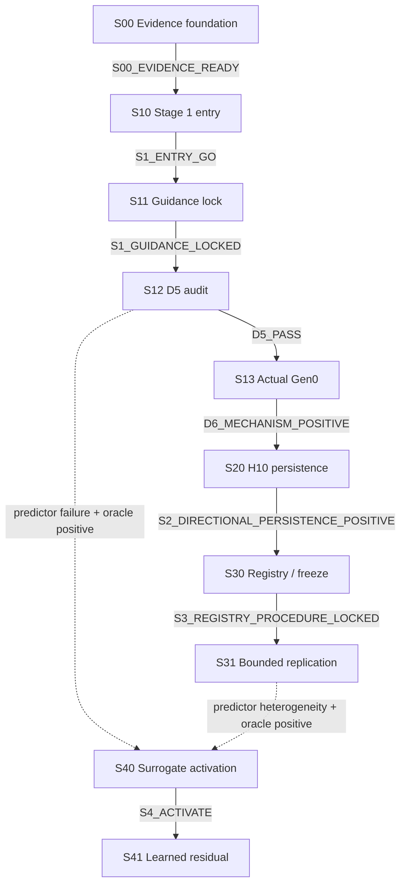

# gfx942 Non-StreamK Factorized Guidance — Stage-Gated Experiment Plan

> **文件角色：**pre-registered experiment plan。所有公式、常數、sample counts、seeds、artifacts、Stage 1–4 schedule與stop rules以本檔為唯一數值權威。
>
> **研究 scope／claim authority：**[Formocast Factorized Gen0 Guidance Feasibility Study — Research Charter](surrogate-dse-plan.md)。
>
> **狀態：**`pre_empirical / stage1_entry_blocked`。S00已由successor-001 evidence、原verifier FULL重驗、formal closeout與同一closure commit完成；scientific outcome為`positive`。S10在tracked implementation與outcome evidence開始前直接確認actual generated gfx942 non-StreamK Ductile YAML provenance不足，依§2.8進入`S1_ENTRY_BLOCKED`；S10 lock與formal report均不存在，S11為`not_activated`。
>
> **Foundation provenance：**active `protocol/v1/`與S00 report是fresh foundation；退役M00內容仍不得作schema、hash、lock、registry、fixture、test或PASS evidence。S00只支持CPU-only evidence semantics，不是GPU／performance結果。
>
> **S00雙視圖邊界：**`protocol/v1/README.md`是immutable execution-authority
> view（E）runbook；E由baseline commit
> `60775f12843bee9f95cb0bef4e91de8bc4dc9dc3`、exact 29 implementation blobs與
> exact兩份Plan-B bytes重建，且本plan、active README、S00 design在E中使用
> baseline bytes。本頁是post-PASS closeout-projection view（C）的三份投影之一；
> C中直接重跑historical outcome writer會按設計在寫入前
> `bound_hash_mismatch`，不得把它當成E runbook。Exact重建、預期拒絕與
> E→C hashes見[S00 formal report](ductile-origami-warmstart/reports/staged/s00-foundation-verification-report.md)。
> 重建依賴baseline Git object與兩份exact ignored Plan-B；不宣稱standalone
> source-tarball portability。
>
> **平台：**gfx942／MI300X、non-StreamK、單一dtype/layout。檔名中的`origami-warmstart`為歷史名稱；primary model是Formocast，Origami estimation只作reference。Stage 1是七日Gen0 gate；只有通過後才依序進Stage 2 persistence與Stage 3 bounded replication，Stage 4 surrogate是嚴格條件分支。

---

## Checkpoint authority、index 與 lifecycle

> 唯一active導航與legacy archive入口：[checkpoint index](ductile-origami-warmstart/README.md)。

### Authority order

1. Research charter：scope、claim ladder、non-goals、canonical failure taxonomy。
2. 本experiment plan：scientific criterion IDs、公式、數值、samples、seeds、go/stop與checkpoint DAG。
3. Checkpoint design：implementation handoff、maximum boundary、artifact/evidence binding。
4. Checkpoint effective lock：把committed authorities、Plan-B、exact whitelists、inputs、fixtures與seeds綁成不可變執行實例。
5. Formal report：記錄verified evidence、outcome、decision與closeout，不得反向修改criterion。

### Canonical checkpoint index

| ID | Responsibility | Design | Execution | Checkpoint | Scientific outcome | Lock | Design | Formal report |
| --- | --- | --- | --- | --- | --- | --- | --- | --- |
| S00 | Evidence contract／lineage／observability foundation | approved | completed | CHECKPOINT_COMPLETE | positive | effective (`successor-001`) | [design](ductile-origami-warmstart/s00-evidence-contract-lineage-observability-design.md) | [report](ductile-origami-warmstart/reports/staged/s00-foundation-verification-report.md) |
| S10 | Stage 1 access／artifact／mapping／noise gate | approved | blocked | BLOCKED | blocked | absent | [design](ductile-origami-warmstart/s10-stage1-entry-access-mapping-gate-design.md) | [blocker memo](ductile-origami-warmstart/reports/gen0-factorization-blocker-memo.md) |
| S11 | Stage 1 model-only factorization／guidance lock | approved | gated | DESIGN_APPROVED | not_activated | absent | [design](ductile-origami-warmstart/s11-stage1-model-only-factorization-design.md) | `reports/staged/s11-stage1-model-only-factorization-report.md` |
| S12 | Stage 1 D5 real-score／oracle audit | approved | gated | DESIGN_APPROVED | not_evaluated | absent | [design](ductile-origami-warmstart/s12-stage1-real-score-ranking-oracle-audit-design.md) | `reports/staged/s12-stage1-real-score-audit-report.md` |
| S13 | Stage 1 actual Gen0 mechanism | approved | gated | DESIGN_APPROVED | not_evaluated | absent | [design](ductile-origami-warmstart/s13-stage1-actual-gen0-mechanism-design.md) | `reports/gen0-factorization-mvp-report.md` |
| S20 | Stage 2 H10 persistence | approved | gated | DESIGN_APPROVED | not_evaluated | absent | [design](ductile-origami-warmstart/s20-stage2-h10-persistence-design.md) | `reports/short-horizon-persistence-report.md` |
| S30 | Stage 3 held-out registry／procedure freeze | approved | gated | DESIGN_APPROVED | not_evaluated | absent | [design](ductile-origami-warmstart/s30-stage3-heldout-registry-freeze-design.md) | `reports/staged/s30-heldout-registry-freeze-report.md` |
| S31 | Stage 3 two-cluster bounded replication | approved | gated | DESIGN_APPROVED | not_evaluated | absent | [design](ductile-origami-warmstart/s31-stage3-bounded-replication-design.md) | `reports/bounded-regime-replication-report.md` |
| S40 | Stage 4 activation／data-sufficiency gate | approved | gated | DESIGN_APPROVED | not_evaluated | absent | [design](ductile-origami-warmstart/s40-stage4-surrogate-activation-gate-design.md) | `reports/staged/s40-stage4-activation-report.md` |
| S41 | Stage 4 nested learned-residual analysis | approved | gated | DESIGN_APPROVED | not_evaluated | absent | [design](ductile-origami-warmstart/s41-stage4-learned-residual-analysis-design.md) | `reports/learned-residual-surrogate-report.md` |

`milestone`／`step`只有在指向上述ID時才是checkpoint alias。

### Strict dependency graph



S00的post-audited positive closeout已驗證`S00_EVIDENCE_READY -> S10`。S10的read-only pre-implementation discovery直接確認actual generated gfx942 non-StreamK Ductile YAML provenance不足，依§2.8形成`S1_ENTRY_BLOCKED`；沒有S10 lock、formal report或outgoing edge，S11為`not_activated`。Direct evidence、H1–H4邊界與recovery interface見[blocker memo](ductile-origami-warmstart/reports/gen0-factorization-blocker-memo.md)。`S1_ENTRY_DEGRADED_PROXY`、two-size mode、H5 pilot、single-cluster pilot或任何縮減方案仍必須先停在`blocked-awaiting-user-decision`；user未批准前沒有後續outgoing edge。

### Stable criterion IDs

Checkpoint designs只能引用下列parent IDs，不得自行改門檻：

- `S00_EVIDENCE_READY`
- `S1_ENTRY_GO`
- `S1_ENTRY_DEGRADED_PROXY`
- `S1_ENTRY_BLOCKED`
- `S1_GUIDANCE_LOCKED`
- `D5_PASS`
- `D5_BORDERLINE_INCONCLUSIVE`
- `D5_FAIL`
- `D6_MECHANISM_POSITIVE`
- `S2_DIRECTIONAL_PERSISTENCE_POSITIVE`
- `S3_REGISTRY_PROCEDURE_LOCKED`
- `S3_BOUNDED_REPLICATION_POSITIVE`
- `S4_TRIGGER_ELIGIBLE`
- `S4_DATA_GATE_PASS`
- `S4_ACTIVATE`
- `S4_LEARNED_RESIDUAL_POSITIVE`
- research charter中的全部`FT-*`

語意：

- `S00_EVIDENCE_READY`：observer neutrality、checkpoint/resume parity、lineage lock與artifact reconciliation全部通過。
- `S1_ENTRY_GO`：§2 entry gates通過，且actual YAML guidance可追溯。
- `S1_ENTRY_DEGRADED_PROXY`：§2 entry gates通過，但只能使用exact-space GEKO branch proxy；另需user downgrade approval。
- `S1_ENTRY_BLOCKED`：§2.8任一hard stop成立。
- `S1_GUIDANCE_LOCKED`：§4–§5 model-only frame、gene decisions、weights、shuffle與hash在real labels前完成鎖定。
- `S3_REGISTRY_PROCEDURE_LOCKED`：§16的兩primary slots、reserve、denominator、frozen procedure與完整budget均在任何Stage 3 score前鎖定。
- `S4_TRIGGER_ELIGIBLE`：§18.1 predictor-specific failure成立，且§18.2禁止patterns均不存在。
- `S4_DATA_GATE_PASS`：§18.3四-cluster data floor與prospective fourth-cluster規則通過。
- `S4_ACTIVATE`：前兩項同時通過，授權執行S41。
- `S4_LEARNED_RESIDUAL_POSITIVE`：§19.4每個primary held-out unit的ranking、prior-mass與oracle-gap gates全部strictly通過。

### Separated lifecycle fields

- `design_status`: `draft | approved | superseded`
- `execution_status`: `not_started | gated | ready | running | blocked | completed | cancelled`
- `checkpoint_state`: `DESIGN_APPROVED | LOCKED_READY | RUNNING | VERIFIED_PENDING_CLOSEOUT | CHECKPOINT_COMPLETE | BLOCKED`
- `scientific_outcome`: `not_evaluated | positive | negative | inconclusive | blocked | not_activated | skipped_by_gate`
- `lock_state`: `absent | effective | superseded`

只有`lock_state=effective`、`execution_status=ready`與`checkpoint_state=LOCKED_READY`可開始產生outcome-bearing evidence。`approved`只代表設計審查完成。

### Future checkpoint closeout contract

每次只處理一個active checkpoint：

1. 讀取committed repository rule、skill、charter、parent與design revisions。
2. 將design maximum boundary縮成exact implementation與delivery whitelists。
3. 由獨立planners建立Plan-A與frozen Plan-B。
4. 建立effective lock；lock前不得產生outcome evidence。
5. Fresh implementer實作，fresh verifier依Plan-B獨立驗證。
6. `CHANGES_REQUIRED`只修active checkpoint並重驗；consequential issue先走`design-discussion`。
7. Technical`PASS`只進`VERIFIED_PENDING_CLOSEOUT`。
8. 建立self-contained formal report，更新parent的checkpoint-specific hunk與current design status，並同步active index的verified lifecycle projection。
9. 原verifier給`CLOSEOUT_ACK`。
10. Exact-path isolated commit與post-commit audit成功後才是`CHECKPOINT_COMPLETE`。

Positive、negative與inconclusive在evidence integrity完整時都需report／closeout／commit。Durable`BLOCKED`不是完成；`skipped_by_gate`／`not_activated`只由上游checkpoint記錄，不建立自己的report或commit。

### 2026-07-25 pre-execution authority amendment

- **Trigger：**S00、S10、S11、S12、S13與S20的`delivery_boundary_max`未包含唯一active index；S00 delivery maximum也未承接既有implementation maximum中的observer／checkpoint-resume integration points與fresh deterministic foundation fixtures/tests。Charter另重複了會在closeout後過時的current-state敘述。
- **受影響不變量：**`delivery boundary ⊇ implementation boundary`、唯一active index與parent/design的一致性，以及checkpoint closeout的可稽核性。
- **曾考慮替代方案：**維持原狀會留下已知stale-state與boundary缺口；只修S00會讓已知缺口在S10–S20重現；只在parent加overlay則會降低各design的self-contained authority。三者均未採用。
- **審查：**Gauss（`/root/s00_closeout_a`）與Beauvoir（`/root/s00_closeout_b`）以fresh `gpt-5.6-sol/xhigh`獨立首輪、互相cross-examine，最後均明確`AGREE`。
- **決策：**只修本parent、charter、active README與S00／S10／S11／S12／S13／S20六份design，共九個exact paths。六份design delivery maximum納入`README.md`；S00另逐字承接上述兩類implementation authority；closeout同步parent、current design與README的verified lifecycle projection。投影只可更新當前checkpoint row、直接解析的outgoing edge／downstream state與事實性banner prose，不得預寫下游結果。
- **使用者核准：**2026-07-25核准「S0–S2九路徑 authority amendment 與其 exact-path ordinary baseline commit」；明確不授權push。
- **Authority effect：**不改研究問題、samples、seeds、公式、thresholds、acceptance、strict DAG、failure taxonomy或claim ladder，也不改S30+狀態。ordinary baseline commit只固定本次治理修正，不是任何checkpoint closure。
- **剩餘不確定性：**S00的exact implementation paths與scientific outcome仍須由fresh planning、effective lock、implementation、independent verification及closeout決定；S00完成後整體研究仍可能保持`pre_empirical`。

### Downgrade user gates

`DEGRADED_PROXY`、two-size／reduced-regime、S2 H5 resource-bounded pilot、single-cluster Stage 3 pilot，以及任何減少workloads、runs、seeds、metrics、validation、acceptance或scope的方案，都必須先產生完整decision packet並停在`blocked-awaiting-user-decision`。Diagnostic partial run不能滿足checkpoint或解鎖下游。

### Stage 3 reserve cutover

Primary cluster slots、最多一個technical reserve與優先序必須同時預鎖。Reserve只可因access、artifact或deterministic mapping technical failure替換，而且replacement decision必須發生在該slot第一筆Formocast score及第一筆real label之前。Scoring開始後的D5 fail、coverage不足、inconclusive、無eligible genes、oracle或GA negative都不得替換；固定denominator仍是兩個slots。

### Stage 4 data-qualified cluster

`qualified_for_stage4_data`與`D5_PASS`是不同欄位。Stage 4資料資格不要求D5 pass，但至少要求：

- independent search-space cluster ID與pre-label selection provenance；
- frozen mapping／revision；
- 至少256 unique judgment configs與兩個sizes；
- inclusion probabilities／analysis weights；
- correctness、coverage與lineage完整；
- 無leakage或outcome-driven amendment。

Mapping靠猜、coverage／correctness不完整或judgment pool不足者不具資格。

## Part I — Stage 1：七日 Gen0 mechanism protocol

> 本檔原有 D1–D7 嚴謹性完整保留。Part I 的數值、公式、locks 與 gates 不因新增後續 stages 而降低。

## 0. Stage 1 objective 與完成定義

### 0.1 Objective

在 frozen generated YAML 定義的 residual search space 中：

1. 量 Formocast whole-config ranking 是否有真實訊號；
2. 將訊號 factorize 成 ungrouped residual-gene probabilities；
3. 保留所有 existing YAML groups／weights；
4. 比較 existing guidance、Formocast residual guidance 與 same-entropy shuffled guidance；
5. 只有 offline gates 通過時，才用 actual Ductile `requested pop=64, n_gen=1` 測 Gen0；constructor-resolved population 必須在 real labels前鎖定。

### 0.2 Stage 1 能回答什麼

- Formocast 是否看得到 bounded residual space 的效能差異；
- Whole-config signal 是否能被獨立 per-gene hook 表達；
- 是否有超越 existing guidance／GEKO branch proxy 的 Gen0 增量；
- 失敗位於 mapping、model、factorization、sampler 或 heuristic saturation 哪一層。

### 0.3 Stage 1 不能單獨回答什麼

- 完整 GA convergence 或 tuning speedup；
- `n_gen>1` 後是否保留 Gen0 改善；此問題由 Stage 2回答；
- production deployment／adoption；
- 兩個新 fixed-tile regimes能否重現；此問題由 Stage 3回答；
- MI300X workload-level 泛化；
- StreamK、跨架構；
- learned residual surrogate是否能補 predictor failure；只有 Stage 4 data/trigger gate通過才研究。

### 0.4 完成狀態

- `completed_positive`：D5 與 D6 mechanism-positive criteria 全過。
- `completed_negative`：取得有效 empirical evidence，但某一預註冊 gate 失敗。
- `completed_inconclusive`：noise、support、coverage、importance ESS 或樣本範圍不足。
- `blocked`：D1–D2 access／artifact／mapping gate 未過。

---

## 1. Authority、locks 與不可變規則

### 1.1 Authority

- Scope、non-goals、failure taxonomy、claim boundary：research charter。
- 數值 protocol、公式、artifacts、stop rules：本檔。
- Frozen YAML 與 pinned code revisions：執行期間的實物權威。
- 實際 `soo/reduce_fn`、groups、candidate order 與 weights：只能由 frozen generated YAML／resolved config 取得，不得由 defaults 推定。

### 1.2 Lock points

在任何 real GFLOPS artifact 建立或解封前，必須 hash-lock：

- frozen YAML 與 provenance；
- source revisions；
- search-space map、groups、candidate order；
- sizes；
- model-only frame generation seeds；
- eligible／guided gene list；
- `alpha`、`epsilon`、`lambda` 與 weights；
- shuffled permutation bundle；
- D5 strata、sample IDs、fold IDs；
- measurement 與 correctness protocol。

看到 real GFLOPS 後不得修改上述項目。若必須修改：

1. 保留原 protocol 與原結果；
2. append amendment，記錄時間、理由與影響；
3. 原 D5 pool降級為 development data；
4. 另取未看過的 judgment pool，否則不得重新宣稱 gate pass。

### 1.3 Pinned code requirement

至少凍結：

- Ductile `ga.py`、`space.py`、`mutation.py` 與 validity code；
- GEKO config generator；
- TensileLite solution resolution／`getSizeMapping()`；
- Origami／Formocast；
- experiment runner／analysis code。

目前 workspace 中的工作樹狀態不能直接當正式 revision；執行前須保存 commit SHA、patch hash 或完整 source checksum。

### 1.4 S00 protocol foundation result

S00已建立fresh active runtime protocol：

```text
protocol/v1/README.md
protocol/v1/study-contract.yaml
protocol/v1/amendment-ledger.jsonl
protocol/v1/schemas/
protocol/v1/locks/s00-foundation-lock.json
```

- Genesis使用全新identity與`parent_lock: null`；iteration-1 technical findings透過
  exactly-one amendment與parent-linked `successor-001`修復，未覆寫原世代。
- 不得出現M00 version、hash、criterion、registry、path或migration provenance。
- Schema／validator／lock writer與fresh deterministic fixtures先實作、先驗證；
  兩代皆遵守lock-before-evidence。
- Effective successor lock綁定committed authority identities、兩份Plan-B、29/33 exact
  whitelists、fixtures/seeds、amendment與report target。
- Evidence開始後若schema、fixture或whitelist改變，必須append amendment、建立新lock並重跑，不得覆寫。
- Git history中的retired protocol內容不得作template、compatibility target或PASS evidence。
- Formal result見
  [S00 verification and closeout report](ductile-origami-warmstart/reports/staged/s00-foundation-verification-report.md)；
  它只支持CPU-only foundation semantics。

---

## 2. D1–D2 entry gate

### 2.1 Frozen generated YAML

保存 byte-for-byte copy、SHA-256、來源、生成命令與 generator revision，並解析：

- architecture、dtype、layout、transpose；
- non-StreamK 身分；
- problem sizes；
- fixed MacroTile 或 MTDU；
- `DepthU` 是 fixed、ungrouped free gene 或 grouped member；
- 全部 `group_i` 及其 candidate order；
- 全部 existing weights；
- `weight_beta`；
- ungrouped free genes；
- `soo` 與 resolved `reduce_fn`；
- correctness／validation 設定。

手工重建 YAML 不可冒稱 actual artifact。

### 2.2 Existing groups 的保護規則

所有 existing `group_i`：

- 不拆解；
- 不重排 candidate；
- 不修改 YAML-provided weights；
- 不將 group 內欄位另外當 residual genes；
- 即使 group 沒有 weights，也保持 YAML 原本的 grouped sampling semantics。

Formocast guidance只可作用於 manifest 明列的：

- ungrouped；
- currently-unweighted；
- frozen free genes。

### 2.3 Ten-config canonical mapping corpus

依 config hash／candidate boundary 的預註冊規則選 10 configs，至少涵蓋：

- group 候選邊界；
- residual gene 候選邊界；
- auto／sentinel 值；
- DepthU、GSU、GRVW／VectorWidth、PGR、occupancy 等適用欄位；
- 至少一個可能被 Formocast reject 的 case。

每筆保存：

- raw candidate；
- resolved solution；
- `SizeMapping`／model input；
- 每欄 provenance；
- config hash；
- mapping status／failure reason。

以下欄位不得猜值或用無證據 default：

- occupancy；
- effective GSU；
- `MathClocksUnrolledLoop`；
- unresolved `-1/-2` sentinel；
- 任何 backend-specific required metadata。

Derived mapping 可接受，但必須：

- deterministic、total、reproducible；
- 有 canonical direct／derived path；
- 相同 input 與 size 產生相同 model input；
- 逐欄 parity／round-trip 可稽核；
- dependency 寫入 mapping manifest。

多個 gene values 若映射成完全相同的 Formocast input，視為 model tie，不得捏造 sensitivity。

### 2.4 Size registry

優先選三個：

- 來自同一 frozen YAML；
- 共享完全相同 search-space hash、groups、candidate order 與 baseline weights；
- 不使用 Formocast score挑選；
- 依事前 workload 規則覆蓋 small-K／transition／large-K 或等價 utilization regimes。

若只有兩個合法 sizes：

- study mode標 `two_regime_pilot`；
- 所有「至少 2/3 sizes」改成「2/2 sizes」；
- claim明確降級。
- 在執行降級版前產生decision packet並停在`blocked-awaiting-user-decision`；user未批准時不得形成entry-gate outgoing edge。

不得拿不同 search space 的第三個 size湊數。

### 2.5 GPU access 與 smoke

D2結束前必須：

- 已排定 MVP期間可用的 gfx942 slot；
- generate／compile／benchmark smoke成功；
- nonzero correctness／validation；
- environment、ROCm、driver、clock／power policy可記錄；
- 能執行 D3–D6 所需的 measurement protocol。

只有「未來可能拿到 GPU」不算通過。

### 2.6 Noise pilot

由 10-config mapping corpus按 canonical config hash預選 3 anchors，不得依 model／GFLOPS選：

1. 每 anchor 在全部 sizes 做 7 次獨立重測；
2. 每次依 actual `reduce_fn` 得 aggregate quality `Q_ar`；
3. 調整 timed iterations，目標為 config-level repeat CV 的 P95 ≤ 0.5%；
4. iteration escalation cap 必須在 treatment benchmark 前鎖定；
5. cap後仍不穩定：D6 `noise_blocked`。

定義：

```text
d_ar        = abs(log(Q_ar) - median_r(log(Q_ar)))
delta_noise = exp(P95({d_ar})) - 1
```

`delta_noise` 在 D5 unblind 前鎖定，用作 D6 median-quality guardrail。

### 2.7 D1–D2 study mode

#### `ready_actual_yaml_guidance`

- Actual frozen YAML 含有可追溯 existing weights。
- 可回答完整 bounded RQ。
- 除非另有 deployment 證據，仍不得稱 production incumbent。

#### `degraded_branch_proxy_only`

- Actual YAML 沒有 weights；
- pinned GEKO commit能在**完全相同** space、groups、candidate order 下只新增 weights；
- 只能回答 GEKO branch-proxy mechanism 問題；
- 完整 RQ記為 `not_evaluated_under_actual_yaml`。

#### `blocked_no_comparable_heuristic`

- Actual weights不存在；
- branch proxy無法只改weights而保持其他條件相同；
- 不得判 existing-heuristic saturation。

### 2.8 D1–D2 hard stop

任一成立即停止 empirical work：

- frozen YAML provenance不足；
- mapping需猜 required metadata；
- actual／proxy candidate order無法對齊；
- D2前沒有已排定 gfx942 slot；
- smoke／correctness失敗；
- 剩餘可工作時間少於5日。

輸出 [blocker memo](#111-report-paths)，不得建立假裝執行過的 MVP report。

---

## 3. 三種分布與分析單位

### 3.1 `pi_nominal`

Frozen YAML／hook 定義的每個 key 的 product probabilities：

- 有 weight 的 key：依實際 `weight_beta` 轉成 probabilities；
- 無 weight 的 key：uniform；
- existing groups保持其單一 categorical key；
- 尚未經 validity 或 population 去重。

### 3.2 `pi_valid`

單一 nominal draw通過 `valid_fn` 後的 accepted-occurrence distribution：

```text
pi_valid(x) = pi_nominal(x | valid_fn(x) = true)
```

`sample_chunk()` 先保存 valid occurrences，之後 `SearchSpace.sample()` 才加入 `IndividualSet`。所以 duplicate valid occurrences 屬於 `pi_valid` 的 multiplicity，不可先去重再假裝等權。

### 3.3 `Pi_gen0,P0`

令 `P0` 為 Ductile constructor在 frozen search space上解析後的 initial population size；requested value是64，但 runtime可能依 gene cardinality調整。`SearchSpace.sample(P0)` 產生 `P0`-config joint population distribution：

- 先 per-key categorical draw；
- validity filter；
- population內由 `IndividualSet` 去重；
- 同 config 可在不同 populations重現。

`Pi_gen0,P0` 不是 `P0` 個獨立 `pi_valid` draws。本研究：

- 用 `pi_valid` 建 model marginals 與 D5 finite-frame audit；
- 用 exact `pop=P0` CPU replay描述 operational sampler；
- 用 D6 的三個新 populations測 actual endpoint。

### 3.4 Analysis units

- D5：256 個 unique configs；每 config 的所有 size observations綁在一起。
- 三 sizes時有 768 config×size observations，但不是 768 個獨立 workloads。
- D6：一個 `pop=P0` population是 joint realization；三 paired seeds只有三次方向性 evidence。

---

## 4. Model-only valid occurrence frame

### 4.1 Global frame `F_valid`

使用 pinned `sample_chunk` 等價路徑，在加入 `IndividualSet` 前收集 valid occurrences：

- default target／hard cap：8,192 accepted occurrences；
- duplicate occurrences保留；
- 每 occurrence保存 occurrence ID、seed／chunk、raw config、resolved config hash、validity provenance；
- 不因看到 GFLOPS結果追加 occurrences。

可在 4,096 occurrences後依 model-only stability提早停止，但只能在：

- 所有可能 eligible genes 已通過或明確未通過 §5 criteria；
- 兩個預鎖 disjoint halves產生相同 guided-gene set；
- 各 guided gene 的 best／worst pair均一致；
- global `lambda`選擇一致。

否則繼續到8,192 cap。Cap後仍不穩定的 gene維持uniform。

### 4.2 Deduplicated model catalog

依 canonical config hash去重只為節省 mapping／Formocast scoring：

- 每 unique config只需 resolve／score一次；
- 保存 multiplicity `m_i`；
- 保存所有 occurrence IDs；
- analysis時恢復 occurrence multiplicity。

若 complete、scoreable unique catalog少於256：

- 原 D5 design `blocked_or_underpowered`；
- 不得把 duplicate occurrences當不同 configs補足；
- 不得降低256門檻後仍聲稱照原protocol完成。

### 4.3 Model scoring

每 unique config對全部 sizes取得：

- resolved Formocast model input；
- latency／status；
- mapping與scoring time；
- rejection reason；
- score ties；
- model revision。

Whole-config Formocast coverage以 `F_valid` occurrence mass計算，也並報 unique-config coverage。

### 4.4 Conditional top-up

對 eligible residual `(gene g, value v)`：

1. 固定 `X_g=v`；
2. 其他 keys依 `pi_nominal` 抽；
3. 通過同一 `valid_fn`；
4. accepted occurrences保留 multiplicity；
5. 只用於該 `(g,v)` conditional mean；
6. 不進 global frame、whole-ranking audit或 D5 strata。

每 value：

- hard minimum：128 accepted conditional occurrences；
- precision／stability不足時可加到256 hard cap；
- cap後仍不足：該 gene維持uniform。

---

## 5. Model-sensitive residual genes 與 weights

### 5.1 Eligibility

一個 key必須同時是：

- frozen free key；
- ungrouped；
- currently unweighted；
- cardinality > 1；
- direct或deterministic derived mapping complete；
- 每 candidate value model coverage ≥95%。

Existing `group_i` 一律不 eligible。

### 5.2 Model benefit

對每 size `s`：

```text
r_s(x) = Formocast latency percentile rank in F_valid  # 0 is best
b_s(x) = 1 - r_s(x)                                   # larger is better
```

依 actual YAML objective聚合：

```text
b(x) = actual_reduce_fn({b_s(x)})
```

若 `reduce_fn` 與 benefit aggregation 語意無法無歧義對齊，D1–D2 必須在 protocol lock中寫出 resolved function與單元測試；不可由名稱猜測。

### 5.3 Shrinkage conditional mean

以 accepted-occurrence multiplicity計權：

```text
mu_gv = (sum b_i + alpha * global_mean_g) / (n_gv + alpha)
alpha = 32
```

- `alpha=32` 是 minimum support 128 的 25%；
- support增加到256時仍固定32；
- global frame與對應 conditional top-up使用同一 target conditional distribution；
- top-up只補該 cell，不當 whole-frame row。

### 5.4 Model-sensitive hard criteria

定義：

```text
S_g = max_v(mu_gv) - min_v(mu_gv)
```

只有全部成立才 guidance：

1. 每 value accepted-occurrence support ≥128；
2. 每 value model coverage ≥95%；
3. `S_g ≥ 0.05` percentile-benefit units；
4. 2,000 次 within-gene permutation，observed `S_g` > null P95；
5. 2,000 次 model-only bootstrap 中，固定 best-vs-worst contrast 的 95% interval half-width ≤0.025；
6. 同一 best／worst pair重現率 ≥90%；
7. best-vs-worst方向至少2/3 sizes一致；two-regime時2/2。

判讀：

- 90%以上：eligible for guidance；
- 80–90%：`borderline_model_sensitivity`，維持uniform；
- 80%以下：`unstable`，維持uniform。

若 support 128未過 precision／stability，可加到256；仍未過不得降低 criteria。

### 5.5 Probability construction

固定：

```text
epsilon = 0.20
alpha   = 32
```

對 guided gene：

```text
q_g(v) = exp(lambda * (mu_gv - min_v(mu_gv))) / Z_g
p_g(v) = epsilon / |V_g| + (1 - epsilon) * q_g(v)
Hnorm  = H(p_g) / log(|V_g|)
```

所有 guided genes共用單一 global `lambda`：

- 固定 grid `{0, 0.25, 0.50, ..., 8.00}`；
- 選最大 `lambda`，使所有 guided genes 的 `Hnorm ≥0.80`；
- 完全不讀 real GFLOPS；
- 若無 gene通過或 `lambda=0`，factorized guidance停止，不進 D5 treatment gate。

### 5.6 Hook cost conversion

依 frozen actual `weight_beta`：

```text
w_g(v) = -log(p_g(v)) / weight_beta
```

要求：

- `SearchSpace.map[g]` candidate order逐項等於 weight vector order；
- probability round-trip與normalization測試通過；
- NaN／Inf／missing value fail closed；
- guided gene list、`lambda`、weights、candidate order與hash在 real GFLOPS前鎖定。

### 5.7 Same-entropy shuffled control

- 所有 existing groups／weights完全不動；
- 對每個 guided residual gene，將同一 probability multiset做預鎖 deterministic non-identity label permutation；
- 保持 candidate cardinality、nominal entropy、`epsilon` floor與 guided gene數；
- permutation seeds／bundles在 real GFLOPS前鎖定；
- validity／dedup後的 realized entropy另行報告。

---

## 6. D3–D5 real-score finite-frame audit

### 6.1 Real-score pool

從 deduplicated model catalog抽固定256 unique configs。

建立 strata：

1. 對 scoreable configs依 aggregate Formocast score排序；
2. 依 occurrence multiplicity切成10個 weighted deciles；
3. sampling-only ties用 canonical config hash stable tie-break；
4. metric計算保留真實 ties／midranks；
5. unscored／rejected configs獨立為第11 stratum，不可靜默刪除。

Allocation：

- 依各 stratum occurrence mass做 largest-remainder proportional allocation至256；
- 每個非空 stratum至少1個；
- 若 quota > unique `N_h`，該層 census，剩餘 quota按同一規則重分；
- stratum內對 unique config做 simple random sampling without replacement；
- 保存 `stratum_id, N_h, n_h, rho_i=n_h/N_h`。

### 6.2 Measurement

每個 selected config在全部 sizes：

- generate／compile／benchmark；
- 使用鎖定 warmup／timed iterations；
- 保存 raw timings、GFLOPS、correctness、failure reason；
- arm／config順序依預鎖 randomized schedule；
- measurement failure不事後 replacement。

三 sizes時：

- 256 unique configs；
- 768 config×size observations；
- primary bootstrap／permutation單位仍是 config。

### 6.3 Baseline design weight

對 selected unique config `i`：

```text
W_0i = m_i / rho_i
```

其中：

- `m_i`：`F_valid` occurrence multiplicity；
- `rho_i`：stratified sampling inclusion probability。

Primary estimand只限 frozen `F_valid` empirical accepted-occurrence frame。

### 6.4 Alternative prior mass

對 alternative arm `a`：

```text
r_a(x_i) = pi_nominal,a(x_i) / pi_nominal,0(x_i)
W_ai     = W_0i * r_a(x_i)

M_a(T) = sum_i W_ai * I(x_i in real_top_decile_T)
         / sum_i W_ai
```

- Validity function相同，因此未知 valid normalization在 self-normalization中抵消；
- preserved groups在 density ratio中相消；
- `epsilon` floor確保 baseline support overlap；
- YAML baseline `r_0=1`。

每 arm必報：

```text
importance_ESS = (sum W_ai)^2 / sum(W_ai^2)
max_normalized_weight
```

若 `importance_ESS < 25`，該 arm prior-mass gate為 `inconclusive`，不得以 point estimate通過。

### 6.5 Metrics

Primary：

- design-weighted aggregate Spearman（weighted midranks後的 weighted Pearson）；
- design-weighted real top-decile cutoff；
- top-decile overlap／lift；
- arm-specific real-top-decile prior mass。

Secondary：

- raw unweighted versions；
- per-size Spearman／lift；
- Kendall；
- ties／distinct score counts；
- model／measurement coverage；
- occurrence concentration、max multiplicity、Kish effective sample size；
- compile／mapping／scoring cost。

Bootstrap：

- 在各 stratum內以 config為block重抽；
- 同一 config的全部 size outcomes一起移動；
- 不把768 rows視為獨立。

Permutation null：

- 以 config為整體 permutation unit；
- 保留同 config的全部 size outcomes；
- 規則與次數在 protocol lock中保存。

### 6.6 Coverage／rejection gate

同時要求：

- `F_valid` occurrence-mass complete Formocast coverage ≥95%；
- D5 planned real measurements coverage ≥95%；
- unscored／failed rows保留；
- 對 planned count ≥10 的 gene/value，rejection rate不得比 overall高超過10 percentage points。

低於門檻：

- 不使用 missing-weight adjustment救回；
- 記 `FT-INCONCLUSIVE` 或 mapping／model coverage failure；
- 不進 D6。

### 6.7 D5 pass／borderline／fail

全部成立才 `D5_PASS`：

1. Coverage／rejection gate通過；
2. aggregate Spearman ≥0.25；
3. aggregate top-decile lift ≥2× random；
4. 至少2/3 sizes的 Formocast ranking方向為正；two-regime時2/2；
5. existing／proxy + Formocast residual prior mass高於 existing／proxy baseline；
6. Formocast prior mass高於 same-entropy shuffled；
7. 每個相關 arm importance ESS ≥25；
8. 沒有 correctness failure。

`D5_BORDERLINE_INCONCLUSIVE`：

- Spearman在 `[0.20, 0.25)`；或
- lift在 `[1.5, 2.0)`；或
- support／ESS／coverage只差門檻但不能無偏補足。

Borderline不進 D6；不得調參後重用同 pool。

`D5_FAIL`：

- 低於 borderline；或
- factorized prior不勝 baseline／shuffled；或
- cross-fitted oracle顯示 hook expressiveness不足。

所有 threshold都是 engineering triage，不是統計保證。報告必須包含 raw overlap counts、ties、coverage、permutation null與 bootstrap interval。

### 6.8 Cross-fitted oracle diagnosis

使用5-fold config-level cross-fitting：

- fold assignment在 real scores解封前，依 config hash與D5 stratum固定；
- 同 config的所有 occurrences／sizes在同一 fold；
- occurrence multiplicity用於 fold balance與 analysis；
- 每 fold用其他80% configs建立 real-score oracle marginals；
- 只在 held-out fold判斷 factorized main effects；
- training fold缺 candidate support時標 `not_estimable`，不得用 model value補。

Oracle只用來區分：

- Formocast marginalization失敗；
- factorized hook expressiveness不足。

Oracle不進 required D6 arms。GPU有餘裕時才允許 outcome-informed、`diagnostic_only` 的 full-pool oracle arm；它不參與 success claim。

---

## 7. D6 actual Gen0 endpoint

只有 `D5_PASS` 才執行。

### 7.1 Formal arms

#### Arm U — Uniform／no guidance

- 保留 group結構；
- 停用所有 optional sampling weights；
- 只作 no-guidance ablation。

#### Arm G — Existing guidance／GEKO proxy

- `ready_actual_yaml_guidance`：使用 actual YAML weights。
- `degraded_branch_proxy_only`：使用 pinned、space-equivalent GEKO branch proxy。

#### Arm F — Existing + Formocast residual

- Arm G完全不變；
- 只新增 §5 通過的 residual-gene weights。

#### Arm S — Existing + same-entropy shuffled residual

- Arm G完全不變；
- residual probabilities使用 §5.7 permutation bundle。

### 7.2 GA configuration

固定：

```text
requested pop_size = 64
n_gen    = 1
period   = 0
seeds    = 3 paired sampler seeds
```

在 formal proposals前必須保存 `resolved_initial_pop_size=P0` 與 constructor decision：

- 若 `P0=64`，照原 protocol執行；
- 若 `P0!=64`，在任何 real labels前 append amendment，所有 arms共用同一 `P0`，replay／proposal counts／resource caps與 claim wording全部按 `P0`更新；
- 不得在看到 treatment quality後修改 `P0`；
- 各代 actual population size都須記錄，不能用 nominal 64推算 evaluation成本。

Repo code已查核：

- weights只用於 initial `space.sample(..., p=self.probs)`；
- `n_gen=1` 只執行一次 population evaluation；
- mutation新值在後續仍均勻，但本 MVP不進後續世代。

### 7.3 Proposal lock 與 benchmark union

1. 先為全部 `arm × seed`產生 `P0` proposal slots；
2. 保存 raw indices、resolved configs、config hashes與 multiplicity；
3. 每個 config canonical serialize；
4. population重現性用「config hashes排序後的 canonicalized config-set hash」比較；
5. 不依賴 set-backed population iteration order；
6. 所有 proposals hash-lock後才 benchmark；
7. 對跨 arms／seeds 的 deduplicated union量測一次；
8. 結果依 proposal multiplicity回填所有 slots。

`ordering mismatch`只指：

- `SearchSpace.map` candidate order；
- weight vector order；
- resolved candidate mapping；

不指 Python set iteration order。

### 7.4 CPU sampler replay envelope

Benchmark前，每個正式 arm執行2,000個 exact `SearchSpace.sample(P0)` replay populations：

- 使用與三個 formal seeds分離的 prelocked seeds；
- pin `n_jobs`、sampler revision、validity code hash；
- 保存 valid attempts、duplicates、fill failures；
- per-gene realized frequencies；
- normalized entropy；
- population diversity；
- pairwise Hamming diversity。

定義：

```text
T_freq = max_g 0.5 * sum_v abs(
           formal_frequency_g(v) - replay_mean_frequency_g(v)
         )
```

從 replay pseudo-panels建立三-seed panel的 P99：

- frequency discrepancy；
- entropy；
- diversity；
- invalid／duplicate／attempt counts。

判讀：

- same seed／same weights／same space的 canonicalized config-set hash不一致：`FT-PLUMBING`；
- `SearchSpace.map`／weight order不一致：`FT-PLUMBING`；
- 單一 formal seed超出 P99：`plumbing_suspect`，先audit並做含／不含該seed的敏感度；
- 同 arm至少2/3 seeds超出 P99：arm invalid，不得解讀 quality；
- realization正常但quality無增益：`FT-GEN0-MECHANISM`，不叫 plumbing。

### 7.5 Endpoint

D5 weighted audit定義 real top-decile aggregate-quality cutoff `T_D5`。

Primary：

```text
Gen0 top-decile hit rate
= proposal slots with aggregate quality >= T_D5
  / valid proposal slots
```

Secondary：

- population median aggregate quality；
- best aggregate quality；
- unique count／duplicate count；
- validity／correctness；
- realized entropy／diversity；
- 對 D5 pool的 overlap；
- mapping／compile／benchmark cost。

Best完全是 secondary，不可替代 median guardrail。

### 7.6 Median-quality noise guardrail

每 paired seed比較 Arm F 與 Arm G：

```text
median_quality_F / median_quality_G >= 1 / (1 + delta_noise)
```

至少2/3 seeds通過。

`delta_noise`只可來自 §2.6 noise pilot，不得看 arm results後修改。

### 7.7 Mechanism-positive criteria

全部成立才 `D6_MECHANISM_POSITIVE`：

1. Arm F 相對 Arm G 的 top-decile hit-rate paired delta，至少2/3 seeds >0；
2. Arm F 相對 Arm S 的 paired delta，至少2/3 seeds >0；
3. Median-quality noise guardrail至少2/3 seeds通過；
4. proposal set hash、candidate order、weights與space hashes一致；
5. replay envelope無systematic anomaly；
6. 無新增 validity／correctness failure。

三 seeds只支持 directional mechanism evidence，不執行顯著性檢定，不宣稱 speedup。

---

## 8. Operational failure mapping

實驗報告依 research charter的 canonical taxonomy：

| 觀察 | 結果 ID |
| --- | --- |
| 無 GPU／YAML／artifact | `FT-BLOCKED-ACCESS` |
| Mapping需猜值或 parity失敗 | `FT-BLOCKED-MAPPING` |
| Whole ranking gate失敗 | `FT-MODEL-RANK` |
| Whole rank好、model marginal差、oracle好 | `FT-MODEL-MARGINAL` |
| Cross-fitted oracle也差 | `FT-HOOK-EXPRESSIVENESS` |
| Target／realized frequencies或candidate order不符 | `FT-PLUMBING` |
| Realization正常但Gen0無增益 | `FT-GEN0-MECHANISM` |
| Formocast不勝 existing／proxy | `FT-HEURISTIC-SATURATION` |
| Formocast不勝 shuffled | `FT-ENTROPY-ONLY` |
| Gen0好但後續未知 | `FT-WASHOUT-UNTESTED` |
| Noise／support／ESS／coverage不足 | `FT-INCONCLUSIVE` |

不得以「模型沒用」取代層級判讀。

---

## 9. D1–D7 schedule

### D1 — Artifact 與 environment

- Frozen YAML provenance／hash；
- source revision lock；
- search-space／groups／weights manifest；
- gfx942 booking；
- generate／compile／benchmark smoke。

### D2 — Mapping、sizes 與 protocol lock

- 10-config mapping corpus；
- size registry；
- noise pilot；
- study mode；
- model-only／replay seeds；
- 所有 model-sensitive constants與analysis rules lock。

**D2 hard decision：**`GO`、`DEGRADED_PROXY` 或 `BLOCKED`。`DEGRADED_PROXY`與two-regime mode都要先通過parent-level user downgrade review，不能自動解鎖下一checkpoint。

### D3 — Model-only frame

- `F_valid` accepted occurrences；
- deduplicated catalog；
- Formocast scoring；
- conditional top-ups；
- model-sensitive gene decisions；
- weights／shuffled bundle hash-lock。

任何 real GFLOPS artifact在此 lock完成前都不得建立或解封。

### D4 — Real-score pool

- D5 strata／inclusion manifest；
- 256-config generate／compile／benchmark；
- correctness與measurement coverage；
- raw result freeze。

### D5 — Audit 與 decision

- Weighted ranking／lift；
- prior-mass density-ratio analysis；
- importance ESS；
- cross-fitted oracle；
- `PASS`、`BORDERLINE`、`FAIL` 或 `INCONCLUSIVE`。

只有 `PASS` 進 D6。

### D6 — Actual Gen0

- 2,000-population CPU replay per arm；
- formal proposal lock；
- benchmark union；
- endpoint／guardrail／failure attribution。

### D7 — Report

- Positive、negative 或 inconclusive：MVP report；
- D1–D2 blocked：blocker memo；
- 不建立空白 report；
- 依各自formal report與checkpoint closeout規則完成；不得以stage rollup取代未closeout的checkpoint。

---

## 10. Artifact contract

Logical artifacts至少包括：

### Protocol／environment

- `study-manifest.json`
- `protocol-lock.json`
- `environment-and-revision-manifest.json`
- `amendments.jsonl`

### Frozen inputs

- `frozen-generated.yaml`
- `frozen-generated.sha256`
- `yaml-provenance.json`
- `search-space-manifest.json`
- `size-registry.json`

### Mapping／model-only

- `canonical-mapping-10.jsonl`
- `valid-occurrences.parquet`
- `resolved-config-catalog.parquet`
- `model-scores.parquet`
- `conditional-topups.parquet`
- `model-sensitive-gene-decisions.json`

### Weights／controls

- `marginals.parquet`
- `weights.yaml`
- `shuffled-permutation-manifest.json`
- `probability-roundtrip-results.json`

### D5

- `real-score-pool-manifest.json`
- `real-scores.parquet`
- `oracle-fold-manifest.json`
- `crossfit-oracle-results.parquet`
- `d5-gate-summary.json`

### D6

- `sampler-replay-summary.parquet`
- `gen0-proposals.jsonl`
- `gen0-proposal-lock.sha256`
- `gen0-deduplicated-union.parquet`
- `gen0-results.parquet`
- `d6-decision.json`

每個 artifact須帶：

- schema version；
- source／protocol revision；
- input hashes；
- environment ID；
- creation timestamp；
- complete／partial／rejected status；
- failure reason。

大型 raw artifacts可存在外部 artifact root；repo report保存 immutable URI、hash、schema與重現指令。

---

## 11. Report lifecycle 與允許措辭

### 11.1 Report paths

D1–D2 access／artifact／mapping blocked：

`study_docs/research/ductile-origami-warmstart/reports/gen0-factorization-blocker-memo.md`

D5 或 D6 已形成 empirical evidence，不論 positive、negative 或 inconclusive：

`study_docs/research/ductile-origami-warmstart/reports/gen0-factorization-mvp-report.md`

現在不建立空白檔。

### 11.2 Positive wording

只允許：

> 在指定 frozen YAML、gfx942 non-StreamK、一種 dtype/layout、指定 sizes、bounded D5 audit 與三個 paired sampler seeds 下，Formocast-factorized residual guidance 對 Gen0 candidate quality 提供方向性增量，值得擴大驗證。

### 11.3 Negative wording

必須使用 §8 result ID，說明：

- 哪個 gate失敗；
- 證據支持什麼；
- 不能支持什麼；
- 是否值得後續改 predictor、改 hook或停止。

### 11.4 Proxy wording

`degraded_branch_proxy_only` 必須包含：

- pinned GEKO commit；
- exact space／order parity evidence；
- `branch proxy` 字樣；
- `primary RQ not evaluated under actual YAML`。

禁止：

- incumbent；
- deployed；
- production baseline；
- beats original Ductile。

---

## 12. Current execution checklist

- [ ] Frozen generated YAML with provenance
- [ ] Pinned Ductile／GEKO／TensileLite／Formocast revisions
- [ ] Actual `group_i`／weights／candidate order confirmed
- [ ] Actual `soo/reduce_fn` confirmed
- [ ] 10-config mapping parity passed
- [ ] Two or three same-space sizes locked
- [ ] gfx942 slot booked
- [ ] Smoke／correctness passed
- [ ] Noise pilot and `delta_noise` locked
- [ ] Study mode recorded
- [ ] Real GFLOPS remains sealed until model-only lock

在上述entry conditions完成前，本experiment plan只是一份預註冊設計，不代表實驗已ready或已產生結果。

---

## Part II — Stage 2：Short-Horizon Persistence Protocol

Stage 2不是無條件延長。只有 Stage 1 `D6_MECHANISM_POSITIVE` 才可建立 Stage 2 lock artifact。

## 13. Stage 2 objective 與 entry

### 13.1 Objective

> Gen0 的增量是否能穿過後續 mutation／selection transitions，在固定10-generation horizon中改善 early-search quality-vs-complete-evaluations，而不是被 existing guidance快速追平？

這一階段測 **persistence／early evaluation efficiency**，不是完整 convergence或 system speedup。

### 13.2 Entry requirements

全部成立才 `S2_READY`：

- Stage 1 `D6_MECHANISM_POSITIVE`；
- mapping、plumbing、correctness與sampler replay無未解 anomaly；
- frozen YAML、space、sizes、groups、weights、model revision、guided genes、`alpha/epsilon/lambda`、`reduce_fn`全部不變；
- 五個 Stage 2 formal paired seeds在 Stage 1 unblind前預鎖，或由 protocol hash deterministic派生，且與 Stage 1 seeds完全 disjoint；
- 完整 G／F／S × 5 seeds × H10 GPU與時間 cap已確認；
- 保留至少一個 report工作日與10% measurement failure buffer；
- requested／resolved initial population與 adaptive population semantics已記錄。

Stage 1三個 selected seeds可延長作 continuity diagnostic，但：

- 不計入 Stage 2五個 formal pairs；
- 不與 fresh seeds混報成八個 independent seeds；
- 不參與任何 4/5、3/5 gate。

### 13.3 Formal arms

- **G：**existing YAML guidance／GEKO branch proxy。
- **F：**G + frozen Formocast residual guidance。
- **S：**G + frozen same-entropy shuffled residual guidance。

Uniform arm已在 Stage 1完成 no-guidance ablation，不再支付10-generation成本。

---

## 14. Stage 2 fixed-horizon execution

### 14.1 Configuration

```text
n_gen       = 10
period      = 0
formal arms = G / F / S
paired seeds = 5 fresh seeds
```

- 第1代是 initial population evaluation；
- 第2–10代提供9次後續 transitions；
- 不修改 size sampling、per-size iterations、fitness、mutation、selection或survival；
- 每代保存 proposal set、complete fitness matrix、best-so-far、population size、diversity、decay mode、invalid／duplicate／fill status。

### 14.2 Generation-5 checkpoint

Generation 5只可作：

- environment／resource health checkpoint；
- checkpoint integrity與resume parity；
- 最終 report中的 immediate-washout descriptive estimand。

禁止：

- 解封 G／F／S comparative quality後決定是否跑 generation 6–10；
- H5漂亮才延長；
- H5不漂亮就停、卻仍把H10 survivors當正式樣本。

正式 Stage 2從 entry即承諾 H10。若資源事前只夠H5，只能另標：

`S2_H5_RESOURCE_BOUNDED_PILOT`

提出此downgrade時必須先產生decision packet並停在`blocked-awaiting-user-decision`。

它不能通過正式 Stage 2，也不能進 Stage 3。

### 14.3 Checkpoint／resume

若分段執行：

- 先通過 continuous-vs-resume equivalence test；
- checkpoint保存 population、old population、RNG、stats、decay state、evaluation count與lineage hashes；
- resume不得 reseed或重建population；
- paired G／F／S blocks在相近 environment epoch執行。

Parity無法證明時改用 continuous H10 run。

### 14.4 Complete candidate evaluation

一個 candidate只有全部成立才計入 primary evaluation axis：

- 全部鎖定 sizes完成；
- correctness通過；
- 依 frozen `reduce_fn`可產生 aggregate quality；
- config identity與arm/seed lineage完整。

Compile failure、缺 size或invalid仍須保存，但不能當作低成本「已完成 evaluation」。

### 14.5 Prelocked support `U_floor`

Stage 2 entry、任何 Stage 2 labels產生前，依 Stage 1 telemetry、resolved population、complete-evaluation rate與 frozen GA semantics鎖定：

```text
U_floor = 每個 arm × fresh seed 在 Gen0 後
          必須提供的共同 complete-evaluation support
```

要求：

- Primary一律積分到同一 `U_floor`；
- 任一 formal run未達 `U_floor` → `FT-EVALUATION-SUPPORT`／inconclusive；
- 不得事後下修；
- observed per-pair minimum只作support報告與預註冊敏感度分析。

---

## 15. Stage 2 estimands、gate 與 failure

### 15.1 Primary AUC

對 arm `a`、fresh paired seed `r`：

```text
Q_a,r(u)
= Gen0 結束後新增 u 個 complete evaluations時，
  截至當下的 best-so-far aggregate quality

A_a,r
= (1 / U_floor) * integral[0,U_floor] log(Q_a,r(u)) du
```

- 使用 generation-end right-continuous step function；
- 不使用 candidate／set iteration order製造 batch內假 anytime曲線。

Primary paired deltas：

```text
Delta_FG,r = A_F,r - A_G,r
Delta_FS,r = A_F,r - A_S,r
```

### 15.2 Stage 2 positive gate

`S2_DIRECTIONAL_PERSISTENCE_POSITIVE` 要求全部成立：

1. 五個 fresh paired panels均有效且達 `U_floor`；
2. `Delta_FG > 0` 至少4/5，且 paired median >0；
3. `Delta_FS > 0` 至少4/5，且 paired median >0；
4. H10／`U_floor` endpoint的 F best-so-far > G 至少3/5；
5. Final independently verified aggregate quality：

   ```text
   Q_F / Q_G >= 1 / (1 + delta_noise)
   ```

   至少4/5；
6. 無 correctness、plumbing、mapping或 systematic fill failure。

Diversity是 diagnostic。只有當 decline伴隨：

- 未達 `U_floor`；
- population fill failure；或
- final non-inferiority失敗；

才構成 premature-convergence evidence。

### 15.3 Secondary／diagnostic metrics

- H5 immediate persistence／washout；
- Gen1／3／5／10 trajectory；
- D5預鎖 target的 right-censored time-to-target；
- RMST through `U_floor`；
- target achievement；
- raw generation-10 outcome；
- diversity／per-gene diversity；
- population decay、invalid、duplicates；
- 由固定H10 trace重建的 counterfactual `period=5` stop point。

Counterfactual natural stop只作 diagnostic，不是實際wall-time證據。

### 15.4 Stage 2 failure IDs

- `FT-PERSISTENCE-WASHOUT`：Gen0 positive，但 F-G／F-S AUC或late retention失敗。
- `FT-SHORT-HORIZON-REGRESSION`：AUC正向，但 final verified non-inferiority失敗。
- `FT-EVALUATION-SUPPORT`：formal run未達事前 `U_floor`。
- `FT-ENTROPY-ONLY`：F不勝S。
- `FT-PLUMBING`、`FT-INCONCLUSIVE` 與 correctness failure沿用 Stage 1。

Stage 1的 `FT-WASHOUT-UNTESTED` 在 Stage 2結束後必須改成具體結果。

### 15.5 Stage 2 time／resource cap

- hands-on target：4工作日；
- hard cap：5工作日，包含分析與 decision report；
- entry前依 actual resolved population、adaptive decay與 `C` sizes鎖 proposal與 candidate×size request cap；
- nominal `3×5×10×64` 只能作 requested-population參考，不是正式GPU cap；
- 不得只完成部分 arms／seeds後仍判 positive。

Report：

`study_docs/research/ductile-origami-warmstart/reports/short-horizon-persistence-report.md`

---

## Part III — Stage 3：Bounded Held-Out Regime Replication

## 16. Stage 3 entry、freeze 與 clusters

### 16.1 Entry

只有正式 `S2_DIRECTIONAL_PERSISTENCE_POSITIVE` 可進 Stage 3。

`S2_H5_RESOURCE_BOUNDED_PILOT` 不具 entry權。

### 16.2 Cluster registry

在任何 Stage 3 model／real scores前鎖定：

- 兩個新 fixed-MT／fixed-MTDU clusters；
- 每 cluster恰好兩個、共享相同 search space的 sizes；
- 同 gfx942、non-StreamK、dtype/layout；
- selection provenance與非Formocast、非結果導向規則；
- 一個 optional technical reserve cluster（若資源允許）。

Stage 1／2 cluster是 development，不算 held-out。

Technical reserve只能替換：

- access不可用；
- artifact損壞；
- mapping無法建立；

不能因 D5／GA結果不好而替換。

### 16.3 Frozen procedure

從 Stage 2凍結：

- Formocast revision與mapping；
- eligibility／sensitivity algorithm；
- `alpha=32`、`epsilon=0.20`；
- lambda grid、entropy／support／coverage thresholds；
- factorization與shuffle；
- D5 sampling／analysis／oracle；
- Stage 2 AUC、`U_floor`決定規則與gates；
- arms、H10與failure taxonomy；
- source／protocol／analysis hashes。

新 cluster可由同一 label-blind deterministic algorithm輸出不同：

- eligible gene list；
- model-only marginals；
- lambda結果；
- weights。

這不算 retuning。看到該 cluster real labels後的 manual exception會使它降為 development，失去 held-out資格。

---

## 17. Stage 3 per-cluster protocol 與 gate

### 17.1 Per-cluster execution

每個預註冊 cluster：

1. mapping／access／noise gate；
2. model-only frame與 frozen guidance algorithm；
3. 256 unique configs ×2 sizes 的 D5-equivalent audit；
4. D5 fail／inconclusive仍保留在兩-cluster denominator，但不跑GA；
5. D5 pass才執行：
   - G／F／S；
   - `n_gen=10, period=0`；
   - 3個 fresh paired seeds；
   - Stage 2相同 AUC、support、late retention、non-inferiority與correctness rules。

### 17.2 Bounded replication positive

`S3_BOUNDED_REPLICATION_POSITIVE` 要求：

- 2/2 clusters無 outcome-driven amendment；
- 2/2 D5 pass；
- 每 cluster F-G與F-S AUC至少2/3 seeds正；
- 每 cluster H10 late retention至少2/3正；
- 每 cluster final verified non-inferiority至少2/3；
- 無 correctness／plumbing failure。

判讀：

- 一正一負：`FT-REGIME-HETEROGENEITY`；
- 兩者都負：bounded replication否證；
- 任一 access／mapping blocked：整體 inconclusive；
- 只完成一個 cluster：只能在user事前批准downgrade後稱`single-cluster transfer pilot`，且不能通過本checkpoint或解鎖任何原定downstream edge。

兩個 sizes是同一 cluster內 repeated conditions，不是兩個 independent generalization units。

### 17.3 Stage 3 time／resource cap

- hard cap：7工作日；
- entry前鎖完整兩-cluster D5與GA budget；
- GPU cap依 Stage 2實際消耗與兩-cluster request估算，不靠cache／dedup的樂觀節省啟動；
- 保留 report工作日與10% failure buffer。

Report：

`study_docs/research/ductile-origami-warmstart/reports/bounded-regime-replication-report.md`

---

## Part IV — Stage 4：Conditional Learned Residual Surrogate

## 18. Stage 4 trigger 與 data gate

### 18.1 可啟動 patterns

只有 predictor-specific failure且 cross-fitted oracle支持 factorized main effects時可啟動，例如：

- `FT-MODEL-RANK`，但 oracle ranking／prior mass穩定；
- `FT-MODEL-MARGINAL`，且 oracle明顯優於 G／shuffled；
- Stage 3 predictor heterogeneity，但失敗 cluster的 oracle仍支持同一 hook。

### 18.2 不得啟動

- `FT-BLOCKED-ACCESS`／`FT-BLOCKED-MAPPING`；
- `FT-HOOK-EXPRESSIVENESS`；
- `FT-PLUMBING`；
- `FT-GEN0-MECHANISM`；
- `FT-PERSISTENCE-WASHOUT`；
- premature convergence／short-horizon regression；
- `FT-HEURISTIC-SATURATION`；
- 單純 noise／coverage不足。

更換 predictor不能修復上述問題。

### 18.3 Formal data floor

至少：

- 4個 independent search-space clusters；
- 每 cluster ≥256 unique measured configs；
- 每 cluster ≥2 sizes；
- 總計 ≥1,024 unique configs／2,048 config×size labels；
- inclusion probabilities、correctness、mapping與coverage完整。

若已有3個合格 clusters，可在 mentor另批資源與5日cap內新增**最多一個** prospective sealed fourth cluster：

- selection rule與cluster ID在labels前鎖定；
- 不依前三clusters結果挑容易成功的regime；
- 只取得label pool，不跑GA；
- 第四cluster labels不得回流調參後再當test。

若現有少於3個，或第四cluster無法在cap內取得：

`FT-SURROGATE-DATA-INSUFFICIENT`

不得補收2–3個clusters、不得row-random split、不得把sizes當clusters。

---

## 19. Stage 4 model／split／claim contract

### 19.1 Research question

> Learned residual predictor能否在完全 unseen cluster中，恢復 Formocast未捕捉、但 oracle顯示可 factorize的效能訊號？

### 19.2 Model boundary

- 唯一model是inclusion-weighted ridge residual correction；
- target固定為`log(real latency) - log(Formocast latency)`；
- `ridge_lambda` grid固定為`{1e-4, 1e-3, 1e-2, 1e-1, 1, 10, 100}`；
- intercept不penalize；
- 不做model zoo；
- factorization與hook沿用Stage 1 frozen algorithm。

Feature manifest只能包含：

- label-blind problem/config/gene fields；
- Formocast inputs；
- model-only outputs；
- 在全部qualified clusters都有完整deterministic mapping的欄位。

禁止features：

- real scores或由real score衍生的欄位；
- oracle outputs；
- cluster ID、result ID或任何hash；
- outcome-derived selection、coverage、rank或failure features。

Preprocessing：

- continuous transform／imputation／scaling只fit當前outer-training data；
- categorical one-hot只使用training categories，另有explicit unknown bucket；
- outer-test不參與feature selection、preprocessing或calibration。

Inner model selection：

- 每個validation cluster計算inclusion-weighted residual MSE；
- objective是各validation cluster MSE的equal-cluster mean；
- loss相同時選較大的`ridge_lambda`。

### 19.3 Split invariants

- Outer：leave-one-entire-cluster-out；
- Inner：只在 outer-training clusters做 cluster-grouped selection；
- 同 cluster的sizes、repeats、duplicates、derived rows都在同 fold；
- preprocessing、feature selection、calibration只fit training data；
- D5 inclusion weights帶入training與evaluation；
- 禁止 random row split。

若恰有3個既有＋1個 prospective sealed cluster：

- Primary：前三clusters完成model／hyperparameter selection後，第四cluster作untouched prospective test，且只有第四cluster判primary gate；
- LOCO只作 secondary sensitivity。

否則：

- 所有LOCO outer clusters都是primary held-out units；
- 每個primary unit都必須獨立通過全部§19.4 gates；
- 不得跨units平均救回。

### 19.4 Stage 4 endpoint

每個parent-designated primary held-out unit都分別判以下三項。

#### Ranking gate

- 使用frozen inclusion/design weights計算aggregate weighted Spearman；
- prediction orientation是`-log(predicted latency)`；
- real orientation是`log(aggregate quality)`；
- learned必須strictly勝Formocast。

#### Prior-mass gate

- 使用§6.4相同的self-normalized real-top-decile prior mass`M_a(T)`；
- learned factorized prior必須strictly同時勝Formocast-factorized prior與same-entropy shuffled。

#### Oracle-gap gate

```text
oracle_gap_a = max(0, M_oracle(T) - M_a(T))
```

Learned oracle gap必須strictly小於Formocast oracle gap。

`S4_LEARNED_RESIDUAL_POSITIVE`要求每個primary held-out unit三項全部通過。Tie不算positive；required support或coverage缺失是inconclusive。沒有使用outer labels重選features／genes／thresholds是必要validity condition。

不得自行加入effect margin、CI/significance requirement、x-of-y relaxation、oracle-gap ratio，或修改data floor、split、time cap與claim；任何此類變更都需user review。

預設不跑 actual GA。只有另有第五個 prospectively sealed cluster與 fresh mentor gate，才可設計 actual GA validation；不屬於預設 internship承諾。

### 19.5 Stage 4 timebox

- hard cap：5工作日；
- 預設不新增超過一個 label-only cluster；
- 資料 gate未過立即停止，不用較弱 split救回。

Report：

- S40 trigger／data gate（含data-insufficiency scientific negative）：`study_docs/research/ductile-origami-warmstart/reports/staged/s40-stage4-activation-report.md`
- S41完成analysis：`study_docs/research/ductile-origami-warmstart/reports/learned-residual-surrogate-report.md`

---

## 20. Cross-stage resource、claim 與 lifecycle rules

### 20.1 Resource reservation

每個 stage entry前：

- 保留至少1工作日或剩餘可工作時間15%作最終 synthesis，取較大者；
- 保留已確認GPU allocation的10%作noise／failed-measurement buffer；
- 確認完整 formal panel可在cap內完成；
- 不因已開始就縮 seeds／arms／clusters後沿用原 claim。

### 20.2 Claim ladder

- Stage 1：bounded Gen0 mechanism evidence。
- Stage 2：single-development-cluster H10 early-search persistence／evaluation efficiency。
- Stage 3：two-held-out-regime bounded replication。
- Stage 4：cluster-held-out predictor substitution。

任何階段都不得宣稱：

- system／end-to-end speedup；
- full GA convergence；
- MI300X workload generalization；
- production／deployment readiness；
- owner adoption。

### 20.3 Stage branching

- Stage 1 positive → Stage 2。
- Stage 2 positive → Stage 3。
- Stage 1／3 predictor-specific failure + oracle positive + data gate → Stage 4。
- Hook、plumbing、Gen0、washout、regression、heuristic-saturation failures → 停止該 intervention branch。
- Negative／inconclusive也必須建立對應report，不只記成功案例。

### 20.4 Owner-led future handoff

只有 Stage 3成功且核心團隊有興趣後，才可把以下列為 handoff idea：

- long-horizon／natural-stop confirmation；
- 更多 workloads／24-shape validation；
- end-to-end wall-time accounting；
- productization／deployment review。

它們不是 internship stage，也不恢復舊 M00–M09權威。

### 20.5 Stage-specific artifacts

Stage 2至少保存：

- `stage2-protocol-lock.json`
- `stage2-fresh-seed-manifest.json`
- `stage2-u-floor.json`
- `stage2-checkpoint-parity.json`
- `stage2-trajectories.parquet`
- `stage2-champion-remeasurements.parquet`
- `stage2-decision.json`

Stage 3至少保存：

- `stage3-cluster-registry.json`
- `stage3-freeze-manifest.json`
- 每cluster的 mapping／D5／weights／trajectory artifacts
- `stage3-heldout-denominator.json`
- `stage3-decision.json`

Stage 4至少保存：

- `stage4-trigger-evidence.json`
- `stage4-cluster-data-registry.json`
- `stage4-prospective-cluster-lock.json`（若適用）
- `stage4-outer-inner-split-manifest.json`
- `stage4-model-contract.json`
- `stage4-predictions.parquet`
- `stage4-decision.json`

所有 stage-specific artifacts沿用 §1 的hash、lineage與append-only amendment規則。
