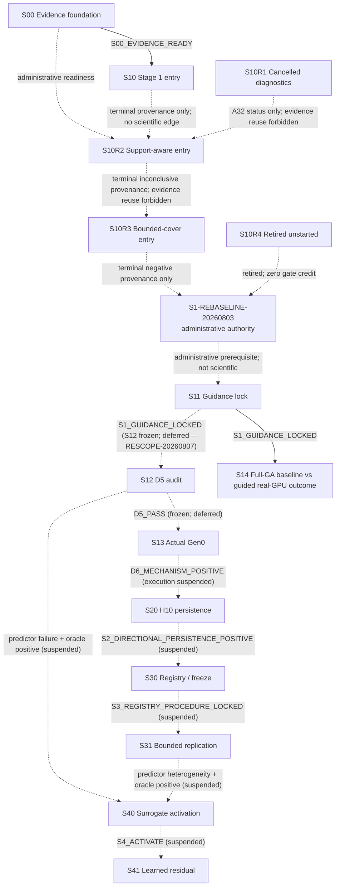

# gfx942 Non-StreamK Factorized Guidance — Stage-Gated Experiment Plan

> **文件角色：**pre-registered experiment plan。所有公式、常數、sample counts、seeds、artifacts、Stage 1–4 schedule與stop rules以本檔為唯一數值權威。
>
> **研究 scope／claim authority：**[Formocast Factorized Gen0 Guidance Feasibility Study — Research Charter](surrogate-dse-plan.md)。
>
> **2026-08-03 current authority：**user-approved
> [`S1-REBASELINE-20260803`](ductile-origami-warmstart/s10r4-retirement-s11-rebaseline-authority.md)
> 退役未啟動的 S10R4/B01–B07，沒有 S10R4 result、report、lock 或 edge。S11 現為
> `approved / not_started / DESIGN_APPROVED / not_evaluated / lock absent`，只有虛線
> administrative prerequisite，`incoming_scientific_edge=null`。唯一 future scientific
> edge 是 S11 自己完整 locked/verified/committed/post-audited 後的
> `S11:S1_GUIDANCE_LOCKED -> S12`。這次沒有執行 S10R4 或 S11 evidence。白話說明見
> [變更指南](ductile-origami-warmstart/s10r4-to-s11-experiment-plan-change-guide.md)。
>
> **2026-08-04 current authority：**user-approved `S11-DIRECTION-METRICFRAME-20260804`
> （見本頁下方同名 amendment）確認 S11 以 administrative prerequisite 進場為正當、不建
> S10R5，並把 §6.4 fixed-half stability 由「全部欄位 exact 相同」修正為只對列舉的
> categorical decision projection 要求 exact（數值 drift 只報告、不 gate），另要求 lock 前
> materialize workload envelope 並以 branch-stop＋`BLOCKED` escalation 控 churn。只改 design
> 文字與治理措辭，未動任何 scientific threshold、sample、seed、claim、edge，也未執行 S11
> evidence 或建立 lock。§6.4 實作與 workload materialization 仍待 future S11 contract/lock。
> 本頁後續所有舊 S10R4 positive dependency、`F_valid/F_effective/F_codegen` 與
> whole-gene fail-closed wording，若未明寫 current，均是 historical/superseded trail。
>
> **2026-08-07 current authority：**user-approved `RESCOPE-STAGE1-OUTCOME-20260807`
> （見本頁下方同名 amendment）新增 Stage-1 checkpoint **S14**（full Ductile GA,
> BASELINE=existing GEKO guidance vs GUIDED=GEKO+Formocast Gen0 bias,post-GA real-GPU
> outcome on selected champion kernel）。移除 S12 `D5_PASS` 作為下游 hard gate;S12
> （pre-GA 256-identity D5 audit）FROZEN/DEFERRED,真實效能改在 Ductile post-GA 實際
> selection 上量測。S20/S30/S31/S40/S41 design 保留 immutable,execution SUSPENDED,
> pending S14 近期結果（可逆,撤銷僅需 user decision）。頂線 Stage-1 claim 縮為
> single-cluster directional advantage,不宣稱 persistence/replication/speedup。本
> amendment 只改 design 文字與治理,未執行任何 evidence/lock/report/edge,也不授權 push。
>
> **狀態：**`post_empirical / s10r4_retired_unstarted / s11_rebaseline_approved /
> no_s10r4_or_s11_evidence`。以下長段落保留截至B06的歷史authority trail；current
> projection只以上方2026-08-03 banner與本頁current table/DAG為準。S00是durable
> positive；S10是durable `negative / S1_ENTRY_BLOCKED / edge=null`，兩者不變。
> User-authorized A32已在safe boundary取消S10R1：operational
> `cancelled / BLOCKED`、scientific `not_evaluated`、`edge=null`，沒有scientific
> report且不是`CHECKPOINT_COMPLETE`；generation 0／1只作diagnostic lineage並
> 禁止重用。A33另授權identity-only retirement；bulk artifacts不再保留。
> 新的sibling S10R2已由fresh verifier technical `PASS`，scientific outcome為
> `inconclusive / FT-INCONCLUSIVE / edge=null`；本次closure commit與post-audit後
> projection為`CHECKPOINT_COMPLETE`。A33 retirement已完成，
> A34已核准prospective calibration boundary；A35另將R2 repair round上限由3提高為6，
> 已消耗rounds完整carry over且不改scientific criteria。A36再明定不影響workload、
> stopping、evidence integrity或scientific result的resource-accounting缺口只作
> non-blocking caveat，不要求resource-only rerun；A37 further supersedes internal
> resource target與cumulative ledger作blanket hard gate的舊文字，改為
> record＋notify＋continue，只有material safety／availability／completion／evidence
> boundary才暫停。A38新增R3 sibling S10R3；S10R2保持immutable inconclusive/null。
> A44再將所有prospective R0–R3 repair cap統一為6 rounds，既有消耗完整carry over；
> experiment-design議題經兩個獨立reviewers交互詰問後仍須使用者決定，非設計阻塞的
> contract-preserving共識則已預授權直接執行。A45再以clean execution baseline及
> 雙seal lifecycle對齊current `.agents` workflow；S10R3保持
> `not_evaluated / edge=null`，threads `9/9`，scientific plan不變。A46再取消numeric
> repair stop cap：repair cycle只作append-only provenance，由reviewer支持的
> plan-preserving修復可直接進行。
> A46.5 G3已完成fresh固定schedule、bounded `K=19`與兩次可重現required mapping
> failure，closeout為
> `CHECKPOINT_COMPLETE / negative / S1_ENTRY_BLOCKED / FT-BLOCKED-MAPPING /
> edge=null`。因沒有post-audited `S10R3:S1_ENTRY_GO`，S11維持未啟動。
> A47經兩位fresh reviewers完成bounded design discussion並由使用者核准exact-frame
> S10R4：它不重開S10R3 draws，而對其完整sealed 114-config frame執行兩次normal
> codegen census，再以stable survivors建立bounded fixture。A47核准當時的S10R4投影為
> `DESIGN_APPROVED / not_started / not_evaluated / edge=null`；只有post-audited
> `S10R4:S1_ENTRY_GO_EXACT_FRAME`可啟動S11。A48 binding-02曾完成seal與
> `LOCKED_READY`，但第一個Census-A child留下partial後fail closed，現為
> `cancelled / BLOCKED / not_evaluated / edge=null / lock=superseded`。A50 binding-03
> 在prelock diagnostic證明normal resolver會把raw declaration轉成不同effective state，
> 現為`execution_status=cancelled / checkpoint_state=BLOCKED /
> criterion_status=CHANGES_REQUIRED / scientific_outcome=not_evaluated / edge=null /
> lock_state=absent`。A51曾核准
> [binding-04 dual-lineage authority](ductile-origami-warmstart/archive/s10r4-binding-04-resolver-effective-recovery-authority.md)
> 與[resolver-effective design](ductile-origami-warmstart/archive/s10r4-stage1-resolver-effective-operational-entry-design.md)：
> 固定114 raw occurrence denominator，並在剩餘row evidence前prelock
> `F_valid(raw) -> F_effective -> F_codegen` measurement。B04在lock/formal row前因
> derived selector closure不足而固定為
> `superseded_prelock / CHANGES_REQUIRED / not_evaluated / edge=null / lock=absent`。
> 退役前最後一份user-approved historical authority是
> [binding-06 authority](ductile-origami-warmstart/archive/s10r4-binding-06-provenance-recovery-authority.md)
> 與[clean-successor design](ductile-origami-warmstart/archive/s10r4-stage1-relational-selector-binding-06-clean-successor-design.md)：
> 它當時投影為`DESIGN_APPROVED / not_started / not_evaluated / edge=null`，binding-06
> lock absent；現在已由上方 rebaseline 退役。
> Binding-05因implementation前的ignored-ledger canonical hash-chain failure固定為
> `superseded_prelock / cancelled / BLOCKED / CHANGES_REQUIRED / not_evaluated /
> edge=null / lock=absent`，提供zero B06 gate credit。
>
> **Foundation provenance：**active `protocol/v1/`與S00 report是fresh foundation；退役M00內容仍不得作schema、hash、lock、registry、fixture、test或PASS evidence。S00只支持CPU-only evidence semantics，不是GPU／performance結果。
>
> **GEKO／Ductile source topology（默認前提）：**兩套codebase仍以不同branch作source authority，尚未假設已整合進目前checkout。Ductile為`refs/remotes/origin/ductile_integration`（目前已知pin `5d6bdc8a6438b5fc73a96e46a907f9a5b1cd4e39`）；GEKO為`refs/remotes/origin/users/pkamd/geko_pr`（目前已知pin `d32abacfd13579d1f523f035b7a10b0734c4ac47`）。任何checkpoint若同時使用兩者，必須各自重新resolve並鎖定兩個exact commits，再記錄實際integration commit／patch／worktree／archive identity；不得從GEKO branch中附帶的Ductile files反推Ductile revision，也不得把current checkout、cache、build或container內容當成任一source authority。
>
> **S00雙視圖邊界：**`protocol/v1/README.md`是immutable execution-authority
> view（E）runbook；E由baseline commit
> `60775f12843bee9f95cb0bef4e91de8bc4dc9dc3`、exact 29 implementation blobs與
> exact兩份Plan-B bytes重建，且本plan、active README、S00 design在E中使用
> baseline bytes。本頁是post-PASS closeout-projection view（C）的三份投影之一；
> C中直接重跑historical outcome writer會按設計在寫入前
> `bound_hash_mismatch`，不得把它當成E runbook。Exact重建、預期拒絕與
> E→C hashes見[S00 formal report](ductile-origami-warmstart/reports/staged/s00-foundation-verification-report.md)。
> 重建依賴baseline Git object與兩份exact ignored Plan-B；不宣稱standalone
> source-tarball portability。
>
> **平台：**gfx942／MI300X、non-StreamK、單一dtype/layout。檔名中的`origami-warmstart`為歷史名稱；primary model是Formocast，Origami estimation只作reference。Stage 1是七日Gen0 gate；只有通過後才依序進Stage 2 persistence與Stage 3 bounded replication，Stage 4 surrogate是嚴格條件分支。

---

## Checkpoint authority、index 與 lifecycle

> 唯一active導航與legacy archive入口：[checkpoint index](ductile-origami-warmstart/README.md)。

### Authority order

1. Research charter：scope、claim ladder、non-goals、canonical failure taxonomy。
2. 本experiment plan：scientific criterion IDs、公式、數值、samples、seeds、go/stop與checkpoint DAG。
3. [S1 rebaseline authority](ductile-origami-warmstart/s10r4-retirement-s11-rebaseline-authority.md)：
   S10R4退役、S11 populations／trusted-value policy與S30/S40/S41 prospective corrections。
4. Checkpoint design：implementation handoff、maximum boundary、artifact/evidence binding。
5. Durable machine-readable frozen contract與effective lock：在evidence前把criteria、
   outcome matrix、resources、committed authorities、Plan-B、exact whitelists、
   inputs、fixtures與seeds綁成不可變執行實例。
6. Compact positive gate record或terminal formal report：記錄verified evidence、
   outcome、edge與closeout，不得反向修改criterion。

Execution governance commit
`b0561d2c9216a58a9d71b8e839c47efaa51f9c00`是所有future work的mandatory
orchestration／resource floor；它不能靜默修改上列scientific authority。

### Canonical checkpoint index

| ID | Responsibility | Design | Execution | Checkpoint | Scientific outcome | Lock | Design | Formal report |
| --- | --- | --- | --- | --- | --- | --- | --- | --- |
| S00 | Evidence contract／lineage／observability foundation | approved | completed | CHECKPOINT_COMPLETE | positive | effective (`successor-001`) | [design](ductile-origami-warmstart/s00-evidence-contract-lineage-observability-design.md) | [report](ductile-origami-warmstart/reports/staged/s00-foundation-verification-report.md) |
| S10 | Stage 1 access／artifact／mapping／noise gate | approved | completed | CHECKPOINT_COMPLETE | negative | effective (`successor-003`) | [design](ductile-origami-warmstart/s10-stage1-entry-access-mapping-gate-design.md) | [report](ductile-origami-warmstart/reports/staged/s10-stage1-entry-gate-report.md) |
| S10R1 | Cancelled nominal-boundary recovery diagnostics | approved | cancelled | BLOCKED | not_evaluated | superseded | [design](ductile-origami-warmstart/archive/s10r1-stage1-valid-support-entry-recovery-design.md) | none (A32 operational record only) |
| S10R2 | Stage 1 support-aware entry recovery | approved | completed | CHECKPOINT_COMPLETE | inconclusive | effective | [design](ductile-origami-warmstart/s10r2-stage1-support-aware-entry-recovery-design.md) | [report](ductile-origami-warmstart/reports/staged/s10r2-stage1-support-aware-entry-report.md) |
| S10R3 | Stage 1 bounded-cover entry recovery | approved | completed | CHECKPOINT_COMPLETE | negative | effective (`S10R3-A46.5-G3`) | [design](ductile-origami-warmstart/s10r3-stage1-bounded-cover-entry-recovery-design.md) | [report](ductile-origami-warmstart/reports/staged/s10r3-stage1-bounded-cover-entry-report.md) |
| S10R4 | Retired unstarted exact-frame recovery history | superseded | cancelled | BLOCKED | not_evaluated | absent；B01–B06 historical，B07 not admitted | [retirement authority](ductile-origami-warmstart/s10r4-retirement-s11-rebaseline-authority.md) | none；不得建立 |
| S11 | Stage 1 model-only factorization／guidance lock | approved | not_started | DESIGN_APPROVED | not_evaluated | absent | [design](ductile-origami-warmstart/s11-stage1-model-only-factorization-design.md) | absent；future planned path `reports/staged/s11-stage1-model-only-factorization-report.md` |
| S12 | Stage 1 D5 real-score／oracle audit | approved | gated | DESIGN_APPROVED | not_evaluated | absent | [design](ductile-origami-warmstart/s12-stage1-real-score-ranking-oracle-audit-design.md) | `reports/staged/s12-stage1-real-score-audit-report.md` |
| S13 | Stage 1 actual Gen0 mechanism | approved | gated | DESIGN_APPROVED | not_evaluated | absent | [design](ductile-origami-warmstart/s13-stage1-actual-gen0-mechanism-design.md) | `reports/gen0-factorization-mvp-report.md` |
| S20 | Stage 2 H10 persistence | approved | gated | DESIGN_APPROVED | not_evaluated | absent | [design](ductile-origami-warmstart/s20-stage2-h10-persistence-design.md) | `reports/short-horizon-persistence-report.md` |
| S30 | Stage 3 held-out registry／procedure freeze | approved | gated | DESIGN_APPROVED | not_evaluated | absent | [design](ductile-origami-warmstart/s30-stage3-heldout-registry-freeze-design.md) | `reports/staged/s30-heldout-registry-freeze-report.md` |
| S31 | Stage 3 two-cluster bounded replication | approved | gated | DESIGN_APPROVED | not_evaluated | absent | [design](ductile-origami-warmstart/s31-stage3-bounded-replication-design.md) | `reports/bounded-regime-replication-report.md` |
| S40 | Stage 4 activation gate（trigger + data ready後才instantiate） | approved | gated | DESIGN_APPROVED | not_activated | absent | [design](ductile-origami-warmstart/s40-stage4-surrogate-activation-gate-design.md) | none until instantiated |
| S41 | Stage 4 nested learned-residual analysis | approved | gated | DESIGN_APPROVED | not_evaluated | absent | [design](ductile-origami-warmstart/s41-stage4-learned-residual-analysis-design.md) | `reports/learned-residual-surrogate-report.md` |

`milestone`／`step`只有在指向上述ID時才是checkpoint alias。

### Strict dependency graph



> **RESCOPE-STAGE1-OUTCOME-20260807（active projection）：**S11 之後的唯一 active Stage-1 future edge 現為 `S11:S1_GUIDANCE_LOCKED -> S14`（full-GA baseline-vs-guided real-GPU outcome）。S12（pre-GA 256-identity D5 audit）FROZEN/DEFERRED,其 `D5_PASS` 不再是任何下游 checkpoint 前的 hard gate;真實效能改在 Ductile post-GA 實際 selection 上量測。S13、S20、S30、S31、S40、S41 design 保留 immutable、execution SUSPENDED（上圖對應 edges 全部虛線標 suspended）。以上 freeze 可逆,撤銷僅需 user decision;詳見下方同名 amendment 與各 design 的 frozen banner。頂線 Stage-1 claim 縮為 single-cluster directional advantage,不宣稱 persistence/replication/speedup。
>
> **2026-08-09 `PER-SHAPE-SOO-OUTCOME-20260809`（user-approved,SUPERSEDES S14 內部設計）：**S14 的執行設計由「單一 joint 多目標 GA + 聚合 `Q=max_s` 單一 champion」改為 **per-shape single-objective**（每個 shape 各一條 GA、per-shape guidance、per-shape 評估;medium+large confirmatory、tiny 探索;`n_gen=30`+原生早停+gen-10 檢查點;5 對全新 seed 24001–24005;≤6 GPUs 非-0;雙向效應估計、per-shape directional-consistency gate;charter §8.2/§8.5,不宣稱 final superiority）。criterion `S14_GUIDED_OUTCOME_POSITIVE` → `S14_PER_SHAPE_OUTCOME`。S11→S14 edge 與 S12+ freeze 不變。**詳細權威為 S14 design §10**（joint-MOO/aggregate-Q 舊記錄保留於 §1–§9）。

S00的post-audited positive closeout已驗證`S00_EVIDENCE_READY -> S10`。S10已完成actual-guidance、live-unreserved H4與其frozen canonical mapping boundary，並以完整可重現的`FT-BLOCKED-MAPPING` negative branch形成`S1_ENTRY_BLOCKED`；沒有outgoing edge。Direct evidence、successor lineage、mapping stop與claim boundary見[S10 formal report](ductile-origami-warmstart/reports/staged/s10-stage1-entry-gate-report.md)；早期[blocker memo](ductile-origami-warmstart/reports/gen0-factorization-blocker-memo.md)只保留為historical recovery evidence。

R12曾核准S10R1；A32後續在quiescent safe boundary取消該execution。S10R1固定為
`cancelled / BLOCKED / not_evaluated / edge=null`，不建立scientific report或
completion；stochastic non-discovery不是scientific inconclusive或absence proof。
新的[S10R2 design](ductile-origami-warmstart/s10r2-stage1-support-aware-entry-recovery-design.md)
是sibling checkpoint。S00 readiness、S10 terminal provenance與A32 status只作
administrative prerequisites；虛線不是scientific edge，且S10R1 artifacts禁止重用。
S10R2已依其frozen exact-ten criterion誠實closeout為inconclusive/null。A38另建立
[S10R3](ductile-origami-warmstart/s10r3-stage1-bounded-cover-entry-recovery-design.md)；
S10R2對它只提供immutable terminal provenance，所有outcome-bearing artifacts禁止
重用。S10R3其後合法closeout為negative/null。A47–B06的S10R4 designs／bindings現在
全是superseded historical provenance；B07未被接納。`S1-REBASELINE-20260803`明確記錄
S10R4 `retired_unstarted / not_evaluated / edge=null`，並以虛線administrative relation
授權future S11 design/contract workflow。這不是S10R4 scientific success；所有downgrade
仍先停在`blocked-awaiting-user-decision`。

### Stable criterion IDs

Checkpoint designs只能引用下列parent IDs，不得自行改門檻：

- `S00_EVIDENCE_READY`
- `S1_ENTRY_GO`
- `S1_ENTRY_GO_EXACT_FRAME`
- `S1_ENTRY_DEGRADED_PROXY`
- `S1_ENTRY_BLOCKED`
- `S1_GUIDANCE_LOCKED`
- `D5_PASS`
- `D5_BORDERLINE_INCONCLUSIVE`
- `D5_FAIL`
- `D6_MECHANISM_POSITIVE`
- `S14_PER_SHAPE_OUTCOME`   （active；`PER-SHAPE-SOO-OUTCOME-20260809`）
- `S14_GUIDED_OUTCOME_POSITIVE`   （SUPERSEDED by `S14_PER_SHAPE_OUTCOME`）
- `S2_DIRECTIONAL_PERSISTENCE_POSITIVE`
- `S3_REGISTRY_PROCEDURE_LOCKED`
- `S3_BOUNDED_REPLICATION_POSITIVE`
- `S4_TRIGGER_ELIGIBLE`
- `S4_DATA_GATE_PASS`
- `S4_ACTIVATE`
- `S4_LEARNED_RESIDUAL_POSITIVE`
- research charter中的全部`FT-*`

語意：

- `S00_EVIDENCE_READY`：observer neutrality、checkpoint/resume parity、lineage lock與artifact reconciliation全部通過。
- `S1_ENTRY_GO`：historical generic Stage-1 entry token；S10、已取消的S10R1、terminal
  inconclusive的S10R2及terminal negative的S10R3均沒有active outgoing instance。
- `S1_ENTRY_GO_EXACT_FRAME`：retired S10R4 historical criterion identity；從未形成
  qualified outgoing instance，現在不能啟動S11，也不能補造edge。
- `S1_ENTRY_DEGRADED_PROXY`：§2 entry gates通過，但只能使用exact-space GEKO branch proxy；另需user downgrade approval。
- `S1_ENTRY_BLOCKED`：historical/general Stage-1 entry依§2.8 hard stop成立；S10R4
  binding-04 science由immutable B05 design/contract保留，而B04/B05 execution都已
  immutable prelock superseded。退役前的B06若曾執行，也只能依B06 frozen outcome
  table形成，guess/drift/partial/unknown不得使用此criterion；現在B06未執行且已退役。
- `S1_GUIDANCE_LOCKED`：§4–§5 model-only frame、gene decisions、weights、shuffle與hash在real labels前完成鎖定。
- `S14_GUIDED_OUTCOME_POSITIVE`：`RESCOPE-STAGE1-OUTCOME-20260807` 新增（P0 64→512、保留原生早停,均 2026-08-07 user-authorized）。Ductile GA（P0-capped=512、**保留原生早停**、`n_gen=30` 上限）中,GUIDED 對 BASELINE 在 **champion real-GFLOPS（primary）+ median 非劣** 方向性勝出（各至少 4/5 seeds、無 significance）;search-trajectory AUC（積分到兩臂共同預算）為次要診斷;兩臂 hashes 一致;reproducibility pins 已 seal、preflight 通過。取消硬 `U_floor`（僅某臂連 Gen0／champion 產不出才 `FT-EVALUATION-SUPPORT`）。**[SUPERSEDED 2026-08-09 by `S14_PER_SHAPE_OUTCOME`;joint-MOO/aggregate-Q 設計已退役,見下。]**
- `S14_PER_SHAPE_OUTCOME`：`PER-SHAPE-SOO-OUTCOME-20260809` 新增（two-round design-discussion,user-approved 2026-08-09;取代 `S14_GUIDED_OUTCOME_POSITIVE`）。**詳細權威為 S14 design §10。** 每個 shape 各一條 single-objective Ductile GA（單一 size 於 `ProblemSizes`;P0-capped=512、`n_gen=30` 上限 + **保留原生早停** + 擷取 gen-10 檢查點），**medium+large 為 confirmatory、tiny 探索性**;guidance 為 per-shape（丟跨-size `max` reducer,由既有 per-size scores out-of-band 重算）;每 shape 各自比 BASELINE(G)/GUIDED(F),**雙向效應估計**（不預設 null）+ per-shape directional-consistency gate（{Gen0、gen-10、AUC、final ratio≥e^{−η_s}} 各 ≥4/5 對；per-shape η_s 由 pilot 殘差逐 shape 導,**不**用 tiny-汙染 aggregate）;**combined §8.2 需 medium∧large 都過**。claim 依 charter **§8.6a `CLAIM-SCOPE-S14-20260810`（owner-approved 2026-08-10）**:**two-sided、bounded** 報告 guided 對 early-search 與 **最終 tuned 品質** 的效應（含**改善**、無變化、退步）,資料支持時**得宣稱受測 shape 最終品質提升**;強制標 modest power + 限受測 shape、不一般化、不預設結論、不誇大偽造;§8.6 其餘禁詞（generalization/deployment/cross-arch/wall-clock speedup/adopt）不變（**beat-native 已由 §8.6a 2026-08-10(b) owner extension 就 S14 解除為 two-sided、等資料再說,需實際量測 native 且揭露 confounding**）;guidance 採 **entropy-cap（`ENTROPY-CAP-20260810`）**;5 對全新 seed 24001–24005、≤6 GPUs（非-0）。**`CONDITIONAL-ARM-S-20260810`（user-approved 2026-08-10）**:新增 pre-registered conditional Arm S（same-entropy shuffle 控制）—— shuffle bundle 現在導出+封 Lock C(維持 label firewall),但 wave-3 GPU 只在「F 於 ≥1 confirmatory shape 過 directional gate 且 deadline budget 足夠」時才跑;physics-direction 僅在 F 同時勝 G 與 S 時就受測 shape 可宣稱,否則 defer 到 S20。詳見 S14 design §10.2。**`NATIVE-P0-ROBUSTNESS-20260811`（user-directed 2026-08-11,pre-registered）**:新增 native-Gen0（~11,405）**large-shape** 穩健性/稀釋 addendum —— 同 5 seed、同 Lock B guidance、除 P0 外 pins 與 512 版全同,只在 large 上比 G/F;目的 = (Q1) 512 的 large 結論在原生 Gen0 規模是否穩健、(Q2) 量化 guidance 效應在大 Gen0 下的稀釋。排在 capped(G/F/+S)+ remeasure 全完成、5 卡釋出後跑（~3–4 天,3-seed fallback）。two-sided、scope 限「large、native-Gen0 robustness」,不新增 §8.6 禁詞。詳見 S14 design §12。
- `S3_REGISTRY_PROCEDURE_LOCKED`：§16的兩primary slots、reserve、denominator、frozen procedure與完整budget均在任何Stage 3 score前鎖定。
- `S4_TRIGGER_ELIGIBLE`：§18.1 predictor-specific failure成立，且§18.2禁止patterns均不存在。
- `S4_DATA_GATE_PASS`：§18.3四-cluster data floor與prospective fourth-cluster規則通過。
- `S4_ACTIVATE`：前兩項同時通過，授權執行S41。
- `S4_LEARNED_RESIDUAL_POSITIVE`：§19.4每個primary held-out unit的ranking、prior-mass與oracle-gap gates全部strictly通過。

### Separated lifecycle fields

- `design_status`: `draft | approved | superseded`
- `execution_status`: `not_started | gated | ready | running | blocked | completed | cancelled`
- `checkpoint_state`: `DESIGN_APPROVED | LOCKED_READY | RUNNING | VERIFIED_PENDING_CLOSEOUT | CHECKPOINT_COMPLETE | BLOCKED`
- `scientific_outcome`: `not_evaluated | positive | negative | inconclusive | blocked | not_activated | skipped_by_gate`
- `lock_state`: `absent | effective | superseded`

只有`lock_state=effective`、`execution_status=ready`與`checkpoint_state=LOCKED_READY`可開始產生outcome-bearing evidence。`approved`只代表設計審查完成。

`scientific_gate`是不可合併或繞過的outcome／claim／authority edge；
`execution_tranche`可讓相容adjacent gates共享Main planning context、environment、
run root與repair ledger；每個scientific gate仍保留自己的Plan-B、Plan-A、fresh
implementer與fresh verifier。`closure_unit`可共享terminal
report/update/staged audit/commit，
但不改gate order或outcome。`live_run_state`與`committed_projection_state`必須分開；
partial working-tree evidence只能屬於前者。

### Governance tranches

| Execution tranche | Gates／risk tier | Closure unit |
| --- | --- | --- |
| `T-S10R2` | S10R2=`R2` | `CU-S10R2` standalone |
| `T-S10R3` | S10R3=`R3` | `CU-S10R3` standalone |
| `T-S10R4-B06` | retired；S10R4/B01–B07 historical non-scientific provenance | retired；no active closure |
| `T-AUTH-S1-REBASELINE-20260803` | R3 prospective authority amendment；no scientific experiment | `CU-AUTH-S1-REBASELINE-20260803` |
| `T-S1-MECHANISM` | S11=`R2` active → S12=`R2`／S13=`R1` execution suspended (RESCOPE-STAGE1-OUTCOME-20260807) | `CU-S1-MECHANISM` |
| `T-S14-OUTCOME` | S14=`R1` (RESCOPE-STAGE1-OUTCOME-20260807) | `CU-S14-OUTCOME` standalone |
| `T-S20` | S20=`R1`；execution suspended (RESCOPE-STAGE1-OUTCOME-20260807) | `CU-S20` standalone |
| `T-S3-REPLICATION` | S30=`R2` → S31=`R1`；execution suspended (RESCOPE-STAGE1-OUTCOME-20260807) | `CU-S3-REPLICATION` |
| `T-S4-LEARNED-RESIDUAL` | S40=`R2` → S41=`R1`；execution suspended (RESCOPE-STAGE1-OUTCOME-20260807) | `CU-S4-LEARNED-RESIDUAL` |

### Future gate／tranche closeout contract

每次只執行dependency-ready gate：

1. 讀取committed repository rule、skill、charter、parent與design revisions。
2. 將design maximum boundary縮成exact implementation與delivery whitelists。
3. 在outcome evidence前建立durable machine-readable frozen contract、驗證
   human/machine parity並seal effective lock。
4. 鎖定risk tier與cumulative wall-time／CPU／GPU／storage／throughput／repair／
   thread budgets；generation、successor、replacement、new root不得reset。
5. Main依序建立goal/oracle Plan-B與decision-complete Plan-A；fresh implementer與
   fresh verifier依visibility boundary及governance floor執行。
6. `CHANGES_REQUIRED`只修active checkpoint並重驗；consequential issue先走`design-discussion`。
7. Technical`PASS`只進`VERIFIED_PENDING_CLOSEOUT`。
8. Internal positive只sealdesign指定的compact durable gate record，依verified frozen
   edge留在同tranche繼續；不刪scientific gate、不先宣告closure complete。
9. Internal negative／inconclusive產生該gate planned terminal report並停止；final
   gate report整合prior gate records。
10. Terminal staged audit、`CLOSEOUT_ACK`、isolated commit與post-commit audit成功後，
    才更新`committed_projection_state`與closure unit。

Positive、negative與inconclusive都要durable outcome closure。Operational
`BLOCKED`不是scientific completion；`skipped_by_gate`／`not_activated`不建立假report。

### 2026-07-25 pre-execution authority amendment

- **Trigger：**S00、S10、S11、S12、S13與S20的`delivery_boundary_max`未包含唯一active index；S00 delivery maximum也未承接既有implementation maximum中的observer／checkpoint-resume integration points與fresh deterministic foundation fixtures/tests。Charter另重複了會在closeout後過時的current-state敘述。
- **受影響不變量：**`delivery boundary ⊇ implementation boundary`、唯一active index與parent/design的一致性，以及checkpoint closeout的可稽核性。
- **曾考慮替代方案：**維持原狀會留下已知stale-state與boundary缺口；只修S00會讓已知缺口在S10–S20重現；只在parent加overlay則會降低各design的self-contained authority。三者均未採用。
- **審查：**Gauss（`/root/s00_closeout_a`）與Beauvoir（`/root/s00_closeout_b`）以fresh `gpt-5.6-sol/xhigh`獨立首輪、互相cross-examine，最後均明確`AGREE`。
- **決策：**只修本parent、charter、active README與S00／S10／S11／S12／S13／S20六份design，共九個exact paths。六份design delivery maximum納入`README.md`；S00另逐字承接上述兩類implementation authority；closeout同步parent、current design與README的verified lifecycle projection。投影只可更新當前checkpoint row、直接解析的outgoing edge／downstream state與事實性banner prose，不得預寫下游結果。
- **使用者核准：**2026-07-25核准「S0–S2九路徑 authority amendment 與其 exact-path ordinary baseline commit」；明確不授權push。
- **Authority effect：**不改研究問題、samples、seeds、公式、thresholds、acceptance、strict DAG、failure taxonomy或claim ladder，也不改S30+狀態。ordinary baseline commit只固定本次治理修正，不是任何checkpoint closure。
- **剩餘不確定性：**S00的exact implementation paths與scientific outcome仍須由fresh planning、effective lock、implementation、independent verification及closeout決定；S00完成後整體研究仍可能保持`pre_empirical`。

### 2026-07-26 S10R1 post-closeout measurement amendment

- **Trigger：**S10已依frozen contract合法closeout為mapping-negative；之後的唯讀replay確認九個raw Cartesian candidates被同一Ductile validator拒絕，而downstream operational domain是`valid_fn` accepted occurrences。S10 helper另只把non-finite當Formocast rejection，但pinned early-terminate回傳finite `9999999.9/0`，runtime則依whole-cohort threshold queue處理。
- **受影響不變量：**S10 terminal record／artifacts／report／design及null edge保持immutable；actual YAML、source pins、space、groups／order／weights、三sizes、exact ten、三anchors、七repeats、63 cells、correctness、noise threshold與claim均不得降級。
- **替代方案：**S10 `successor-004`、post-hoc重標、替換invalid rows、第11筆、強制啟用runtime threshold、把S11的8,192／256 accepted targets提前搬入entry gate，以及把finite-cap non-discovery當support不存在均被拒絕。
- **審查：**`/root/s10_postclose_recovery_a`與`/root/s10_postclose_recovery_b`兩位fresh `gpt-5.6-sol/xhigh` reviewers以相同evidence獨立首輪、交換完整立場、交互詰問；修正configured `pop_size=512`與constructor-resolved `11,405`的邊界後，均對同一candidate明確`AGREE`。
- **決策：**新增stable checkpoint S10R1，不重開S10。Pre-execution ordinary baseline只修改charter、本parent、active README、新S10R1 design與S11 dependency五個exact paths；不含empirical outcome。S10R1另走完整plan／implement／verify／report／ACK／isolated commit／post-audit lifecycle。
- **Sampling authority：**逐float32重現actual GA probabilities；global與每個missing-token conditional stream分開保存，使用512-draw ledger chunks及`250 * 11,405 = 2,851,250` nominal-draw ceiling，最後不足一chunk時固定434 draws；exact-ten coverage在第一個可行chunk boundary deterministic early-stop。Cap耗盡未發現support為`FT-INCONCLUSIVE`，只有complete support proof可判mapping-negative。S11的4,096／8,192與128／256 accepted targets保持在S11。
- **Measurement authority：**Ductile validity、Formocast model sentinel與runtime queue status分欄；至少一個預鎖score-blind sentinel-risk valid row須觀察exact `9999999.9/0`與source-order guard parity。Threshold `>1`誠實記`prediction_disabled`，不得為製造rejection而修改。
- **使用者授權：**使用者已委派`/data1/perlee`內的此類block由design-discussion共識決定，不需再次停下核准；本共識授權上述五路徑baseline與S10R1 checkpoint closeout commit，明確不授權push。
- **剩餘不確定性：**尚未證明exact-ten valid coverage、sentinel guard observation、anchor codegen／correctness或noise會通過；這些必須由S10R1 fresh evidence決定，不得預寫結果。

### 2026-07-28 A32 cancellation、S10R2與tiered-governance amendment

- **Trigger：**S10R1 mandatory nominal-boundary selector偏離核心Formocast
  factorization問題；repair generations、verification loops、wall-time與transient
  storage已超出合理research budget。
- **User decision／safe boundary：**append-only S10R1 governance chain的A32 event核准
  停止S10R1。Generation 0已atomic retire並byte-identical sealed；generation 1未建立
  effective L0、selection、mapping、GPU、noise、decision或formal outcome，且沒有
  scientific／GPU／pytest writer或governance flock。
- **Durable S10R1 interpretation：**
  `execution_status=cancelled / checkpoint_state=BLOCKED /
  scientific_outcome=not_evaluated / edge=null`；不是`CHECKPOINT_COMPLETE`，不建立
  scientific report。Generation 0／1只作diagnostic provenance，所有empirical／
  repair artifacts禁止重用；stochastic non-discovery不是`FT-INCONCLUSIVE`或absence
  proof。
- **S10R2 decision：**新增sibling
  [S10R2](ductile-origami-warmstart/s10r2-stage1-support-aware-entry-recovery-design.md)，
  risk tier=`R2`、standalone tranche／closure；只在observed operational valid
  support內建立exact-ten mapping，並把deterministic sentinel/helper conformance與
  random corpus分離。只有`S10R2:S1_ENTRY_GO`可啟動S11。
- **Preserved science：**S11–S41全部scientific gates、criterion edges、hypotheses、
  thresholds、samples、seeds、claims與Stage 1/2/3/4 timeboxes完整保留；沒有proxy、
  two-size、workload或acceptance downgrade。
- **Tiered governance：**execution floor固定為
  `b0561d2c9216a58a9d71b8e839c47efaa51f9c00`；建立S10R2、
  S11+S12+S13、S20、S30+S31、S40+S41五個tranches／closure units。Internal positive
  使用compact gate record繼續；internal terminal negative／inconclusive產生planned
  report；final report整合prior records。
- **Resource authority：**所有wall-time、CPU/GPU、storage、throughput、
  pre-empirical engineering、repair與fresh-thread budgets跨generation、successor、
  sibling、replacement與new root累計；本amendment不授權reset。Stage timebox是hard
  cap，不是完成承諾。
- **Current state projection：**本次只更新documentation／authority；不建立protocol
  code、tests、contract、lock、artifact、scientific report、commit或push。Working-tree
  amendment屬`live_run_state`；在future exact-path commit與post-audit前，不把它誤稱
  已完成的`committed_projection_state`。

### 2026-07-28 A33 identity-only retirement與research rebaseline

- **Trigger：**S10R1已取消且S10R2明文禁止重用其artifacts，但約34 GB ignored
  source／selection／verification／failed-attempt tree與19個untracked S10R1-only
  implementation paths仍占用active workspace；A32的「immutable diagnostic
  provenance」若被理解成永久保留physical bytes，會同時增加storage與誤引用風險。
- **Design discussion：**fresh reviewers
  `/root/s10r1_cleanup_review_a`與`/root/s10r1_cleanup_review_b`使用相同
  `gpt-5.6-sol / xhigh` capability與相同evidence。兩方獨立提出立場，完成一輪
  cross-examination，再審查同一final candidate，均明確`AGREE`。最強反對意見是：
  authority必須先durable、permission／mount／link異常須fail closed、不能把disk
  release冒充budget reset，也不應為非authority duplicates支付34 GB逐檔hash成本。
- **Retention decision：**採identity-only retirement。Current S10R1 design只保留
  cancellation tombstone；完整superseded protocol留在Git history。新的
  [retirement manifest](ductile-origami-warmstart/archive/retirements/s10r1-diagnostic-retirement.json)
  保存A30–A32、source／YAML／L0／selection identities、pre-cleanup inventory、
  19-path digests、resource known／`UNKNOWN`、exact allowlist與post-audit。
- **Two-phase cleanup：**第一個exact-path authority commit固定
  `authorized_pending_cleanup`；live recheck後只刪manifest列出的ignored S10R1
  run root與19個untracked paths；第二個exact-path commit固定
  `retired_post_audited`。禁止`git clean`、glob、parent-wide cleanup、unrelated
  staging、container lifecycle mutation與push。
- **Scientific effect：**沒有。S10R1仍是
  `cancelled / BLOCKED / not_evaluated / edge=null / superseded`；不建立report、
  completion或edge。Stochastic non-discovery仍不是absence proof或
  `FT-INCONCLUSIVE`。S10與S10R2 criteria／workloads／claims均不變。
- **Resource effect：**physical cleanup只降低current retained bytes，不reset歷史
  wall／CPU/GPU／storage／throughput／pre-empirical／repair／thread consumption。
  本次human instruction沒有給任何數值reset。S10R2在retirement post-audit與新的
  durable resource decision逐欄記錄prior consumption、carry-over、reset boundary及
  future caps前，保持operational
  `BLOCKED / scientific_outcome=not_evaluated / edge=null`。
- **Progression：**`retirement -> resource relock -> S10R2`；
  S10R2 positive才進`S11 -> S12 -> S13`；D6 positive才進S20；S20 positive才進
  `S30 -> S31`；S40／S41只在既定predictor-specific／oracle-positive trigger與data
  gate成立時啟動。任何terminal negative、inconclusive、resource gate或未核准
  downgrade都停止。
- **Residual uncertainty：**Stage-1 hands-on、CPU/GPU、pre-empirical餘額仍
  `UNKNOWN`；fresh threads及repair rounds只有已超過新R2 defaults的lower bounds。
  Retirement manifest保存此不確定性，不用推算補值。

### 2026-07-28 A34 prospective resource relock authority

- **Trigger：**A33已釋放S10R1 physical artifacts，但historical fresh threads至少10、
  repairs至少11，其他Stage-1 resource consumption為`UNKNOWN`，且A33沒有reset
  authority。直接進S10R2會同時違反cumulative accounting與entry preflight。
- **Design discussion：**fresh reviewers`/root/s10r2_next_plan_a`與
  `/root/s10r2_next_plan_b`以相同`gpt-5.6-sol / xhigh` capability、相同authority
  bundle獨立審查，完成一輪cross-examination與一輪evidence-backed final。最強
  objections是：calibration authority不能冒充final preflight；5/3 enforcement unit
  必須明列，不能由gate名稱自動reset；S13仍受R1 repair cap；沒有direct evidence時
  不得捏造CPU/GPU hours。修正後兩方均`AGREE`。
- **Historical ledger：**cutoff固定為
  `d66edf7ac81cb76825b988e1ea9a65264dfeb0f6`；保留3151 chunks、
  fresh threads`>=10`、repairs`>=11`與全部`UNKNOWN`。A33 cleanup只改current
  capacity，不改historical peak、writes或lifetime totals。
- **Prospective enforcement：**承載本決策的exact-path authority commit通過
  post-audit後，`T-S10R2`可使用new threads`<=5`／new repairs`<=3`；
  `T-S1-MECHANISM`先reserve同樣5/3、只有S10R2 GO後activate，且S11→S13內不得
  再reset；S13仍受R1最多2 repairs。這是A34當時的boundary，prospective repair
  caps後由A44統一supersede為6。S10R2→S13共享prospective Stage-1 hands-on
  `<=7 days`、pre-empirical`<=1.4 days`及transient storage`<=5 GiB`。
- **Two-stage relock：**第一階段只授權exact count-bounded、outcome-blind
  synthetic／foundation calibration，禁止actual validity/support、Formocast、
  GFLOPS、correctness/noise labels與S10R1 artifacts。第二階段才以calibration及
  confirmed allocation產生具單位wall／CPU／GPU caps、buffer與safe boundaries，
  寫入durable contract／lock並通過parity與adversarial audit。
- **First-1% gate：**main lock後，第6個512-draw chunk完成的3,072 draws是唯一初次
  actual resource reforecast boundary；只讀resource telemetry，labels保持sealed。
  Projection超過2倍或cap exceed即safe pause，不修改protocol或縮scope。
- **Current effect：**A34不改scientific hypothesis、workload、criteria、outcome、
  edge或claim。Numeric caps與effective lock完成前，S10R2維持
  `BLOCKED / not_evaluated / edge=null`；不授權formal evidence、push、dependency
  install、container lifecycle mutation或downgrade。

### 2026-07-28 A35 R2 repair-budget amendment

- **Trigger：**S10R2 adversarial audit v3已關閉先前noise、GPU isolation、resource
  lifecycle與registry/window findings，但typed-exact allocation cross-binding仍為
  `CHANGES_REQUIRED`；當時`T-S10R2`已消耗原3/3 repair rounds。
- **User decision：**使用者明確授權繼續修復，並將R2 repair round上限由3提高為6。
- **Carry-over：**rounds 1–3完整保留，不能因本amendment、generation、restart、
  replacement或new root歸零；下一輪是round 4，最多到round 6。Fresh role-thread
  上限仍為5。
- **Scope：**只擴張R2 repair governance，不改任何scientific hypothesis、search
  space、workload、seed、threshold、criterion、outcome／edge matrix、claim、
  resource cap、allocation value或evidence boundary。`T-S1-MECHANISM`原reserved
  5-thread／3-repair allowance與S13 R1最多2 repairs在A35當時不變；prospective
  repair caps後由A44統一supersede為6。
- **Progression：**更新後的frozen contract必須綁定本authority amendment並重新取得
  adversarial `AUDIT_PASS`；其後仍須effective lock seal commit與post-seal audit，
  才能開始formal evidence。A35不授權push或downgrade。

### 2026-07-29 A36 resource-accounting materiality amendment

- **Trigger：**S10R2已完成固定448 chunks／229,376 draws；fresh verifier重現
  `inconclusive / FT-INCONCLUSIVE / edge=null`，但發現ledger只記validator child
  wall／CPU。Ledger wall為`3561.4237106395885 s`，external selection wall為
  `8924.894379 s`，parent CPU為`UNKNOWN`。Post-hoc full-panel wall projection為
  `11010.038318274363 s`，低於frozen `11827 s` cap；沒有direct evidence顯示cap
  exceed、early stop、schedule drift或label-dependent selection。
- **User decision：**使用者明確要求不要過度放大不影響整體實驗的resource-accounting
  缺口，並要求修改治理規則、以整體實驗進行為優先。
- **Materiality rule：**resource telemetry是operational safety／planning control；
  除非resource use本身是approved scientific estimand，只有direct evidence顯示或
  實質指向cap exceed、unsafe continuation、label-dependent stopping／selection、
  required workload不完整或scientific evidence不可驗證時才blocking。Fixed workload、
  evidence chain與independent reproduction完整且沒有direct cap-exceed evidence時，
  fine-grained／parent-process accounting缺口只作non-blocking caveat。
- **S10R2 application：**既有contract、lock、terminal ledger、support classification
  與decision全部保持immutable；不建立resource-only fresh run。Fresh verifier可依
  本amendment重驗並在formal report記錄resource caveat。A36不把S10R2改成positive，
  不改exact-ten criterion、outcome matrix、claim或edge。
- **Progression boundary：**S10R2仍是
  `inconclusive / FT-INCONCLUSIVE / edge=null`，所以resource caveat即使解除technical
  blocker也不能啟動S11。後續必須依新的合法entry recovery authority取得positive
  edge，或只做明標diagnostic、不得冒充formal S11 evidence。
- **Authority limits：**本amendment不授權push、刪除evidence、重寫ledger、縮減
  scientific workload，或將nonpositive outcome改寫成GO。

### 2026-07-29 A37 prospective resource-progress priority

- **Trigger：**A36只處理S10R2 post-label accounting caveat；general rule、本plan與
  `implement-verify-loop`仍把`>2x`、internal time／storage／throughput target及
  cumulative consumption寫成blanket hard pause／successor debit。使用者明確要求
  resource ledger若不影響整體實驗，就不要過度在意並以完整研究進度為優先。
- **Design discussion：**fresh reviewers`/root/resource_rule_review_a`與
  `/root/resource_rule_review_b`使用相同`gpt-5.6-sol / xhigh`及相同repo evidence，
  各自提出立場，完成一輪cross-examination及一輪evidence-backed final。雙方均
  `AGREE`取消nonmaterial blanket gate；接受保留真正availability／safety／evidence
  hard boundary，並拒絕刪除歷史帳、縮scientific workload或讓labels決定停止。
- **Prospective rule：**resource usage預設是operational planning metadata，不是
  scientific estimand、acceptance criterion或successor-entry debit。Known usage及
  parent／child／inclusive boundary以best effort保留；`UNKNOWN`不補造、不寫成0。
  Missing telemetry、`>2x` projection、internal day／wall／CPU／GPU／storage／
  throughput／pre-empirical target crossing與historical cumulative consumption只需
  record＋notify；long-running work開始前通知，但通知不是approval gate。
- **Material pause：**只有direct或materially indicative operational evidence連到
  unsafe continuation、external／platform／allocation限制、實際資源不足、完整
  frozen workload／verification／closure／artifact preservation無法完成、
  label-dependent stopping／selection、required workload／claim change、evidence
  不可驗證，或labels前明確凍結的scientific resource／comparability boundary時，
  才safe-boundary pause。Bare `UNKNOWN`、internal target crossing或cumulative total
  不能單獨構成material evidence。
- **Unaffected hard boundaries：**scientific sample／draw／seed／arm／population／
  generation／repetition與thread caps、downgrade gate、evidence retention、claim
  boundary、destructive／push／container authority全部不變；repair history依A46只作
  append-only provenance。本amendment不授權啟動任何checkpoint。
- **Supersession／immutability：**A37 prospectively supersedes本plan中把internal
  resource target一律當hard pause或cumulative successor debit的舊文字；future
  machine contract／validator必須採相同語意。S10R2 A36、contract、lock、ledger、
  artifacts、report及`inconclusive / FT-INCONCLUSIVE / edge=null`完全immutable，
  不做resource-only rerun，也不因此產生S11 edge。

### 2026-07-29 A38 S10R3 bounded-cover entry authority

- **Trigger：**S10R2依frozen exact-ten selector完成全部fresh support discovery後，
  觀察到90個mandatory atoms，deterministic greedy full cover需要18個configs；
  因固定十筆無法cover，S10R2正確closeout為
  `CHECKPOINT_COMPLETE / inconclusive / FT-INCONCLUSIVE / edge=null`。
- **Immutable boundary：**不重開、不修改也不重標S10R2。其`C_greedy=18`只作
  post-label design diagnostic，不是S10R3 expected outcome、formal witness或coverage
  guarantee。S10R1／S10R2 outcome-bearing artifacts全部禁止重用。
- **Design discussion：**fresh reviewers`/root/s1_recovery_design_a`與
  `/root/s1_recovery_design_b`使用相同`gpt-5.6-sol / xhigh`與相同live evidence，
  完成兩輪cross-examination及一輪evidence-backed final。兩方共同支持bounded
  exact-K scientific package；final dissent只涉及planner count、resource projection
  與GPU availability authority。
- **Human decision：**使用者以「全部核准」核准完整corrected package、五路徑
  authority amendment與exact-path local commit、後續`implement-verify-loop`、
  A37 resource semantics及existing `perlee`內free-card policy；明確不授權push。
- **New checkpoint：**新增R3 sibling
  [S10R3](ductile-origami-warmstart/s10r3-stage1-bounded-cover-entry-recovery-design.md)，
  `scientific_gate=S10R3`、`execution_tranche=T-S10R3`、
  `closure_unit=CU-S10R3`。它使用fresh registry、disjoint seeds及fresh append-only
  ledger；只有post-audited `S10R3:S1_ENTRY_GO -> S11`。
- **Fixed discovery：**chunk=`512`；global exact
  `32 chunks / 16,384 draws`；global完成後依sealed registry/priority機械啟動最多15個
  conditional targets；每target exact `32 chunks / 16,384 draws`；total max
  `512 chunks / 262,144 draws`。無early stop、extension、seed retry、target
  replacement、old-row reuse或outcome-dependent scheduling。Stochastic zero仍只可
  `support_unobserved`。
- **Mandatory set與selector：**

  ```text
  mandatory_mapping_atoms
  = prelocked_candidate_atoms ∩ supported_witnessed

  selector = deterministic_greedy_set_cover_v2_bounded_k20
  C_greedy = frozen greedy full-cover cardinality
  K        = max(10, C_greedy)
  K_max    = 20
  ```

  `C_greedy`不是mathematical minimum。Fresh distinct witnesses少於10或
  `C_greedy>20`即`inconclusive / FT-INCONCLUSIVE / edge=null`；labels後不得加solver、
  draw、seed、selector或提高cap。
- **Lower-bound disclosure：**
  `L_axis=max witnessed mandatory values on one residual axis`只作non-gating audit。
  `L_axis>20`可證明所有covers over-cap；否則greedy over-cap時必須揭露沒有評估global
  minimum-cover feasibility。
- **Mapping/GPU semantics：**mapping A/B各exact `3K` rows，最多60 rows/pass；不准
  replacement、guess、unresolved或failed row。Sorted-hash anchors為
  `{0,floor((K-1)/2),K-1}`；correctness仍9 cells、noise仍63 cells，native
  helper/fault、`CV P95<=0.5%`、`delta_noise`與no-replacement criteria不變。
- **Role boundary：**已使用兩個design reviewers；Codex adapter另用two planners、
  one adversarial auditor、Main implementation與one fresh verifier，合計R3
  `6/6` threads，沒有replacement headroom。A44生效後R3 repair最多6 rounds；
  rounds 1–3完整carry over。
- **Resource/GPU：**initial
  `12669 wall-s / 65285 CPU-s / 2901 GPU-s / 2 GiB`是A37 planning estimates，
  crossing只record＋notify；只有A37 material condition暫停。所有GPU／ROCm command
  只在existing `perlee`；每phase可直接選目前free eligible gfx942，不需reservation
  或exclusivity，但必須prelockidentity、foreign-PID rejection、cell boundary、
  interruption與append-only resume。
- **Preserved downstream：**S11–S13的4,096／8,192 occurrences、128／256 support、
  samples、seeds、thresholds、workloads、criteria、claims與internal edges全部不變；
  S11只把entry dependency與mapping fixture改綁fresh S10R3 exact-K output。

### 2026-07-30 A44 universal six-round repair與goal-persistence amendment

- **User decision：**所有prospective R0–R3 checkpoint repair cap統一為6 rounds。
  已消耗rounds完整carry over；generation、successor、replacement、restart或new root
  不能歸零，第7輪仍需新的human authority。
- **S10R3 effect：**原R3 `3/3`擴為`3/6`，下一輪是round 4。這只修改execution
  governance，不改scientific hypothesis、search space、draw／seed／cell schedule、
  selector、mapping、correctness/noise threshold、outcome matrix、claim或edge。
- **Design gate：**experiment protocol、measurement／claim／lineage、stopping rule或
  scientific authority議題，必須由兩個獨立agents完成bounded cross-examination，
  再把unified recommendation或preserved dissent交使用者決定；consensus本身不授權
  design變更。
- **Non-design authority：**會使goal停止的非設計問題、多個contract-preserving修復
  方向或同一finding兩輪無material progress，可由兩個獨立agents交互詰問。其共同
  non-destructive、contract/authority-preserving結論已預授權Main agent直接執行。
  Thread cap沒有headroom時resume兩個未參與該修復實作的既有獨立角色，不以新thread
  規避cap。
- **Persistence：**普通`CHANGES_REQUIRED`、可修復test/process failure、nonmaterial
  resource-accounting variance不得提前terminalize仍可在既有authority內完成的goal。
  Missing destructive/external/platform authority、hard safety/scientific boundary與
  第6輪後仍無有效路徑仍是真實stop gate。A44不授權push、downgrade、container
  mutation或destructive cleanup。

### 2026-07-30 A45 S10R3 clean-restart／雙seal execution alignment

- **Trigger：**使用者要求刪除全部未提交S10R3 implementation、tests、manifests、
  contract draft、cache與舊run artifacts，保留committed S10R3 scientific design與
  parent authority，依current `.agents` `implement-verify-loop`從clean execution
  baseline重啟。Cleanup時不存在effective lock、formal evidence、outcome、report或
  edge；S10R3保持`not_evaluated / edge=null`。
- **Direct conflict：**current workflow禁止planner subagents與Main source
  implementation，要求Main先freeze Plan-B再寫Plan-A，之後才啟動fresh implementer；
  A38歷史role配置與S10R3單一pre-plan contract同時要求final implementation hashes，
  因而形成pre-evidence sequencing cycle。
- **Independent review：**fresh reviewers
  `/root/s10r3_restart_design_a`與`/root/s10r3_restart_design_b`收到相同repo
  evidence，完成一輪cross-examination與一輪evidence-backed final；兩方都
  `AGREE`採最小雙seal alignment。這是execution authority／lifecycle修正，不是
  scientific plan change。
- **Phase 1 scientific/oracle seal：**既有contract path完整凍結hypothesis、criteria、
  outcome／edge matrix、measurement／claim boundary、source／YAML／seed／schedule／
  selector語意、三個exact write boundaries、forbidden reuse、role visibility、
  counters、final-binding schema與prelocked invalidation matrix。Implementation
  identity是fail-closed `required_pending`，`outcome_access=false`。Current
  user-mandated workflow bytes只以path、SHA-256、mode、size、base HEAD、Git state與
  `committed=false`綁定；不得stage它們。Auditor pass後，本plan、charter、active
  README、S10R3 design與contract使用exact-path local commit seal；commit OID與
  contract SHA構成preimplementation lock identity。
- **Exact artifact／schema closure：**run root本身不作遞迴whitelist；control-plane
  逐path列出，build／run／scratch／log／raw／intermediate／reproduction只在具名
  artifact-only子目錄依explicit descendant semantics寫入，且不進delivery。Phase 1
  也完整固定Phase 2 lock的property tree、field/type/cardinality/null、
  `additionalProperties=false`、path-mode-hash record、state／audit shape與canonical
  self-hash convention。
- **Plans／implementation：**Phase 1 post-audit後，Main先freeze verifier-facing
  Plan-B，再寫implementer-facing Plan-A；Main不得實作。Fresh implementer只收到
  Plan-A與必要frozen constraints，不得讀Plan-B，只做label-blind implementation、
  tests、schema、adapter、build、registry與fixture。
- **Phase 2 effective execution lock：**既有effective-lock path綁Phase 1 identity、
  Plan-B／Plan-A hashes、全部pre-label implementation／test／schema／adapter bytes、
  native helper binary、toolchain／argv、fresh registry／fixture／input identities、
  roles／counters、whitelists與outcome-artifact absence。Outcome-dependent final-K
  binaries不預造；Phase 1只預鎖其generation／admission／lineage rules。Existing
  auditor重新驗證binding completeness、scientific projection、whitelist與no-label
  absence；lock exact-path local commit及post-seal audit全過後才是`LOCKED_READY`。
- **Plan-B／repair invariant：**Phase 2只可填predeclared binding fields；Plan-B hash、
  Phase 1 contract hash、canonical scientific projection與whitelists必須不變。任何
  bound-byte repair建立append-only successor effective lock。Labels後只可依prelocked
  component-to-phase invalidation matrix從最早受影響phase重跑；無機械證明時full
  rerun，source／seed／registry／ledger／discovery semantics改變時從first draw重跑。
- **Lineage／roles：**cleanup不重置歷史。Repair固定`4/6` used；使用者將S10R3
  fresh-thread cap提高為`9`，歷史`5`加本次兩位reviewers後為`7/9`，只保留一位fresh
  implementer與一位fresh verifier。Existing adversarial auditor以原thread對fresh
  bytes重驗，舊verdict不得沿用。
- **Phase 1 repair accounting：**首次audit findings開啟cycle 5，只補exact artifact
  boundary、effective-lock machine schema與operational blocker lifecycle。Fresh
  re-audit關閉artifact boundary，但反例仍要求補audit cross-field、fixed
  source/projection digest、formal-scope absence與resume lineage；cycle 5以
  `CHANGES_REQUIRED`完成，最後cycle 6 fresh re-audit通過時seal為`6/6`。
- **User-review boundary：**使用者澄清，只有實驗結果導致需要更動原實驗計畫並選擇
  新scientific方向時才中斷交由使用者決定。同一commit／feature內、pre-evidence且
  plan-preserving的implementation、verification與lifecycle alignment，以及所有
  non-destructive、contract／authority-preserving blocker均已預授權持續完成。
- **Operational BLOCKED：**唯一packet固定為
  `protocol/v1/evidence/s10r3-operational-blocker.json`。只有A37 material condition
  於safe atomic boundary成立才能建立；Main-only append events、conditional delivery、
  exact parent blocked/resume projection及isolated commit policy全部在Phase 1預鎖。
  它保存既有evidence但不是scientific report、completion或edge；條件解除且science
  不變時依standing authority自動resume，binding drift則先走successor lock。
- **Immutable science／authority limit：**S10R3 hypothesis、source/YAML/search space、
  draw／seed／cell schedule、mandatory atoms、selector／`K_max`、mapping、
  correctness／noise thresholds、outcome matrix、claim、report與唯一positive edge
  全部不變。Deleted S10R3 bytes／verdicts／plans及S10R1／S10R2 empirical evidence
  全部禁止。A45不授權push、downgrade、dependency install、額外container mutation或
  scientific change。

### 2026-07-30 A46 reviewer-governed uncapped-repair amendment

- **User decision：**所有R0–R3 repair cycle保留append-only finding／repair／
  verification provenance，但不再有numeric maximum；repair count不是stop、approval、
  success或completion gate，也不得由generation、successor、replacement、restart或
  new root抹除。
- **Direct repair authority：**responsible verifier／auditor提出具體finding且只有一個
  non-destructive、contract／authority-preserving修復時，可直接修復與重驗。有多個
  consequential choices、authority classification歧義，或同一finding兩輪沒有
  material progress時，由兩個獨立operational reviewers交互檢查；共同結論可直接執行。
- **User gate：**只有實驗結果迫使原實驗計畫的measurement、claim、scientific
  authority或方向改變，才中斷交使用者決定。
- **S10R3 application：**cycles 1–6完整保留。Phase 2
  `S10R3-P2-AUD-001`是cycle 7；兩位獨立reviewers確認唯一修復為threshold `0.0`
  native queue的oracle／fixture parity與受影響binding，且不改scientific plan。
  Formal evidence仍未開始，state保持`not_evaluated / edge=null`。
- **Unaffected hard gates：**scientific sample／draw／seed／cell／repetition與thread
  caps、downgrade、evidence integrity、safety、external／destructive／container及
  push gates均不變。Durable workflow baseline為
  `10b7d10ca7e197f7d93e1afd821805d4a65b1684`。

### 2026-07-30 A46.1 uncapped plan-revision lifecycle repair

- **Trigger：**Plan-A reached Revision 6，fresh auditor發現effective-lock schema仍有
  `revision.maximum: 6`，使plan revision count成為A46已取消的repair stop cap，並阻止
  修正current-plan identity。
- **Repair：**移除Plan-A revision numeric maximum；仍要求`integer >= 1`、current
  revision exact path/hash/size/freeze binding、append-only predecessor identity與fresh
  parity audit。
- **Live provenance：**effective lock的`repair_rounds_used`必須等於lock建立當下完整
  append-only repair history。Sealed schema floor `>=9`只防止抹除既有Phase-1歷史，
  不是live count或maximum。
- **Boundary：**本修復不改hypothesis、search space、draw／seed／cell schedule、
  selector、mapping、correctness／noise、outcome matrix、claim、report或edge；formal
  evidence仍必須等fresh A46.1 reseal、current plans、A46 lock與post-commit audit全過。

### 2026-07-30 A46.2 experiment-scoped external workspace drift

- **User decision：**unrelated、non-overlapping、non-agent-attributed external worktree
  drift只需append-only record與notification，不再以global worktree equality阻止實驗。
- **Qualification：**path必須在所有active implementation／execution／delivery／
  authority／source／input／evidence／lock／report／run boundaries之外；未staged、
  未進current exact commit；沒有current-workflow touch；不影響dependency、
  reproducibility、evidence、claim或closeout；且continuation完全不需更動該path。
- **Action：**保留original baseline，新增successor observation並標
  `UNKNOWN_EXTERNAL`；不得restore、delete、quarantine、stage、commit或推定owner
  授權刪除。任何overlap、agent attribution、index／commit collision、evidence impact、
  qualification不足或required mutation仍走原human／destructive gate。
- **S10R3 application：**三個pre-existing untracked
  `implement-verify-loop-origin/` files目前absent。它們不屬S10R3 scope，未被A46.1
  exact-five commit修改，current workflow沒有可追溯touch，且不影響S10R3
  reproduction或evidence；保存successor observation後不再阻止fresh Phase-1 audit。
- **Scientific boundary：**不改hypothesis、source／YAML、search space、schedule、
  criteria、outcome matrix、claim、report或edge；S10R3仍是
  `not_evaluated / edge=null`，formal evidence仍須等待current reseal、plans、
  effective lock與post-commit audits。

### 2026-07-31 A46.3 S10R3 predecessor-capsule lineage recovery

- **Trigger：**predecessor run完成全部512個CPU chunks與fresh support／selection後，
  Mapping A在任何result marker或corpus前因bound state-method serializer defect失敗。
  這是`CHANGES_REQUIRED / not_evaluated / edge=null`，不是mapping negative或
  inconclusive。
- **Approved decision：**Reviewer A與independent adversarial auditor對A46.3 A+
  最終都`AGREE`。依使用者standing authorization，Main直接核准；同一S10R3 blocker
  後續亦由兩位reviewers無重大異議後直接處理，不再逐案回user。
- **Exact lineage scheme：**保留canonical active paths；以predecessor完整lock digest
  建立唯一retired capsule、精確staging、forward-only journal與stable-inode shared／
  exclusive admission lock。只允許formal CPU、formal mapping、canonical support
  classification與canonical predecessor lock四項same-device no-replace relocation。
  Partial transition固定為`BLOCKED_TRANSITION`，不得形成absence、lock或outcome。
- **Durability：**sealed raw capsule無authorized writer；逐檔manifest與Git-tracked
  non-self-referential lineage seal提供tamper evidence。這不宣稱raw evidence具有WORM
  或異地disaster recovery。
- **Successor：**future fixed generation ID為`S10R3-A46.3-G2`；effective lock必須綁
  predecessor lock／capsule／seal、fresh-rerun與reuse matrix、完整dynamic repair及
  cumulative resource provenance。舊empirical evidence與`K=19`全部禁止重用。
- **Fresh evidence：**只有authority、plans、implementation、capsule lineage與successor
  lock全部post-audited後，才可從global draw 0重跑CPU discovery，再fresh推導
  classification、selection、K、mapping及原frozen downstream order。
- **Scientific boundary：**17-property projection精確保持
  `185c6ae6c7b255c1330b4723b8a241ba111c0d23715bdb28149b024f78729e1e`；
  workload、seeds、schedule、selector、mapping fields、sizes、correctness／noise、
  outcome matrix、claim、report與edge均不變。
- **Pre-seal hardening：**雙reviewer確認六項seal finding。使用者追認S10R3 completion
  authority後，fresh-role provenance固定`11/11`且不再建立新thread；只resume既有
  auditor／implementer／verifier。Contract須以exact component inventory、stable-inode
  identity、合法journal prefix、manifest／seal recomputation、9-check Phase-2 audit及
  canonical cumulative resource lineage fail closed。Resource `UNKNOWN`保留為unknown，
  不填零且本身不是scientific stop gate。

### 2026-07-31 A46.4 one-time staging-manifest repair

- **Trigger：**A46.3 journal在四項component relocation後保持合法五事件`MOVING`；
  staging manifest已存在且generic-valid，但舊builder漏寫兩個component的四個frozen
  auxiliary digest fields，所以尚未且不得取得`staging_verified`。
- **Design review：**既有independent auditor與Plan-A-blind fresh verifier都拒絕在
  unchanged A46.3下直接replace或quarantine，並在bounded final round一致`AGREE`
  A46.4 exact one-time amendment。使用者的blanket S10R3 completion authority直接
  核准該共識，不需再次中斷。
- **Exact action：**authority seal前不改live bytes。Seal後只在同一stable admission
  inode、ordered exclusive scope locks、exact old manifest／journal／inventory identities
  全部重驗通過時，建立同parent exclusive temp、寫入並fsync已凍結corrected bytes，
  驗證後執行一次atomic replacement與parent fsync。只有new identity與fresh-root frozen
  validation全過才追加原journal的`staging_verified`。
- **Fail closed：**old identity、corrected identity、五事件journal、四項staging
  inventories、temp/final/seal absence或lock identity任一不符即停止；禁止quarantine、
  rollback、重做relocation、第二次replacement或新增journal action。
- **Binding：**durable lineage seal與successor effective lock直接綁A46.4 authority及
  old/new manifest repair identities。舊manifest只作unsealed staging metadata
  provenance，不是scientific evidence。
- **Scientific boundary：**projection仍為
  `185c6ae6c7b255c1330b4723b8a241ba111c0d23715bdb28149b024f78729e1e`；
  `S10R3-A46.3-G2`、fresh draw 0、全部criteria／outcomes／claim／edge保持不變。

### 2026-07-31 A46.5 reproducible mapping-failure recovery

- **G2 trigger：**G2完成固定512 chunks／262,144 draws、fresh support classification及
  `K=C_greedy=19`selection；Mapping A第六個required config `4ffcecf6…`在pinned
  KernelWriter code generation觸發resource error 5。Attempt 1是formal fail-closed；
  意外建立且立即中止的fresh diagnostic thread使role usage在attempt 2前成為`12/11`，
  因此attempt 2雖與attempt 1逐byte一致，仍只作diagnostic。
- **G2 lifecycle：**固定為`CHANGES_REQUIRED / not_evaluated / edge=null`；沒有mapping
  corpus、decision、scientific report或outgoing edge。G2的CPU、classification、K與
  mapping bytes都不得滿足successor criterion。
- **Reviewer decision：**使用者明確指定的新建independent Reviewer A
  `/root/s10r3_a46_5_reviewer_a`與既有independent adversarial auditor
  `/root/s10r3_a46_3_reviewer_a`完成pre-seal cross-examination與evidence-backed final；
  兩者一致`AGREE`且沒有material dissent。參與實作的
  implementer不計入reviewers。這個exact新role使累積provenance成為`13/13`，不得再
  新建role。Runner固定最多兩個append-only、獨立cwd的full-K mapping
  attempts；兩次同一required config／signature hard failure才建立完整failure corpus並
  terminalize `negative / S1_ENTRY_BLOCKED / FT-BLOCKED-MAPPING / edge=null`。禁止
  attempt 3、replacement、掃描剩餘K、Pass B與後段GPU。
  Allowlist固定為`KernelWriterAssembly_overflowedResources`、error code `5`、worker
  return code `23`與`processKernelSource` result `-2`；failure→success、success→failure、
  signature不同、missing／partial／timeout、其他code或unknown field一律
  `CHANGES_REQUIRED / not_evaluated / edge=null`。
- **Forward-only successor：**新增`S10R3-A46.5-G2-RETIREMENT`，把G2 formal CPU、
  formal mapping、support classification及effective lock封存到以G2 raw lock digest
  命名的新capsule；舊G1 capsule／journal／seal不可變。新generation固定為
  `S10R3-A46.5-G3`，lock ID為`S10R3-A46-5-EFFECTIVE-LOCK-G3`，並綁定實際累積
  `13/13`role provenance、new lineage seal、resources與outcome absence。
- **Fresh evidence：**G3必須從global draw 0完整重跑；G2 attempt 2不得補升formal。
  Scientific/oracle projection維持
  `185c6ae6c7b255c1330b4723b8a241ba111c0d23715bdb28149b024f78729e1e`，不改任何
  hypothesis、workload、seed schedule、selector、mapping/correctness/noise criterion、
  outcome matrix、claim、唯一S11 edge或no-push boundary。

### 2026-08-01 S10R3 G3 terminal closeout projection

- **Complete schedule：**G3在commit
  `6ac2f8541d1eb819caae634d087b664d15bf098d`的post-audited effective lock下完成
  global 32 chunks與15條conditional streams各32 chunks，共512 chunks／262,144 draws，
  沒有early stop、extension、target replacement或old-row reuse。
- **Support／selection：**114個distinct valid configs；205個witnessed atoms、9,819個
  unobserved atoms、0個proven-absent atoms；90個mandatory witnessed atoms；
  `C_greedy=19`、`K=19<=20`、`L_axis=18`。`DepthU=1024`仍是
  `support_unobserved`，不是absence proof。
- **Terminal mapping evidence：**Mapping Pass A在同一slot 5／config `4ffcecf6…`
  兩次完整重現A46.5 allowlisted
  `KernelWriterAssembly_overflowedResources / error 5 / worker 23 /
  processKernelSource -2`signature，故依frozen matrix得到
  `negative / S1_ENTRY_BLOCKED / FT-BLOCKED-MAPPING / edge=null`。Pass B、native、GPU、
  correctness與noise依法未啟動，禁止第三次retry或replacement。
- **Verification／closeout：**independent reproduction為PASS；fresh verifier的B01–B21與
  S10R3-C01–C09均PASS，C10由exact staged audit、`CLOSEOUT_ACK`、local commit與
  post-commit audit完成。本commit投影S10R3為`CHECKPOINT_COMPLETE`；因edge為null，
  S11維持`not_activated`。沒有positive gate record或push。

### Historical/superseded 2026-08-02 A47 S10R4 exact-frame operational entry authority

- **Trigger：**S10R3 G3的pinned Ductile validator接受114個distinct configs，但其
  frozen mapping rule在第一個required config的KernelWriter resource error後terminalize。
  唯讀code trace確認normal Ductile benchmark workflow會把validator-accepted solutions
  交給`writeSolutionsAndKernels(..., errorTolerant=True)`，並把codegen failures從
  operational pool移除。Validator acceptance與operational codegen survival因此是不同
  層級；S10R3 negative正確但沒有完成whole-frame operational classification。
- **Design discussion：**fresh Reviewer A
  `/root/pipeline_rebaseline_reviewer_a`與Reviewer B
  `/root/pipeline_rebaseline_reviewer_b`獨立分析相同current bytes/direct evidence，完成
  兩輪cross-examination及一輪evidence-backed final，均`AGREE`。使用者選擇並核准
  exact-frame S10R4，要求依plan實作。
- **Immutable predecessor：**S10R3保持
  `CHECKPOINT_COMPLETE / negative / S1_ENTRY_BLOCKED / FT-BLOCKED-MAPPING /
  edge=null`。不得重標、補跑或修改其artifacts/report。S10R4只窄重用完整sealed
  512-chunk／262,144-draw discovery frame的114 accepted/distinct configs及直接重建
  atom coverage所需registry identities；S10R3 K=19 membership、mapping attempts、
  failure/decision及verifier verdict禁止作S10R4 result evidence。
- **Complete census：**對全部114 configs做兩個fresh isolated、無early-stop codegen
  passes，共228 terminal children。2/2全-kernel success為stable survivor；2/2合法
  ordinary attrition留在exact-frame denominator但排除survivor pool；discordance、
  exception、timeout、partial、association/path/toolchain drift為
  `CHANGES_REQUIRED / not_evaluated`。
- **Selector與downstream gates：**complete census後機械計算
  `mandatory = prelocked_candidate_atoms ∩ operational_codegen_witnessed_atoms`，使用
  frozen greedy `K=max(10,C_greedy)`, `K_max=20`；禁止replacement、K+1、redraw、
  conditional extension或人工改atom。Fresh mapping A/B、native conformance、3 anchors×
  3 sizes correctness及63 noise cells保持。
- **Outcome／edge：**唯一positive是
  `S10R4:S1_ENTRY_GO_EXACT_FRAME -> S11`。Complete census後少於10 survivors、無cover、
  `C_greedy>20`或reproducible mapping failure為
  `negative / S1_ENTRY_BLOCKED / FT-BLOCKED-MAPPING`；reproducible correctness failure為
  `FT-BLOCKED-CORRECTNESS`；完整noise不穩定為`FT-INCONCLUSIVE`；harness/identity/
  partial/discordance問題不是scientific outcome。
- **Claim：**positive只說明這一個exact sealed frame在指定identity及normal filter下含
  bounded reproducible entry fixture；不宣稱general support、support absence、survival
  probability、independent replication、ranking、factorization或production readiness。
- **S11 amendment：**A47當時要求qualified edge後以disjoint seeds建立fresh
  multiplicity-preserving `F_valid -> F_codegen`；A51進一步把它擴充為
  `F_valid(raw) -> F_effective -> F_codegen`。Codegen rejects保留在raw global
  occurrence-mass coverage denominator，只對survivors mapping/scoring，conditional streams
  不pool。既有`>=95%` coverage、4,096/8,192 accepted occurrences、128/256 conditional
  support及whole-gene fail-closed eligibility不變；value-level guidance proposal延後。
- **Governance：**A47最初將S10R4設為R3 standalone `T-S10R4 / CU-S10R4`；A48當時的
  historical projection改為`T-S10R4-B02 / CU-S10R4`並保留binding-01 diagnostic。
  A50/A51已supersede該execution projection；B04又在prelock selector closure
  `CHANGES_REQUIRED`後由B05 supersede，而B05在implementation前因ledger hash-chain
  failure由B06 supersede。該historical amendment當時的authority是
  `T-S10R4-B06 / CU-S10R4`，依current `implement-verify-loop`先authority review、
  standalone contract雙audit、Plan-B、adversarial audit與Plan-A，再resume existing
  implementer、effective lock、formal evidence及唯一reserved fresh verifier。Repair count
  只作provenance；不授權push、S11 evidence、container lifecycle mutation或scientific
  downgrade。

### Historical/superseded 2026-08-02 A51 S10R4 binding-04 resolver-effective dual-lineage authority

- **Trigger／immutable history：**Binding-02曾完成effective lock與`LOCKED_READY`，但第一
  Census-A child在backend factory留下partial；其retirement為
  `cancelled / BLOCKED / not_evaluated / edge=null / lock=superseded`。A50 binding-03修正
  `Exhaustive -> Tensile`後，在prelock row-0 diagnostic觀察MI reversible representation及
  `ScheduleGROverBarrier`、`StaggerU`、`StaggerUStride` behavior-changing resolution；它
  固定為`execution_status=cancelled / checkpoint_state=BLOCKED /
  criterion_status=CHANGES_REQUIRED / scientific_outcome=not_evaluated / edge=null /
  lock_state=absent / lock_never_created=true`。兩者都沒有scientific formal outcome。
- **Approved measurement：**兩位fresh reviewers以相同direct evidence完成一輪
  cross-examination與一輪evidence-backed final並均`AGREE`；使用者核准fresh binding-04。
  Exact 114 raw occurrences／hashes及multiplicity仍是sampling population與denominator；
  resolver collision或codegen attrition不能刪除raw mass。Fresh closed identity依序為
  declaration、resolver semantic/evidence、effective atom、codegen semantic/evidence及
  mapping；剩餘113 rows在contract/lock前不得解析。
- **Operational identity：**`operational_identity`只由canonical
  `resolver_semantic_identity + atom_identity + codegen_semantic_identity`構成，排除raw
  hash、occurrence/pass、cwd/path/timestamp與evidence digests。全114 raw rows先形成
  resolver-effective partition且multiplicity總和114；stable survivor selection只使用
  terminal-consistent survivor groups，其raw mass可以小於114。Mixed success/attrition、
  consumer mismatch或same resolver/different codegen semantics為`CHANGES_REQUIRED`。
- **Workload／outcome：**Formal execution仍是ordered Census A 114 + Census B 114，無
  early stop、dedup、replacement、third pass或prefix credit。Selector使用
  `K=max(10,C_greedy)<=20`，只限制selected fixture而不限制完整survivor-pool cardinality。
  Mapping A/B各exact `3K`；只有exact same prelocked allowlisted native mapping failure在
  exactly兩個complete attempts重現才mapping-negative，所有guess/drift/partial/discordance
  為`CHANGES_REQUIRED`。Correctness/noise/outcome matrix與唯一positive edge不變。
- **S11 consumer：**只有post-audited
  `S10R4:S1_ENTRY_GO_EXACT_FRAME -> S11`。S11使用disjoint seeds fresh建立
  `F_valid(raw) -> F_effective -> F_codegen`，保留raw occurrence denominator、resolver
  aliases及multiplicity；mapping／Formocast features按stable operational identity catalog。
  Normalized-away、context-dependent或collision-confounded raw values沒有raw-value guidance
  credit，既有whole-gene fail-closed rule保持。
- **Whitelists／roles：**Committed B04 machine contract在Plan-B/Plan-A前凍結exact
  implementation、execution-artifact與delivery lists；Plan-A不得創造authority。S10R4 R3
  cumulative fresh-role cap依使用者`在此輪實驗全部做完之前自動核准`由6最小提高至8：
  pre-A51五個spawned roles加兩個A51 design reviewers為7，唯一剩餘slot保留fresh terminal
  verifier；其他B04工作resume existing implementer/auditor/reviewers。New binding/root不reset
  role、repair或resource provenance。沒有push授權。

### Historical/superseded 2026-08-02 S10R4 binding-05 clean relational-selector authority

- **Trigger／immutable B04：**B04在lock與formal rows前發現source-closure gap：TDM的
  `MacroTile{ti}`中`ti`來自`ProblemType.Index{tensorIdx}`，不能只以literal
  `tensorIdx in {0,1}`結案。B04固定為
  `superseded_prelock / cancelled / BLOCKED / CHANGES_REQUIRED / not_evaluated /
  edge=null / lock=absent / lock_never_created=true`；沒有formal outcome/report。
- **Clean proof boundary：**B05只從governance、allowed B04 preserved contract、pinned
  source、actual YAML ProblemType header與prelocked registries重建。B02-B04 formal
  artifacts、locks、reports、rows、plans與verdicts禁止作B05 input/credit。
- **Relational rule：**exact one named rule
  `problemtype_index_to_macrotile_v1`必須由actual YAML/defaults推出
  `IndexAssignmentsA=[0,3,2]`、`IndexAssignmentsB=[3,1,2]`、
  `Index0=0`、`Index1=1`，再關閉ordinary/wave-separated TDM A/B selector至
  `MacroTile0/1`；Sparse/Metadata/MX origins依fixed guards證明unreachable。
- **Whole-subtree closure：**pinned Tensile canonical AST＋key-carrier baseline為exact 89 dynamic
  `MacroTile*` subscript nodes。Reviewer A/B獨立author及traverse兩份closure；record
  membership、blob/span、normalized AST、container、domain、exact keys與rule identity
  canonical-byte equal，且unresolved exact 0，否則prelock `CHANGES_REQUIRED`。
- **Preserved science：**114 raw denominator、ordered 114x2 workload、resolver-effective
  partition、stable operational identities、`K=max(10,C_greedy)`且`10<=K<=20`、兩次
  exact `3K` mapping、9 correctness、63 noise、decision matrix、claim與唯一positive
  edge全部不變。
- **Governance／roles：**current tranche為`T-S10R4-B06 / CU-S10R4`。先authority/design
  Reviewer-B/adversarial identical-candidate review+commit/postaudit，再standalone contract
  雙pre/post audit、Main Plan-B、auditor、
  Main Plan-A，最後resume existing implementer。Lineage cap exact 9：historical 7、clean
  Main第8、exactly one fresh terminal verifier第9。沒有push或S11 implementation授權。

### 2026-08-03 `S1-REBASELINE-20260803` authority amendment

- Two reviewers完成兩輪cross-examination與一輪evidence-backed final，均`AGREE`且無
  material dissent；使用者核准exact prospective amendment。
- S10R4 fixed為`retired_unstarted / superseded / cancelled / BLOCKED / not_evaluated /
  lock absent / report null / edge null / gate credit 0`。B01–B06只留immutable historical
  provenance，B07 dirty draft是forbidden input。
- S11改為`approved / not_started / DESIGN_APPROVED / not_evaluated / lock absent`；
  `incoming_scientific_edge=null`。`S1-REBASELINE-20260803`是administrative prerequisite，
  不是empirical edge。唯一future scientific edge是S11自己完整seal/verify/commit後的
  `S11:S1_GUIDANCE_LOCKED -> S12`。
- Active populations改為`Fraw/Fexec/Fscore`；normal resolver、KernelWriter generation與
  pinned compile都在Formocast前決定`Fexec`。`C_score_occ`以`Fexec` occurrence mass為
  denominator。
- Gene policy改成fresh trusted set`T_g`與
  `p1=0.20*p0+0.80*q`；shrinkage`alpha=32`、4,096/8,192、128/256及其餘numeric tests、
  entropy/shuffle/label firewall保持。
- S12從`Uexec` exactly 256 identities無replacement建D5：10個`Uscore` deciles加1個
  executable-unscored stratum；primary prior mass使用complete `Fraw` alias denominator。
- S30 day/report/failure/resource改Layer-C planning；S40採activation-before-instantiation；
  S41 claim縮為finite held-out frame的observed point-direction。S13/S20/S31 science不變。
- Authority record見
  [S10R4 retirement / S11 rebaseline](ductile-origami-warmstart/s10r4-retirement-s11-rebaseline-authority.md)，
  白話說明見[change guide](ductile-origami-warmstart/s10r4-to-s11-experiment-plan-change-guide.md)。
  本closure不執行experiment、不建立evidence/lock/report/edge，也不授權push。

### 2026-08-03 `S11-S12-FIXED-FRAME-20260803` authority amendment

- Full-study Reviewer A `/root/full_study_review_a` 與 independent non-implementer Reviewer B
  `/root/s11_contract_auditor` 完成兩輪 cross-examination 及一輪 evidence-backed final，
  均 `AGREE` 且無 material dissent；使用者核准 prospective R3 amendment。
- S11 global inferential frame固定為canonical first 8,192 accepted `Fraw` occurrences；
  first 4,096與固定halves只作read-only diagnostics，不能停止或emit outcome。Global cap是
  65,536個512-slot chunks／33,554,432 nominal draws。
- 每個activated conditional value固定512 chunks／262,144 draws，target canonical first
  256 accepts；128只read-only，cap-terminal 128–255 prefix只測一次，少於128是support-
  insufficient。Global／conditional frames分離。
- S11沿terminal global `Fscore` mid-ECDF建立benefit；global與conditional survivor cells、
  2,000 block bootstraps、每replicate一份shared-global及每gene-pool一份independently
  domain-separated conditional permutation、own-null與familywise max-null Type-7 P95、strict
  ties及完整semantic tuple的exact half-stability全部precommit。
- S12改用design-based directional finite-frame `M_HT`與prelabel `T_D5` rule。`M_HT`可大於
  1；禁止clipping、winsorization、post-hoc normalization或sampled denominator。S41
  機械繼承同一estimator與directional-index gap。
- S11／S12仍是`not_evaluated`；本closure沒有執行experiment、建立result／effective
  checkpoint lock／formal report／edge，也不授權push。Authority與白話說明見
  [fixed-frame amendment](ductile-origami-warmstart/s11-s12-fixed-frame-measurement-amendment.md)
  及[change guide](ductile-origami-warmstart/s11-s12-fixed-frame-measurement-change-guide.md)。

### 2026-08-04 `S11-DIRECTION-METRICFRAME-20260804` amendment（user-approved）

> **狀態：user-approved prospective amendment。**2026-08-04 使用者核准本 packet 的三項
> 建議（Layer 1 administrative 進場、§6.4 categorical-projection 修正、workload/​churn
> 治理），scope 限 S11 §6.4＋其 mirrored S11-design 文字＋parent §2.8/DAG harmonization，
> **不**重開 S12/S13 scientific criteria、不改任何 scientific threshold、sample、seed、
> claim 或 edge。S11 仍維持 `approved / not_started / DESIGN_APPROVED / not_evaluated /
> lock absent`：本 amendment 只修正 design 文字與治理措辭，**未**執行 S11 evidence、未建
> effective lock／result／report／edge，也不授權 push。原始為
> `PENDING_HUMAN_DECISION` 的雙 reviewer packet 內容原樣保留於下，作 decision provenance。

- **Trigger／scope：**使用者要求重估目前實驗方向與最新進度，尤其是進行中的 active
  checkpoint。焦點兩層：(1) S11 進場正當性；(2) 全研究方向是否需修正。寫回 target 為本
  parent plan（使用者指定）。此討論不涉及執行實作。
- **程序：**依 `design-discussion` skill。兩位 fresh independent reviewers 以相同初始
  prompt 各自首輪分析、一輪 cross-examination（含 orchestrator 查核的 §6.4 verbatim
  evidence）、一輪 evidence-backed final。總 agent wall-time 約 26 分鐘（起
  `2026-08-04T07:01Z`、迄 `07:27Z`），在 60 分鐘 cap 內；cross-examination 未超過兩輪，
  final 一輪。
- **Reviewer model／process independence：**兩位 reviewers 均為 `gpt-5.6-sol`（reasoning
  effort `xhigh`，`service_tier=fast`），經 Claude orchestrator 透過 codex MCP bridge
  (`mcp__codex__codex` / `codex-reply`) 各開一條 fresh thread 驅動：Reviewer A thread
  `019fcb98-4b73-7bc2-8bb5-ee007473cdfb`、Reviewer B thread
  `019fcb9e-3f7b-79a1-97e3-2e620c522477`。符合 skill 揭露之 model preference，無 silent
  downgrade。Same-model fresh threads 屬 process independence，非 scientific replication。
- **收斂結果：**`AGREE / AGREE`，無 material dissent。

#### Layer 1 — S11 進場正當性：建議 PROCEED（administrative prerequisite）

- 以 administrative prerequisite `S1-REBASELINE-20260803`、`incoming_scientific_edge=null`
  進入 S11 在科學上正當：S11 是 fresh、independent、falsifiable 的 model-only checkpoint；
  prerequisite 是 authority 而非 evidence，絕不得被描述成 recovered／inherited 的 empirical
  GO edge。
- **不**建立 S10R5、不復活 S10R4、不重用前序 empirical rows、不捏造 Stage-1 GO edge。五次
  進場嘗試（S10 negative、S10R1 cancelled、S10R2 inconclusive、S10R3 negative、S10R4
  retired-unstarted）顯示的是舊進場機制的 **operational fragility**，不是 Formocast
  factorization 假設失敗；沒有一次產生 `FT-MODEL-*`／heuristic-saturation／entropy-only／
  Gen0 結果，故都不是 factorization test。
- 舊 GO edge 沒有留下無法被量到的 indispensable 命題：S11 fresh 建立 raw acceptance、
  resolver／codegen／compile qualification、stable operational identity 與 Formocast
  scoreability；S12 在任何 GFLOPS label 前建立 native／runtime conformance、correctness、
  noise readiness、full-raw transport 與 real ranking；S13 才測 actual Gen0。
- **一項 documentary 前置動作（lock 前）：**harmonize 仍保留的 parent §2.8 D1–D2
  hard-stop 措辭與目前 administrative-entry DAG，使 GPU／correctness／noise readiness 的
  位置（S12 prelabel）不再歧義。屬 user-approved design／authority harmonization，不是
  empirical relaxation，也不是重新推導 entry condition。

#### Layer 2 — 方向：保留假設與順序；需一項 pre-evidence §6.4 修正

- 收斂後的核心假設（whole-config Formocast physics score → 對現未加權 residual genes 的
  incremental per-gene guidance，保留既有 YAML groups／weights，以 baseline＋shuffle
  controls 區分 physics direction 與 entropy concentration）值得**一次**修正後的 bounded
  Stage-1 嘗試。GEKO 既有 problem-dependent Gen0 heuristics 與 Formocast whole-config
  pre-screening 使 novelty 變窄，但都未回答 factorization 問題。保留
  S11→S12→S13→S20→S30/S31 順序與 claim ladder。
- **§6.4「Fixed-half semantic stability」是 genuine design defect（category a），非單純
  documentation ambiguity。**Orchestrator 已 verbatim 查核
  [fixed-frame amendment §§5.2, 6.4](ductile-origami-warmstart/s11-s12-fixed-frame-measurement-amendment.md)：
  兩個固定 4,096 halves 是 **disjoint** global occurrence samples（只共用 sealed
  conditional corpus），而 §6.4 要求包含 half-specific 數值 cells（`Dexec_gv`、
  `Dscore_gv`、`n_gv`、`Cscore_occ_gv`、`mu_gv`）、float guidance probabilities 及
  canonical guidance hash 在內的「全部欄位都必須 exact 相同」，緊接一句卻是「Numeric drift
  只報告、不另加 threshold」。字面讀法下 positive route 一般不可達，§7 row-4
  `FT-INCONCLUSIVE / edge=null` 幾乎被強制觸發。需 user-approved、pre-evidence 修正。
- **最小修正（不新增 tolerance、不放寬任何 scientific threshold、label-blind、須使用者
  核准）：**
  1. 同一 half 以相同 sealed inputs replay 時，要求 byte-exact deterministic reconstruction。
  2. 兩個 **disjoint** halves 之間，只對一個預先宣告、逐項列舉的 **categorical decision
     projection** 要求 exact 相同：trust states／reason codes、`T_g`、guided-gene
     states／reason codes、best／worst identities、per-size directions、每項 model-test
     pass／fail、own／familywise pass、離散 positive global lambda、shuffle mapping。
  3. half-specific `Dexec_gv/Dscore_gv/n_gv/Cscore_occ_gv/mu_gv` 與 float guidance
     probabilities 視為 reported numeric drift（與「numeric drift 只報告」一致），不 gate。
  4. authoritative guidance hash 只對 terminal full 8,192-occurrence bundle 計算一次
     （integrity）；若保留 cross-half hash，只能 hash 上述列舉 categorical projection，
     絕不 hash half-specific floats 或 occurrence multisets。
  5. §7 row-4 half-stability 改為取決於該 categorical projection 失敗，而非 ordinary
     numeric drift。
- **lock 前 materialize workload envelope：**在 seal effective S11 lock 前，先具體化實際
  activated-value family 與 maximum draw／qualification／compile／score／storage／runtime
  envelope，並確認每個 terminal branch 可達。2.63-billion-nominal-draw 只是條件式
  feasibility 情境（假設 family 與 S10R3 的 10,024 atoms 相當），**不是**目前 workload，也
  **不是** go／no-go threshold。若完整 workload 不可行，任何 activation／inclusion／
  sampling／stopping 變更都是另一個 user-approved design decision；resource 不足是
  operational evidence，永不作 Formocast negative。
- **停止規則：**修正後的 S11 若在 frozen matrix 下 terminal negative 或 inconclusive，即
  **停止此 factorization intervention branch**，不預設再建 recovery sibling。未解的
  engineering blockage 維持 `BLOCKED / not_evaluated` 並回報使用者裁示，不得轉為 scientific
  negative。（依 §5.3，兩次 matching complete ordinary rejection 是 execution attrition，
  只有 partial／discordant／association-lost／guessed evidence 才 `CHANGES_REQUIRED`；目前
  A46 已移除 numeric repair cap，故防止 open-ended churn 的控制是 two-reviewer escalation
  ＋本 branch-stop rule，而非會把 engineering inability 誤標為 science 的 time／repair-count
  sunset。）

#### 兩項次要 scope／value 差異的收斂（已納入 unified 建議）

- **修正 scope：**narrowly 修改 S11 §6.4 ＋其 mirrored S11-design acceptance 文字 ＋
  parent D1–D2/DAG harmonization，**不**重開 S12/S13 scientific criteria。（調和 Reviewer A
  的「narrow correction」與 Reviewer B 的「單一 R3 amendment 只 harmonize authority、不重新
  推導 criteria」。）
- **Churn 控制：**branch-stop ＋ `BLOCKED/not_evaluated` 升級使用者裁示，**非** numeric
  time／repair sunset。（Reviewer B 的「finite sunset」被讀為「停止本 branch／不建新
  sibling」，兩方接受。）

#### Acceptance／falsification（維持現行設計，未改動）

- Positive（`S1_GUIDANCE_LOCKED -> S12`）：至少一個 stable gene `|T_g|>=2` 通過全部
  fixed／familywise／coverage／entropy／round-trip／shuffle／firewall／replay／
  fresh-verification gates，`|Uexec_global|>=256`，positive global lambda；只支持
  survivor-frame label-blind guidance。
- Inconclusive（`FT-INCONCLUSIVE / edge=null`）：material support／coverage／precision／
  recurrence／（修正後）half-stability／catalog shortage 或 `|Uexec_global|<256`。
- Negative：complete bounded family 無 gene 通過 effect／permutation／direction／entropy，
  或 lambda 0。
- 維持不變：`alpha=32`、`epsilon=0.20`、lambda grid 0..8 step 0.25、entropy `>=0.80`、
  `S_g>=0.05`、2,000 permutations／bootstraps、half-width `<=0.025`、recurrence `>=0.90`、
  2/3 size direction、coverage `>=0.95`、8,192 global frame、128/256 conditional schedule、
  label firewall、S12 fixed-256／no-replacement／full-`Fraw`-denominator、S13/S20/S31
  criteria。

#### Reviewers 的實質反對、採納／捨棄、round／time 用量

- Reviewer A 最強論點：§6.4 conflate deterministic reproducibility 與 statistical
  stability。最弱論點：把「finite operational sunset」寫成 numeric stop 有將 engineering
  inability 誤作 science 之虞（Reviewer B 提出後 A 於 round 1 修正為 escalation）。
- Reviewer B 最強論點：§6.4 multiset 定義下 disjoint halves 的 exact equality 結構上不可
  達。最弱論點：初版把「ordinary attrition」也視為可能致 `CHANGES_REQUIRED` churn，經 A
  指出 §5.3 區分後收斂。
- 採納：administrative null-edge 進場；不建 entry sibling；§6.4 categorical-projection
  修正；lock 前 materialize workload；branch-stop＋escalation；保留全部其他 thresholds 與
  claim ladder。
- 捨棄：捏造 GO edge、重用舊 rows／B07、把五次進場失敗當 factorization negative、把 resource
  不足當 scientific negative、numeric time／repair sunset、重開 S12/S13 criteria。
- Round／time：initial 各一輪、cross-examination 一輪、evidence-backed final 一輪；約 26
  agent wall-minutes（<60 cap）。Final：`AGREE / AGREE`。

#### Residual uncertainty／evidence boundary（非阻擋）

- 實際 activated-value family、acceptance rates、`|Uexec|`、execution yield、score
  coverage、compile／Formocast throughput、gfx942 availability 全未觀察。
- fresh S11 sampling 是否重蹈 S10R3 的 KernelWriter failure modes 未知。
- 無 S11/S12 empirical evidence，feasibility 與 factorization signal 皆不可推論。
- 文件用語「contract」不一致（change guide 稱 S11 無 contract；governance change report 提及
  committed S11 contract／prelock authority）— lock 前應釐清。
- Charter 記載可能存在未揭露的 core-team 重疊 prototypes，屬 open dependency。

#### 使用者決定（2026-08-04：三項均核准）

1. **核准** Layer 1：維持 administrative null-edge 進場、不建 S10R5，並授權 parent §2.8
   D1–D2 與 DAG 的 documentary harmonization。
2. **核准** §6.4（及 mirrored S11-design 文字）的 categorical-projection 最小修正，scope
   限 S11＋parent 措辭、不重開 S12/S13 criteria。
3. **核准** lock 前 materialize workload envelope，以及 branch-stop＋`BLOCKED` escalation
   的 churn 控制（不採 numeric sunset）。

本核准僅授權上述 design 文字／治理措辭修正與其 ordinary documentation commit；**不**授權
執行 S11 evidence、建立 effective lock／result／report／edge，也**不**授權 push。§6.4 的
實際 categorical-projection 實作與 workload materialization 仍須在 future S11
contract／lock workflow 中完成並由 fresh verification 驗證。使用者另指示接續就 metric
設計（factorization-metric validity 與 additivity/reconstruction/rank 輔助 metric）進行
第二場 `design-discussion`。

### 2026-08-04 `S11-METRIC-BIAS-20260804` amendment（user-approved 2026-08-04）

> **狀態：user-approved prospective amendment。**本 packet 整合**兩場** `design-discussion`
> (第二場 factorization metric 效度／輔助 metric,VALIDITY 線;第三場 `mu_gv` 作為 estimator
> 的**系統性 bias**,BIAS 線)。2026-08-04 使用者**核准整包**:四族 label-blind validity
> 診斷 ＋ 六項 bias 措施(均 mandatory-compute、大多 non-gating、claim-wording-bound),寫入
> governing design,作為 future S11 r3 contract／effective lock 的一部分。**shrinkage
> decision-flip gate(原 preserved dissent)的裁決:使用者選擇「先做 decision-loss
> simulation」**——即在 gate 定案前,先以 prospective、label-blind 的 decision-loss simulation
> (比較 alpha=0 vs alpha=32 的 ordering error)決定 alpha=0 decision-flip 是否 gate;在
> simulation 結果產生前,alpha=0 sensitivity 為 mandatory-compute＋report,且**不**得逕自採
> option (b) 或 (c)。此核准只授權將上述 approved scope 寫回 design 文字並納入 r3 contract／
> workload 準備;**不**授權執行 outcome-bearing evidence、seal effective lock、commit closeout
> 或 push——那些仍須經 r3 contract、effective lock、fresh implementer/verifier 的
> implement-verify-loop 完成。S11 維持 `approved / not_started / DESIGN_APPROVED /
> not_evaluated / lock absent`。VALIDITY 線兩方 `AGREE / AGREE`;BIAS 線 6/7 項
> `AGREE / AGREE`,shrinkage gate 一項循使用者「decision-loss simulation first」裁決
> (見下方 §BIAS)。

- **Trigger／scope：**使用者提問「factorization 作為 metric 是否合理、需不需要輔助 metric
  而非單以 factorization score 為準」。焦點:S11 以 per-gene **marginal** `mu_gv`(rank-based
  benefit 的邊際均值)建立 guidance,是否足以回答 factorization 研究問題,還是需要
  additivity/reconstruction/confounding/rank 層面的輔助 metric。寫回 target 為本 parent
  plan。此討論不涉及執行實作。
- **程序／model：**兩位 fresh independent reviewers,均 `gpt-5.6-sol`(effort `xhigh`,
  `service_tier=fast`),經 Claude orchestrator 透過 codex MCP bridge 各開 fresh thread
  (Reviewer A `019fcbb9-5e7e-71f0-8de1-a123a6b288eb`、Reviewer B
  `019fcbc0-5bad-79b1-b77a-a73ddfcbaa06`)。initial 各一輪、cross-examination 一輪(附
  orchestrator 查核的 charter §0/RQ2/§8.1/§8.5 evidence)、evidence-backed final 一輪。總
  agent wall-time 約 22 分鐘(`08:03Z` 迄,<60 cap)。Final:`AGREE / AGREE`,無 material
  dissent。Same-model fresh threads 屬 process independence,非 scientific replication。

#### 查核到的事實(兩位 reviewer ＋ orchestrator,均對照 repo)

- **目前設計不存在任何 additivity／interaction／score-reconstruction 診斷。**same-entropy
  shuffle 只保 entropy 與 p1 機率 multiset;§6.4「reconstruction」是 byte-exact 重播完整性;
  D6 arms G/F/S 是**下游** Gen0 outcome test;S12 oracle 用**真實** labels。沒有一個在檢驗
  「把 emitted per-gene prior 重組後能否還原 whole-config Formocast 排序」。
- 因此現行 S11 metric 建立的是**穩定的邊際關聯**(`mu_gv`、`S_g` ＋ permutation null、
  bootstrap、half-stability),**不是** faithful additive factorization。
- `mu_gv` 是 frozen baseline sampling＋validity/executability/scoreability 過程下的
  survivor-frame **conditional association**,**非** causal 或 distribution-independent gene
  effect。density-ratio `r_a` 目前只在 S12 `M_HT` transport,不在 S11 `mu_gv`。
- charter:§8.1 使 S11 **positive** claim 保持狹義(directional、survivor-frame、label-blind
  guidance,超越 existing guidance＋shuffle);RQ2 以**真實** prior mass(下游 S12)定義
  factorization retention;§8.5 **要求** negative 必須 localize 到層次
  (marginal-loss／epistasis-exceeds-hook／entropy-only),且「模型沒用」不是合格結論。

#### 統一建議 — 新增一組 prospective、label-blind、共用診斷 package;**不新增 gate**

**單一分歧的裁決:**factorization-faithfulness／reconstruction 診斷為
**mandatory-compute ＋ mandatory-interpret(滿足 §8.5 negative-layer localization)＋
claim-wording-bound**,但對 `S1_GUIDANCE_LOCKED` edge **NON-GATING**。理由:§8.1 以
directional survivor-frame utility 授權 positive claim(故不應只因 Formocast variation 含
interaction/protected-group 結構就 block 一個下游有用的 prior);而 §8.5＋「模型沒用不合格」
使該診斷成為解讀任何 negative 的必要條件。所有**既有** S11/S12/D6 thresholds、stopping、
lineage、edges **不變**。不建 full interaction/Sobol model。label firewall 保持
(Formocast latency 允許;real GFLOPS/D5/oracle output 禁止)。

Reviewer A 由初版「hard gate」移動到此 non-gating 立場;Reviewer B 初版即在此立場。兩方唯一
殘留的技術差異(絕對 log-prob vs 增量 density tilt)以**增量 density tilt** 解決
(相對 baseline G,protected-group mass 相消)。

共用 cross-fit/reweighting pipeline(在一個 fixed 4,096 half＋sealed conditional corpus
上 train、在對半 evaluate、雙向;per-fold refit 的 block-bootstrap;報 ESS)產生四族診斷,
**全部 reported/interpreted、皆不 gating**:

1. **Additive-rank faithfulness:**`A_h(o)=sum_g [mu_{h,g,Xg(o)} - center_{h,g}]`
   (center 為 prelocked baseline-survivor-weighted);報 held-out occurrence-weighted
   Spearman(A_h, benefit) 雙向。低保真 → 現行邊際表述無法還原排序,支持 §8.5 定位到
   factorization/additive 層;但不證明量化 interaction share(post-validity genes 相依)。
2. **Emitted-prior reconstruction:**用**增量 density tilt** `d_F,h=log[pi_F,h/pi_G]`、
   `d_S,h=log[pi_S,h/pi_G]`;及 self-normalized held-out benefit
   `V_a,h = sum_test r_a,h(o)b(o) / sum_test r_a,h(o)`(`r_a,h=pi_nominal,a,h/pi_nominal,G`)。
   報 `V_F-V_G`、`V_F-V_S`、per-half ESS、block-bootstrap 區間。NON-GATING。無 prior emit
   時標 N/A,以 A_h ＋既有邊際證據 localize。
3. **Arm-sensitivity of marginals:**`theta^(a)_gv = sum_{Dscore_gv} r_{a,-g}(o)b(o) /
   sum_{Dscore_gv} r_{a,-g}(o)`,對**其他** genes 由 baseline reweight 到 arm a、只在
   **observed** survivor contexts(不造 counterfactual invalid config)。報 cell ESS ＋
   value ordering／best-worst 是否隨 G/F/S 改變。Reported-only。`mu_gv` 仍為 primary
   estimand,明標 non-causal。
4. **Per-size predicted-latency margin:**同 pipeline 報 per-size Formocast log-latency
   contrasts `E_G[logL_s]-E_F[logL_s]`、`E_S[logL_s]-E_F[logL_s]` 及 latency ratios。明標
   為 Formocast **model** margin、terminal-frame-relative、非 real speedup、不跨 frame 可比。

#### Claim-wording binding(取代 A 原本的 hard gate)

- 高保真 → 可寫「directionally faithful survivor-frame recombination」。
- 保真弱但下游成功 → 只可寫「downstream-useful Formocast-derived marginal policy」,**不可**寫
  「faithful additive decomposition」。
- 負向研究中保真弱 → 依 §8.5 localize 到 marginal/factorization-faithfulness 層,措辭為
  「marginal/factorization layer unresolved or failed」,**不可**寫「epistasis proven」
  (S11 在 real-label oracle 前停止,物理 epistasis 歸因需 S12/oracle)。
- adequate-ESS reconstruction failure **不**自動等於「no guidance」:它是 source-faithfulness
  finding;若既有 S11 gates 通過,S12 仍以狹義措辭執行 RQ2 real-prior-mass test。

#### 建議的 attachment points(prospective;需使用者核准;本 review 不授權)

- parent plan §5(metric 定義)＋ §10(report fields);
- S11 design §§6–8;
- fixed-frame authority §6 ＋ machine-readable contract:綁定 cross-fit split、per-fold
  refit、block-bootstrap、ESS、`A_h` centering rule 與 label-firewall 語意;
- 須在 effective S11 lock 與(前一 2026-08-04 amendment 的)workload-envelope materialization
  **之前** seal。

#### Reviewers 的實質反對、採納／捨棄、round／time

- Reviewer A 最強:cross-fitted emitted-prior benefit test 回答 `S_g` 無法回答的問題
  (穩定邊際是否重組成能改善 held-out Formocast benefit 的 prior)。最弱(經 §8.1/RQ2 evidence
  後自行撤回):把該 test 設為 hard gate,會 import 新的 significance-like stopping、且可能
  block 一個下游有用但對總 variation 保真弱的 prior。
- Reviewer B 最強:RQ2 以下游 real prior mass 定義 retention、§8.1 只許 survivor-frame
  guidance,故 hard gate 強於 charter positive claim。最弱:初版 absolute log-prob 相關會被
  protected-group mass 主導(經改用增量 tilt 解決)。
- 採納:四族 label-blind 診斷、增量 density tilt、mandatory-compute＋interpret、
  claim-wording binding、保留 `mu_gv` primary、不建 Sobol/interaction model、不新增 gate。
- 捨棄:hard reconstruction gate、把 adequate-ESS 保真失敗自動判 no-guidance、把保真弱直接
  寫成 epistasis、covariate-adjusted primary marginal、full variance decomposition、任何需
  real label 的診斷。
- Round／time:initial 各一輪、cross-examination 一輪、final 一輪;約 22 agent
  wall-minutes(<60 cap)。Final:`AGREE / AGREE`。

#### Residual uncertainty／evidence boundary(非阻擋)

- 兩 halves 共用 sealed conditional corpus → 對 **global** occurrences held-out,但非
  independent replication;須明載。
- importance reweighting overlap 可能差 → ESS 須報為 non-estimable 而非直接判方向;
  `epsilon=0.20` floor 給部分 overlap 但不保證 ESS。
- 低 additive／emitted 保真**不能**唯一歸因 epistasis(protected-key dominance、survivor
  conditioning、omitted genes 皆為替代解釋)。
- predicted-latency margin 是 model output,非實測。
- 實際 guided-gene 數、identity overlap、per-arm ESS、halves 是否留下足夠 variation 供穩定
  rank correlation 皆未觀察;`A_h` centering rule 須 prelock。

#### §BIAS — 第三場:`mu_gv` 作為 estimator 的系統性偏差(2026-08-04)

> **這是 BIAS 線,與上方 VALIDITY 線(additivity/reconstruction)相鄰但不同。**BIAS 問的是
> 「`mu_gv` 相對它應代表的量,有沒有系統性誤差,以致 guidance/decision/claim 被扭曲」。即使
> 訊號完全可加(無 interaction 問題),`mu_gv` 仍可能有偏。

- **程序／model：**兩位 fresh independent reviewers,均 `gpt-5.6-sol`(effort `xhigh`,
  `service_tier=fast`),經 codex MCP bridge 各開 fresh thread(Reviewer A
  `019fcbd9-2c48-7661-9668-3a14aa41fcc9`、Reviewer B
  `019fcbe0-887a-7442-9ba5-37135dd02a5c`)。initial 各一輪、cross-examination 一輪(附
  orchestrator 查核的 fixed-frame §6.2 shrinkage crux)、final 一輪。約 22 agent
  wall-minutes(<60 cap)。結果:6/7 項 `AGREE / AGREE`;shrinkage decision-flip gate 一項
  **preserved dissent**。

- **查核到的核心事實(兩方＋orchestrator 對照 repo,已確認):**`mu_gv` **不是** causal gene
  effect／raw-frame benefit／absolute latency／real performance 的無偏估計,而是
  `alpha=32`-regularized、baseline-law、survivor-frame、Formocast-rank 的 **conditional
  association**。關鍵 crux(fixed-frame §6.2):trust 需 `support_gv>=128`(conditional **raw**
  accepts)但只需 `|Dexec_gv|>=1`,而 shrinkage 分母用 `n_gv=|Dscore_gv|`(**scoreable** count)
  → 一個值可「trusted」卻 `n_gv` 低至 1,此時真實資料權重 `1/(1+32)≈0.03`,`mu_gv≈0.97*global
  mean`,幾乎與其真實 benefit 無關。bootstrap/permutation/half-stability 全部重建 alpha=32
  統計量 → 量化其變異/null,**不偵測其 bias**。active「32=25% of 128」理由屬 historical/
  superseded 且對齊 raw support 而非 n_gv。

- **統一建議(6 項 consensus,皆 prospective、label-blind、須使用者核准、皆不授權執行):**
  1. **Survivorship/selection — reported, NON-gating。**加 per-value
     `Y_exec_gv=|Dexec_gv|/|Draw_gv|` ＋ attrition-reason shares ＋與 guided/best-worst 的關聯。
     differential survival 屬 survivor **target** 定義,非相對 Fscore estimand 的 estimator
     bias;raw-frame 校正會改 estimand,屬 S12 transport。不加 yield gate。
  2. **Confounding/omitted-variable — reported, NON-gating。**label-blind arm/context
     sensitivity `theta^(a)_gv = sum r_{a,-g}(o)b(o) / sum r_{a,-g}(o)`,只在 **observed**
     survivor contexts 對其他 gene reweight;報 cell ESS ＋ ordering change;overlap 差則
     `not_estimable`;不造 counterfactual invalid config。不改 primary estimator;density ratio
     仍限 S12 `M_HT`。
  3. **Shrinkage(alpha=32)— MANDATORY alpha=0 sensitivity(compute＋report):**報 attenuation
     `n/(n+32)`、unshrunk means、displacement、guided-status flips、best/worst flips。`alpha=32`
     維持 primary;不加 alpha grid;不做 estimator 校正。**(gate 與否見下方 preserved dissent。)**
  4. **Rank/mid-ECDF — acceptable(estimand choice),維持既有揭露。**midrank ties neutral;
     conditional rows 查同一 terminal-global ECDF。措辭維持「terminal-frame-relative rank
     benefit」。無新機制。
  5. **Formocast model-error propagation — wording-only。**「Formocast-implied rank benefit」。
     無 label-blind S11 統計可在缺 validated uncertainty model 下 bound 結構性預測誤差 vs real
     performance;S12 為授權的 real-score audit。無 S11 gate。
  6. **Estimand mismatch — wording-only。**明確聲明 `mu_gv` 為 regularized、baseline-law、
     survivor-conditional、associative、**non-causal**;best/worst 指此 frozen frame 下 shrunken
     Formocast-rank score 的 best/worst,非因果或實測。

- **PRESERVED DISSENT — item 3 shrinkage decision-flip 的 gate 地位(需使用者裁決):**
  - **共同點:**alpha=0 sensitivity 必 compute＋report;alpha=32 primary;無新 numeric
    threshold;此爭點是 value/scope,非事實(兩方皆同意 repo 無法再解)。
  - **Option (b)〔Reviewer A〕:**alpha=0 flip **只** reported＋claim-wording-bound,**不**改
    registered edge 或 terminal matrix。理由:alpha=0 是**不同**且更高變異的 estimator(恰在
    low-n_gv cells),兩 estimator 的 categorical 一致只保證「一致」非「正確」;是否 transport
    交 S12。**Claim impact:**保留 power(low-support regularized guided decision 仍可鎖 S12),
    但 positive claim 可能建立在會隨 shrinkage 翻轉的決策上,須靠 wording 承載 caveat。
  - **Option (c)〔Reviewer B;orchestrator candidate〕:**alpha=0 **只在 decision-flip 時** gate
    —若某 gene 的 guided status 或 best/worst 非 alpha=0-invariant,該 gene 不得供
    `S1_GUIDANCE_LOCKED`;若無 alpha-robust positive gene,closeout 為 `FT-INCONCLUSIVE`
    (併入既有 §7 row-4「material precision/recurrence/half-stability shortage」族)。非 flip
    的 gene 不受影響;此為延伸既有 categorical-decision-invariance 邏輯,不加 numeric
    threshold。**Claim impact:**較保守,保護 positive claim 不成為 shrinkage artifact,代價是
    可能把真實 low-support 訊號轉為 inconclusive。
  - **可能的實證解法(兩方同意,但需 prospective seal):**以 fresh-frame replication 或
    justified benefit-surface 的 decision-loss simulation,比較 alpha=0 vs alpha=32 的 ordering
    error,再定 gate。

#### 使用者決定(2026-08-04)

VALIDITY 線(第二場):

1. **核准**新增**四族 label-blind 診斷 package**(additive-rank faithfulness、
   emitted-prior reconstruction、arm-sensitivity、per-size predicted-latency margin),作為
   **mandatory-compute＋interpret 但 NON-gating** 的 S11 診斷,並綁定 claim wording。
2. **核准**採**增量 density tilt** 形式,保留 `mu_gv` 為 primary(non-causal 措辭)、不新增
   任何 gate、不改任何既有 threshold/stopping/edge。
3. **核准**其 attachment 到 parent §5/§10、S11 §§6–8、fixed-frame §6＋machine contract,並在
   effective S11 lock 前 seal(於 r3 contract 中實作)。

BIAS 線(第三場):

4. **核准**上述 **6 項 consensus bias 措施**(survivorship reported、confounding
   arm-sensitivity reported、shrinkage alpha=0 mandatory compute+report、rank 揭露、
   Formocast-error wording、estimand wording),皆 prospective／label-blind。
5. **shrinkage alpha=0 decision-flip gate:使用者選擇「先做 decision-loss simulation」。**
   在 prospective、label-blind 的 decision-loss simulation(比較 alpha=0 vs alpha=32 的
   ordering error)產出前,alpha=0 sensitivity 為 mandatory-compute＋report;gate 是否採
   option (b) 或 (c) 由該 simulation 結果再定,不得逕自選定。此 simulation 屬 r3 contract／
   workload 準備的一部分。

本核准授權把上述 approved scope 寫回 governing design 並納入 future S11 r3 contract／
workload-envelope／effective-lock 準備;**不**授權執行 outcome-bearing evidence、seal
effective lock、closeout commit 或 push。effective lock 與 evidence 仍須經 r3 contract、
Plan-B/Plan-A、fresh implementer、fresh verifier 的 implement-verify-loop 完成後才成立。

### 2026-08-07 `RESCOPE-STAGE1-OUTCOME-20260807` amendment（user-approved）

> **狀態：user-approved re-scope（約兩週 deadline，與 manager 確認）。**本 amendment 只改
> design／治理文字,未執行 experiment、未建 evidence／result／effective lock／report／edge,
> 也不授權 push。新增 checkpoint S14 的 §9 兩位 reviewer design-consensus record 仍
> `pending`,必須在任何 outcome-bearing 執行前完成。

- **Trigger／scope：**S11 guidance lock（進行中）後,即時優先改為完整多世代 Ductile GA 兩臂
  比較——BASELINE=existing GEKO guidance（`pi_nominal`,無新 Gen0/Formocast weights）vs
  GUIDED=GEKO+Formocast Gen0 bias——再量測 SELECTED（champion）結果的真實 GPU 效能,檢驗
  guided 最終結果是否勝 baseline。Core claim：Gen0 weight bias 確實影響 Ductile DSE 結果。
- **新 checkpoint S14：**Stage-1 sibling,`risk_tier=R1`、`execution_tranche=T-S14-OUTCOME`、
  `closure_unit=CU-S14-OUTCOME`、`hypothesis_id=S14-H1`、entry=`S1_GUIDANCE_LOCKED`。復用 §7
  arms（G=baseline、F=guided,S/U 為 optional secondary controls）、proposal-lock/dedup union
  （§7.3）、CPU replay envelope（§7.4）與 §2.6 noise guardrail。新 primary outcome：
  champion real GFLOPS 與 quality-vs-complete-evaluations search-trajectory AUC（到 prelocked
  `U_floor`）。新 criterion `S14_GUIDED_OUTCOME_POSITIVE`（directional,5 seeds/4-of-5,無
  significance）。**2026-08-07 使用者本人授權(三項):(1) P0 pin 64→512（仍在 CAP 分支內）;
  (2) 保留 Ductile 原生早停(不設 period=0)、`n_gen=30` 為最大上限。連帶:主指標改 champion
  real-GFLOPS + median 非劣,search-trajectory AUC 降次要(積分兩臂共同預算),取消硬 U_floor gate
  (僅某臂連 Gen0／champion 產不出才 FT-EVALUATION-SUPPORT);claim 限「P0-capped=512 變體」;
  5-seed 可平行(5 張閒置非-0 卡、每 seed 一張、G/F 仍每 seed 同卡);(3) **seed 數 3→5、判定 3/3→4/5**(採 Reviewer B 5-seed precedent,容一顆 outlier)。** Design 見 `ductile-origami-warmstart/s14-stage1-full-ga-outcome-design.md`。
- **S13 關係：**S13 Gen0-only mechanism design 保留 immutable;其 Gen0 realization/replay 折入
  S14 作 optional gen-0 diagnostic,非 hard gate。S13 execution SUSPENDED。
- **S12 D5 gate 移除：**real GPU perf 改在 Ductile post-GA 實際 selection 上量測,不再需要
  pre-GA 256-identity D5 audit。移除 `D5_PASS` 作為新 checkpoint 前的 hard gate;S12 design
  保留 immutable,execution FROZEN/DEFERRED。原 `S12 --D5_PASS--> S13` edge 停用。
- **Downstream freeze：**S20、S30、S31、S40、S41 design 全部 immutable、execution SUSPENDED,
  pending S14 結果;不刪除、可逆（撤銷僅需 future dated amendment 移除各 design 的
  `suspension_state`／`suspension_authority` 與 frozen banner,並重啟其 DAG edge）。
- **DAG：**新 active future edge 為 `S11:S1_GUIDANCE_LOCKED -> S14`。`S11->S12`、`S12->S13`、
  `S13->S20`、`S20->S30`、`S30->S31`、conditional `->S40`、`S40->S41` 全部標為 frozen/suspended
  虛線,節點不刪。
- **Cross-server 再現性：**S14 effective lock 額外綁定 toolchain（ROCm/HIP、hipBLASLt/tensilelite
  SHA、amdclang）、GPU arch（gfx942 non-StreamK、device model/driver）、config hashes（YAML／
  space／size-registry／Formocast weight bundle／GEKO guidance）、seeds（formal＋replay 分離）、
  bench config,並在 GUIDED 臂第一筆 real label 前完成 cross-server conformance preflight。
  GPU 選擇政策:量測時挑閒置 GPU、絕不用 device index 0,以 `HIP_VISIBLE_DEVICES` 綁定並記錄
  device UUID/arch。
- **Claim 縮減：**頂線 Stage-1 claim 縮為 single-cluster directional advantage;不宣稱
  persistence／replication／speedup／production（charter §8.6）。charter claim ladder 8.2–8.4
  對應 stages（persistence／bounded replication／held-out）標為 **deferred**,未刪除。
- **Governance（right-sized pre-registration）：**S14 仍需在 GUIDED 臂第一筆 real label 前 seal
  comparison protocol（arms、frozen problem set、seeds、metric、`U_floor`、`delta_noise`、GA
  params、cross-server pins）於 effective lock;BASELINE 臂可先跑（定義 comparator）,但其結果
  不得回頭重定義任一已 seal 項目。S14 design 以 study §9 兩位 reviewer AGREE record seal
  （目前 pending）,不需完整 replication run。
- Authority record 與 SUSPENDED 註記見 `s14-stage1-full-ga-outcome-design.md`、README active
  index,以及 S12/S13/S20/S30/S31/S40/S41 各自 design 的 frozen banner。

### Downgrade user gates

`DEGRADED_PROXY`、two-size／reduced-regime、S2 H5 resource-bounded pilot、single-cluster Stage 3 pilot，以及任何減少workloads、runs、seeds、metrics、validation、acceptance或scope的方案，都必須先產生完整decision packet並停在`blocked-awaiting-user-decision`。Diagnostic partial run不能滿足checkpoint或解鎖下游。

### Stage 3 reserve cutover

Primary cluster slots、最多一個technical reserve與優先序必須同時預鎖。Reserve只可因access、artifact或deterministic mapping technical failure替換，而且replacement decision必須發生在該slot第一筆Formocast score及第一筆real label之前。Scoring開始後的D5 fail、coverage不足、inconclusive、無eligible genes、oracle或GA negative都不得替換；固定denominator仍是兩個slots。

### Stage 4 data-qualified cluster

`qualified_for_stage4_data`與`D5_PASS`是不同欄位。Stage 4資料資格不要求D5 pass，但至少要求：

- independent search-space cluster ID與pre-label selection provenance；
- frozen mapping／revision；
- 至少256 unique judgment configs與兩個sizes；
- inclusion probabilities／analysis weights；
- correctness、coverage與lineage完整；
- 無leakage或outcome-driven amendment。

Mapping靠猜、coverage／correctness不完整或judgment pool不足者不具資格。

## Part I — Stage 1：七日 Gen0 mechanism protocol

> 本檔原有 D1–D7 嚴謹性完整保留。Part I 的數值、公式、locks 與 gates 不因新增後續 stages 而降低。

七日是Stage 1全部hands-on work的planning target，不是完成承諾或successor-entry
debit。S10R2、S10R3、S11、S12、S13每次entry都保留同lineage已知wall-time、CPU/GPU、
storage、throughput與pre-empirical usage及其measurement boundary作best-effort
provenance；`UNKNOWN`不補造。Repair rounds與fresh role threads仍跨generation、
successor、sibling checkpoint、replacement role或new root依governance hard caps累計。
Preflight評估dependency-ready gate、closure buffer與artifact preservation；只超過
internal planning target時record＋notify後繼續完整frozen workload，只有A37 material
condition成立才safe-boundary pause，不縮samples／seeds／sizes／criteria。

## 0. Stage 1 objective 與完成定義

### 0.1 Objective

在 frozen generated YAML 定義的 residual search space 中：

1. 量 Formocast whole-config ranking 是否有真實訊號；
2. 將訊號 factorize 成 ungrouped residual-gene probabilities；
3. 保留所有 existing YAML groups／weights；
4. 比較 existing guidance、Formocast residual guidance 與 same-entropy shuffled guidance；
5. 只有 offline gates 通過時，才用 actual Ductile `requested pop=64, n_gen=1` 測 Gen0；constructor-resolved population 必須在 real labels前鎖定。

### 0.2 Stage 1 能回答什麼

- Formocast 是否看得到 bounded residual space 的效能差異；
- Whole-config signal 是否能被獨立 per-gene hook 表達；
- 是否有超越 existing guidance／GEKO branch proxy 的 Gen0 增量；
- 失敗位於 mapping、model、factorization、sampler 或 heuristic saturation 哪一層。

### 0.3 Stage 1 不能單獨回答什麼

- 完整 GA convergence 或 tuning speedup；
- `n_gen>1` 後是否保留 Gen0 改善；此問題由 Stage 2回答；
- production deployment／adoption；
- 兩個新 fixed-tile regimes能否重現；此問題由 Stage 3回答；
- MI300X workload-level 泛化；
- StreamK、跨架構；
- learned residual surrogate是否能補 predictor failure；只有 Stage 4 data/trigger gate通過才研究。

> **RESCOPE-STAGE1-OUTCOME-20260807 註：**「完整多世代 GA 中 GUIDED vs BASELINE 的最終 selected-kernel 真實效能與 convergence AUC 比較」現由新 checkpoint **S14**（single development cluster、directional）回答。tuning speedup、`n_gen>1` persistence 泛化（S20）、held-out replication（S31）、cross-arch／StreamK 仍在 Stage 1 之外且目前 SUSPENDED。

### 0.4 完成狀態

- `completed_positive`：D5 與 D6 mechanism-positive criteria 全過。
- `completed_negative`：取得有效 empirical evidence，但某一預註冊 gate 失敗。
- `completed_inconclusive`：noise、support、coverage、importance ESS 或樣本範圍不足。
- `blocked`：D1–D2 access／artifact／mapping gate 未過。

---

## 1. Authority、locks 與不可變規則

### 1.1 Authority

- Scope、non-goals、failure taxonomy、claim boundary：research charter。
- 數值 protocol、公式、artifacts、stop rules：本檔。
- Frozen YAML 與 pinned code revisions：執行期間的實物權威。
- 實際 `soo/reduce_fn`、groups、candidate order 與 weights：只能由 frozen generated YAML／resolved config 取得，不得由 defaults 推定。

### 1.2 Lock points

在任何 real GFLOPS artifact 建立或解封前，必須 hash-lock：

- frozen YAML 與 provenance；
- source revisions；
- search-space map、groups、candidate order；
- sizes；
- model-only frame generation seeds；
- eligible／guided gene list；
- `alpha`、`epsilon`、`lambda` 與 weights；
- shuffled permutation bundle；
- D5 strata、sample IDs、fold IDs；
- measurement 與 correctness protocol。

看到 real GFLOPS 後不得修改上述項目。若必須修改：

1. 保留原 protocol 與原結果；
2. append amendment，記錄時間、理由與影響；
3. 原 D5 pool降級為 development data；
4. 另取未看過的 judgment pool，否則不得重新宣稱 gate pass。

### 1.3 Pinned code requirement

至少凍結：

- Ductile `ga.py`、`space.py`、`mutation.py` 與 validity code；
- GEKO config generator；
- TensileLite solution resolution／`getSizeMapping()`；
- Origami／Formocast；
- experiment runner／analysis code。

目前 workspace 中的工作樹狀態不能直接當正式 revision；執行前須保存 commit SHA、patch hash 或完整 source checksum。

### 1.4 S00 protocol foundation result

S00已建立fresh active runtime protocol：

```text
protocol/v1/README.md
protocol/v1/study-contract.yaml
protocol/v1/amendment-ledger.jsonl
protocol/v1/schemas/
protocol/v1/locks/s00-foundation-lock.json
```

- Genesis使用全新identity與`parent_lock: null`；iteration-1 technical findings透過
  exactly-one amendment與parent-linked `successor-001`修復，未覆寫原世代。
- 不得出現M00 version、hash、criterion、registry、path或migration provenance。
- Schema／validator／lock writer與fresh deterministic fixtures先實作、先驗證；
  兩代皆遵守lock-before-evidence。
- Effective successor lock綁定committed authority identities、兩份Plan-B、29/33 exact
  whitelists、fixtures/seeds、amendment與report target。
- Evidence開始後若schema、fixture或whitelist改變，必須append amendment、建立新lock並重跑，不得覆寫。
- Git history中的retired protocol內容不得作template、compatibility target或PASS evidence。
- Formal result見
  [S00 verification and closeout report](ductile-origami-warmstart/reports/staged/s00-foundation-verification-report.md)；
  它只支持CPU-only foundation semantics。

---

## 2. D1–D2 entry gate

### 2.1 Frozen generated YAML

保存 byte-for-byte copy、SHA-256、來源、生成命令與 generator revision，並解析：

- architecture、dtype、layout、transpose；
- non-StreamK 身分；
- problem sizes；
- fixed MacroTile 或 MTDU；
- `DepthU` 是 fixed、ungrouped free gene 或 grouped member；
- 全部 `group_i` 及其 candidate order；
- 全部 existing weights；
- `weight_beta`；
- ungrouped free genes；
- `soo` 與 resolved `reduce_fn`；
- correctness／validation 設定。

手工重建 YAML 不可冒稱 actual artifact。

### 2.2 Existing groups 的保護規則

所有 existing `group_i`：

- 不拆解；
- 不重排 candidate；
- 不修改 YAML-provided weights；
- 不將 group 內欄位另外當 residual genes；
- 即使 group 沒有 weights，也保持 YAML 原本的 grouped sampling semantics。

Formocast guidance只可作用於 manifest 明列的：

- ungrouped；
- currently-unweighted；
- frozen free genes。

### 2.3 Ten-config canonical mapping corpus

依 config hash／candidate boundary 的預註冊規則選 10 configs，至少涵蓋：

- group 候選邊界；
- residual gene 候選邊界；
- auto／sentinel 值；
- DepthU、GSU、GRVW／VectorWidth、PGR、occupancy 等適用欄位；
- 至少一個可能被 Formocast reject 的 case。

每筆保存：

- raw candidate；
- resolved solution；
- `SizeMapping`／model input；
- 每欄 provenance；
- config hash；
- mapping status／failure reason。

以下欄位不得猜值或用無證據 default：

- occupancy；
- effective GSU；
- `MathClocksUnrolledLoop`；
- unresolved `-1/-2` sentinel；
- 任何 backend-specific required metadata。

Derived mapping 可接受，但必須：

- deterministic、total、reproducible；
- 有 canonical direct／derived path；
- 相同 input 與 size 產生相同 model input；
- 逐欄 parity／round-trip 可稽核；
- dependency 寫入 mapping manifest。

多個 gene values 若映射成完全相同的 Formocast input，視為 model tie，不得捏造 sensitivity。

#### S10R2 historical support-aware／helper-conformance overlay

原S10保持durable negative；S10R1依A32取消為
`cancelled / BLOCKED / not_evaluated / edge=null`，其diagnostic artifacts禁止重用。
新的S10R2在任何Formocast／GFLOPS前執行固定CPU validity-only discovery：

- 每個candidate value分類為`supported_witnessed`、`support_unobserved`或
  `support_proven_absent`；stochastic non-discovery永遠只能是`unobserved`，只有
  complete proof可判`absent`；
- 任一value是unobserved／proven-absent時，該residual gene不具S11 guidance
  eligibility；actual YAML baseline groups／weights／uniform semantics不變，且不阻止
  unrelated genes或entry；
- L0在任何draw前建立complete candidate-atom registry：30 axes的每個exact typed
  value都有deterministic ID、value hash、YAML pointer、source symbol/blob、
  pre-draw roles與priority。`prelocked_candidate_atoms`只由全部eligible residual
  candidate rows機械形成；first／last／`-1/-2`另形成diagnostic target roles，不會
  單獨成為mandatory mapping atoms；
- 固定512-draw chunks。Global必須exact執行32 chunks／16,384 nominal draws，無
  early stop；完成第32 chunk後，才從sealed diagnostic registry中對final
  `support_unobserved` rows依prelocked priority取前15個conditional targets。每個
  activated conditional也exact執行32 chunks／16,384 draws，無result-driven early
  stop或extension；總上限262,144；
- Post-discovery mandatory set機械固定為
  `(prelocked_candidate_atoms ∩ supported_witnessed) ∪
  (always_required_structural_atoms ∩ structurally_witnessed)`；本版第二項為empty。
  Exact-ten使用prelocked greedy set-cover／first-occurrence tie-break，不能在看到
  support後重新挑「source-semantic」atoms；
- Cap內少於10 distinct witnesses、mandatory cover不可行／需超過10 configs，或
  complete proof顯示overall少於10 distinct valid configs，都為
  `inconclusive / FT-INCONCLUSIVE / edge=null`；
- mapping gate是exact ten ×三sizes的A/B parity、完整field provenance、30/30無
  mapping failure；random corpus不需要命中Formocast sentinel；
- deterministic score-blind helper與subsequent mapping/runtime interpretation必須
  使用同一S10R2 native adapter，直接呼叫pinned
  `Formocast::predictedPerformance`與`SolutionIterator::checkSolution`／
  `AllSolutionsIterator::preProblem` queue path。Contract／lock綁native blobs、
  helper symbol/binary hash與host adapter hash；separate oracle只能compare。Verifier
  必須fault-inject helper/path/source/adapter substitutions並證明fail closed；
- sorted exact-ten hashes的indices `0,4,9`仍是三anchors；correctness全過後仍執行
  3 anchors ×3 sizes ×7 repeats =63 noise cells。Locked
  generate／compile／smoke／nonzero correctness可重現失敗使用
  `FT-BLOCKED-CORRECTNESS`。

S10R2完整identity、schedule、selector、helper fixture、outcome matrix、future
contract／lock／artifact／report paths見
[S10R2 design](ductile-origami-warmstart/s10r2-stage1-support-aware-entry-recovery-design.md)。
它已closeout為`inconclusive / FT-INCONCLUSIVE / edge=null`，不再是future edge
source；claim只限該次observed operational valid support。

#### S10R3 bounded-cover／fresh-evidence overlay

A38不重開S10R2，而是新增fresh R3 sibling S10R3。它保留S10R2的三態support、
pre-draw registry、fixed discovery schedule、mandatory-set derivation、native helper、
correctness與noise semantics，但formal evidence全部fresh：

- Fresh registry、disjoint seed namespace與append-only ledger；S10R1 artifacts及
  S10R2 accepted rows、support states、conditional targets、cover、seeds、mapping、
  GPU/noise與decision禁止重用。
- Discovery仍固定global `32×512`、最多15個conditional targets各`32×512`，總上限
  `512 chunks / 262,144 draws`，不得early stop、extension或seed retry。
- Mandatory set仍是
  `prelocked_candidate_atoms ∩ supported_witnessed`。
- Selector固定：

  ```text
  C_greedy = deterministic_greedy_set_cover_v2_bounded_k20的full-cover cardinality
  K        = max(10, C_greedy)
  K_max    = 20
  ```

  Fresh witnesses少於10或`C_greedy>20`為
  `inconclusive / FT-INCONCLUSIVE / edge=null`。`C_greedy`不是minimum cover；labels後
  不得新增solver、draws、seeds或cap。
- Mapping A/B各exact `3K` rows。Anchors是sorted hashes的
  `{0,floor((K-1)/2),K-1}`；correctness仍9 cells、noise仍63 cells。

完整contract、identity、selector、lower-bound disclosure、GPU free-card policy、
outcome matrix與future paths見
[S10R3 design](ductile-origami-warmstart/s10r3-stage1-bounded-cover-entry-recovery-design.md)。
S10R3已terminal negative/null；其historical positive edge沒有形成，且已由A47的qualified
S10R4 dependency prospectively取代。

#### Historical/superseded S10R4 relational-selector exact-frame operational overlay

A47不重抽S10R3 schedule；其原始raw→codegen敘述是historical design layer。A51
binding-04保留resolver-effective measurement science，但已prelock supersede。退役前的B06
先以`problemtype_index_to_macrotile_v1`與兩份獨立whole-subtree closure（exact 89 dynamic
accesses、unresolved exact 0）關閉pinned source selector，再逐child驗證完整sealed
114-occurrence raw frame，對每個occurrence各做兩次
normal resolver與error-tolerant KernelWriter classification。全部raw rows形成
resolver-effective partition；stable survivor operational identities形成realized atoms，stable
attrition保留在raw denominator。只有complete 228-child census後才依相同greedy語意計算
`K=max(10,C_greedy)`, `K_max=20`，並fresh執行mapping/native/correctness/noise。

Historical A47 semantics見
[original design](ductile-origami-warmstart/archive/s10r4-stage1-exact-frame-operational-entry-design.md)；
historical B06 identity、reuse prohibition、source closure、classification、outcome matrix與claim曾以
[B06 authority](ductile-origami-warmstart/archive/s10r4-binding-06-provenance-recovery-authority.md)
及[B06 clean-successor design](ductile-origami-warmstart/archive/s10r4-stage1-relational-selector-binding-06-clean-successor-design.md)
為準。`S1-REBASELINE-20260803`現已退役整個S10R4 checkpoint；這些bytes只作
historical provenance，不能啟動S11或產生qualified edge。

### 2.4 Size registry

優先選三個：

- 來自同一 frozen YAML；
- 共享完全相同 search-space hash、groups、candidate order 與 baseline weights；
- 不使用 Formocast score挑選；
- 依事前 workload 規則覆蓋 small-K／transition／large-K 或等價 utilization regimes。

若只有兩個合法 sizes：

- study mode標 `two_regime_pilot`；
- 所有「至少 2/3 sizes」改成「2/2 sizes」；
- claim明確降級。
- 在執行降級版前產生decision packet並停在`blocked-awaiting-user-decision`；user未批准時不得形成entry-gate outgoing edge。

不得拿不同 search space 的第三個 size湊數。

### 2.5 GPU access 與 smoke

D2結束前必須：

- 已排定 MVP期間可用的 gfx942 slot；
- generate／compile／benchmark smoke成功；
- nonzero correctness／validation；
- environment、ROCm、driver、clock／power policy可記錄；
- 能執行 D3–D6 所需的 measurement protocol。

只有「未來可能拿到 GPU」不算通過。

### 2.6 Noise pilot

由 10-config mapping corpus按 canonical config hash預選 3 anchors，不得依 model／GFLOPS選：

1. 每 anchor 在全部 sizes 做 7 次獨立重測；
2. 每次依 actual `reduce_fn` 得 aggregate quality `Q_ar`；
3. 調整 timed iterations，目標為 config-level repeat CV 的 P95 ≤ 0.5%；
4. iteration escalation cap 必須在 treatment benchmark 前鎖定；
5. cap後仍不穩定：D6 `noise_blocked`。

定義：

```text
d_ar        = abs(log(Q_ar) - median_r(log(Q_ar)))
delta_noise = exp(P95({d_ar})) - 1
```

`delta_noise` 在 D5 unblind 前鎖定，用作 D6 median-quality guardrail。

### 2.7 D1–D2 study mode

#### `ready_actual_yaml_guidance`

- Actual frozen YAML 含有可追溯 existing weights。
- 可回答完整 bounded RQ。
- 除非另有 deployment 證據，仍不得稱 production incumbent。

#### `degraded_branch_proxy_only`

- Actual YAML 沒有 weights；
- pinned GEKO commit能在**完全相同** space、groups、candidate order 下只新增 weights；
- 只能回答 GEKO branch-proxy mechanism 問題；
- 完整 RQ記為 `not_evaluated_under_actual_yaml`。

#### `blocked_no_comparable_heuristic`

- Actual weights不存在；
- branch proxy無法只改weights而保持其他條件相同；
- 不得判 existing-heuristic saturation。

### 2.8 D1–D2 hard stop

> **2026-08-04 harmonization（`S11-DIRECTION-METRICFRAME-20260804`, user-approved）：**本
> §2.8 D1–D2 hard stop 是 historical Stage-1 **entry-gate**（S10 系列）的 pre-empirical
> access／artifact／mapping 條文。自 `S1-REBASELINE-20260803` 起，S11 以 administrative
> prerequisite 進場、`incoming_scientific_edge=null`，其職責分工為：**S11** 只做 label-blind
> 的 raw acceptance、resolver／codegen／compile qualification、stable operational identity
> 與 Formocast scoreability；**gfx942 slot、smoke、correctness、noise readiness 與 real
> ranking 移至 S12 prelabel（label 前）**才是 hard 條件；**S13** 才測 actual Gen0。因此下列
> 「D2 前沒有已排定 gfx942 slot」「smoke／correctness 失敗」對 S11 entry **不**適用，而是
> S12 prelabel gate；其餘 frozen YAML provenance、mapping-guess、candidate-order 與剩餘工時
> 條目對 S11 仍適用。本 harmonization 只釐清職責位置，不新增或放寬任何 gate。

任一成立即停止 empirical work：

- frozen YAML provenance不足；
- mapping需猜 required metadata；
- actual／proxy candidate order無法對齊；
- D2前沒有已排定 gfx942 slot；
- smoke／correctness失敗；
- 剩餘可工作時間少於5日。

Historical S10 hard access／artifact blocker才輸出[blocker memo](#111-report-paths)。
S10R2已依自己的outcome matrix完成closeout。S10R3的pre-evidence material
operational failure是`BLOCKED`／decision packet；evidence-integrity完整的negative或
inconclusive寫入S10R3 formal report。不得建立假裝執行過的MVP report。

本§2.8 mapping-guess條目不覆蓋S10R4 binding-04/05或current binding-06。B04/B05 execution
已immutable prelock superseded；B06的required metadata猜測、
sentinel/consumer/projection mismatch、A/B identity drift、partial或unknown只可為
`CHANGES_REQUIRED / not_evaluated / edge=null`。只有同一prelocked allowlisted native
mapping failure在exactly兩個complete attempts重現才是
`negative / S1_ENTRY_BLOCKED / FT-BLOCKED-MAPPING`。

---

## 3. 三種分布與分析單位

### 3.1 `pi_nominal`

Frozen YAML／hook 定義的每個 key 的 product probabilities：

- 有 weight 的 key：依實際 `weight_beta` 轉成 probabilities；
- 無 weight 的 key：uniform；
- existing groups保持其單一 categorical key；
- 尚未經 validity 或 population 去重。

### 3.2 `pi_valid`

單一 nominal draw通過 `valid_fn` 後的 accepted-occurrence distribution：

```text
pi_valid(x) = pi_nominal(x | valid_fn(x) = true)
```

`sample_chunk()` 先保存 valid occurrences，之後 `SearchSpace.sample()` 才加入 `IndividualSet`。所以 duplicate valid occurrences 屬於 `pi_valid` 的 multiplicity，不可先去重再假裝等權。

### 3.3 `Pi_gen0,P0`

令 `P0` 為 Ductile constructor在 frozen search space上解析後的 initial population size；requested value是64，但 runtime可能依 gene cardinality調整。`SearchSpace.sample(P0)` 產生 `P0`-config joint population distribution：

- 先 per-key categorical draw；
- validity filter；
- population內由 `IndividualSet` 去重；
- 同 config 可在不同 populations重現。

`Pi_gen0,P0` 不是 `P0` 個獨立 `pi_valid` draws。本研究：

- 用 `pi_valid` 建 model marginals 與 D5 finite-frame audit；
- 用 exact `pop=P0` CPU replay描述 operational sampler；
- 用 D6 的三個新 populations測 actual endpoint。

### 3.4 Analysis units

- D5：256個unique stable operational identities；每identity的所有size observations及全部
  raw aliases綁在一起。
- 三 sizes時有 768 config×size observations，但不是 768 個獨立 workloads。
- D6：一個 `pop=P0` population是 joint realization；三 paired seeds只有三次方向性 evidence。

---

## 4. Model-only `Fraw`／`Fexec`／`Fscore` occurrence frame

以下是 `S1-REBASELINE-20260803` 後的唯一 active definition。後面的 `4H.*` 保留舊
binding terminology作 historical provenance，不能覆蓋本節。

### 4.1 Current `Fraw`

`Fraw` 是 future S11 用 fresh S11 seeds、actual YAML、pinned sampler與`valid_fn`在
`IndividualSet` dedup前建立的accepted raw occurrence multiset。每次accepted draw是一個
occurrence；duplicates保持multiplicity，保存occurrence ID、seed/chunk、raw config/hash與
resolver alias。Membership只由`valid_fn` acceptance決定，接受後沒有其他exclusion。
它供execution yield、value support、alias-weighted analysis與S12 raw denominator使用；
membership不證明resolver、generation、compile、Formocast、GPU或performance success。

Global inferential frame固定為canonical first 8,192 accepted occurrences。Canonical first
4,096只作read-only diagnostic；terminal frame的兩個固定4,096 halves只作semantic
stability comparison，任一half都不能停止experiment、emit outcome或決定是否收集第二
half。Atomic chunk固定512 nominal slots；global cap是65,536 chunks／33,554,432 nominal
draws，禁止reseed或extension。Cap時少於8,192 accepts是
`inconclusive / FT-INCONCLUSIVE`。

Global cap的pre-empirical planning calculation固定為：

```text
p_plan = 114 / 262,144 = 57 / 131,072 ~= 0.00043487548828125
draws_for_8192 = 8,192 / p_plan = 1,073,741,824 / 57 ~= 18,837,575.85964912
chunks_for_8192 = draws_for_8192 / 512 = 2,097,152 / 57 ~= 36,792.14035087719
margin_chunks = 1.5 * chunks_for_8192 = 1,048,576 / 19 ~= 55,188.21052631579
global_cap_chunks = next_power_of_two(margin_chunks) = 65,536
global_cap_draws = 65,536 * 512 = 33,554,432
```

Historical rate只作planning，S10R3 rows／seeds對S11 evidence credit仍為零。

### 4.2 Current `Fexec`／`Uexec`

`Fexec` 是`Fraw`中同時通過unique complete resolver projection、normal non-proxy
KernelWriter generation、pinned-toolchain compilation與stable consumer-relevant semantic
operational identity的occurrence submultiset。Value preservation不屬`Fexec` membership，
而在`(g,v)` trust gate另判；因此normalized-away、context-dependent或cross-value-confounded
occurrence若其operational identity完整，仍留在`Fexec/Uexec`，但不取得affected raw-value
guidance credit。Resolver-none、exception、ambiguous/mixed identity、generation/compile
failure或timeout都不屬`Fexec`，各自記taxonomy；這些是execution attrition，不是
Formocast missingness。

`Uexec`是deduplicated stable operational-identity catalog。Dedup只節省mapping/scoring，
不能改`Fraw/Fexec` occurrence mass；每identity保留全部aliases與multiplicity。

每個deduplicated semantic identity恰有producer與fresh verifier各一次complete ordinary
qualification。Matching complete ordinary rejection是execution attrition；partial、
discordant、association-lost、ambient invalidation或guessed evidence是
`CHANGES_REQUIRED / not_evaluated`。Mapping-impossibility allowlist固定為`empty-v1`、
精確內容`entries: []`；因此目前沒有mapping scientific outcome可達。只有未來新的
pre-evidence authority先加入exact allowlisted no-guess native impossibility，且由兩次
complete attempts重現並需new scientific authority，才可能是`FT-BLOCKED-MAPPING`。

### 4.3 Current `Fscore`／`Uscore` 與 coverage

`Fscore` 是`Fexec`中每個locked size都能無guess mapping至pinned native Formocast，並
取得finite output與complete provenance的occurrence submultiset。Mapping failure、missing
size、non-finite、exception或partial不屬`Fscore`，但仍留在`Fexec`與D5第11 stratum。
`Uscore`是deduplicated scoreable identities。

```text
Y_exec_global = |Fexec_global| / |Fraw_global|
C_score_occ_global = |Fscore_global| / |Fexec_global|
C_score_unique_global = |Uscore_global| / |Uexec_global|  # secondary only
```

分母為零時ratio undefined。`Y_exec_global`與`C_score_occ_global`範圍0–1且越大越好；
required model coverage是`C_score_occ_global>=0.95`。Codegen/compile rejects不進此
coverage denominator，但留在`Y_exec_global`與S12完整global `Fraw` denominator。

### 4.4 Current conditional support

Conditional registry prelocked；每activated、非proven-absent value固定512個512-slot
chunks／262,144 nominal draws，target canonical first256 accepted conditional `Fraw`
occurrences，不pool至global frame。128 point只作read-only diagnostic；cap-terminal prefix有
128–255 accepts時只作一次terminal analysis，少於128是support-insufficient。Cap後unresolved
保持untrusted，不能reseed／extension或把stochastic zero改成absence。S10R3/S10R4 rows、
seeds或diagnostics提供zero S11 credit。

對registry cell `(g,v)`：

```text
Graw_gv   = {o in Fraw_global   : X_g(o)=v}
Gexec_gv  = {o in Fexec_global  : X_g(o)=v}
Gscore_gv = {o in Fscore_global : X_g(o)=v}
Draw_gv   = Graw_gv   multiset-union Fraw_cond(g,v)
Dexec_gv  = Gexec_gv  multiset-union Fexec_cond(g,v)
Dscore_gv = Gscore_gv multiset-union Fscore_cond(g,v)

support_gv    = |Fraw_cond(g,v)|
Cscore_occ_gv = |Dscore_gv| / |Dexec_gv|  # undefined if |Dexec_gv|=0
n_gv          = |Dscore_gv|
sum_b_gv      = sum_{o in Dscore_gv} benefit(o)
global_mean_g = [sum_{o in Fscore_global} benefit(o)] / |Fscore_global|
```

Global rows提供zero conditional support credit；conditional rows不進global yield、coverage、
ECDF、`Uexec`或future D5。`global_mean_g`只由terminal global `Fscore`建立，不依賴final
`T_g`。

### 4H. Historical/superseded `F_valid(raw)` frame

### 4H.1 Historical/superseded global raw frame `F_valid(raw)`

使用 pinned `sample_chunk` 等價路徑，在加入 `IndividualSet` 前收集 valid occurrences：

- default target／hard cap：8,192 accepted occurrences；
- duplicate occurrences保留；
- 每 occurrence保存 occurrence ID、seed／chunk、raw config／hash、validity provenance；
- 不因看到 GFLOPS結果追加 occurrences。

可在 4,096 occurrences後依 model-only stability提早停止，但只能在：

- 所有可能 eligible genes 已通過或明確未通過 §5 criteria；
- 兩個預鎖 disjoint halves產生相同 guided-gene set；
- 各 guided gene 的 best／worst pair均一致；
- global `lambda`選擇一致。

否則繼續到8,192 cap。Cap後仍不穩定的 gene維持uniform。

### 4H.2 Historical/superseded resolver-effective與codegen frame

每個fresh `F_valid(raw)` occurrence依S10R4 qualified edge所綁的pinned resolver建立
`F_effective`，再經相同normal error-tolerant KernelWriter filter建立`F_codegen`：

- raw occurrence及multiplicity永遠保留在global denominator；resolver collision與codegen
  rejection都不能刪除raw mass；
- 每個resolver-effective group保存全部raw aliases／multiplicity；同effective state若產生
  不同codegen semantic identity或mixed terminal class，fail closed；
- operational identity只含resolver／atom／codegen consumer-relevant semantic bytes，不含raw
  hash、pass、cwd、path或evidence digest；
- raw value只有在frozen raw→effective relation中實現且沒有behavior-changing overwrite時才有
  raw-value guidance evidence。Normalized-away、context-dependent或collision-confounded raw
  value不取得credit，依whole-gene fail-closed rule使該gene不eligible。

### 4H.3 Historical/superseded operational model catalog

依stable operational identity去重只為節省mapping／Formocast scoring：

- 每unique stable operational identity只需mapping／score一次；
- 保存raw occurrence multiplicity `m_i`及所有resolver aliases；
- 保存所有 occurrence IDs；
- analysis時恢復 occurrence multiplicity。

若complete、scoreable unique stable operational catalog少於256：

- 原 D5 design `blocked_or_underpowered`；
- 不得把duplicate occurrences或resolver-colliding raw aliases當不同configs補足；
- 不得降低256門檻後仍聲稱照原protocol完成。

### 4H.4 Historical/superseded model scoring

每unique stable operational identity對全部sizes取得：

- resolver-effective Formocast model input及完整raw/effective/codegen provenance；
- latency／status；
- mapping與scoring time；
- rejection reason；
- score ties；
- model revision。

Whole-config Formocast coverage以完整`F_valid(raw)` occurrence mass計算，也並報
unique-operational-identity coverage。

### 4H.5 Historical/superseded conditional top-up

對 eligible residual `(gene g, value v)`：

1. 固定 `X_g=v`；
2. 其他 keys依 `pi_nominal` 抽；
3. 通過同一 `valid_fn`；
4. accepted occurrences保留 multiplicity；
5. 只用於該 `(g,v)` conditional mean；
6. 不進 global frame、whole-ranking audit或 D5 strata。

每 value：

- hard minimum：128 accepted conditional occurrences；
- precision／stability不足時可加到256 hard cap；
- cap後仍不足：該 gene維持uniform。

---

## 5. Model-sensitive residual genes 與 weights

以下是current trusted-value policy；`5H.*`只保留whole-gene proposal history。

### 5.1 Trusted-value eligibility

Structural gene必須是frozen free、ungrouped、currently unweighted、cardinality>1，並保持
actual-YAML candidate order；existing groups/weights不變。`T_g`是gene `g`的trusted set。
Value `v`只有fresh S11 evidence同時給它：

- `support_gv>=128`；
- `|Dexec_gv|>=1`；
- unique value-preserving raw-to-operational relation，沒有normalization/context/collision ambiguity；
- `Cscore_occ_gv>=0.95`；
- complete model-only statistics。

Support-unobserved、normalized-away、collision/context-confounded、unresolved、execution-
attrited或score-attrited values都untrusted；只有finite exhaustive sound proof才可稱
support-proven-absent，而且本amendment仍不刪YAML value或給Formocast upweighting。
Gene只有`|T_g|>=2`，且下列model tests、entropy、round-trip、order與label firewall全過才guided。

### 5.2 Current model benefit、shrinkage 與 fixed tests

Benefit direction與existing reduce semantics不變。對locked size `s`，terminal global
`Fscore` occurrence mass建立Formocast latency mid-ECDF；`L_s`越低越好，`W_<`／`W_=`分別
是latency嚴格較低／相等的occurrence mass，`W`是total mass：

```text
r_s(o) = [W_<(L_s(o)) + 0.5 * W_=(L_s(o))] / W
b_s(o) = 1 - r_s(o)
benefit(o) = sealed_actual_size_reducer({b_s(o) for every locked size s})
mu_gv = (sum_b_gv + 32 * global_mean_g) / (n_gv + 32)
S_g = max_{v in T_g}(mu_gv) - min_{v in T_g}(mu_gv)
```

Conditional rows query同一global ECDF；all sizes of one occurrence是一個block。`benefit`與
`mu_gv`越大越好；shrinkage `alpha=32`。

Trust／mapping／coverage先凍結`Gtest`。Fixed tests是`S_g>=0.05`；2,000 block
bootstraps且fixed best-vs-worst contrast的95% half-width`<=0.025`、best/worst
recurrence`>=0.90`（`[0.80,0.90)` borderline）；size direction至少2/3（two-regime
2/2）。2,000 permutation replicates各使用一份shared-global occurrence permutation；
conditional部分對每個gene pool恰產生一份independently domain-separated permutation，
再依該gene各value的fixed observed cell counts分配，禁止per-conditional-cell
permutations。每個replicate重建ECDF與statistics，並計：

```text
M_r = max_{g in Gtest} S_gr*
Q95_own,g = HF7_0.95({S_gr*}_{r=1..2000})
Q95_family = HF7_0.95({M_r}_{r=1..2000})
```

Hyndman–Fan Type 7對`n=2,000`的P95是
`0.95*x_(1900)+0.05*x_(1901)`。Observed `S_g`必須嚴格大於own與family P95；ties fail。
Fixed兩個4,096 halves共用sealed conditional corpus、各自重建global reference，並exact
比較完整semantic tuple：每value的`Dexec_gv`、`Dscore_gv`、`n_gv`、
`Cscore_occ_gv`、`mu_gv`；trust states／reasons、`T_g`、guided states／reasons；以
actual-YAML candidate order作best／worst tie-break後的best／worst；per-size directions；
每一項model-test result；own/familywise pass；同一positive global lambda；每gene guidance
probabilities；shuffle mapping；canonical guidance hash。Numeric drift只報告，full-frame
float32 bundle另做integrity hash。

### 5.3 Current probabilities、lambda 與 shuffle

```text
q_g(v) = exp(lambda * (mu_gv - min_{u in T_g} mu_gu)) / Z,  v in T_g
q_g(v) = 0,                                                v not in T_g
p1_g(v) = 0.20 * p0_g(v) + 0.80 * q_g(v)
```

`p0_g(v)`是frozen actual-YAML baseline；目前eligible unweighted genes為`1/|V_g|`。
`epsilon=0.20`是baseline mixture；`alpha=32`只表示shrinkage，不能當第二個mixture alpha。
Lambda grid固定`{0,0.25,...,8.00}`，選使每guided gene
`H(p1_g)/log(|V_g|)>=0.80`的最大值；無positive lambda、無guided gene或global
lambda=0時不能emit`S1_GUIDANCE_LOCKED`。Untrusted values精確保留`0.20*p0>0`。

Same-entropy shuffle固定untrusted values，只把`T_g`上的`q`做prelocked deterministic
nonidentity permutation；保持完整`p1` multiset與nominal entropy。Real GFLOPS、S12/D5或
downstream labels不得選`T_g`、gene、epsilon、alpha、lambda、support branch、shuffle或test。

### 5.4 Current first-match terminal precedence

Mapping-impossibility allowlist是`empty-v1`、精確內容`entries: []`；沒有新的pre-evidence
authority時，mapping scientific outcome不可到達。以下互斥order是terminal first-match
precedence；只有所有較早rows已被證明false，才可到達較晚row：

1. 任一prelabel／label-firewall leakage → evidence invalid／`not_evaluated`；fresh lock、
   fresh seeds、draw 0全量重跑；
2. qualification或evidence-integrity failure → `CHANGES_REQUIRED / not_evaluated`；
3. exact allowlisted mapping impossibility → `FT-BLOCKED-MAPPING`，但`empty-v1`下不可到達；
4. material stochastic shortage → `inconclusive / FT-INCONCLUSIVE / edge=null`；
5. complete positive → `S1_GUIDANCE_LOCKED -> S12`；
6. complete bounded no-guidance negative → `edge=null`。

Runner、analyzer與verifier都不能跳過較早row或臨場擴充allowlist。

### 5H.1 Historical/superseded whole-gene eligibility

一個 key必須同時是：

- frozen free key；
- ungrouped；
- currently unweighted；
- cardinality > 1；
- direct或deterministic derived mapping complete；
- 每 candidate value model coverage ≥95%。
- 該gene每個raw value在frozen raw→effective relation下皆value-preserving或approved
  reversible；任何behavior-changing overwrite、context dependence、ambiguity或collision
  confounding使整個gene不eligible。

Existing `group_i` 一律不 eligible。

### 5H.2 Historical/superseded model benefit

對每 size `s`：

```text
r_s(x) = Formocast latency percentile rank in the F_codegen operational catalog,
         weighted by F_valid(raw) occurrence mass  # 0 is best
b_s(x) = 1 - r_s(x)                                   # larger is better
```

依 actual YAML objective聚合：

```text
b(x) = actual_reduce_fn({b_s(x)})
```

若 `reduce_fn` 與 benefit aggregation 語意無法無歧義對齊，D1–D2 必須在 protocol lock中寫出 resolved function與單元測試；不可由名稱猜測。

### 5H.3 Historical/superseded shrinkage conditional mean

以 accepted-occurrence multiplicity計權：

```text
mu_gv = (sum b_i + alpha * global_mean_g) / (n_gv + alpha)
alpha = 32
```

- `alpha=32` 是 minimum support 128 的 25%；
- support增加到256時仍固定32；
- global frame與對應 conditional top-up使用同一 target conditional distribution；
- top-up只補該 cell，不當 whole-frame row。

### 5H.4 Historical/superseded hard criteria projection

定義：

```text
S_g = max_v(mu_gv) - min_v(mu_gv)
```

只有全部成立才 guidance：

1. 每 value accepted-occurrence support ≥128；
2. 每 value model coverage ≥95%；
3. `S_g ≥ 0.05` percentile-benefit units；
4. 2,000 次 within-gene permutation，observed `S_g` > null P95；
5. 2,000 次 model-only bootstrap 中，固定 best-vs-worst contrast 的 95% interval half-width ≤0.025；
6. 同一 best／worst pair重現率 ≥90%；
7. best-vs-worst方向至少2/3 sizes一致；two-regime時2/2。

判讀：

- 90%以上：eligible for guidance；
- 80–90%：`borderline_model_sensitivity`，維持uniform；
- 80%以下：`unstable`，維持uniform。

若 support 128未過 precision／stability，可加到256；仍未過不得降低 criteria。

### 5H.5 Historical/superseded probability construction

固定：

```text
epsilon = 0.20
alpha   = 32
```

對 guided gene：

```text
q_g(v) = exp(lambda * (mu_gv - min_v(mu_gv))) / Z_g
p_g(v) = epsilon / |V_g| + (1 - epsilon) * q_g(v)
Hnorm  = H(p_g) / log(|V_g|)
```

所有 guided genes共用單一 global `lambda`：

- 固定 grid `{0, 0.25, 0.50, ..., 8.00}`；
- 選最大 `lambda`，使所有 guided genes 的 `Hnorm ≥0.80`；
- 完全不讀 real GFLOPS；
- 若無 gene通過或 `lambda=0`，factorized guidance停止，不進 D5 treatment gate。

### 5H.6 Historical hook cost conversion

依 frozen actual `weight_beta`：

```text
w_g(v) = -log(p_g(v)) / weight_beta
```

要求：

- `SearchSpace.map[g]` candidate order逐項等於 weight vector order；
- probability round-trip與normalization測試通過；
- NaN／Inf／missing value fail closed；
- guided gene list、`lambda`、weights、candidate order與hash在 real GFLOPS前鎖定。

### 5H.7 Historical/superseded shuffle wording

- 所有 existing groups／weights完全不動；
- 對每個 guided residual gene，將同一 probability multiset做預鎖 deterministic non-identity label permutation；
- 保持 candidate cardinality、nominal entropy、`epsilon` floor與 guided gene數；
- permutation seeds／bundles在 real GFLOPS前鎖定；
- validity／dedup後的 realized entropy另行報告。

---

## 6. D3–D5 real-score finite-frame audit

以下是current S12 binding；`6H.*`只保留superseded denominator wording。

### 6.1 Current D5 frame

D5從`Uexec`無replacement抽exactly 256 unique identities；`|Uexec|<256`時S11為
`inconclusive / FT-INCONCLUSIVE / edge=null`，不能降threshold或用aliases/sizes/repeats
補數。`Uscore`依occurrence mass形成10個weighted score deciles，`Uexec\Uscore`形成
第11個executable-unscored stratum；existing largest-remainder rule保留，每個非空
stratum至少一個identity。

每selected identity在任何GFLOPS前先通過pinned native/runtime、normal generate/compile、
correctness與noise readiness；failure依frozen no-replacement matrix處理。三sizes是同一
identity的repeated observations，不是新的independent configs。

### 6.2 Current raw-denominator prior mass

Stable estimator identity固定為
`S12-DIRECTIONAL-FINITE-FRAME-HT-EXACT-DENOMINATOR-v1`。

```text
r_a(o)   = pi_nominal,a(o) / pi_nominal,0(o)
A_aj     = sum_{o aliases j} r_a(o)
N_HT,a   = sum_{j in D5} [A_aj / rho_j] * I[j in T_D5]
D_exact,a = sum_{o in Fraw_global} r_a(o)
M_HT,a   = N_HT,a / D_exact,a
ESS_a    = [sum_{j in D5} A_aj/rho_j]^2 / sum_{j in D5}[A_aj/rho_j]^2
```

`o`是global `Fraw` occurrence，`j`是selected `Uexec` identity，`rho_j`是sealed
without-replacement design的identity inclusion probability，`A_aj`聚合`j`的全部global raw
aliases。`M_HT`是design-based directional finite-frame raw-mass capture estimator，越大
directionally表示arm把更多raw mass投向real-high-quality set；它不是bounded probability或
mass fraction，realized value可大於1。禁止clip、winsorize、post-hoc normalize、
selected-only／`Fexec`-only／representative-alias或sampled denominator。

在labels前seal `T_D5` rule：

```text
w_0j = A_0j / rho_j
Q_D5(t) = [sum_{j in D5} w_0j * I[quality_j <= t]] / sum_{j in D5} w_0j
t_D5 = min{quality_j : Q_D5(quality_j) >= 0.90}
T_D5 = {j in D5 : quality_j >= t_D5}
```

`quality_j`是sealed reducer的all-size real quality，越大越好；所有cutoff ties都進
`T_D5`。所有arms、shuffle與oracle使用同一sample、`rho_j`與materialized `T_D5`。
Nonexecutable `Fraw_global\Fexec_global`留在denominator並取得zero numerator credit；
executable-unscored selected identities經real measurement後若進`T_D5`可取得credit。

### 6.3 Preserved D5 gates

Preserved rules：aggregate Spearman pass`>=0.25`、borderline`[0.20,0.25)`；lift
pass`>=2.0`、borderline`[1.5,2.0)`；direction至少2/3 sizes；`M_HT` strictly勝baseline
與same-entropy shuffle；ESS`>=25`；planned real coverage`>=0.95`；correctness；five-fold
config-level oracle；existing permutation/tie與label-firewall rules。Stratum／identity
bootstrap每次重建cutoff、`T_D5`、estimators、contrasts、ESS與oracle gap；同identity的aliases、
sizes與repeats保持同一block。

### 6H.1 Historical/superseded real-score pool

從deduplicated stable operational model catalog抽固定256 unique operational identities。

建立 strata：

1. 對scoreable operational identities依aggregate Formocast score排序；
2. 依 occurrence multiplicity切成10個 weighted deciles；
3. sampling-only ties用operational hash、再用representative raw hash stable tie-break；
4. metric計算保留真實 ties／midranks；
5. unscored／rejected operational identities獨立為第11 stratum，不可靜默刪除。

Allocation：

- 依各 stratum occurrence mass做 largest-remainder proportional allocation至256；
- 每個非空 stratum至少1個；
- 若 quota > unique `N_h`，該層 census，剩餘 quota按同一規則重分；
- stratum內對unique operational identity做simple random sampling without replacement；
- 保存 `stratum_id, N_h, n_h, rho_i=n_h/N_h`。

### 6H.2 Historical measurement wording

每個selected operational identity在全部sizes：

- generate／compile／benchmark；
- 使用鎖定 warmup／timed iterations；
- 保存 raw timings、GFLOPS、correctness、failure reason；
- arm／config順序依預鎖 randomized schedule；
- measurement failure不事後 replacement。

三 sizes時：

- 256 unique stable operational identities；
- 768 config×size observations；
- primary bootstrap／permutation單位仍是 config。

### 6H.3 Historical baseline design weight

對selected unique operational identity `j`：

```text
W_0j = (sum_h m_jh) / rho_j
```

其中：

- `h`：identity `j`內的一個distinct raw alias；
- `m_jh`：該alias在`F_valid(raw)`的occurrence multiplicity；
- `rho_j`：operational-identity stratified sampling inclusion probability。

Primary estimand只限frozen `F_valid(raw)` empirical accepted-occurrence frame；resolver
collision不把多個raw aliases改成一票。

### 6H.4 Historical/superseded selected-frame prior mass

對alternative arm `a`，先在raw alias層計算ratio再聚合到selected operational identity：

```text
r_a(x_jh) = pi_nominal,a(x_jh) / pi_nominal,0(x_jh)
W_aj      = (sum_h m_jh * r_a(x_jh)) / rho_j

M_a(T) = sum_j W_aj * I(operational_identity_j in real_top_decile_T)
         / sum_j W_aj
```

不得用deterministic representative raw config的ratio代替alias-weighted sum。

- Validity function相同，因此未知 valid normalization在 self-normalization中抵消；
- preserved groups在 density ratio中相消；
- `epsilon` floor確保 baseline support overlap；
- YAML baseline `r_0=1`。

每 arm必報：

```text
importance_ESS = (sum W_ai)^2 / sum(W_ai^2)
max_normalized_weight
```

若 `importance_ESS < 25`，該 arm prior-mass gate為 `inconclusive`，不得以 point estimate通過。

### 6H.5 Historical metrics wording

Primary：

- design-weighted aggregate Spearman（weighted midranks後的 weighted Pearson）；
- design-weighted real top-decile cutoff；
- top-decile overlap／lift；
- arm-specific real-top-decile prior mass。

Secondary：

- raw unweighted versions；
- per-size Spearman／lift；
- Kendall；
- ties／distinct score counts；
- model／measurement coverage；
- occurrence concentration、max multiplicity、Kish effective sample size；
- compile／mapping／scoring cost。

Bootstrap：

- 在各stratum內以stable operational identity為block重抽；
- 同一identity的全部size outcomes及raw alias multiplicity一起移動；
- 不把768 rows視為獨立。

Permutation null：

- 以stable operational identity為整體permutation unit；
- 保留同一identity的全部size outcomes及alias association；
- 規則與次數在 protocol lock中保存。

### 6H.6 Historical/superseded coverage denominator

同時要求：

- `F_valid(raw)` occurrence-mass complete Formocast coverage ≥95%；
- D5 planned real measurements coverage ≥95%；
- unscored／failed rows保留；
- 對 planned count ≥10 的 gene/value，rejection rate不得比 overall高超過10 percentage points。

低於門檻：

- 不使用 missing-weight adjustment救回；
- 記 `FT-INCONCLUSIVE` 或 mapping／model coverage failure；
- 不進 D6。

### 6H.7 Historical D5 pass／borderline／fail

全部成立才 `D5_PASS`：

1. Coverage／rejection gate通過；
2. aggregate Spearman ≥0.25；
3. aggregate top-decile lift ≥2× random；
4. 至少2/3 sizes的 Formocast ranking方向為正；two-regime時2/2；
5. existing／proxy + Formocast residual prior mass高於 existing／proxy baseline；
6. Formocast prior mass高於 same-entropy shuffled；
7. 每個相關 arm importance ESS ≥25；
8. 沒有 correctness failure。

`D5_BORDERLINE_INCONCLUSIVE`：

- Spearman在 `[0.20, 0.25)`；或
- lift在 `[1.5, 2.0)`；或
- support／ESS／coverage只差門檻但不能無偏補足。

Borderline不進 D6；不得調參後重用同 pool。

`D5_FAIL`：

- 低於 borderline；或
- factorized prior不勝 baseline／shuffled；或
- cross-fitted oracle顯示 hook expressiveness不足。

所有 threshold都是 engineering triage，不是統計保證。報告必須包含 raw overlap counts、ties、coverage、permutation null與 bootstrap interval。

### 6H.8 Historical cross-fitted oracle diagnosis

使用5-fold config-level cross-fitting：

- fold assignment在 real scores解封前，依 config hash與D5 stratum固定；
- 同 config的所有 occurrences／sizes在同一 fold；
- occurrence multiplicity用於 fold balance與 analysis；
- 每 fold用其他80% configs建立 real-score oracle marginals；
- 只在 held-out fold判斷 factorized main effects；
- training fold缺 candidate support時標 `not_estimable`，不得用 model value補。

Oracle只用來區分：

- Formocast marginalization失敗；
- factorized hook expressiveness不足。

Oracle不進 required D6 arms。GPU有餘裕時才允許 outcome-informed、`diagnostic_only` 的 full-pool oracle arm；它不參與 success claim。

---

## 7. D6 actual Gen0 endpoint

只有 `D5_PASS` 才執行。

> **RESCOPE-STAGE1-OUTCOME-20260807 註：**本 §7 的 arms（U/G/F/S）、GA configuration、proposal lock／benchmark union、CPU replay envelope 與 median-quality noise guardrail,亦為新 checkpoint **S14**（full-GA baseline-vs-guided real-GPU outcome）的機制基礎。S14 以 BASELINE=Arm G、GUIDED=Arm F（S/U 為 optional secondary controls）,並 **不** 以 `D5_PASS` 為前置——依同名 amendment,S14 entry 僅需 `S1_GUIDANCE_LOCKED`,真實效能改在 post-GA champion selection 上量測。§7 本體（S13 D6 endpoint）內容不變,S13 仍為其原 `D5_PASS`-gated checkpoint（目前 execution SUSPENDED）。

### 7.1 Formal arms

#### Arm U — Uniform／no guidance

- 保留 group結構；
- 停用所有 optional sampling weights；
- 只作 no-guidance ablation。

#### Arm G — Existing guidance／GEKO proxy

- `ready_actual_yaml_guidance`：使用 actual YAML weights。
- `degraded_branch_proxy_only`：使用 pinned、space-equivalent GEKO branch proxy。

#### Arm F — Existing + Formocast residual

- Arm G完全不變；
- 只新增 §5 通過的 residual-gene weights。

#### Arm S — Existing + same-entropy shuffled residual

- Arm G完全不變；
- residual probabilities使用 §5.7 permutation bundle。

### 7.2 GA configuration

固定：

```text
requested pop_size = 64
n_gen    = 1
period   = 0
seeds    = 3 paired sampler seeds
```

在 formal proposals前必須保存 `resolved_initial_pop_size=P0` 與 constructor decision：

- 若 `P0=64`，照原 protocol執行；
- 若 `P0!=64`，在任何 real labels前 append amendment，所有 arms共用同一 `P0`，replay／proposal counts／resource caps與 claim wording全部按 `P0`更新；
- 不得在看到 treatment quality後修改 `P0`；
- 各代 actual population size都須記錄，不能用 nominal 64推算 evaluation成本。

Repo code已查核：

- weights只用於 initial `space.sample(..., p=self.probs)`；
- `n_gen=1` 只執行一次 population evaluation；
- mutation新值在後續仍均勻，但本 MVP不進後續世代。

### 7.3 Proposal lock 與 benchmark union

1. 先為全部 `arm × seed`產生 `P0` proposal slots；
2. 保存 raw indices、resolved configs、config hashes與 multiplicity；
3. 每個 config canonical serialize；
4. population重現性用「config hashes排序後的 canonicalized config-set hash」比較；
5. 不依賴 set-backed population iteration order；
6. 所有 proposals hash-lock後才 benchmark；
7. 對跨 arms／seeds 的 deduplicated union量測一次；
8. 結果依 proposal multiplicity回填所有 slots。

`ordering mismatch`只指：

- `SearchSpace.map` candidate order；
- weight vector order；
- resolved candidate mapping；

不指 Python set iteration order。

### 7.4 CPU sampler replay envelope

Benchmark前，每個正式 arm執行2,000個 exact `SearchSpace.sample(P0)` replay populations：

- 使用與三個 formal seeds分離的 prelocked seeds；
- pin `n_jobs`、sampler revision、validity code hash；
- 保存 valid attempts、duplicates、fill failures；
- per-gene realized frequencies；
- normalized entropy；
- population diversity；
- pairwise Hamming diversity。

定義：

```text
T_freq = max_g 0.5 * sum_v abs(
           formal_frequency_g(v) - replay_mean_frequency_g(v)
         )
```

從 replay pseudo-panels建立三-seed panel的 P99：

- frequency discrepancy；
- entropy；
- diversity；
- invalid／duplicate／attempt counts。

判讀：

- same seed／same weights／same space的 canonicalized config-set hash不一致：`FT-PLUMBING`；
- `SearchSpace.map`／weight order不一致：`FT-PLUMBING`；
- 單一 formal seed超出 P99：`plumbing_suspect`，先audit並做含／不含該seed的敏感度；
- 同 arm至少2/3 seeds超出 P99：arm invalid，不得解讀 quality；
- realization正常但quality無增益：`FT-GEN0-MECHANISM`，不叫 plumbing。

### 7.5 Endpoint

D5 weighted audit定義 real top-decile aggregate-quality cutoff `T_D5`。

Primary：

```text
Gen0 top-decile hit rate
= proposal slots with aggregate quality >= T_D5
  / valid proposal slots
```

Secondary：

- population median aggregate quality；
- best aggregate quality；
- unique count／duplicate count；
- validity／correctness；
- realized entropy／diversity；
- 對 D5 pool的 overlap；
- mapping／compile／benchmark cost。

Best完全是 secondary，不可替代 median guardrail。

### 7.6 Median-quality noise guardrail

每 paired seed比較 Arm F 與 Arm G：

```text
median_quality_F / median_quality_G >= 1 / (1 + delta_noise)
```

至少2/3 seeds通過。

`delta_noise`只可來自 §2.6 noise pilot，不得看 arm results後修改。

### 7.7 Mechanism-positive criteria

全部成立才 `D6_MECHANISM_POSITIVE`：

1. Arm F 相對 Arm G 的 top-decile hit-rate paired delta，至少2/3 seeds >0；
2. Arm F 相對 Arm S 的 paired delta，至少2/3 seeds >0；
3. Median-quality noise guardrail至少2/3 seeds通過；
4. proposal set hash、candidate order、weights與space hashes一致；
5. replay envelope無systematic anomaly；
6. 無新增 validity／correctness failure。

三 seeds只支持 directional mechanism evidence，不執行顯著性檢定，不宣稱 speedup。

---

## 8. Operational failure mapping

實驗報告依 research charter的 canonical taxonomy：

| 觀察 | 結果 ID |
| --- | --- |
| 無 GPU／YAML／artifact | `FT-BLOCKED-ACCESS` |
| Historical/general gate的mapping需猜值或parity失敗（S10R4 B04/B05/B06例外見表後） | `FT-BLOCKED-MAPPING` |
| Locked generate／compile／smoke／nonzero correctness可重現失敗 | `FT-BLOCKED-CORRECTNESS` |
| Whole ranking gate失敗 | `FT-MODEL-RANK` |
| Whole rank好、model marginal差、oracle好 | `FT-MODEL-MARGINAL` |
| Cross-fitted oracle也差 | `FT-HOOK-EXPRESSIVENESS` |
| Target／realized frequencies或candidate order不符 | `FT-PLUMBING` |
| Realization正常但Gen0無增益 | `FT-GEN0-MECHANISM` |
| Formocast不勝 existing／proxy | `FT-HEURISTIC-SATURATION` |
| Formocast不勝 shuffled | `FT-ENTROPY-ONLY` |
| Gen0好但後續未知 | `FT-WASHOUT-UNTESTED` |
| Noise／support／ESS／coverage不足 | `FT-INCONCLUSIVE` |

此表是跨階段摘要，不取代checkpoint-specific frozen decision table。S10R4 B04與B05
execution均已immutable prelock superseded；對current B06，「Mapping需猜值或parity失敗」
列必須重讀為`CHANGES_REQUIRED / not_evaluated / edge=null`；只有exact same prelocked
allowlisted native failure在exactly兩個complete attempts重現才使用
`FT-BLOCKED-MAPPING`。

不得以「模型沒用」取代層級判讀。

---

## 9. D1–D7 schedule

### D1 — Artifact 與 environment

- Frozen YAML provenance／hash；
- source revision lock；
- search-space／groups／weights manifest；
- gfx942 booking；
- generate／compile／benchmark smoke。

### D2 — Mapping、sizes 與 protocol lock

- 10-config mapping corpus；
- size registry；
- noise pilot；
- study mode；
- model-only／replay seeds；
- 所有 model-sensitive constants與analysis rules lock。

**D2 hard decision：**`GO`、`DEGRADED_PROXY` 或 `BLOCKED`。`DEGRADED_PROXY`與two-regime mode都要先通過parent-level user downgrade review，不能自動解鎖下一checkpoint。

### D3 — Model-only frame

- Fresh `Fraw` accepted occurrences；
- resolver／normal KernelWriter generation／pinned compile形成`Fexec/Uexec`，保留aliases/multiplicity；
- native Formocast形成`Fscore/Uscore`，primary coverage以`Fexec` occurrence mass計；
- conditional top-ups與trusted set`T_g`；
- model-sensitive trusted-value decisions、`p1=0.20*p0+0.80*q`；
- weights／shuffled bundle hash-lock。

任何 real GFLOPS artifact在此 lock完成前都不得建立或解封。

### D4 — Real-score pool

- D5 strata／inclusion manifest；
- 256-config generate／compile／benchmark；
- correctness與measurement coverage；
- raw result freeze。

### D5 — Audit 與 decision

- Weighted ranking／lift；
- prior-mass density-ratio analysis；
- importance ESS；
- cross-fitted oracle；
- `PASS`、`BORDERLINE`、`FAIL` 或 `INCONCLUSIVE`。

只有 `PASS` 進 D6。

### D6 — Actual Gen0

- 2,000-population CPU replay per arm；
- formal proposal lock；
- benchmark union；
- endpoint／guardrail／failure attribution。

### D7 — Report

- Positive、negative 或 inconclusive：MVP report；
- D1–D2 blocked：blocker memo；
- 不建立空白 report；
- 依各自formal report與checkpoint closeout規則完成；不得以stage rollup取代未closeout的checkpoint。

---

## 10. Artifact contract

Logical artifacts至少包括：

### Protocol／environment

- `study-manifest.json`
- `protocol-lock.json`
- `environment-and-revision-manifest.json`
- `amendments.jsonl`

### Frozen inputs

- `frozen-generated.yaml`
- `frozen-generated.sha256`
- `yaml-provenance.json`
- `search-space-manifest.json`
- `size-registry.json`

### Mapping／model-only

- `canonical-mapping-10.jsonl`
- `valid-occurrences.parquet`
- `resolved-config-catalog.parquet`
- `model-scores.parquet`
- `conditional-topups.parquet`
- `model-sensitive-gene-decisions.json`

### Weights／controls

- `marginals.parquet`
- `weights.yaml`
- `shuffled-permutation-manifest.json`
- `probability-roundtrip-results.json`

### D5

- `real-score-pool-manifest.json`
- `real-scores.parquet`
- `oracle-fold-manifest.json`
- `crossfit-oracle-results.parquet`
- `d5-gate-summary.json`

### D6

- `sampler-replay-summary.parquet`
- `gen0-proposals.jsonl`
- `gen0-proposal-lock.sha256`
- `gen0-deduplicated-union.parquet`
- `gen0-results.parquet`
- `d6-decision.json`

每個 artifact須帶：

- schema version；
- source／protocol revision；
- input hashes；
- environment ID；
- creation timestamp；
- complete／partial／rejected status；
- failure reason。

大型 raw artifacts可存在外部 artifact root；repo report保存 immutable URI、hash、schema與重現指令。

---

## 11. Report lifecycle 與允許措辭

### 11.1 Report paths

D1–D2 access／artifact／mapping blocked：

`study_docs/research/ductile-origami-warmstart/reports/gen0-factorization-blocker-memo.md`

此memo只屬historical S10 hard blocker。S10R1依A32取消，沒有scientific report。
S10R2 positive、negative或inconclusive的唯一report是：

`study_docs/research/ductile-origami-warmstart/reports/staged/s10r2-stage1-support-aware-entry-report.md`

S10R3 positive、negative或inconclusive的唯一report是：

`study_docs/research/ductile-origami-warmstart/reports/staged/s10r3-stage1-bounded-cover-entry-report.md`

S10R4已`retired_unstarted / not_evaluated / edge=null`，沒有formal report，且不得建立
`s10r4-stage1-relational-selector-entry-report.md` placeholder。

D5 或 D6 已形成 empirical evidence，不論 positive、negative 或 inconclusive：

`study_docs/research/ductile-origami-warmstart/reports/gen0-factorization-mvp-report.md`

現在不建立空白檔。

### 11.2 Positive wording

只允許：

> 在指定 frozen YAML、gfx942 non-StreamK、一種 dtype/layout、指定 sizes、bounded D5 audit 與三個 paired sampler seeds 下，Formocast-factorized residual guidance 對 Gen0 candidate quality 提供方向性增量，值得擴大驗證。

### 11.3 Negative wording

必須使用 §8 result ID，說明：

- 哪個 gate失敗；
- 證據支持什麼；
- 不能支持什麼；
- 是否值得後續改 predictor、改 hook或停止。

### 11.4 Proxy wording

`degraded_branch_proxy_only` 必須包含：

- pinned GEKO commit；
- exact space／order parity evidence；
- `branch proxy` 字樣；
- `primary RQ not evaluated under actual YAML`。

禁止：

- incumbent；
- deployed；
- production baseline；
- beats original Ductile。

---

## 12. Current execution checklist

S10R2 historical terminal record：

- [x] Frozen generated YAML with provenance
- [x] Pinned Ductile／GEKO／TensileLite／Formocast revisions
- [x] Actual `group_i`／weights／candidate order confirmed
- [x] Actual `soo/reduce_fn` confirmed
- [x] S10R2 cumulative resource preflight and durable contract／lock sealed
- [x] CPU validity-only support classification complete within 262,144 nominal draws
- [ ] 10-config mapping parity：`not_activated_by_FT-INCONCLUSIVE`
- [x] Exact three same-space sizes locked
- [ ] Separate sentinel／runtime helper conformance：`not_activated_by_gate`
- [ ] gfx942 execution：`not_activated_by_gate`
- [ ] Three-anchor smoke／correctness：`not_activated_by_gate`
- [ ] 63-cell noise pilot：`not_activated_by_gate`
- [x] Study mode and evidence boundary recorded
- [x] Real GFLOPS remained sealed

S10R2已形成可重現的`inconclusive / FT-INCONCLUSIVE / edge=null`。未勾選項目是依
frozen gate合法未啟動，不是可補跑的缺漏；S11沒有eligibility。

S10R3 current state：

- [x] A38 scientific/design authority approved
- [x] A46.5 G2 retirement、durable lineage seal與G3 effective lock post-audited
- [x] Fresh draw-0 fixed support discovery：512 chunks／262,144 draws
- [x] Fresh support classification：114 distinct valid configs
- [x] Deterministic bounded cover：`C_greedy=K=19<=20`
- [x] Mapping Pass A兩次完整重現allowlisted resource-overflow signature
- [x] Terminal decision：`negative / S1_ENTRY_BLOCKED / FT-BLOCKED-MAPPING / edge=null`
- [x] Pass B／native／GPU／correctness／noise：`NOT_REACHED_BY_FROZEN_GATE`
- [x] Independent reproduction與fresh technical verification PASS
- [x] Terminal report、exact-path closeout commit與post-commit audit

S10R3已依frozen matrix誠實closeout為negative/null。Predecessor G2 bytes仍是immutable
diagnostic lineage，不是G3 evidence；G3也沒有對S11產生outgoing edge。S11、S12與S13
維持未啟動，不能把合法未到達的後段工作當成可補跑缺漏。

S10R4 current state由`S1-REBASELINE-20260803`固定：

- `retired_unstarted / superseded / cancelled / BLOCKED / not_evaluated`；
- lock absent、formal report null、outgoing edge null、gate credit 0；
- B01–B06是immutable historical diagnostic/design provenance；B07是not-admitted dirty draft；
- 不再執行B06 checklist，不建立S10R4 evidence/report/lock/edge；
- S11只使用administrative rebaseline開始future design/contract，不重用S10R3/S10R4 rows。

---

## Part II — Stage 2：Short-Horizon Persistence Protocol

Stage 2不是無條件延長。只有 Stage 1 `D6_MECHANISM_POSITIVE` 才可建立 Stage 2 lock artifact。

## 13. Stage 2 objective 與 entry

### 13.1 Objective

> Gen0 的增量是否能穿過後續 mutation／selection transitions，在固定10-generation horizon中改善 early-search quality-vs-complete-evaluations，而不是被 existing guidance快速追平？

這一階段測 **persistence／early evaluation efficiency**，不是完整 convergence或 system speedup。

### 13.2 Entry requirements

全部成立才 `S2_READY`：

- Stage 1 `D6_MECHANISM_POSITIVE`；
- mapping、plumbing、correctness與sampler replay無未解 anomaly；
- frozen YAML、space、sizes、groups、weights、model revision、guided genes、`alpha/epsilon/lambda`、`reduce_fn`全部不變；
- 五個 Stage 2 formal paired seeds在 Stage 1 unblind前預鎖，或由 protocol hash deterministic派生，且與 Stage 1 seeds完全 disjoint；
- 完整 G／F／S × 5 seeds × H10 GPU與時間 cap已確認；
- 保留至少一個 report工作日與10% measurement failure buffer；
- requested／resolved initial population與 adaptive population semantics已記錄。

Stage 1三個 selected seeds可延長作 continuity diagnostic，但：

- 不計入 Stage 2五個 formal pairs；
- 不與 fresh seeds混報成八個 independent seeds；
- 不參與任何 4/5、3/5 gate。

### 13.3 Formal arms

- **G：**existing YAML guidance／GEKO branch proxy。
- **F：**G + frozen Formocast residual guidance。
- **S：**G + frozen same-entropy shuffled residual guidance。

Uniform arm已在 Stage 1完成 no-guidance ablation，不再支付10-generation成本。

---

## 14. Stage 2 fixed-horizon execution

### 14.1 Configuration

```text
n_gen       = 10
period      = 0
formal arms = G / F / S
paired seeds = 5 fresh seeds
```

- 第1代是 initial population evaluation；
- 第2–10代提供9次後續 transitions；
- 不修改 size sampling、per-size iterations、fitness、mutation、selection或survival；
- 每代保存 proposal set、complete fitness matrix、best-so-far、population size、diversity、decay mode、invalid／duplicate／fill status。

### 14.2 Generation-5 checkpoint

Generation 5只可作：

- environment／resource health checkpoint；
- checkpoint integrity與resume parity；
- 最終 report中的 immediate-washout descriptive estimand。

禁止：

- 解封 G／F／S comparative quality後決定是否跑 generation 6–10；
- H5漂亮才延長；
- H5不漂亮就停、卻仍把H10 survivors當正式樣本。

正式 Stage 2從 entry即承諾 H10。若資源事前只夠H5，只能另標：

`S2_H5_RESOURCE_BOUNDED_PILOT`

提出此downgrade時必須先產生decision packet並停在`blocked-awaiting-user-decision`。

它不能通過正式 Stage 2，也不能進 Stage 3。

### 14.3 Checkpoint／resume

若分段執行：

- 先通過 continuous-vs-resume equivalence test；
- checkpoint保存 population、old population、RNG、stats、decay state、evaluation count與lineage hashes；
- resume不得 reseed或重建population；
- paired G／F／S blocks在相近 environment epoch執行。

Parity無法證明時改用 continuous H10 run。

### 14.4 Complete candidate evaluation

一個 candidate只有全部成立才計入 primary evaluation axis：

- 全部鎖定 sizes完成；
- correctness通過；
- 依 frozen `reduce_fn`可產生 aggregate quality；
- config identity與arm/seed lineage完整。

Compile failure、缺 size或invalid仍須保存，但不能當作低成本「已完成 evaluation」。

### 14.5 Prelocked support `U_floor`

Stage 2 entry、任何 Stage 2 labels產生前，依 Stage 1 telemetry、resolved population、complete-evaluation rate與 frozen GA semantics鎖定：

```text
U_floor = 每個 arm × fresh seed 在 Gen0 後
          必須提供的共同 complete-evaluation support
```

要求：

- Primary一律積分到同一 `U_floor`；
- 任一 formal run未達 `U_floor` → `FT-EVALUATION-SUPPORT`／inconclusive；
- 不得事後下修；
- observed per-pair minimum只作support報告與預註冊敏感度分析。

---

## 15. Stage 2 estimands、gate 與 failure

### 15.1 Primary AUC

對 arm `a`、fresh paired seed `r`：

```text
Q_a,r(u)
= Gen0 結束後新增 u 個 complete evaluations時，
  截至當下的 best-so-far aggregate quality

A_a,r
= (1 / U_floor) * integral[0,U_floor] log(Q_a,r(u)) du
```

- 使用 generation-end right-continuous step function；
- 不使用 candidate／set iteration order製造 batch內假 anytime曲線。

Primary paired deltas：

```text
Delta_FG,r = A_F,r - A_G,r
Delta_FS,r = A_F,r - A_S,r
```

### 15.2 Stage 2 positive gate

`S2_DIRECTIONAL_PERSISTENCE_POSITIVE` 要求全部成立：

1. 五個 fresh paired panels均有效且達 `U_floor`；
2. `Delta_FG > 0` 至少4/5，且 paired median >0；
3. `Delta_FS > 0` 至少4/5，且 paired median >0；
4. H10／`U_floor` endpoint的 F best-so-far > G 至少3/5；
5. Final independently verified aggregate quality：

   ```text
   Q_F / Q_G >= 1 / (1 + delta_noise)
   ```

   至少4/5；
6. 無 correctness、plumbing、mapping或 systematic fill failure。

Diversity是 diagnostic。只有當 decline伴隨：

- 未達 `U_floor`；
- population fill failure；或
- final non-inferiority失敗；

才構成 premature-convergence evidence。

### 15.3 Secondary／diagnostic metrics

- H5 immediate persistence／washout；
- Gen1／3／5／10 trajectory；
- D5預鎖 target的 right-censored time-to-target；
- RMST through `U_floor`；
- target achievement；
- raw generation-10 outcome；
- diversity／per-gene diversity；
- population decay、invalid、duplicates；
- 由固定H10 trace重建的 counterfactual `period=5` stop point。

Counterfactual natural stop只作 diagnostic，不是實際wall-time證據。

### 15.4 Stage 2 failure IDs

- `FT-PERSISTENCE-WASHOUT`：Gen0 positive，但 F-G／F-S AUC或late retention失敗。
- `FT-SHORT-HORIZON-REGRESSION`：AUC正向，但 final verified non-inferiority失敗。
- `FT-EVALUATION-SUPPORT`：formal run未達事前 `U_floor`。
- `FT-ENTROPY-ONLY`：F不勝S。
- `FT-PLUMBING`、`FT-INCONCLUSIVE` 與`FT-BLOCKED-CORRECTNESS`沿用 Stage 1。

Stage 1的 `FT-WASHOUT-UNTESTED` 在 Stage 2結束後必須改成具體結果。

### 15.5 Stage 2 time／resource planning

- hands-on target：4工作日；
- planning threshold：5工作日，包含分析與decision report；
- target／threshold不是完成承諾或automatic stop；跨越時record＋notify後繼續完整
  workload。只有A37 material condition成立才pause，不能以H5、縮arms或縮seeds
  保留原claim；
- entry前依 actual resolved population、adaptive decay與 `C` sizes鎖 proposal與 candidate×size request cap；
- nominal `3×5×10×64` 只能作 requested-population參考，不是正式GPU cap；
- 不得只完成部分 arms／seeds後仍判 positive。

Report：

`study_docs/research/ductile-origami-warmstart/reports/short-horizon-persistence-report.md`

---

## Part III — Stage 3：Bounded Held-Out Regime Replication

## 16. Stage 3 entry、freeze 與 clusters

### 16.1 Entry

只有正式 `S2_DIRECTIONAL_PERSISTENCE_POSITIVE` 可進 Stage 3。

`S2_H5_RESOURCE_BOUNDED_PILOT` 不具 entry權。

### 16.2 Cluster registry

在任何 Stage 3 model／real scores前鎖定：

- 兩個新 fixed-MT／fixed-MTDU clusters；
- 每 cluster恰好兩個、共享相同 search space的 sizes；
- 同 gfx942、non-StreamK、dtype/layout；
- selection provenance與非Formocast、非結果導向規則；
- 一個 optional technical reserve cluster（若資源允許）。

Stage 1／2 cluster是 development，不算 held-out。

Technical reserve只能替換：

- access不可用；
- artifact損壞；
- mapping無法建立；

不能因 D5／GA結果不好而替換。

### 16.3 Frozen procedure

從 Stage 2凍結：

- Formocast revision與mapping；
- eligibility／sensitivity algorithm；
- `alpha=32`、`epsilon=0.20`；
- lambda grid、entropy／support／coverage thresholds；
- factorization與shuffle；
- D5 sampling／analysis／oracle；
- Stage 2 AUC、`U_floor`決定規則與gates；
- arms、H10與failure taxonomy；
- source／protocol／analysis hashes。

新 cluster可由同一 label-blind deterministic algorithm輸出不同：

- eligible gene list；
- model-only marginals；
- lambda結果；
- weights。

這不算 retuning。看到該 cluster real labels後的 manual exception會使它降為 development，失去 held-out資格。

### 16.4 Scientific freeze 與 Layer-C planning 分界

S30 scientific criterion只包含：兩個primary independent clusters、每cluster exactly兩個
same-space sizes、最多一個prelocked technical reserve、fixed priority/cutover、fixed
two-slot denominator與frozen Stage1/2 procedure。Single-cluster不能取得original edge，
需要新user design decision。

七工作日、report day、failure buffer、CPU/GPU/storage與availability estimates全部是
Layer-C planning telemetry：record＋notify。只有direct evidence連到real safety、
availability、完整workload／closure或evidence-integrity風險才safe-pause；它們不是S30
hypothesis、positive criterion、scientific negative、machine decision或edge。

---

## 17. Stage 3 per-cluster protocol 與 gate

### 17.1 Per-cluster execution

每個預註冊 cluster：

1. mapping／access／noise gate；
2. model-only frame與 frozen guidance algorithm；
3. 256 unique configs ×2 sizes 的 D5-equivalent audit；
4. D5 fail／inconclusive仍保留在兩-cluster denominator，但不跑GA；
5. D5 pass才執行：
   - G／F／S；
   - `n_gen=10, period=0`；
   - 3個 fresh paired seeds；
   - Stage 2相同 AUC、support、late retention、non-inferiority與correctness rules。

### 17.2 Bounded replication positive

`S3_BOUNDED_REPLICATION_POSITIVE` 要求：

- 2/2 clusters無 outcome-driven amendment；
- 2/2 D5 pass；
- 每 cluster F-G與F-S AUC至少2/3 seeds正；
- 每 cluster H10 late retention至少2/3正；
- 每 cluster final verified non-inferiority至少2/3；
- 無 correctness／plumbing failure。

判讀：

- 一正一負：`FT-REGIME-HETEROGENEITY`；
- 兩者都負：bounded replication否證；
- 任一 access／mapping blocked：整體 inconclusive；
- 只完成一個 cluster：只能在user事前批准downgrade後稱`single-cluster transfer pilot`，且不能通過本checkpoint或解鎖任何原定downstream edge。

兩個 sizes是同一 cluster內 repeated conditions，不是兩個 independent generalization units。

### 17.3 Stage 3 time／resource planning

- 七工作日、GPU estimate、report day與10% failure buffer只作Layer-C planning telemetry；
- record＋notify planning variance，保留S30／S31同lineage已知usage與measurement boundary；
- 它們不形成scientific stop、negative outcome或edge criterion；
- 只有實際safety／availability／full-workload／closure／evidence-integrity risk才在safe
  boundary pause；不能靠縮成single cluster保留original claim。

Report：

`study_docs/research/ductile-origami-warmstart/reports/bounded-regime-replication-report.md`

---

## Part IV — Stage 4：Conditional Learned Residual Surrogate

## 18. Stage 4 trigger 與 data gate

S40只有legal predictor-specific + oracle-positive trigger與完整data readiness同時存在時
才instantiated／locked。沒有trigger時`not_activated`；有trigger但data incomplete時是
`data_pending / not_activated / not_evaluated`。兩者都不建立S40 report、decision、lock
或learned-surrogate negative。

### 18.1 可啟動 patterns

只有 predictor-specific failure且 cross-fitted oracle支持 factorized main effects時可啟動，例如：

- `FT-MODEL-RANK`，但 oracle ranking／prior mass穩定；
- `FT-MODEL-MARGINAL`，且 oracle明顯優於 G／shuffled；
- Stage 3 predictor heterogeneity，但失敗 cluster的 oracle仍支持同一 hook。

### 18.2 不得啟動

- `FT-BLOCKED-ACCESS`／`FT-BLOCKED-MAPPING`／`FT-BLOCKED-CORRECTNESS`；
- `FT-HOOK-EXPRESSIVENESS`；
- `FT-PLUMBING`；
- `FT-GEN0-MECHANISM`；
- `FT-PERSISTENCE-WASHOUT`；
- premature convergence／short-horizon regression；
- `FT-HEURISTIC-SATURATION`；
- 單純 noise／coverage不足。

更換 predictor不能修復上述問題。

### 18.3 Formal data floor

至少：

- 4個 independent search-space clusters；
- 每 cluster ≥256 unique measured configs；
- 每 cluster ≥2 sizes；
- 總計 ≥1,024 unique configs／2,048 config×size labels；
- inclusion probabilities、correctness、mapping與coverage完整。

若已有3個合格 clusters，可新增**最多一個** prospective sealed fourth cluster：

- selection rule與cluster ID在labels前鎖定；
- 不依前三clusters結果挑容易成功的regime；
- 只取得label pool，不跑GA；
- 第四cluster labels不得回流調參後再當test。

若data floor尚未滿足，S40保持
`data_pending / not_activated / not_evaluated`；`FT-SURROGATE-DATA-INSUFFICIENT`只作
operational readiness provenance，不是scientific outcome。只有新的prelabel-qualified
data存在時才重查；不得outcome-driven補收2–3個clusters、不得row-random split、不得把
sizes當clusters。五日只作Layer-C planning telemetry，不是data或result gate。

---

## 19. Stage 4 model／split／claim contract

### 19.1 Research question

> Learned residual predictor能否在完全 unseen cluster中，恢復 Formocast未捕捉、但 oracle顯示可 factorize的效能訊號？

### 19.2 Model boundary

- 唯一model是inclusion-weighted ridge residual correction；
- target固定為`log(real latency) - log(Formocast latency)`；
- `ridge_lambda` grid固定為`{1e-4, 1e-3, 1e-2, 1e-1, 1, 10, 100}`；
- intercept不penalize；
- 不做model zoo；
- factorization與hook沿用Stage 1 frozen algorithm。

Feature manifest只能包含：

- label-blind problem/config/gene fields；
- Formocast inputs；
- model-only outputs；
- 在全部qualified clusters都有完整deterministic mapping的欄位。

禁止features：

- real scores或由real score衍生的欄位；
- oracle outputs；
- cluster ID、result ID或任何hash；
- outcome-derived selection、coverage、rank或failure features。

Preprocessing：

- continuous transform／imputation／scaling只fit當前outer-training data；
- categorical one-hot只使用training categories，另有explicit unknown bucket；
- outer-test不參與feature selection、preprocessing或calibration。

Inner model selection：

- 每個validation cluster計算inclusion-weighted residual MSE；
- objective是各validation cluster MSE的equal-cluster mean；
- loss相同時選較大的`ridge_lambda`。

### 19.3 Split invariants

- Outer：leave-one-entire-cluster-out；
- Inner：只在 outer-training clusters做 cluster-grouped selection；
- 同 cluster的sizes、repeats、duplicates、derived rows都在同 fold；
- preprocessing、feature selection、calibration只fit training data；
- D5 inclusion weights帶入training與evaluation；
- 禁止 random row split。

若恰有3個既有＋1個 prospective sealed cluster：

- Primary：前三clusters完成model／hyperparameter selection後，第四cluster作untouched prospective test，且只有第四cluster判primary gate；
- LOCO只作 secondary sensitivity。

否則：

- 所有LOCO outer clusters都是primary held-out units；
- 每個primary unit都必須獨立通過全部§19.4 gates；
- 不得跨units平均救回。

### 19.4 Stage 4 endpoint

每個parent-designated primary held-out unit都分別判以下三項。

#### Ranking gate

- 使用frozen inclusion/design weights計算aggregate weighted Spearman；
- prediction orientation是`-log(predicted latency)`；
- real orientation是`log(aggregate quality)`；
- learned必須strictly勝Formocast。

#### Prior-mass gate

- 機械繼承stable estimator identity
  `S12-DIRECTIONAL-FINITE-FRAME-HT-EXACT-DENOMINATOR-v1`及§6.2 exact
  `r_a/A_aj/N_HT/D_exact/M_HT/rho_j/T_D5`、all-size quality、
  cutoff ties、stratum／identity bootstrap與no-clipping semantics；
- learned factorized prior必須strictly同時勝Formocast-factorized prior與same-entropy shuffled。

#### Oracle-gap gate

```text
oracle_gap_a = max(0, M_HT,oracle - M_HT,a)
```

Learned directional-index oracle gap必須strictly小於Formocast gap；它不是probability gap。

`S4_LEARNED_RESIDUAL_POSITIVE`要求每個primary held-out unit三項全部通過。Tie不算positive；required support或coverage缺失是inconclusive。沒有使用outer labels重選features／genes／thresholds是必要validity condition。

Positive只支持frozen finite held-out frame中三項observed point values的strict direction。
它不支持practical effect、stability、statistical significance、population generalization、
prospective replication、production readiness或actual-GA benefit。任何更強claim需要future
prospectively locked design，事前指定effect margins與uncertainty。

不得自行加入effect margin、CI/significance requirement、x-of-y relaxation、
oracle-gap ratio，或修改data floor、split、scientific resource／comparability
boundary與claim；任何此類變更都需user review。

預設不跑 actual GA。只有另有第五個 prospectively sealed cluster與 fresh mentor gate，才可設計 actual GA validation；不屬於預設 internship承諾。

### 19.5 Stage 4 timebox

- planning threshold：5工作日；只作Layer-C telemetry，不是scientific result gate；
- record＋notify variance；S40／S41只在real safety／availability／full-workload／closure／
  evidence-integrity condition成立時safe-pause；
- 預設不新增超過一個 label-only cluster；
- data未ready保持data-pending，不用較弱 split救回，也不建立S40 scientific negative。

Report：

- S40只有instantiated後才可能使用：`study_docs/research/ductile-origami-warmstart/reports/staged/s40-stage4-activation-report.md`；no-trigger/data-pending沒有report
- S41完成analysis：`study_docs/research/ductile-origami-warmstart/reports/learned-residual-surrogate-report.md`

---

## 20. Cross-stage resource、claim 與 lifecycle rules

### 20.1 Resource planning 與 material boundary

每個 stage entry前：

- 以至少1工作日或預估工作時間15%作最終synthesis planning buffer，取較大者；
- 以可用GPU時間的10%作noise／failed-measurement planning buffer；
- 評估完整formal panel、verification、closure與artifact preservation；
- 不因已開始就縮 seeds／arms／clusters後沿用原 claim。
- 以governance baseline
  `b0561d2c9216a58a9d71b8e839c47efaa51f9c00`建立best-effort ledger，逐gate／
  command記measurement boundary、wall-time、CPU/GPU、peak與retained storage、
  attempted／accepted／mapped／compiled／measured throughput、pre-empirical
  engineering、repair rounds與fresh role threads；`UNKNOWN`不補造；
- Known usage跨generation、successor、sibling checkpoint、replacement role、
  restart與new run root保留，不刪除或偽稱reset；resource cumulative total不單獨
  debit successor entry；repair cycle照常累計為provenance，thread hard cap照常執行；
- 首1% throughput後重估。20% pre-empirical share、2x projection、internal
  wall／CPU／GPU／storage／throughput target或5 GiB transient target crossing時
  record＋notify後繼續完整frozen workload；
- 只有A37 material condition成立才safe-boundary pause並提交decision packet。
  Runtime／planning variance不允許optional stopping，scientific sample／execution
  caps及downgrade gate不受影響。

### 20.2 Claim ladder

- Stage 1：bounded Gen0 mechanism evidence。
- Stage 2：single-development-cluster H10 early-search persistence／evaluation efficiency。
- Stage 3：two-held-out-regime bounded replication。
- Stage 4：frozen finite held-out frame內的observed predictor point-direction comparison。

任何階段都不得宣稱：

- system／end-to-end speedup；
- full GA convergence；
- MI300X workload generalization；
- production／deployment readiness；
- owner adoption。

### 20.3 Stage branching

- Stage 1 positive → Stage 2。
- Stage 2 positive → Stage 3。
- Stage 1／3 predictor-specific failure + oracle positive + data gate → Stage 4。
- Hook、plumbing、Gen0、washout、regression、heuristic-saturation failures → 停止該 intervention branch。
- Negative／inconclusive也必須建立對應report，不只記成功案例。

### 20.4 Gate record與closure integration

- Historical `S10R2`、historical terminal `S10R3`與retired `T-S10R4-B06`保留
  provenance；`T-AUTH-S1-REBASELINE-20260803 / CU-AUTH-S1-REBASELINE-20260803`是本次
  authority closure，future `T-S20 / CU-S20`為standalone scientific tranche／closure。
- `S11+S12+S13`、`S30+S31`、`S40+S41`各共享一個execution tranche與closure
  unit，但每個scientific gate及edge保持獨立。
- Internal positive只建立design指定的compact durable gate record，在fresh verifier
  確認frozen edge後繼續；不提前建立重複full report，也不把closure unit標complete。
- Internal terminal negative／inconclusive建立該design既定formal report並停止；
  `CHANGES_REQUIRED`只在reviewer-governed uncapped repair lifecycle內重驗，不是
  scientific outcome。
- Final gate report整合全部prior compact records、各gate verdict、resource ledger與
  claim boundary。Closure commit／post-audit前，partial狀態只屬
  `live_run_state`，不得回填`committed_projection_state`。

### 20.5 Owner-led future handoff

只有 Stage 3成功且核心團隊有興趣後，才可把以下列為 handoff idea：

- long-horizon／natural-stop confirmation；
- 更多 workloads／24-shape validation；
- end-to-end wall-time accounting；
- productization／deployment review。

它們不是 internship stage，也不恢復舊 M00–M09權威。

### 20.6 Stage-specific artifacts

Stage 2至少保存：

- `stage2-protocol-lock.json`
- `stage2-fresh-seed-manifest.json`
- `stage2-u-floor.json`
- `stage2-checkpoint-parity.json`
- `stage2-trajectories.parquet`
- `stage2-champion-remeasurements.parquet`
- `stage2-decision.json`

Stage 3至少保存：

- `stage3-cluster-registry.json`
- `stage3-freeze-manifest.json`
- 每cluster的 mapping／D5／weights／trajectory artifacts
- `stage3-heldout-denominator.json`
- `stage3-decision.json`

Stage 4至少保存：

- `stage4-trigger-evidence.json`
- `stage4-cluster-data-registry.json`
- `stage4-prospective-cluster-lock.json`（若適用）
- `stage4-outer-inner-split-manifest.json`
- `stage4-model-contract.json`
- `stage4-predictions.parquet`
- `stage4-decision.json`

所有 stage-specific artifacts沿用 §1 的hash、lineage與append-only amendment規則。
