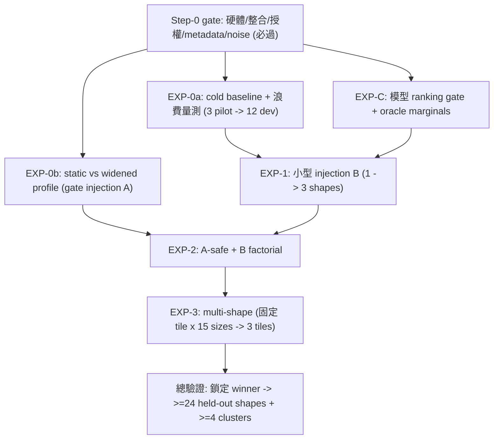

# Ductile 引入 Origami/Formocast 暖啟動 — 實作實驗計畫（gfx942 / MI300X）

> **這份文件是什麼**：把 [surrogate-dse-plan.md](surrogate-dse-plan.md) 的主線（用便宜模型暖啟動 GA、減少實測評估）落到 **gfx942 / MI300X 上的可執行實作實驗**。母計畫講「方向、方法、metric、紀律」；本檔講「**要做哪些實驗、用什麼順序、每步怎麼量、什麼條件才算贏／才算被推翻**」。
>
> **結論來源**：本計畫由 **兩個彼此獨立的 GPT-5.6 Sol subagents（A、B）** 依 `/design-discussion` 流程，經開場立場 → 交互詰問 → 候選共識三輪產生，最後 **A、B 皆明確 `AGREE`**。關鍵 factual crux（Origami 輸出粒度、Ductile `weights` hook、GA 收斂機制、injection A 候選清單）由 orchestrator 直接查核 branch 程式碼確認（見 §1.1）。
>
> **平台範圍**：鎖定 **MI300X（gfx942 / CDNA3）**；MI350（gfx950）為後續 migrate 目標，本計畫不處理。

---

## 0. 一句話定位與現況

**命題**：用 Origami/Formocast 的效能預測來「指導」Ductile GA 的搜尋（**擴候選清單 + 偏重初始採樣**），看能否在**保住品質**的前提下**用更少實測評估**達到同等或更好的 tuning 結果。

**現況（重要，先講白話）**：這是一個**要被實測證明的假說，不是已成定局的整合**。在拿到 held-out 確認結果之前，**不得宣稱有 uplift**。而且——

- 本機目前 `rocminfo` **看不到 gfx942 GPU**（只有 CPU agent）；
- 外部 `TuningDriver`（提供 `--convert-config` 的正式入口）**取得與授權尚未確認**。

所以本檔現階段是**可執行的實作計畫**，其第一步（§2 Step-0）就是把這些前置條件逐項驗證通過；**Step-0 未過，不進 GPU 實驗、不下任何效能結論**。

### 0.1 範圍邊界（scope guardrail）

| 允許動的 | 明確不動 |
| --- | --- |
| injection A：**只擴不砍**每個 gene 的候選清單（widen-only） | kernel / codegen / IR |
| injection B：用模型預測設 per-gene 採樣 `weights`（現成 hook） | GA operator（crossover/mutation/selection/survival）本體 |
| 讀取 Origami/Formocast 分數、產生 `weights`、選擇要擴的合法值 | GA 的 fitness 機制（仍是實測 GFLOPS） |

> 白話：我們只改「**GA 從哪裡開始找、往哪偏重找**」，不改「**它怎麼判斷誰好（實測 GFLOPS）**」，也不生新 kernel。這條界線讓「模型出錯」最多只浪費一些評估，不會污染正確性。

---

## 1. 為什麼這個接法可行（已查核的關鍵事實）

### 1.1 orchestrator 直接查核的 branch 程式碼證據

這幾點決定了整個計畫成不成立，已逐一在 branch 程式碼上確認（非只讀文件）：

1. **Origami 是「整個 config」層級評分，不是 per-gene**：`shared/origami/include/origami/origami.hpp:93` 的 `rank_configs(problem, hardware, const std::vector<config_t>& configs, model)` 吃一整包 `config_t`、回傳依效能排序的 `prediction_result_t`。→ 所以要餵 per-gene 的 `weights`，**必須先把 config 層分數邊際化成 per-gene**（§4 的核心機制）。
2. **injection B 的 hook 天生就吃 per-gene per-candidate 權重**：`origin/ductile_integration` 的 `ductile/algorithm/ga.py:58-59,131-144`，`GA.__init__(weights: list[dict[str, list[float]]], weight_beta=0.25)`；對每個 `{gene: w}` 會檢查 `space.sizes[k] == len(w)`（一個候選一個權重），再做 `w = np.exp(-weight_beta*(w - w.min())); probs[k] = w/w.sum()`。**關鍵語意：`w` 越小 → 機率越高（`w` 是「成本」）**，所以 Origami/Formocast 預測的 latency 可以**直接當成本代入**。`space.py:17` 的 `sample_chunk` 用 `rng.choice(s, p=p.get(k, None))` 逐 gene 採樣。
3. **「更快但更差」的收斂機制真實存在**：`ga.py:53` `div_thr=0.5`、`:115` `large_space` decay、`:190` `f_avg/f_max` 停滯就 `StopIteration`、`:192-194` `diversity < div_thr` 切 `low_diversity` decay。→ 暖啟動壓低初始多樣性，**可能**觸發更快縮群 + 更早停 + 鎖進較差山頭（§6 專門量這件事）。
4. **injection A 就是改候選清單、不碰 codegen**：`origin/users/pkamd/geko_pr` 的 `.../hw_profiles/gfx942/optimization_param.py:343-484`，`GFX942GAParams`（寬）vs `GFX942Params`（窄）；`_compute_grvw()` 回 `[-1,-2] + list(valid[min..max])`（`valid=(1,2,3,4,6,8,16)`——注意 GEKO 的 GA profile GRVW **靜態上限只到 16**，而 `ValidParameters` 的硬天花板是 `[-2,-1,1,2,3,4,6,8,16,32]`）、`DepthU=[32,64,128,256,512,1024]`、`WorkGroupMappingXCC=[1,2,4,8,16]`。

### 1.2 兩個 hard boundary（決定「只擴不砍」）

- **gene 是候選清單的整數索引**：清單外的值 `_initKernel` 會 raise、fitness 無定義，**任何搜尋都碰不到**（[../geko-ductile/ga-faq-clarifications.md](../geko-ductile/ga-faq-clarifications.md) Q17）。→ 硬砍候選＝把模型誤差變成 GA 的天花板，所以 injection A **正式版只擴不砍**。
- **`weights` 只影響「初始採樣」**：`mutation` 選新值仍是均勻抽（`ductile/core/mutation.py`、[../geko-ductile/ga-algorithm-implementation.md](../geko-ductile/ga-algorithm-implementation.md) §11.2）。→ **不宣稱有「逐世代退火」能力**；模型影響天然集中在第 0 代，之後由實測 GFLOPS 演化接手。

---

## 2. Step-0：前置存取 / 授權 / 整合 gate（**必過才進 GPU 實驗**）

> 白話：先確認「機器在、程式能整合建置、baseline 定義乾淨、Formocast 拿得到正確 metadata、量測噪音可控」，否則後面全部數字都不可信。

1. **硬體**：`rocminfo` 明確顯示 `gfx942`（確認 MI300X、CU 數、device id）；取得獨占 GPU 或至少記錄同機負載/時脈/溫度；記錄 ROCm / driver / firmware；跑一個「單 kernel 產生 → 編譯 → benchmark」smoke test。
2. **凍結三個 revision 並整合建置**：Ductile `origin/ductile_integration`、GEKO `origin/users/pkamd/geko_pr`、Origami/Formocast working-tree HEAD。建可重現 integration build；跑 Ductile unit tests、GEKO config-generator tests、Origami/Formocast tests（含 gfx942 prediction）。
3. **外部 TuningDriver 向 owner 確認**：artifact 位置、`--convert-config` 是否仍是正式入口、license / 內部使用權、其輸出是否等同 `GFX942GAParams`。
4. **驗證參數轉換鏈**：Ductile full config → Tensile derived solution → `origami::config_t`；`-1/-2` 這類 auto sentinel 必須先解析成實際值，不能原封餵進 unsigned 欄位；Formocast 需要的 metadata（occupancy、effective GSU、`MathClocksUnrolledLoop`）必須來自真正的 `ContractionSolution::getSizeMapping()`。
5. **確認 production 的 fitness 聚合**：`soo` / `reduce_fn` **要從實際生成的 YAML 讀**，不可由 defaults 推定。（證據矛盾：`defaults.yaml` 是 `soo=False → np.max`；但 `bf16_tn_multi_size_single_kernel.yaml` 是 `soo:true → np.mean`；會議摘要 §3.4 又說 macro-tile workflow 用 average。）所有比較 arm 必須固定成**同一種 fitness**。
6. **噪音 pilot**：先 5 warmup + 20 timed iterations 取 median；若重測 CV > 0.5% 就加 iteration；**所有最終冠軍另做 7 次獨立重測**。

**目前狀態**：Step-0 **未通過**（無可見 gfx942、TuningDriver 未確認）→ 本檔只設計、不執行、不下結論。

---

## 3. Baseline 命名規則（避免把 proxy 講成 original）

> 為什麼要立規則：若外部 TuningDriver 拿不到，只能用 GEKO profile 近似；此時**任何「贏過原始 Ductile」的措辭都會失真**。

- 只有**重現了外部 TuningDriver 輸出**（且 `weights=None`）的 cold 跑，才可稱 **「original Ductile cold uniform baseline」**。
- 否則一律稱 **「Ductile-on-GEKO gfx942 GA-profile cold proxy baseline（`geko_pr`）」**；結果只能寫 **「beats the GEKO-profile proxy」**，**不可寫「beats original Ductile」**——除非 owner 書面確認兩者語意等價。

---

## 4. 核心機制：把 config 層分數轉成 per-gene 權重

### 4.1 模型選擇：Formocast 為主、Origami estimation 為對照

| 模型 | 角色 | 理由 |
| --- | --- | --- |
| **Formocast**（simulation） | **主要 guidance 模型**（non-StreamK） | 讀取 Ductile 實際要調的較多參數（`DepthU`、GSU、`PrefetchGlobalRead`、GRVW、VectorWidth、DTV）。macro tile 固定後，這些才是真正的自由度 |
| **Origami**（estimation） | **快速對照臂** + **StreamK cohort 的模型** | 快、支援 StreamK；但 macro tile 固定後，可能對大量剩餘 gene 無辨識力（給不出區別） |
| self-trained surrogate | **僅循環依賴診斷 / oracle**，非主模型 | 未觀測合法值屬外插問題，physics-based 模型較合理 |

- **cohort 分離**：non-StreamK（Formocast）與 StreamK（Origami）是**兩個獨立 cohort**，各自要**獨立通過相同驗收**，之後才可稱「routed Origami/Formocast system」。
- **循環依賴緩解**（Origami 已用於上游 mapping/selection）：**判斷一律用 held-out 真實 benchmark**、加 **shuffled-weight control**、先過 **EXP-C ranking gate**。

### 4.2 統一的邊際化程序（config 分數 → per-gene `weights`）

> 白話：Origami/Formocast 只會替「一整組 config」打分，但 hook 要的是「每個 gene 的每個候選值各一個權重」。做法是——**大量抽合法 config 打分，再把分數依『某個 gene 取某個值』分組平均**，得到「這個值平均而言好不好」，轉成偏重權重。

1. **目標分布**：baseline 候選清單的均勻乘積分布，條件化於 `_initKernel-valid`。
2. **抽樣（global-uniform + conditional top-up）**：
   - 先抽 global-uniform 的合法整組 config（pilot **1,024**；dev/confirm **8,192**），為每個 shape 建立「模型 latency 的經驗百分位 CDF」。
   - 再對每個 `(gene g, value v)` 做 **conditional top-up**：固定 `X_g=v`、其餘均勻抽，補到足夠 support（pilot 每 `(g,v)` **≥64**；dev/confirm **≥256**）。
   - 每 shape / cluster 上限 **32,768** 次模型評分；top-up 樣本只用於它自己的 `(g,v)`；因目標條件分布一致，**用 unit weight，不需 importance correction**。
3. **效用**：`r_i =` config latency 的百分位 rank（0 最好）；`u_i = exp(-λ r_i)`。
4. **條件 shrinkage mean**：`μ̂_{g,v} = (Σ u_i + α·ū) / (n_{g,v} + α)`；`q_{g,v} = μ̂_{g,v} / Σ_v μ̂_{g,v}`。
5. **ε-uniform 保底**：`p_{g,v} = ε/|V_g| + (1-ε)·q_{g,v}`。
6. **餵 hook**：`w_{g,v} = -log(p_{g,v}) / weight_beta`，順序**嚴格依 `SearchSpace.map[g]`**，寫進 `Backend.Config.weights`（候選清單仍由 `forkParams` 提供）。
7. **超參數 λ、α、ε**：在 development 上調、**holdout 前凍結**（dev grid：`λ∈{2,4,8}`、`ε∈{0.1,0.2,0.3}`、`α∈{1..16}`）。
8. **Bootstrap 95% LCB 不當機率用**（避免把不確定性偷渡成隱性 pruning）；只用於：(i) A-safe 新值 admission、(ii) marginal 穩定度回報、(iii) ranking gate。
9. **多 shape**：先算每個 config 的 per-shape 效用，用該 run **實際的 `reduce_fn`** 聚合（`np.max→max`、`np.mean→mean`），再邊際化。
10. 模型**無法映射 / 完全不敏感**的 gene → 維持 uniform。

**主要失敗模式（誠實記錄）**：per-gene 獨立邊際會**丟失 gene 間相關性（epistasis）**——可能產生「每個值單看都好、組起來卻差」的 Frankenstein config。防線見 §4.3。

### 4.3 Epistasis 的處置（已定案：純 factorized）

- 主設計**純 factorized**：**不把 pairwise / joint 分布餵給獨立的 per-gene `probs` hook**（結構上無法忠實還原）。
- 允許的緩解**僅限**：既有 `group_i`（保住已知硬耦合）、ε-uniform、`_initKernel` validity filter、實測 GFLOPS selection、shuffled-weight control、dev-only 的 real-score **oracle marginals**。
- **判準**：若連 oracle factorized marginals 都幫不上 GA → 結論是「**現有 factorized injection-B hook 表達力不足**」。whole-individual pre-screening 是**另一條 injection path、本輪 scope 外**（不可偷渡進正式 treatment）。

### 4.4 Injection A 的正式定義（widen-only）

- **定義**：`V_A(s) = V_0 ∪ {model-selected legal extras}`，**永遠保留全部 `V_0`**。新值需滿足：(i) 不在 `V_0`；(ii) 取得足夠合法 conditional completions；(iii) enrichment 相對 `V_0`-mean 的 bootstrap 95% LCB > 1；(iv) **每 gene 最多加 2 個**；(v) 仍分到 ε-uniform 機率。多 shape 的新值來自 **cluster-level 聚合後的 whole-config 效用**（不是無限制的 per-shape union），並套每 gene 上限。
- **A-hard（真的刪值）永不當 GPU arm、永不上線**：只做 offline oracle-deletion check（保留覆蓋 95% model mass 的最少候選）——若會刪掉任一 remeasured champion、或 attainable median 掉 >1%、或刪掉 >5% 的 top-1% 真實 config → **永久否決 hard pruning**。通過也只代表「此 dev pool 沒抓到問題」，不證明 held-out 安全。

---

## 5. 實驗流程：小 → 大 → 總驗證

> 分工：**EXP-0a/0b/C 是便宜的 gate**（在投入完整 GA 前判斷「有沒有腿」）；**EXP-1→2→3 逐步擴大**；最後**總驗證**在封存的 held-out 真實 workload 上判成敗。

### EXP-0a — cold baseline 與浪費量測
- **假設**：cold GA 在固定 ~1.5 萬預算內有 seed 不穩定，或 30 代後仍有可取得的 headroom（成立才有暖啟動空間）。
- **資料**：3 個 pilot → 12 個 dev **真實 hot shape**（由 `summary.csv` runtime 貢獻排序選出，**不可由 Origami 選**），涵蓋 compute/memory-bound、small-K、transpose、skinny/square。
- **步驟**：`weights=None`、`V_0`、defaults（`pop=512/n_gen=30/period=5/div_thr=0.5`）、**≥5 paired seeds**；另外 `period=0` 固定 horizon 跑 `n_gen=30/60/90`（1×/2×/3× 預算曲線，**這是診斷、不是 baseline 本身**）。
- **metric**：`best` vs 實際 `n_evals` 的 anytime 曲線、seed IQR/CV、30→90 邊際增益、invalid/dup rate、「最後一次 ≥1% 改善後還花了多少 % 評估」、diversity/pop/termination 軌跡。
- **gate**：若 ≥80% dev shape 的 seed-spread <1% **且** 30→90 增益 <1% → headroom 太低 → 降級（只做最小 B smoke test）。

### EXP-0b — static vs widened profile（gate injection A）
- **假設**：`V_0` 漏掉了合法且有用的值。
- **步驟**：`V_0` vs `Vwide`（由 `ValidParameters` 建，但**一律經 `_initKernel` filter**——注意 `ValidParameters` 列出 ≠ 對該 dtype 合法，真正判準是 `_initKernel`）；一次只擴一組（GRVW → DepthU → WGM）再測 union；同 seeds，比**相同實際 `n_evals`**。
- **A-gate**：若所有新增 family 都沒有 ≥1% median uplift、只造成稀釋 → **淘汰 injection A、只留 B**。
- **注意**：候選 cardinality 改變會影響 adaptive population（`large_space`/`low_diversity`），**不能只比世代數**。

### EXP-C — 模型 ranking gate + oracle marginals
- **步驟**：在 dev shape 上實測 256 個整組 config；算 Origami、Formocast 的 Spearman / Kendall / top-10% recall / top-decile lift。
- **通過門檻**：median Spearman **≥0.25** **且** top-decile lift **≥2× random**。
- **oracle marginals（診斷用）**：用真實分數建 factorized marginals，定位失敗來源——(a) 模型 whole-config 排名差、(b) 排名好但邊際化失真、(c) hook 本身表達力不足。
- **falsify**：Origami、Formocast **都過不了** → **本輪 model-guided thesis 停止**，不浪費完整 GA 預算。

### EXP-1 — 小型 injection B（1 → 3 shape）
- **arm**：`B0` uniform；**shuffled-weight control**（把模型權重在候選間隨機重排、保持相同 entropy，用來排除「任意集中初始族群都會變快」）；`Origami-B`；`Formocast-B`。
- **步驟**：先 plumbing smoke（`pop=64/n_gen=5/period=0`）驗管線，再用完整設定、**≥5 paired seeds**、配對且隨機化執行順序。
- **通過**：相對 `B0`，median `E99` **少 ≥15%**、最終 verified GFLOPS **≥99%**，且**贏過 shuffled control**。

### EXP-2 — A-safe + B factorial
- **arm**：`V0+uniform`、`V0+B`、`A-safe+uniform`、`A-safe+B`、`Vwide+uniform`（稀釋對照）。
- **保留 A 的條件**：`A-safe+B` 相對 `V0+B` 再降 `E99` **≥15%** **或** matched-budget GFLOPS uplift **≥1%**，且品質不退 >1%；否則**只否證 A**（不影響 B）。

### EXP-3 — multi-shape 擴張
- 固定 macro tile、**15 個 guidance sizes** → 再擴到 **3 個 tile**；每個 tuned kernel 另在 **100 個獨立真實 sizes** 上驗證（tuning / judgment shape 完全分離，對齊會議 §3.2–3.3）。
- **報告**：per-shape efficiency、geomean、**P10**、worst-case、regression shape 數——**不能只報平均**。

### 總驗證（overall confirmation）
- **看 holdout 前先鎖定唯一 winner**：若 `A-safe+B` 相對 `B` 再省 ≥5% 評估且無品質/invalid 問題 → 選 `A-safe+B`；否則選 `B` 並結論「A 無增益」。
- **protocol**：**≥24 個封存真實 shape**（分層）+ **≥4 個封存 multi-shape cluster**；primary = `period=0` 固定預算、比相同實際 `n_evals` 的品質；operational secondary = 原 `period=5`（量真實早停 + wall time）；隨機交錯、同 GPU/時脈/iteration；冠軍 7× median + 數值正確性檢查；**hierarchical bootstrap 以 shape 為 cluster**。
- **seeds**：預設 **5 paired**，預先訂好「CI 寬度超過門檻就升到 10」的規則；**shape 是主要推論單位**（seed 不可假裝成獨立 shape）。

---

## 6. 「更快但更差」子量測（每個 warm-start arm 必做）

> 為什麼單獨列：暖啟動可能「評估更少、結果卻更差」（低初始多樣性 → 更快縮群 → 更早停 → 鎖進較差山頭）。這不是泛泛的 premature convergence，是與 Ductile 具體機制的交互，**必須實測**。

- **每代記錄**：diversity + 第一次跌破 `div_thr=0.5` 的世代；population size + decay mode；實際 `n_evals`；`f_avg`/`f_max`；termination 世代/原因/wall time；best config。
- **basin 判定**：先以「**完全解析後的 categorical config**」做初步分群（normalized Hamming 只當粗略輔助）。要宣稱「**不同且更差的 basin**」，**必須**對去重後冠軍做「one-gene 鄰域實測 + deterministic local ascent」確認；沒有這個預算，只能稱「**不同 config cluster**」，不可稱「basin」。

---

## 7. 驗收標準與否證條件

> 兩條**互斥**路徑；**所有門檻都是「預註冊的研究門檻」，尚待 owner 確認為團隊採用政策**（團隊目前唯一有文件的政策是「geomean uplift >3% 才 merge」，critical-shape 容忍度仍是 "uncharted"）。
>
> 參考量：`Q_cold,s =` cold `B0` 在相同最大預算下最終重測 GFLOPS 的 median；`N@99%Qcold =` 首次達到 `0.99·Q_cold` 的實際評估數（未達視為 right-censored）。

### Route 1 — tuning 效率改善（以下**全部**成立才可宣稱「暖啟動加速 Ductile tuning」）
1. `N@99%Qcold` point estimate **少 ≥20%**，且 shape-clustered bootstrap 95% LB **少 ≥10%**。
2. 最終 GFLOPS geomean ratio 的 95% LB **≥0.99**（非劣）。
3. 每個 preregistered critical shape 的 median regression **≤3%**，且全 shape 的 **P10 ratio ≥0.98**。
4. end-to-end wall-clock（**含**模型評分 / mapping / validity sampling / 編譯 / benchmark）**省 ≥15%**，且 95% CI LB > 0。
5. 無新增數值正確性失敗。
6. natural-stop arm **無**經確認的 faster-but-worse basin。
7. **贏過 same-entropy shuffled control**（不是只贏 uniform）。

### Route 2 — 固定預算下的 kernel 品質提升（**只在 Route 1 速度未過時**）
- matched-budget GFLOPS uplift **≥1%** 且 95% CI LB > 0，並仍滿足 Route 1 的 (2)/(3)/(5)/(6)。
- **必須**寫成「same-budget quality uplift」，**絕不可**當成 tuning speedup，也不能用它救回 combined 速度 claim。

### 否證條件（falsification）
- Origami、Formocast **都過不了** EXP-C ranking gate → 本輪 model-guided thesis 停止。
- 模型 marginals 失敗、但 oracle marginals 成功 → **否證該模型，不否證 hook**。
- oracle marginals 也失敗 → **否證現有 factorized injection-B hook**。
- `A-safe+B` 相對 `B` 無增益、或增加 invalid/dilution → **只否證 injection A**。
- 鎖定 winner 在 holdout 上 **Route 1、Route 2 皆未過** → 否證「Origami/Formocast + Ductile 有 measurable improvement」。
- 任何正確性 regression、或持續的 faster-but-worse basin → **阻擋 deployment**，不論省了多少評估。
- 兩個模型可**各自獨立失敗**，不自動否決另一個。

---

## 8. 殘餘不確定性與風險（已記錄，非阻擋）

- 本機目前**無可見 gfx942**；所有 runtime 數字尚未驗證。
- 外部 `TuningDriver` 位置 / 授權未知；repo 內只找到文件引用。
- production `soo`/`reduce_fn` 待從**實際生成 YAML** 查證（不可由 defaults 推定）。
- Ductile gene → `config_t`/`tensile_params_t` 的完整逐欄映射尚未驗證。
- Formocast 在 gfx942 真實 Ductile 搜尋空間上的 ranking 品質**未量化**；MI350 的約 +5% 是 **selection 層**數字，**不能**當 gfx942 GA warm-start 的 effect-size 先驗。
- **GPU 預算風險**：能否支撐 ≥24 shapes / 5 seeds / 4 clusters 未知。**若不足，降級結論強度（標為 underpowered pilot），不得降門檻後仍宣稱 confirmatory success。**
- **根本表達力風險**：per-gene 邊際無法表達 epistasis；這是 factorized injection-B 的天生上限（§4.3 已定緩解與判準）。

---

## 9. 結論來源與後續

- **產生方式**：dual-agent（GPT-5.6 Sol A、B）獨立開場 → 交互詰問 → 候選共識，**A、B 皆 `AGREE`**；factual crux 由 orchestrator 查核 branch 程式碼（§1.1）。
- **交互詰問改變/強化的關鍵點**：(1) config→per-gene 從兩種抽樣法收斂為「global-uniform + conditional top-up、unit weight」單一程序；(2) epistasis 定案為「純 factorized + oracle-marginals gate」，pairwise 不偷渡進獨立 hook；(3) A-hard 收斂為「只做 offline oracle check、不花 GPU、不上線」；(4) baseline 命名規則統一（proxy 不得簡稱 original）；(5) 驗收收斂為速度/品質兩條互斥路徑 + 明確 falsification。
- **後續（需實跑補齊，本計畫不代填）**：Step-0 各項的實測結果；EXP-0a/0b/C 的 gate 數字；EXP-1/2/3 的取捨曲線與 per-shape 報告；mentor / owner 對門檻（20%/1%/3%）與 TuningDriver 授權的定案。
